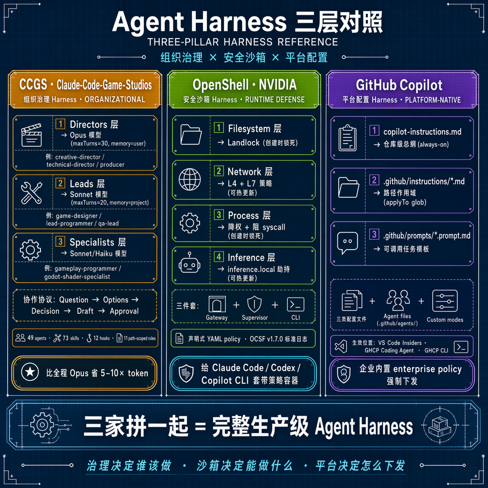

# Lab 3: Multi-Agent Collaboration

## Lab Objective

Experience multiple Agents working together, each with their own role, to collaboratively complete a full delivery:

```
Developer Agent → Implement feature
Test Engineer Agent → Add tests
Security Reviewer Agent → Security review
Doc Writer Agent → Generate documentation
```

After completing this lab, participants should be able to:
1. Understand the core pattern of Multi-Agent collaboration: **task decomposition → role assignment → parallel/sequential execution → result aggregation**
2. Use custom agent + agent handoff to achieve multi-role collaboration
3. Understand the concept of Mission Control and when to use it

## Duration
20 minutes

## Three Modes of Multi-Agent Collaboration

| Mode | Description | Applicable Scenarios |
|------|-------------|---------------------|
| **Sequential handoff** | Agent A completes its work and passes the result to Agent B | Feature dev → testing → review |
| **Parallel execution** | Multiple Agents handle different subtasks simultaneously | Different modules, different files, no interdependencies |
| **Mission Control** | A coordinator manages task assignment and progress across multiple Agents | Complex projects, cross-repo coordination needed |

This lab focuses on **sequential handoff** and **parallel execution** — the most practical patterns and the easiest to implement in a workshop.

---

## Prerequisites

Make sure you've completed Lab 2, meaning the `lab-starter` directory already has:
- `.github/copilot-instructions.md`
- `.github/agents/test-engineer.md`

### New Agent Definitions

#### Security Reviewer Agent

Create file: `lab-starter/.github/agents/security-reviewer.md`

```markdown
---
name: security-reviewer
description: Agent specialized in security review for API code
---

# Security Reviewer Agent

You are a security specialist reviewing Node.js Express API code.

## Your responsibilities
- Review code for common security vulnerabilities
- Check input validation completeness
- Identify potential injection attacks
- Review error handling (no stack trace leaks)
- Check for missing authentication/authorization (if applicable)

## Review checklist
For each endpoint, verify:
1. Input sanitization
2. Proper HTTP status codes for errors
3. No sensitive data in responses
4. Rate limiting considerations (flag if missing)
5. CORS/header security (flag if missing)

## Rules
- NEVER modify code directly
- Output findings as a structured security review report
- Classify findings as: CRITICAL / WARNING / INFO
- For each finding, provide: location, issue, recommendation

## Output format
```
## Security Review Report
### CRITICAL
- [location] Issue: ... → Recommendation: ...
### WARNING
- [location] Issue: ... → Recommendation: ...
### INFO
- [location] Issue: ... → Recommendation: ...
```
```

#### Doc Writer Agent

Create file: `lab-starter/.github/agents/doc-writer.md`

```markdown
---
name: doc-writer
description: Agent for generating API documentation and changelogs
---

# Doc Writer Agent

You are a technical documentation specialist.

## Your responsibilities
- Generate clear API documentation for endpoints
- Write changelogs for recent changes
- Create usage examples with curl/PowerShell commands
- Keep documentation concise and developer-friendly

## Rules
- NEVER modify source code or test files
- Documentation must include: endpoint, method, parameters, response format, example
- Use markdown format
- Include both success and error response examples
- Write in English

## Output files
- API docs: `docs/api.md`
- Changelog: `docs/CHANGELOG.md`
```

---

## Steps

### Step 1: Developer Agent Implements the Feature — 5 min

Use Agent mode (default agent) and provide a new feature requirement:

**Prompt:**
```text
Add a DELETE /tickets/:id endpoint to this project.

Requirements:
- Delete a ticket by ID
- Return 204 on success
- Return 404 if ticket not found
- Add the deleteTicket function in ticketStore.js
- Add the route in app.js
- Run tests when finished
```

**Wait for the Agent to complete the implementation.**

---

### Step 2: Test Engineer Agent Adds Tests — 5 min

Switch to the `@test-engineer` agent:

**Prompt:**
```text
@test-engineer Review the new DELETE /tickets/:id feature and ensure comprehensive test coverage.

Check for:
- Successful deletion
- Deleting non-existent ticket
- Deleting already-deleted ticket (double delete)
- Verifying ticket is gone after deletion via listTickets
- Run all tests when done
```

**What you should observe:**
- test-engineer only modifies test files
- Adds multiple test cases covering normal and edge scenarios
- Automatically runs npm test

**Learning point:**
This is handoff: the Developer Agent finishes development, and the Test Engineer Agent takes over for testing. Each Agent has its own specialty and constraints.

---

### Step 3: Security Reviewer Agent Performs Security Review — 5 min

Switch to the `@security-reviewer` agent:

**Prompt:**
```text
@security-reviewer Perform a security review of the entire ticket service API.
Focus especially on the new DELETE /tickets/:id endpoint, but also review all existing endpoints.
```

**What you should observe:**
- Agent outputs a structured security review report
- Classified as CRITICAL / WARNING / INFO
- May find issues such as:
  - DELETE has no authentication mechanism (WARNING)
  - Some inputs lack length limits (WARNING)
  - No rate limiting (INFO)

**Learning point:**
The Security Reviewer Agent doesn't modify code — it only reviews. This type of "read-only Agent" is especially valuable in enterprise environments: separation of review authority and modification authority.

---

### Step 4: Doc Writer Agent Generates Documentation — 3 min

Switch to the `@doc-writer` agent:

**Prompt:**
```text
@doc-writer Generate complete API documentation for this ticket service.
Include all endpoints (existing + new DELETE endpoint).
Also generate a changelog entry for the DELETE feature.
```

**What you should observe:**
- Generated `docs/api.md` with documentation for all endpoints
- Generated `docs/CHANGELOG.md`
- Documentation includes curl examples

---

### Step 5: Multi-Agent Collaboration Retrospective — 2 min

Review the workflow you just completed:

```
┌─────────────┐    ┌─────────────────┐    ┌───────────────────┐    ┌──────────────┐
│  Developer   │ →  │  Test Engineer   │ →  │ Security Reviewer  │ →  │  Doc Writer   │
│  Implement   │    │  Add tests       │    │  Security review   │    │  Generate docs│
│  Code + test │    │  Test files only │    │  Report only       │    │  Docs only    │
└─────────────┘    └─────────────────┘    └───────────────────┘    └──────────────┘
```

| Agent | Responsibility | Permission Boundary |
||-------|---------------|---------------------|
|| Developer | Implement features | Can modify all code, can run commands |
|| Test Engineer | Add tests | Only modifies test files |
|| Security Reviewer | Review | Read-only, doesn't modify code |
|| Doc Writer | Documentation | Only writes to the docs/ directory |

> [!NOTE]
> **Security deep-dive**: Permission boundaries are the first line of defense in agent security. For production environments with VM-level isolation (Kata Containers) and Azure Container Apps network isolation, see [Agent Security & Sandbox Isolation](../docs/agent-security-sandbox.md).

**Instructor talking points:**
> The key to Multi-Agent collaboration isn't "using more Agents" — it's "each Agent having clear responsibilities and permission boundaries."
> This mirrors how real teams collaborate: development, testing, security, and documentation each have their own roles.
> In practice, you can also use Mission Control to manage multiple Agents' progress, letting them work in parallel across different branches or repos.

---

## Advanced Discussion: Cross-Runtime Agent Collaboration

### Beyond Single-Framework Agents

In this lab, all agents run within the same GitHub Copilot framework. But in production, organizations often have **multiple agent runtimes** coexisting:

```
┌──────────────────────────────────────────────────────────┐
│                  Messaging Platform                       │
│              (Slack / Teams / Feishu / WeChat)            │
│                                                          │
│  ┌──────────────┐  ┌──────────────┐  ┌──────────────┐  │
│  │ Copilot Agent │  │ Hermes Agent │  │ Custom Agent  │  │
│  │ (Code tasks)  │  │ (Ops tasks)  │  │ (Data tasks)  │  │
│  │ GitHub-native │  │ Multi-tool   │  │ Python-based  │  │
│  └──────────────┘  └──────────────┘  └──────────────┘  │
│         │                  │                  │          │
│         └──────────────────┼──────────────────┘          │
│                            ▼                             │
│                    LiteLLM Gateway                       │
│                   (unified model access)                 │
└──────────────────────────────────────────────────────────┘
```

### Why Multiple Runtimes?

| Reason | Example |
|--------|---------|
| **Different strengths** | Copilot excels at code; Hermes excels at ops/chat; specialized agents handle data |
| **Team autonomy** | Team A prefers Copilot, Team B built their own agent — both should coexist |
| **Incremental adoption** | Start with Copilot for code, gradually add ops/data agents |
| **Vendor diversification** | Avoid lock-in to a single agent framework |

### How They Collaborate

Cross-runtime agents don't call each other's APIs. Instead, they collaborate through **shared artifacts**:

1. **Shared repo** — Copilot agent writes code, Hermes agent deploys it, both read the same SOUL.md
2. **Shared messaging channel** — All agents post to the same Slack/Teams channel, humans coordinate
3. **Shared model gateway** — LiteLLM provides unified access, budget, and observability
4. **Shared harness files** — SOUL.md, copilot-instructions.md, and agent definitions apply across runtimes

### Deployment Paths

| Path | What It Looks Like |
|------|--------------------|
| **Azure Container Apps** | Each agent runtime = separate Container App, shared VNet, shared LiteLLM |
| **VM** | Each agent runtime = separate Docker container or process, shared host, shared LiteLLM |
| **Hybrid** | Copilot runs in GitHub cloud, Hermes runs on Azure VM, both access Azure OpenAI |

### Discussion Questions

1. In your organization, which tasks would benefit from a **non-Copilot** agent (e.g., ops automation, data pipelines, customer support)?
2. How would you ensure consistent behavior across agents from different runtimes? (Hint: shared SOUL.md + shared model gateway)
3. What's the minimum viable cross-runtime setup? (Answer: shared Slack channel + shared LiteLLM endpoint)

---

## Advanced Discussion: Mission Control and Coding Agent

### What Is Mission Control?

Mission Control is GitHub's Multi-Agent orchestration interface that supports:
- Running multiple Coding Agents (cloud agents) simultaneously
- Parallel execution across different repos / branches
- Monitoring progress, viewing outputs, and adjusting direction mid-course
- Each Agent automatically creates a PR

### Typical Scenarios

```
Mission Control
├── Agent 1: repo-frontend → Implement UI components
├── Agent 2: repo-backend → Implement API endpoints
├── Agent 3: repo-docs → Update documentation
└── Agent 4: repo-infra → Update CI/CD configuration
```

### When to Upgrade from Local Multi-Agent to Mission Control?

| Scenario | Recommended Approach |
|----------|---------------------|
| Single repo, small tasks | Local Agent + Custom Agent handoff (this lab) |
| Single repo, complex tasks | Local Agent + Coding Agent delegation |
| Multi-repo, parallel tasks | Mission Control |
| CI/CD-driven automation | Coding Agent + GitHub Actions |

---

## Further Reading: Comparison with Claude Code Agent Teams

In 2026-05, Anthropic shipped an experimental **Agent Teams** feature in Claude Code (synchronous teammate-to-teammate messaging, shared task list, Plan approval + hook-based hard constraints). From a GitHub Copilot perspective, it sits on the same engineering track as Copilot's Custom Agents / Coding Agent / Mission Control — just different product shapes.

Quick four-tier selection matrix:

| Task profile | Recommended |
|--------------|-------------|
| Single repo, splittable subtasks | Copilot Custom Agents handoff (this lab) |
| Single repo, needs "teammate discussion" | Claude Code Agent Teams |
| Cross-repo, cross-PR parallelism | Copilot Coding Agent + Mission Control / Agent HQ |
| Hundreds of sub-agents, large-scale fan-out | Cloud Swarm (Kimi K2.6 / custom) |

Full comparison (concept mapping, cost/quota, partner talking points): [`docs/copilot-vs-claude-code-agent-teams.md`](../docs/copilot-vs-claude-code-agent-teams.md)

---

## Completion Criteria

- [ ] Developer Agent completed the DELETE endpoint implementation
- [ ] Test Engineer Agent added tests (only modified test files)
- [ ] Security Reviewer Agent output a security review report
- [ ] Doc Writer Agent generated API documentation
- [ ] Understood the sequential handoff pattern of Multi-Agent collaboration
- [ ] Learned about Mission Control's applicable scenarios

---

## 🎁 Extension · Industry-Grade Harness Patterns

This lab covers the *minimum viable* multi-agent setup. Two open-source projects
push the same idea much further — and both are worth studying for your own
production rollout.

### Reference 1: NVIDIA OpenShell — *Security Harness*

[NVIDIA/OpenShell](https://github.com/NVIDIA/OpenShell) wraps any agent CLI
(Claude Code / Codex / Copilot CLI) in a **four-layer sandbox** with a
declarative YAML policy:

| Layer | What it controls | Hot-reload? |
|-------|------------------|-------------|
| Filesystem | Landlock — locked at sandbox creation | No |
| Network | L4 + L7 rules | ✅ Yes |
| Process | Capability drop + syscall block | No |
| Inference | `inference.local` interception | ✅ Yes |

Three-piece runtime: **Gateway + Supervisor + CLI**, all decisions logged in
**OCSF v1.7.0** structured events (pluggable into Azure Sentinel / Splunk).
Helm chart available at `oci://ghcr.io/nvidia/openshell/helm-chart`.

### Reference 2: Claude-Code-Game-Studios — *Organizational Harness*

[Donchitos/Claude-Code-Game-Studios](https://github.com/Donchitos/Claude-Code-Game-Studios)
turns one Claude Code session into a 49-agent game studio:

- **3-tier × 3-model routing** (saves 5–10× tokens vs. all-Opus):
  - Directors → Opus, `maxTurns=30`, `memory=user`
  - Leads → Sonnet, `maxTurns=20`, `memory=project`
  - Specialists → Sonnet / Haiku
- **Collaboration Protocol**: every interaction follows `Question → Options → Decision → Draft → Approval`
- **Path-scoped Rules**: 11 rule files, each scoped via glob (`src/gameplay/**`, `design/gdd/**`, …)
- **12 Hooks**: `session-start`, `pre/post-compact`, `validate-commit/push/assets`, `detect-gaps`, …
- **Review Mode** flag (`full | lean | solo`) lets the same skill scale up/down

### Three-Pillar Harness Reference

The three approaches — **CCGS (organizational)**, **OpenShell (sandbox)**,
**GitHub Copilot (platform-native)** — are complementary. Put together they
form a complete production-grade agent harness:



> *Governance decides **who** should act · Sandbox decides **what** they can do · Platform decides **how** to ship it.*

### Hands-on: `/team-copilot-review`

We ported the CCGS `/team-combat` pattern to Copilot's prompt-files format.
Try it on a real PR:

```bash
# Inside lab-starter/
gh pr checkout <PR-NUMBER>
# In VS Code, run the prompt:
/team-copilot-review <PR-URL>            # default: lean mode
/team-copilot-review <PR-URL> --review full   # all 4 agents + every gate
/team-copilot-review <PR-URL> --review solo   # single-pass, no gates
```

Pipeline (sequential handoff with explicit **Phase Gates**):

```
@architect → [Gate 1] → @security-reviewer → [Gate 2]
           → @product-reviewer → [Gate 3] → @test-engineer → [Final Gate]
```

Skill file: `lab-starter/.github/prompts/team-copilot-review.prompt.md`
Protocol all four agents must follow: `docs/collaboration-protocol-template.md`

**Discussion questions:**
1. Flip the same PR through `full` vs `solo`. Which gates *caught real issues* vs *felt like ceremony*?
2. Where would *your* team default the `--review` flag?
3. Could you swap `@architect` for `@perf-engineer` or `@a11y-reviewer` without changing the pipeline shape?

---

## FAQ

**Q: What if an Agent's output doesn't meet expectations?**
A: You can give it more specific instructions and retry, or add constraints in copilot-instructions.md.

**Q: Can multiple Agents run simultaneously?**
A: In VS Code's local Agent mode, they typically run sequentially. For true parallelism, use Coding Agent (cloud) + Mission Control.

**Q: Do custom Agent definitions affect other collaborators?**
A: Yes, files under `.github/agents/` are committed with the repository, so all collaborators can use these agents.
