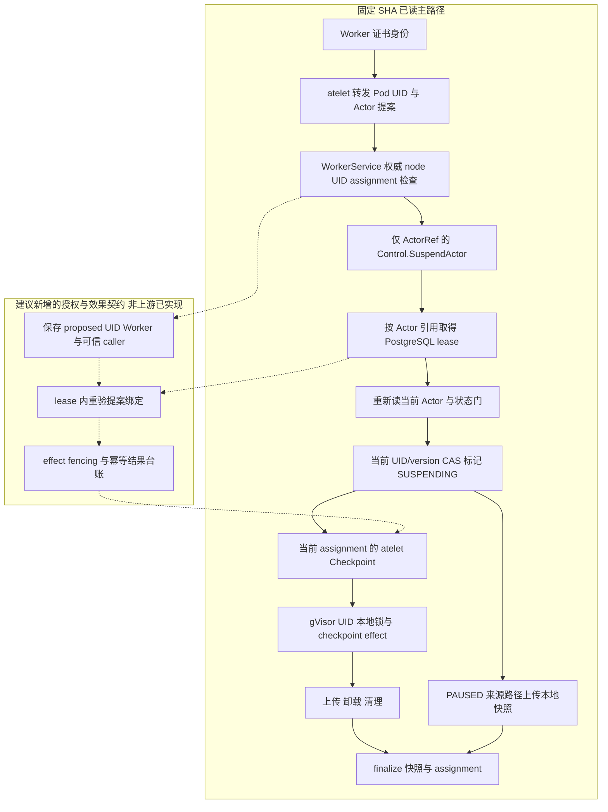

# Agent Substrate：Actor 挂起的身份、lease 与副作用门

日期：2026-10-02｜固定源码：`148df4b0b57759b8f1a7c0fa5bd1372dbf30257f`

**定位：旧源升级新机制，不是首次发现。** 此项目此前已经作为 URL 雷达及 Agent Executor 架构依赖被记录；本次补足 Worker 发起 suspend 到控制面 lease、节点 checkpoint 的源码证据。证据等级为**固定 SHA 静态阅读**，不是已复现漏洞、上游测试通过或部署认证。所有下述 POC：**NOT_RUN**；未运行 Go、上游脚本、集群或真实快照操作。

## 1. 先给结论

- **入口不是相信请求自报身份。** atelet 从 Worker 证书身份取得 Pod UID，再向 WorkerService 转发；WorkerService 验 atelet 证书身份，读权威 Worker/Actor，核对 node、Actor UID、assignment。跨节点、过期 UID、非本人承载的 Actor 返回 `NotFound`，而不是泄漏对象存在性的 `PermissionDenied`。[S1–S3]
- **lease 内确实重新读 Actor，但没有重新检查原提案的 UID/Worker。** WorkerService 转发给 Control 的请求只带 Actor 引用；生产接线是同进程的 `controlSrv`，不是测试假对象；Control 再把 `actorRef` 交给 ActorWorkflow。原先验证的 UID、workerName 未成为 workflow 参数。[S2、S4–S7]
- **这是可以定位的授权快照失效窗口，不能直接宣布为可利用漏洞。** 如果另一个合法生命周期操作在入口检查之后、此请求获取 lease 之前完成并释放 lease，且新状态仍满足 suspend 状态门，workflow 才可能对新状态继续 suspend；如果对方仍持 lease，则返回 `Aborted`。实际触发频率、外部可控性、客户端取消、节点 RPC 及最终快照效果都没有实测。[S2、S7–S11]
- **“后来还有 UID/CAS”不等于“后来再次绑定了原调用者”。** 状态写入的 `PreconditionFrom(actor)` 使用的是 lease 内新读对象的 UID/version；节点请求也用该新对象 UID 与当前 assignment 的 WorkerPodUid。它们防止针对各自观察值的错写或错寻址，但无法恢复已丢弃的原提案 UID/Worker。[S7、S12、S13]
- **预览与愿景边界不能省略。** README 明确 pre-1.0、不保证兼容性；架构文档首段明确大量设计仍为 aspirational、尚未实现。本文不引用 README 性能数字作为实测，也不把 Kubernetes 基础等同于 AKS 已兼容。[S16–S17]

## 2. 实际调用闭包与再次检查位置

以下“实际”指该 SHA 的代码接线，不代表已运行。

| 阶段 | 已读路径与行为 | 是否再次绑定原 Worker 提案 |
|---|---|---|
| Worker → atelet | `ateomsupport.go:159–190` 调用 `authenticatedWorkerIdentity`；转发 Worker 名取证书 PodUID，Actor UID 来自请求，返回错误不包装 | Worker 身份不来自请求；此函数不决定 Actor 当前归属 |
| ateapi 入口身份 | `ateletauth.go:44–80` 要求 TLS peer、证书 URI 匹配 atelet SPIFFE ID、PodIdentity 扩展。`main.go:533–554` 用 `VerifyClientCertIfGiven`；全服务传输层证书可选，WorkerService 方法自身要求证书 | 校验 atelet 所在 node；这不是任意持证 workload 均可调用 |
| 权威对象授权 | `workerservice/suspend.go:58–84,115–136`：GetWorker→node；GetActor→UID 与 assigned worker；golden Actor 在此前被拒绝 | **是，但此时尚未持 Actor lease** |
| 生产接线 | `main.go:267–281,329–330` 将同一个 controlSrv 注入 WorkerService；`service.go:106` 构建真实 ActorWorkflow | 不经过第二次 Control 网络入口；不能臆造一个额外 gRPC 授权拦截层 |
| Control → workflow | `actor.go:504–522` 验请求结构，转 actorRef，调用 workflow | **没有携带原 UID/Worker** |
| lease | `workflow.go:203–224`，key 为 `lease:actor:<atespace>:<name>`，冲突映射 Aborted。PostgreSQL token/TTL、续租与取消见 `lease.go` | 排他范围是引用名；不是原身份授权证明，也不是已验证的端到端 fencing |
| lease 内加载与状态门 | `workflow_suspend.go:58–86,105–164`：GetActor/GetTemplate；SUSPENDED 直接返回；SUSPENDING 可重入；RUNNING/PAUSED 可开始；其他状态拒绝；PAUSED Data→Full 有额外拒绝门 | 重新读**当前对象**，未比较原提案 UID/workerName |
| 数据库写门 | `ensureMarkedSuspending` 使用当前读对象的 UID/version precondition，记录 SUSPENDING 与 snapshot URI | 能检查该次读取后的对象变化；不能识别读取之前已换 incarnation/assignment |
| 节点 RPC | `workflow_suspend.go:213–254` 取当前 assignment.node，Checkpoint 带当前 WorkerPodUid、Actor UID、snapshot URI | 精确寻址当前对象；不含原提案身份 |
| 节点效果 | `atelet/main.go:583–733` 读当前 UID 的 sandbox record、拨目标 ateom、CheckpointWorkload、上传、卸载、清理。gVisor `main.go:633–727` 按收到的 Actor UID 加本地锁，deactivate tunnel、checkpoint/归档、清理容器 | gVisor 路径没有原提案可比较；本地 UID 锁不是控制面授权复验 |
| finalize | `workflow_suspend.go:349–446` 重新读 Actor，调用 releaseWorker，再以 latestActor 的 precondition 写 SUSPENDED、清 assignment/local snapshot，最佳努力释放旧快照 | 又一次当前状态读取；不是原 Worker 提案的复验。releaseWorker helper 的完整竞争闭包未展开 |

**关键边界：** 节点 gVisor 的局部锁确实存在，不能说系统“完全无锁”；控制面 lease 与取消确实存在，不能说“并发操作必然全部成功”。反过来，有锁也不能证明过期提案不会串行地作用于新目标。此次沿 gVisor 主路径追到实际 checkpoint 调用；microVM 后端、全部 dialer/鉴权 helper、存储 SQL 更新实现及完整网络策略不在闭包验证范围，不能推广为全系统安全审计。

### 两种容易混淆的时序

```text
同一 Actor 引用 R，入口时为 UID=u1、Worker=w1：
A: authoritative_check(R,u1,w1)=allow ── B_AUTH_CHECKED 等待 ──────┐
B: 合法 pause/suspend/delete 等操作 → 状态提交 → lease 释放 ──────┤
A: acquire lease(R) → load(R)=当前对象 → 状态门 → checkpoint/upload
```

1. **真正重叠：** A 获取时 B 仍持 lease → Aborted；这是已有保护。
2. **先变更、后顺序执行：** B 已释放 lease，R 已指向新 UID，或同 UID 已迁到 w2 → A 新读到合法 RUNNING 对象，生成新对象的 CAS 与节点请求；入口授权与效果目标可以失去绑定。这是 TODO 指向的候选窗口，不要求两个 workflow 同时持锁。
3. **不要用一次 Resume(RUNNING) 伪造迁移。** `workflow_resume.go:88–113` 对已 RUNNING 的对象有无操作快速返回。迁移测试必须先完成真实 suspend/pause 等状态转换，再 resume 到不同 Worker；仅改 mock assignment 属模型反例，不是实际迁移复现。
4. **pause 先完成不保证后续 suspend 被拒绝。** PAUSED 是普通 suspend 的允许源状态，走 UploadPausedCheckpoint；是否继续还受本地快照与 scope 门约束。源码入口“竞争操作会输给持 lease 者”的注释，不应改写为“之后永远拒绝”。

## 3. 紧凑 POC 故障卡：不只看返回码

### 公共夹具与判定规则

- 在隔离测试环境使用固定 SHA、有效模板与快照配置、测试 Actor `team-a/actor-a`。下文 `u1/u2` 是创建后从权威 store 读取的不同 Actor UID，`w1/w2` 是真实 Worker Pod UID，`n1/n2` 是实际节点名；这些是事件别名，不可把字符串 `u1` 直接当合法请求 UID。禁止客户生产数据；快照桶/目录只含测试数据。
- 分两档：**服务+真实 workflow+可观测 store/RPC 替身**可证明控制流与出站目标；**真实节点档**才可证明 checkpoint、容器、上传和恢复效果。替身计数为零不等于进程零 I/O。
- 拦截点必须为 Event/Barrier：`B_AUTH_CHECKED` 在入口 `checkActorHostedBy` 成功后、调用 suspender 前；`B_LEASE_HELD` 在获取成功后；`B_ACTOR_LOADED` 在 lease 内重读后；`B_CHECKPOINT_ENTERED` 在节点效果入口；`B_EFFECT_COMMITTED` 在快照持久化确认后。测试需要新加可观测 hook，**不是仓库现成接口**。等待均有有界超时，失败路径 finally 释放 barrier 并 join；不得用 sleep 猜重叠。
- 关联事件至少记录：`request_id, actor_ref, proposed_uid, observed_uid, proposed_worker, observed_worker, node, stage, rpc_target_pod_uid, snapshot_id, outcome`。不输出证书、token、凭据或业务快照内容。UID 放 trace/log，不强塞高基数 metric 标签。
- PASS/FAIL 针对明确断言；证明“旧提案到达新对象”还需原提案记录、已确认的变更、lease 时序、出站目标或真实效果组成同一证据链。barrier 未触达、状态迁移未完成、目标未观测、网络错误挡在更早层：**INCONCLUSIVE**，不能当安全 PASS。当前全部 **NOT_RUN**。

| 卡 | 前置与具体输入 | 故障/事件 barrier | 观测目标与 effect 断言 | 正控 / 负控 | 当前及 INCONCLUSIVE 条件 |
|---|---|---|---|---|---|
| C01 无 atelet 身份 | 合法 R/u1/w1；分别无证书、合法非 atelet 证书 | 记录 handler entry 与 auth 完成事件，不注入竞态 | 无证书在方法层应 Unauthenticated；非 atelet 应 PermissionDenied；workflow 进入与 checkpoint 为零。网络档允许 TLS 更早拒绝，分层记录 | 正：有效 atelet 证书进下一门；负：错 SPIFFE URI | NOT_RUN；证书握手没完成时不得宣称覆盖了方法授权 |
| C02 跨 node 的 Worker | store w1.node=n1，调用者证书 n2，输入正确 R/u1/w1 | GetWorker 返回后记录节点比较事件 | NotFound；GetActor 不应成为继续授权成功路径；无 workflow/快照副作用 | 正：证书 n1；负：不存在的 Worker，同样不泄漏对象存在性 | NOT_RUN；未记录入口/目标即 INCONCLUSIVE |
| C03 旧 incarnation | R 现为 u2，w1 仍有效；请求 R/u1/w1 | GetActor 返回后固定读到 u2 | NotFound；suspender 计数零，u2 状态与快照不变 | 正：请求 u2；负：缺 UID 应 InvalidArgument | NOT_RUN；UID 未确认确已不同即 INCONCLUSIVE |
| C04 同 node 非承载 Worker | n1 上 w1/w2；R=u1 分配 w2，请求 w1 | B_AUTH_CHECKED 必须不触达；记录 assignment 检查拒绝 | NotFound；无 checkpoint；再测 assignment=nil 的同 UID 对象 | 正：w2 提案；负：无 assignment | NOT_RUN；仅模拟 helper 未连入口时只算局部证据 |
| C05 golden 自挂起 | golden atespace、身份和归属均正确 | golden 判定后计数 downstream entry | FailedPrecondition，普通 suspender 不被调用；不允许提前提交 warmup 快照 | 正：普通 atespace；负：golden 仍被拒。controller Control 调用另档验证，不混同 Worker 入口 | NOT_RUN；模板/身份错误先拒绝则未隔离 golden 门 |
| C06 lease 真冲突 | 入口检查合格；另一真实 workflow 持同 R lease | B 在 B_LEASE_HELD 停住，再释放 A 的 B_AUTH_CHECKED | A Aborted；A 不到 B_ACTOR_LOADED、无新 checkpoint；B 结束后重试单独计数 | 正：无竞争可获取；负：不同 R 的 lease 不应误阻塞 | NOT_RUN；没证明 B 持有 lease 时 A 已获取即 INCONCLUSIVE |
| C07 检查后删建同名 | A 已核 R/u1/w1；另一调用者具备合法删除/创建权限；新 u2 配置可运行 | A 停在 B_AUTH_CHECKED；B 经真实 API delete/create/resume，确认 u2 RUNNING 且 lease 释放，再放 A | 记录 A lease 内读取 UID、Checkpoint.ActorUid/目标 Pod UID、snapshot owner；若旧提案导致 u2 checkpoint，报告绑定失效观察，不自动定级漏洞 | 正：无删建，效果 u1；负：删建在授权前完成，应 C03 拒绝 | NOT_RUN；仅 store 直接替换是模型实验；未成功运行 u2 或无目标证据则 INCONCLUSIVE |
| C08 检查后跨 Worker 迁移 | A 提案 u1/w1；同 UID 经合法生命周期操作迁至 w2 | B_AUTH_CHECKED 阻 A；B 完成 suspend→resume 到 w2，确认节点/assignment 与 lease 释放 | A 出站是否指向 w2/当前 pod UID；分别计 tunnel deactivate、checkpoint、上传。检测陈旧 w1 提案与 w2 effect 的关联 | 正：没有迁移；负：迁移在检查前完成，应 C04 拒绝 | NOT_RUN；Resume 已 RUNNING 快返、调度仍选 w1，均 INCONCLUSIVE |
| C09 pause 抢先完成 | A 入口为 RUNNING/u1/w1；B 合法 pause 完成后 assignment 清除且有 local snapshot | B_AUTH_CHECKED 放行前确认 PAUSED/lease 已释放 | 预期走 paused upload 而非 Checkpoint；相同 UID 不代表请求仍有当前 Worker 授权；记录 scope 与目的 URI | 正：Full 本地快照/匹配提交策略可继续；负：Data pause + Full commit 在 Mark 前 FailedPrecondition | NOT_RUN；缺 local snapshot 或节点不可用挡住后续，不能据此证明窗口关闭 |
| C10 lease 内读后变更 | A 已在 B_ACTOR_LOADED 读到 UID/version | 隔离 store 档注入越过 lease 的版本变更，再放 Mark；不能声称这是合法并发 API 路径 | PreconditionFrom 应让旧读写失败，常映射 Aborted；无 Checkpoint。与 C07 的“变化发生在读前”做区分 | 正：相同 UID/version 正常写；负：版本改变或 UID 换代拒写 | NOT_RUN；若注入使用普通 API 且只拿到 lease 冲突，未覆盖 CAS |
| C11 续租丢失与在途效果 | 真实 lease；节点有 checkpoint 可观测点；只断测试续租通道 | B_CHECKPOINT_ENTERED 后使续租失去 ownership/超截止，等 lease context canceled 事件 | 记录 RPC 取消、checkpoint/上传是否已部分发生、finalize 是否发生；要求状态/快照可解释，不把 canceled 当效果回滚 | 正：续租正常；负：在发 RPC 前取消应不出现新节点提交 | NOT_RUN；未确认续租失败与取消传播或只能见返回码即 INCONCLUSIVE |
| C12 效果后应答丢失/重试 | 经 Control/真实 workflow 调用，测试 checkpoint 存储；记录 once-minted snapshot URI | B_EFFECT_COMMITTED 后分两档：丢 Checkpoint 应答；或应答成功但在 detach 阶段注入可重试错误 | 前者 workflow 的 Checkpoint 错误分支会尝试标 CRASHED，须记录结果；后者确认仍 SUSPENDING 后重入，比较 UID/URI、RPC 次数与真实效果，不能预设 exactly-once | 正：Control 对已 SUSPENDED 对象快返无重复 checkpoint；负：SUSPENDING 重入观察重复 RPC/效果。Worker 自提案在 assignment 已清时会更早被拒，不是同一个幂等入口 | NOT_RUN；无法区分已发送/已持久化，或 CRASHED 被误作 SUSPENDING 重入，均 INCONCLUSIVE |

**已有测试的真实强度：** `workerservice/suspend_test.go` 覆盖入口授权、golden 拒绝和错误透传，但 suspender 为 fake；成功用例只验证发送 Actor 引用、返回 fake 结果。它没有验证真实 lease 时序与节点效果。本文没有执行这些测试。[S18]

## 4. 架构模板：实线是已读路径，虚线是建议，不混层



图为简化依赖图：省略异常分支与 paused 路径的卷处理；SUSPENDED 快返、状态拒绝见调用表。外部业务工具的付款/邮件等效果不在 sandbox 快照事务内，不能从 Actor suspend 推导业务 exactly-once。

### 三个选项与推荐

| 选项 | 适用与设计 | 成本/复杂度 | 能解决与不能解决 |
|---|---|---|---|
| A. 控制面命令入口收敛 | 实验阶段只让可信控制面发起普通 suspend；Worker 自提案入口在部署/产品边界暂不暴露，并保留审计。不是宣称现成开关存在 | 低开发、低额外存储；运维需另做空闲判定，可能提高常驻 Worker 成本 | 减少该提案入口暴露；不能消除控制面失误、lease 丢失与在途效果 |
| B. lease 内绑定提案，推荐最小机制改进 | 新内部命令携带不可变 proposed ActorUID、WorkerUID/可信 caller；同一 workflow 获取 lease 后、状态写前重新读 Actor/Worker，验证归属，再继续已有 suspend。普通 controller suspend 使用显式不同调用契约 | 中等代码/API 测试复杂度；多一次或数次权威读取，lease 占用时间可能增加；避免“外层先拿 lease、内层再拿同一 lease”的自冲突 | 针对 C07–C09 关闭已识别的原提案丢失窗口；必须确认哪些归属写入遵守同一 lease/CAS，不能仅加一次比较就宣称全局原子 |
| C. 提案绑定 + effect fencing + 幂等台账 | B 之上，操作 ID、持久化结果与单调 epoch/fence 贯通节点及快照提交；旧 fence 在效果端拒绝；恢复和补偿显式编排 | 高复杂度：协议、存储、迁移、垃圾回收及跨组件故障测试；更多 I/O、存储与运维负担，无成本数字实测 | 进一步处理 C11–C12；单有 UUID lease token 或本地 UID 锁不等价于该方案，外部工具仍需自身幂等契约 |

**推荐顺序：** 先用真实调用链跑 C01–C10，确认业务确需 Worker 自挂起；以 B 为最小设计目标。对于不可逆效果、多副本控制面与频繁故障恢复，再评估 C。A 是可逆的实验收敛方式，不是永久替代身份绑定。没有费用测算，以上成本仅相对工程/资源方向判断。

**AKS 适配状态：未核。** 单列验收：目标 Kubernetes 版本、节点 OS/kernel、gVisor 或 microVM 运行条件、特权/设备需求、Pod 证书签发与轮换、CSI 与快照对象存储、网络路由及 egress、控制面可用性与故障恢复。不把 README 的“目标支持最新与前一 Kubernetes minor”当作 AKS SKU、托管限制或性能承诺。[S16]

### 可直接复用的设计评审字段

- 对象与身份：`ActorRef / incarnation UID / assigned Worker PodUID / caller Node / trusted issuer`。
- 授权快照：哪一行检查、检查发生在 lease 外还是内、哪些期望值传到下游。
- 并发边界：lease key、续租失败语义、哪些写者不守 lease、CAS 对应哪次读取。
- 效果边界：checkpoint 前后、快照 commit marker、卷卸载、对象清理、业务工具效果分别取证。
- 失败分类：`DENIED / CONFLICT / INVALID_STATE / CANCELED / EFFECT_UNKNOWN / COMMITTED`；不要合为一个 success 位。
- 发布门：C01–C12 按档次执行记录，正负控完整；INCONCLUSIVE 不计通过；保留 NOT_RUN 项的限制说明。

## 5. 固定源证据索引

以下链接均为本次逐一 `curl -L` 获取的固定 SHA raw，HTTP 200；200 仅证明可获取，机制结论来自所列函数阅读。未检查当前主分支后续修复状态。下列为公开源码路径，不含本地证据路径。

- [S1 atelet 转发身份与提案](https://raw.githubusercontent.com/agent-substrate/substrate/148df4b0b57759b8f1a7c0fa5bd1372dbf30257f/cmd/atelet/ateomsupport.go)：159–190。
- [S2 WorkerService suspend 与 TODO](https://raw.githubusercontent.com/agent-substrate/substrate/148df4b0b57759b8f1a7c0fa5bd1372dbf30257f/cmd/ateapi/internal/workerservice/suspend.go)：34–136。
- [S3 atelet Authenticate](https://raw.githubusercontent.com/agent-substrate/substrate/148df4b0b57759b8f1a7c0fa5bd1372dbf30257f/cmd/ateapi/internal/ateletauth/ateletauth.go)：44–86。
- [S4 生产注册与 TLS](https://raw.githubusercontent.com/agent-substrate/substrate/148df4b0b57759b8f1a7c0fa5bd1372dbf30257f/cmd/ateapi/main.go)：267–330、533–554。
- [S5 Control 构造](https://raw.githubusercontent.com/agent-substrate/substrate/148df4b0b57759b8f1a7c0fa5bd1372dbf30257f/cmd/ateapi/internal/controlapi/service.go)：106。
- [S6 Control SuspendActor](https://raw.githubusercontent.com/agent-substrate/substrate/148df4b0b57759b8f1a7c0fa5bd1372dbf30257f/cmd/ateapi/internal/controlapi/actor.go)：504–522。
- [S7 完整 suspend workflow](https://raw.githubusercontent.com/agent-substrate/substrate/148df4b0b57759b8f1a7c0fa5bd1372dbf30257f/cmd/ateapi/internal/controlapi/workflow_suspend.go)：58–164、203–317、349–446。
- [S8 lease key 与冲突映射](https://raw.githubusercontent.com/agent-substrate/substrate/148df4b0b57759b8f1a7c0fa5bd1372dbf30257f/cmd/ateapi/internal/controlapi/workflow.go)：203–224。
- [S9 PostgreSQL lease](https://raw.githubusercontent.com/agent-substrate/substrate/148df4b0b57759b8f1a7c0fa5bd1372dbf30257f/cmd/ateapi/internal/store/atepg/lease.go)：33–89、99–115、124–200。
- [S10 ResumeActor](https://raw.githubusercontent.com/agent-substrate/substrate/148df4b0b57759b8f1a7c0fa5bd1372dbf30257f/cmd/ateapi/internal/controlapi/workflow_resume.go)：88–135。
- [S11 PauseActor](https://raw.githubusercontent.com/agent-substrate/substrate/148df4b0b57759b8f1a7c0fa5bd1372dbf30257f/cmd/ateapi/internal/controlapi/workflow_pause.go)：54 起；对应 lease 内状态转换路径。
- [S12 store precondition](https://raw.githubusercontent.com/agent-substrate/substrate/148df4b0b57759b8f1a7c0fa5bd1372dbf30257f/cmd/ateapi/internal/store/store.go)：279–286、324–328。
- [S13 atelet checkpoint](https://raw.githubusercontent.com/agent-substrate/substrate/148df4b0b57759b8f1a7c0fa5bd1372dbf30257f/cmd/atelet/main.go)：583–733。
- [S14 gVisor 效果与本地锁](https://raw.githubusercontent.com/agent-substrate/substrate/148df4b0b57759b8f1a7c0fa5bd1372dbf30257f/cmd/ateom-gvisor/main.go)：633–727。
- [S15 DeleteActor lease](https://raw.githubusercontent.com/agent-substrate/substrate/148df4b0b57759b8f1a7c0fa5bd1372dbf30257f/cmd/ateapi/internal/controlapi/workflow_delete.go)：34–35 起。
- [S16 README 状态与兼容范围](https://raw.githubusercontent.com/agent-substrate/substrate/148df4b0b57759b8f1a7c0fa5bd1372dbf30257f/README.md)：46–54。
- [S17 架构愿景警告](https://raw.githubusercontent.com/agent-substrate/substrate/148df4b0b57759b8f1a7c0fa5bd1372dbf30257f/docs/architecture.md)：3。
- [S18 WorkerService 测试](https://raw.githubusercontent.com/agent-substrate/substrate/148df4b0b57759b8f1a7c0fa5bd1372dbf30257f/cmd/ateapi/internal/workerservice/suspend_test.go)：72–100、106–147、217–271；静态阅读，未执行。

**最终边界：** 已确认“生产接线存在、原提案期望值未传入 lease 内、后续使用当前对象身份”这一源码事实；候选竞争时序及故障卡尚未运行，不能据 TODO 宣称安全漏洞已证实，也不能据后续 UID/lease/CAS 宣称窗口已关闭。
