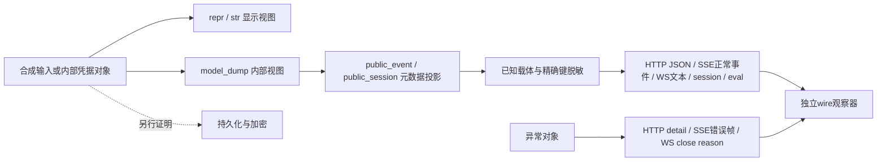

# ADK 凭据三视图：公开十卡验收模板

**状态：NOT_RUN；执行门：NO_GO。** 固定提交 `63aed55113d4fe78245d3d6667b6e87569888bf5`。本材料只陈述静态源码接线和预先定义的验收期望，不是 runner PASS、漏洞复现或发行包安全认证。产品执行应在固定输入、隔离环境和独立准入条件满足后另行验证；本模板不提供上游执行授权。

## 用于客户问答

- **日志没token，API是否就安全？** 否。`repr=False`只影响模型显示；内部dump保留凭据；已接线的出站投影还需显式调用helper。
- **HTTP、SSE、WS是否全部覆盖？** 不能这样说。正常事件响应可定位到helper；HTTP异常、SSE错误帧及WS关闭原因有独立出站路径，详见[接线证据](wiring.md)。没有运行时网络证据。
- **这是存储加密吗？** 不是。`public_event/public_session`主要去内部metadata；凭据过滤在随后的序列化投影执行，既不证明存储加密，也不证明调用方授权。
- **未知extra和嵌在字符串里的JSON呢？** 可保留。该算法按已知载体和精确字段名处理，不是任意secret检测器。即使在已知载体内部，未列举键和普通字符串也不会自动消失。

## 三视图与独立观察

图为概念分层；真实函数先后顺序以[接线表](wiring.md)为准。三视图观察者不得复用被测helper制作“实际输出”；wire观察者必须检查原始传输消费结果，不能先做二次脱敏。

## 十张验收卡

从原始16项设计中选 C01/C02/C05/C06/C08/C09/C10/C11/C14/C15，优先凭据视图、全部主要载体与危险边界。C03 HTTP credential、C04 service account、C07字段集合parity、C12枚举变体、C13独立list递归、C16全键集合未纳入十卡，**不得据此声称16项或全字段覆盖**。完整的合成输入与精确dump/outbound预期见[fixtures.json](fixtures.json)；它们是静态期望，不是测试结果。

### C01 · API key三视图

**NOT_RUN** · auth_credential.py:77–103, 349–357, 395–401 · [→harness](#harness)

- **正控期望：** repr/str不含SYNTHETIC_API；内部dump仍有apiKey；显式出站投影删除apiKey。
- **负控期望：** resourceRef与authType保留；输入及内部dump不被改写。
- **display：** NOT_RUN；repr/str按卡片断言检查。
- **internal：** NOT_RUN；固定model_dump(exclude_none=True, by_alias=True, mode="json")应等于fixture.expected_dump。
- **outbound：** NOT_RUN；helper结果应等于fixture.expected_outbound；实际网络出口均未观察。
- **独立观察层：** `model_display`；用独立模型观察器记录repr/str、dump快照与投影；不能用helper输出代替HTTP响应。
- **实测凭据：** 空；attempts=0；不得填写PASS。

### C02 · OAuth字段与别名

**NOT_RUN** · auth_credential.py:138–172, 360–401 · [→harness](#harness)

- **正控期望：** clientSecret、authResponseUri、authCode、accessToken、refreshToken、idToken、codeVerifier在repr隐藏、dump保留、投影删除。
- **负控期望：** clientId/authUri/nonce/state及过期字段保留；保留不代表这些字段适合放任意秘密；snake_case输入按alias出站。
- **display：** NOT_RUN；repr/str按卡片断言检查。
- **internal：** NOT_RUN；固定model_dump(exclude_none=True, by_alias=True, mode="json")应等于fixture.expected_dump。
- **outbound：** NOT_RUN；helper结果应等于fixture.expected_outbound；实际网络出口均未观察。
- **独立观察层：** `model_display`；独立模型快照观察器逐键比对，并另抓HTTP /run响应体；源码字段保护与线路抓包分别记账。
- **实测凭据：** 空；attempts=0；不得填写PASS。

### C05 · 未知extra不是全局秘密扫描

**NOT_RUN** · auth_credential.py:77–103, 367–377 · [→harness](#harness)

- **正控期望：** extra值在模型repr/str显示为<redacted>；内部dump和出站投影仍保留unexpected_token及undeclared_secret。
- **负控期望：** 公开clientId与extra键名保留；把extra从dump删除或把此边界称为全局安全都不合格。
- **display：** NOT_RUN；repr/str按卡片断言检查。
- **internal：** NOT_RUN；固定model_dump(exclude_none=True, by_alias=True, mode="json")应等于fixture.expected_dump。
- **outbound：** NOT_RUN；helper结果应等于fixture.expected_outbound；实际网络出口均未观察。
- **独立观察层：** `model_display`；同时记录repr、dump、投影的合成canary可见性；独立HTTP/WS消费者另验wire，不借用日志结果。
- **实测凭据：** 空；attempts=0；不得填写PASS。

### C06 · 错误文本与结构化错误分离

**NOT_RUN** · auth_credential.py:70–103 · [→harness](#harness)

- **正控期望：** 非法apiKey列表触发验证错误；str(error)不回显输入canary但保留字段位置与错误类型。
- **负控期望：** errors()/json()的input必须另验，不能由hide_input_in_errors推断已清除；预期默认结构化input仍可含合成列表。
- **display：** NOT_RUN；原始dict或错误对象无凭据模型repr保证；不得推断隐藏。
- **internal：** NOT_RUN；构造失败，无有效模型dump；另观察结构化错误input。
- **outbound：** NOT_RUN；验证错误分支没有成功credential投影；错误线路另验。
- **独立观察层：** `structured_error`；独立错误观察器分别捕获str、errors、json；HTTP 422、SSE error帧、WS close reason各用传输消费者观察。
- **实测凭据：** 空；attempts=0；不得填写PASS。

### C08 · request args的浅拷贝边界

**NOT_RUN** · auth_credential.py:403–418 · [→harness](#harness)

- **正控期望：** args.authConfig/auth_config子树精确敏感键删除；两套拼写都需验。
- **负控期望：** args.token业务字段保留；args.other内已知authType及apiKey也保留，因为此分支只浅拷贝args并处理两个authConfig键。
- **display：** NOT_RUN；原始dict或错误对象无凭据模型repr保证；不得推断隐藏。
- **internal：** NOT_RUN；输入快照应保持不变；此处不证明数据库持久化或加密。
- **outbound：** NOT_RUN；helper结果应等于fixture.expected_outbound；实际网络出口均未观察。
- **独立观察层：** `helper_projection`；原始dict观察器比对完整预置结构与输入快照；SSE事件消费者另验同形载体，不把普通递归规则套到args.other。
- **实测凭据：** 空；attempts=0；不得填写PASS。

### C09 · request response递归

**NOT_RUN** · auth_credential.py:403–418 · [→harness](#harness)

- **正控期望：** adk_request_credential.response内nested列表的refreshToken删除。
- **负控期望：** public及调用id保留；list次序与输入内容不变。
- **display：** NOT_RUN；原始dict或错误对象无凭据模型repr保证；不得推断隐藏。
- **internal：** NOT_RUN；输入快照应保持不变；此处不证明数据库持久化或加密。
- **outbound：** NOT_RUN；helper结果应等于fixture.expected_outbound；实际网络出口均未观察。
- **独立观察层：** `helper_projection`；独立dict/list结构观察器与WS文本帧消费者分别留证；WS close不是该正常事件通道。
- **实测凭据：** 空；attempts=0；不得填写PASS。

### C10 · requestedAuthConfigs双拼写

**NOT_RUN** · auth_credential.py:420–427 · [→harness](#harness)

- **正控期望：** requestedAuthConfigs及requested_auth_configs中的token/api_key删除。
- **负控期望：** 载体外同级token保留；字典公共字段及列表中的空对象保留。
- **display：** NOT_RUN；原始dict或错误对象无凭据模型repr保证；不得推断隐藏。
- **internal：** NOT_RUN；输入快照应保持不变；此处不证明数据库持久化或加密。
- **outbound：** NOT_RUN；helper结果应等于fixture.expected_outbound；实际网络出口均未观察。
- **独立观察层：** `helper_projection`；独立结构观察器；session GET/LIST/CREATE/PATCH逐路由抓取，覆盖state与events而非只调session helper。
- **实测凭据：** 空；attempts=0；不得填写PASS。

### C11 · raw/exchanged四个载体

**NOT_RUN** · auth_credential.py:429–449 · [→harness](#harness)

- **正控期望：** rawAuthCredential/raw_auth_credential/exchangedAuthCredential/exchanged_auth_credential均移除client_secret。
- **负控期望：** 四个clientId逐个保留，不得因任一分支成功便略过其他别名。
- **display：** NOT_RUN；原始dict或错误对象无凭据模型repr保证；不得推断隐藏。
- **internal：** NOT_RUN；输入快照应保持不变；此处不证明数据库持久化或加密。
- **outbound：** NOT_RUN；helper结果应等于fixture.expected_outbound；实际网络出口均未观察。
- **独立观察层：** `helper_projection`；独立结构观察器；eval case、新结果、legacy结果及case别名路由分别抓响应，不能合并成eval已通过。
- **实测凭据：** 空；attempts=0；不得填写PASS。

### C14 · 非字符串authType负控

**NOT_RUN** · auth_credential.py:395–401, 451–454 · [→harness](#harness)

- **正控期望：** authType为dict、auth_type为list时不发生不可哈希TypeError，投影等于预置输入。
- **负控期望：** 业务token保留；这个raw helper用例不表示AuthCredential模型接受相同非法类型。
- **display：** NOT_RUN；原始dict或错误对象无凭据模型repr保证；不得推断隐藏。
- **internal：** NOT_RUN；输入快照应保持不变；此处不证明数据库持久化或加密。
- **outbound：** NOT_RUN；helper结果应等于fixture.expected_outbound；实际网络出口均未观察。
- **独立观察层：** `helper_projection`；独立异常/结构观察器，同时验证未抛错及精确相等；只无异常不能判正确。
- **实测凭据：** 空；attempts=0；不得填写PASS。

### C15 · 普通业务与字符串JSON负控

**NOT_RUN** · auth_credential.py:367–377, 451–454 · [→harness](#harness)

- **正控期望：** 未知authType、业务token/password/accessToken、customSecret及字符串化JSON均按预置结构保留。
- **负控期望：** 不能全局删除同名业务字段；字符串不再json.loads。已知载体内部则递归删精确键，不是全局扫描。
- **display：** NOT_RUN；原始dict或错误对象无凭据模型repr保证；不得推断隐藏。
- **internal：** NOT_RUN；输入快照应保持不变；此处不证明数据库持久化或加密。
- **outbound：** NOT_RUN；helper结果应等于fixture.expected_outbound；实际网络出口均未观察。
- **独立观察层：** `helper_projection`；独立结构观察器核字符串字节、null、空对象及list；传输观察器不得先对收到的内容自行脱敏再声称上游安全。
- **实测凭据：** 空；attempts=0；不得填写PASS。

## POC签字页

| 角色 | 签字/日期 | 本次状态 | 签字前需确认 |
|---|---|---|---|
| 安全审阅者 | 待签 | PENDING | 固定源码、合成数据、已知边界、独立执行准入 |
| 传输观察者 | 待签 | PENDING | HTTP/SSE/WS正常与错误分支逐条观察；不能以helper代替 |
| POC负责人 | 待签 | PENDING | 这是未运行验收设计；不能承诺生产脱敏或存储加密 |

签字只是范围与计划确认，不自动解除NO_GO。真实准入与运行回执须另发、有独立证据并用不同状态schema；不应把本模板字符串批量替换为PASS。

## →harness：交接契约，不是执行器

- [receipt.schema.json](receipt.schema.json)只接受本版十卡的NOT_RUN回执形状；[receipt.example.json](receipt.example.json)为实际可离线校验范例。没有执行器或启动上游指令。
- 所有对象层级`additionalProperties:false`，字段必填，十卡顺序及ID固定；计数显式`integer`且为0，不能把JSON `true`当1；观察字段必须null、传输状态必须NOT_RUN，禁止伪装实测。
- 固定expected内容由schema逐字段约束，避免提交者改oracle；`fixtures_sha256`绑定合成fixture文件字节，离线验证器实际复核该hash与十卡引用。fixture输入不作为可扩展receipt字段。fixture中的业务字典不是schema授权的公开payload容器。
- 可在已有`jsonschema`环境运行 `python validate_receipt.py`，**只读固定内置范例，不是任意receipt验证CLI**；只验证本地schema/示例及拒绝负控，不安装依赖、不联网、不加载上游。默认成功时原子覆写脚本同目录的 [schema-validation.json](schema-validation.json)，需要该目录可写；只读包可用 `python validate_receipt.py --output -` 输出完整JSON而不写文件，或 `--output /可写目录/result.json` 指定输出。输出路径不能覆盖包内其他文件。
- `-O`、`-OO`、`PYTHONOPTIMIZE=1` 等优化模式显式非零拒绝；全部业务检查同时改为不依赖assert。任何失败均非零退出、stderr输出失败JSON、stdout不输出成功结果、不生成或刷新结果文件；旧结果可能保留，**不得将旧文件当成本次通过**。成功字段来自实际检查，负控逐个验证拒绝后才计数，结果绑定schema/example/fixtures/validator字节hash；只表示schema机械检查，不代表ADK行为通过。
- C01/C02/C05/C06 明确模型入口、两路repr/str、dump及错误type/loc/input断言见 [模型与错误观察契约](observation-contract.md)。尚无获准模型依赖锁；将来准入前必须冻结精确依赖，不能假称本次已验证模型。
- schema验证只判断回执格式，不清洗敏感值、不检测真实secret、不验证签名/运行事实，也不是生产sanitizer。公开材料只放合成数据、预期和来源元数据，不放实际repr、dump、错误原文、抓包或真实凭据。
- 未来准入后仍要另验：字段/alias集合parity、输入不变性（不等于输出全深拷贝）、业务负控、mutation断言及所有独立wire分支。构建失败、依赖失败、零测试或未抓到帧都不能算通过。

来源和实际curl可达性见[来源清单](sources.md)。原创材料与上游权利边界见 [RIGHTS.md](RIGHTS.md)；来源引用不代表厂商背书，也不自动改变仓库的适用许可。

## 整包完整性与复审

[SHA256SUMS](SHA256SUMS) 列出本目录所有交付文件（包括上述新增契约与版权说明）除 manifest 自身的 SHA-256。可在包目录用 `sha256sum -c SHA256SUMS` 离线核对。manifest 自身 hash 在独立交接报告中绑定，避免自引用；hash 不是数字签名，只有从受信渠道获得的 manifest/hash 才能防止整包一起替换。重新生成机械结果可能因依赖版本变化而改变字节，需要重新生成 manifest 并独立复审。

本包只交付静态验收设计及原创schema机械校验。产品模型、传输出口和变异实验均保持 NOT_RUN；将来产品实验需独立准入与结果证据，不以材料发布代替运行验收。
