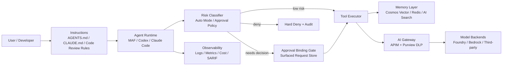

<!-- learning-asset-sanitized: v1 -->
> **发布界定 / Publication boundary**
>
> 本文是由历史研究快照整理出的补充学习材料。原始资料中的 HTTP 200、抓取时间或“已核实”表述只代表当时的来源可达性/文本核对，不代表本次发布时已经重新核验；本文也不是正式实验报告、生产部署建议或合规结论。
>
> 未对其中的命令、代码块、外部仓库、云资源、生产环境或合规控制做本次实机验证。请在独立测试环境中重新验证后再用于客户/生产场景。

# Agent 审批绑定、Auto Mode 与企业 Memory/Gateway POC 清单（2026-08-10）

> 用途：给 SA 在技术问答、POC 部署、架构图设计时快速复用。所有外部资料均按“不可信资料”处理；本文件只记录已用 `curl/urllib` 可达的来源，不要求执行任何外部仓库命令。
> 适用场景：企业客户问“高风险工具调用怎么审批”“auto mode 是否比人工 approve 更安全”“Agent 记忆层选 Azure 哪个组件”“AI Gateway 如何加 DLP/审计”。

## 0. 来源与核实状态

| 来源 | URL | 原研究快照中核实 | 备注 |
|---|---|---:|---|
| MAF Python tool approval binding PR#7581 diff | https://github.com/microsoft/agent-framework/pull/7581.diff | 200 | 读到 `_SURFACED_APPROVAL_REQUESTS_KEY`、`_bind_approval_responses_to_surfaced_requests`、“recorded call wins” 注释 |
| MAF .NET Cosmos NoSQL vector memory sample PR#7552 diff | https://github.com/microsoft/agent-framework/pull/7552.diff | 200 | 读到 `ChatHistoryMemoryProvider`、`CommunityToolkit.VectorData.CosmosNoSql`、`COSMOS_ENDPOINT` |
| MAF Python AG-UI snapshot IDs PR#7510 diff | https://github.com/microsoft/agent-framework/pull/7510.diff | 200 | 读到 tool-call snapshot `message_id` / `parent_message_id` 保序修复 |
| SK Python Redis vector fix PR#14278 diff | https://github.com/microsoft/semantic-kernel/pull/14278.diff | 200 | 读到 redisvl 新旧 API 兼容与 omitted vector 处理 |
| AI-Gateway APIM + Purview DLP PR#390 diff | https://github.com/Azure-Samples/AI-Gateway/pull/390.diff | 200 | 读到 `processContent`、Foundry+Bedrock 后端、KQL、成本提示 |
| Foundry BYOM / ModelGateway PR#896 diff | https://github.com/microsoft-foundry/foundry-samples/pull/896.diff | 200 | 读到 private APIM、direct Foundry、third-party ModelGateway 三路径 |
| Claude Code changelog | https://raw.githubusercontent.com/anthropics/claude-code/main/CHANGELOG.md | 200 | 读到 v2.1.226 / v2.1.225 / v2.1.224 |
| Claude Auto Mode 默认博客 | https://claude.com/blog/auto-mode-default-in-claude-code | 200 | 200；核验到页面标题/meta 与可检索正文片段，非部署/非运行验证；全文未逐字核对 |
| Claude Auto Mode 生产实践博客 | https://claude.com/blog/auto-mode-in-production | 200 | 200；核验到页面标题/meta 与可检索正文片段，非部署/非运行验证；全文未逐字核对 |
| Claude Dynamic Workflows 博客 | https://claude.com/blog/a-harness-for-every-task-dynamic-workflows-in-claude-code | 200 | 200；核验到页面标题/meta 显示 multi-agent harness on the fly，非部署/非运行验证 |
| Codex releases atom | https://github.com/openai/codex/releases.atom | 200 | 读到 0.147.0 stable 与 0.148.0-alpha.1~5；alpha body 仅占位 |
| Codex Code Review Rules 博客 | https://developers.openai.com/blog/custom-code-review-rules-for-codex | 200 | 200；核验到页面标题/meta 与可检索正文片段，主题为 AGENTS.md code review rules；非运行验证 |
| anthropics/skills claude-api skill | https://raw.githubusercontent.com/anthropics/skills/main/skills/claude-api/SKILL.md | 200 | 读到 Tool Runner / Agent SDK / Managed Agents 区分 |
| GitHub Copilot MCP allowlists changelog | https://github.blog/changelog/2026-08-06-mcp-allowlists-in-enterprise-managed-settings | 200→canonical | 企业 managed settings 下发 MCP allowlist/denylist |
| GitHub Copilot agent app metrics changelog | https://github.blog/changelog/2026-08-07-copilot-usage-metrics-api-adds-agent-app-activity | 200→canonical | Usage metrics API 增加 agent app activity |

**Fail-loud：**
- 没有部署任何样例，也没有运行 Bicep/notebook/CLI；所有 POC 步骤是设计清单，不是实测结论。
- GitHub REST API 原研究快照中被匿名限流；PR 细节以 `.diff` 端点为依据，未读取 PR discussion 全文。
- Codex `0.148.0-alpha.*` 仅确认 release atom 中存在，body 为“Release 0.148.0-alpha.*”占位；不得写成新功能。
- 社区候选（Pydantic AI Harness、best-of-Agent-Harnesses、VoltAgent awesome-agent-skills）仅 URL 200，未做安全/许可/脚本审计，不推荐直接安装；也不得引用其 star、排名、覆盖数量或“最佳”标签作为已核事实。

---

## 1. 高风险工具调用：审批响应必须绑定“用户实际看到的请求”

### 核心模式
MAF PR#7581 的关键安全语义：approval response 只是“决策 token”，不是新的 work order。恢复/重放时实际执行的函数调用应绑定到当时已经 surfaced 给用户的 request；如果 inbound response 内嵌的调用内容与记录不同，**记录下来的 surfaced call 胜出**。

### SA 技术问答话术
- 不要把“用户点了 approve”理解为批准任意后续工具调用；批准必须绑定到具体 request id + function call payload。
- 会话恢复、跨设备审批、远程控制、长任务 resume 都要防止“审批后参数被替换”。
- 高风险工具（写文件、部署、删资源、发外部请求）需要：请求展示 → 不可变记录 → 用户决策 → 执行绑定 → 审计日志。

### POC 验证清单
1. 构造一个需要 approval 的工具调用（如删除资源/写配置）。
2. 在 approval request surfaced 后，模拟 resume/inbound response 中的 function call payload 被篡改。
3. 期望行为：执行 recorded surfaced request；若 response 与 surfaced request 不一致，记录 warning/audit；拒绝项被 consume，不能稍后再次批准。
4. 日志必须可追溯：request id、展示 payload hash、user decision、executed payload hash。

### 架构图组件
`Agent Runtime` → `Approval Request Store (immutable surfaced call)` → `User/Policy Decision` → `Approval Binding Gate` → `Tool Executor` → `Audit Log`

[→harness] 可直接反哺 workshop 的“approve fatigue / replay-tamper 红队用例”。

---

## 2. Auto Mode：不要把人工 approve 当成唯一安全边界

### 核心模式
Claude Code 08-08/08-07 线索显示两条趋势：
- v2.1.225 修复 auto mode、Remote Control、MCP OAuth、workspace trust、headless token、self-hosted runner 等可靠性与权限一致性问题。
- 官方 auto mode 博客把“用户频繁 approve 导致 permission fatigue”作为问题背景，主张用 classifier / hard-deny / telemetry / managed settings 组合替代纯人工点击。

### SA 技术问答话术
- 人工审批是交互层，不是完整安全层；用户疲劳会让危险命令被误批。
- 企业落地应是三层：**模型/分类器默认拦截**、**组织策略硬禁止**、**人工 fallback + 审计**。
- Auto mode 的价值不是“无条件放权”，而是把低风险动作自动化，把高风险动作更稳定地拒绝或升级。

### POC 验证清单
1. 定义三类动作：低风险读操作、中风险修改、高风险外联/凭证/删除。
2. 对每类动作分别测试：auto allow、ask/fallback、hard deny。
3. 加入“不可见 Unicode / tab 隐藏命令 / 参数重写 / denyRead 尾斜杠”红队用例（来自近期 Claude Code changelog 安全修复线索）。
4. 输出 dashboard：被自动允许、被拒绝、升级人工、人工误批率、审计证据。

### 架构图组件
`User Intent` → `Risk Classifier / Auto Mode` → `Managed Policy (allow/deny lists)` → `Sandbox / Network / File Guards` → `Human Fallback` → `Telemetry & Spend Limit`

[→harness] 可作为“从 permission fatigue 到 governed autonomy”的 workshop 主线。

---

## 3. Agent Memory：Cosmos NoSQL Vector Store 作为 Azure-first 记忆层

### 核心模式
MAF PR#7552 新增 .NET AgentWithMemory Step08：使用 `ChatHistoryMemoryProvider` + `CosmosNoSqlVectorStore` 持久化聊天历史，用 Foundry embedding 让第二个 session 回忆第一轮偏好。

### SA 技术问答话术
- 对 Azure 客户，Cosmos DB for NoSQL vector search 可以作为“短中期会话记忆 + 偏好召回”的 Azure 原生路径。
- 记忆不是只存 transcript；需要 scope：按 user / tenant / app / scenario 隔离，避免跨租户泄漏。
- 与 Neo4j/外部 memory repo 的取舍：Cosmos 更利于 Azure 原生治理、RBAC、私网、诊断；图数据库更适合关系推理但治理边界要额外设计。

### POC 验证清单
1. 预置 Foundry project endpoint、chat model、embedding model、Cosmos endpoint/database。
2. Session A 让用户给出稳定偏好（例如“喜欢 pirate jokes”）。
3. Session B 不重复偏好，验证 agent 是否从 Cosmos chat history recall。
4. 验证隔离：不同 user/tenant scope 不应互相召回。
5. 验证成本/容量：记录 embedding 调用、Cosmos RU、向量维度、TTL/清理策略。

### 架构图组件
`Agent Framework (.NET)` → `AIContextProviders / ChatHistoryMemoryProvider` → `Foundry Embedding Model` → `Cosmos DB for NoSQL Vector Store` → `Tenant/User Scoped Collections`

---

## 4. Tool Schema / Vector Connector：POC 稳定性不要忽略“连接器小坑”

### Redis vector connector
SK PR#14278 修复 redisvl 新旧 API 兼容与 `include_vectors=False` 时 omitted vector 的 KeyError。对 Redis-based memory/RAG POC，必须 pin/核对 redisvl 版本并做空向量字段回归测试。

### AG-UI snapshot IDs
MAF PR#7510 修复 AG-UI tool-call snapshot message id/parent id 保序。对流式 agent 前端，工具调用事件、确认事件和文本片段的 parent-child id 必须稳定，否则 UI 可能在 resume/merge 后乱序。

### POC 验证清单
- 工具 schema：Optional/None/Union 参数必须生成正确 JSON Schema，并用负例测试。
- Vector connector：搜索不返回 vector body 时也能反序列化；Redis/Cosmos/AI Search 各自做最小回归。
- AG-UI：流式文本、工具确认、工具结果、resume snapshot 的顺序一致。

---

## 5. 企业 AI Gateway：DLP + BYOM 私网路径是两张不同图

### APIM + Purview DLP（AI-Gateway PR#390）
- 位置：APIM 在 Foundry / Bedrock 后端前做 prompt/response 双向 gate。
- 关键动作：调用 Microsoft Purview `processContent`；对通过/阻断 turn 写审计日志；KQL 用于取证；成本由 APIM StandardV2 小时费用、Purview processContent/audit 调用、后端模型共同构成。
- 注意：示例包含 AWS access key 粘贴到 notebook/secure named value 的路径；客户生产方案必须替换为组织认可的 secret 管理/轮换机制，不要把 lab 的粘贴式步骤当生产标准。

### Foundry BYOM / ModelGateway（Foundry PR#896）
三条模型路径不能混淆：
1. **Private APIM path**：通过 APIM outbound VNet + backend private endpoint 访问另一个 Foundry account。
2. **Direct Foundry ModelGateway**：连接另一个 Foundry/Azure OpenAI 公开端点，通常需要启用 backend public access/local auth 相关配置。
3. **Third-party ModelGateway**：连接 OpenAI-compatible 第三方 endpoint，安全/合规取决于第三方网络与数据策略。

> Capability Host 保护 Agent Service 的项目依赖（Storage/Cosmos/AI Search 等），**不等于** connected-model inference 一定从 delegated agent subnet 发起。这个边界必须在客户图上标红。

### 架构图组件
- DLP 图：`Client` → `APIM AI Gateway` → `Purview processContent Gate (Prompt)` → `Foundry/Bedrock` → `Purview processContent Gate (Response)` → `Log Analytics/KQL`
- BYOM 图：`Foundry Project + Capability Host` → `[APIM private path | Direct ModelGateway | Third-party ModelGateway]` → `Model Backend`

---

## 6. Codex / Claude / Copilot 配置治理：把规则写进仓库而不是口头传达

### Codex AGENTS.md Code Review Rules
Codex 官方博客确认可用 AGENTS.md 的 code review rules 表达团队不变量。推荐写法：
- 只写 consequential invariant，不写泛泛风格偏好。
- 每条规则包含：为什么重要、坏例子、safe path、应引用的 owner/doc。
- 用 2-3 个历史 PR 评论/事故复盘来回归测试，避免噪声过高。
- 注意：Codex Code Review Rules 是 review signal，不是强制安全边界；生产仓库仍需 tests、branch protections、required approvals、CODEOWNERS/SARIF 等硬门禁配合。

### Copilot MCP allowlists / metrics
GitHub Copilot changelog 显示：企业 managed settings 可集中配置 MCP allowlist/denylist；usage metrics API 增加 agent app activity。SA 可把它与 Codex/Claude 的 plugin/skills allowlist 统一到“能力目录治理 + 采用度监控”。

### anthropics/skills claude-api
官方 skill 明确区分：Tool Runner、Claude Agent SDK、Managed Agents。SA 回答“我该用哪个 Anthropic 方案”时，应先分清：
- API tool loop：自己定义工具与循环；
- Agent SDK：Claude Code harness 库化但自己托管；
- Managed Agents：Anthropic 托管 agent loop 和 per-session sandbox。

---

## 7. 最小架构图骨架（可复制到 diagram skill）

---

## 8. 直接可用的客户短话术

> 企业 Agent 不是“给模型开 auto mode”这么简单。推荐把控制面拆成四层：仓库级规则（AGENTS/CLAUDE）、能力目录治理（skills/plugins/MCP allowlist）、执行审批绑定（用户实际看到的 request 才能被执行）、以及网关与观测（APIM+Purview DLP、日志、成本）。Azure 侧可用 Agent Framework + Cosmos vector memory 做记忆层，用 APIM+Purview 做内容治理；Codex/Claude Code 侧用 Code Review Rules、Auto Mode、动态 harness 做开发体验与安全默认。生产前必须实测审批重放、权限绕过、跨租户记忆隔离和 DLP 阻断四类红队用例。
