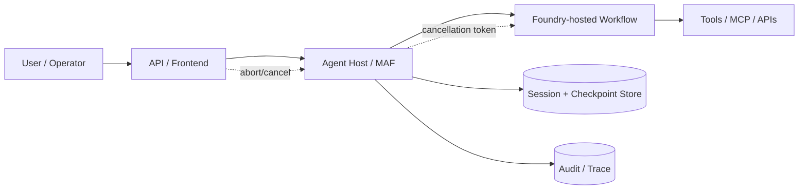
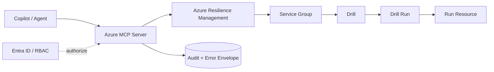
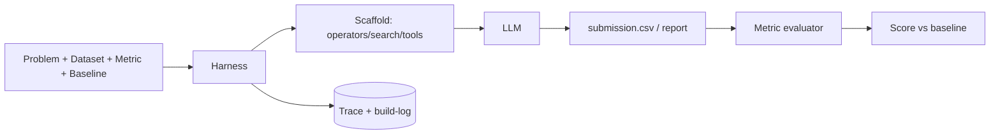

<!-- learning-asset-sanitized: v1 -->
> **发布界定 / Publication boundary**
>
> 本文是由历史研究快照整理出的补充学习材料。原始资料中的 HTTP 200、抓取时间或“已核实”表述只代表当时的来源可达性/文本核对，不代表本次发布时已经重新核验；本文也不是正式实验报告、生产部署建议或合规结论。
>
> 未对其中的命令、代码块、外部仓库、云资源、生产环境或合规控制做本次实机验证。请在独立测试环境中重新验证后再用于客户/生产场景。

# Agent Runtime Cancellation、Resilience Drill、Eval 与 Skill 成本治理速查（2026-08-26）

> 用途：给 SA 做技术问答、POC 部署前检查、架构图组件拆解。外部来源均只读核实；本文不建议直接运行任何第三方 README 命令。所有版本/提交为 2026-08-26 资料快照；未实机验证的地方显式标注。
>
> 文中的 `azmcp ...` 等命令形态仅作为上游 diff / 文档中的工具标识引用，不构成执行指令；POC 前必须在受控环境中按客户 RBAC 与审计要求单独验证。

## 0. Evidence links（可复核来源）

| 对象 | URL | 原研究快照中证据强度 | 可写成什么 | 不可写成什么 |
|---|---|---|---|---|
| MAF Foundry-hosted workflow cancellation commit | https://github.com/microsoft/agent-framework/commit/ce654138fb913a1fd0730e91845a7b5dc4d588a6 | commit page 200；`.diff` 8954 bytes；diff 命中 `consentCts.Token.ThrowIfCancellationRequested()`、`CancellationObserved` 单测 | 提交级：Foundry-hosted workflow responses 对 cancellation propagation 加强 | 已发布到正式 NuGet / 所有场景都可取消（未包级 smoke） |
| MAF AG-UI hosted web search via Responses API | https://github.com/microsoft/agent-framework/commit/7683b0ec84f64bfc47e88b4bf49186da0eac7a8a | commit page 200；`.diff` 12643 bytes；diff 命中 “Responses API because hosted web search is a Responses API tool” 与 `store=false` | 提交级：AG-UI + hosted web search 样例转向 Responses API，并提醒由 AF session store 持久化 | 仅提交级样例线索，未读完整 sample、未运行，不能据此认定生产标准架构 |
| Azure MCP resilience drill run tools | https://github.com/microsoft/mcp/commit/8f95d6718f2ea2c4c581dbe749cea24c0139a5de | commit page 200；`.diff` 59220 bytes；diff 命中 `resilience drill run get` / `resilience drill run resource get` / auth 与 not-found error 文案 | 提交级：Azure MCP Resilience 从计划/资源扩展到 drill run 状态查询 | 已 GA / 已在某 beta 包可用（未核 release 包） |
| Claude Code changelog 2.1.243/2.1.245 | https://code.claude.com/docs/en/changelog | page 200；HTML 命中 `2.1.243`、`2.1.245`、`promptCacheTtl`、`subagentPromptCacheTtl`、`/usage` Loops breakdown、MCP reconnect、glibc 2.44 fix | 版本文档级：子代理成本/模型可见性与 prompt cache TTL 已进入 changelog | 本机已升级/默认启用（未运行 CLI） |
| Anthropic Agent Skills best practices | https://platform.claude.com/docs/en/agents-and-tools/agent-skills/best-practices | page 200；HTML 命中 description、progressive disclosure、SKILL.md under 500 lines、scripts/validator/eval | 文档级：skill 设计应短核心、好 description、引用分层、脚本验证、eval-first | 所有 Hermes skill 必须逐条照搬（需按 Hermes 语义改写） |
| OpenAI Codex changelog | https://developers.openai.com/codex/changelog | 308→ https://learn.chatgpt.com/docs/changelog →200；HTML 命中 0.149.1、queue、doctor、mcp-server/app server | 负向结论：08-26 未见新 stable；0.149.x 仍是近期 stable 基线 | 0.150 alpha 已有客户可用功能（未有详细 release body） |
| Codex `0.150.0-alpha.9` | https://github.com/openai/codex/releases/tag/rust-v0.150.0-alpha.9 | release page 200；published_at 未独立复核，API 403 | alpha 信号：0.150 线活跃 | 功能发布/稳定线承诺 |
| Meta AIRS-Bench | https://github.com/facebookresearch/airs-bench / https://raw.githubusercontent.com/facebookresearch/airs-bench/main/README.md | repo/raw README 均 200；README 命中 20 tasks、17 papers、16 datasets、problem/dataset/metric/SOTA、agent=scaffold+harness | eval 设计参考：科研型 agent POC 可用“task spec + metric + SOTA baseline + harness”框架 | 其 benchmark 数字可直接引用为客户承诺（未运行/未复算） |

## 1. POC / 技术问答可复用检查清单

### A. 长任务 / Hosted workflow cancellation gate（MAF / Foundry）
- [ ] 需求问清：客户是否要求用户取消、管理员中止、预算超限停止、或审批超时停止？这四类 cancellation 的责任人不同。
- [ ] 实现证据：不要只说“支持 cancellation”。在 POC 里记录 `request_id/session_id`、发起取消的主体、取消前最后一个 tool/event、取消后是否停止 billing/后台工作。
- [ ] 测试用例：
  1. workflow 正在等待 consent/approval 时取消；
  2. workflow 正在 streaming response 时取消；
  3. workflow 已持久化 checkpoint 后取消并重启；
  4. 重复取消 / 取消不存在 session。
- [ ] 架构图组件：Client/API Gateway → Agent Host → Foundry-hosted workflow → Session/Checkpoint store；旁路标注 `CancellationToken / abort signal` 与 audit sink。
- [ ] Fail-loud：原研究快照中只读 commit diff，未确认进入正式包；客户材料写“提交级信号，需包级 smoke”。

### B. AG-UI + hosted web search via Responses API gate
- [ ] 判断问题：客户要的是“前端 AG-UI 协议接入”还是“模型 hosted web search”？两者是不同层。
- [ ] 会话持久化：如果 Responses API tool 需要 `store=false` 并由 Agent Framework session store 记录历史，则图中必须画出“服务侧响应存储关闭 / 应用侧 session store 接管”。
- [ ] 数据合规：web search/grounding with Bing 可能产生额外费用与数据使用条款，客户 POC 前需让业务/法务确认。
- [ ] 测试用例：web search disabled、Bing/grounding 不可用、session store 丢失、同一用户多 tab 并发。

### C. Azure MCP Resilience drill read-only gate
- [ ] 工具分类：`drill run get` / `drill run resource get` 是 read-only 查询型，仍要走 RBAC 与 audit，不因为“只读”就免审计。
- [ ] POC 最小集：列 drill → 列 drill runs → 查 run resource → 403/RBAC denied → not found → timeout。
- [ ] 架构图组件：Agent/Copilot → MCP server → Azure Resilience Management → Service Group / Drill / Drill Run / Run Resource；旁路：RBAC、审计日志、错误 envelope。
- [ ] Fail-loud：原研究快照中未核进入哪一个 Azure.Mcp.Server 包版本，部署前需检查 changelog/release tag。

### D. AIRS-Bench 式科研/复杂任务 eval gate
- [ ] 把 POC 任务写成 `<problem, dataset, metric, baseline>` 四元组，而不是“让 agent 自由发挥”。
- [ ] 把 agent 拆成 `LLM + scaffold`，把 scaffold 拆成 `operators/search/parallelism/memory/tools`，把 harness 画成“任务注入、运行管理、评分器、artifact 收集”。
- [ ] 客户可执行版本：先用 3-5 个合成小任务验证提交格式与评分器，再谈真实 benchmark。
- [ ] 禁止话术：未复算 benchmark 数字时，不承诺“达到 SOTA/提升 N%”。

### E. Claude Code subagent cost / cache / observability gate
- [ ] 每次长任务 build-log 记录：subagent name、model、effort、prompt cache TTL、run count、tokens、失败/重跑原因。
- [ ] 对 runaway loop 设阈值：如同一 loop 连续 N 次无新 artifact 或 token/run 异常上升，自动暂停并要求人工审查。
- [ ] 企业 FinOps：如果组织有折扣价格，使用 managed setting 的 `modelPricing` 后，报告中仍应写清“计价口径=组织价/列表价”。
- [ ] Linux runner 升级：glibc 2.44 修复是 runtime health 项，CI image 需把 `claude --version` 与启动 smoke 纳入定期检查 preflight。

### F. Skill authoring quality gate（适配 Hermes / Claude / Codex）
- [ ] `description` 必须包含“做什么 + 何时用 + 触发词/边界”，避免 “helps with X” 这种空描述。
- [ ] `SKILL.md` 只放核心流程；长表、证据库、示例放 `references/`；确定性检查放 `scripts/` 或模板。
- [ ] 优先写 validator：能脚本化检查的内容不要只写自然语言提醒。
- [ ] 写入 eval：至少包含 2 个正例触发、1 个负例不触发、1 个安全边界例。

## 2. 三类架构图模式

### 模式 1：Hosted workflow cancellation chain

### 模式 2：MCP resilience drill read-only query

### 模式 3：AIRS-Bench style eval harness

## 3. SA 快答模板

- **客户问：Agent 长任务能不能中途取消？**
  可以作为架构要求设计，但必须验证“取消信号是否传到 workflow、tool、checkpoint 与计费/审计层”。MAF 有 08-25 提交级信号在加强 Foundry-hosted workflow cancellation，但原研究快照中未核正式包，POC 前要做包级 smoke。

- **客户问：MCP 运维工具只读是不是安全？**
  只读不等于免治理。Resilience drill run 查询适合先做 read-only POC，但仍需 Entra/RBAC、错误 envelope、审计日志与资源范围限制。

- **客户问：coding agent 子代理怎么控成本？**
  把 subagent 的 model/effort/cache TTL/run count/tokens 写进 build-log；用 `/usage` loop breakdown 或等价 telemetry 找 runaway loop；不要只看最终成功/失败。

- **客户问：如何把经验沉淀成 skill？**
  先写短 `SKILL.md` + 明确 description；把长证据放 reference；把可确定的检查脚本化；用正/负例 eval 检查是否误触发。不要把整篇 SOP 塞进系统提示。

## 4. 未完成 / 下一步验证

1. MAF 两个 commit 是否进入下一个正式 NuGet/PyPI 包：需 release/package-level 核实。
2. Azure MCP drill run tools 是否进入具体 `Azure.Mcp.Server` 版本：需 changelog/release/tag 或包内 command help 验证。
3. AIRS-Bench 只读 README，未运行 benchmark；只能借鉴 eval shape，不引用性能结论。
4. Codex 0.150 alpha 只有版本信号，release body 无实质说明；不要放客户默认依赖。
