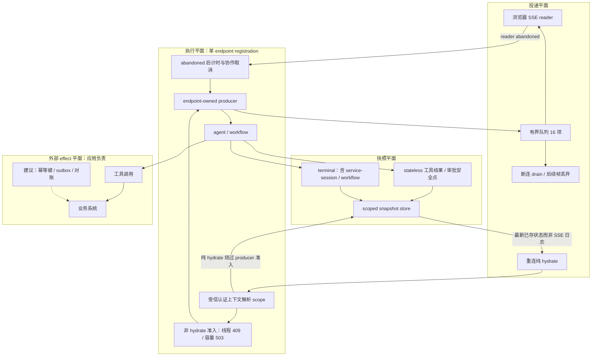
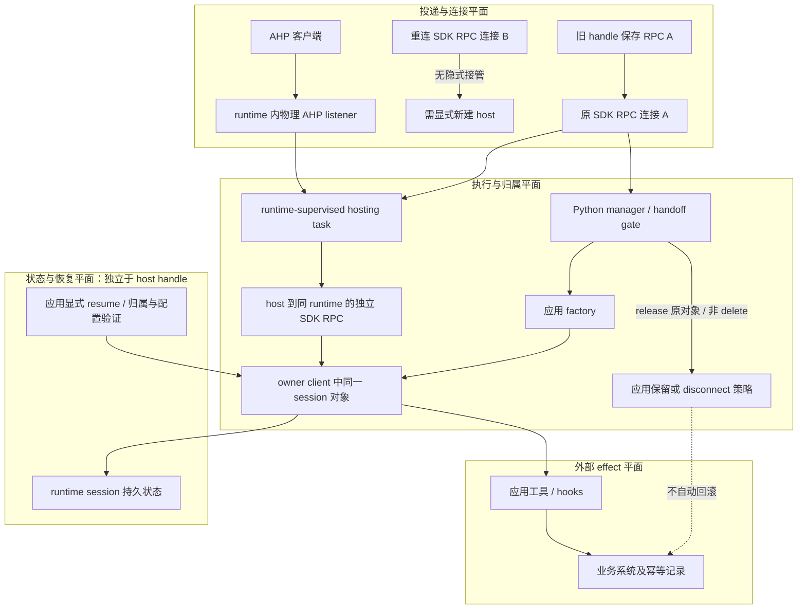

# Agent 断连后的执行归属、连接归属与恢复门禁

**2026-09-30｜main commit 公开静态设计 / NOT_RUN**

本稿只读固定源码与测试，未安装 SDK、未启动 runtime/AHP listener、未运行上游代码或测试、未调用模型/云服务。curl 成功只证明源码可取，不等于 POC 通过。以下全部卡片的 observation 是**待采集证据**，实际结果均为 **NOT_RUN**。

## 1. 给 SA 的结论

- **MAF：投递断开不必等于执行结束。** `detached_runs=True` 把有限 run 交给 endpoint 持有的 producer；默认仍绑定 SSE，断连取消 response generator，**可能（may）停止 run**，不承诺所有 provider/工具均立即停止。
- **Copilot：host 归连接，session 生命周期归应用策略。** AHP handle 保存启动它的原始 RPC；新连接不会自动接管旧 handle。handoff release 不等于 delete，也不等于业务完成。
- **恢复必须分四个平面：投递、执行、快照、外部 effect。** SSE 被丢弃不是 event replay；读到快照不证明工具恰好一次；发出取消不证明外部请求已撤回。
- 两项均为指定 main commit 的源码能力。MAF `python-1.19.0` 的 endpoint 未见 `detached_runs`；Copilot `v1.0.15` 的 Python `host.py` 为 404、`client.py` 未见 AhpHost（本轮输入证据中的 tag curl 核验）。**不声称已入发行包，也不根据一次 tag 缺失推断所有版本均无支持。** AHP 标记 experimental；本文深核 Python，不外推六语言完全等价。

## 2. 新增量与去重边界

固定 MAF `d4157d809a31bb9e894a1d1661453aee3ecdc875`：新重点是 producer 归属、断连计时、准入与安全点保存节奏；沿调用链读取既有 hydrate/scope/save 辅助逻辑用于解释边界，**不把这些既有组件都算新功能**。

固定 Copilot `36ff7a2ffc40adf06498cb5f1c25168e462e7e8a`：重点是 connection-owned AHP host、factory 配置与对象归属验证、取消后的迟到结果处理。与已有的 resume event 交付、skills reload 及 reasoning replay 是不同验收边界；本稿不借用这些相邻机制的运行结论。

## 3. MAF 调用链：哪些承诺能成立

### 3.1 授权必须早于 run 与存储

`add_agent_framework_fastapi_endpoint` → 认证依赖 → `agent_endpoint` → `snapshot_scope_resolver(request_body)` → 验证非空字符串 → 写入内部 snapshot/approval scope → 判定 hydration → 准入 → producer → `protocol_runner.run`。[M1:124–154,216–277]

resolver 参数是 AGUIRequest，不应把请求体 state 中自报 tenant 当授权。生产建议由认证依赖验证主体/资源权限，将受信上下文通过宿主闭包或上下文机制提供给 resolver，streaming 前解析成普通值；不能把即将释放的 request-scoped client/session 留给后台任务。启用 snapshot store 却不提供 resolver 在配置阶段报错；空/非字符串 resolver 在 run 前失败（当前 endpoint 包装成 500），不是自动 403。[M1:59–78,227–235,459–461]

**不同 scope 同 thread 可以并行仅证明锁键分区，不是跨租户授权证明。** 仍须分别验证 run、hydrate、approval 的主体权限；scope 无解析器时可为 None，不能拿 threadId 当秘密或凭据。

### 3.2 准入不是全局锁；hydrate 不是再次执行

`active_runs[(scope,threadId)]` 在同 endpoint registration 内阻止重叠 mutation（409）；之后检查 producer 数量，容量满为 503。默认上限 32。没有提供 threadId 时不会建立该线程锁键。字典/集合在进程内，既不是跨 worker 锁，也不是跨副本互斥。[M1:195–197,259–277,365–373]

hydrate 分类要求：snapshot 已启用、messages 为空、resume 为 None；workflow 还要求没有 checkpoint_id/checkpointId。显式 resume（即便空对象）不走纯 hydrate。它跳过线程 mutation guard 和 producer capacity，但**不跳过前面的 scope 解析/认证**。runner 打开 scoped snapshot 后返回 RunStarted、最新存储的 State/MessagesSnapshot 与 RunFinished/interrupt，不调用 agent。[M3:177–191；M4:65–109；M2:2897–2904]

hydrate 是该次读取时的已存快照，可能落后正在运行的 producer，不是“等任务结束再返回”，也不是丢失 SSE 的逐条补播。

### 3.3 三种时间边界与取消陷阱

producer 先等 reader_started，**1 秒仍未开始读**则置 abandoned，再继续推进 runner 并丢弃帧；活跃 reader 使用容量 **16 项**队列。不是 16 字节，也不是整个 run 内存上限。[M1:36–37,337–364]

已开始读取后断开：reader finally 设置 abandoned 并启动 drain，排空旧队列以释放可能阻塞的 put；producer 后续帧直接跳过入队，执行仍继续。`expire_abandoned_run` 等 abandoned 后才开始默认 **3600 秒**计时，并非从 POST 或 run 启动计算总时限。[M1:375–432]

因此一直连接但读得慢的消费者可能造成背压；该参数不是 slow-reader deadline。超时 `cancel()` 并 await producer，正常协作取消后释放集合/锁；它不是强制抢占。吞掉 CancelledError、同步阻塞工具或无法撤回的外部请求，需要宿主独立预算与隔离，不能承诺严格墙钟终止。

### 3.4 安全点不是每条 token，也不是事务提交

agent 流每个 update 内先处理全部 contents；function_result、MCP result 或 approval 内容标记 safe point。非 service-session 且不在等待审批时，批次处理后保存；等待审批时，对 ResponseStream 先 `get_final_response()` 完成审批生命周期相关 finalization，再保存。[M2:3555–3564,3601–3649,3759–3801]

`_build_safe_point_messages_snapshot` 只选已完成工具 call/result 与当前审批控制，排除本轮未 finalize 的 sibling text/reasoning；terminal snapshot 再保留完整已 finalize 输出。不是删掉历史已提交文本。service-session 保持终态节奏，避免消息先于匹配的 provider continuation 状态推进；workflow Thread Snapshot 也保持 terminal cadence，增量 workflow runtime 状态应依靠 checkpoint。[M2:2394–2482；M7:392–398]

**额外恢复门禁：** `ThreadSnapshotSession.save` 会记录并吞下一般存储异常，不把已发事件改成晚到 RUN_ERROR。故“前端看见完成”不证明“快照已持久化”。设计上必须另采存储成功/失败与版本指标；自定义 store 还须保证原子提交，不能仅凭包装器的日志断言底层部分写入已回滚。[M4:150–182]

## 4. AHP 调用链：连接与应用分开追责

`client.start_ahp_host` → `_AhpHostManager.start(original_rpc)` → `host.start` → 返回保存 `_rpc` 的 AhpHost。dispose/publish 始终调用这个 RPC；重复/concurrent dispose 的幂等与 teardown 结果归 runtime，而非 Python handle 的本地缓存。[C1:54–75,200–241；C2:3812–3824]

runtime 通过注册的 `host.materializeSession` 请求 manager。`materialize` 检查 host/factory/handoff/sessionId → 翻译配置 → 应用 create/resume factory → owner client 的 create/resume 路径 capture 实际 payload → 验证返回 sessionId 与 `_get_session(id) is session` → `_contains(actual,expected)`。字典递归包含，叶值严格类型相等，允许应用补充工具/提示但不能替换要求保留的配置。resume 可返回 owner 已保留的原对象而不重新配置；若真的调用了重配置路径并捕获 actual，则仍须满足配置。[C1:162–198,313–363；C2:3105,3801,4976–4982]

`host.sessionReleased` 还核对 hostId；`_release` pop handoff、标 released、置 cancellation、清 capture，再回调原对象。materialize 等待 factory 或 cancellation 谁先完成；撤销可先解除等待，不必等 factory 结束；迟到对象仍触发 release callback，按每 handoff 原对象回调一次，不代表每 session 永远只回调一次。[C1:243–311,350–401]

`_handle_connection_close` 在可用 event loop 上调 manager.disconnect，并取消 pending external tool 等本地等待；disconnect 产生 ownerDisconnected，明确旧连接无法确认 runtime cleanup。若 loop 已关闭还要单独观察清理缺口。启动调用被取消时，manager shield startup，等其 settle 后通过**原连接** dispose，避免 runtime 尚未注册 host 的竞争。[C1:218–238,254–267；C2:4997–5020]

边界纠偏：**“host release 不代应用销毁 session”只描述 AHP release 层。** 显式 `client.stop()` 本身会遍历 session 调用 disconnect，并走受其拥有的 runtime shutdown；磁盘 session 数据保留，永久删除是另一个 delete_session 操作。不能扩大成“SDK 任何停止路径都不清 session”。[C2:2080–2115]

文档描述 host 是 runtime 内 task，物理 AHP listener 与 host→runtime 的独立 SDK JSON-RPC 连接不是同一种 transport；应用不是 TCP relay。成功 dispose 的 listener/task 终止语义来自设计文档，本稿没有真实 runtime 观测可证明；私有/独立 runtime 实现未核。[C4:25–54]

连接认证与资源授权也要分开：文档默认 loopback 和 connection token；关闭 `requireConnectionToken` 只关闭连接门禁，不移除资源认证/授权。factory 的对象与配置校验也不是租户权限证明；不能把示例中的 approve_all 直接转成生产推荐。[C4:66–79,98–111]

## 5. 两张分平面架构图

实线为固定源码调用/公开设计关系，虚线为推荐补充的生产设施；不是已部署拓扑。

### 图 A：MAF 断连执行与快照恢复

图源：M1 produce_events/expire_abandoned_run、M2 save_safe_point_snapshot、M3 hydration predicate、M4 hydrate_events；workflow cadence 取 M7。幂等/outbox 是方案建议，非本次 SDK 新增。

### 图 B：AHP connection owner 与 application session owner

图源：C1 AhpHost/_AhpHostManager、C2 注册/断连路径、C4:25–54,85–93 的公开拓扑。HIST 为 session 生命周期概念，**不是断言 SDK host 自带 MAF 式快照或恢复协议**。AHP listener 关闭、runtime 存活与 session 数据保留必须分开观测。

## 6. 可执行验收设计卡（全部 NOT_RUN）

通用 setup：固定以上 SHA；隔离进程；内存 fake runner/spy store/可控 Event；身份依赖输出可信 scope；工具只写本地 spy，不访问业务系统。AHP 静态卡先以双 RPC mock 和原对象 identity spy 隔离语义，不能把 mock 结果当物理 listener E2E。下表每行按 **setup → trigger → expected → observation → NOT_RUN**；expected 是待检验假设，observation 列不含实测。

|卡|setup|trigger|expected|observation（待采）|状态|
|---|---|---|---|---|---|
|M01 默认绑定|detached=False，runner 阻塞|读一帧后断开|该 fixture 的取消进入 runner；对真实工具仅承诺 may stop|cancel 标志、finally 次数；M5:1714 测试符号|NOT_RUN|
|M02 断连续跑|detached=True，快照 spy|读一帧断连再放行 runner|有限 run 可完成并调用保存，无新 reader 也不阻塞|producer 完成、save 调用、同 scope hydrate；M5:1504|NOT_RUN|
|M03 从未读取|创建 response 但不迭代 body|跨过 reader start 等待再放行|abandoned 后继续 runner/drop，最终容量释放|reader_started、任务完成、第二请求状态；M5:1581,1643|NOT_RUN|
|M04 abandoned 超时|协作取消 runner、短超时|断开 reader|超时取消并释放该 producer/锁；不承诺外部 effect 撤销|时间线、CancelledError、后续准入；M5:2021|NOT_RUN|
|M05 活连接背压|持续连接但暂停消费|超过队列容量并等待 detached timeout|不能把 abandoned timeout 当总超时；可能仍背压|queue 长度/put 等待、abandoned=False；M1:351–354,375–395|NOT_RUN|
|M06 同域互斥|A scope/T thread 活跃|相同 scope/thread 发 mutation|409，不启动第二 runner|状态码与 runner 调用数；M5:2090|NOT_RUN|
|M07 分域不是授权|可信 A/B 主体映射各自 scope|B 用同 thread；另让 A 伪造 body.scope=B|容量足时独立可信 scope 不因线程锁冲突；伪造 body 不改变主体授权|scope resolver 输入来源、store key、run 次数；前半 M5:2090，后半宿主设计|NOT_RUN|
|M08 容量/hydrate|max=1，已有 producer，预存快照|新 mutation 与空 messages hydrate|新 mutation 503；合法 hydrate 200 且不新调 agent|HTTP、快照版本、producer/agent 计数；M5:1863,1945|NOT_RUN|
|M09 hydrate 分类|snapshot enabled，workflow fixture|空消息但带 resume={} 或 checkpointId|不能借空 messages 冒充纯 hydrate；回到 mutation 准入|predicate、409/503、runner 路径；M3:177–191|NOT_RUN|
|M10 无效 scope|store spy，resolver 返回空串/None|提交请求|run/get/save 前失败，当前包装为500；无 resolver+store 配置失败|调用数为零、异常与 HTTP；M1:59–78,227–235|NOT_RUN|
|M11 工具安全点|同 update 有工具结果及未 finalize text/reasoning|工具批次完成，随后 finalizer 拒绝|中间快照只含安全 call/result/审批控制，不含本轮不安全 sibling；拒绝不抹掉已完成外部 effect|每次 save payload、工具 spy；M2:2394–2482，M6:3042,3112|NOT_RUN|
|M12 审批安全点|ResponseStream 延迟注册审批状态|产生 approval request|等待 final response 生命周期完成后存审批安全点，不提前保存半状态|finalizer/save 顺序、interrupt 内容；M6:3258,3336|NOT_RUN|
|M13 provider/workflow 节奏|分别 service-session 与 workflow|工具结果后暂停，再正常结束|不套用 stateless 中间快照节奏；终态匹配 continuation，workflow checkpoint 另验|save 时间点和 continuation/checkpoint ID；M6:3184,3389；M7|NOT_RUN|
|M14 存储失败|保留旧快照，save 在写入前抛异常|完成正常流并再 hydrate|流不因 save 异常自动改成 RUN_ERROR；hydrate 仍旧版本|store 错误日志、旧版读取、业务效果对账；M4:150–182|NOT_RUN|
|M15 多 worker 反例|两个 endpoint registration，共用 spy store|同 scope/thread 并发 mutation|本地字典不能提供跨实例409；生产需另有协调|两个 runner 是否都进入；M1:195–197|NOT_RUN|
|A01 对象归属|双 client，同 sessionId 不同对象|factory 返回外 client 对象/错ID|拒绝，release 收到实际原对象；manager 不代 destroy/disconnect|identity、异常、破坏性RPC计数；C3:147|NOT_RUN|
|A02 配置保真|capture 原请求，新增应用 tool|分别保留/修改 working_directory；布尔换整数|保留并补充可通过；改变要求字段或叶类型应拒绝|captured payload、_contains 结果；C1:173–178,358–362；C3:78,147|NOT_RUN|
|A03 retained resume|owner 已保留原 session，无新 capture|resume factory 直接返回原对象|通过对象/ID检查且不强制重新配置|create/resume RPC调用数；C3:134|NOT_RUN|
|A04 迟到 factory|factory 被 Event 阻塞|release handoff 后再放行 factory|materialize 先解除等待；迟到原对象回调一次/handoff，不自动删除|时序、callback identity/count、delete RPC=0；C3:175|NOT_RUN|
|A05 旧 handle|启动用RPC A，client 切换RPC B|旧 handle dispose/publish|仍只调用A，不迁移B；A断开可报错而非伪成功|双RPC请求表；C1:65–75|NOT_RUN|
|A06 启动取消竞争|host.start 延迟返回|取消 await start，再完成 runtime start|先 settle startup，再对原RPC dispose|start/dispose 顺序与任务回收；C3:261|NOT_RUN|
|A07 disconnect 语义|manager 有host/handoff，loop可用|owner connection close|ownerDisconnected，释放参与关系；不能声称物理监听器清理已确认|on_exit内容、release、pending tools取消；C1:254–267；C2:4997–5020|NOT_RUN|
|A08 dispose 与 stop|分别 spy host.dispose/client.stop|比较两条终止路径|host dispose不等于session delete；client.stop可disconnect session，磁盘保留另验|session RPC、runtime shutdown、delete调用；C2:2080–2115|NOT_RUN|
|A09 release 回调失败|回调抛异常、重复release通知|释放同 handoff 两次|记录回调错误、不重复自动释放原对象；业务清理需应用重试策略|日志、callback次数、残留资源；C1:281–311；C3:335|NOT_RUN|

**通过门槛不是“全部返回200”**：必须分别提供 delivery trace、producer/host 状态、snapshot/store ack 与外部 effect 幂等记录；凡缺少证据继续标 NOT_RUN/UNKNOWN，不补写 PASS。生产测试额外覆盖安全关闭、负载、权限撤销与 store 原子性；这些不是本稿已验证能力。

## 7. 三方案比较与推荐

|方案|适合|恢复边界|代价/门禁|
|---|---|---|---|
|A：保持请求绑定|短查询、可丢弃生成|断连 may stop，用户显式重试|最简单；重试工具仍需幂等，不能因 HTTP 失败就盲目再扣款|
|B：endpoint detached + scoped snapshots|单实例有限 run，允许重连看到已提交状态|断网容忍；非事件无损、非进程崩溃续跑|推荐作为最小 POC；配置准入/abandoned预算、宿主资源生命周期、save失败告警|
|C：持久任务执行器 + 跨副本协调 + 授权事件日志 + effect对账|跨实例、长任务、审计与恢复SLO|可按业务设计进程恢复和offset恢复，仍非天然恰好一次|工作量最大；lease/fencing、outbox/幂等键、授权过滤、恢复演练须独立验收|

**推荐 B 起步、按恢复 SLO 升 C；AHP 是与三方案正交的连接适配层，不是持久队列替代品。** 应用持有 session 管理策略，按连接 epoch 管 host，并将断连/重新发布/显式 resume 作为状态转换，禁止把 reconnect 视为自动归属转移。

## 8. 可直接转发的 SA 问答

**Q：浏览器断网，任务和事件都能无损回来吗？**
A：指定 MAF main 源码可 opt-in 继续有限 run；重连读最新已存快照。断连期 SSE 会丢弃，逐条事件无损需要另建授权日志；还要检查存储失败与执行预算。

**Q：已有任务运行，能打开第二个页面看状态吗？**
A：合法纯 hydrate 可绕过 detached 容量与线程 mutation guard；它不再跑 agent，也不绕过权限。不要把带 resume/checkpoint 的提交当只读。

**Q：不同 scope 都能用同一个 threadId，能否据此通过租户隔离验收？**
A：不能。这只证明本地锁按 scope 分区；授权要证明 scope 来自可信主体，且 run、hydrate、approval 都拒绝伪造/越权。

**Q：超时返回后能保证工具没扣款吗？**
A：不能。asyncio 取消是协作式；工具可能已产生 effect。需业务幂等键、状态查询/对账与补偿，不靠 SSE、快照或 release 推断扣款结果。

**Q：Copilot 重连会自动接管旧 host 吗？**
A：不会。旧 handle 仍绑定原 RPC；新连接应显式建立新 host，并按应用策略处理 retained session/resume。

**Q：on_session_released 是否意味着删除会话或清理成功？**
A：不是。它通知某次 handoff 参与结束，给回原 session 对象。删除、disconnect、业务重试属于应用策略；旧连接断开尤其不能确认 runtime cleanup。

**Q：能拿这个文档当生产版本支持和 POC 通过证明吗？**
A：不能。这是固定 main commit 的静态验收设计，全部 NOT_RUN；发行包、实际 runtime listener 与云端效果均未验证。

## 9. AHP 真机验收所需证据

记录实际 SDK/runtime 双版本、启动命令、listener 地址（认证信息脱敏）、物理端口关闭、runtime PID 存活、旧/新连接日志、session 数据与 effect 对账。mock、真实 AHP listener、本地 runtime、云模型四层必须分别标记；本文未进行这些真机验证。

## 10. 固定来源与核验

本次 M1–M7、C1–C4 对应的固定 SHA raw 源码已实际 curl GET，HTTP 200；本表展示 blob 行号链接，固定版本与符号用于复核。行号对应下载的完整固定源码；链接锚点/符号用于复核，不以网页可用替代运行证据。末尾 tag 版本基线另列，其中 Copilot host 为预期记录的 404，不计入这组 200。

|索引|固定源码页面 URL（行号）|关键 symbol / 证据类型|
|---|---|---|
|M1|[_endpoint.py](https://github.com/microsoft/agent-framework/blob/d4157d809a31bb9e894a1d1661453aee3ecdc875/python/packages/ag-ui/agent_framework_ag_ui/_endpoint.py#L216-L436)|`agent_endpoint`、`produce_events`、`expire_abandoned_run`；实现|
|M2|[_agent_run.py](https://github.com/microsoft/agent-framework/blob/d4157d809a31bb9e894a1d1661453aee3ecdc875/python/packages/ag-ui/agent_framework_ag_ui/_agent_run.py#L2394-L2482)|`_build_safe_point_messages_snapshot`；另见 L3555–3801 `save_safe_point_snapshot` 调用|
|M3|[_run_common.py](https://github.com/microsoft/agent-framework/blob/d4157d809a31bb9e894a1d1661453aee3ecdc875/python/packages/ag-ui/agent_framework_ag_ui/_run_common.py#L177-L191)|`_is_snapshot_hydration_request`；分类条件|
|M4|[_snapshot_session.py](https://github.com/microsoft/agent-framework/blob/d4157d809a31bb9e894a1d1661453aee3ecdc875/python/packages/ag-ui/agent_framework_ag_ui/_snapshot_session.py#L65-L182)|`ThreadSnapshotSession.open/hydrate_events/save`；既有生命周期辅助边界|
|M5|[test_endpoint.py](https://github.com/microsoft/agent-framework/blob/d4157d809a31bb9e894a1d1661453aee3ecdc875/python/packages/ag-ui/tests/ag_ui/test_endpoint.py#L1458-L2210)|`test_endpoint_detached_run_*`、`test_endpoint_snapshot_hydration_bypasses_detached_run_capacity`；测试源码，未运行|
|M6|[test_run.py](https://github.com/microsoft/agent-framework/blob/d4157d809a31bb9e894a1d1661453aee3ecdc875/python/packages/ag-ui/tests/ag_ui/test_run.py#L2945-L3442)|`test_snapshot_is_saved_after_tool_result_without_finish_reason`、`test_service_session_snapshot_waits_for_terminal_continuation_state`；测试源码，未运行|
|M7|[AG-UI README](https://github.com/microsoft/agent-framework/blob/d4157d809a31bb9e894a1d1661453aee3ecdc875/python/packages/ag-ui/README.md#L392-L443)|safe-point cadence、Disconnect-safe runs；公开说明|
|C1|[host.py](https://github.com/github/copilot-sdk/blob/36ff7a2ffc40adf06498cb5f1c25168e462e7e8a/python/copilot/host.py#L54-L401)|`AhpHost`、`_AhpHostManager.start/materialize/_release`、`_contains`；新增实现|
|C2|[client.py](https://github.com/github/copilot-sdk/blob/36ff7a2ffc40adf06498cb5f1c25168e462e7e8a/python/copilot/client.py#L4948-L5020)|`_register_client_global_handlers`、`_handle_connection_close`；另见 L2080–2115 stop、L3812–3824 start|
|C3|[test_host.py](https://github.com/github/copilot-sdk/blob/36ff7a2ffc40adf06498cb5f1c25168e462e7e8a/python/test_host.py#L78-L355)|`test_cancelled_handoff_unblocks_before_late_factory_and_releases_it_once` 等；新增测试源码，未运行|
|C4|[runtime-supervised-host.md](https://github.com/github/copilot-sdk/blob/36ff7a2ffc40adf06498cb5f1c25168e462e7e8a/docs/runtime-supervised-host.md#L25-L93)|Ownership and transport / Application-owned sessions；设计文档，非 runtime 实测|

版本基线原始链接：[MAF python-1.19.0 endpoint](https://raw.githubusercontent.com/microsoft/agent-framework/python-1.19.0/python/packages/ag-ui/agent_framework_ag_ui/_endpoint.py)；Copilot v1.0.15 的 `python/copilot/host.py` 探针为404（仅作缺失记录，不提供可用源码链接）、[Copilot v1.0.15 client](https://raw.githubusercontent.com/github/copilot-sdk/v1.0.15/python/copilot/client.py)。这些 tag 链接只用于版本排除，不替代上述 SHA 固定实现。

复核方式：通过上表固定源码页面查看完整文件及 symbol；需要下载时使用对应固定 SHA 的 raw 源码地址，仅保存资料，不得直接执行下载代码。此次仅运行自行编写的抓取/文档一致性检查脚本。Mermaid 已做文本结构检查，未进行浏览器渲染；所有 POC 仍为 NOT_RUN。
