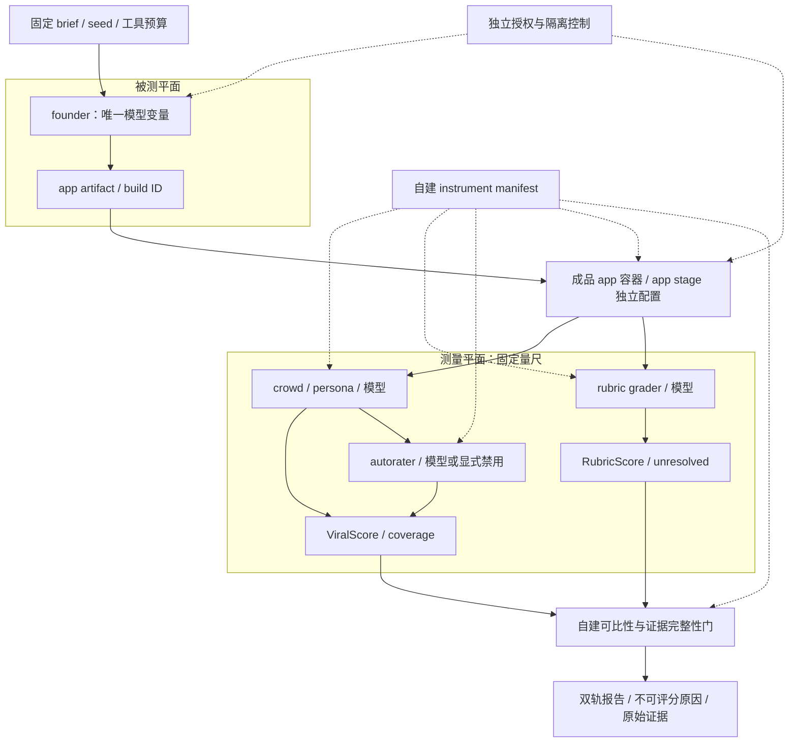

# Agent 评测仪器冻结与评分证据门
## 基于 Google viral-bench 的 POC 模板｜2026-09-30

**结论：先证明量尺没变，再比较被测模型。** 本文是固定源码推导的设计与验收模板（source-based），不是 benchmark 实测；十张卡全部 `NOT_RUN`。对象为 Google 组织下的 viral-bench，不宣称项目刚创建，也不代表 Google 官方支持产品。[1]

范围固定于 `686b4a8a8003d9258d84ee8c03927e84f80aa641`。未安装、导入或运行上游代码，未调用模型、启动容器或接触客户数据。导入链的静态信息不等于运行安全证明。后续真实 runner 若通过验证，另附运行环境、原始证据与结果，不预写“已通过”。

## 一、三柱落点：问答、POC、架构

- **客户问答**：“只换 founder，为何分数仍不可比？”因为 judge、crowd、app 模型、提示词、persona、seed、工具和有效证据覆盖也可能变化。
- **POC**：功能 rubric 与模拟体验 ViralScore 双轨报告；同时报告未评分、明确失败和未决项，不把它们压成一个平均分。
- **架构资产**：把被测平面、测量平面和执行边界分开，用自建 manifest 绑定可比条件，而非把一份排行榜当作验收。

### 三种方案比较（均为建议，尚未执行）

|方案|回答的问题|代价与盲区|交付与适用|
|---|---|---|---|
|A 静态评分契约|缺证据时是否错误给分？|成本最低；不验证运行与模型能力|十卡预期、版本快照；适合立项和指标设计|
|B 固定 app 重评|量尺本身稳定吗？|需隔离环境与调用预算；不评价生成能力|同一 artifact、固定任务，重复裁判/模拟用户；给未决率、覆盖和评分波动|
|C 仅换 founder 的端到端双轨|哪种被测配置更适合任务？|构建、浏览器与 crowd 成本最高；仍非真实市场|成对 brief/seed，多次构建；功能、模拟体验、成本与失败原因并列|

**推荐 A→B→C，而非直接跑 C。** 先锁定失败语义，再用健康、故障、罐头输出的对照 app 校准量尺，稳定后才换 founder。样本量、预算和停止条件预先登记；中途调权只能另列敏感性分析，不能挑最有利 profile 报主结果。生产采用率仍需获授权的真实用户研究。

## 二、源码里真正存在的规则

### 1. 分配置不等于已冻结

`stage_model` 先查 `local.models[stage]`，再查该 stage 的 fallback；映射包含 founder、crowd、grader、autorater、app。[2:83–111] judge 在本模板指 rubric grader 与可选 autorater，不是上游新增 stage。配置缺失可返回空值，不应擅自补同一个模型。

founder 是被测变量；crowd 模拟用户，grader 判断功能，autorater 提供定性维度，app 是成品运行时自己的模型。改变 founder 不应连带改变其他 stage；但共享服务、凭据、环境和实际生效配置仍需独立核对。**跨实验 instrument hash 与拒绝比较门是本文建议，不是上游既有保证。**

### 2. None、0、unresolved、N_A 不可互换

|语义|源码行为与报告要求|
|---|---|
|ViralScore `None`|零访谈、访谈少于配置门槛、adoption 与 craft 都缺失，或 `run_ok` 为假，均阻止产生分数；另存原因，不填 0。[3:611–683]|
|RubricScore `0`|Tier 0 判定缺失或未通过会清零；也可能因不得分等原因得零，必须保留 `gate_failures`，不能仅凭数值归因。[5:213–249]|
|`unresolved`|适用 scored item 缺判定或各次均为 None 时不获分，但仍留在适用分母；这是未能判断，不等同“已检查且失败”。[5:73–82,219–228]|
|`N_A`|本模板对上游 `not_applicable` 元数据的展示名称。`score_rubric` 只遍历合并后的 `rubric.scored_items` 计算分母，不按 `not_applicable` 字段二次过滤；项只要仍在 `scored_items` 就计入分母。只有 schema 载入/合并阶段把 `universal_overrides.applicable=false` 且带理由的通用项移出后，该项才不出现在适用分母中。取证失败应是 `unresolved`，不能改成 N_A。[5:32–40,219–228][9:177–187,349–363]|

两种分数衡量不同对象，不应直接求平均。建议附件另设 `execution_status`、`measurement_status`、`business_verdict`；“模拟未完成”“无法评分”“功能失败”允许并存，避免一个 status 吞掉根因。缺 autorater 时其权重可能被重归一化，即便 profile 同名也要标明实际维度覆盖。[3:650–679]

### 3. “默认”取决于入口

- YAML 的 `active_profile: v7_equal` 使用 `evidence_graded`，broken/self-check floor 分别为 **0.1/0.55**。[6:35–36,83–106]
- 直接构造 `ScoreWeights()` 的 `code-default` 则是 `hard` 与 **0.2/0.6**。[3:76–101,220–236]
- `does_what_it_claims is not False` 时 gate=1，包含未验证；它不是“业务验收通过”。失败时先区分 build/run dead 与 self-check failed；hard 直接取 floor，graded 使用 `floor + (1-floor) × clamp(valid_trials/exposed,0,1)`，无 exposure 时 witness=0。[3:588–608]
- 有效 trial 必须 finished、非 degraded 且 `app_reachable is True`；未知可达不是有效证据。[4:168–188]

**graded 是健康证据折扣门，不是权限授权门。** 它不授予 shell、网络、数据或发布权限；Rubric Tier 0 也不能代替安全审批。

## 三、测量平面图

实线为数据流，虚线为配置/约束；M、G 与独立安全控制是建议层。



README 明确：**成品 app 容器化，founder build 在 host**；图中的 app 容器不包住构建行为。[1:345–359] POC 建议另用专用、可销毁的构建环境，限制出网、挂载和凭据；这不是上游已实现声明。app stage 建议使用独立凭据；缺 key 时可能 fallback 为罐头输出且仍健康，因此“能启动”不能代表功能有效。图未声称已验证容器逃逸防护或端到端信任边界。

## 四、自建 instrument manifest 模板

下面是建议字段，**不是上游文件格式或现成命令**。所有占位符填完才能用于比较；不放 API key，仅记凭据用途标识。记录请求配置及实际生效配置，不能只抄 YAML。

```yaml
schema: sa-instrument-proposal/v1
source_sha: 686b4a8a8003d9258d84ee8c03927e84f80aa641
execution_status: NOT_RUN
sut:
  founder_model_revision: TO_FILL
  artifact_sha256: TO_FILL
instrument:
  resolved_models: {crowd: TO_FILL, grader: TO_FILL, autorater: TO_FILL, app: TO_FILL}
  prompts_personas_rubric_hashes: TO_FILL
  founder_harness_prompt_tools_hash: TO_FILL
  model_parameters_endpoints: TO_FILL
  brief_set_seed_schedule: TO_FILL
  budgets_retries_timeouts: TO_FILL
  runtime_image_browser_dependency_hashes: TO_FILL
  score_version_profile_effective_weights: TO_FILL
  gate_policy_floors_minimums: TO_FILL
  required_signal_coverage_policy: TO_FILL
  app_fallback_policy_credential_role: TO_FILL
instrument_sha256: TO_FILL
run:
  execution_id: TO_FILL
  actual_seeds_and_timestamps: TO_FILL
  signal_counts_missing_reasons: TO_FILL
  evidence_index_hash: TO_FILL
```

建议对 `instrument` 做规范化 JSON 后算 SHA-256；将被测模型、生成 artifact、时间和结果放在哈希外，运行记录再绑定它们。量尺哈希一致只是必要条件，不是充分条件：还须核对实际配置、证据覆盖与 API 模型漂移。hash 不同则拒绝进入同一主比较，另开实验组；缺证据不靠 hash 自动补齐。

单条评分证据建议结构：`run_id / card_id / instrument_hash / item_id / applicability_reason / expected / observed / raw_evidence_refs / verdicts_per_pass / unresolved / gate_reason / effective_denominator / score / error`。原始日志、截图、输入和 app 输出用内容哈希关联，公开前脱敏；不要用裁判一句“通过”代替证据。

## 五、十张验收卡（预期，不是结果）

`observations` 只在真实执行后填入；以下“未采集”是事实，expected 是源码推导或明确设计要求。

|卡|setup|input|expected|observations|状态|
|---|---|---|---|---|---|
|01 分配置|固定其余四 stage|仅覆盖 founder|其他 stage 解析不变；无配置不偷补模型[2]|未采集|NOT_RUN|
|02 拒跨量尺|启用自建比较门|更换 crowd 或 app 配置|instrument hash 变；拒主比较（建议）|未采集|NOT_RUN|
|03 零访谈|其余信号可用|n_interviews=0|ViralScore=None，保留原因[3]|未采集|NOT_RUN|
|04 不可评分分支|分别构造输入|低于门槛／双主信号缺失／run_ok=false|分别触发 None；不混作模型得零[3]|未采集|NOT_RUN|
|05 Tier 0|适用功能项已有得分|gate verdict 缺失或未通过|RubricScore=0，保留 gate_failures[5]|未采集|NOT_RUN|
|06 未决项|Tier 0 通过|适用 scored item 缺 verdict／全 None|该项不获分、分母不减、记录 unresolved[5]|未采集|NOT_RUN|
|07a/07b N_A 边界（同属卡07，保持十卡）|07a：合并后 item 仍在 `scored_items`，另有 `not_applicable` 元数据；07b：schema 阶段 `universal_overrides.applicable=false` 且有理由|07a：metadata-only 反例；07b：schema 合并场景|07a：`score_rubric` 不按 `not_applicable` 元数据过滤，item 仍计入分母，缺证据记 unresolved；07b：schema 合并先把该通用项移出 `scored_items`/penalties 后才不入适用分母；不得用 N_A 冒充取证失败[5][9]|未采集|NOT_RUN|
|08 默认入口|记录生效 weights|YAML v7_equal vs 直接构造|graded 0.1/0.55 vs hard 0.2/0.6，不合并[3][6]|未采集|NOT_RUN|
|09 健康证据|失败 self-check，分别置 trial 标志|finished/degraded/reachable 的真假与未知|仅三条件合格者计 valid；graded 按 witness，未验证 gate=1 不代表通过[3][4]|未采集|NOT_RUN|
|10 健康假象|获授权的隔离环境（建议）|app key 缺失且命中 fallback|记录真实输出模式；health 不能独立判业务通过；构建边界另核[1]|未采集|NOT_RUN|

卡01只要求验证配置解析，不外推所有 CLI 路径。卡09另测零 exposure 和超界计数；卡10不得为验证“缺 key”而读取或泄露真实密钥。正式报告同时给 attempted、scored、unscorable 的数量及原因，明确总体分母，不只挑有分样本。

## 六、许可与客户沟通

根 LICENSE 为 Apache-2.0，再分发需遵守许可、修改标识与适用 NOTICE 保留要求。[7][8] **这不是整套可运行环境都属 Apache 的承诺**：NOTICE 披露可选 camel-oasis 带入 GPL-2.0-or-later 的 igraph，基础栈亦有 MPL 组件；依赖、浏览器和容器层需分别核查。本文只复述固定 NOTICE，不声称完成锁文件许可闭包或法律审查。README 也说明发布的 founder prompt 已相对结果批次变化；因此不引用历史榜单为本模板背书。[1:112–114]

### 120 秒客户话术（建议稿）

“我们今天不是给您一个模型排行榜，而是先约定什么样的结果值得比较。生成应用的是被测对象；模拟用户、功能裁判、应用自身调用的模型，是另一套必须固定的量尺。只改生成模型却让这些配置一起变化，就很难解释差异来自哪里。

我们的建议有三步：先审评分契约，再拿固定应用校准裁判，最后做只更换被测模型的成对实验。结果分两条线：功能是否满足要求，以及模拟用户如何体验。模拟采用不能直接当成真实客户采用率。

报告还会区别三种情况：没有足够证据而不能评分；真正触发功能门得到零分；裁判无法判断的未决项。未决不是不适用，不能偷偷删掉分母。健康检查只是证据之一，即使应用能启动，也可能在输出兜底内容。

我们会提交配置清单、版本、证据索引与架构边界。成品应用的容器并不隔离构建过程，运行授权也不会由分数代替。今天这份材料只是源码依据的模板，所有执行卡尚未运行；以后完成真实验证，我们再附可复核结果，而不是提前许诺效果。”

## 七、固定来源

以下九个固定 URL 均实际执行 HEAD，最终 HTTP 200；正文依据此前保存的同 SHA 内容。HEAD 只说明链接可达，不证明代码可运行。行号对应固定文件。

[1]: https://raw.githubusercontent.com/google/viral-bench/686b4a8a8003d9258d84ee8c03927e84f80aa641/README.md
[2]: https://raw.githubusercontent.com/google/viral-bench/686b4a8a8003d9258d84ee8c03927e84f80aa641/src/viral_bench/config.py
[3]: https://raw.githubusercontent.com/google/viral-bench/686b4a8a8003d9258d84ee8c03927e84f80aa641/src/viral_bench/score/viralscore.py
[4]: https://raw.githubusercontent.com/google/viral-bench/686b4a8a8003d9258d84ee8c03927e84f80aa641/src/viral_bench/score/signals.py
[5]: https://raw.githubusercontent.com/google/viral-bench/686b4a8a8003d9258d84ee8c03927e84f80aa641/src/viral_bench/rubric/score.py
[6]: https://raw.githubusercontent.com/google/viral-bench/686b4a8a8003d9258d84ee8c03927e84f80aa641/config/score.yaml
[7]: https://raw.githubusercontent.com/google/viral-bench/686b4a8a8003d9258d84ee8c03927e84f80aa641/LICENSE
[8]: https://raw.githubusercontent.com/google/viral-bench/686b4a8a8003d9258d84ee8c03927e84f80aa641/NOTICE
[9]: https://raw.githubusercontent.com/google/viral-bench/686b4a8a8003d9258d84ee8c03927e84f80aa641/src/viral_bench/rubric/schema.py
