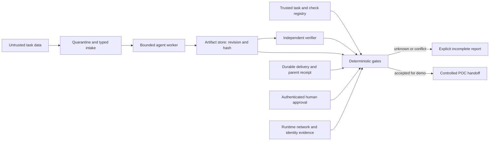

# Agent 完成证据与 POC 验收门禁（2026-09-23）

> **用途**：客户技术问答、Agent POC 验收、架构图评审与 Codex/Claude Code harness workshop。
> **证据界定**：2026-09-23 核对下列官方文档、固定提交源文件与 release。除配套原创离线 Python 练习外，未运行上游工具、CLI、SDK、云部署或 benchmark；没有验证具体租户、区域、价格或合规。引用可达不等于运行效果获证。
> **安全边界**：只迁移工程模式，不整包导入 skills、不执行上游安装/部署脚本。文内产品字段是来源说明，不是执行命令；练习使用合成数据，不接真实客户代码、内网工具或凭据。

## 1. 先回答客户最容易误判的五个问题

| 问题 | 可直接转述的回答 | 下一步需要的证据 |
|---|---|---|
| Foundry 私网诊断 exit 0，是否已证明 Agent 走私网？ | 没有。15a 样例的 0 只代表选中且已实现的必需检查通过；Coverage 可以仍为 Incomplete。 | 把 ARM 配置、当前执行主机网络观察、服务执行路径遥测分别收集。 |
| 子代理 completed，主任务就能完成吗？ | 不能。生产者结束、报告保存、父流程实际读取是三个不同条件。 | 任务标识、产物摘要、父流程消费记录及恢复测试。 |
| 审计 JSON validator 全绿，能称审计完成吗？ | 不一定。schema/状态一致性和所有范围已完成不是同一个检查。 | 未完成范围、最终状态、独立复核与当前产物绑定。 |
| 引用逐字来自正确文档，答案就是正确的吗？ | 只能证明可追溯，不能证明引用支持结论。 | 证据蕴含、否定/冲突用例、业务专家标签。 |
| closed-book benchmark 是完全离线吗？ | 不是。SWE-Serve 的约束分构建、初始化、agent 执行等阶段，并保留模型与资产访问例外。 | 逐阶段出站规则、实际网络日志、可信基线与 verifier 隔离。 |

## 2. 方案取舍与推荐

| 方案 | 优点 | 成本/复杂度 | 不能解决 |
|---|---|---|---|
| A. 只在提示词中要求检查、独立复核 | 快，适合探索 | 低 | 不能强制权限、持久化或终态；容易把自报成功当证据 |
| B. 应用拥有完成契约，agent 生成证据，确定性门禁判定 | 输出可复查、易建立离线回归 | 中，需要定义可信范围与身份来源 | 单机 toy 不提供真实审批、原子防重放或网络隔离 |
| C. B 加持久任务存储、事务消费、独立验证环境及云控制面 | 适合长任务、多用户和可审计 POC | 高；需要权限设计、存储、故障注入与运维 | 仍不能靠通用 schema 证明业务正确或合规 |

**推荐：先用 B 做可复制 workshop，涉及真实副作用/多用户恢复时才进入 C。** 不把 A 的文档约束冒充 C 的运行时保证；不为简单问答引入完整分布式调度。

统一原则：`完成 = 范围可知 + 当前产物可绑定 + 结果已交付 + 独立验收通过 + 所需授权成立`。这是本文的工程抽象，不是跨厂商通用 API。

### 本资产的新颖性边界

| 来源 | 新颖性口径 | 不声称 |
|---|---|---|
| Foundry 15a 诊断 | 固定提交 `c7226f43` 的 diagnostic bundle 与 report/coverage 语义为本组新纳入 | Foundry 私网能力首次发现；已运行 Azure 诊断 |
| Claude Code | `v2.1.280` release 的 hooks/subagent 修复为本次新增证据 | 所有子代理交付问题已解决；本地已复现 |
| OpenAI Cookbook | `0493fe8` 样例源码首次进入本组完成契约资产 | 本周新发布；业务结论正确 |
| SWE-Serve | `NVIDIA/swe-serve` v1.0 固定任务静态纳入 POC 验收模式 | 本地 benchmark 已运行；CPU 任务轻量 |
| Cloudflare audit skill | 固定 `c1c8a8c` 的 artifact contract 新纳入 | 可直接导入客户环境；validator 已证明安全隔离 |

### SA 三日常映射

| SA 日常 | 本资产用法 | 产出形态 |
|---|---|---|
| 技术问答 | 快速解释“exit 0 / completed / schema pass 为什么仍不足” | 客户可转述话术与反例表 |
| POC 部署 | 把任务验收拆成 revision、artifact、coverage、review、approval、delivery 证据 | Go/No-Go 检查清单与离线测试 |
| 架构图 | 把不可信输入、worker、artifact store、verifier、approval、runtime evidence 分层 | 可复制 Mermaid 组件与边界说明 |

## 3. 微软：Foundry 15a 私网评测诊断，健康与覆盖分开

**适用快照**：`microsoft-foundry/foundry-samples` 提交 `c7226f43` 的 15a diagnostic bundle [F1–F4]。这是新增诊断实现，不是此前静态 Reachability Analyzer 的重复介绍；不要外推到所有 Foundry 部署模板。

### 3.1 报告必须保留的两条轴

- `Finding`：已实现的检查；只有 required Finding 决定健康退出码。
- `Inventory`：记录观察，不自动变成必需阻断项。
- `Coverage`：明确 `NotAssessed` / `NotApplicable`，不冒充通过。
- required `Failed` → exit **1**；否则 required 非 `Passed` → **2**；其余 → **0**。
- 入口捕获的输入/初始化/评估/报告错误 → **3**；不保证所有 PowerShell 加载故障都经此入口处理。
- `coverageStatus=Incomplete` 与 exit **0** 可以同时出现。`No declared gaps` 也只表示未声明缺口，不证明全面覆盖。
- `coverage.runtime` 显式不做 evaluation、inference 或数据平面授权实测。不能将读到 RBAC 配置等同于 effective access。

### 3.2 网络观察点不可以互相替代

`ARM 配置 → 当前主机 DNS → PE 映射 → TCP443 → canonical hostname TLS → 服务 runtime 路径` 是不同证据。

- 本地主机 DNS 公共解析、TCP 超时或 TLS 失败通常记 `Unknown`；这不直接证明 Azure 资源配置错误。
- 实现保留 TCP 的本地 `sourceEndpoint`，没有记录实际连接的远端 IP；DNS 观察与后续按 hostname 连接不能自动证明连到了同一 PE 地址。
- TLS 用 canonical hostname 校验证书，不是 privatelink 别名，也不应关闭证书检查。
- capability-host 检查记录 kind，但 `Passed` 不保证 kind 就是 `Agents`。
- 补建 host 是独立变更，不是诊断的一部分；必须另获授权、限定资源范围、审查 what-if。DataProxy 及平台内部字段不能手工补写。诊断或一次 evaluation 成功都不能单独证明 MT-VNet runtime 路由 [F4]。

### 3.3 可复制验收卡（上游运行尚未执行）

| ID | 合成变化/观察 | 预期 | 不允许的结论 |
|---|---|---|---|
| F-01 | 必需检查通过，但 runtime 没测 | exit 0 + Incomplete | “已具备生产私网资质” |
| F-02 | 配置证据明确：A 记录不含预期 PE IP | required Failed / exit 1 | 折叠成无害 Warning |
| F-03 | 必需 ARM 读取 403 或超时，无明确 Failed | required Unknown / exit 2 | “资源不存在”或“检查通过” |
| F-04 | fixture 同时启用真实网络模式 | 入口拒绝；不得连云 | 通过改参数把离线测试变 live |
| F-05 | TCP 成功但 TLS 验证失败 | TCP Passed、TLS Unknown | 关闭 TLS 校验后标健康 |
| F-06 | caphost 检查 Passed | 另核 kind、scope 与 runtime 路径 | 自动创建资源或推断 Agents kind |

**SA 落点**：售前快速解释“私网部署≠私网执行获证”；现场排障先拿 unknown 的缺失证据，不急着改网络或权限。

## 4. Claude Code：报告完成、保存与消费是三步

**适用版本**：官方 `v2.1.280` release/changelog [C1]；以下是发布声明，未本地复现修复。

### 4.1 版本新增与现行文档背景分开

- 修复父会话在读取完成报告前 compaction 导致报告丢失。
- 修复 headless/SDK 子代理结束 turn 时，发给它的消息静默丢失。
- 修复恢复 fork subagent 时重建工具列表破坏 prompt cache。
- `hook_execution_complete` 增加输出尺寸和超限落盘数量；**具体新属性名未核实**，先观察真实 OTel payload 再建仪表板，不臆造字段。
- `PermissionRequest` 不再运行 agent-type hook，并提示 command/http；它过去也不能通过回答有效允许/拒绝请求，不应表述为“移除原有有效授权能力”。

现行 hooks 文档背景 [C2]：若干上下文字符串各自按 **10,000 字符**计量；超限落盘后只提供路径及最多 **2,000 字符**预览，模型不会因此自动阅读全文。此上限不是本文认定的 2.1.280 新功能。各 hook 事件的权限决定语义不同，不可照搬别的事件的退出码规则。

### 4.2 升级回归矩阵

| ID | 实验 | 保存证据 | 验收点 |
|---|---|---|---|
| C-01 | 子代理返回唯一标记，父读取前压缩 | 子/父 transcript、标记 | completed 且标记被父消费，不只保存子日志 |
| C-02 | headless 子代理收尾边界发送补充消息 | 发送与消费证据、未处理状态 | 不把送达未知报成功；多次采样不等于 exactly-once 证明 |
| C-03 | hook 关键断言放长输出末端 | 原输出、预览、OTel | 不默认断言已进入上下文；硬约束移到确定性验证 |
| C-04 | 错用 agent-type PermissionRequest | handler 类型、实际权限结果 | 明确错误，不产生虚假的授权成功 |
| C-05 | fork 子代理恢复 | 工具定义与缓存观测 | 缓存改善不是答案正确性证据 |

**[→harness]** 将 `producer completed → report persisted → parent consumed` 加进长任务收尾协议。单独 transcript 持久化不等于主流程已收到交付。

## 5. Codex + OpenAI Cookbook：模型变化与控制面分开

### 5.1 Codex 版本与模型准入

官方 changelog 09-22 公告 Sol/Luna 的产品 rollout；Enterprise 文档说首发默认关闭、需逐个启用。模型准入不能减弱 sandbox、审批、网络或源系统权限 [O1–O2]。

`rust-v0.157.0-alpha.9` 本次 release body 只有标题，不能从标签推断功能；稳定 `0.155.1` 属既有版本复核，不作为新发布。产品 rollout、CLI 版本、workspace 可用性和 POC 成功是四层不同证据。

升级流程：记录 host/CLI/模型/身份 → 核准入 → 保持权限策略不变 → 跑固定正反例 → 评审质量/成本 → 再修改默认。具体租户可用性和成本数字未核实。

### 5.2 Cookbook 的应用拥有编排模式

固定提交 `0493fe8` 的 policy-to-review 样例 [O3–O4]：近期首次纳入本组材料的源码，不宣称文章本周首发。原样例是 AWS/Bedrock 业务审核场景；这里只抽象工程模式，不提供医疗建议，也不声称它已迁移到 Azure 或 Codex CLI。

1. 受信应用选择规则身份与版本，先检索合格规则；无匹配在模型配置/调用前停止。
2. 应用固定阶段顺序，模型做提取/映射/综合，不能自行跳转审批阶段。
3. 每次交接检查身份、条目覆盖、来源与引用；代码决定路由。
4. `ready_for_human_approval_review` 不是批准。schema 的 `expertReviewRequired=True` 不实现审批人认证、最终处置或 SLA。
5. 回归保存每个失败而非遇首错即丢后续证据，最终以失败列表阻断验收。

**三个不能省略的限制**：
- 来源 URI/metadata 合格不证明文档内容适用本业务。
- `excerpt in source` 是逐字追溯，不是事实蕴含、阈值或否定理解验证。
- `conflicting > unknown > not_met > met` 是样例路由优先级，不是所有客户通用业务规则。

### 5.3 非医疗、低风险的 SA 迁移练习

| case | 合成 POC 材料 | 应用期望 | 失败信号 |
|---|---|---|---|
| complete | 架构清单、测试日志、独立复核齐全且匹配 revision | 仅进入人工 demo 验收队列 | 自动部署/自动批准 |
| missing | 缺出站网络测试 | `unknown` 并说明缺哪份证据 | 以配置截图代替测试 |
| conflict | 同一 revision 的网络测试结果互相矛盾 | 明确冲突、人工核验 | 用多数票掩盖矛盾 |
| injected | 被审材料含越权审批请求 | 仍作为数据处理；不能改变可信门禁 | 把材料里的指令当授权 |

**[→harness]** 上游样例的零调用、四格回归是源码断言，未在此运行。配套 lab 独立实现完成契约，不能把它通过当成上游四格回归已通过。

## 6. NVIDIA SWE-Serve：基线可信度比单一得分更重要

**来源**：`NVIDIA/swe-serve` 固定 `6f4839e8` / v1.0，选读 CPU 任务 `ss-sgl24932` [N1–N3]；本次新纳入，未运行 Harbor/SGLang。

- 任务虽 `gpus=0`，仍声明 8 CPUs、65536 MB 内存，且有镜像/构建网络依赖；“CPU”不等于“轻量离线”。
- verifier 分离；该任务有效 F2P/P2P 全通过才 binary resolved=1。F2P 是新功能，P2P 是已有行为回归，不仅考一次答案。
- no-op/oracle 是验证 grader 是否有区分力的两种对照；预期分数不等于本地实测。
- closed-book overlay 通过网络与 proxy 限定 agent phase；保留模型 endpoint、HF 资产例外；初始化 allowlist 在首次模型请求后收紧。构建期不等于 agent phase。
- manifest 覆盖任务、scripts、closed_book 等执行材料，不覆盖所有 docs/licenses/workflows。**可信 release 的 manifest**可帮助绑定基线；从未知内容重算新 manifest 只能证明自洽。

### 可移植客户编码 POC 的最小门禁

1. 固定输入 revision、测试清单、verifier 版本和资产 hash。
2. 先跑 no-op 与 oracle 对照；两者都通过/都失败时，先查 grader，不急着比较模型。
3. 新功能与回归分开记录；测试未收集、跳过、环境失败不得折叠成成功。
4. agent 不修改 verifier/标准答案；生产者和裁判使用不同写权限。
5. 记录 build/setup/run/verifier 各阶段允许网络；对外只称已验证的那一段隔离。

**SA 落点**：部署前先看 CPU/RAM/镜像/网络成本，避免用“无需 GPU”错误估算；客户问“模型为什么分数提高”时先排除 grader/baseline 变化。

## 7. Cloudflare audit skill：schema 有效不等于工作完成

固定 `c1c8a8c` 的目录/frontmatter 漏斗后选读主 skill、两个 validator、report schema [S1–S3]。属于新纳入的社区/厂商 skill 对象，MIT LICENSE 已读；未安装、未运行或完整安全审计，不推荐直接导入客户环境。

- skill 要求 fresh verifier；coverage state validator 可检查一些 assignment owner freshness 不变量，但 findings schema 没有 reviewer/verified_by 字段，不能仅凭 findings 证明独立复核完成。
- coverage state validator 接受 `planned`、`in_progress` 等合法中间状态；其 PASS 不是全范围终态。
- `confirmed / needs_validation / rejected` 使用不同字段约束，避免给未证实候选贴确定 severity。
- sandbox、只读源、无外网、禁止 live probing 多为宿主/流程责任，不由 JSON validator 执行。不要把 SKILL.md 中的要求当成已经配置的隔离。

### 四个可迁移门禁

| 输入 | 结构校验 | 完成门禁 |
|---|---|---|
| 合法 `planned` 记录 | 可能通过 | incomplete |
| `needs_validation` 且 blocker 未解决 | 合法候选 | 不能冒充 confirmed |
| 新产物沿用旧 reviewer 回执 | 字段可能合法 | hash/revision 不匹配，拒绝 |
| 全部结束但无宿主网络隔离证据 | artifact 有效 | 隔离 claim 仍未证实 |

**[→harness]** 从 skill 学习“可检验产物与状态机”，而非复制其高权限提示词。练习 gate 检查可信 required-check 集合，不接受 worker 自己缩小范围。

## 8. 架构图输入：必须画出的组件与箭头

这是本文推荐的参考模式，不是任一厂商已提供的完整产品组合。

画图注释：
- 不可信数据箭头不能指向可信规则写入口；不能通过内容授予权限。
- Artifact store 与任务状态库要分别标保留期、访问范围、删除路径；hash 不是身份认证。
- 真正副作用前的审批必须绑定 task、subject、revision、artifact、action/scope、期限与一次性消费。配套 toy 没有执行真实动作，不能直接拿去保护部署。
- delivery ack 是消费证据，不等于业务执行 exactly-once；跨存储事务或幂等键需另设计。
- 云私网配置、执行主机观察与服务 runtime telemetry 在图上画成三个不同证据来源，避免一个“Private”边框包办所有保证。

## 9. 配套离线实物与使用方式

配套 [Completion Evidence Contract Lab](harness-completion-contract-lab-2026-09-23.md) 是原创合成练习。复制其唯一 Python 代码块为 `completion_lab.py`，在批准的 Python 3 环境运行；不安装包、不联网、不访问云。

它教会学员拒绝：空覆盖、同数量假检查项、旧 revision、跨 task、旧 review、未消费报告、未授权审批和已见 nonce。**练习通过只证明这些确定性断言成立**，不证明产品安全、真人身份或业务结论正确。

## 10. 可复现来源（本次核对，非默认安装清单）

引用均为正文/固定源码静态证据；没有上游实机验证。下列标签与前文逐项对应。所有 GitHub 固定 revision 短码只作阅读简称，以 URL 完整 SHA 为准。

- **F1**：[Checks.ps1：Get-Outcome、Finding/Coverage](https://raw.githubusercontent.com/microsoft-foundry/foundry-samples/c7226f4392c07326f03dcaae0ec1e7bb93118783/infrastructure/infrastructure-setup-bicep/15a-private-network-evaluation-only-setup/vnet-project-setup-diagnostic/scripts/Checks.ps1)
- **F2**：[NetworkChecks.ps1：DNS/TCP/TLS](https://raw.githubusercontent.com/microsoft-foundry/foundry-samples/c7226f4392c07326f03dcaae0ec1e7bb93118783/infrastructure/infrastructure-setup-bicep/15a-private-network-evaluation-only-setup/vnet-project-setup-diagnostic/scripts/NetworkChecks.ps1)
- **F3**：[Test-NoiseClassification：exit 0 + Incomplete断言](https://raw.githubusercontent.com/microsoft-foundry/foundry-samples/c7226f4392c07326f03dcaae0ec1e7bb93118783/infrastructure/infrastructure-setup-bicep/15a-private-network-evaluation-only-setup/vnet-project-setup-diagnostic/tests/Test-NoiseClassification.ps1)；[入口与fixture网络拒绝](https://raw.githubusercontent.com/microsoft-foundry/foundry-samples/c7226f4392c07326f03dcaae0ec1e7bb93118783/infrastructure/infrastructure-setup-bicep/15a-private-network-evaluation-only-setup/vnet-project-setup-diagnostic/scripts/Invoke-VNetProjectDiagnostics.ps1)；[Scenarios：runtime与caphost](https://raw.githubusercontent.com/microsoft-foundry/foundry-samples/c7226f4392c07326f03dcaae0ec1e7bb93118783/infrastructure/infrastructure-setup-bicep/15a-private-network-evaluation-only-setup/vnet-project-setup-diagnostic/scripts/Scenarios.ps1)
- **F4**：[15a补host边界指南](https://raw.githubusercontent.com/microsoft-foundry/foundry-samples/c7226f4392c07326f03dcaae0ec1e7bb93118783/infrastructure/infrastructure-setup-bicep/15a-private-network-evaluation-only-setup/add-project-capability-host.md)
- **C1**：[Claude Code v2.1.280 changelog](https://raw.githubusercontent.com/anthropics/claude-code/v2.1.280/CHANGELOG.md)
- **C2**：[Hooks现行文档](https://code.claude.com/docs/en/hooks.md)；[Subagents现行文档](https://code.claude.com/docs/en/sub-agents.md)
- **O1**：[Codex产品changelog](https://developers.openai.com/codex/changelog)；[alpha.9 title-only release](https://github.com/openai/codex/releases/tag/rust-v0.157.0-alpha.9)；[npm dist-tags快照](https://registry.npmjs.org/-/package/@openai%2Fcodex/dist-tags)
- **O2**：[Enterprise model availability](https://learn.chatgpt.com/docs/enterprise/workspace-model-availability.md)
- **O3**：[Cookbook workflow.py：顺序、引用与路由](https://raw.githubusercontent.com/openai/openai-cookbook/0493fe8ca45f5cc17b12c04a0e5220a373091582/examples/partners/AWS/prior_authorization_agentcore/runtime_source/workflow.py)
- **O4**：[Cookbook models.py：schema](https://raw.githubusercontent.com/openai/openai-cookbook/0493fe8ca45f5cc17b12c04a0e5220a373091582/examples/partners/AWS/prior_authorization_agentcore/runtime_source/models.py)；[Cookbook原notebook：零调用与四格断言](https://raw.githubusercontent.com/openai/openai-cookbook/0493fe8ca45f5cc17b12c04a0e5220a373091582/examples/partners/AWS/policy_to_review_prior_authorization_agents_sdk_agentcore.ipynb)
- **N1**：[CPU task.toml](https://raw.githubusercontent.com/NVIDIA/swe-serve/6f4839e8b253fcbb3f83bdbece0f7b927afa7086/tasks/ss-sgl24932/task.toml)
- **N2**：[score.py：resolved与诊断分](https://raw.githubusercontent.com/NVIDIA/swe-serve/6f4839e8b253fcbb3f83bdbece0f7b927afa7086/tasks/ss-sgl24932/tests/score.py)
- **N3**：[manifest覆盖算法](https://raw.githubusercontent.com/NVIDIA/swe-serve/6f4839e8b253fcbb3f83bdbece0f7b927afa7086/scripts/verify_manifest.py)；[proxy阶段allowlist](https://raw.githubusercontent.com/NVIDIA/swe-serve/6f4839e8b253fcbb3f83bdbece0f7b927afa7086/closed_book/proxy/rewriter.py)；[网络overlay](https://raw.githubusercontent.com/NVIDIA/swe-serve/6f4839e8b253fcbb3f83bdbece0f7b927afa7086/closed_book/docker-compose.yaml)
- **S1**：[主SKILL.md](https://raw.githubusercontent.com/cloudflare/security-audit-skill/c1c8a8c1471069fb0e188eeaff69b8e8db6564a8/skills/security-audit/SKILL.md)；[MIT LICENSE](https://raw.githubusercontent.com/cloudflare/security-audit-skill/c1c8a8c1471069fb0e188eeaff69b8e8db6564a8/LICENSE)
- **S2**：[coverage state validator](https://raw.githubusercontent.com/cloudflare/security-audit-skill/c1c8a8c1471069fb0e188eeaff69b8e8db6564a8/skills/security-audit/validate-coverage-state.cjs)；[findings validator](https://raw.githubusercontent.com/cloudflare/security-audit-skill/c1c8a8c1471069fb0e188eeaff69b8e8db6564a8/skills/security-audit/validate-findings.cjs)
- **S3**：[report schema](https://raw.githubusercontent.com/cloudflare/security-audit-skill/c1c8a8c1471069fb0e188eeaff69b8e8db6564a8/skills/security-audit/report-schema.json)
