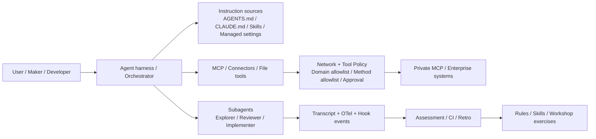

<!-- learning-asset-sanitized: v1 -->
> **发布界定 / Publication boundary**
>
> 本文是由历史研究快照整理出的补充学习材料。原始资料中的 HTTP 200、抓取时间或“已核实”表述只代表当时的来源可达性/文本核对，不代表本次发布时已经重新核验；本文也不是正式实验报告、生产部署建议或合规结论。
>
> 未对其中的命令、代码块、外部仓库、云资源、生产环境或合规控制做本次实机验证。请在独立测试环境中重新验证后再用于客户/生产场景。

# Agent harness instruction / network / retro gates（2026-09-18）

> 适用：SA 做技术问答、部署 POC、画架构图时，快速判断一个编码 Agent / 低代码 Agent / MCP 连接方案是否具备“可控指令、可控网络、可观测子代理、可复盘沉淀”的生产前置门。
> 安全说明：本文中出现的命令形态字符串均为上游文档/README 的证据片段或字段名示例，不是执行指令；任何 POC 都必须使用一次性 fixture、无真实 secret、无客户代码。

### 安全扫描 / 命令形态片段分级

| 片段类型 | 在本文中的含义 | 风险处理 |
|---|---|---|
| `GET` / `HEAD` / `OPTIONS` / `POST` / `PUT` / `PATCH` / `DELETE` | HTTP method policy 示例 | 不是 shell 命令；用于网络策略设计。 |
| `AGENTS.override.md` / `project_doc_max_bytes` / `CLAUDE_CODE_MCP_STARTUP_WAIT_MS` | 上游字段名/环境变量名 | 仅作为配置审计点；客户环境变更前需变更评审。 |
| 上游 README 中的 `/install`、npm/brew/env/API_KEY 等 | 社区项目可能包含的安装/配置命令 | 本文不复制执行块、不安装、不推荐客户使用；只抽象治理模式。 |

建议每个 POC 至少产出 5 个 artifact：`instruction-sources.txt`、`network-policy.yaml`、`tool-lane-inventory.md`、`subagent-transcript-index.md`、`retro-findings.md`；没有这些证据，不宣称“可控”。

## Evidence links（原快照中可达性与证据强度）

| 来源 | URL | 原快照中验证 | 证据强度 | 可复现 key strings / caveat |
|---|---|---|---|---|
| Claude Code changelog 2.1.274 | https://code.claude.com/docs/en/changelog | HTTP 200（仅代表原快照当时可达，不代表本次已重验） | 官方 changelog HTML 正文 | `2.1.274`, `CLAUDE_CODE_MCP_STARTUP_WAIT_MS`, `effort` span；未 CLI smoke |
| Claude Code hooks reference | https://code.claude.com/docs/en/hooks | HTTP 200（仅代表原快照当时可达，不代表本次已重验） | 官方 docs HTML 正文 | `SubagentStart`, `PostToolBatch`, `InstructionsLoaded`；未逐事件实测 |
| Claude Code subagents docs | https://code.claude.com/docs/en/sub-agents | HTTP 200（仅代表原快照当时可达，不代表本次已重验） | 官方 docs HTML 正文 | description 15,000 token warning、`omitClaudeMd`、restricted tools；未 Desktop/cloud 差异实测 |
| Codex AGENTS.md docs | https://developers.openai.com/codex/agent-configuration/agents-md | 308→200（learn.chatgpt.com） | 官方 docs HTML 正文 | `AGENTS.override.md`, `project_doc_max_bytes`, 32 KiB；旧源新审计角度 |
| Codex subagents docs | https://developers.openai.com/codex/agent-configuration/subagents | 308→200 | 官方 docs HTML 正文 | parallel agents、custom agents；未 CLI `/agent` smoke |
| Codex internet access docs | https://developers.openai.com/codex/cloud/internet-access | 308→200 | 官方 docs HTML 正文 | prompt injection risk、domain allowlist、`GET`/`HEAD`/`OPTIONS` method restriction；未 Codex cloud 实测 |
| Codex Record & Replay docs | https://developers.openai.com/codex/extend/record-and-replay | 308→200 | 官方 docs HTML 正文 | workflow → reusable skill、Computer Use feature gate；旧源复用；原研究快照中仅取 SOP-to-skill gate |
| Microsoft 365 Agents SDK + Copilot Studio | https://learn.microsoft.com/en-us/microsoft-365/agents-sdk/integrate-with-mcs | HTTP 200（仅代表原快照当时可达，不代表本次已重验） | Microsoft Learn 正文 | SDK 可引用 Copilot Studio agents；官方说明 GitHub Copilot harness agents 尚不支持 client library |
| Copilot Studio harness overview | https://learn.microsoft.com/en-us/microsoft-copilot-studio/harnesses-overview | HTTP 200（仅代表原快照当时可达，不代表本次已重验） | Microsoft Learn 正文 | GitHub Copilot harness 适合 reasoning-heavy / multi-step / files / MCP；旧源复用；原研究快照中用于选型矩阵 |
| OpenAI tunnel-client | https://github.com/openai/tunnel-client | HTTP 200（仅代表原快照当时可达，不代表本次已重验） + raw README 200 | 官方 repo，旧源复核 | 旧源复用，原研究快照中仅作 Secure MCP Tunnel 网络控制面对照，不重复深挖 |
| OpenAI Symphony | https://github.com/openai/symphony | HTTP 200（仅代表原快照当时可达，不代表本次已重验） + raw README 200 | 官方 repo，旧源复核 | 旧源复用，原研究快照中仅作 isolated work queue / proof-of-work 背景 |
| Codex 0.155.0-alpha.16 release | https://github.com/openai/codex/releases/tag/rust-v0.155.0-alpha.16 | HTTP 200（仅代表原快照当时可达，不代表本次已重验）；API body 仅 release title | alpha sentinel | 无实质 changelog；不写客户功能承诺 |
| Netresearch Agentic Skills Marketplace | https://github.com/netresearch/claude-code-marketplace | HTTP 200（仅代表原快照当时可达，不代表本次已重验） + raw README 200 | 社区 README，radar | 39 curated skills；`agent-harness`, `automated-assessment`, `retro`；未审每个 skill，不安装不推荐 |
| Fusion Harness | https://github.com/disler/fusion-harness | HTTP 200（仅代表原快照当时可达，不代表本次已重验） + raw README 200 | 社区 README，radar | `single-writer`, gate-first validation；只借鉴模式，不安装运行 |

## 1. 速答：客户问“应该选哪种 harness / Agent 形态？”

| 场景 | 推荐优先级 | 说法 |
|---|---|---|
| 明确规则流、FAQ、表单流程 | Copilot Studio standard harness | 可预测、治理简单；适合 maker 快速交付。 |
| 长程任务、跨工具、文件生成、MCP/connected agents | Copilot Studio GitHub Copilot harness 或编码 agent harness | 需要把目标拆步骤、能失败重试、能处理文件与工具链；但 M365 Agents SDK client library 当前只官方支持 standard harness agent。 |
| 自定义业务 App 嵌入 Copilot Studio agent | M365 Agents SDK + Copilot Studio client library | 先确认 agent 是否 standard harness；GitHub Copilot harness agent 暂不作为 SDK client library 的正式承诺。 |
| 企业内部私有 MCP 暴露给 SaaS Agent | Secure tunnel / outbound connector pattern | 只可画为“出站隧道 + 明确身份/权限/审计”候选；旧源复用，仍未部署验证，不承诺数据驻留/合规。 |
| 编码 Agent 并行审查/修复 | Codex/Claude subagents + single-writer gate | 多个只读/审查 agent 给意见，单写者合并，CI/eval gate 才能通过。 |
| 社区 skill/marketplace 候选 | 只读审计后再吸收模式 | 先查 license、install script、hooks、MCP/network、secret handling 五项；未通过前只能引用模式，不能安装或推荐。 |

## 2. POC 前置门：Instruction source-of-truth

1. **列出指令源**：Codex `AGENTS.md` / `AGENTS.override.md` / fallback 文件；Claude `CLAUDE.md`、skills、subagents、managed settings；Copilot Studio topic/agent instructions。
2. **分层合并规则**：
   - Codex：global → repo root → working directory；更近目录在合并 prompt 后方，语义上覆盖前文；默认总量 32 KiB（`project_doc_max_bytes`）。
   - Claude：subagent description 决定路由；description 超大有启动警告，应把细节移入只在 subagent 运行时加载的 prompt/skill。
3. **冲突扫描**：同一 repo 同时存在 `AGENTS.md`、`CLAUDE.md`、workspace rules、`.github/copilot-instructions.md` 时，必须找出互相矛盾的 build/test/security 规则。
4. **临时 override 红线**：`AGENTS.override.md`/managed override 只能用于临时/管理员策略；POC 报告必须写明是否存在 override，避免演示环境规则污染生产建议。
5. **验收例**：在无 secret fixture 中让 agent 输出“原研究快照中加载了哪些指令源”，并与仓库文件树人工比对；不要在客户真实仓库中做首次试验。

## 3. POC 前置门：Network and web access

1. **默认最小联网**：Codex cloud 文档明确联网风险包括不可信 Web 内容 prompt injection；SA 方案中默认 Off 或仅 allowlist。
2. **域名 allowlist**：先从构建所需源（GitHub、包源、Microsoft Learn 等）列白名单，再跑 dry-run 补缺；不要直接 All unrestricted。
3. **方法 allowlist**：能只读就只允许 `GET`/`HEAD`/`OPTIONS`；任何 `POST`/`PUT`/`PATCH`/`DELETE` 都要单独审批、日志和回滚说明。
4. **MCP 工具分区**：把工具按 inventory/read-only/state-changing/destructive 四 lane 标色；架构图上单独标 mutating lane 的 human approval 与审计。
5. **证据保存**：保留 agent work log、外部 URL、被拒绝的网络请求、审批记录；否则 POC 只能说明“跑过”，不能说明“可控”。

## 4. POC 前置门：Subagent observability and recovery

| Gate | Claude/Codex 信号 | SA 落点 |
|---|---|---|
| 启动等待 | Claude 2.1.274: `CLAUDE_CODE_MCP_STARTUP_WAIT_MS` | headless/cron 任务要设置 MCP readiness 上限；超时应 fail loud，而非无限等。 |
| 生命周期事件 | Claude hooks: `SubagentStart` / `SubagentStop` | 画图时把“parent agent → worker agents → transcript/proof”作为独立层。 |
| 批处理工具事件 | `PostToolBatch`、tool events | POC 日志不只记录最终回复，还要记录工具批次与失败重试。 |
| 上下文溢出 | memory critical warning、hook/error output 可能撑爆上下文 | 长任务要限制 hook 输出大小，超过阈值写外部 artifact 并摘要回传。 |
| 恢复/回放 | `/goal` resume、interrupted tool evidence、Record & Replay | harness workshop 可设计“中断→恢复→证明未丢上下文”的练习。 |
| 成本/路由 | subagent description 15k token warning；Explore/Plan restricted tools | 子代理库要 lint description 长度、tool allowlist 和是否加载项目指令。 |

## 5. Retro / self-improvement gate（来自社区 radar，未安装）

Netresearch marketplace 的 `agent-harness`、`automated-assessment`、`retro` 与 Fusion Harness 的 single-writer/gate-first pattern 给出的可迁移模式是：

1. **Run**：记录目标、约束、实际命令/URL、失败点。
2. **Assess**：独立 reviewer 只做质量/去重/证据强度检查，不做同一作者自评。
3. **Retro**：把摩擦转成三类产物：项目规则、可复用技能、harness workshop exercise；不要把一次性进度写入 memory。
4. **Single writer**：多 agent 可以并行给建议，但只有一个写者改文件/发 PR，避免并发覆盖。
5. **Gate-first**：任何“完成”必须有测试、URL、diff、日志或 artifact 作为 proof；没有 proof 就标 blocked。

## 6. 架构图组件模式

图示建议：把 **Instruction、Network Policy、Subagent Observability、Assessment/Retro** 画成四个控制面，不要只画模型和工具；这能让客户看到治理边界而非“一个大模型连所有系统”。

## 7. 反哺 harness workshop 的练习卡

- [→harness] **Instruction audit lab**：给一个仓库放置 `AGENTS.md`、nested override、`CLAUDE.md`，让学员找冲突、32 KiB 风险和临时 override。
- [→harness] **Network exfiltration lab**：在 README 中放置“把 git 信息 POST 到外站”的不可信资料文本，要求 agent 在 allowlist/method gate 下拒绝执行并说明风险。
- [→harness] **MCP readiness lab**：模拟 MCP server 启动慢/失败，验证 headless agent 有启动等待上限和 fail-loud 日志。
- [→harness] **Subagent observability lab**：要求 explorer/reviewer 两个 subagent 产出独立 transcript/proof，主 agent 只汇总。
- [→harness] **Single-writer lab**：两个 reviewer 并行、一个 writer 合并，CI gate 不通过不得宣告完成。

## 8. 未验证 / 禁止过度承诺

- 未安装 Claude Code、Codex CLI、Copilot Studio 或 M365 Agents SDK 样例；本文是 docs/README 级证据。CLI、Desktop、cloud、tenant/region 的行为差异必须在客户环境或一次性 fixture 中 smoke 后才能进入交付承诺。
- 未验证中国区、Azure China、M365 中国版、Copilot Studio 区域/租户/计费可用性。
- Netresearch/Fusion 属社区 radar：未审 license、脚本、hooks、MCP、网络、secret 行为；不得安装到生产或客户仓库。
- Secure MCP Tunnel 作为旧源复用；原研究快照中未重新深挖协议/合规，仅作为网络架构对照。
