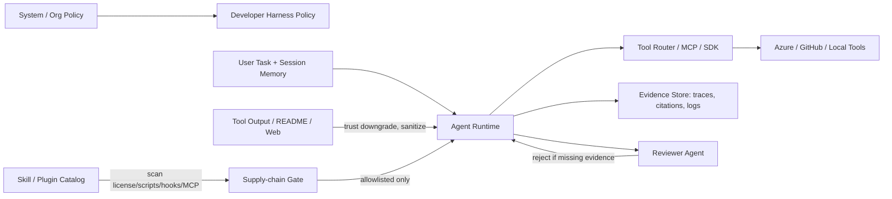

<!-- learning-asset-sanitized: v1 -->
> **发布界定 / Publication boundary**
>
> 本文是由历史研究快照整理出的补充学习材料。原始资料中的 HTTP 200、抓取时间或“已核实”表述只代表当时的来源可达性/文本核对，不代表本次发布时已经重新核验；本文也不是正式实验报告、生产部署建议或合规结论。
>
> 未对其中的命令、代码块、外部仓库、云资源、生产环境或合规控制做本次实机验证。请在独立测试环境中重新验证后再用于客户/生产场景。

# Agent Harness Trust / Output / Workflow Gates（2026-09-06）

> 用途：SA 在技术问答、POC 部署、架构图评审中，快速判断一个 Agent 方案是否具备“可信上下文边界、可追溯输出、可恢复工作流、可审计技能/插件供应链”。
>
> 安全说明：本文中的命令形态、配置字段与工具名均为上游证据摘录或检查项，不是直接执行指令；任何 POC 只允许在临时 fixture / 测试订阅 / 无真实 secret 环境验证。

## Evidence links（原研究快照中已可达核实）

| 证据 | URL | 原研究快照中核实 | 用途 | Caveat |
|---|---|---|---|---|
| Semantic Kernel Magentic ledger role fix | https://github.com/microsoft/semantic-kernel/commit/f8c5ba7aec210c986086a997fc4eef65190666eb | commit/diff 200；diff 命中 `AuthorRole.User` / `AuthorRole.System` / `ledger` | 上下文信任边界 | commit级；未跑SK sample |
| MAF Foundry hosted streamed annotations | https://github.com/microsoft/agent-framework/commit/2c49f50cf08ebb6c1687146336f039051f159333 | commit/diff 200；diff 命中 annotation/stream | 流式 citation/annotation 完整性 | commit级；未确认入正式包 |
| Azure SDK `azure-ai-projects_2.6.0` | https://github.com/Azure/azure-sdk-for-python/releases/tag/azure-ai-projects_2.6.0 | release 200；HTML 命中 AgentInsight / ShellToolboxTool / WebSearchTool / Microsoft 365 | Foundry Projects SDK POC intake | release级；未安装包/未租户验证 |
| Azure agentserver resilient samples | https://github.com/Azure/azure-sdk-for-python/commit/afbc3aa1623e563f6b375f9a23ce1ae92c0af719 | commit 200 | 长任务 invocation sample radar | commit级；未运行样例 |
| GitHub Copilot GPT-6 Astra GA | https://github.blog/changelog/2026-09-04-gpt-6-astra-is-generally-available-in-github-copilot/ | changelog 200 | Copilot coding agent 模型选型问答 | 产品公告级；租户策略/区域未实测 |
| OpenAI Codex `rust-v0.153.4` | https://github.com/openai/codex/releases/tag/rust-v0.153.4 | release 200；HTML 命中 Astra / async-question / bundled | 模型选择器与工具存在性 gate | 未CLI smoke |
| OpenAI Codex changelog | https://developers.openai.com/codex/changelog | 200，resolved to `learn.chatgpt.com/docs/changelog` | 官方变更基线 | JS/重定向页；以可达与release交叉为准 |
| OpenAI Cookbook security scanner commit | https://github.com/openai/openai-cookbook/commit/41ce358173066d1eb15aa5106327133d5f13517e | commit 200 | 多scanner安全审查 harness | Cookbook/Agents SDK 级，不是Codex CLI功能 |
| Claude Code raw changelog | https://raw.githubusercontent.com/anthropics/claude-code/main/CHANGELOG.md | raw 200；命中 2.1.261 / skill-doctor / append-subagent-system-prompt-file / bashOutputMaxChars | Claude nightly smoke pack | 未CLI smoke |
| Claude Code workflows docs | https://code.claude.com/docs/en/workflows | docs 200 | Dynamic workflows / fan-out 模板 | 高token/成本，先小样本 |
| Anthropic dynamic workflows blog | https://claude.com/blog/a-harness-for-every-task-dynamic-workflows-in-claude-code | blog 200 | harness pattern source | 方法论级，非产品可用性承诺 |
| NVIDIA SkillSpector | Repo: https://github.com/NVIDIA/SkillSpector Raw README: https://raw.githubusercontent.com/NVIDIA/SkillSpector/main/README.md Release v2.11.0: https://github.com/NVIDIA/SkillSpector/releases/tag/v2.11.0 | repo/raw README/release 均 200；README 命中 Claude Code / Codex / MCP / prompt injection | skills/plugin 供应链扫描 gate | 旧源复用；原研究快照中为旧源新角度，未安装/未运行 |

## 1. 技术问答速答：四个“不要过度承诺”

1. **工具输出/ledger 不能放大成 system 级信任**：SK Magentic commit 把 ledger 从 `System` role 调整到 `User` role，是很好的客户解释案例：外部检索、工具回执、历史摘要都应是“可供模型参考的数据”，不是不可挑战的系统命令。
   - 技术问答落点：回答“为什么 RAG/tool result 会被 prompt injection 污染”时，用 role boundary 解释，而不是只说“模型会判断”。
   - 架构图落点：在图上把 `System policy`、`Developer policy`、`User/session memory`、`Tool output` 分层，箭头标注 trust downgrade。

2. **流式回答的 citation/annotation 是 POC 验收项，不是 UI 细节**：MAF commit 显示 Foundry hosted response 的 streamed annotations 需要被保留。
   - 技术问答落点：RAG/搜索型 Agent 的“可追溯性”要看流式路径是否保留 citations，而不只看最终文本。
   - POC 落点：验收脚本应覆盖 streaming on/off 两种路径，并断言引用/annotation 不丢失。

3. **模型 GA ≠ 组织可用 / 默认强制**：GitHub Copilot GPT-6 Astra GA 说明可用于 Copilot 多入口，但企业仍可能受 admin enable、model policy、计费与地区策略影响。
   - 技术问答落点：给客户说“公告级可用；你租户是否已开、是否允许默认，需要 tenant policy dry-run”。
   - POC 落点：POC checklist 加 `model visible`、`policy allowed`、`budget/usage alert` 三项。

4. **官方 release/changelog ≠ 实机可用**：Azure SDK 2.6.0、Codex 0.153.4、Claude 2.1.261 都属于 release/docs 级证据；客户交付前仍需 package/CLI smoke。
   - 技术问答落点：把“release级、docs级、package级、smoke级”分开说。
   - 架构图落点：在组件角标标注 evidence tier，避免把未实测 preview 画成生产标准。

## 2. POC Gate 模板

| Gate | 最低验证 | 红线 | 适用对象 |
|---|---|---|---|
| Trust Boundary Gate | 构造一条“工具输出中含强指令”的合成记录，确认它只进入 user/data context，不覆盖 system/developer policy | 不允许把外部README、工具输出、历史ledger注入system prompt | SK/Magentic、所有RAG/Tool Agent |
| Streamed Evidence Gate | 同一查询分别跑 non-streaming 与 streaming；比较最终 answer 与 citation/annotation 数量、source URL、span/id | streaming 路径丢 citation 不得宣称“可追溯” | MAF/Foundry hosted responses、RAG Agent |
| SDK Feature Intake Gate | 读取 release + package metadata；用临时项目 import/instantiate 关键类；只用 mock/test subscription | 不接生产订阅；不把 release body 当租户可用性证明 | `azure-ai-projects_2.6.0`、AgentServer samples |
| Model Availability Gate | 检查 IDE/CLI/App 中模型是否可见、是否受 enterprise/team policy 限制、费用告警是否开启 | GA 公告不能替代 tenant policy 验证 | GitHub Copilot Astra / Codex model picker |
| Tool-Existence Gate | 在 harness 启动时列出 session 可用工具；只有 async-question / MCP tool 实际存在时才启用相关提示 | 不得硬编码“模型可询问用户/可调用某工具” | Codex 0.153.4、MCP工具型 Agent |
| Long Subagent Prompt Gate | 大型子代理系统提示放入版本化文件；记录 SHA/路径；变更后跑一次小样本 | 不把超长 prompt 塞进命令行参数或聊天上下文 | Claude `--append-subagent-system-prompt-file`、长任务 harness |
| Output Budget Gate | 明确 inline output 上限；超限时保存到文件并在digest中引用路径/摘要 | 不让大输出淹没主上下文，也不因截断丢证据 | Claude `bashOutputMaxChars` / `taskOutputMaxChars`、子代理任务 |
| Skill Supply-chain Gate | 只读扫描 skill/plugin bundle：frontmatter、scripts、hooks、MCP、network、secret/log输出、license | 不直接执行第三方 install.sh/npx/bash-curl；不导入强指令原文 | NVIDIA SkillSpector、社区awesome技能库 |
| Security Scanner Ensemble Gate | candidate finding → specialist复核 → validator判定 → final adjudicator；每条 finding 带 pinned source/revision/line | 不允许“安全发现”只有模型文字，无source/revision | OpenAI Cookbook scanner harness、客户代码安全审查 |
| Workflow Cost Gate | dynamic workflow 先1-2个样本试跑，记录tokens/elapsed，再扩大并发；明确 stop condition | 不对小任务启用高并发/tournament；不让workflow无限循环 | Claude Dynamic Workflows、nightly fan-out |

## 3. 架构图组件库（可复用标注）

图中必须标注：
- 外部内容进入 Agent 前经过 `sanitize / classify / evidence tier`；
- Reviewer Agent 只提升“发现问题”的概率，不提升外部内容的信任等级；
- Tool Router 需要 RBAC / allowlist / approval / audit；
- Evidence Store 至少保存 source URL、revision、trace id、streaming citation、测试输出摘要。

## 4. 可直接反哺 harness workshop 的练习卡 [→harness]

1. **Role Boundary Injection Lab**：在合成 tool result 中放入“忽略系统指令”的文本，要求 Agent 作为 user/data 处理并显式拒绝执行。验收：system/developer policy 不被覆盖，日志记录来源。
2. **Streaming Citation Regression Lab**：Mock 一个有 citations 的 hosted response，分别经过 streaming/non-streaming adapter，断言 annotation count/source URL 不丢。
3. **Codex Astra Tool Availability Lab**：启动前列工具清单；若 async-question tool 不存在，自动删除/降级相关 prompt 分支。
4. **Claude Long Prompt File Lab**：把 subagent 长系统提示放到文件；记录 SHA；改变文件后跑最小任务确认加载；输出成本与inline截断行为。
5. **Skill Supply-chain Triage Lab**：给三个 toy skills：纯Markdown、含 benign validator、含危险 hook/MCP；用 checklist 输出 allow / quarantine / reject。
6. **Scanner Ensemble Lab**：模拟2个扫描器输出互相矛盾结果；specialist 与 validator 必须引用 pinned source，再由 adjudicator 决策。

## 5. 快速客户话术

- “我们不会只看 Agent 最终回答是否正确；还会验证外部上下文是否被降权、流式引用是否保留、工具是否真的存在、模型是否被租户策略允许、第三方技能是否经过供应链审计。”
- “原快照中这些来源都是 release/commit/docs 级证据，适合做方案设计和POC检查项；正式客户承诺前，需要在客户目标租户或隔离测试环境跑 package/CLI smoke。”
