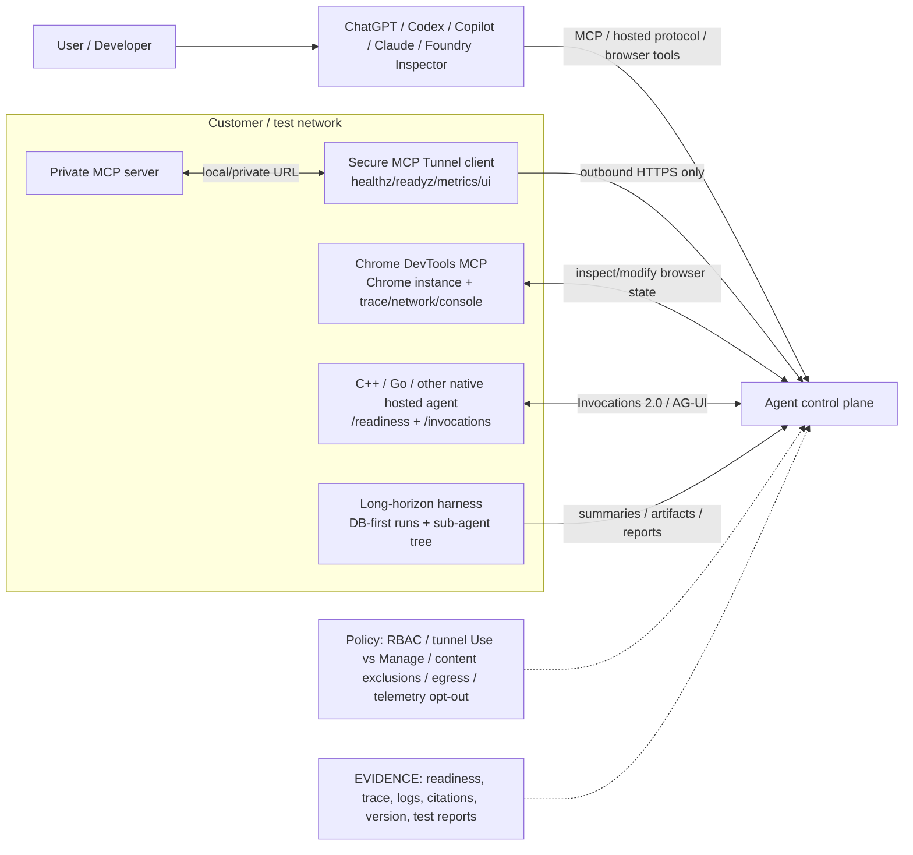

<!-- learning-asset-sanitized: v1 -->
> **发布界定 / Publication boundary**
>
> 本文是由历史研究快照整理出的补充学习材料。原始资料中的 HTTP 200、抓取时间或“已核实”表述只代表当时的来源可达性/文本核对，不代表本次发布时已经重新核验；本文也不是正式实验报告、生产部署建议或合规结论。
>
> 未对其中的命令、代码块、外部仓库、云资源、生产环境或合规控制做本次实机验证。请在独立测试环境中重新验证后再用于客户/生产场景。

# Agent MCP / Browser / Native Hosted Runtime Intake Gates — 2026-09-07

> 用途：SA 在回答客户“如何把私有工具、浏览器调试、C++/Go/非一等 SDK agent、长程 harness 接进企业 agent 平台”时的可复用 POC / 架构图 / 技术问答速查。
> 安全说明：本文中的命令形态均为上游文档证据片段或 POC 设计输入，不是生产执行指令；所有运行前必须在临时测试环境、无真实 secret、无客户代码/生产订阅中验证。

## Evidence links（原研究快照中已核实可达）

| 来源 | URL | Evidence tier | 原研究快照中核实 |
|---|---|---|---|
| Azure-Samples Foundry hosted agents repo | https://github.com/Azure-Samples/microsoft-foundry-hosted-agents | repo/README 级 | HTTP 200（仅代表原快照当时可达，不代表本次已重验）；README 命中 C# / Go / C++ hosted agent 表格、C++ support boundary、端口与测试说明 |
| C++ hosted agent README | https://raw.githubusercontent.com/Azure-Samples/microsoft-foundry-hosted-agents/main/41-Foundry-Agent-CPP-Hosted/README.md | raw file 级 | HTTP 200（仅代表原快照当时可达，不代表本次已重验）；命中 `/readiness`、`/invocations`、Invocations protocol `2.0.0`、AG-UI、1 MiB request limit、无持久会话状态 |
| C++ Foundry research note | https://raw.githubusercontent.com/Azure-Samples/microsoft-foundry-hosted-agents/main/docs/research/cpp-agents-with-microsoft-foundry.md | raw file 级 | HTTP 200（仅代表原快照当时可达，不代表本次已重验）；用于支持“C++ 不是一等 SDK，样例用 REST/hosting adapter”边界 |
| OpenAI Secure MCP Tunnel client | https://github.com/openai/tunnel-client | repo/README 级 | HTTP 200（仅代表原快照当时可达，不代表本次已重验）；README 命中 private/localhost MCP → ChatGPT/Codex/Responses/AgentKit、`/healthz`/`/readyz`/`/metrics`/`/ui` |
| Secure MCP Tunnel architecture | https://raw.githubusercontent.com/openai/tunnel-client/main/docs/architecture.md | raw doc 级 | HTTP 200（仅代表原快照当时可达，不代表本次已重验）；命中 private MCP server 与 OpenAI-hosted tunnel endpoint 架构边界 |
| Secure MCP Tunnel permissions | https://raw.githubusercontent.com/openai/tunnel-client/main/docs/permissions.md | raw doc 级 | HTTP 200（仅代表原快照当时可达，不代表本次已重验）；命中 Tunnel metadata management、runtime use、key creation、runtime/admin key 分离 |
| Secure MCP Tunnel deployment overview | https://raw.githubusercontent.com/openai/tunnel-client/main/docs/deployment/overview.md | raw doc 级 | HTTP 200（仅代表原快照当时可达，不代表本次已重验）；命中 outbound HTTPS、no inbound ports；未部署、未审 SBOM/logging/data residency |
| Chrome DevTools MCP | https://github.com/ChromeDevTools/chrome-devtools-mcp | repo/README 级 | HTTP 200（仅代表原快照当时可达，不代表本次已重验）；README 命中 live Chrome control/inspect、performance trace、network/console/screenshots、默认 usage statistics、CrUX API caveat |
| DeepMind Amplio | https://github.com/google-deepmind/amplio | repo/README 级 | HTTP 200（仅代表原快照当时可达，不代表本次已重验）；README 命中 DB-first persistence、crash-resume、sub-agent session tree resume、security caveats |
| OpenAI Codex releases.atom | https://github.com/openai/codex/releases.atom | release-sentinel 级 | HTTP 200（仅代表原快照当时可达，不代表本次已重验）；最新 `rust-v0.154.0-alpha.4`，仅版本信号，无功能 body，不写功能断言 |
| Claude Code npm + raw changelog | https://registry.npmjs.org/@anthropic-ai/claude-code/latest / https://raw.githubusercontent.com/anthropics/claude-code/main/CHANGELOG.md | registry + raw changelog 级 | HTTP 200（仅代表原快照当时可达，不代表本次已重验）；npm latest `2.1.263`；CHANGELOG 对 2.1.263 仅写 bug fixes/reliability，不扩写功能 |

## 1. 四类接入面的架构图组件

### 设计原则
1. **接入面先分类**：私有工具用 MCP tunnel；浏览器调试用 Browser MCP；非一等语言运行时用 hosted protocol adapter；长任务恢复用 DB-first harness。
2. **控制面与执行面分离**：客户网络内的 MCP/浏览器/native service 不应默认暴露公网；控制面只拿到受限 tunnel/tool/hosted endpoint。
3. **证据面必须前置**：每个 POC 都要求 readiness、版本、权限、日志、失败包络、回放/恢复证据，而不是只看“agent 回答成功”。

## 2. POC intake gate 模板

| Gate | 问题 | 最低验收 |
|---|---|---|
| 版本与证据 | 这是 release、commit、raw doc、还是 README 宣传？ | 写清 evidence tier；alpha/无 body release 只能做 radar |
| 身份与权限 | 谁能创建、谁能使用、谁能管理？ | Tunnel `Read/Use/Manage` 分开；runtime key 与 admin key 分离；Azure 侧每 agent / sample 用测试身份 |
| 网络边界 | 是否需要 inbound？是否出站到第三方？ | Tunnel 场景要求 outbound HTTPS；Browser MCP 的 CrUX/usage stats 默认行为需显式 opt-out；native hosted agent只开测试端口 |
| 工具/数据暴露 | agent 能读/改哪些数据？ | Browser MCP 可 inspect/modify browser/DevTools 数据，禁止含 PII/secret 的浏览器会话；MCP tools 按 allowlist 暴露 |
| 协议与失败包络 | 入口协议是什么？失败如何返回？ | C++ hosted sample：`/readiness` + `/invocations`，Invocations 2.0；MCP tunnel：`/healthz`/`/readyz`/`/metrics`；错误码进入 evidence log |
| 状态与恢复 | 会话态在哪里？crash 后如何恢复？ | Native sample 若声明“无持久状态”必须标注；Amplio 类 DB-first harness 要验证 sub-agent tree resume |
| 遥测与合规 | 默认是否外发 usage / trace / browser data？ | Chrome DevTools MCP 默认 usage stats，Performance tools 可能查 CrUX；POC 前显式记录是否关闭 |
| 安装面风险 | 是否需要 npm/npx/brew/未知二进制？ | 只在 disposable fixture；锁版本；先审 license、manifest、postinstall、network、secret 输出 |

## 3. 客户问答速答

**Q: “我们有内网 MCP server，能不能不给它开公网端口也让 ChatGPT/Codex 用？”**
A: 可以把“OpenAI Secure MCP Tunnel”作为候选模式：客户侧 `tunnel-client` 连接本地/私有 MCP，并通过 outbound HTTPS 连接 OpenAI-hosted tunnel endpoint；文档明确 no inbound ports。仍需核目标租户、API key、workspace/tunnel 权限、日志与数据驻留，不等于自动满足中国区或强数据驻留要求。

**Q: “Agent 能不能帮我调浏览器前端性能/console/network？”**
A: ChromeDevTools MCP 提供 live Chrome control/inspect、trace、network、console、screenshots 等能力，是 browser-debug POC 的强候选。但它会把 browser/DevTools 内容暴露给 MCP client，usage stats 默认开启，performance 可能访问 CrUX API；客户 POC 必须使用干净浏览器 profile、无敏感登录态、关闭不需要的遥测。

**Q: “C++ 服务怎么接 Foundry hosted agent？”**
A: 官方样例仓库展示了 C++20 console 与 C++ hosted agent。关键边界：Foundry/MAF 当前不提供一等 C++ agent SDK 或 hosting adapter；样例通过 first-party `azure-identity-cpp` + REST / repository-owned hosting adapter 暴露 `/readiness` 与 `/invocations`。生产建议通常是：受支持 SDK 作为 orchestration/control plane，C++ 核心能力通过 REST/MCP/A2A/worker bridge 暴露。

**Q: “长程 coding agent 跑 3 小时，怎样不怕 crash / context 丢失？”**
A: DeepMind Amplio 提供一个可借鉴的 DB-first 运行模型：agent loop 状态进本地 SQLite/数据目录，crash 可 resume，sub-agent session tree 可在 server recovery 后恢复。但 README 也明确它不 sandbox shell，端口读权限 caveat 很强；适合抽象方法，不建议未经审计直接用于客户生产。

## 4. [→harness] 可直接反哺 workshop 的练习卡

### Exercise A — “No inbound MCP” 网络图与权限表
> 练习安全边界：不得从上游 README 复制命令到客户环境执行；所有命令形态先改写为 mock/stub 或在 disposable fixture 中运行。
- 输入：一个 fake MCP server + tunnel-client mock 配置。
- 验收：画出 Customer network → outbound HTTPS → OpenAI tunnel endpoint → ChatGPT/Codex/Responses/AgentKit；列出 Tunnel metadata management、runtime use、key creation 三类权限；runtime key 不能拥有 Manage/admin-key 权限。

### Exercise B — Browser MCP 安全预检
- 输入：空白 Chrome profile + 静态测试网页。
- 验收：记录 network/console/screenshot/performance trace；证明没有真实 cookie/PII；明确是否关闭 usage statistics 与 CrUX field-data 调用。

### Exercise C — Native hosted agent contract smoke
- 输入：本地 stub service，不连接真实 Azure。
- 验收：`GET /readiness` 返回 OK；`POST /invocations` 支持 text/plain 与 JSON；大于预算的 payload 被拒；AG-UI/SSE 若未实现要 fail loud；无会话状态则明确写入 README。

### Exercise D — Long-run DB-first evidence log
- 输入：2-step synthetic task + forced crash point。
- 验收：恢复后继续同一 run id；sub-agent tree/child task 不丢；工具失败作为 agent 可见错误进入 log；禁止把 harness 的“能恢复”解释成“能保证业务正确”。

## 5. 原研究快照中 fail-loud

- OpenAI `tunnel-client` 已在 08-31 作为 Secure MCP Tunnel 旧 radar 深挖过；原研究快照中仅把 v0.0.14 版本与 docs 重新组合为“私有工具接入 gate”，不是全新首次发现。
- Codex `rust-v0.154.0-alpha.4` 只是 releases.atom 版本信号；没有 release body，不写新功能。
- Claude Code `2.1.263` npm 与 changelog 可达，但 body 只有 bug fixes/reliability improvements；不写具体能力。
- ChromeDevTools MCP、Amplio 未安装/未运行；只读 README/docs 级 intake，不作为客户生产推荐。
- Azure C++ hosted agent 样例未在原研究快照中 build/test；C++ 生产路径仍需客户目标语言、SDK支持、运维、RBAC、日志与性能测试确认。
