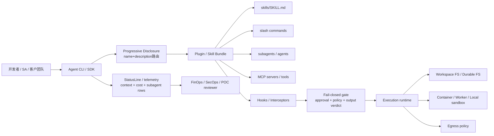

<!-- learning-asset-sanitized: v1 -->
> **发布界定 / Publication boundary**
>
> 本文是由历史研究快照整理出的补充学习材料。原始资料中的 HTTP 200、抓取时间或“已核实”表述只代表当时的来源可达性/文本核对，不代表本次发布时已经重新核验；本文也不是正式实验报告、生产部署建议或合规结论。
>
> 未对其中的命令、代码块、外部仓库、云资源、生产环境或合规控制做本次实机验证。请在独立测试环境中重新验证后再用于客户/生产场景。

# Agent 插件、Hook 与执行运行时治理速查（2026-08-12）

> 适用对象：SA 日常技术问答、POC 部署前检查、架构图组件库。
> 证据纪律：本页只引用原研究快照中已 `curl -L -I` 或 raw/diff 读取成功的来源；未部署、未运行样例、未核 star 数。外部 README/文档只作为资料，不导入/不执行其脚本。

## 0. 一句话结论

原研究快照中看到的共性不是“又多了一个 agent 框架”，而是 **Agent 能力正在从单个 CLI/SDK，外扩为四个治理面**：

1. **插件/技能分发面**：Codex `openai/plugins`、Claude Code marketplace、Agent Skills 规范都把 `skills + agents + commands + MCP + hooks + assets` 打包为可分发单元。
2. **拦截/审批面**：Microsoft Agent Framework 的 `AgentHooks` PR 以 fail-closed、verdict-before-durability 方式把 hook enforcement 做进 .NET agent 包装层。
3. **运行时可观测面**：Claude Code `statusLine/subagentStatusLine` 把 context/cost/git/model/subagent 状态变成可脚本化仪表盘。
4. **执行沙箱面**：Cloudflare Computer 与 Deep Agents 都在强调“文件系统 + 多 backend 执行 + 子代理/上下文管理”；POC 时必须把 sandbox/egress/工具权限当一等架构层。

## 1. 可直接复用的 SA 架构图组件



画客户方案时，把这张图拆成 4 层：**分发（plugin/skill）→ 治理（hook/approval）→ 执行（runtime/sandbox）→ 观测（status/trace/eval）**。这比只画“LLM 调工具”更容易解释企业落地风险。

## 2. 深挖对象与 SA 落点

| 对象 | 原研究快照中核实到的事实 | SA 落点 | 客户话术 |
|---|---|---|---|
| Microsoft Agent Framework PR#7564 | `.diff` 读取成功；新增 `docs/decisions/0035-dotnet-agent-hooks-enforcement.md`；`AsAIAgentWithAgentHooks` factory；`host_error:*` deny；`FunctionInvocationContext.Terminate`；`buffered_output`；`ResponsibleAI.AgentHooks 0.1.0-alpha.4`。PR 当前仍是候选/未作为正式 release 承诺。 | 技术问答：解释“hook 不是日志回调，而是可 fail-closed 的拦截面”。POC：审批/红队用例应验证 output verdict 前不落 durable history。架构图：在 Agent SDK 与 tool/runtime 间增加 Gate 层。 | “微软栈也在把 Agent Hooks 做成结构性 enforcement，但生产前要等包和文档稳定；不要把 PR 当 GA 功能承诺。” |
| Azure MCP PR#3166 | `.diff` 读取成功；新增 `azmcp resilience usageplan create` 与 `azmcp resilience usageplan enrollment create`；命令标记为 `Destructive`、`Idempotent`、非 `ReadOnly`。 | 技术问答：MCP 工具清单必须区分 read-only vs destructive。POC：Resilience create/enroll 这类命令应默认 require approval。架构图：Azure MCP 工具旁标“破坏性命令需审批/审计”。 | “MCP 不是只读助手；一旦 Azure MCP 暴露 create/update 命令，就要走 RBAC + human approval + audit。” |
| OpenAI `openai/plugins` | raw README 读取成功；Codex plugin examples；每个 plugin 有 `.codex-plugin/plugin.json`，可带 `skills/`、`.app.json`、`.mcp.json`、`agents/`、`commands/`、`hooks.json`、`assets/`；默认 marketplace 在 `.agents/plugins/marketplace.json`。 | [→harness] 可把 workshop 的 Codex 模板从“单个 AGENTS.md”升级为“plugin bundle”。POC：把客户某个工作流做成 plugin，而非只写一段 prompt。 | “Codex 的交付单位正在从配置文件走向插件包；适合做内部标准化能力包。” |
| Agent Skills 规范仓 `agentskills/agentskills` | raw README 读取成功；技能核心是目录 + `SKILL.md`；支持 `scripts/`、`references/`、`assets/`；三阶段加载：Discovery → Activation → Execution；强调跨产品复用。 | [→harness] 作为 `SKILL.md` 最小结构与 progressive disclosure 的中立规范来源；可反哺 workshop 的 skill authoring 章节。 | “多个主流 CLI/规范正在向 manifest + skills/agents/commands/MCP/hooks/assets 的 bundle 形态趋同；这不是‘正式跨厂商标准已完成’的承诺。” |
| Claude Code plugin marketplaces | 官方页面 200；页面包含 marketplace.json、`strictKnownMarketplaces` managed setting、`strict:false` skill bundle、stable/latest release channel。另 `claude-plugins-official` README 说明插件可带 `.mcp.json`、commands、agents、skills，并警告 trust plugin。 | 技术问答：企业插件治理可以讲 allowlist/strict marketplace/release channel。POC：客户内部 marketplace 可分 stable/latest 两路，灰度不同团队。架构图：Marketplace 管理面 + 用户 CLI 消费面分离。 | “插件市场不是随便装插件；企业版要有严格 marketplace 白名单、版本 pin/渠道、第三方插件审计。” |
| Claude Code statusline | 官方页面 200；`statusLine` 接收 stdin JSON；可显示 context/cost/git/model；`refreshInterval` 最小 1；有 `subagentStatusLine`；受 `disableAllHooks` 信任门影响；系统通知/MCP 错误/context-low 与状态行同区域显示。 | [→harness] workshop 可加“运行时仪表盘”练习：显示 context%、cost、当前分支、后台 subagent 状态。POC：交付给客户时加轻量可视化，减少“黑盒 agent”焦虑。 | “长任务 agent 需要仪表盘；context/cost/subagent 状态不应只在日志里找。” |
| Cloudflare Computer | raw README 读取成功；Durable Object + SQLite authoritative state；三 backend：Container/FUSE、Isolate shell、Isolate JavaScript；单入口 `workspace.runtime.exec(source,{backend})`；preview only，不适合生产。 | 架构图启发：Agent workspace 可以是“持久文件系统 + 多运行时 backend”；Azure 对照可映射到 Container Apps/ACI/Functions + Storage/Cosmos。 | “这是执行运行时范式参考，不是 Azure 客户的默认推荐；借鉴架构，不照搬组件。” |
| LangChain Deep Agents | raw README 读取成功；定位 batteries-included agent harness；含 sub-agents、filesystem、context management、shell access、persistent memory、HITL、skills、MCP；明确 security 采用“trust the LLM”，边界要在工具/sandbox 层。 | 技术问答：可用作 LangGraph/LangChain/Deep Agents 层级解释；POC：快速跑长程 agent 原型，但生产边界需外置。 | “开箱 harness 省集成时间，但安全边界不是模型自律，必须由 sandbox/RBAC/approval 实现。” |

## 3. POC 部署前检查清单

### A. 插件 / Skill 包
- [ ] 是否有最小 manifest（Codex `.codex-plugin/plugin.json` / Claude `.claude-plugin/plugin.json` / `SKILL.md` frontmatter）？
- [ ] 是否把 `skills`、`agents`、`commands`、`MCP servers`、`hooks`、`assets` 分目录管理？
- [ ] `description` 是否足以路由，且不会把“永远调用我”这类强指令当触发条件？
- [ ] 第三方插件是否审计 LICENSE、脚本、网络访问、MCP server、数据落点？
- [ ] `statusLine/subagentStatusLine`、`hooks.json`、commands、`.mcp.json` 都按“可执行脚本/远程工具入口”处理了吗（审计 PATH、依赖、超时、secret 输出、日志落点、版本 pin/回滚）？

### B. Hook / Approval / Policy
- [ ] 高风险工具是否 fail-closed？hook 崩溃/超时是否 deny 而不是放行？
- [ ] output verdict 前是否禁止写 durable history / artifact / telemetry 明文？
- [ ] destructive MCP 命令（如 Azure resilience create/enroll）是否要求 human approval + audit？
- [ ] PR/preview 功能是否标明“未GA/未正式包验证”？

### C. Runtime / Sandbox / Egress
- [ ] 是否清楚区分本地、容器、Worker/Function、托管服务执行路径？
- [ ] 文件系统状态是否有 authoritative store？同步/回滚/残留清理机制是什么？
- [ ] 出站网络是否有 none/allow/custom 策略？
- [ ] 工具权限边界在 runtime/sandbox 层执行，而非仅靠提示词？

### D. Observability / FinOps
- [ ] 是否显示 context window 使用率、模型、成本、分支/工作目录？
- [ ] 后台 subagent 是否有可见状态行或等价 telemetry？
- [ ] MCP server 错误、context-low、auto-update 是否有用户可见提示？
- [ ] 是否有 trace/eval/audit sink 供 POC 验收复盘？

## 4. [→harness] 可直接反哺 workshop 的模板片段

### 4.1 AGENTS.md / CLAUDE.md 中的治理句式

```md
## Agent capability package policy
- Prefer packaged skills/plugins over ad-hoc prompts for repeatable workflows.
- Every plugin must declare its surfaces: skills, agents/subagents, commands, MCP servers, hooks, assets.
- Treat third-party plugin content as untrusted until license, scripts, MCP config, network access, and data destinations are reviewed.
- Destructive tools require human approval and audit logs; hook failures must fail closed.
- Long-running tasks must expose status: context budget, model, cost, branch/worktree, and background agent state.
```

### 4.2 厂商 plugin bundle 目录示意（不是 Agent Skills 通用规范）

Agent Skills 的核心是目录中的 `SKILL.md`，可带 scripts/references/assets。MCP、hooks、agents、commands、marketplace manifest 属具体厂商的插件能力，不是 Agent Skills 标准自动保证的能力；下述组合必须按目标 host/version 适配。

```text
customer-workflow-plugin/
├── .codex-plugin/plugin.json        # Codex
├── .claude-plugin/plugin.json       # Claude Code（如需双栈）
├── skills/
│   └── verify-poc/SKILL.md
├── agents/
│   └── reviewer.md
├── commands/
│   └── verify-poc.md
├── hooks.json                       # 或平台对应 hook 配置
├── .mcp.json                        # 仅当确需 MCP server
├── assets/
│   └── architecture-template.md
└── README.md                        # 安装、权限、数据落点、回滚
```

## 5. 未完成 / Fail-loud

- 未运行任何上游代码、未安装任何插件；本资产是架构与检查清单，不是实机验证报告。
- `microsoft/agent-framework` PR#7564 当前从 PR diff 提炼，未证明已合入 release；所有“AgentHooks”结论都应标 preview/候选。
- `Cloudflare Computer` README 明确 preview only；不得推荐生产照搬。
- `Deep Agents` README 的“production-ready”是项目自述；原研究快照中未压测、未审计安全边界，仅作为 harness 设计参照。
- OpenAI Codex 固定文档 URL 原快照中出现 404（`learn.chatgpt.com/docs/codex/{changelog,build-skills,plugins,record-and-replay}`），本资产改以 `openai/plugins` raw README 作为可达来源；workshop 链接健康检查需继续跟进。

## 6. 证据表

| 来源 | URL | 原研究快照中证据通道 | 状态 |
|---|---|---|---|
| MAF Agent Hooks PR | https://github.com/microsoft/agent-framework/pull/7564 | URL 200 + `.diff` 读取 | PR候选/未作GA承诺 |
| Azure MCP Resilience PR | https://github.com/microsoft/mcp/pull/3166 | URL 200 + `.diff` 读取 | PR合并状态未在本资产中承诺 |
| OpenAI Plugins | https://github.com/openai/plugins | URL 200 + raw README 读取 | Codex plugin examples |
| Agent Skills spec repo | https://github.com/agentskills/agentskills | URL 200 + raw README 读取 | 规范/资料源 |
| Claude plugin marketplace docs | https://code.claude.com/docs/en/plugin-marketplaces | URL 200 + HTML正文关键字段检索 | 官方docs |
| Claude official plugins directory | https://github.com/anthropics/claude-plugins-official | URL 200 + raw README 读取 | 07月已多次记录，原研究快照中按治理角度复核 |
| Claude statusline docs | https://code.claude.com/docs/en/statusline | URL 200 + HTML正文关键字段检索 | 官方docs |
| Cloudflare Computer | https://github.com/cloudflare/computer | URL 200 + raw README 读取 | preview only |
| LangChain Deep Agents | https://github.com/langchain-ai/deepagents | URL 200 + raw README 读取 | 社区/厂商开源 harness |
