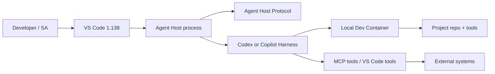
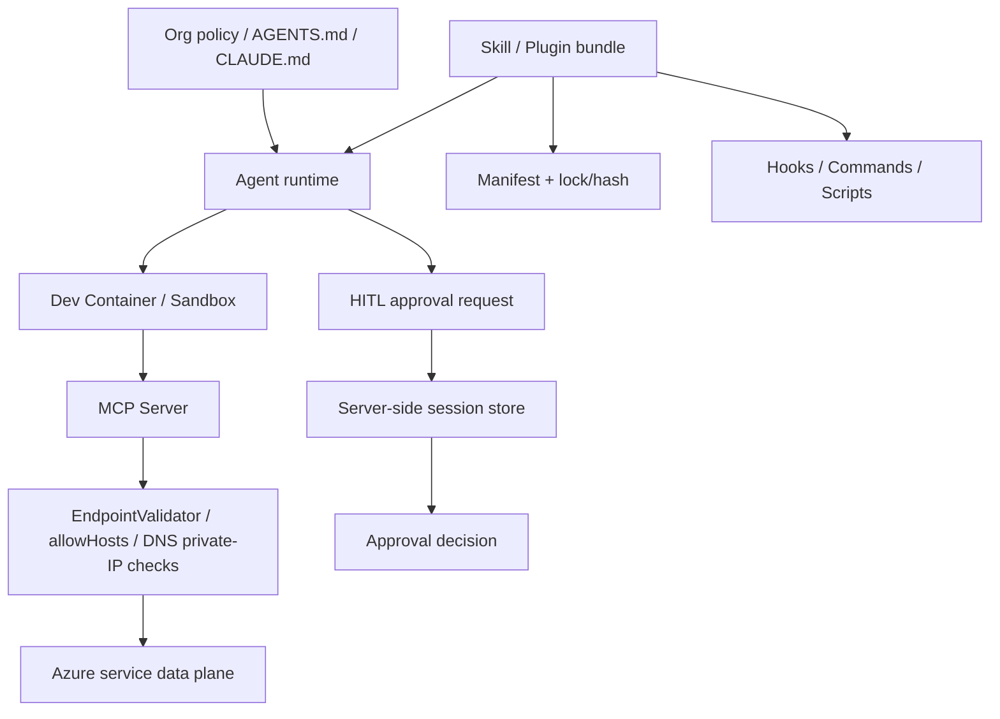

<!-- learning-asset-sanitized: v1 -->
> **发布界定 / Publication boundary**
>
> 本文是由历史研究快照整理出的补充学习材料。原始资料中的 HTTP 200、抓取时间或“已核实”表述只代表当时的来源可达性/文本核对，不代表本次发布时已经重新核验；本文也不是正式实验报告、生产部署建议或合规结论。
>
> 未对其中的命令、代码块、外部仓库、云资源、生产环境或合规控制做本次实机验证。请在独立测试环境中重新验证后再用于客户/生产场景。

# Agent Plugin Supply Chain、IDE Runtime 与 SSRF Gates（2026-09-17）

> 适用：SA 在回答客户关于 Codex / Claude Code / VS Code Agent Host / Microsoft Agent Framework / Azure MCP 的技术问答、POC 预检、架构图时，快速定位“哪些是可演示能力、哪些必须先做安全/治理/版本证据核验”。
>
> 安全红线：本文出现的命令形态、插件路径、hook 名称、MCP/云控制面字段均为**证据片段或检查项**，不是执行指令。任何第三方 plugin/skill/hook/MCP server 只允许在 disposable fixture、无真实 secret、无客户代码、最小权限测试环境中验证；禁止直接安装到生产或客户 repo。

## 0. Evidence links（可复核证据）

| 证据 | URL | 原快照中状态 | 证据强度 | 备注 |
|---|---|---:|---|---|
| VS Code 1.138 release notes | https://code.visualstudio.com/updates/v1_138 | 200 | docs/release-note | Agent sessions in local Dev Containers、expanded Codex support in Agent Host。未实机。 |
| MAF `AIAgent` as `IChatClient` commit | https://github.com/microsoft/agent-framework/commit/c030fa3582b1d2971488645fa03ec65bffab8617 | 200 | diff-level | 命中 `AsIChatClient` / `AIAgentChatClient` / `IChatClient`。未包级 smoke。 |
| MAF HITL approval binding commit | https://github.com/microsoft/agent-framework/commit/024eb654cf3cf7583b08e5343db5eb5baa080d65 | 200 | diff-level | 命中 session store required、approval requests replayed in inbound history not trusted。未运行 sample。 |
| Azure MCP EndpointValidator commit | https://github.com/microsoft/mcp/commit/54e99bff6c72fa14b98a3e74acb0c2de594d0063 | 200 | diff-level | 命中 Azure service endpoint / external URL allowlist / public target URL + namespace override。未安装 Azure.Mcp.Server。 |
| Azure AI Foundry Agents docs commit | https://github.com/MicrosoftDocs/azure-ai-docs/commit/9c7d5da182ec2b001c0363cd0fab5ff299973874 | 200 | docs-diff | Hosted agent guardrails/egress、US Gov region、Fabric/Toolbox/A2A 文档更新。区域与租户可用性未实测。 |
| Agent Framework docs commit | https://github.com/MicrosoftDocs/azure-ai-docs/commit/e5bf40eff73fbd1895266272822d067367379e3c | 200 | docs-diff | archive digest、cookies、Cosmos session partition、checkpoint、provider 限制等。未 SDK smoke。 |
| OpenAI Codex changelog | https://learn.chatgpt.com/docs/changelog | 200 | docs/changelog | 09-14 GPT-5.5 retirement；09-10 Codex CLI SDK 0.154.0。09-16/17 无新条目。 |
| OpenAI Build skills docs | https://learn.chatgpt.com/docs/build-skills | 200 | docs | `allow_implicit_invocation:false`、skill metadata、best practices。 |
| OpenAI Plugins docs | https://learn.chatgpt.com/docs/plugins | 200 | docs | plugin 可含 skills/MCP/browser extensions/hooks；Codex CLI `/plugins`。 |
| OpenAI plugins repo | https://github.com/openai/plugins | 200; 6,848★ HTML snapshot | repo tree/readme | 旧项复核/新治理证据；未审每个插件。 |
| OpenAI skills repo | https://github.com/openai/skills | 200; 27,361★ HTML snapshot | repo README/tree | README 标记 deprecated，指向 OpenAI plugins；44 个 `SKILL.md` 文件级计数。 |
| Claude Code changelog | https://code.claude.com/docs/en/changelog | 200 | docs/changelog | 2.1.273 09-15 gateway hint headers、MCP disconnect notice、remote-control fork、多项权限/策略修复；未 CLI smoke。 |
| Claude plugins docs | https://code.claude.com/docs/en/plugins | 200 | docs | standalone `.claude/` vs plugins、`.claude-plugin/plugin.json`、`--plugin-dir` 测试。 |
| Claude plugins official repo | https://github.com/anthropics/claude-plugins-official | 200; 36,426★ HTML snapshot | repo tree/readme | 旧项复核/新目录抽样；25 个 file-level plugin manifests；含 CI/frontmatter/license/scan workflows；未安装。 |
| Google skills repo | https://github.com/google/skills | 200; 20,041★ HTML snapshot | repo tree/readme | 143 个 `SKILL.md` 文件级计数；仅作为 cross-vendor 对照，未导入。 |

## 1. SA 速答：今天可直接更新的客户话术

### 1.1 “OpenAI skills repo 是不是还该直接对标导入？”

**答法**：不要把 `openai/skills` 当唯一/最新分发入口；`openai/skills` 是历史 catalog，但其 README 原快照中显示 deprecated，建议转向 `openai/plugins` 与官方 Build plugins/Build skills docs。对 SA 的落点不是“安装更多 skill”，而是把客户 POC 的 skill/plugin 做成**可审计 bundle**：manifest、skill description、依赖 MCP、hooks、权限、版本/锁文件、回滚策略一起审。

**落地门**：
- source gate：确认是 `openai/plugins` 还是 legacy `openai/skills`；legacy 只作学习结构，不作新安装入口。
- invocation gate：对高风险 skill 设置显式触发；OpenAI skills docs 的 `allow_implicit_invocation:false` 可作为“不要凭用户一句模糊话自动启用”的模式参考。
- dependency gate：manifest 中的 MCP/tools/hooks/browser extension 必须单独列出数据流与权限。

### 1.2 “Claude Code 插件能不能像浏览器插件一样直接装？”

**答法**：官方目录可用但仍不是“免审计”；`claude-plugins-official` 是历史已覆盖源，原研究快照中价值在复核其目录/CI/manifest 风险面。`anthropics/claude-plugins-official` README 明确提示安装前要信任插件；目录中既有内部插件，也有外部插件。POC 应把插件视为可执行供应链：commands、hooks、MCP server、agent/skill 文件、license、脚本依赖都要审。

**落地门**：
- provenance gate：记录 plugin 来源 repo、commit/版本、manifest hash、是否 external plugin。
- execution-surface gate：列 `commands/`、`hooks/`、`.mcp.json`、`scripts/`、`agents/`、`skills/`。
- policy gate：企业策略（例如 managed settings / server-managed settings / Skills off）变更后，要重新验证插件/skill 是否仍被加载。

### 1.3 “VS Code 1.138 Agent Host + Dev Containers 对 POC 有什么影响？”

**答法**：IDE 内 agent 运行正在从“聊天窗口”变成“可持久、可跨窗口连接、可放进项目 Dev Container 的 runtime”。这对 POC 很关键：让 agent 使用项目真实工具链，但同时要把 Docker/Dev Container、AHP、Agent Host、Codex/Copilot session、MCP tools 的边界画清楚。

**架构图组件**：

**落地门**：Docker 与 Dev Container 配置可复现；session 清理/PR 生成路径明确；MCP tool scope 最小化；不要把本地开发容器隔离误写成企业合规边界。

## 2. POC 预检 Gates

| Gate | 触发条件 | 检查项 | 不通过时怎么说 |
|---|---|---|---|
| G1 Release-source classifier | Codex/Claude/MAF/Azure MCP 快速升级 | stable/latest、alpha/next、docs-only、commit-only、repo-only 分开标注 | “这是版本/commit 信号，尚未包级/CLI/租户 smoke，不能承诺客户可用。” |
| G2 Plugin/skill provenance | 客户要安装 OpenAI/Claude/Google skill/plugin | repo URL、manifest、lock/hash、license、作者、external/internal、最近更新时间 | “先做供应链审计，不直接装入客户 repo。” |
| G3 Invocation policy | skill 可能自动触发或访问客户数据 | description 路由精度、是否允许 implicit invocation、是否需 `$skill`/命令显式调用 | “高风险技能默认显式触发，避免误路由。” |
| G4 Execution surface inventory | plugin 含 hooks/commands/MCP/scripts | 每个 surface 的输入、输出、网络、文件读写、secret 暴露、回滚 | “plugin 不是纯 markdown；按代码扩展审计。” |
| G5 IDE runtime boundary | VS Code Agent Host/Dev Container/Codex session | runtime 位置、持久化目录、session id/清理、Docker/网络、MCP scope | “开发容器只是运行隔离，不等于数据驻留或合规承诺。” |
| G6 MCP endpoint SSRF | MCP server 构造或接收 URL/endpoint | Azure service endpoint 校验、external allowedHosts、public target URL DNS/private IP 拦截、cloud suffix | “MCP 工具必须有 endpoint allow-list/SSRF gate，尤其是云数据平面。” |
| G7 HITL approval replay | agent 有审批/回放/中断恢复 | 服务端 session store、approval request/decision pairing、禁止信任 inbound history 重放 | “审批不是前端按钮；必须由服务端记录来绑定请求与决策。” |
| G8 Egress/guardrail | Foundry hosted agents 或远程 runner | guardrail/RAI policy、network egress、region/US Gov、toolbox/Fabric/A2A payload | “文档可达不等于区域/租户已开通，必须用目标租户验证。” |

## 3. 架构图模式：从“agent 能力图”改画“运行与信任边界图”

建议每张客户图都至少标 5 条边界：
1. **Instruction boundary**：系统/组织/项目/本地 instructions、AGENTS.md、CLAUDE.md、managed policy，谁覆盖谁。
2. **Runtime boundary**：Agent Host、Dev Container、cloud runner、self-hosted runner、sandbox 是否同机。
3. **Tool boundary**：MCP server、VS Code tools、browser extension、cloud control-plane tools 的权限最小化。
4. **Supply-chain boundary**：skill/plugin/manifest/hooks/scripts 的来源、hash、license、更新路径。
5. **Approval boundary**：HITL 请求由服务端 session 绑定，不能由聊天历史重放伪造。

## 4. 可反哺 harness workshop 的练习卡

- [→harness] **Release-source classifier lab**：给学员 5 个来源（release note、alpha tag、docs changelog、commit diff、repo README），要求分类为 customer-claim / POC-radar / no-claim。
- [→harness] **Plugin supply-chain intake lab**：给一个 `.codex-plugin/plugin.json` 与一个 `.claude-plugin/plugin.json`，让学员列出 skills/MCP/hooks/commands/scripts/manifest/lock/hash 风险面。
- [→harness] **Implicit invocation lab**：同一个 skill 设计两个 description；测试哪一个会误触发，并要求对高风险版本加显式调用策略。
- [→harness] **HITL replay lab**：构造“前端带回 approval decision 但服务端 session store 丢失”的场景，要求学员解释为什么应 fail closed。
- [→harness] **MCP SSRF lab**：把用户 URL、Azure data-plane endpoint、ARM control-plane resource ID 分三类；分别选择 allowHosts、cloud suffix 校验、ResourceIdentifier，不混用。
- [→harness] **IDE runtime boundary lab**：画 VS Code Agent Host + Dev Container + MCP 工具链，标注哪些边界不是合规边界。

## 5. 原研究快照中未核实/后续项

- 未安装或运行 Codex CLI、Claude Code、VS Code 1.138、MAF sample、Azure MCP、Foundry hosted agents；所有 runtime 结论均为 docs/diff/readme 级。
- `openai/plugins`、`anthropics/claude-plugins-official`、`google/skills` 只做目录/manifest 级抽样，未逐插件/逐 skill 审计，不推荐直接导入。
- Claude Code 2.1.273 的 gateway hint headers、remote-control fork、权限修复等来自 changelog，未实机验证企业 managed settings 行为。
- OpenAI Codex changelog 09-16/09-17 未见新 CLI 正式条目；原研究快照中主要吸收的是 OpenAI skills deprecated→plugins 迁移与 plugin/skill governance。
