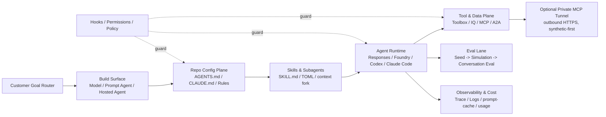

<!-- learning-asset-sanitized: v1 -->
> **发布界定 / Publication boundary**
>
> 本文是由历史研究快照整理出的补充学习材料。原始资料中的 HTTP 200、抓取时间或“已核实”表述只代表当时的来源可达性/文本核对，不代表本次发布时已经重新核验；本文也不是正式实验报告、生产部署建议或合规结论。
>
> 未对其中的命令、代码块、外部仓库、云资源、生产环境或合规控制做本次实机验证。请在独立测试环境中重新验证后再用于客户/生产场景。

# Agent POC Evaluation & Config Control Plane Checklist（2026-08-31）

> 用途：给 SA 在客户技术问答、Agent POC 部署和架构图设计时快速复用。
> 安全说明：本文中的命令形态/路径名仅是上游文档中的**配置面或证据片段**，不是直接执行指令。任何客户环境验证都必须在临时 fixture / 测试租户 / 测试 MCP server 中进行，不接生产订阅、客户代码或真实 secret。本文不包含真实凭据、token、连接串或可直接运行的生产命令；出现的 API key / secret 字样仅用于风险枚举。

## Evidence links（原研究快照中核实）

| 证据 | URL | 核实状态 | 证据强度 | caveat |
|---|---|---:|---|---|
| Microsoft Foundry capability map commit | https://github.com/MicrosoftDocs/azure-ai-docs/commit/28571bf088a701b56e9846456c912746e39de7ab.diff | 200 | diff/docs | Learn 正式页面可能仍在发布中；本资产以 GitHub diff 为证据。 |
| Azure AI Projects synthetic multi-turn evaluation sample | https://github.com/Azure/azure-sdk-for-python/commit/2aa7d57468638218bf4337e0def2d1f0eed6ef73.diff | 200 | diff | 样例存在；未运行 SDK / Azure 资源。 |
| Azure AgentServer Responses 2.2.0b1 | https://github.com/Azure/azure-sdk-for-python/releases/tag/azure-ai-agentserver-responses_2.2.0b1 | 200 | release | release-level；未做包级 API smoke。 |
| OpenAI Codex AGENTS.md docs | https://developers.openai.com/codex/agent-configuration/agents-md | 200（resolved to learn.chatgpt.com） | docs | 官方路由重定向；引用时可保留 developers.openai.com 入口或 resolved URL。 |
| OpenAI Codex subagents docs | https://developers.openai.com/codex/agent-configuration/subagents | 200（resolved） | docs | TOML 字段未在原研究快照中 CLI 实测。 |
| OpenAI Codex build skills docs | https://developers.openai.com/codex/build-skills | 200（resolved） | docs | 原研究快照中只抽关键字段，不导入任何上游 skill。 |
| OpenAI Codex 0.151.0 release API | https://api.github.com/repos/openai/codex/releases/latest | 200 | release/API | 旧源复用；原研究快照中仅作为配置/预算控制背景复用。 |
| Claude Code skills docs | https://code.claude.com/docs/en/skills | 200 | docs | 原研究快照中未运行 Claude Code CLI smoke。 |
| Anthropic steering Claude Code blog | https://claude.com/blog/steering-claude-code-skills-hooks-rules-subagents-and-more | 200 | blog/docs | 方法论一手来源；不要把博客建议写成强制产品限制。 |
| Claude Code v2.1.251 release | https://github.com/anthropics/claude-code/releases/tag/v2.1.251 | 200 | release | 旧源复用；原研究快照中只复用其 hook/cache/security 变更作配置门。 |
| OpenAI Secure MCP Tunnel README | https://raw.githubusercontent.com/openai/tunnel-client/main/README.md | 200 | raw README | 08-06/08-08 已 radar；原研究快照中补 architecture/permissions/protocol/deployment raw docs。 |
| OpenAI Secure MCP Tunnel architecture | https://raw.githubusercontent.com/openai/tunnel-client/main/docs/architecture.md | 200 | raw docs | 未部署；合规/日志/数据驻留需客户环境核查。 |
| OpenAI Secure MCP Tunnel permissions | https://raw.githubusercontent.com/openai/tunnel-client/main/docs/permissions.md | 200 | raw docs | 权限模型文档级；未创建 tunnel / connector。 |
| OpenAI Secure MCP Tunnel deployment overview | https://raw.githubusercontent.com/openai/tunnel-client/main/docs/deployment/overview.md | 200 | raw docs | 明确 outbound HTTPS；未验证容器镜像/SBOM。 |

---

## 1. 先用 Foundry capability map 做“入口选择”，不要一上来画大而全 agent

**观察**：MicrosoftDocs 新增 Foundry capability map，把“只发 prompt / 第一只 agent / 工具集中治理 / IQ 知识库 / Workflows / A2A / MCP / coding agents”按客户意图路由。关键句在 diff 中可见：
- “Send a prompt to a model, with no agent or tools” → shortest path；需要工具或编排再加 agent。
- “Toolbox” → managed endpoint that packages the tools an agent can call；用于集中治理工具。
- “Coding agents and MCP” → 让 GitHub Copilot 或 Claude Code work against Foundry。
- A2A / Responses API / Routines / Voice agents 被放在 orchestration / integration 能力层。

**SA 落地**
- 技术问答：客户问“我要做 Agent 用哪个 Foundry 能力？”时先按目标路由，而非默认“上 hosted agent”。
- POC 部署：把 POC 分三档：L0 model call，L1 prompt/hosted agent，L2 Toolbox/IQ/A2A/MCP；每档有不同安全与验收门。
- 架构图：建议画成“Goal Router → Build Surface → Tool/Data Plane → Runtime/Eval Plane”，而不是所有组件一张平铺图。

**推荐话术**：
> Foundry 不是一个单点产品名，而是一组 build surfaces。POC 第一步不是选 SDK，而是确认目标：只是调用模型、要知识库检索、要托管状态、要集中管工具，还是要让 coding agent 代操作 Foundry。入口不同，后面的 RBAC、日志、网络、评测都不同。

---

## 2. 多轮 Agent POC 验收：seed → simulation → conversation-level evaluation

**观察**：Azure SDK Python 新增 `sample_synthetic_multiturn_evaluation.py`，release note/diff 写明它“demonstrating simulation seed generation from an agent followed by multi-turn conversation simulation and evaluation”。同时 docs commit 提到 Simulation seed task type（子 agent 已核）。

**可复用模式**
1. **Seed generation**：从业务目标或现有 agent 生成 `category / test_case_description / desired_num_turns` 一类 seed。
2. **Conversation simulation**：用 seed 驱动多轮对话，不只测单轮回答。
3. **Conversation-level evaluation**：按整段会话评分，重点看工具选择、状态保持、拒答/升级、人类确认点。
4. **Evidence log**：每条会话保留 trace id、seed、agent version、model/version、evaluator version。

**SA 落地**
- 技术问答：回答“Agent POC 怎么验收？”时，从“主观看 demo”升级为“合成多轮会话 + conversation-level scoring”。
- POC 部署：最小验收集不需要一次性真实客户数据；先用 10-20 条 synthetic seeds 跑 smoke，合规通过后再接脱敏样本。
- 架构图：新增 Eval Lane：`Business goal → seed generator → simulator → agent runtime → evaluator → scorecard → backlog`。

**Fail-loud**：原研究快照中未运行 Azure SDK 样例，也未确认目标订阅区域/配额/预览可用性；对客户只能说“官方样例级证据，适合 POC 骨架”，不能承诺生产 GA。

---

## 3. AgentServer Responses 2.2.0b1：prompt caching 与 programmatic tool-calling 进入 contract 讨论

**观察**：`azure-ai-agentserver-responses_2.2.0b1` release 页面显示：
- Breaking: `ResponseUsageInputTokensDetails.cache_write_tokens` is now required by latest AgentServer contract。
- Features: prompt caching and programmatic tool-calling models。

**SA 落地**
- 技术问答：如果客户升级 AgentServer/Responses SDK 后 usage schema 报错，先查 `cache_write_tokens` 是否缺失，而不是只查认证。
- POC 部署：缓存命中率与 re-cache 成本应进入验收指标，尤其是长上下文 agent。
- 架构图：把 “Usage accounting / prompt cache” 画在 runtime observability lane，而非只画 LLM 调用。

**Fail-loud**：release-level 证据；未安装包、未读类型定义、未跑 smoke。客户升级指南前需包级验证。

---

## 4. Codex 配置面：AGENTS.md 分层 + Subagents TOML + Skills budget 三件套

**观察（官方 docs 200）**
- `AGENTS.md`：global scope 先读 `AGENTS.override.md`，否则读 `AGENTS.md`；project scope 从 root 到 CWD 分层；`project_doc_max_bytes` 默认 32 KiB。
- Code Review Rules：建议写在最近的 `AGENTS.md`，贴近目录边界。
- Subagents：自定义 agent 放 `~/.codex/agents/` 或项目 `.codex/agents/`；字段包括 `name / description / developer_instructions / model / sandbox_mode / mcp_servers / skills.config` 等；内置 `default / worker / explorer`。
- Build skills：`agents/openai.yaml` 可声明 UI metadata、invocation policy、tool dependencies；skills 遵循 Agent Skills 标准。
- Codex 0.151 背景：optional MCP startup grace、extension inspect/replace MCP tool results、nested subagent token usage counted toward root goal budgets。

**可复制模板思路（不直接写客户 repo）**
```text
AGENTS.md
  - project invariants：安全/合规/测试/不要碰生产数据
  - Code Review Rules：目录局部规则、bad examples、safe path
.codex/agents/
  explorer.toml：read-only / low-cost / 大文件与依赖扫描
  reviewer.toml：高推理 / 不写文件 / 输出 P0-P2 问题清单
  deployer.toml：只在临时环境 / 明确 sandbox_mode / 工具最小化
.agents/skills/
  poc-eval/SKILL.md：何时触发、输入、验收证据、失败时 fail-loud
```

**SA 落地**
- 技术问答：解释为什么“同一个 repo 里不同目录的 Codex 行为不一样”——就近 AGENTS.md 与 32 KiB 上限是首查点。
- POC 部署：把 read-heavy 调研、代码修改、审查验证拆成不同 subagent，避免一个全能 agent 既读又写又审批。
- 架构图：新增 Repo Config Plane：`Global → Repo root → Directory AGENTS.md → .codex/agents → .agents/skills → MCP/tool policy`。

**[→harness]**：适合加入 Agent-Harness-Engineering workshop 的“repo config linter / preflight”练习：检查 32 KiB、目录 shadowing、Code Review Rules 是否贴近代码、subagent sandbox 是否最小权限。

---

## 5. Claude Code 配置面：CLAUDE.md / rules / skills / subagents / hooks 决策矩阵

**观察（官方 docs/blog 200）**
- Anthropic steering blog 把七种 steer 机制按加载时机、compaction 行为、authority 区分；明确建议 `CLAUDE.md` < 200 lines、程序化流程放 skills、强制约束放 hooks/permissions。
- Skills docs：`disable-model-invocation: true` 或 settings override 可禁止自动触发；`context: fork` 可让 skill 在 subagent context 中运行；`allowed-tools` 不是 denylist；它会在 skill 被调用的 turn 内为列出的工具授予免提示调用权限，之后权限会随下一条用户消息清除。运行仓库内 skill 前必须审查 `allowed-tools` 是否过宽，尤其是 Bash/git/deploy 类命令；`/verify` 等长耗时 bundled skills 只在用户显式调用时运行。
- Claude Code 2.1.251：新增 `PreModelSwitch` / `PostModelSwitch` hooks；`/cost` 增 prompt-cache line；foreground subagent tool calls/results 可 live stream 到 Remote Control；多个 path/symlink/plugin 命令安全修复。

**决策表**

| 需求 | 放哪里 | 原因 | POC gate |
|---|---|---|---|
| 项目总览、仓库约定 | `CLAUDE.md` | 总是加载，适合短且稳定 | <200 行，有 owner，变更像代码审查 |
| 目录/团队局部规则 | rules / path-scoped guidance | 避免全局污染 context | 检查 shadowing 与冲突 |
| 可重复步骤/专业流程 | `SKILL.md` | 只在相关时加载，可带 references/scripts/evals | description 触发测试 + `/verify` |
| 大量调查/独立审查 | subagents | context 隔离，适合 adversarial review | 输出结构化 P0/P1/P2，父 agent 抽查 |
| 不可违反的安全约束 | hooks / permissions | 比提示词更硬，可 block/confirm | 在 fixture 中验证 deny/ask/allow |
| 成本/缓存/状态观测 | status line / `/cost` / logs | 长任务 FinOps 必需 | 记录 prompt-cache hit/miss 与 re-cache |

**SA 落地**
- 技术问答：客户问“CLAUDE.md 越写越长怎么办？”——把流程拆到 skills，把强制门拆到 hooks，把临时知识放到 subagents。
- POC 部署：把 Claude Code 2.1.251 的 model-switch hooks 与 prompt-cache 指标纳入升级回归表。
- 架构图：画 Control Plane：`Guidance → Skills → Subagents → Hooks/Permissions → Telemetry/Cost`。

**[→harness]**：Codex 与 Claude 的共同结论是：repo 配置不是文档散落，而是 control plane；workshop 应把 linter/preflight/eval gate 放在“代码开始前”。

---

## 6. Secure MCP Tunnel：私有 MCP 接入 OpenAI 产品的“出站隧道”模式

**观察（OpenAI raw docs 200）**
- README：`tunnel-client` connects a private or localhost MCP server to ChatGPT, Codex, Responses API, and AgentKit through an OpenAI-hosted MCP tunnel endpoint, while keeping MCP server off the public internet。
- Architecture：customer-run small agent keeps an outbound HTTPS connection to OpenAI tunnel service；operations stay local；可 sidecar / dedicated Kubernetes Deployment / VM systemd。
- Deployment overview：required egress 是 outbound HTTPS 到 `api.openai.com:443` 的 `/v1/tunnels/*`；no inbound ports required for tunnel itself；client 还需能访问内部 MCP server。
- Permissions：区分 tunnel metadata management、tunnel use、connector admin；常见故障是混淆三者。
- Protocol：每个请求发送 tunnel API key；implementation name/version 是 diagnostic metadata，不是 feature negotiation。

**SA 落地**
- 技术问答：回答“私有 MCP 要不要开公网入口？”——OpenAI 提供 outbound tunnel 模式，但它不是“数据不出境/不出组织”的同义词。
- POC 部署：三形态优先级：本地 laptop smoke → VM/systemd → AKS sidecar/dedicated deployment；每一层都要验证 readiness、RBAC、日志脱敏、撤权。
- 架构图：`OpenAI product → OpenAI tunnel endpoint → outbound HTTPS tunnel-client → private MCP server → enterprise data/tools`，旁路画 audit/log/permission plane。

**安全/合规红线**
- No inbound firewall ≠ zero trust complete。仍需核查：MCP payload/metadata、tunnel id、API key、connector OAuth、日志保留、数据驻留、客户协议覆盖。
- 不直接把 tunnel-client 接生产 MCP。先用假 MCP server 验证：403、unknown tool、timeout、large output、OAuth expired、daemon down、revocation。
- 中国区/跨境客户必须先澄清 OpenAI 产品与控制面数据驻留；若客户要求 strict local auth / no external control plane，默认不推荐此路径。

**[→harness]**：可做 workshop 的“private MCP sidecar + failure-contract”练习，但必须用 synthetic server，禁止接真实内网工具。

---

## 7. 一页 POC preflight（可复制）

| Gate | 最小检查 | 失败时怎么 fail loud |
|---|---|---|
| Goal router | POC 是 model call / prompt agent / hosted agent / tool governance / IQ / A2A / MCP 哪一类？ | “入口未定，不能估成本/权限/网络。” |
| Repo config | AGENTS.md / CLAUDE.md 是否短小、分层、无冲突？ | “配置面不可复现，先做 linter，不进入编码。” |
| Skill trigger | skill description 是否能路由？是否有 eval / verify？ | “Skill 只是提示词，不是可验收 harness 单元。” |
| Subagent isolation | read / write / review / deploy 是否分 agent？sandbox/allowed tools 最小化？ | “同一 agent 既改又审，不能作为独立验收证据。” |
| Eval lane | 是否有 seed、simulation、conversation score、trace id？ | “只有演示，无 POC 验收闭环。” |
| Prompt/cache accounting | usage schema、cache hit/miss、re-cache cost 是否记录？ | “长上下文成本不可解释，不能进入无人值守。” |
| MCP/tunnel | 是否只接 synthetic MCP？是否测 403/timeout/unknown/large output/revocation？ | “工具面安全未过，禁止接生产工具。” |
| Governance | hooks/permissions/policy 是否覆盖 destructive actions？ | “Prompt 约束不是安全边界。” |

## 8. 架构图组件库（文字版）



**结论**：今天的可复用主线不是“又多了一个 agent 框架”，而是 **POC 前先建立 control plane：入口选择、repo 配置、skill/subagent 隔离、eval lane、工具隧道安全、成本观测**。这能同时提升技术问答、POC 部署和架构图交付速度。
