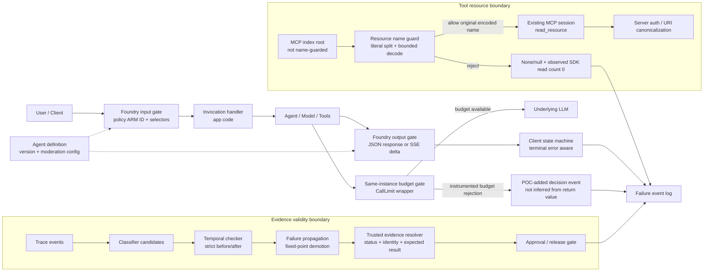

# Agent POC 可观测失败契约：四类机制速查与负例验收

日期：2026-09-25<br>
适用对象：面向客户的 Agent / 多 Agent / 工具调用 POC 评审、上线前验收与复盘。<br>
定位：把“看起来跑通”改成“失败能被识别、记录、阻断或降级”的技术问答与验收模板。

## 0. 使用说明

- 本文不是新闻流水账，也不是产品发布说明；它抽取四个可复用机制：Foundry 护栏、MAF MCP 资源名、Concordia 调用预算、ECC 证据依赖。
- 证据级别以固定 commit 的 raw / diff / README 为准；部分验证来自原创离线 fixture 或静态阅读，未承诺包可用、云端实机行为或区域/配额状态。
- POC 验收应同时记录：可辨认失败状态、最小证据、SA 落点、已验/未验边界。
- 负例测试通过的含义是“系统正确拒绝/降级/标记”，不是“业务可继续放行”。
- 本文是既有来源的固定提交机制深读与跨机制验收设计，不声称仓库近期创建或机制当日首发。运行卡是待执行模板；示例事件不是运行记录。

## 1. 固定证据索引（公开可引用）

| 来源 ID | 固定来源 | 证据级别 |
|---|---|---|
| F-readme | [Foundry README](https://raw.githubusercontent.com/microsoft-foundry/foundry-samples/5642c45da33220d5bb95bbe08fa67f34373bd96d/samples/python/hosted-agents/agent-framework/invocations/02-content-safety-guardrail/README.md) L49–82、192–229 | read-not-run：选择器、HTTP/SSE 契约；不是租户实测 |
| F-config | [Foundry azure.yaml](https://raw.githubusercontent.com/microsoft-foundry/foundry-samples/5642c45da33220d5bb95bbe08fa67f34373bd96d/samples/python/hosted-agents/agent-framework/invocations/02-content-safety-guardrail/azure.yaml) L52–72 | read-not-run：配置字段 |
| F-main | [Foundry main.py](https://raw.githubusercontent.com/microsoft-foundry/foundry-samples/5642c45da33220d5bb95bbe08fa67f34373bd96d/samples/python/hosted-agents/agent-framework/invocations/02-content-safety-guardrail/src/agent-framework-content-safety-guardrail-invocations/main.py) L42–50、69–84 | read-not-run：应用 SSE 序列化 |
| M-python | [MAF Python _skills.py](https://raw.githubusercontent.com/microsoft/agent-framework/024dd9908bc19fa42f070cfaf7c3775c2b17f09b/python/packages/core/agent_framework/_skills.py) L4412–4436、4536–4595 | read-not-run：字面切分、有界解码、拒绝分支 |
| M-dotnet | [MAF AgentMcpSkill.cs](https://raw.githubusercontent.com/microsoft/agent-framework/024dd9908bc19fa42f070cfaf7c3775c2b17f09b/dotnet/src/Microsoft.Agents.AI.Mcp/Skills/AgentMcpSkill.cs) L131–171 | read-not-run：循环解码；未运行 .NET |
| M-tests | [MAF test_mcp_skills.py](https://raw.githubusercontent.com/microsoft/agent-framework/024dd9908bc19fa42f070cfaf7c3775c2b17f09b/python/packages/core/tests/core/test_mcp_skills.py) L350–481 | read-not-run：边界向量、SDK read_resource spy |
| C-wrapper | [Concordia call_limit_wrapper.py](https://raw.githubusercontent.com/google-deepmind/concordia/edcc568ed123cb5b7973f09f7e308ace47bc7716/concordia/language_model/call_limit_wrapper.py) L45–48、63–83、93–104 | read-not-run：锁范围、分配计数、fallback |
| C-tests | [Concordia call_limit_wrapper_test.py](https://raw.githubusercontent.com/google-deepmind/concordia/edcc568ed123cb5b7973f09f7e308ace47bc7716/concordia/language_model/call_limit_wrapper_test.py) L81–109 | read-not-run：单元测试断言；非并发调度验证 |
| C-interface | [Concordia language_model.py](https://raw.githubusercontent.com/google-deepmind/concordia/edcc568ed123cb5b7973f09f7e308ace47bc7716/concordia/language_model/language_model.py) L40–104 | read-not-run：text/choice 返回与异常接口 |
| C-readme | [Concordia README](https://raw.githubusercontent.com/google-deepmind/concordia/edcc568ed123cb5b7973f09f7e308ace47bc7716/README.md) L187 | read-not-run：非 Google 官方支持产品声明 |
| E-diff | [ECC 固定提交 diff](https://github.com/affaan-m/ECC/commit/8b951d3bf63b5f3dcdac3f255c8a15c23fbf35f3.diff) `grader.py` 变更段 | read-not-run：失败依赖传播变更 |
| E-grader | [ECC grader.py](https://raw.githubusercontent.com/affaan-m/ECC/8b951d3bf63b5f3dcdac3f255c8a15c23fbf35f3/skills/skill-comply/scripts/grader.py) L28–116、125–194 | read-not-run：strict-time、候选选择、只降级闭包 |
| E-tests | [ECC test_grader.py](https://raw.githubusercontent.com/affaan-m/ECC/8b951d3bf63b5f3dcdac3f255c8a15c23fbf35f3/skills/skill-comply/tests/test_grader.py) L200–258 | read-not-run：依赖失败回归用例 |

以上逐文件链接均固定到提交，不随分支漂移。源码/测试正文阅读不等于执行测试；原创离线 fixture 的证据范围仅为 `original_model`。预算计数 fixture 不证明锁外并发或 inflight reset 调度性质，锁范围结论只由固定源码支持。

## 2. 一页总览：四个“失败契约”

| 机制 | 解决的 POC 假阳性 | 可辨认失败状态 | 最小证据 | SA 落点 |
|---|---|---|---|---|
| Foundry 护栏 | active / HTTP 200 被误当成已过滤 | 400 `content_filter`、流式 terminal error、502 配置错配、active 但零筛选 | 策略 ARM ID、版本回读、selector 与实际字节形状、完整请求/响应/SSE | 安全护栏、客户端错误状态机、发布准入 |
| MAF 资源名 | 资源名编码绕过、路径穿越、深层解码耗尽 | `None/null` 且本次被观测 SDK `read_resource` 零调用；33 层及以上拒绝；控制字符拒绝 | root/name 切分表、SDK 调用 spy、深度向量；wire 需另验 | MCP 工具边界、客户端预校验、服务端二次授权 |
| Concordia 预算 | “额度耗尽后仍像真实推理结果” | 分配分支拒绝标志；可能返回空串/首项，但返回值不是 fallback 证据 | wrapper/call ID、同临界区 decision 和计数快照、底层调用计数 | 成本闸门、仿真降级、预算观测 |
| ECC 依赖 | 日志曾出现就被当作有效证据 | 前置最终失败导致依赖链撤销、evidence 清空、unknown/循环/错误证据边界显式标注 | trace、classification、StepResult、时间戳、失败传播结果 | 验收证据语义、审批 gate、红测证据建模 |

## 3. 技术问答速查

### A. Foundry Invocations 内容护栏

**Q1：护栏应该画在应用代码里还是平台边界上？**<br>
A：样例说明护栏不是 `main.py` 本地 moderation 代码，而是 agent definition 级设置：`policies` 里引用完整 RAI policy ARM ID，并在 invocations moderation 里声明输入与输出选择器。

**Q2：输入、缓冲输出、SSE 流输出分别怎么理解？**<br>
A：输入 gate 读取请求中的声明字段，例如 `$.message`；缓冲输出 gate 读取非流式 JSON 响应字段，例如 `$.response`；流式输出 gate 针对实际 `text/event-stream` 的 message delta 字节形状，例如顶层 `text`。三者不能相互证明。

**Q3：`responseMode=both` 是不是“输入+输出都开”？**<br>
A：不是。这里应理解为输出能力覆盖 streaming / non-streaming 两类响应；运行时按实际 `Content-Type` 走一个输出分支。输入 gate 是另一条路径。

**Q4：SSE 的事件名怎么断言？**<br>
A：应用样例 `_sse` 写的是 `data: <JSON>\n\n`，没有 `event: message.delta` 头；事件类型来自 JSON 对象的 `type` 字段。平台 terminal 错误样例则有 `event: error` 头，且 `data.type=error`。不能把应用帧格式泛化到所有 SSE 帧。

**Q5：HTTP 200 是否代表流式响应安全通过？**<br>
A：不代表。README 描述的流式违规路径可能先返回 HTTP 200，然后发送 terminal error（`code=content_filter`）并结束。客户端必须把 terminal content_filter 视为失败，并停止消费后续业务状态。

**Q6：输入违规和输出违规的最小断言是什么？**<br>
A：输入/缓冲输出至少断言 `status==400` 且 `error.code==content_filter`、`error.type==content_safety_error`；流式输出至少断言 HTTP 200 后出现 terminal error、`code=content_filter`、EOF，且客户端状态为 failed。

**Q7：选择器错了会怎样？**<br>
A：README 警告存在 active 但不筛选的 fail-open 风险。字段大小写、嵌套路径、`textField=$.text` 这类错配不能用“部署成功”替代验收。

**Q8：哪些说法不能写进客户承诺？**<br>
A：不能承诺平台 fail-open/closed 已在客户租户实测；不能把样例版本最低依赖当作稳定包可用承诺；不能说护栏能撤回已经发送给客户端的全部文本。

### B. MAF MCP 资源名校验

**Q9：这个机制保护的边界是什么？**<br>
A：它在客户端发起 MCP `read_resource` 前校验 resource name：拒绝空白名、路径穿越、绝对路径、path 中包含 `://` 的形态、控制字符和超过深度的编码；不等于覆盖所有 URI scheme 语法。通过后把原编码归一化名拼到已连接 MCP server 的 root 上。

**Q10：32 层解码规则怎么解释？**<br>
A：证据显示意图是允许安全名最多 32 层编码，并做额外稳定检查；33 层或 4096 层拒绝。不要误写成“32 层拒绝”。Python 有递归 + LRU，.NET 是循环；两者意图相近但不能未经实测宣称所有 Unicode/URI 行为等价。

**Q11：query / fragment 会不会被滥杀？**<br>
A：不会简单封禁所有 query。字面 `?` / `#` 的边界在解码前固定，因此 `a.md?q=/../x` 可被视为 suffix，不等于路径穿越；但编码出的 `?` / `#` 后再出现 `../` 仍属于 path 风险，应拒绝。`src=HTTPS_TEXT` 这类 query 文本本身不应被客户端名字 guard 滥杀，服务端仍需 SSRF/授权控制。

**Q12：`file://` root 是否意味着客户端读本地文件？**<br>
A：不应这样画。root 来自 MCP index，名字 guard 不验证 root scheme/authority；资源仍交给既有 MCP session。服务端必须另做 scheme allowlist、租户授权、canonicalization 与目录边界。

**Q13：拒绝成功的可观测状态是什么？**<br>
A：不安全名字返回 `None/null`；本次 `get_resource` 拒绝分支未发起被观测 MCP session 的 `resources/read`，证据是 SDK `client.read_resource` 调用计数为 0。这不证明进程零 I/O 或服务端全局无副作用，其他 UI、网络、日志、先前 index 读取与并发活动均未测。更强保证需另加 transport 审计、服务端关联 trace 与隔离测试。

**Q14：哪些边界未验证？**<br>
A：未运行真实 MCP client、AnyUrl wire 字节、.NET runtime、LRU 实现测试；GetContent 读取 index 中 `SKILL.md` URI 是另一条路径，不能泛化资源名 guard。

### C. Concordia 调用预算

**Q15：预算 wrapper 的核心语义是什么？**<br>
A：同一个 wrapper 实例内，`sample_text` 与 `sample_choice` 共享 `_calls` 计数；在锁内先检查和递增，再离开锁调用底层模型。它限制“分配给底层模型调用的次数”，不是供应商账单硬上限。

**Q16：额度耗尽时的 default choice 是真实推理吗？**<br>
A：预算拒绝分支不是推理：`sample_text` 返回空串；`sample_choice` 在 `responses` 非空时返回 `(0, responses[0], {})`。但底层模型正常返回也可能是同一值，禁止凭空串/首项推断 fallback。必须依赖 Q20 的分配决策埋点。空列表耗尽路径可能抛 `IndexError`，应归为输入不合法，不能称安全默认。

**Q17：底层模型抛异常是否消费额度？**<br>
A：是。计数在调用底层模型前增加，wrapper 不捕获底层异常；因此一次异常也会消耗 wrapper 内部预算。POC 日志需区分 `model_error` 与后续 `budget_fallback`。

**Q18：锁保护了什么？**<br>
A：固定源码静态确认：锁只保护检查与计数，不包住底层模型调用；预算不是在飞请求、网络连接或耗时限制。原创计数 fixture 仅是 `original_model`，不证明并发调度或生产行为；低总耗时和 sleep 排序均不是锁外并发或安全 reset 的证据。本模板不声称已做可靠并发验证。将来验证需 Event/Barrier 握手确认两个调用在任一返回前同时 inflight，超时仅作死锁看门狗；reset 场景需第一波全部 entered 后再切代，不以睡眠猜测。

**Q19：能否 reset？**<br>
A：固定实现没有公开 reset API。若业务需要新一轮预算，应在确认无 inflight 后创建新 wrapper 或定义 generation/lease；不要直接改私有 `_calls`。

**Q20：最小 fallback 事件应包含什么？**<br>
A：这是 POC 需新增的调用点埋点，不是上游已有的结构化事件能力。在预算检查/分配的同一临界区绑定 `run_id`、`call_id`、`wrapper_instance_id`、`method`、`max_calls`、`allocated_before/after` 与 `budget_decision=ALLOCATED/BUDGET_REJECTED`，保存不可变快照，锁外再发日志。底层开始/返回/异常记录同一 call_id，另记 `result_source=model/budget_fallback` 与处理策略。不得调用后读取共享 `_calls` 反推单次决策；埋点缺失则来源 UNKNOWN，不得声称 fallback_count 可用。

### D. ECC 证据依赖

**Q21：after_step 到底证明什么？**<br>
A：对 spec 中已知唯一 ID、正常候选与可比较的严格全序时间，after 检查要求当前事件严格晚于参考候选最大时间，并要求前置最终 `detected=true`。grader 直接比较 timestamp，不校验统一时区/格式；未知 ghost 的局部条件风险见 E-4。它不证明工具调用成功、授权通过、证据真实或跨 session 绑定。

**Q22：fixed-point 修复的重点是什么？**<br>
A：先做初判，再把最终失败的前置步骤沿依赖链只降级传播，直到不再变化；它防止“失败步骤的原始 classification”继续支撑后续步骤的假通过。

**Q23：能不能去掉 strict time，只夸循环漏洞？**<br>
A：不能。在 Q21 的唯一已知 ID、正常候选及规范可比较时间前提下，纯 after_step 环不能全部通过严格时间初判；自引用也无法晚于自身最大时间。闭包本身不显式检测全 true 环，fixed-point 不是通用证据 DAG 验证器，若单独移植必须另做 SCC/未知 ID/有效证据根校验。

**Q24：错误输出一定无效吗？**<br>
A：不一定。对 expected-negative / red test，错误输出可能是有效证据；对 deploy / authorize / read-secret 等步骤，错误输出通常不能支撑成功。验收应把 evidence 类型、预期结果、执行状态和授权语义分开。

**Q25：classification 可以直接授权吗？**<br>
A：不可以。classification 是诊断层；最终授权应基于 StepResult、可信 evidence resolver、时间/依赖校验与审批 gate。返回里保留原始 classification 不等于证据有效。

**Q26：哪些未验边界必须写清？**<br>
A：未读 parser/classifier 端到端准入；unknown dependency 只是 grader-local 条件风险；未运行上游 CLI/pytest；多候选声明顺序一致性、跨 session、证据真实性需另验。

## 4. POC 负例验收表

| ID | 机制 | 负例输入 / 故障注入 | 期望可辨认失败状态 | 最小证据 | SA 判定 |
|---|---|---|---|---|---|
| F-1 | Foundry | `message` 放政策明确违规样本 | 400 + `content_filter` + `content_safety_error`；agent handler 未执行 | 策略 ID 回读、部署版本 JSON、脱敏请求/响应、trace | PASS 表示输入 gate 生效；否则 DENY |
| F-2 | Foundry | 良性 `message`，未声明字段放违规样本 | README 预期可不拦；证明声明范围有限 | 请求字段与 selector 映射、响应 | PASS 表示没有误称全 body 受检 |
| F-3 | Foundry | 受控 agent 生成违规缓冲 `response` | 400 + `content_filter`；stage 指向 output | agent 测试桩版本、缓冲响应 | PASS 表示 non-stream 输出 gate 可观测 |
| F-4 | Foundry | 受控 agent 生成违规 SSE delta | HTTP 200 后 terminal error + EOF；客户端状态 failed | 完整 SSE 逐帧记录、客户端状态迁移 | PASS 表示未把 HTTP 200 计为成功 |
| F-5 | Foundry | 不存在 policy / 缺 moderation / inputPaths 错名 / `textField=$.text` | 按受影响 input 或 stream gate 分别记录零匹配，准入 DENY；不推及所有路径 | 四类故障矩阵、版本回读、selector 结果 | PASS 表示负控能阻断上线 |
| F-6 | Foundry | 声明 `non_streaming` 但实际 SSE，或反向错配 | README 预期 502；与字段零匹配分开统计 | Content-Type、版本声明、错误响应 | PASS 表示错配 fail-closed 被识别 |
| M-1 | MAF | `../`、`%252e%252e`、编码绝对路径、编码 `://`、`..%20` | `None/null` 且本次被观测 SDK read_resource 零调用 | 名字、root、SDK 方法 spy | PASS 仅表示本次拒绝且该 read 路径未被调用 |
| M-2 | MAF | 字面 query/fragment 中含 `/../`，对照编码 delimiter 后含 `/../` | 字面 suffix 可接受；编码 delimiter 后路径穿越拒绝 | path/suffix 切分表 | PASS 表示 query 不滥杀且路径不放行 |
| M-3 | MAF | `a.md?query=%00`、fragment 编码控制字符、C1 控制字符 | 拒绝且本次被观测 SDK read_resource 零调用 | 控制字符展开表、调用 spy | PASS 表示 suffix 也受控制字符约束 |
| M-4 | MAF | 1/31/32/33/4096 层编码安全名与穿越名 | 安全 32 层可接受；33+ 拒绝；穿越全拒 | 深度向量、decode 计数 | PASS 表示深度边界清楚 |
| M-5 | MAF | `src=HTTPS_TEXT` 作为 query 文本 | 客户端名字 guard 不因 URI 文本滥杀；服务端另验授权 | 本地判定、服务端审计 | PASS 只代表本地边界，不代表 SSRF 安全 |
| C-1 | Concordia | 新实例、合法输入、无取消/异常，attempts 大于 max_calls；所有任务执行并 join | 底层调用数等于 max_calls；其余由分配拒绝埋点认定 fallback | wrapper/call ID、分配分支、底层计数 | PASS 仅表示该运行预算未超发，不证明并发调度 |
| C-2 | Concordia | 第一次底层模型抛异常，`max_calls=1` | 下一次直接 fallback；异常已消费额度 | 异常日志、calls 计数、分配决策事件 | PASS 表示异常消费被观测 |
| C-3 | Concordia | 新实例 max_calls=0，choice 输入 responses=['first','second'] | text 空串；choice 首项三元组；底层零调用；决策 BUDGET_REJECTED | 分配分支埋点、返回值、responses_count | PASS 表示 fallback 来源明确；空列表不属此契约 |
| C-4 | Concordia | text 与 choice 混合调用共享预算 | 两类方法都在同一 `_calls` 中耗尽 | 方法序列、计数快照 | PASS 表示共享预算被记录 |
| C-5 | Concordia | 外部篡改 `_calls` 或 inflight 中 reset | 总底层调用可能超过预算，应被测试拒绝 | generation/lease 策略、inflight 记录 | PASS 表示禁止不安全 reset |
| E-1 | ECC | 前置 A 最终失败，B/C/D 依赖 A | B/C/D 均撤销，evidence 清空 | trace、StepResult、失败传播链 | PASS 表示 raw classification 不再支撑后续 |
| E-2 | ECC | 纯 after_step 自引用或时间环 | 严格时间初判失败；不要只归因闭包 | 时间戳、候选表、失败 reason | PASS 表示 strict time 被保留 |
| E-3 | ECC | unknown after 无 classification | 当前步骤失败；reason 指向未检测 | spec、classification、StepResult | PASS 表示未知引用不静默放行 |
| E-4 | ECC | ghost classification 可被 grader 局部使用 | 标为条件风险，端到端 parser/classifier 需另验 | 额外 key、索引、未验说明 | PASS 表示没有夸大为已证漏洞 |
| E-5 | ECC | red test 期望失败输出 | 错误输出可支撑 expected-negative PASS，但不得授权 deploy | evidence 类型、预期结果、gate 决策 | PASS 表示错误证据语义分层 |
| E-6 | ECC | 多候选 + 声明顺序变化 | 记录候选选择不一致风险；不得称声明顺序完全无关 | 候选时间、声明顺序、最终结果 | PASS 表示边界透明 |

## 5. SA 落点：把机制放进客户 POC 的哪里

| POC 环节 | 应放的契约 | 输出物 |
|---|---|---|
| 需求澄清 | 哪些失败必须 block、哪些 degrade、哪些 human review | Failure Contract 表 |
| 架构评审 | 平台 gate、客户端 guard、预算 gate、证据 gate 分层 | 组件图 + 信任边界 |
| 测试设计 | 每个机制至少一个正例、一个负例、一个错配例 | 负例验收表 |
| 观测性 | 失败事件 schema、trace ID、run ID、wrapper/session ID | 日志字段与仪表盘 |
| 发布准入 | 负例 PASS 才可进入下一阶段；未验边界不能作为承诺 | Go/No-Go 记录 |
| 复盘 | 区分“诊断信息存在”和“可授权证据有效” | RCA + 改进清单 |

## 6. 架构图 Pattern（概念模式，非任何产品默认架构）



Pattern 注释：

- Foundry gate 画在平台边界；应用代码只负责产生输入/输出字节形状，不能替代策略回读与 selector 验收。
- MCP 名字 guard 只在 resource name 层；root URI、服务端授权、真实资源解析是另一层。
- 预算 gate 是同进程同实例的调用分配约束；不是分布式 quota、供应商账单上限或并发连接限制。图中 fallback 可观测性依赖 POC 新增分配分支埋点，不是上游默认能力。
- 证据 gate 把 classification、时间约束、失败传播、可信 evidence resolver、approval 分开；诊断层不得直接连到执行授权。
- 所有失败路径都汇入 Failure Event Log；POC 报告应统计 budget decision、content_filter、本次被观测 SDK read_resource 零调用拒绝、dependency-demotion 的数量与样例。

## 7. 最小事件字段与可复演运行卡

事件字段要把“预期应如何处理”和“实际观察到什么”分开；字段完整不等于证据真实或授权通过。以下JSON均为合成期望示例，不是执行凭据：`case_status`仅评价`execution_scope`指定的测试；`host_status`专指对应产品宿主是否实测，所有原创模型即使PASS仍为NOT_RUN。`component_state`单独记录模型内观察到的状态。缺运行证据时实际报告必须改为case_status=NOT_RUN、observed_gate_decision=NOT_RUN；不能复制示例PASS替代测试。

```yaml
failure_event:
  schema_version: "1.0"
  run_id: string
  case_id: string
  mechanism: enum[foundry_guardrail, maf_resource_name, concordia_budget, ecc_evidence]
  component_id: string
  request_or_step_id: string
  execution_scope: enum[read_not_run, original_model, customer_tenant, platform_not_run]
  case_status: enum[PASS, FAIL, NOT_RUN]
  expected_decision: enum[DENY, BLOCK, DEGRADE, HUMAN_REVIEW, DIAGNOSTIC_ONLY]
  actual_result: string
  observed_gate_decision: enum[DENY, BLOCK, DEGRADE, ALLOW_WITH_MARKER, UNKNOWN, NOT_RUN]
  platform_status: enum[EXECUTED, NOT_RUN, NOT_APPLICABLE]
  host_status: enum[EXECUTED, NOT_RUN]
  component_state: enum[SDK_READ_NOT_CALLED, MODEL_CALLED, BUDGET_REJECTED, INITIAL_CHECK_FAILED, DEMOTED, TERMINAL_ERROR, UNKNOWN]
  evidence_refs: [string]
  boundary_notes: string
  created_at_utc: string
```

### 7.1 完整运行卡：MAF MCP 资源名拒绝（无真实 harm，original_model）

- **目的**：验证名字 guard 对路径穿越/深层编码的拒绝只被表述为“本次被观测 SDK `read_resource` 零调用”，不扩大成系统零 I/O。
- **前置**：使用固定来源 M-python/M-tests 的语义复刻或等价本地模型；构造 fake MCP session，`client.read_resource` 是可计数 spy；不连接真实 MCP server；日志、网络、UI 均不作为本卡观测对象。
- **输入向量**：`root="file:///safe/root/"`；`E(n)='%'+'25'*(n-1)+'41'`；安全名 `references/E(32).md`、`references/guide.md?value=E(32)`、`references/guide.md#value=E(32)`；拒绝名 `../E(1).md`、`references/%2e%2e/x.md`、`references/E(33).md`、`references/E(4096).md`、`a%3f/../x.md`；对照 `a.md?q=/../x` 允许进入后续 read 路径。
- **步骤**：1) 冷缓存逐个调用本地 get_resource 等价函数；2) 记录字面 path/suffix 切分、decode 层数、拒绝原因；3) 读取 SDK spy 的 `read_resource_call_count`；4) 对允许对照记录实际传入 URI 参数但不宣称 wire 字节。
- **期望**：`references/E(32).md` 及字面 query/fragment 中安全名允许；`references/E(33).md`、4096 层、穿越和编码 delimiter 后路径穿越拒绝；拒绝分支 `read_resource_call_count_delta=0`。
- **正控**：`references/guide.md` 或 `a.md?q=/../x` 至少触发一次被观测 SDK `read_resource` 调用，以证明 spy 可见。
- **负控**：拒绝向量返回 `None/null`；同时人为追加应用日志或计数器变化，报告仍不得写“零 I/O/无副作用”，只能写 SDK read_resource 零调用。
- **判定**：所有拒绝向量返回空且 SDK read 计数 delta 为 0 时，`case_status=PASS`、`observed_gate_decision=DENY`、`component_state=SDK_READ_NOT_CALLED`、`host_status=NOT_RUN`；真实 MCP transport、AnyUrl wire、服务端副作用、UI/网络未测，`platform_status=NOT_RUN`。

事件实例：

```json
{
  "schema_version": "1.0",
  "run_id": "poc-local-2026-09-25-001",
  "case_id": "M-1-depth-and-traversal",
  "mechanism": "maf_resource_name",
  "component_id": "local-maf-name-guard-fixture",
  "request_or_step_id": "resource-name:references/E(33).md",
  "execution_scope": "original_model",
  "case_status": "PASS",
  "expected_decision": "DENY",
  "actual_result": "None returned; decode depth exceeded stable limit; read_resource_call_count_delta=0",
  "observed_gate_decision": "DENY",
  "platform_status": "NOT_RUN",
  "host_status": "NOT_RUN",
  "component_state": "SDK_READ_NOT_CALLED",
  "evidence_refs": ["M-python:L4536-L4595", "M-tests:L390-L404", "run_card:7.1"],
  "boundary_notes": "证明范围仅为本次被观测 SDK client.read_resource 未调用；不证明进程零 I/O、服务端全局无副作用或并发请求未发生。",
  "created_at_utc": "2026-09-25T00:00:00Z"
}
```

### 7.2 预算 fallback 运行卡：相同返回值的来源区分（无真实 harm，original_model）

- **目的**：区分“底层模型正常返回空串/首项”和“预算拒绝 fallback 返回空串/首项”，验证 fallback_count 来自分配临界区埋点，而非返回值猜测。
- **前置**：fresh wrapper；POC wrapper 或外层代理在预算检查/递增临界区内生成不可变事件：`call_id`、`allocated_before`、`allocated_after`、`budget_decision`；底层 fake model 支持正常返回空串和抛 `RuntimeError`；`sample_choice` 输入固定 `responses=["first","second"]`。
- **输入/步骤 A（negative control）**：`max_calls=1`；底层 `sample_text("benign")` 正常返回 `""`；预算分支应记录 `budget_decision=ALLOCATED`、`result_source=model`。
- **输入/步骤 B（fallback）**：新实例 `max_calls=0`；调用 `sample_text("benign")`；预算分支记录 `budget_decision=BUDGET_REJECTED`、`result_source=budget_fallback`，返回值同为 `""`。
- **输入/步骤 C（异常消费 + choice）**：新实例 `max_calls=1`；第一次底层 `sample_text` 抛 `RuntimeError`；第二次 `sample_choice("pick", ["first","second"])` 不调用底层并返回 `(0,"first",{})`，事件记录 `allocated_before=1`、`budget_decision=BUDGET_REJECTED`。
- **期望**：A 与 B 返回值相同但 `budget_decision/result_source` 不同；C 同时产生一次 `model_error` 和一次 `budget_fallback`，底层成功计数不被误记为 2。
- **判定**：只有埋点完整且 call_id 可关联时，`fallback_count` 可用；若只能看到空串/首项，`observed_gate_decision=UNKNOWN`、`case_status=FAIL`。

事件实例（A 与 B 返回值同为 `""`）：

```json
{
  "schema_version": "1.0",
  "run_id": "poc-local-2026-09-25-002",
  "case_id": "C-fallback-negative-control-empty-string",
  "mechanism": "concordia_budget",
  "component_id": "call_limit_wrapper:demo-instance-B",
  "request_or_step_id": "call-0002",
  "execution_scope": "original_model",
  "case_status": "PASS",
  "expected_decision": "DEGRADE",
  "actual_result": "sample_text returned empty string; allocated_before=0; allocated_after=0; budget_decision=BUDGET_REJECTED; result_source=budget_fallback",
  "observed_gate_decision": "DEGRADE",
  "platform_status": "NOT_APPLICABLE",
  "host_status": "NOT_RUN",
  "component_state": "BUDGET_REJECTED",
  "evidence_refs": ["C-wrapper:L63-L83", "C-interface:L40-L76", "run_card:7.2"],
  "boundary_notes": "相同返回值也可能来自模型；本事件因分配临界区 budget_decision 才可归因为 fallback。",
  "created_at_utc": "2026-09-25T00:00:01Z"
}
```

### 7.3 ECC 顺序运行卡：strict-time 与闭包分离（无真实 harm，original_model）

- **前置/输入**：统一 UTC 字符串：A1=`2026-09-25T10:00:01Z`、B1=`2026-09-25T10:00:02Z`、A2=`2026-09-25T10:00:03Z`；trace 顺序 `[A1,B1,A2]`；classification `A=[0,2]`、`B=[1]`；B detector `after_step=A`；spec 分别为 `[A,B]` 与 `[B,A]`。
- **步骤**：按固定 grader 语义遍历候选，记录 B 比较的是 A 已 resolved 候选还是 classified 全候选最大时间；运行失败传播闭包但不把闭包称作 SCC 检测器。
- **期望/判定**：spec `[A,B]` 时 A 选 A1，B 在 B1 严格晚于 A1，B 通过；spec `[B,A]` 时 B 先看 A 全候选最大 A2，B1 不晚于 A2，B 初判失败，之后闭包不提升；`case_status=PASS` 仅代表 strict-time 边界被记录。

事件实例：

```json
{
  "schema_version": "1.0",
  "run_id": "poc-local-2026-09-25-003",
  "case_id": "E-6-order-sensitive-after-step",
  "mechanism": "ecc_evidence",
  "component_id": "ecc-grader-static-model",
  "request_or_step_id": "step:B-after-A",
  "execution_scope": "original_model",
  "case_status": "PASS",
  "expected_decision": "DIAGNOSTIC_ONLY",
  "actual_result": "spec_order=[B,A]; B candidate 10:00:02Z compared with max(A)=10:00:03Z; detected=false during initial strict-time check; evidence absent; no closure demotion occurred",
  "observed_gate_decision": "DENY",
  "platform_status": "NOT_RUN",
  "host_status": "NOT_RUN",
  "component_state": "INITIAL_CHECK_FAILED",
  "evidence_refs": ["E-grader:L36-L57", "E-grader:L143-L179", "run_card:7.3"],
  "boundary_notes": "诊断结果不得直接授权；timestamp 可比较性、候选唯一性与真实 evidence resolver 需另验。",
  "created_at_utc": "2026-09-25T00:00:02Z"
}
```

### 7.4 Foundry SSE 运行卡：模板级，不替代租户实测

- **前置**：固定 `raiPolicyName` 与版本回读；`inputPaths=["$.message"]`、`outputPaths=["$.response"]`、`streamSelectors=[{"eventType":"message.delta","textField":"text"}]`；请求含 `message` 且 `stream=true`；日志脱敏但保留 selector 解析必需字段名和 JSON 结构。
- **输入/步骤**：用受控测试 agent 产生策略确认的测试文本，保存逐帧 SSE。应用普通 delta 形如 `data: {"type":"message.delta","text":"..."}\n\n`；平台阻断样例预期为 `event: error` + `data:{"type":"error","code":"content_filter",...}` 后 EOF。
- **隔离演练输入**：先只测客户端解析器，使用合成无害SSE两帧 `data: {"type":"message.delta","text":"benign fragment"}` 与 `event: error` / `data: {"type":"error","code":"content_filter"}`，每帧以空行结束，随后EOF。这只是模拟阻断事件，不触发真实moderation，也不能证明平台会发出该事件。
- **逐步动作**：①将客户端状态置STREAMING；②重放良性delta，记录收到片段；③重放terminal error后立即转FAILED、阻止业务提交；④到EOF仍保持FAILED，不能回写SUCCESS；⑤把帧分成不同网络chunk重复，跨chunk重组后结果必须一致。
- **正控**：无error的良性流按应用定义的完成事件结束，只有该流可进入SUCCESS；缺终止条件则UNKNOWN而非默认成功。
- **负控**：HTTP200+content_filter+EOF必须FAILED；去掉error识别的故障解析器必须让断言失败。先展示的文本不可被声称已由此测试撤回。
- **最小证据**：合成帧fixture、解析器版本、chunk拆分方案、状态迁移序列、业务提交spy计数、对应正负断言结果。保留正常delta与error事件协议的区别，不把应用`type`字段混同SSE `event`头。
- **真实租户验收**：仅在有授权的测试项目、已核policy/agent版本、区域与依赖后，使用政策负责人确认的合成测试集触发真实输出过滤；至少保存policy/version回读、实际原始SSE、agent trace、客户端FAILED及业务提交零次证据。无权限/不具备目标环境时NOT_RUN，不执行云写操作。
- **判定**：客户端离线演练通过仅可记`execution_scope=original_model`、case_status=PASS，产品host/platform仍NOT_RUN。只有产品宿主和对应租户实际运行、有上述证据且断言满足时才可分别记EXECUTED；任何NOT_RUN不能授权部署。

合成事件实例（离线解析器的期望结果，不是Foundry实测）：

```json
{
  "schema_version": "1.0",
  "run_id": "poc-local-2026-09-25-004",
  "case_id": "F-4-synthetic-terminal-error",
  "mechanism": "foundry_guardrail",
  "component_id": "local-sse-parser-fixture",
  "request_or_step_id": "synthetic-stream-001",
  "execution_scope": "original_model",
  "case_status": "PASS",
  "expected_decision": "BLOCK",
  "actual_result": "HTTP 200 metadata; benign delta; synthetic content_filter event; EOF; client remains FAILED; business_commit_count=0",
  "observed_gate_decision": "BLOCK",
  "platform_status": "NOT_RUN",
  "host_status": "NOT_RUN",
  "component_state": "TERMINAL_ERROR",
  "evidence_refs": ["run_card:7.4", "F-readme", "F-main"],
  "boundary_notes": "Illustrative expected event only. No platform moderation or product host executed; obtain actual test evidence before recording PASS.",
  "created_at_utc": "2026-09-25T00:00:03Z"
}
```

## 8. 公共表述边界

- 可以说：这些机制提供了“失败可观测”的 POC 设计语言，可用于写负例验收和架构审查。
- 可以说：固定 commit 的源码/README 显示了若干可验证契约；原创 fixture 只验证等价意图或抽象模型。
- 不应说：相关包、云服务、区域、配额、性能已经在客户环境可用或通过实机验证。
- 不应说：query 一律危险、32 层编码一律拒绝、Concordia 首项 fallback 是模型选择、ECC fixed-point 是完整 DAG 安全验证器。
- 不应说：错误输出一律无效；对 expected-negative/red test，错误输出可能是有效证据，但只能在对应步骤契约内使用。

## 9. 给客户的 30 秒版本

Agent POC 不应只验“能跑通”，还要验“失败能否被识别”。本文提供待落地的验收表和可复演运行卡：Foundry 护栏看输入/缓冲/SSE 三条路径；MAF 看有界解码、query 边界与本次被观测 SDK read_resource 零调用；Concordia 看源码锁范围、异常消费与可归因的预算决策事件；ECC 看严格时间、失败传播和错误证据语义。示例不是实测记录，负例 PASS 不是业务授权，平台与生产验证必须单独完成。