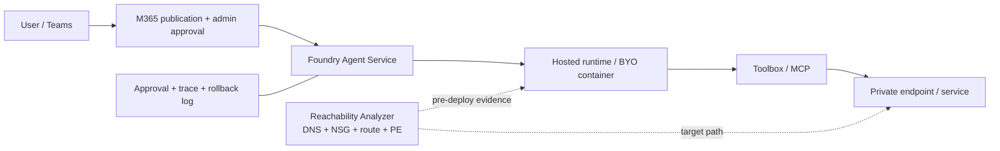
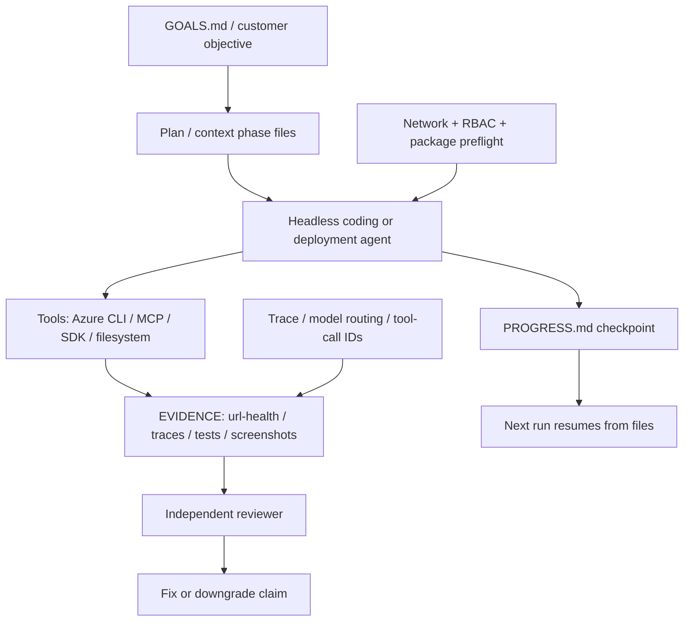

<!-- learning-asset-sanitized: v1 -->
> **发布界定 / Publication boundary**
>
> 本文是由历史研究快照整理出的补充学习材料。原始资料中的 HTTP 200、抓取时间或“已核实”表述只代表当时的来源可达性/文本核对，不代表本次发布时已经重新核验；本文也不是正式实验报告、生产部署建议或合规结论。
>
> 未对其中的命令、代码块、外部仓库、云资源、生产环境或合规控制做本次实机验证。请在独立测试环境中重新验证后再用于客户/生产场景。

# Agent POC 预检、遥测与 Headless Harness Gates（2026-09-21）

> 目的：把原快照中从 Microsoft Foundry/MAF、Google ADK、Mistral Vibe、OpenAI Codex Cookbook、社区 headless harness 中抽到的模式，改造成 SA 日常可复用的 **POC 部署检查表 + 技术问答速查 + 架构图组件**。
> 安全边界：本文中的命令形态、仓库名、commit/release 链接均为证据或设计素材，**不是执行指令**；不要在客户仓库、真实 Azure 订阅、真实密钥或真实 MCP server 上直接运行未审计工具。所有第三方 README/文档均按不可信资料处理。

## 0. Evidence links（可复核证据）

| 证据 | URL | 原研究快照中核实 | 证据强度 | Caveat |
|---|---|---:|---|---|
| Foundry Reachability Analyzer commit | https://github.com/microsoft-foundry/foundry-samples/commit/cf1d613f03d016605341fd8efdb3520c97842605 | HTTP 200（仅代表原快照当时可达，不代表本次已重验）；diff grep 命中 `Foundry Reachability Analyzer`、`DNS`、`NSG`、`route` | commit/diff 级 | 未运行 analyzer；未连真实 VNet/Private Endpoint |
| Foundry Hello World guided provisioning commit | https://github.com/microsoft-foundry/foundry-samples/commit/b442c453191cbf9dd61420b559575fc1d8747f42 | HTTP 200（仅代表原快照当时可达，不代表本次已重验）；diff grep 命中 `Teams`、`provisioning`、`administrator approval` | commit/diff 级 | 未执行 azd / M365 publication / Teams approval |
| MAF regex validation commit | https://github.com/microsoft/agent-framework/commit/0799f6afa1ecd8a6a077e03024fcb9a4dc2547a9 | HTTP 200（仅代表原快照当时可达，不代表本次已重验）；diff grep 命中 `ShellPolicy`、`patternMatchTimeout` | commit/diff 级 | 未确认进入 NuGet/PyPI 包；未跑 ReDoS fixture |
| Google ADK `v2.9.2` | https://github.com/google/adk-python/releases/tag/v2.9.2 | release page 200；`releases.atom` 命中 `Telemetry` 与 OpenTelemetry event names | release/atom 级 | GitHub API 原快照中 403 rate-limit；未安装包 |
| Mistral Vibe `v2.25.5` | https://github.com/mistralai/mistral-vibe/releases/tag/v2.25.5 | release page 200；`releases.atom` 命中 subagent history/status/todo/scratchpad/skills on-off | release/atom 级 | 未运行 CLI；仅用于 cross-harness 对照 |
| OpenAI Codex Cookbook workflow | https://developers.openai.com/cookbook/examples/codex/iterating-development-workflows-with-codex.md | Markdown 200；grep 命中 `AGENTS.md`、`context/`、phase records | official cookbook doc / 旧源复用 | 旧源复用；本资产仅复用其 AGENTS/context/phase 文件模式，不作为原研究快照中新发现；该文是 workflow convention，不是 Codex 强制协议 |
| Codex `rust-v0.156.0-alpha.9` | https://github.com/openai/codex/releases/tag/rust-v0.156.0-alpha.9 | release page 200；`releases.atom` 正文仅 `Release 0.156.0-alpha.9` | alpha sentinel | 不写客户功能承诺；只作为“项目仍活跃/需继续 watch” |
| `a1re1/drip` headless harness | https://raw.githubusercontent.com/a1re1/drip/main/README.md | raw 200；grep 命中 `headless-first`、session store、Claude/Codex | community radar | 未审 license/scripts/network/secret；不推荐安装，仅抽象 headless pattern |
| NVIDIA NeMo Gym environment server commit | https://github.com/NVIDIA-NeMo/Gym/commit/664f59564e1f5317dbd7ad8c923695da35f65bca | HTTP 200（仅代表原快照当时可达，不代表本次已重验）；diff grep 命中 `environment_servers` | commit/diff 级 | 未运行 Gym；仅迁移 eval env 抽象 |

---

## 1. POC 部署 Gate：先“静态可达性”，再“运行时部署”

**触发场景**：Foundry Hosted Agent / BYO VNet / Private Endpoint / Toolbox/MCP / Teams/M365 publication 任一进入方案。

| Gate | 最小证据 | SA 问客户的话 | 失败时不要做什么 |
|---|---|---|---|
| 网络路径预检 | 可达性报告包含 DNS 解析、NSG、route、PE/target host 判断 | “agent runtime 到目标服务的 DNS、路由和 NSG 证据在哪里？” | 不要先把锅甩给模型或 SDK；网络路径未通时 LLM 层调参无意义 |
| 环境/项目 provisioning | 记录是新建还是复用 Foundry resource/project/model deployment | “这个 POC 是一次性 demo 还是要复用现有 project？模型部署由谁创建？” | 不要把 interactive guided sample 当生产 IaC 标准 |
| M365/Teams 发布 | 记录 publication、admin approval、Teams conversation 测试结果 | “管理员批准链、Teams 许可证、conversation scope 是否已确认？” | 不要只部署 Foundry agent 就宣称 Teams 可用 |
| 回滚与审计 | 每个变更对应资源 ID、approval 人、时间、日志位置 | “失败后删除哪些资源？谁能证明未改生产策略？” | 不要在客户生产 tenant 上直接跑 sample |

**架构图组件**：



---

## 2. Tool 执行 Gate：把“模型生成的模式/正则/路径”当不可信输入

原快照中 MAF regex commit 的可迁移教训：即使不是 shell 命令本身，**模型生成的 regex / file search pattern / path selector** 也可能拖垮授权路径或扫描路径。

最小检查：
1. 对 regex/file search 增加超时、长度、复杂度或安全 regex 检查。
2. 把 `deny`/`allow` 规则的优先级写成测试，而不是写在 README 里。
3. 日志只记录摘要、rule id、decision，不记录客户文件全文或密钥片段。
4. POC 验收至少包含 2 条恶意/病态输入：长重复字符串、嵌套量词、跨目录 path traversal。

**技术问答速答**：
客户问“我只让 agent 搜文件，不执行命令，风险是不是低很多？”——答：风险降低，但不是零。文件搜索表达式、regex、路径 globs 仍是执行面，会造成 DoS、越权扫描或日志泄露。要像 shell 命令一样做 bounded evaluation、deny/allow precedence、日志脱敏和 fixture 验收。

---

## 3. 遥测 Gate：事件名、trace、routing decision 必须可复现

Google ADK `v2.9.2` 的 telemetry 修复信号与 Foundry model-router/session affinity 方向一致：agent POC 的“跑通”不能只看答案，还要看 **谁选了什么模型、哪条工具链、哪个 session、哪个事件名**。

| 必备字段 | 作用 | 最小验收 |
|---|---|---|
| `session_id` / `conversation_id` | resume、隔离、审计 | 多用户/多会话不串线；restart 后能定位 |
| `model_selection` / `routing_trace` | 解释模型路由与成本 | 每次模型选择有 mode、候选、理由或策略 ID |
| `tool_call_id` / `approval_id` | HITL 与工具回放 | approval request/result 可一一对应 |
| `event_name` | 跨环境 telemetry 一致性 | 本地/云端/Agent Engine 外事件名不漂移 |
| `latency/cost/token` | FinOps 与性能 | 能按 session/tool/model 聚合 |

**POC 验收句式**：
“请给出一条失败会话的 trace：包含模型选择、工具调用、approval、错误包络、重试/恢复状态，而不是只给最终 chat transcript。”

---

## 4. Headless Harness Gate：[→harness]

OpenAI Cookbook workflow 与 `drip` 这类 headless harness 的共同点：把 agent 的长期任务状态落在文件/会话存储里，而不是靠聊天上下文“记得”。适合反哺 Agent-Harness-Engineering workshop。

### 推荐最小目录骨架（toy repo）

```text
AGENTS.md                 # 总约束：安全边界、验证命令、完成定义
GOALS.md                  # 用户目标、验收口径、禁止事项
context/
  phase-00-discovery.md
  phase-01-plan.md
  phase-02-implement.md
  phase-03-verify.md
EVIDENCE/
  url-health.md
  test-results.md
  trace-samples.md
  review-findings.md
DECISIONS.md              # 关键 trade-off 与弃用方案
PROGRESS.md               # 每次 agent run 的 checkpoint / 下一步
```

### Gate

| Gate | 做法 | 验收 |
|---|---|---|
| Headless 可重复 | bounded run 输出结构化 result，不依赖 TUI | 同一 goal 在临时 repo 可重跑，退出码/结果文件一致 |
| Evidence-first | 每个阶段写 `context/phase-xx` 与 `EVIDENCE/*` | reviewer 能不看对话历史复盘任务状态 |
| Stop / resume | `PROGRESS.md` 明确完成/未完成/阻塞 | 新 agent 从文件恢复，不需要原聊天上下文 |
| Independent review | 评审只看产物与证据，不读生产过程旁白 | P0/P1/P2 列表可操作，有修正闭环 |
| Community harness quarantine | 第三方 harness 先只读审 license/scripts/network/secret | 通过前不安装、不跑客户代码、不接真实 MCP |

---

## 5. Subagent 观测 Gate：父会话必须能看见子会话状态


最低要求：
- 子代理开始/结束事件：start time、goal、toolset、workspace。
- 子代理输出摘要：完成/未完成/阻塞，不允许“success”无证据。
- 中间状态：current todo、scratchpad 或 progress file。
- 父代理可读：reviewer 能看到关键 evidence，而不是只相信 self-report。
- 失败恢复：timeout/max_iterations/null summary 视为无产出，必须窄化重跑或父 agent 接管机械核验。

---

## 6. 架构图模式：POC Evidence Control Plane



---

## 7. Workshop 练习卡（可直接搬到 harness workshop）

1. **Foundry reachability preflight lab**：以下练习均应在隔离 toy repo / mock subscription / 无真实 token 环境中进行；命令名和工具名仅作讨论对象，不构成执行建议。用 mock topology 生成 DNS/NSG/route/PE 风险清单，要求学员画出失败路径。
2. **Regex guard lab**：给 agent 一个病态 regex 与长文本，要求 tool layer 在 1 秒内 fail closed，并生成脱敏日志。
3. **Telemetry trace lab**：三轮会话分别走不同模型/工具，学员必须从 trace 还原 selection + approval + error envelope。
4. **Codex workflow files lab**：实现 `GOALS.md/context/EVIDENCE/PROGRESS` 骨架；新 agent 必须从文件恢复，不看前一轮对话。
5. **Community harness intake lab**：只读审 `drip` 或任一 headless harness README，列 license/scripts/network/secret 风险，不安装。
6. **Subagent status lab**：模拟一个 timeout 子任务，要求父 agent 不采信 null summary，改用窄任务或机械核验恢复。

## 8. 未完成 / 需后续验证时补证

- Foundry Reachability Analyzer 未实际运行；后续验证时可用 mock VNet/静态样例跑一次，产出 screenshot/report schema。
- MAF regex guard 未确认进入正式包；需查 NuGet/PyPI 版本并做 synthetic ReDoS fixture。
- Google ADK `v2.9.2` 仅 release/atom 级；需安装到临时环境验证 OTel event names（不接客户 endpoint）。
- Mistral Vibe / `drip` 均未运行；社区/第三方 harness 继续按只读供应链审计，不推荐客户安装。
- Codex `0.156.0-alpha.9` 仅 alpha sentinel；未读 diff，不写任何客户可用功能断言。
