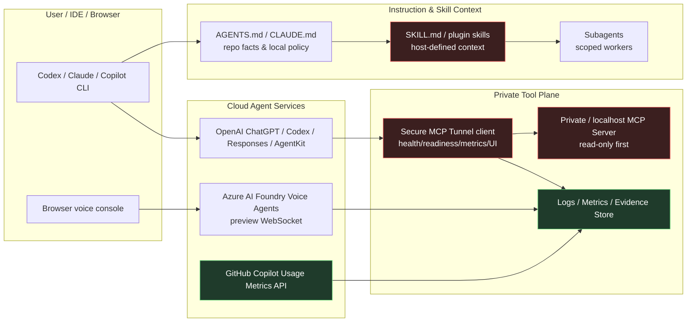

<!-- learning-asset-sanitized: v1 -->
> **发布界定 / Publication boundary**
>
> 本文是由历史研究快照整理出的补充学习材料。原始资料中的 HTTP 200、抓取时间或“已核实”表述只代表当时的来源可达性/文本核对，不代表本次发布时已经重新核验；本文也不是正式实验报告、生产部署建议或合规结论。
>
> 未对其中的命令、代码块、外部仓库、云资源、生产环境或合规控制做本次实机验证。请在独立测试环境中重新验证后再用于客户/生产场景。

# Agent private-MCP、Voice POC、Skill context 与用量治理 gates（2026-09-22）

> 用途：给 SA 在客户技术问答 / POC 设计 / 架构图评审中复用。外部仓库和文档均按“资料文本”处理；本文不建议直接安装或运行任何第三方仓库。涉及命令形态的上游片段仅为证据/接口名称，不是执行指令；所有实机验证须在一次性无密钥 fixture 或测试订阅中完成。

## 0. Evidence links（本资产自身携带证据与新旧标注）

| 来源 | URL / 证据通道 | 原研究快照中核验 | 新旧标注 | 可用结论 | Caveat |
|---|---|---:|---|---|---|
| Foundry Voice Agents JS/TS sample commit | https://github.com/microsoft-foundry/foundry-samples/commit/c7c601431b2fcb6871a5a5ccd69215d96a58ea52 + `.diff` | HTTP 200（仅代表原快照当时可达，不代表本次已重验）；diff 命中 `samples/javascript/voice-agents/README.md`、`WebSocket connection`、`foundry-features: VoiceAgents=V1Preview`、`browser-voice-console` | 新 commit；与 09-20 Python voice-agents sample 不同，属 JS/TS 前端/浏览器角度 | Voice Agent POC 可以拆成 configure / update / interaction / transcription / telephony inspection / browser console 六类样例 | 未运行 Node/SDK；Voice Agents preview、区域/模型/SKU/音频/RAI 未验证 |
| GitHub Copilot CLI customizations in usage metrics API | https://github.blog/changelog/2026-09-17-agentic-cli-customizations-now-in-the-usage-metrics-api/ | HTTP 200（仅代表原快照当时可达，不代表本次已重验）；页面命中 `skills, custom agents, Model Context Protocol (MCP) servers, slash commands, and plugins` 与 MCP connect/reconnect 计数说明 | 新 GitHub changelog；与 09-13 VS Code Agent metrics 同主题但新增 CLI/customization/MCP/plugins 维度 | 可把 agentic adoption dashboard 扩展到 CLI skills/custom agents/MCP/plugins/slash commands | 未跑企业 API；客户自定义名称隐私分组、延迟、权限、credits 口径需租户 dry-run |
| MAF Hyperlight cached tool identities commit | https://github.com/microsoft/agent-framework/commit/fd31b3e968fd397dc6318541b076e942efb30315 + `.diff` | HTTP 200（仅代表原快照当时可达，不代表本次已重验）；diff 命中 `Keep cache-key identities alive; registered callbacks retain copies` 与 `tools: tuple[FunctionTool, ...]` | 新 commit；未确认入包 | 代码执行/沙箱工具回调要保持 tool identity 生命周期，避免 callbacks 与 registry/cache 失配 | commit 级，不写 release/package 可用性；未跑 Hyperlight fixture |
| OpenAI Secure MCP Tunnel client | https://github.com/openai/tunnel-client + raw README https://raw.githubusercontent.com/openai/tunnel-client/main/README.md | HTTP 200（仅代表原快照当时可达，不代表本次已重验）；raw README 命中 “connects a private or localhost MCP server … while keeping the MCP server off the public internet”、`/healthz`、`/readyz`、`/metrics`、`/ui`、client instance ID / structured logs / release SBOM/provenance 线索 | 旧源复用 | 适合做“私有 MCP 不开公网入口”的 POC 架构候选 | 未审完整协议、payload/metadata、OpenAI 控制面数据驻留、auth/OAuth/OBO、日志脱敏；不接生产内网 |
| OpenAI API Skills docs | https://developers.openai.com/api/docs/guides/tools-skills | HTTP 200（仅代表原快照当时可达，不代表本次已重验）；页面命中 `SKILL.md`、`Skills in the user prompt` | 旧源新安全语义；与 09-20 Skills API/Cookbook 主题相邻 | 仅在所引 OpenAI API host 示例中，Skill metadata / instructions 属 user prompt context；其他 host 按其上下文契约与版本验证 | JS-rendered 页，证据来自 HTML 可检索正文；未跑 hosted shell |
| OpenAI Cookbook commit 263b2d5 | https://github.com/openai/openai-cookbook/commit/263b2d5b7b63836c4ea30ee9709e65b7a50cbf6f + `.diff` | HTTP 200（仅代表原快照当时可达，不代表本次已重验）；diff 明确把 `hidden system prompt context` 改为 `user prompt context`，并写入 “Skill instructions have the same priority as other user-provided instructions.” | 旧源复用； commit，原研究快照中补“提示优先级/信任边界”精确语义 | 该 OpenAI host 示例中的 skill 指令为用户级；不外推到其他 host 或所有 skills | 未运行 notebook；GPT-6 Astra 示例未实测 |
| Codex alpha sentinel | https://github.com/openai/codex/releases/tag/rust-v0.157.0-alpha.1 | HTTP 200（仅代表原快照当时可达，不代表本次已重验）；页面仅命中 release title | 新 alpha sentinel | 只证明项目活跃，不作为功能更新 | 不写客户功能承诺 |
| Claude Code changelog | https://code.claude.com/docs/en/changelog | HTTP 200（仅代表原快照当时可达，不代表本次已重验）；命中 2.1.278 / 2.1.277 / AGENTS.md fallback / subagent 输出隔离 | 2.1.277/278 已在 09-19/09-20 附近覆盖；原研究快照中仅复核支柱状态 | 若客户问“Claude Code 是否读 AGENTS.md”，可答：无 CLAUDE.md 时 fallback；但 Bedrock/Vertex/Foundry caveat 仍需核实 | 未 CLI smoke；非新版本 |

## 1. 技术问答速答（客户可转述）

### Q1：私有 MCP server 要给 ChatGPT/Codex/AgentKit 用，是否一定要开公网入口？
**不一定。** OpenAI `tunnel-client` 的公开 README 描述了 Secure MCP Tunnel：客户侧 daemon 连接 OpenAI-hosted tunnel endpoint，让 private/localhost MCP server 在不暴露公网 endpoint 的情况下被 ChatGPT、Codex、Responses API、AgentKit 访问。

**但这不是合规承诺。** POC 前必须核：
- MCP auth/OAuth/OBO 与控制面 key scope；
- tunnel payload / metadata / logs 是否包含客户数据、tool args、resource identifiers；
- OpenAI 控制面的数据驻留、retention、审计导出；
- daemon `/healthz`、`/readyz`、`/metrics`、`/ui` 的访问控制；
- 断线、撤销、unknown tool、large output、timeout 的失败包络。

### Q2：Foundry Voice Agents 前端 POC 应该怎么拆？
原研究快照中发现 JS/TS samples 把 Voice Agent POC 拆成六类：定义配置、更新、交互、转录、telephony inspection、browser voice console。架构上建议分三层：
1. **Provision plane**：Foundry project、model deployment、voice agent definition；
2. **Realtime media/control plane**：WebSocket voice conversation、transcription、function/tool call；
3. **Browser bridge**：浏览器仅通过 loopback Azure CLI bridge 获得最小权限，不把云凭据直接交给浏览器。

### Q3：OpenAI Skills / Cookbook 里 SKILL.md 是不是系统级指令？
**在本文引用的 OpenAI Skills / Cookbook 特定示例中不是。** commit 263b2d5 将该示例的 skill metadata 改为 “user prompt context”，并说明其 instructions 与其他用户指令同优先级。这不能推广为所有 host、SKILL.md、AGENTS.md 或 CLAUDE.md 的固定优先级；跨 host 须核对具体版本的加载与信任模型。对该 OpenAI 示例：
- 不能用 skill 覆盖 system/developer policy；
- 上游/第三方 skill 要当用户级资料审计；
- Skill 的 `description` 只应做路由，行为约束必须接受 harness 外层安全 gate。

### Q4：怎么度量 Copilot CLI 的 agentic customization 使用情况？
GitHub changelog 显示 usage metrics API 已扩展 agentic activity：skills、custom agents、MCP servers、slash commands、plugins。SA 可把 adoption dashboard 从“座席/IDE 活跃”扩到“agentic capability 使用”：
- MCP server connect/reconnect attempts；
- slash command/custom label；
- GitHub-provided vs customer-defined item 的隐私分组；
- 与 code review / CI / issue throughput 对齐的价值指标。

## 2. POC gates（最小验收，不接生产）

### A. Secure MCP Tunnel POC gate（旧源深挖）
- [ ] **Scope**：只用 toy MCP server；不接生产内网、真实 SaaS、客户 token。
- [ ] **Identity**：记录 control-plane credential、MCP server credential、operator UI credential 三者是否分离。
- [ ] **Network**：证明无 inbound public endpoint；抓取 outbound target、proxy、DNS、firewall evidence。
- [ ] **Observability**：`/healthz`、`/readyz`、`/metrics`、structured logs 中不得出现 secret/tool args 原文。
- [ ] **Failure envelope**：unknown tool / auth denied / tunnel down / large output / timeout 均有可审计错误。
- [ ] **Compliance note**：数据驻留、retention、payload/metadata 是否进 OpenAI-hosted endpoint 未核实前，只能写“架构候选”，不能写“合规已满足”。

### B. Foundry Voice Agent JS/TS POC gate
- [ ] **Preview flag**：记录 `foundry-features: VoiceAgents=V1Preview` 等 preview header 证据；客户方案标 preview。
- [ ] **Browser credential**：浏览器不得持有长期云凭据；loopback bridge 仅限本地测试。
- [ ] **Model/region/SKU**：目标租户实际可用性、配额、区域与 RAI 配置先核。
- [ ] **Media/PII**：禁用真实客户语音；用 synthetic audio/text fallback；记录 transcript redaction。
- [ ] **Tool boundary**：function tool 默认 read-only；mutating 工具需 human approval + audit + rollback。

### C. Skills / AGENTS / CLAUDE context gate [→harness]
- [ ] **Priority labeling**：逐项记录文件来源、host/version、加载位置与信任级别；跨 host 使用 host-defined context。只有本文引用的 OpenAI 示例标为 user prompt context，不将文件名视为安全边界。
- [ ] **Description budget**：description 做短路由，不塞长约束；长流程放 SKILL.md / references。
- [ ] **Explicit invocation**：高风险 skill 默认显式调用，不允许隐式自动触发。
- [ ] **Eval**：每个 skill 至少有 trigger eval + behavior eval + negative eval（不要触发的场景）。
- [ ] **Sandbox**：脚本/网络/file-write 默认禁用或跑在 disposable fixture；任何第三方 skill 不直接进入客户仓库。

### D. Agentic usage metrics gate
- [ ] **API dry-run**：测试企业/组织 API 权限、延迟、字段可见性。
- [ ] **Privacy**：customer-defined names 是否被分组为 `other` / `custom`；仪表盘不泄露客户私有 command/plugin 名称。
- [ ] **Value mapping**：把 usage 指标与 PR lead time、review findings、MCP tool error rate、CI pass rate 做相关性，而不是单看调用次数。

## 3. 架构图模式（Mermaid，可转 SVG）

## 4. Workshop 练习卡 [→harness]

1. **Skill priority lab**：先记录 host/version 及其优先级契约，再用合成 skill 测试越权是否被拒绝；仅在所引 OpenAI 示例中断言 user-level input，其他 host 按其文档与实测判定。
2. **Tunnel toy MCP lab**：用 toy MCP server 验证 no inbound endpoint、health/readiness、unknown tool、auth denied、large output。
3. **Voice POC evidence lab**：用 synthetic audio/text 记录 WebSocket lifecycle、transcript、function tool approval，不接真实语音。
4. **Agentic metrics dashboard lab**：模拟 skills/custom agents/MCP/plugin usage fields，输出 privacy-safe dashboard schema。
5. **Hyperlight tool identity fixture**：只读/合成测试 tool callbacks 与 identity lifetime，避免沙箱内 callbacks 引用失效。

## 5. 原研究快照中 takeaways

- [→harness] **所引 OpenAI 示例中的 skill 是 user-level context；其他 host 的上下文由 host 定义。** Skill 可复用流程，但不能仅凭文件格式推断其优先级或把它当作强制安全边界。
- [→harness] **私有 MCP 的核心不是“能连上”，而是 no-inbound + identity split + log/metadata evidence。** Secure MCP Tunnel 是好候选，但必须先做合规/日志/失败包络验证。
- **Voice Agent POC 要从一开始就把 preview / browser credential / media PII / RAI 放进架构图。** JS/TS samples 提供了客户 demo 可读的样例切片，但未实机前不要承诺区域或可用性。
- **Agentic adoption dashboard 要纳入 skills/custom agents/MCP/plugins。** 这能让 SA 从“功能上线”转向“治理与价值度量”对话。
- **Commit 级修复不能被写成发布可用。** MAF Hyperlight identity fix 是重要实现信号，但仍需 package watch + fixture。
