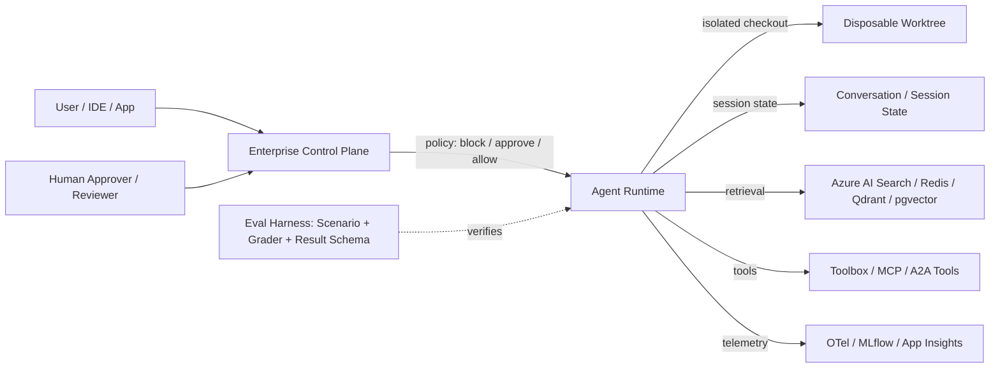

<!-- learning-asset-sanitized: v1 -->
> **发布界定 / Publication boundary**
>
> 本文是由历史研究快照整理出的补充学习材料。原始资料中的 HTTP 200、抓取时间或“已核实”表述只代表当时的来源可达性/文本核对，不代表本次发布时已经重新核验；本文也不是正式实验报告、生产部署建议或合规结论。
>
> 未对其中的命令、代码块、外部仓库、云资源、生产环境或合规控制做本次实机验证。请在独立测试环境中重新验证后再用于客户/生产场景。

# Agent Release Control-Plane & Eval Harness Gates（2026-09-11）

> 目的：把原研究快照中从 MAF / Foundry Hosted Agents / GitHub Copilot / Codex / Claude Code / OpenAI Cookbook 抽到的新证据，固化成 SA 可复用的技术问答、POC 预检与架构图检查表。
> 安全说明：下文出现的 CLI 命令形态均为上游文档或 release note 证据片段，不是执行指令；任何 POC 必须在临时 workspace、测试订阅、无真实 secret/客户代码环境验证。

> 证据限制：URL 可达性不等同于正文语义或运行验证；未重新运行 CLI/SDK。

## Evidence links（可复核来源）

| 来源 | URL | 原研究快照中证据强度 | Caveat |
|---|---|---|---|
| Microsoft Agent Framework Python 1.18.0 release | https://github.com/microsoft/agent-framework/releases/tag/python-1.18.0 | release HTML 200；grep 命中 vector-store、Azure AI Search、Redis、Qdrant、Postgres、tool loop max-duration、MLflow samples | 未安装包、未运行 sample；alpha connectors 生产语义未核 |
| Foundry Agent Service hosted agents docs | https://learn.microsoft.com/en-us/azure/foundry/agents/concepts/hosted-agents | docs 200；grep 命中 per-session VM-isolated sandbox、`$HOME`/`/files`、scale-to-zero resume、Toolbox MCP endpoint | 文档级；区域/预览/租户可用性未核 |
| GitHub Copilot managed agent permissions changelog | https://github.blog/changelog/2026-09-09-enterprise-managed-permissions-for-github-copilot-agent-operations/ | changelog 200；HTML/JSON-LD 命中 blocked / require human approval / proceed without prompt | 未租户实测；具体 operation taxonomy 需在企业策略界面验证 |
| OpenAI Codex changelog | https://learn.chatgpt.com/docs/changelog | BrightData markdown 200；命中 Codex CLI 0.154.0、worktree、inline questions、authorization context | JS 站点 plain curl 只返回 shell；正文证据来自 markdown scrape；未运行 CLI |
| npm `@openai/codex` | https://registry.npmjs.org/%40openai%2Fcodex | registry JSON 200；`latest=0.154.0`，`alpha=0.155.0-alpha.2` | alpha 只作版本雷达，不写客户可用功能 |
| Claude Code changelog markdown | https://code.claude.com/docs/en/changelog.md | raw markdown 200；命中 2.1.267、`maxEffortLevel`、`--system-prompt-snapshot off`、resume/compact fixes、`/skill-doctor` | 未运行 Claude Code；2.1.268 未进入 changelog |
| npm `@anthropic-ai/claude-code` | https://registry.npmjs.org/%40anthropic-ai%2Fclaude-code | registry JSON 200；`latest=2.1.267`，`next=2.1.268`，`stable=2.1.236` | next 无 changelog，radar-only |
| OpenAI Cookbook GPT-Live eval harness commit | https://github.com/openai/openai-cookbook/commit/a0709e05 | commit/diff 200；命中 `duplex_voice_agent_evaluation`、CRAWL/WALK/RUN harness、assistant client/delegation/memory/security/tools | 偏 voice-agent；未运行示例；只迁移 eval harness 结构 |

## 一、技术问答速答卡

### Q1：MAF 1.18.0 对企业 RAG / 记忆 POC 有什么新价值？

**答法**：它把“agent runtime”和“vector store / retrieval memory”之间的边界显式抽象出来：release note 明确出现 shared vector-store abstractions，并补 Azure AI Search、Redis、Qdrant、Postgres/pgvector 连接器。对客户不是“现在一定生产可用”的承诺，而是说明 MAF 已在往“agent + 企业搜索/向量库 + 观测”统一 SDK 面推进。
**POC 口径**：先选 Azure AI Search 作为微软优先路径；Redis/Qdrant/Postgres 作为迁移/混合栈候选；验收必须包含 schema compatibility、filter behavior、latency、RBAC、PII logging 与 rollback。

### Q2：Foundry Hosted Agents 和自托管 container agent 怎么划分责任？

**答法**：Foundry Agent Service 托管 endpoint、identity、session state、scale/lifecycle 与 per-session VM-isolated sandbox；客户拥有 sandbox 内 agent code。文档明确 `$HOME` 和 `/files` 可跨 turn / idle 恢复，Toolbox MCP endpoint 可接模型、MCP、A2A、Azure services。
**架构图画法**：把“平台边界”和“客户代码边界”画成两层：外层 Agent Service（Entra auth、agent identity、conversation/session、observability、scale-to-zero），内层 sandbox（customer code、tool calls、stateful files）。

### Q3：GitHub Copilot agent operations managed permissions 能替代代码审查吗？

**答法**：不能。它是 agent 操作权限的企业控制面，可集中设置 block / require approval / allow-without-prompt；它降低 agent 自动操作风险，但不替代 branch protection、CODEOWNERS、CI/SARIF、人工 review。
**POC 口径**：把它放在“操作前审批层”，而代码审查/测试/策略仍是“操作后质量层”。

### Q4：Codex 0.154.0 的重点不是又多了一个模型，而是什么？

**答法**：最有 SA 价值的是 workflow 控制：experimental worktree 支持、inline question 不打断主任务、authorization context 在 compaction/新用户指令后更严谨地保留或拒绝。GPT-6-Astra model picker 是可见功能，但客户治理更关心隔离、授权、可恢复。

### Q5：Claude Code 2.1.267 的重点是什么？

**答法**：它补齐 effort 上限、系统 prompt 快照开关、长 session / resume / compact / hooks / preloaded skills 的一致性问题，并新增 `/skill-doctor` 帮助看哪些 skill 被加载但没用。对 workshop 的价值是：把“上下文成本、恢复一致性、skill 触发质量”变成可观测对象。

## 二、POC 预检 Gate

| Gate | 适用对象 | 最小验收 | Fail-loud caveat |
|---|---|---|---|
| Release-source classifier | Codex / Claude / MAF / MCP | 同时记录 docs/changelog、npm/PyPI、GitHub release、commit diff 四类证据；alpha/next 无正文只作 radar | 不得把 prerelease/next 写成客户可用功能 |
| Vector-store compatibility | MAF 1.18.0 | 用 synthetic docs 验证 insert/search/filter/delete；记录 connector、schema、metadata filter、latency | Redis/Qdrant/Postgres connector 标 alpha 时不得生产推荐 |
| Hosted sandbox boundary | Foundry Hosted Agents | 验证 session ID、`$HOME`、`/files`、idle resume、per-session isolation、identity | 区域/预览/网络隔离/合规需目标租户核实 |
| Agent operation approval | GitHub Copilot | 测试 block / require approval / allow 三档；保存审批事件与失败日志 | 不是 branch protection / CI 的替代品 |
| Worktree isolation | Codex 0.154.0 | 临时 repo 测 `--worktree`/`/worktree` 生成路径、resume、fork、cleanup；不接客户仓库 | experimental，先做 disposable workspace |
| Resume consistency | Claude Code 2.1.267 | 临时 workspace 验证 `/compact` 后 resume、SubagentStart/Stop hook context、preloaded skills、interrupted tool evidence | 未 CLI smoke 前只作 checklist，不作兼容承诺 |
| Eval harness separation | Cookbook GPT-Live harness | 把 scenario / assistant adapter / tool definitions / grader / result schema 分层；隐藏评分标准不进入被测 assistant | Voice 示例结构可复用，领域功能不可直接迁移 |

## 三、架构图组件库（Mermaid 草图）

**图注建议**：把 Worktree、Session State、Tool/MCP、Vector Store、Eval Harness 分成不同信任域；任何跨域箭头必须标 identity、approval、audit 与 rollback。

## 四、[→harness] 可直接反哺 workshop 的练习卡

1. **Release classifier lab**：给学员 4 个 URL（docs changelog / npm registry / GitHub release / commit diff），要求标注 `stable` / `next` / `alpha` / `body-empty` / `docs-confirmed`，并写一句客户可用性判断。
2. **Codex worktree lab**：在 toy repo 里验证 isolated worktree/fork/resume/cleanup；输出 `EVIDENCE/worktree-boundary.md`，禁止使用真实客户仓库。
3. **Claude skill-doctor lab**：设计 3 个 toy skills，其中 1 个 never-triggered，要求记录 `/skill-doctor` 或等价观测结论；若无法实机，则用静态 checklist 替代并标未实测。
4. **Foundry hosted boundary diagram**：根据 Hosted Agents docs 画 platform-owned vs customer-owned 边界，并列出 `$HOME`/`/files`、identity、Toolbox MCP 的验收点。
5. **Voice-agent eval harness refactor**：把 Cookbook 的 CRAWL/WALK/RUN 思路迁移到“文本客服 agent”toy POC：single-turn synthetic、recorded transcript、multi-turn simulated caller 三类 eval，共用 result schema。

## 五、验证后再复用

这些来源仍是 release/docs/diff 级证据，尚未做 CLI/SDK smoke。应先在隔离环境完成最小 fixture，再将清单固化为自动化流程；不能把未实测检查表描述为已验证流程。
