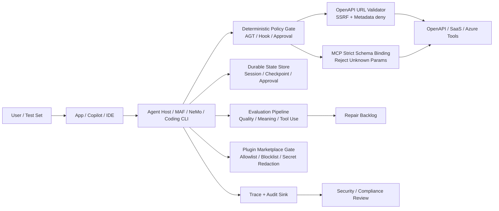

<!-- learning-asset-sanitized: v1 -->
> **发布界定 / Publication boundary**
>
> 本文是由历史研究快照整理出的补充学习材料。原始资料中的 HTTP 200、抓取时间或“已核实”表述只代表当时的来源可达性/文本核对，不代表本次发布时已经重新核验；本文也不是正式实验报告、生产部署建议或合规结论。
>
> 未对其中的命令、代码块、外部仓库、云资源、生产环境或合规控制做本次实机验证。请在独立测试环境中重新验证后再用于客户/生产场景。

# Agent POC 安全 / 评测 / 可恢复性 Gate Pack（2026-08-15）

> 目的：把原快照中深挖的微软生态、Claude Code/Codex CLI、NeMo/Agent Governance 等信号，沉淀成 SA 可复用的 POC 验收清单与架构图组件。适用场景：企业 Agent POC、MCP/OpenAPI 工具接入、Coding Agent harness workshop、架构评审。
>
> 证据强度：本文只使用原研究快照中已 `curl -sI -L --max-time 20` 或 raw/diff 抓取验证的来源。未实机部署、未跑 benchmark 的项明确标注。

## 1. 证据表（可复现来源）

**证据等级图例**：`diff grep`（代码级变更，可支持实现细节） > `release note / package tag`（包级发布信号，但需看功能是否 experimental） > `raw README/docs grep`（文档级事实，适合架构/验收条款） > `npm tag / URL health`（活跃度或链接健康，不等于功能发布） > `实机 smoke test`（原研究快照中未完成，后续最高等级）。

| # | 来源 | 原研究快照中验证状态 | 可安全引用的事实 | 不可过度承诺 |
|---|---|---|---|---|
| S1 | Semantic Kernel PR#14267 diff: https://github.com/microsoft/semantic-kernel/pull/14267.diff | 200；diff grep 命中 `168.63.129.16`、`Azure metadata (WireServer)`、`NAT64`、`SSRF` | OpenAPI plugin server URL validator 新增 Azure WireServer 与嵌入式 IPv4/IPv6 私网识别，防 metadata endpoint SSRF | PR 级证据；原研究快照中未确认进入已发布 PyPI/NuGet 包 |
| S2 | MAF PR#7649 diff: https://github.com/microsoft/agent-framework/pull/7649.diff | 200；diff grep 命中 `FoundryStateStore`、`AgentSessionStore`、`checkpoint`、`function approvals` | Foundry hosted agent / workflow checkpoint / function approval 状态可接平台 state store，使容器替换后可恢复 | PR 级证据；未实机验证恢复流程 |
| S3 | MAF Python 1.14.0 release: https://github.com/microsoft/agent-framework/releases/tag/python-1.14.0 | 200；release HTML grep 命中 Mistral client、AGENT-HOOKS、AG-UI checkpoint/resume、Foundry state stores | Python 包级发布已包含多项 agent hooks、checkpoint、state store 能力 | 不等于所有 .NET PR 均已进包；功能仍可能 experimental/opt-in |
| S4 | Azure MCP PR#3282 diff: https://github.com/microsoft/mcp/pull/3282.diff | 200；diff grep 命中 `CallToolHandler_UnknownParameters_RejectsToolCall` | MCP tool call 开始显式拒绝未知参数，可作为 strict schema binding 参考 | PR 级证据；原研究快照中未确认 beta.35/正式版是否包含该 PR |
| S5 | Copilot Studio evaluation docs: https://learn.microsoft.com/en-us/microsoft-copilot-studio/analytics-agent-evaluation-edit 与 overview | 200；HTML grep 命中 `quality, similarity, and text match`；overview 命中 general quality / compare meaning / tool use / keyword match / text similarity / exact match / custom | Copilot Studio test set 支持多种 grader/test methods，可转成企业 Agent POC 评分卡 | 原研究快照中未在客户租户实测；区域/许可可用性需项目中核实 |
| S6 | Claude Code CHANGELOG: https://raw.githubusercontent.com/anthropics/claude-code/main/CHANGELOG.md | 200；npm latest=`2.1.232`；grep 命中 2.1.232 subagent fork、SendMessage、marketplace policy、sandbox/permission fixes | Claude Code 2.1.232 引入默认 subagent fork、跨 session `@`/SendMessage、更多 marketplace/GitLab/sandbox 安全硬化 | 只做版本/文本级核实，未实机 smoke test |
| S7 | OpenAI Codex docs/npm health | `developers.openai.com/codex/changelog`→200 到 learn.chatgpt.com/docs/changelog；`/skills`→200；`/agents`→404；npm latest=`0.147.0`、alpha=`0.148.0-alpha.16`；GitHub release tag `0.148.0-alpha.16` 为 404 | Codex alpha 通道继续活跃；官方 changelog/skills 文档入口可达；`/agents` 仍是 URL 健康风险 | 未发现 alpha.16 的实质 release body；不要写成新功能发布 |
| S8 | NVIDIA NeMo Agent Toolkit README: https://raw.githubusercontent.com/NVIDIA/NeMo-Agent-Toolkit/main/README.md | 200；grep 命中 Evaluation System、FastMCP Workflow Publishing、A2A Protocol、LangGraph、AutoGen | NeMo 提供 agent workflow 生命周期、评测、MCP server、A2A、框架插件等模式，适合作横向参照 | 未跑样例；GPU/依赖/生产约束未实测 |
| S9 | Microsoft Agent Governance Toolkit README: https://raw.githubusercontent.com/microsoft/agent-governance-toolkit/main/README.md | 200；grep 命中 Public Preview、policy enforcement、identity、sandboxing、SRE、OWASP badge | 可作为“prompt safety 不是控制面，tool call 前 deterministic policy gate 才是控制面”的治理话术来源 | README 中攻击成功率/外部论文数字未逐条复核；不要直接引用具体百分比给客户 |

---

## 2. POC Gate 速查表

| Gate | 要拦什么 | 最小测试 | 通过标准 | 对应来源 |
|---|---|---|---|---|
| G1 OpenAPI / URL SSRF Gate | Agent 通过 OpenAPI plugin 访问 metadata/private endpoint | 构造 server URL：`http://168.63.129.16/`、`http://169.254.169.254/`、NAT64/IPv4-mapped IPv6 形式 | validator 明确拒绝；错误信息指向 metadata/private endpoint；不能靠 prompt 约束 | S1 |
| G2 MCP Strict Parameter Gate | Tool call 带未知/多余参数，利用“静默忽略”绕过审计或策略 | 对 MCP tool 传入 schema 外字段（如 `dangerous=true`） | 服务器返回 error，不执行工具；日志记录未知参数 | S4 |
| G3 Hosted Session / StateStore Gate | Hosted agent 容器重启、横向扩缩容导致 session/checkpoint/function approval 丢失 | 发起长 workflow → 记录 checkpoint → 重启/替换容器 → resume | 同一 session identity 可恢复；approval 状态不串用户、不丢失 | S2/S3 |
| G4 Evaluation Grader Gate | 只看 demo 成功，不量化答案质量、工具调用与语义匹配 | 建立 10-20 条 test set；至少启用 general quality、compare meaning、tool use、keyword/exact/text similarity 中 2-3 类 | 每次版本升级输出 pass/fail 与分数差异；失败样本进入修复 backlog | S5 |
| G5 Coding Agent Cross-session Gate | subagent fork / SendMessage / Remote Control 泄漏上下文或凭据 | 开启 fork 子代理、跨 session `@` 消息、Remote Control；准备不同敏感上下文 | 默认策略明确；跨 session inbound 可 accept/hold/refuse；fork 不把不该共享的 memory/import 泄漏 | S6 |
| G6 Plugin / Marketplace Allowlist Gate | 插件市场、GitLab/GitHub repo URL、command source 带来供应链风险 | 配置 allowed/blocked marketplace；安装允许与禁止的 marketplace/plugin | 禁止项被拒绝；clone auth hint 不泄密；marketplace 刷新/缓存行为可追踪 | S6/S9 |
| G7 Workflow Evaluation / Observability Gate | 多 agent workflow 缺少离线 eval、tracing、prompt/version 管理 | 对同一 workflow 跑 offline eval；记录 tracing 与 prompt version | 评测结果、trace、prompt版本可关联；可对比优化前后 | S8/S5 |

---

## 3. 架构图组件库（Mermaid 草图）

架构图落点：
- **纵向控制面**：Policy Gate、URLGuard、MCPSchema 在工具执行前 deterministic 拦截，不能只画 prompt guardrail。
- **状态面**：State Store 独立于容器实例，session/checkpoint/approval 是三类状态，不要混成一个“memory”。
- **评测面**：Eval Pipeline 与 Backlog 是闭环，适合放在 POC 验收图右侧。
- **供应链面**：Plugin Marketplace Gate 与 secret redaction 要画在 Coding Agent CLI / IDE 入口旁，不要等到 runtime 工具层才管。

---

## 4. 可直接复制的 POC 验收条款

1. **OpenAPI SSRF**：所有 agent 可配置 server URL 必须经过 URL validator；至少覆盖 Azure WireServer `168.63.129.16`、IMDS `169.254.169.254`、IPv4-mapped IPv6、NAT64、私网/loopback/reserved 地址。
2. **MCP 参数契约**：MCP server 必须拒绝 schema 外参数；未知参数不得静默忽略。所有拒绝事件进入审计日志。
3. **状态恢复**：长跑 workflow 必须证明容器替换后可用相同 session identity 恢复 checkpoint；function approval 不能跨用户/跨 session 复用。
4. **评测闭环**：POC 不以“demo 成功”验收；至少准备 test set + 两类 graders（语义/质量 + 工具调用或关键词/精确匹配），每次模型/提示/工具变更都跑。
5. **Coding Agent CLI 多会话安全**：[→harness] 对 subagent fork、SendMessage、Remote Control、plugin marketplace 的默认策略做 smoke test；禁止把跨 session 通信当“便利功能”直接开给所有项目。
6. **插件/marketplace 供应链**：[→harness] 插件安装前必须有 allowlist/blocked list、license、hooks/commands/MCP 配置、secret redaction 与回滚方案检查；社区插件只作雷达，不直接安装到生产 profile。
7. **Fail-loud 版本门**：[→harness] Codex alpha/npm tag、Claude Code changelog、MAF PR/release 必须区分“PR 已合入”“release 已发”“package 可安装”“实机 smoke test 通过”四个等级。

---

## 5. Workshop 反哺点

- [→harness] 把 G1/G2/G5/G6 做成“红队输入包”：恶意 URL、未知 MCP 参数、跨 session 诱导、marketplace allowlist 绕过。
- [→harness] 把 G4 做成“质量门”：PR 合入前跑 docs-editor / test set / grader，输出 pass/fail 与修复 backlog。
- [→harness] 把 G3 做成“长跑任务恢复实验”：scheduled/remote/background agent 在容器重启、网络中断、session 删除后的行为矩阵。
- [→harness] 把 S7 的 Codex URL health 变成链接检查：`/codex/changelog` 与 `/codex/skills` 当前可达，`/codex/agents` 当前 404，workshop 不应引用死链。

---

## 6. 后续未完成 / 需实机验证

- 未部署 MAF/Foundry hosted workflow；StateStore 恢复仍是 diff/release 级证据。
- 未在 Copilot Studio 租户创建 test set；grader 可用性、许可、区域需客户环境确认。
- 未实机运行 Claude Code 2.1.232；跨 session SendMessage/fork/Remote Control 安全条款仍需 smoke test。
- 未运行 NeMo Agent Toolkit sample/eval；不引用性能、成熟度或生产可用性结论。
- 未逐条复核 Agent Governance Toolkit README 中引用的外部论文/ASR 数字；客户材料只引用“policy gate / identity / sandboxing / audit”框架，不引用具体百分比。
