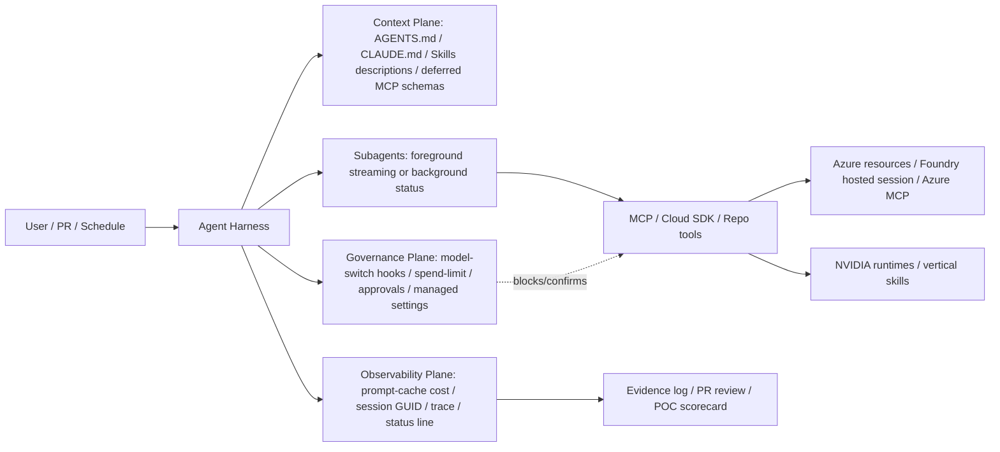

<!-- learning-asset-sanitized: v1 -->
> **发布界定 / Publication boundary**
>
> 本文是由历史研究快照整理出的补充学习材料。原始资料中的 HTTP 200、抓取时间或“已核实”表述只代表当时的来源可达性/文本核对，不代表本次发布时已经重新核验；本文也不是正式实验报告、生产部署建议或合规结论。
>
> 未对其中的命令、代码块、外部仓库、云资源、生产环境或合规控制做本次实机验证。请在独立测试环境中重新验证后再用于客户/生产场景。

# Agent session / observability / skill-surface gates — 2026-08-29

> 用途：给 SA 在回答“企业 Agent POC 怎么做得可恢复、可审计、可控成本、可治理技能/插件面”时直接复用。证据强度以 `release-level/docs-level/diff-level/source-inventory` 标注；所有命令形字符串仅为上游工具名/证据片段，**不是执行指令**。未做任何真实 Azure/Claude/Codex/NVIDIA 运行时 smoke，不接客户代码、生产订阅或 secret。

## Evidence links

| 来源 | URL | 证据强度 | 原研究快照中核实 |
|---|---|---|---|
| Azure MCP Server 3.0.0-beta.39 | https://github.com/microsoft/mcp/releases/tag/Azure.Mcp.Server-3.0.0-beta.39 | release-level + raw CHANGELOG | HTTP 200（仅代表原快照当时可达，不代表本次已重验）；release body 命中 `resilience`/`azurebackup`；CHANGELOG 命中 recovery plan/drill/MUA/private endpoint；`[Tool Count]` 仍为占位，未引用工具数 |
| Azure MCP CHANGELOG | https://raw.githubusercontent.com/microsoft/mcp/main/servers/Azure.Mcp.Server/CHANGELOG.md | raw docs-level | HTTP 200（仅代表原快照当时可达，不代表本次已重验）；读取 beta.39 小节 |
| MAF Python 1.16.0 | https://github.com/microsoft/agent-framework/releases/tag/python-1.16.0 | release-level/API body | HTTP 200（仅代表原快照当时可达，不代表本次已重验）；GitHub release API 200；命中 first background-agent task timeout、OpenTelemetry/OTLP、Foundry hosting/AG-UI fixes |
| Azure SDK session GUID commit | https://github.com/Azure/azure-sdk-for-python/commit/11200c99cc252a847db2ef3e86da57a4d973c658.diff | diff-level | HTTP 200（仅代表原快照当时可达，不代表本次已重验）；diff 命中 `AgentConfig.session_guid` 与 `FOUNDRY_AGENT_SESSION_GUID`；2.2.0b1 Unreleased，未包级 smoke |
| Claude Code 2.1.251 changelog | https://code.claude.com/docs/en/changelog.md | docs-level | HTTP 200（仅代表原快照当时可达，不代表本次已重验） markdown；命中 `PreModelSwitch`/`PostModelSwitch`、prompt-cache `/cost`、spend limit、Remote Control foreground subagent streaming、安全修复 |
| Claude Code context window | https://code.claude.com/docs/en/context-window.md | docs-level | HTTP 200（仅代表原快照当时可达，不代表本次已重验） markdown；命中 MCP deferred schemas、skill descriptions、CLAUDE.md、context fill simulation |
| Claude Agent SDK filesystem features | https://code.claude.com/docs/en/agent-sdk/claude-code-features.md | docs-level | HTTP 200（仅代表原快照当时可达，不代表本次已重验） markdown；命中 `settingSources`/`setting_sources`、CLAUDE.md、`.claude/skills`、`.claude/agents` |
| Codex GitHub PR review | https://learn.chatgpt.com/docs/third-party/github.md | docs-level | HTTP 200（仅代表原快照当时可达，不代表本次已重验） markdown；命中 `## Code Review Rules`、root/nested AGENTS.md、safe path/exception、CI boundary、`@codex security review` |
| Codex plugins | https://learn.chatgpt.com/docs/plugins.md | docs-level | HTTP 200（仅代表原快照当时可达，不代表本次已重验） markdown；命中 plugin browser、new chats/sessions、skills/connectors/MCP tools；0.151 alpha 仅版本信号不列为功能 |
| NVIDIA Agent Skills | https://github.com/nvidia/skills | source-inventory | repo/README HTTP 200（仅代表原快照当时可达，不代表本次已重验）；sparse clone 343 个 `SKILL.md`；仅 inventory/frontmatter，未导入/未执行 |

## 1. POC 会话身份与恢复 gate

适用场景：Foundry hosted agent、MAF workflow、Responses/AgentServer、任何需要“断点恢复/同名 session 重建/多用户隔离”的 POC。

| Gate | 最低验收 | 证据来源 | SA 话术 |
|---|---|---|---|
| Session incarnation identity | 每个 hosted session 要有平台拥有的 incarnation/session GUID，不能只靠用户传入的 session name 或 durable task name | Azure SDK diff: `AgentConfig.session_guid` from `FOUNDRY_AGENT_SESSION_GUID` | “同名 session 重建后仍能区分旧墓碑/新实例；客户材料前需包级验证。” |
| First background task timeout | 后台 agent 的“首个任务完成等待”必须可配置，避免 UI/API 误以为卡死 | MAF Python 1.16.0 release | “POC 要定义 first-response SLA：超时返回可恢复状态，而不是无限等待。” |
| Backend-owned service-session snapshot | Agent framework 层不要覆盖后端拥有的 service-session snapshot；incremental continuation input 要校验 | MAF Python 1.16.0 release | “托管运行时的状态所有权要画清：平台 session store vs agent-local state。” |
| Recovery evidence | 每次恢复要记录：session GUID、checkpoint ID、previous response/session id、恢复时间、是否重放工具调用 | 由上述 release/diff 推导，未实机验证 | “没有恢复证据链，就不能承诺 durable agent。” |

## 2. MCP 运维工具安全 gate

适用场景：Azure MCP / GitHub Copilot for Azure / Claude/Codex 通过 MCP 操作 Azure 资源。

| 工具面 | beta.39 新增/变化 | POC 必加 guardrail |
|---|---|---|
| Resilience recovery plan | 支持创建/替换/移除 additional recovery groups 与 manual/custom runbook pre/post actions；新增 validate-for-failover 汇报 per-resource qualification/blocking reasons | 先跑 read-only validate；mutating create/update/delete 只对测试 service group，必须有审批、回滚、审计 ID |
| Resilience drill | 新增 drill create/update/delete | drill delete/create 属破坏性/状态性动作；默认禁用，演示时加“dry-run 或 mocked mode” |
| AzureBackup MUA | `configure-mua` 改名 `enable-mua`；缺 `--resource-guard-id` 曾导致静默 disable 的问题被修复；新增显式 `disable-mua` | MUA 是强治理功能：任何 disable 必须二人审批、记录 resource guard、vault、actor、reason |
| Recovery Services vault PE | 新增 RSV private endpoint create/get/delete/approve-reject；DPP backup vault 不支持并返回明确错误 | 架构图要画私网审批点；错误路径要区分“资源类型不支持”与“RBAC/网络失败” |
| Tool count | release body 仍显示 `[Tool Count]` 占位 | 不引用工具数量；只引用已在 CHANGELOG 逐条命中的工具组 |

## 3. Claude/Codex harness 观测与上下文 gate [→harness]

| Gate | Claude Code 2.1.251 / docs 信号 | Codex 信号 | 可落地做法 |
|---|---|---|---|
| Model switch governance | `PreModelSwitch`/`PostModelSwitch` hooks 可 block/confirm/annotate；SessionStart resume hooks 带 staleness 与 re-cache cost | Codex release 0.151 alpha body 仅占位，不能写功能 | Workshop fixture：模拟 model switch request → hook 记录原因/旧新模型/预算影响 → 人类确认或拒绝 |
| Prompt-cache cost observability | `/cost` 增加 per-session prompt-cache hit ratio/misses/tokens re-cached/warm-cold；`/usage` 有 spend limit bar/status line field | Codex plugin/session 生效边界需看官方 docs，不从 alpha release 推断 | POC dashboard 至少展示：cache hit ratio、warm/cold、re-cache cost、session spend-limit；客户演示前校验是否可导出 |
| Foreground subagent streaming | 前台 subagent tool calls/results 可流给 Remote Control；后台 subagent 默认仅状态 | Codex PR review/cloud task 在 PR 上输出 review/fix 状态 | 架构图上把“父会话摘要流”和“子代理工具细节流”分开；敏感工具结果默认不外发 |
| Context budget | Claude context-window 明确常驻 system/memory/env，MCP schema deferred，skill 先加载 description，调用时加载正文；`/compact` 后未调用技能不重新注入 | AGENTS.md root/nested rules 只加载相关路径规则 | 规则：长期背景放 skill/reference，短硬约束放 AGENTS/CLAUDE；大 schema 延迟加载；每次 compact 后重新显式声明 goal anchor |
| SDK reproducibility | Agent SDK 默认读 CLI 同源 settings/CLAUDE.md/`.claude/skills`/`.claude/agents`；传 `settingSources: []` 可禁用用户/项目/local 设置（managed policy/global config 不受此选项控制） | Codex PR review 使用 repo 内 AGENTS.md 最近规则 | POC 脚本必须打印 setting sources：`user/project/local/programmatic/managed`，避免“我以为没加载本机规则”的不可复现 |

## 4. Codex `AGENTS.md` PR review rules 模板 [→harness]

把规则写成“业务/安全不变量”，不要写成 linter。

以下为 `AGENTS.md` 文档模板片段，仅用于人工复制/改写 review rules，不是 shell/CLI 执行步骤：

```md
## Code Review Rules

### <领域不变量名称>

- Do not <unsafe behavior or boundary violation>.
  Why: <business/security compatibility reason>.
  Safe path: <allowed implementation pattern or exception>.
  Evidence expected: <test/log/migration note/doc link the reviewer should look for>.
```

最小落地规则：

1. 根目录 `AGENTS.md`：放跨服务不变量，例如“不得在日志/trace中输出 token、connection string、customer PII”。
2. 子目录 `services/<svc>/AGENTS.md`：放该服务专属数据边界/兼容约束，例如实验分组、计费幂等、区域驻留。
3. 每个规则必须给 Safe path/exception；否则 agent 会把合法迁移误报。
4. 格式化、lint、类型检查、coverage threshold 留给 CI；review rules 只写“CI 看不懂但人常解释”的上下文。
5. 用代表性 PR 跑一次 review 后收敛噪声；Code Review/Security Review 不替代 required approvals。

## 5. NVIDIA Agent Skills intake gate

原快照只做只读 inventory：repo/README 200，sparse clone 343 个 `skills/**/SKILL.md`。**不导入任何上游 skill，不执行脚本。**

| 观察 | 对 SA 的价值 | 下一步 gate |
|---|---|---|
| 官方 README 称面向 Claude Code、Codex 等 coding agents，遵循 Agent Skills spec 与 progressive disclosure | 说明“行业/垂直技能包”正在从通用 coding agent 扩展到 GPU、RAG、物理 AI、医疗影像、仿真 | 按技能簇抽样，不 wholesale import |
| 目录覆盖 `nemo-relay-*`、`rag-blueprint`、`dynamo-*`、`jetson-*`、`omniverse-*`、`dicom-*` 等 | 可为 Azure+NVIDIA POC 画“Agent skill → NVIDIA runtime/tool → Azure infra”架构图 | 先审 license、script/network/file-write/secret；再只抽象成 SA checklist |
| Frontmatter 质量不均：部分 description 是 `>`/`>-` 空块，部分很具体 | 证明上游大仓也需要 skill routing 质量门 | 采纳“description 必须做什么+何时用+不用场景”的 lint，不采纳空 description |

## 6. 架构图组件库（文字版）



## Fail-loud gaps for next shift

- Azure MCP beta.39 未安装包/未读取完整 tool schema；mutating resilience/backup tools 不能用于客户生产演示前结论。
- MAF Python 1.16.0 只读 release body；未跑 first-background-task timeout、OTLP metadata、AG-UI continuation 的 package-level smoke。
- Azure SDK `FOUNDRY_AGENT_SESSION_GUID` 是 commit/unreleased 级证据；需确认进入 `azure-ai-agentserver-core/responses 2.2.0b1+` 包后再写客户承诺。
- Claude Code 2.1.251 未运行 CLI；hooks/cost/status line 的导出字段需临时 repo 验证。
- Codex PR review rules 已读官方 docs；08-10 旧博客已覆盖，原快照中属于 docs-level 复用/新模板，不是全新产品发现。
- NVIDIA skills 只做目录/frontmatter inventory；未审具体 skill 的 scripts/assets/security，不推荐直接安装或交给客户使用。
