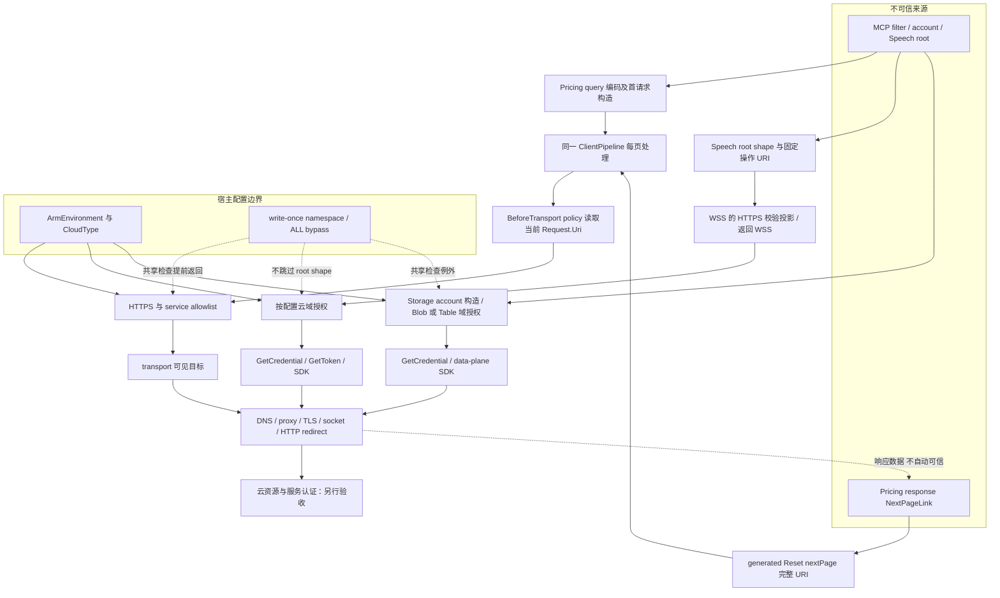

# Azure MCP：最终请求 URI 与云边界验收模板

日期：2026-10-04（中国标准时间） · 类型：固定源码分析与验收设计 · 所有验收卡：**NOT_RUN**

## 1. 结论与适用范围

本模板把 **88e497 的既有端点接线线索升级为完整调用边界分析**，并纳入后续 **6ea524 的 Pricing 最终请求 URI policy 与 Speech 操作端点构造**。EndpointValidator 是既有机制，不是本次首次发现。对象是 `microsoft/mcp` 的 commit 快照，不是已发布产品保证：

- 基线增量：`88e497ca516d6d53dad16290eeb100686bbcdd11`，2026-10-02 17:56:06 UTC。[C88]
- 分析快照 **R**：`6ea52482ea1446b7f2230e1d8db0d650982ff1d1`，2026-10-02 21:26:28 UTC。[C6]
- 发布边界：不把早于上述提交的 beta.49 当作包含这些变更的证据；未核对包字节及发布标签继承关系。**不承诺 GA、China 可用性或云间功能对等。** stars：n/a。
- 范围：12 个关键源码/测试文件；完整读取 PricingService、policy、共享 validator、allowlists 和本次服务实际走的 generated typed-async paging 链。Storage 定向读取构造/校验/凭据边界。未将其它生成同步/协议分页实现逐一验证。
- 证据强度：逐一 curl 获取固定 SHA 源码、HTTP 状态与内容摘要；源码与上游测试静态阅读。未运行 SDK、上游测试、云调用或模型；**HTTP 200 只是源码可获取，不是验收通过**。

**最重要的四个边界：**

1. Pricing 检查的是进入 pipeline transport 之前的 `message.Request.Uri`，不只是最初 base URL；服务返回的 `NextPageLink` 也重新进入此位置。[S03–S08]
2. 这不是 DNS/IP 验证、transport 内部自动 redirect 验证或资源授权。`ValidatePublicTargetUrl` 虽然在同一个文件内含 DNS 检查，却不是这里调用的方法。[S01:130–237,283–375]
3. 全局/namespace bypass、未知云 fallback、userinfo/port/path 的细节必须分别验收。不能用“共享 HTTPS validator”概括成统一强制边界。[S01,S02,S10]
4. Storage 与 Speech TTS 在所读路径中先授权 endpoint，再获取凭据；Pricing 所读客户端没有 credential/token 接入。三者不能统一表述为“认证前中间件”。[S03,S05,S11,S12]

## 2. 从调用入口到最终 URI

### 2.1 Pricing 完整服务逻辑与 generated paging

`PricingService.GetPricesAsync` 先构建 OData filter，要求至少一个过滤条件；结构化字段单引号转义，raw filter 原样加入表达式。Savings Plan 使用 preview API-version；默认查询采用客户端默认版本。`currency` 默认 USD。构造 options 后加入 `RetailPricingEndpointValidationPolicy`，位置是 **`PipelinePosition.BeforeTransport`**；再按 ArmEnvironment 构造 endpoint、创建 client，并 `await foreach` typed async 集合，最多返回 5000 个 item。[S03:41–175]

具体链条：

1. `AzureRetailPricesClient` 调用 `ClientPipeline.Create(options, … UserAgentPolicy …)`；子 `RetailPrices` 复用同一 Pipeline。[S05:32–49]
2. `RetailPrices.GetPricesAsync(... CancellationToken)` 返回 `RetailPricesGetPricesAsyncCollectionResultOfT`，不是本次未深读的 protocol overload。[S06:190–198]
3. 首请求：`Reset(_endpoint)` → 固定 `/api/retail/prices` → `AppendQuery(..., true)` → `Pipeline.CreateMessage` → `message.Apply(options)`。[S07:17–46]
4. typed async collection 每页调用 `_client.Pipeline.ProcessMessageAsync`；页返回并被枚举后取得 `RetailPricesResponse.NextPageLink`；非 null 则创建下一条 message。[S08:55–70]
5. 下一页：`Reset(nextPage)` 替换**完整 URI**，没有在这里重新强制 `/api/retail/prices`，也没有重新加入最初 filter/currency。[S07:49–57]
6. policy 同步/异步分支都先检查 `message.Request.Uri`，非 null 后用 `AbsoluteUri`、`serviceType="pricing"`、namespace `pricing` 调用共享 validator，随后才 `ProcessNext/ProcessNextAsync`。[S04:17–60]

5000 是 **item 数**上限，不是请求数/页数/时间上限；持续空页且带 NextPageLink 的循环不会靠这个 item 上限终止。现有循环中未见 visited-link 去重或独立页数上限；取消与额外预算仍需验收，不据此声称已完成资源耗尽攻击实测。[S03:86–103,S08:55–70]

### 2.2 Retry、redirect、paging：不要混成一个“最终”

| 位置 | 此快照能证明什么 | 不能直接证明什么 |
|---|---|---|
| 构造之后 | policy 读取当前 message 的 URI，而非保存的 base URL | 下层永远不再改变请求 |
| Paging | typed async 下一页重新走同一 Pipeline；恶意跨 host 链接在 policy 处拒绝 | 任意第三方客户端或未检查的所有 overload 等价 |
| Retry | 注册位置明确是 BeforeTransport；凡实际重新经过该 policy 的 attempt 都再次读取 URI | 未读固定版本 System.ClientModel 内部 retry 编排，不能仅凭枚举名认证所有重试必经、精确次数或异常重试规则 |
| HTTP 30x redirect | 此 policy 没有处理响应 Location 的代码 | transport/HttpClient 内部 follow-redirect 可能不重新进入外层 policy；所读文件未给出 AllowAutoRedirect 值，不能宣布已关闭，也不能宣布必然可绕过 |
| DNS/TLS/代理 | 这里是 URI 与服务域名判定 | DNS 重绑定、解析到私网、TLS peer、代理改写、socket 目的地和认证头转发 |

因此文中的“最终 URI”只指 **该 policy 可见、即将交给下层 transport 的 URI**，不是已经抓包确认的最终 socket 目标。Retry/redirect 的运行时差距以 G07/G08 为上线阻断门。[S03–S08]

## 3. allowlist、bypass 与 URL 语义

### 3.1 规则不是一个统一后缀匹配器

- `UseLegacyCheck=true`：用 `Uri.Host`；无前导点条目只匹配精确 host；有前导点同时匹配根域及其子域，忽略大小写。Pricing 用无前导点的精确 host；不是所有 `*.azure.com` 都允许。[S01:167–205,S02:195–202]
- `UseLegacyCheck=false`：转交 `URIValidator.InDomain`。源码注明该依赖按 `IdnHost` 处理，前导点有无不改变根域/子域语义。本次未读取依赖实现或运行 IDN 边界，不能扩展成 IDN 全面安全证明。Storage、SRE 走此分支。[S01:206–221,S02]
- **共享 `AllowedSuffixManager.GetSuffixes` 对未知 ArmEnvironment 仍 fallback Public。** 不是全局“未知云全部 fail closed”。Pricing 的 endpoint constructor 另行拒绝非 Public/China/Gov；Storage 的 CloudType constructor 也另行拒绝。已知 Germany 的 Pricing/Storage 空数组与未知环境 fallback 是不同分支。[S02:50–55,S03:166–175,S12:479–510]

### 3.2 云映射：源码授权表，不是在线服务目录

下表中的 hostname 仅是源码常量，**没有访问或在线验证这些云端地址**；它们不作为外部服务可达性引用。

| 服务 | Global/Public 源码条目 | China 源码条目 | Government / 其它边界 |
|---|---|---|---|
| Pricing | `prices.azure.com`，exact | `prices.azure.cn`，exact | Gov `prices.azure.us`；Germany 空；构造器未知云拒绝 |
| Storage blob | `.blob.core.windows.net` | `.blob.core.chinacloudapi.cn` | Gov `.blob.core.usgovcloudapi.net`；Germany 空 |
| Storage table | `.table.core.windows.net` | `.table.core.chinacloudapi.cn` | Gov `.table.core.usgovcloudapi.net`；与 blob 分开授权 |
| Speech | `.cognitiveservices.azure.com` | `.cognitiveservices.azure.cn` | Gov `.cognitiveservices.azure.us`；早期反馈显式只枚举三云 |
| SRE allowlist | `.azuresre.ai` | 空 | Gov/Germany 空；不能由此证明某地区实际产品可用性 |

[S02:195–249] 特别注意：Speech 的 Germany 条目实际为 `.servicebus.cloudapi.de`，且旁注 seeded/needs verification。模板不替源码修正这一可疑常量，不把它当 Speech 官方服务 endpoint；应单独升级核实。Speech helper 的显式早期支持列表不含 Germany。[S02:217–224,S10:24–33]

### 3.3 Bypass 是明确的控制面例外

`SetDangerouslyDisabledSsrfProtectionNamespaces` 对配置做数组复制并用 `Interlocked.CompareExchange` 一次性设置；二次配置抛 SecurityException。匹配 namespace 或 `ALL` 忽略大小写；执行 namespace 为 null/空白时，即使配置 ALL 也不匹配。[S01:23–107]

命中后，`ValidateAzureServiceEndpoint` **在空值、解析、HTTPS、serviceType 和域名校验之前直接 return**。Pricing 传 `pricing`，Storage 传 `storage`（不是 `storage-blob`），Speech 传 `speech`。但是：

- Pricing policy 的 requestUri 非 null 检查仍在共享 bypass 之前；Pricing 未知云 constructor 也不因此被跳过。
- Speech 自己的 root 形状校验先执行，不被共享 bypass 取消；有效 root 的跨域限制则可被该例外关闭。
- Storage account 形状和 CloudType 构造规则不因共享 bypass 自动取消。

不能用一句“bypass 关闭一切”掩盖其它层；也不能把 write-once 当作禁用 bypass 的安全强制。[S03,S04,S10,S12]

### 3.4 userinfo、port、path、query、fragment

| 组件 | Pricing / 共享 Azure-service 检查 | Speech root 输入合同 |
|---|---|---|
| userinfo | 没有显式拒绝；判断实际解析出来的 Host，不判断 `@` 前看似域名的文本 | 非空 `UserInfo` 拒绝 |
| port | 未限制端口；exact host 不等于 exact authority/origin | `IsDefaultPort` 必须为 true；不能把显式 `:443` 说成自定义端口而一概拒绝 |
| path | 未固定 path；合法同 host 的 next link 可指向其它 path，policy 仍只作这些现有检查 | `AbsolutePath` 必须等于 `/` |
| query / fragment | 未显式拒绝；first-request query 编码与 next-link 整 URI 是不同来源 | 非空 query/fragment 拒绝，固定操作参数由工具生成 |
| scheme | bypass 未命中时必须 HTTPS | root 即使 bypass 命中也必须 HTTPS；TTS 输出另外构造 WSS |

[S01:130–237,S04,S07,S10:199–220] Pricing 的 userinfo/非默认 port/任意 path 即使可被 policy 放行，也**不等于**已证明 HTTP stack 接受、userinfo 形成认证头、fragment 上线或远端愿意服务；必须分开记录“validator decision”与“transport observation”。Storage helper 同样没有 Speech 式 shape checks，但服务入口从合法 account 名构造 URL，不能把 helper 的任意 URL 测例说成生产 account 入参可达漏洞。

## 4. 凭据与操作端点的前后顺序

### Pricing

所读 `PricingService` 不获取 TokenCredential；generated client 构造只有 URI/options、UserAgentPolicy，源码称 unauthenticated API。因而可说 **该本地客户端路径未接入 Azure credential**，不可由此承诺任何未来代理/transport 永不附加 header。[S03,S05]

### Speech

`IsValidForAnySupportedCloud` 仅做早期反馈：在 Public/China/Gov 任一云接受并不意味着当前配置云接受。operation helper 要再次按传入 ArmEnvironment 授权。[S10:42–79]

- realtime transcription helper 返回经授权 root URI。
- fast transcription helper 固定 `/speechtotext/transcriptions:transcribe` 与 `api-version=2024-11-15`，然后校验完成的操作 URI。
- TTS 固定 WSS `/tts/cognitiveservices/websocket/v1`、`traffictype=localmcp`，port 重设默认；仅投影为 HTTPS 供共享 host 校验，**返回及交给 Speech SDK 的仍是 WSS URI**。[S10:104–176]

实读 TTS 调用边界：`SynthesizeToFileAsync` 先得到 validated WSS URI，随后校验输出路径，进入私有 stream 方法后才 `GetCredential` → `GetTokenAsync` → `SpeechConfig.FromEndpoint(wssEndpoint)` → 设置 AuthorizationToken → 创建 synthesizer。[S11:34–54,99–145] Scope 按 CloudType 切换且默认 fallback Public，而 domain validation 用 ArmEnvironment：须验收配置二者一致；不能称已核实云认证或资源所有权。[S11:280–288] 其它 recognizer 调用方不在本次12文件深读范围，仅对 helper 构造语义下结论。

### Storage

Blob：account 小写及名称验证 → CloudType 构造 root → ArmEnvironment 域授权 → options/transport → `GetCredential` → `BlobServiceClient`。Table：**options 与 `AzureService.GetClient()` 在 endpoint 校验之前**，然后验证 URI，再 `GetCredential` → `TableServiceClient`。两个 helper 返回同一个传入的 Uri 供 SDK 使用。[S12:328–338,421–431,479–544]

所以准确说法是“这些 data-plane client 创建点先验证 endpoint、后获取凭据”，而不是“校验前进程零 I/O”或“所有客户端对象都在校验后创建”。未读 SDK 内部 retry/redirect/paging，就不能把 Pricing 的 policy 保证移植到 Storage。

## 5. 信任边界图



图中的 retry 编排、transport 内部 redirect 与 socket 目标仍需独立证据；Table 的 transport 对象可能早于 T 的校验创建，图中 T→K2 仅表达 data-plane credential/SDK 使用顺序。

## 6. 验收卡（设计；全部 NOT_RUN）

**统一执行合同：**产品 revision 均为 R（上文完整 SHA）；不启动 MCP/LLM，不使用真实 credential、客户数据或真实 endpoint。后续获得执行授权后，固定依赖版本、使用 OS 级断网环境与手写 fake transport/credential；不得只靠修改 DNS 代替隔离。恶意域名仅为 fixture 文本。每张卡包含可达前提、注入点、断言及独立负控；负控必须造成业务断言失败，编译错误/超时/跳过不算有效证据。源码阅读不是执行授权。

### G01｜首请求按云选 host
- **前提/入口：**R；PricingService；bypass 空；非空 sku；分别配置 Public、China、Gov。
- **注入：**fake transport 返回空 Items、NextPageLink=null。
- **Expected：**本地请求 host 分别匹配 S03 构造常量；每组仅一个 transport 入口；不声称云在线。
- **负控：**把 China 构造常量误改成 Public，host 断言或 policy 拒绝必须使该组失败。
- **证据：**E-G01（cloud、request URI、入口计数、异常）；S03,S09:20–37。**Observed：NOT_RUN**。

### G02｜同 host 合法分页
- **前提/入口：**R；Public；PricingService typed async；首响应 NextPageLink 用合法 host 加显式 :443 与 `$skip`。
- **注入：**第二页终止；两个响应 Items 可为空，保证实际请求第二页。
- **Expected：**两个 transport 请求，第二 URI host 不变、有效端口443。
- **负控：**把首响应链接换为外域，不能仍观察到两个请求。
- **证据：**E-G02；S07,S08,S09:39–56。**Observed：NOT_RUN**。

### G03｜恶意 NextPageLink
- **前提/入口：**R；Public；bypass 空；首请求合法且未达到 item 上限。
- **注入：**第一页 NextPageLink 指向 fixture `evil.example`。
- **Expected：**SecurityException；fake transport 仅记录第一页；不能把这称为进程零网络。
- **负控：**仅移除 BeforeTransport policy，恶意第二 URI 应进入 fake transport，使原“仅一请求”断言失败。
- **证据：**E-G03；S03,S04,S08,S09:58–72。**Observed：NOT_RUN**。

### G04｜跨云与伪后缀
- **前提/入口：**R；Public Pricing 正常首请求。
- **注入：**下一页分别用 China host、`prices.azure.com.evil.example`、`sub.prices.azure.com`。
- **Expected：**三组第二请求前拒绝；Pricing exact host 不允许子域。
- **负控：**使用真正 Public exact host，应能进入第二次 fake transport。
- **证据：**E-G04；S01:185–204,S02:195–202,S08。**Observed：NOT_RUN**。

### G05｜authority 样 filter 不是 next link
- **前提/入口：**R；Public；通过 raw filter 参数输入，而不是直接改 request URI。
- **注入：**`serviceName eq 'Storage'&redirect=https://evil.example/#fragment`。
- **Expected：**仍是合法 host；`&redirect=...#fragment` 在 query 值中编码；不据此证明 OData 业务权限。
- **负控：**在 fake response 的 NextPageLink 放外域 URL，应触发 G03 的拒绝而非被当作 filter 编码。
- **证据：**E-G05；S03:108–155,S07:17–46,S09:74–92。**Observed：NOT_RUN**。

### G06｜同 host 不同 authority/路径
- **前提/入口：**R；Public；分别直接调用 policy 与服务分页，明确两层结果。
- **注入：**合法 host 下添加非空 userinfo、`:8443`、其它 path、query/fragment；另做 host 在 `@` 后为 evil 的样例。
- **Expected：**共享 legacy pricing 检查不因前三种组件单独拒绝；实际 Host 为 evil 则拒绝。分页能否送到 fake transport需记录 URI builder/transport 的独立结果，不预填成功。
- **负控：**固定相同 userinfo，把实际 host 换外域；必须拒绝。企业“只允许默认端口/固定 path”应另加策略，不能归功于上游。
- **证据：**E-G06；S01,S04,S07。**Observed：NOT_RUN**。

### G07｜Retry 是否重过 policy
- **前提/入口：**R + 后续固定的 System.ClientModel 依赖；记录默认与显式 retry 配置；受控可重试响应。
- **注入：**先返回可重试错误，再成功；记录每次 policy entry 与 transport entry。另用仅限 fixture 的位于 gate 上游的 URI 改写，使后续 attempt 的 host 变外域。
- **Expected（验收要求，不是已证实实现）：**每次 transport attempt 前都有同 URI 的 gate 记录；外域 attempt 被拒绝。无法固定依赖/观测重试顺序则阻断结论。
- **负控：**把 gate 移到只执行一次的位置，重试覆盖断言应失败。
- **证据：**E-G07（attempt index、gate/transport order）；S03:78–80,S04,S05:39。**Observed：NOT_RUN**。

### G08｜HTTP redirect 与分页分离
- **前提/入口：**R + 后续固定 transport/HttpClient 版本及 redirect 配置；OS 断网；可记录底层重定向行为的本地测试装置，不只是普通不会自动跳转的 fake handler。
- **注入：**允许 host 首响应 302/307，Location 为外域，与 HTTP 200 JSON NextPageLink 分成两组。
- **Expected（上线要求）：**redirect 禁用，或每一跳经过独立授权；未证明时保持阻断。必须记录 auto-redirect flag、每跳 URI、socket fixture 计数；不能假设 BeforeTransport 看到内部跳转。
- **负控：**在已隔离的 redirect 模拟器中关闭逐跳 gate，应能由证据区分，且不能把一次外层 policy 事件当作多跳覆盖。
- **证据：**E-G08；S03,S04 的边界；transport 内部实现尚未核定。**Observed：NOT_RUN**。

### G09｜bypass 与 write-once
- **前提/入口：**R；每组独立进程，避免污染静态一次性配置。
- **注入：**空配置、`pricing`、`ALL`、不相关 namespace；另测空白执行 namespace 与二次 setter。
- **Expected：**空配置/无关 namespace 拒绝恶意 host；matching 或 ALL 在共享层早退；空白 namespace 不命中 ALL；第二次 setter 抛异常。policy 的 null URI 检查仍有效。
- **负控：**匹配换成不相关 namespace，不能保留原 bypass 放行结果。
- **证据：**E-G09；S01:23–160,S04:49–60。**Observed：NOT_RUN**。

### G10｜未知云不是全局一致失败
- **前提/入口：**R；bypass 空；分别测试服务构造路径和直接共享 helper，不能混淆可达性。
- **注入：**自定义未知 ArmEnvironment、已知 Germany；Storage 另测未知 CloudType。
- **Expected：**Pricing constructor/Storage constructor 拒绝不支持云；共享 GetSuffixes 对未知 ArmEnvironment fallback Public；Germany Pricing/Storage 空表拒绝。不要把 helper-only 测例标成已证实生产可达。
- **负控：**故意将 Pricing unknown 分支改为 Public，constructor 拒绝断言必须失败。
- **证据：**E-G10；S02:50–55,S03:166–175,S12:479–510。**Observed：NOT_RUN**。

### G11｜Speech root 合同与 bypass 不同层
- **前提/入口：**R；合法 Speech host；直接 operation helper；bypass 空与 speech 两组。
- **注入：**非空 userinfo、非默认 port、非根 path、query、fragment、HTTP；对照 root 与显式 :443。
- **Expected：**两组均拒绝 shape 违规；默认端口 root 通过形状校验，域授权另记。不是把所有显式端口都拒绝。
- **负控：**移除 root shape guard，应导致违规输入未按合同拒绝，从而业务断言失败。
- **证据：**E-G11；S10:199–248。**Observed：NOT_RUN**。

### G12｜Speech early feedback 与当前云
- **前提/入口：**R；有效 China root；服务当前 ArmEnvironment=Public；bypass 空。
- **注入：**先调用 IsValidForAnySupportedCloud，再调用 TTS operation helper/服务入口。
- **Expected：**早期可接受、当前云 operation 拒绝；TTS credential/token 计数均为0。China/Public 的 CloudType、ArmEnvironment 必须一致。
- **负控：**helper 错误使用任一云反馈代替当前云授权，拒绝断言应失败。
- **证据：**E-G12；S10:42–79,150–176,S11:34–54,108–118。**Observed：NOT_RUN**。

### G13｜TTS 投影不是 SDK endpoint
- **前提/入口：**R；有效当前云 root；fake credential 与 SDK 配置观测 seam；不启动真实合成。
- **注入：**记录 root、完成 WSS、HTTPS validation projection、SDK 收到的 endpoint 四份证据。
- **Expected：**validation URI 为 HTTPS；SDK URI 为固定路径/query 的 WSS，host 一致；凭据计数发生在域授权之后，不记录 token 内容。
- **负控：**把 HTTPS projection 当返回值交 SDK，scheme 断言应失败。
- **证据：**E-G13；S10:150–176,S11:108–118。**Observed：NOT_RUN**。

### G14｜Storage 服务分离、同 Uri 与凭据顺序
- **前提/入口：**R；合法 account；分别 blob/table；CloudType 与 ArmEnvironment 一致；可注入 credential/SDK 观测 seam。
- **注入：**helper 层交换 blob/table host、错云 host；生产层测试正确 account 构造；记录返回 Uri identity 和交给 SDK 的 Uri。
- **Expected：**错服务/错云拒绝；成功返回同一 Uri；各所读 data-plane client 边界在 GetCredential 前校验。Table 的 GetClient 可早于校验，不能要求其计数必为0。
- **负控：**把 table serviceType 改成 storage-blob，正确 table host 应被拒绝、原成功断言失败。
- **证据：**E-G14；S02:234–249,S12:328–338,421–431,519–544。**Observed：NOT_RUN**。

### G15｜分页预算与循环
- **前提/入口：**R；fake transport，合法相同 host；明确最大测试请求预算并可强制取消。
- **注入：**空 Items + 指向自身的 NextPageLink；另测首批已达到5000 items。
- **Expected：**源码 item 上限不足以终止空页循环；执行装置必须在独立预算内停止并记录取消结果。达 item 上限场景停止枚举，不应以其未访问恶意下一页来证明 gate 起效。
- **负控：**去掉 fixture 的外层预算时不得实际无界运行；改用有界状态模型证明 item count 不增长，明确模型不是 SDK 实测。
- **证据：**E-G15；S03:86–103,S08:55–70。**Observed：NOT_RUN**。

## 7. SA 技术问答与签署门

**问：这就是 SSRF 已解决吗？**
答：这是按服务和云配置的 URI 域授权，Pricing 加到 transport 前并覆盖所读分页链。DNS、重绑定、代理、30x、socket/IP、TLS 和认证权限属于其它边界。共享文件里有 DNS 方法，不代表此调用链用了它。

**问：China allowlist 有值，能对客户承诺服务可用吗？**
答：不能。这只证明源码接受/构造相应字符串。China 与 Global 需分别核验正式产品文档、服务部署、区域/API/SKU、资源存在、身份 authority、token audience、RBAC、网络出口和服务条款。本模板没有在线探测这些端点。尤其不要把 Pricing China/Gov 常量或 Speech Germany 可疑条目包装成官方可用服务目录。

**问：为什么不把域名校验理解为同源？**
答：Pricing exact host 不限制 port，也没限制 path/userinfo；host 相同不等于 scheme+host+port 的 origin 完整约束。还要记录 Uri 解析结果及真正的 transport 请求。

**问：校验是在取 token 前吗？**
答：实读 TTS 与 Storage data-plane client 是；Pricing 根本没有该 credential 流程。Table 的 HttpClient 获取却在域授权前。不能把一条局部排序扩大为进程整体无网络。

**问：BeforeTransport 能覆盖重试和自动跳转吗？**
答：paging 有同一 pipeline 的直接源码链。retry 的准确编排尚需依赖和事件证据；transport 内 redirect 不自动等同再次经过外层 policy。G07/G08 未通过前不签署全面覆盖。

**问：只禁 ALL 是否足够？**
答：不够；还需禁止未获例外批准的单 namespace bypass，检测有效配置并隔离一次性配置测试进程。不能依赖一次性 setter 自身表达组织安全政策。

**问：资源域名正确就能证明客户有权调用？**
答：不能。Storage account 名构造、Speech root 形状、云 suffix 均不证明 tenant/subscription 归属、RBAC 或数据面认证结果。Global 与 China 的身份链应独立验收，不用同一个 token 假设跨云。

**POC 签署门（均未签署）：**
- 固定源码 SHA、产品包/依赖版本、运行配置及证据摘要；源码修复入包需另证。
- G01–G06、G09–G14 的正反用例证据齐备；不得把“预期拒绝”写成运行通过。
- G07 retry 与 G08 redirect 的独立下层证据完整，否则禁用相关行为或追加有效下层 gate。
- 业务需要的 port/path/userinfo 规则显式定义；bypass 例外按 namespace 记录并由治理控制。
- G15 设置页数/时间/取消预算；OS 断网证据独立于 fake transport 的局部零外呼计数。
- China/Global 分别提交有效产品、网络、身份、权限验证结果；没有证据时继续 NOT_RUN，不以源码 allowlist 代替。

## 8. Endpoint evidence JSON Schema

这是 **1.1-design 单记录设计态 schema**：运行状态强制 `NOT_RUN`，观测计数和运行摘要均为 null；null 不是0。合法 case 仅 G01–G15，合法 source 仅 C88、C6、S01–S12；assertions 每一项、measurement_boundary 与 negative_control 必须包含非空白字符。非空白不等于业务断言正确，仍需逐卡独评。

**结构 schema 不是 sanitizer、脱敏证明、套件 coverage 认证或产品认证。** `uri_structure` 仅含 scheme、host 合成类别、effective_port、path_category、query_keys、userinfo_present。禁止 URI 原串、真实 host/path、query 实际值、userinfo 内容、fragment、密码、token 和 Authorization。**字段名本身（尤其 query 键名）也可能含 secret，不能从真实请求复制；所有输入、字段及描述只准来自自有合成 fixture。** query_keys 仅限 schema 的封闭合成键名清单；字段通过枚举也不能证明数据来源或已脱敏。示例 port/scheme 是合成计划参数，不是实际观测。

本次没有 dependency lock 原件，`dependency_lock_sha256` **只允许 null**；全零、随意64位十六进制摘要都不接受，不能虚构 PASS。正式执行另存运行证据，使用独立运行态合同，不修改本设计态记录冒充实测。完整机器可校验版本见同名 `.schema.json`。下例符合单记录 schema，但不代表15卡齐全。

```json
{
  "schema_version": "1.1-design",
  "case_id": "G03",
  "evidence_id": "E-G03",
  "revision": "6ea52482ea1446b7f2230e1d8db0d650982ff1d1",
  "status": "NOT_RUN",
  "scope": "service-path",
  "configured": {
    "arm_environment": "AzurePublicCloud",
    "cloud_type": null,
    "service_type": "pricing",
    "executing_namespace": "pricing",
    "bypass_namespaces": [],
    "dependency_lock_sha256": null,
    "redirect_mode": "UNKNOWN"
  },
  "input": {
    "origin": "next-page-link",
    "fixture_id": "synthetic-external-next-page",
    "uri_structure": {
      "scheme": "https",
      "host": "SYNTHETIC_EXTERNAL_HOST",
      "effective_port": 443,
      "path_category": "PRICING_API",
      "query_keys": ["$skip"],
      "userinfo_present": false
    }
  },
  "expected": {
    "validator_decision": "DENY",
    "assertions": [
      "first request reaches fake transport",
      "external second request throws SecurityException before fake transport",
      "transport entry count is one",
      "record synthetic page index, attempt index, gate structure, transport structure and redirect hop separately; never raw URI or query values"
    ],
    "measurement_boundary": "PricingService typed async paging; fake transport count is not process socket count"
  },
  "observed": {
    "status": "NOT_RUN",
    "gate_events": null,
    "transport_entries": null,
    "credential_calls": null,
    "token_calls": null,
    "socket_attempts": null,
    "runtime_artifact_sha256": null
  },
  "negative_control": "Remove only BeforeTransport policy in an isolated fixture; a second fake transport entry must break the original assertion.",
  "source_ids": ["S03", "S04", "S07", "S08", "S09"]
}
```

### 8.1 完整性算法（不是 suite schema）

本 schema 只验证一条记录，不认证 coverage，也不按 case_id/evidence_id 去重。`uniqueItems` 仅用于 source_ids/query_keys 的标量去重，**不能拿对象的 uniqueItems 假装按 key 去重**。以下完整性检查独立于单记录 schema，拒绝缺卡、额外卡、重复 case_id、重复 evidence_id、错误绑定与缺失负控；结果仅表示设计清单完整，不表示业务覆盖或运行通过。

```python
from collections import Counter
from jsonschema import Draft202012Validator

def check_design_suite(records, schema):
    required = {f"G{i:02d}" for i in range(1, 16)}
    if not isinstance(records, list) or len(records) != 15:
        raise ValueError("exactly 15 design records required")
    Draft202012Validator.check_schema(schema)
    validator = Draft202012Validator(schema)
    for record in records:
        validator.validate(record)  # includes nonblank assertions/boundary/control
    case_counts = Counter(r["case_id"] for r in records)
    if set(case_counts) != required or any(n != 1 for n in case_counts.values()):
        raise ValueError("case IDs must be exactly G01-G15, once each")
    evidence = [r["evidence_id"] for r in records]
    if len(set(evidence)) != 15:
        raise ValueError("duplicate evidence ID")
    if any(r["evidence_id"] != "E-" + r["case_id"] for r in records):
        raise ValueError("case/evidence ID binding mismatch")
    return "DESIGN_INVENTORY_COMPLETE_ONLY"
```

现有 claims.acceptance_cards 是 MD 卡片索引，不是上述完整单记录集合；须另核其 id/evidence_id 各唯一、exact G01–G15、E-Gxx 对应、revision/status 正确、design 与 MD 同卡逐字一致且含非空 Expected/负控/证据。claims 中的 source 引用也须落入固定来源索引。即使清单检查接受，不能宣称生成了或运行过15条业务证据。

### 8.2 独立运行态合同（未实现、未执行，不能用于本次认证）

后续运行态 schema 必须另立版本，禁止本设计 schema 接收 PASS。最小运行记录须绑定：lockfile 的相对 artifact 路径、实际字节 SHA-256、依赖清单（名称/版本）、生成命令、runner artifact 与 SHA-256、固定产品 revision、运行配置、隔离证据和业务正负控结果。验证器必须读取锁文件与 runner 原件重新计算摘要并匹配，不仅匹配64位十六进制格式；缺文件、null、占位全零、摘要不符或来源不可追溯均判为证据不完整，不能 PASS。本文不提供虚构锁文件、命令执行记录或摘要。

运行态事件还应分别记录 `sequence`、`page_index`、`attempt_index`、`redirect_hop`、`stage`、`decision`、`exception_type`、`credential_called` 与同一合成 `uri_structure`。校验投影、SDK、transport、socket 边界分别命名，不能保存完整 URI/实际 query 值，也不要用一个 `final_url` 混盖。schema 无法替代隔离、安全日志采集与独评。本文 `urls.json` 中 `final_url` 专指既有**源码抓取**公开 URL，不是产品运行证据；保留既有抓取结果，本轮未新增来源 URL 或云端探测。

## 9. 固定来源索引

下面每个来源均逐一 curl 核验；源码以 immutable SHA 固定。行号指本快照内容。`urls.json` 保存 requested/final URL、HTTP 状态、跳转 Location、抓取 UTC 与 SHA-256。源站 HTTP 200 不代表本文验收执行。

| ID | 固定 SHA 来源 | 阅读重点 | curl |
|---|---|---|---|
| C88 | [88e497 commit](https://api.github.com/repos/microsoft/mcp/commits/88e497ca516d6d53dad16290eeb100686bbcdd11) | Storage 与 allowlist 增量；不是首次发现 | 200 |
| C6 | [6ea524 commit](https://api.github.com/repos/microsoft/mcp/commits/6ea52482ea1446b7f2230e1d8db0d650982ff1d1) | 后续机制与日期 | 200 |
| S01 | [EndpointValidator.cs](https://raw.githubusercontent.com/microsoft/mcp/6ea52482ea1446b7f2230e1d8db0d650982ff1d1/core/Microsoft.Mcp.Core/src/Helpers/EndpointValidator.cs) | 全文；Azure-service 与 DNS 方法不混同 | 200 |
| S02 | [EndpointValidator.AllowLists.cs](https://raw.githubusercontent.com/microsoft/mcp/6ea52482ea1446b7f2230e1d8db0d650982ff1d1/core/Microsoft.Mcp.Core/src/Helpers/EndpointValidator.AllowLists.cs) | 全文；精确/后缀/云 fallback | 200 |
| S03 | [PricingService.cs](https://raw.githubusercontent.com/microsoft/mcp/6ea52482ea1446b7f2230e1d8db0d650982ff1d1/tools/Azure.Mcp.Tools.Pricing/src/Services/PricingService.cs) | 全文；服务调用与5000 item上限 | 200 |
| S04 | [RetailPricingEndpointValidationPolicy.cs](https://raw.githubusercontent.com/microsoft/mcp/6ea52482ea1446b7f2230e1d8db0d650982ff1d1/tools/Azure.Mcp.Tools.Pricing/src/Services/RetailPricingEndpointValidationPolicy.cs) | 全文；同步/异步 gate | 200 |
| S05 | [AzureRetailPricesClient.cs](https://raw.githubusercontent.com/microsoft/mcp/6ea52482ea1446b7f2230e1d8db0d650982ff1d1/tools/Azure.Mcp.Tools.Pricing/src/Client/AzureRetailPricesClient.cs) | 全文；Pipeline 创建/复用 | 200 |
| S06 | [RetailPrices.cs](https://raw.githubusercontent.com/microsoft/mcp/6ea52482ea1446b7f2230e1d8db0d650982ff1d1/tools/Azure.Mcp.Tools.Pricing/src/Client/RetailPrices.cs) | 全文；typed async overload | 200 |
| S07 | [RetailPrices.RestClient.cs](https://raw.githubusercontent.com/microsoft/mcp/6ea52482ea1446b7f2230e1d8db0d650982ff1d1/tools/Azure.Mcp.Tools.Pricing/src/Client/RetailPrices.RestClient.cs) | 全文；query 编码/nextPage Reset | 200 |
| S08 | [RetailPricesGetPricesAsyncCollectionResultOfT.cs](https://raw.githubusercontent.com/microsoft/mcp/6ea52482ea1446b7f2230e1d8db0d650982ff1d1/tools/Azure.Mcp.Tools.Pricing/src/Client/CollectionResults/RetailPricesGetPricesAsyncCollectionResultOfT.cs) | 全文；每页 pipeline 闭环 | 200 |
| S09 | [PricingServiceEndpointValidationTests.cs](https://raw.githubusercontent.com/microsoft/mcp/6ea52482ea1446b7f2230e1d8db0d650982ff1d1/tools/Azure.Mcp.Tools.Pricing/tests/Azure.Mcp.Tools.Pricing.Tests/PricingServiceEndpointValidationTests.cs) | 全文；仅静态断言，未运行 | 200 |
| S10 | [SpeechEndpointValidator.cs](https://raw.githubusercontent.com/microsoft/mcp/6ea52482ea1446b7f2230e1d8db0d650982ff1d1/tools/Azure.Mcp.Tools.Speech/src/Services/SpeechEndpointValidator.cs) | 全文；shape/operation/云授权 | 200 |
| S11 | [RealtimeTtsSynthesizer.cs](https://raw.githubusercontent.com/microsoft/mcp/6ea52482ea1446b7f2230e1d8db0d650982ff1d1/tools/Azure.Mcp.Tools.Speech/src/Services/Synthesizers/RealtimeTtsSynthesizer.cs) | 全文；凭据、SDK URI、scope | 200 |
| S12 | [StorageService.cs](https://raw.githubusercontent.com/microsoft/mcp/6ea52482ea1446b7f2230e1d8db0d650982ff1d1/tools/Azure.Mcp.Tools.Storage/src/Services/StorageService.cs) | 定向328–338、421–431、479–544 | 200 |

配套公开文件（相对链接与原始文件字节 SHA-256；摘要用于本地一致性，不是来源真实性或产品认证）：

| Companion | SHA-256 |
|---|---|
| [设计态 JSON Schema](azure-mcp-final-uri-cloud-boundary-gates-2026-10-04.schema.json) | `2acab22a4206c7f3d3e0be95a5e918ab004cb694afbf169614dc2e25b5b7f109` |
| [结构化 claims 与限制](azure-mcp-final-uri-cloud-boundary-gates-2026-10-04.claims.json) | `673967b850e090fa8dbaa5eff07a167de3309d412779d4554fb0357dfaaeaa36` |
| [逐 URL curl 核验清单](azure-mcp-final-uri-cloud-boundary-gates-2026-10-04.urls.json) | `2f6b2287d763f65781e4b1efebc387c0b6083f3cea2ae0c3a6612028fd760000` |

这些链接用于追溯固定版本源码，不包含云服务在线探测结果。所有设计验收均为 **NOT_RUN**；版本入包、运行时 retry/redirect 和云端可用性仍受上文技术边界限制。
