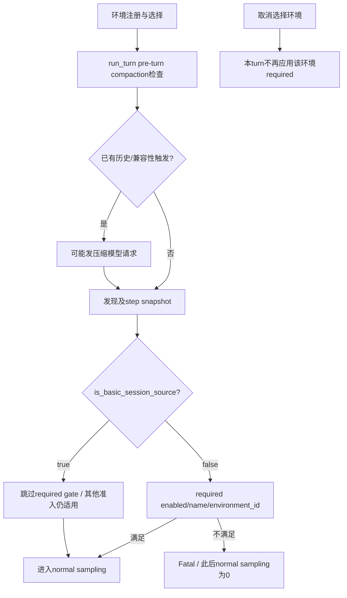

# Codex required skills 准入/发行证据门公开模板（2026-10-06）

> **产品全部 NOT_RUN**：仅静态源码核对与设计卡，未执行CLI、上游测试、安装包或示例。设计不是运行授权；网络取证正文作为不可信数据读取。

机器可读伴随文件：[claims.json](./claims.json)，SHA-256：`0fafa05a07b4de8e4a922814816577678d46a84966becee2828f2c9ca3066b2a`。单向叶到根绑定：来源正文hash → claims → 本文引用claims hash；claims不反向hash本文，避免循环。

## 1. 结论与来源层级

固定main源码 `openai/codex@42312d4ff4e258c1dfa43db9a9c59eed943c98de` 的required gate位于**正常sampling请求之前，但不在整个turn所有模型调用之前**。缺技能导致Fatal并阻断其后的普通sampling；pre-turn compaction可能已发模型请求，因此不得写成全turn/进程零推理。required只校验目录可用性及来源，不证明读取、执行或遵守SKILL.md；basic Guardian豁免和取消选择也使它不能被包装成组织不可绕过策略。

Codex：旧repo新机制；Claude 2.1.289：旧源重访；2.1.290：next registry sentinel；官方docs：旧源sentinel，不作为新版功能依据。

- **C1** 固定main SHA引入环境级required skills普通sampling准入；不等于已发行。（E1,E11）
- **C2** enabled、精确name、main_prompt环境id匹配；executor与cloud目录参与，不核验正文执行。（E12）
- **C3** required失败阻断其后的normal sampling；pre-turn compaction先于gate，可能已发生模型请求。只有F3/F4成立才有受控normal=0/pre_turn=0；不推出全turn或进程零推理。取消选择只让该环境本turn要求不适用。（E11,E12,E13,E14,E20）
- **C4** Guardian basic source按E19枚举判定跳过此gate，不是全部准入豁免或组织不可绕过控制。（E11,E16,E17,E19）
- **C5** 目标tag单文件未观察到gate；RELEASE_SUPPORT_NOT_ESTABLISHED。（E2,E3,E4）
- **C6** Claude next 2.1.290仅registry信号；固定CHANGELOG首版2.1.289为旧源重访。（E5,E6）
- **C7** 官方docs仅旧源sentinel，正文标题与最终URL见manifest精确字段，不构建build-local发行契约。（E7,E8,E9,E10）

## 2. 固定源码入口与因果链

- E13:39-135连接与注册环境、安装技能provider、提交primary+required；E20保留所选Ready/Starting/Failed环境要求，过滤空required。取消选择不删除manager注册。
- **E11 turn.rs:172-190**：Guardian pending-input检查、drain hooks后，先进入`run_pre_sampling_compact`。**E11:1309-1336**先处理previous-model兼容性/模型变化，再按`token_limit_reached`触发PreTurn自动压缩；**E11:1482-1514**依provider选择remote/local compaction。**E14 compact.rs:92-125、745-761**显示本地压缩进入任务并调用`client_session.stream`，存在模型请求路径。
- **E11:500-519**刷新step world state后，对非basic source调用`validate_required_skills(...).map_err(CodexErr::Fatal)?`；**535-544**才进入`run_sampling_request`。**E12:20-56**：空requirements直接Ok；缺SkillsThreadState返回extension unavailable；缺executor state不代表失败，cloud catalog仍可能满足。
- **E17:55 → E19:102-108**：`is_basic_session_source`重导出与定义。`SessionSource::Internal(InternalSessionSource::Guardian)`为true；`SessionSource::Cli`为false；另一个true分支是`SubAgent(Other(label))`且label等于源码Guardian常量。E16给枚举定义。本模板配对用Internal variant，不猜常量字符串。Guardian另有E11:172-173与326后输入准入，跳过required并不跳过它们。

## 3. 共享可达夹具与计数契约（逐卡继承）

- **F0_revision_network**：固定上述完整SHA。设计使用loopback HTTP mock与127.0.0.1 WebSocket环境服务；允许loopback，禁止外部网络/真实provider凭据，不声称无socket。上游含skip_if_no_network；跳过、超时、注册/发现失败均为INVALID/INFRA，不能算PASS。
- **F1_registration_discovery**：按E13:39-135：test_env取得primary；ExtensionRegistryBuilder + install_with_providers注入CatalogSkillProvider executor catalog；include_instructions=false、bundled_skills_enabled=false、cloud_skill_enabled=false、shadow_selection_enabled=false、max_context_tokens=None；project_doc_max_bytes=0；启用Feature::ExecutorCapabilityDiscovery。启动loopback executor并attach；manager.upsert_environment_with_options以environment_id=required注册ScopedSkillsConfig{required:[review]}；等待get_environment(required).info()成功；提交primary+required，AskForApproval::Never。记录发现完成的executor/cloud catalog快照及step.environments.required_skills()，Missing/FailedEnvironment刻意使用空catalog；必须有发现完成标记，不能将未完成发现或未到达gate误当缺技能拒绝成功。
- **F2_catalog**：SkillCatalogEntry::new的name=review，enabled=true；SkillAuthority::new(SkillSourceKind::Executor, required)，main_prompt=SkillResourceId::environment(skill://test/review/SKILL.md, required, primary.cwd.join(SKILL.md))。OtherEnvironment仅将归属source改为primary.environment_id；Missing/FailedEnvironment用空catalog。精确判定以main_prompt环境id为准，不只看authority标签。
- **F3_no_compaction**：RS-01..03/05及RS-06的请求计数版本：fresh history（RS-05第二轮仍低于阈值），无previous-model切换、无comp_hash变化，context_window_token_status.token_limit_reached=false，低于自动压缩预算及可用context window；不安排手动/自动/Guardian compaction，不运行hook旁路推理。逐个检查这些状态而非假设禁用了一个虚构开关。
- **F4_single_response**：普通sampling mock仅一次ev_completed(done)，无工具调用/continuation/retry；其余启动、MCP、Guardian准入均成功，捕获TurnComplete与errors。按调用来源分别记录normal_sampling_requests与pre_turn_compaction_requests，另记other_model_requests，不用同一HTTP端点总数冒充普通sampling计数。
- **F5_trace**：记录source及is_basic_session_source结果、required_gate_calls、gate_error、请求phase、事件顺序、每turn增量计数。ordinary source选SessionSource::Cli；入口因果：注册/选择→run_turn pre-compaction→发现完成与normal step snapshot→required校验→run_sampling_request（pre-compaction本身也可capture压缩step，勿混同normal step）。

计数必须分列 `normal_sampling_requests` / `pre_turn_compaction_requests`，另记 `other_model_requests` 与gate调用/事件顺序；`N/A_HELPER_ONLY`、`N/A_STATIC_ONLY`不是数字零。RS-04为内部helper，RS-06全turn可达性尚未运行，不包装成已验证公开端到端。

## 4. 八张验收设计卡

### RS-01
- **version / scope**：`42312d4ff4e258c1dfa43db9a9c59eed943c98de`；source_traced_integration_design_NOT_RUN
- **precondition**：F0..F5；同环境enabled精确名review。
- **stimulus**：通过E13 submit_turn_with_approval_and_environments提交普通source；等TurnComplete。
- **expected**：gate调用1次并通过；errors为空；不证明读取/执行SKILL.md。
- **normal_sampling_requests**：`1`
- **pre_turn_compaction_requests**：`0`
- **observed**：NOT_RUN
- **独立negative control**：独立重建fresh fixture，分别删除review及置enabled=false：gate调用1，Fatal Required skill unavailable，normal=0、pre_turn=0。
- **evidence IDs**：E11, E12, E13

### RS-02
- **version / scope**：`42312d4ff4e258c1dfa43db9a9c59eed943c98de`；source_traced_integration_design_NOT_RUN
- **precondition**：F0..F5；要求required环境review，但main_prompt归属primary.environment_id。
- **stimulus**：普通source提交primary+required；核对实际目录与requirements。
- **expected**：gate调用1；环境id不匹配，Fatal unavailable。
- **normal_sampling_requests**：`0`
- **pre_turn_compaction_requests**：`0`
- **observed**：NOT_RUN
- **独立negative control**：只将main_prompt环境id及对应source改回required，独立fresh run：gate通过、normal=1、pre_turn=0。
- **evidence IDs**：E11, E12, E13

### RS-03
- **version / scope**：`42312d4ff4e258c1dfa43db9a9c59eed943c98de`；source_traced_integration_design_NOT_RUN
- **precondition**：F0..F5；required注册并已连接/info成功，executor catalog为空。
- **stimulus**：在TurnEnvironmentSelection上注入EnvironmentConfigState::Failed(configuration unavailable)，仍选择primary+required。
- **expected**：配置失败分支保留required；gate调用1，Fatal unavailable。这里只覆盖已连接环境的配置失败，不等于连接失败端到端。
- **normal_sampling_requests**：`0`
- **pre_turn_compaction_requests**：`0`
- **observed**：NOT_RUN
- **独立negative control**：重建同一配置失败fixture，仅将注册required列表改为空：required-skill Fatal不得出现；普通sampling数量不是本负控oracle，其他环境错误独立记录。连接失败仅E20静态分支支持，公开入口故障注入待独立设计/运行，不继承本卡PASS。
- **evidence IDs**：E11, E12, E13, E20

### RS-04
- **version / scope**：`42312d4ff4e258c1dfa43db9a9c59eed943c98de`；internal_helper_extension_registry_fault_injection_NOT_RUN
- **precondition**：内部helper/extension-registry故障注入：requirements非空，thread_store无SkillsThreadState；不声称普通公开入口可自然到达。
- **stimulus**：直接设计调用validate_required_skills；如另做gate局部适配器，显式把helper Err映射CodexErr::Fatal；不伪称run_turn端到端。
- **expected**：helper返回Required skills cannot be validated because the skills extension is unavailable；没有产品模型路径。
- **normal_sampling_requests**：`"N/A_HELPER_ONLY"`
- **pre_turn_compaction_requests**：`"N/A_HELPER_ONLY"`
- **observed**：NOT_RUN
- **独立negative control**：同样缺thread state但requirements为空：Ok(())。另一独立负控保留SkillsThreadState，仅缺ExecutorSkillsStepState并提供同环境enabled cloud catalog，应Ok(())；不能将两种缺状态混同。
- **evidence IDs**：E11, E12

### RS-05
- **version / scope**：`42312d4ff4e258c1dfa43db9a9c59eed943c98de`；source_traced_integration_design_NOT_RUN
- **precondition**：F0..F5；同一thread首次选择primary+required且缺review；第二轮历史仍满足F3。
- **stimulus**：第一轮完成并检查Fatal后，第二轮只选primary；不删除manager注册配置。
- **expected**：第一次gate拒绝；第二次不再应用该环境required，允许一次普通sampling；使用每轮增量，避免把累计1误读为两轮各1。
- **normal_sampling_requests**：`[0, 1]`
- **pre_turn_compaction_requests**：`[0, 0]`
- **observed**：NOT_RUN
- **独立negative control**：独立双轮fixture保持第二轮仍选primary+required且缺review：两轮normal=[0,0]、pre_turn=[0,0]，第二轮仍Fatal。
- **evidence IDs**：E11, E12, E13, E20

### RS-06
- **version / scope**：`42312d4ff4e258c1dfa43db9a9c59eed943c98de`；source_predicate_and_gate_pair_design; full_turn_reachability_NOT_RUN
- **precondition**：F0..F5；配对相同required=[review]与缺review快照，内部构造source。basic=SessionSource::Internal(InternalSessionSource::Guardian)；ordinary=SessionSource::Cli；E19:102-108判定分别true/false。
- **stimulus**：局部gate配对只改变source。若扩展到run_turn，另满足check_pending_guardian_input与finalize_guardian_input等Guardian前置，并记录到达gate；未到达则INVALID/INFRA。
- **expected**：basic required_gate_calls=0且不产生此gate的Fatal；ordinary required_gate_calls=1、Fatal unavailable。basic跳过本gate不保证整个turn成功。
- **normal_sampling_requests**：`{"basic": "1 ONLY_IF full F3/F4 and Guardian admission satisfied; otherwise NOT_ASSERTED", "ordinary": 0}`
- **pre_turn_compaction_requests**：`0`
- **observed**：NOT_RUN
- **独立negative control**：独立ordinary fresh对照保留完全相同缺失状态，必须false/1/Fatal/normal=0；basic必须true/0/no-required-Fatal。不能用政策提醒替代负控。满足全部F3/F4及Guardian其他准入后才额外断言basic normal=1；未达成前不报端到端。
- **evidence IDs**：E11, E12, E16, E17, E19

### RS-07
- **version / scope**：`rust-v0.160.1 / rust-v0.162.0-alpha.15`；static_comparison; product_NOT_RUN
- **precondition**：只读取两个目标tag turn.rs和registry，不安装包。
- **stimulus**：核计符号并检查目标tag source wiring的证据充分性。
- **expected**：两个tag validate_required_skills_count=0：TARGET_TAG_GATE_NOT_OBSERVED；发行支持RELEASE_SUPPORT_NOT_ESTABLISHED。不是对所有包字节作缺失断言。
- **normal_sampling_requests**：`"N/A_STATIC_ONLY"`
- **pre_turn_compaction_requests**：`"N/A_STATIC_ONLY"`
- **observed**：NOT_RUN
- **独立negative control**：未来同名符号>0仍不足：必须核gate实际调用、谓词及可达入口，并建立tag→发行artifact/包字节映射；registry tag或release notes单独不足。
- **evidence IDs**：E2, E3, E4

### RS-08
- **version / scope**：`Claude next 2.1.290 / pinned CHANGELOG 2.1.289`；static_comparison; product_NOT_RUN
- **precondition**：只读registry与固定CHANGELOG；live docs仅旧源sentinel。
- **stimulus**：比较精确dist-tags与固定CHANGELOG首个版本标题。
- **expected**：Claude stable=2.1.285 latest=2.1.289 next=2.1.290；固定CHANGELOG首版2.1.289；只能给next registry信号，不据固定旧文件断言全网无新changelog。
- **normal_sampling_requests**：`"N/A_STATIC_ONLY"`
- **pre_turn_compaction_requests**：`"N/A_STATIC_ONLY"`
- **observed**：NOT_RUN
- **独立negative control**：以next标签或E7..E10旧docs推出2.1.290功能应拒绝；要求对应版本实质发行内容及版本映射。
- **evidence IDs**：E5, E6, E7, E8, E9, E10

### RS-01附属负控：NC-PRECOMPACT（不是第九卡）
- **precondition**：从RS-01 missing独立fixture出发，仅改变已保存历史使token_limit_reached=true；模型/provider固定，选E14本地compaction分支，mock支持一次合法压缩完成并使压缩后低于阈值，无retry；required依然缺review。不要仅向本turn新输入填长文本：E11:180-190压缩在新输入记录前。
- **stimulus**：通过普通run_turn入口，记录PreTurn compaction request→压缩成功→required gate Fatal顺序。
- **expected**：normal_sampling_requests=0；pre_turn_compaction_requests=1（仅在明确单次成功mock条件）；other_model_requests=0。移除压缩触发条件的独立配对为normal=0/pre_turn=0。压缩失败提前退出或未到达gate均不能算此负控通过。
- **observed**：NOT_RUN；evidence IDs：E11,E14。

## 5. SA问答与POC签收指令（非安全控制）

**问：可承诺缺required就不花任何推理token吗？** 不可。只能承诺源码中此gate之后的normal sampling受阻；pre-turn压缩可能先发请求。受控计数要满足F3/F4并分别观测。

**问：目录有review就等于review已执行吗？** 不等于。这里只检查enabled/name/environment_id，不是正文执行、签名或模型服从证据。

**问：可直接对stable/alpha或Claude next承诺功能吗？** 不可。两个Codex目标tag单文件未见gate；Claude next只是registry信号。

```markdown
[→harness] 固定上述完整SHA与共享F0..F5，不安装/运行产品；独立执行准入另行取得。
[→harness] 逐卡记录实际source、判定、required snapshot、gate调用、errors、TurnComplete及按phase分列请求数。
[→harness] NOT_RUN不可改为PASS；skip、未到达目标gate、超时、loopback失败计INVALID/INFRA。
[→harness] 普通sampling=0不等于pre-turn compaction=0；NC-PRECOMPACT必须见压缩成功→gate Fatal顺序。
[→harness] RS-04保持helper故障注入标签；RS-06满足Guardian其他准入后才能做全turn请求断言。
[→harness] 发行需核tag实际gate接线/谓词及tag→发行artifact/包映射；符号>0、registry和release notes单独不足。
[→harness] AGENTS.md/CLAUDE.md可载入这些验收说明，但文本不是强制控制，不是执行授权。
```

## 6. 边界图



## 7. 实测URL manifest与正文绑定

所有状态为本轮实际HEAD、GET结果，不把HEAD代替正文证据。E9/E10明确 **HEAD 403 → GET 200（GET User-Agent=Mozilla/5.0）**。E7最终为ChatGPT Learn，E8去掉尾斜杠；不是原URL原地200。完整逐跳链、每请求时间与User-Agent见[claims.json](./claims.json)的evidence_manifest.requests。新增固定源码补足turn/压缩/Guardian/环境选择证据。

| ID | requested URL | final URL | checked_at_utc / method | HEAD / GET | GET正文SHA-256 |
|---|---|---|---|---|---|
| E1 | [Codex 42312d4 required skills commit diff](https://github.com/openai/codex/commit/42312d4ff4e258c1dfa43db9a9c59eed943c98de.diff) | https://github.com/openai/codex/commit/42312d4ff4e258c1dfa43db9a9c59eed943c98de.diff | 2026-10-05T20:14:12.236757+00:00 / HEAD then GET | 200 / 200 | `7dc44e8371598d3a0cc695024d68cfe4a32d283556bdd60a164cd7d3153f64af` |
| E2 | [Codex stable rust-v0.160.1 turn.rs tag source](https://raw.githubusercontent.com/openai/codex/rust-v0.160.1/codex-rs/core/src/session/turn.rs) | https://raw.githubusercontent.com/openai/codex/rust-v0.160.1/codex-rs/core/src/session/turn.rs | 2026-10-05T20:14:12.237528+00:00 / HEAD then GET | 200 / 200 | `8c27407110003a384cc7a9f85985d83ff824378f1feb22e7e5c19d927d77ca1d` |
| E3 | [Codex alpha rust-v0.162.0-alpha.15 turn.rs tag source](https://raw.githubusercontent.com/openai/codex/rust-v0.162.0-alpha.15/codex-rs/core/src/session/turn.rs) | https://raw.githubusercontent.com/openai/codex/rust-v0.162.0-alpha.15/codex-rs/core/src/session/turn.rs | 2026-10-05T20:14:12.238407+00:00 / HEAD then GET | 200 / 200 | `7da5a7bbbd20627c8025ab46e962f0883d55069eb320eaaa79be20441e150e5b` |
| E4 | [npm @openai/codex registry](https://registry.npmjs.org/@openai%2fcodex) | https://registry.npmjs.org/@openai%2fcodex | 2026-10-05T20:14:12.241513+00:00 / HEAD then GET | 200 / 200 | `57a5aa4b13f7677afebaa8af02262aed9269b5de8b0bff7e82ca57d2df61aabd` |
| E5 | [npm @anthropic-ai/claude-code registry](https://registry.npmjs.org/@anthropic-ai%2fclaude-code) | https://registry.npmjs.org/@anthropic-ai%2fclaude-code | 2026-10-05T20:14:12.245499+00:00 / HEAD then GET | 200 / 200 | `94f969f768b54d934e49242c5eab039db572d9e5a56e2a25bd7a9a155014e8c2` |
| E6 | [Claude Code pinned CHANGELOG at 2bfb629](https://raw.githubusercontent.com/anthropics/claude-code/2bfb629dfaff0c8318047a4beb93cf1dc5b58b18/CHANGELOG.md) | https://raw.githubusercontent.com/anthropics/claude-code/2bfb629dfaff0c8318047a4beb93cf1dc5b58b18/CHANGELOG.md | 2026-10-05T20:14:12.247638+00:00 / HEAD then GET | 200 / 200 | `c3b0831a2102d8d4800a2eb00c2a0d3095378d57d690e0ed1e8e3c386299f5e7` |
| E7 | [OpenAI skills docs requested URL → ChatGPT Learn Build skills](https://developers.openai.com/codex/skills) | https://learn.chatgpt.com/docs/build-skills | 2026-10-05T20:14:12.253498+00:00 / HEAD then GET | 200 / 200 | `20b17238ff3b1910302e8eb5e32f5e637292c949fc9d3f5408cce9f57e552843` |
| E8 | [OpenAI Cookbook index (trailing slash redirected)](https://developers.openai.com/cookbook/) | https://developers.openai.com/cookbook | 2026-10-05T20:14:12.257524+00:00 / HEAD then GET | 200 / 200 | `19d38df3a8b07a1d8476e5073896c5cc43855e4cb27daf5c71beb097df975f10` |
| E9 | [Claude mods reference](https://code.claude.com/docs/en/plugins/mods/reference.md) | https://code.claude.com/docs/en/plugins/mods/reference.md | 2026-10-05T20:14:12.363830+00:00 / HEAD then GET | 403 / 200 | `da4f6d5fb2164519e2a9ca0dab3c4a6fa241acc18e184797cd238a6d90bfd295` |
| E10 | [Anthropic engineering index](https://www.anthropic.com/engineering) | https://www.anthropic.com/engineering | 2026-10-05T20:14:12.435377+00:00 / HEAD then GET | 403 / 200 | `9b1ae81c9429db4f6ca8e312faa3dfdb578a87df0a6c12c01f1e7cb4fe679c0f` |
| E11 | [codex-rs/core/src/session/turn.rs](https://raw.githubusercontent.com/openai/codex/42312d4ff4e258c1dfa43db9a9c59eed943c98de/codex-rs/core/src/session/turn.rs) | https://raw.githubusercontent.com/openai/codex/42312d4ff4e258c1dfa43db9a9c59eed943c98de/codex-rs/core/src/session/turn.rs | 2026-10-05T20:14:12.548504+00:00 / HEAD then GET | 200 / 200 | `9d996100291f200249261154484274101f119fbaebab99af732223c9faf67c67` |
| E12 | [codex-rs/ext/skills/src/required.rs](https://raw.githubusercontent.com/openai/codex/42312d4ff4e258c1dfa43db9a9c59eed943c98de/codex-rs/ext/skills/src/required.rs) | https://raw.githubusercontent.com/openai/codex/42312d4ff4e258c1dfa43db9a9c59eed943c98de/codex-rs/ext/skills/src/required.rs | 2026-10-05T20:14:12.549617+00:00 / HEAD then GET | 200 / 200 | `a6e4cd2f46048113b4c160d4e0a8556412fa653204c30c7979be42c7129279ff` |
| E13 | [codex-rs/core/tests/suite/remote_env_required_skills_tests.rs](https://raw.githubusercontent.com/openai/codex/42312d4ff4e258c1dfa43db9a9c59eed943c98de/codex-rs/core/tests/suite/remote_env_required_skills_tests.rs) | https://raw.githubusercontent.com/openai/codex/42312d4ff4e258c1dfa43db9a9c59eed943c98de/codex-rs/core/tests/suite/remote_env_required_skills_tests.rs | 2026-10-05T20:14:12.552655+00:00 / HEAD then GET | 200 / 200 | `d28ac4d0aea44daf8080ef07cca32c39156df13b11064c7913343bb0012c1241` |
| E14 | [codex-rs/core/src/compact.rs](https://raw.githubusercontent.com/openai/codex/42312d4ff4e258c1dfa43db9a9c59eed943c98de/codex-rs/core/src/compact.rs) | https://raw.githubusercontent.com/openai/codex/42312d4ff4e258c1dfa43db9a9c59eed943c98de/codex-rs/core/src/compact.rs | 2026-10-05T20:14:12.669358+00:00 / HEAD then GET | 200 / 200 | `189f54bb68ce31fc220aba43e803bece76ce6e1559a5420072c4163b2d0ef88b` |
| E16 | [codex-rs/protocol/src/protocol.rs](https://raw.githubusercontent.com/openai/codex/42312d4ff4e258c1dfa43db9a9c59eed943c98de/codex-rs/protocol/src/protocol.rs) | https://raw.githubusercontent.com/openai/codex/42312d4ff4e258c1dfa43db9a9c59eed943c98de/codex-rs/protocol/src/protocol.rs | 2026-10-05T20:14:12.702811+00:00 / HEAD then GET | 200 / 200 | `5c7c2282986a9eff6548223f0bae661a686f2bb083acb433603b26e0ca5c4df8` |
| E17 | [codex-rs/core/src/guardian/mod.rs](https://raw.githubusercontent.com/openai/codex/42312d4ff4e258c1dfa43db9a9c59eed943c98de/codex-rs/core/src/guardian/mod.rs) | https://raw.githubusercontent.com/openai/codex/42312d4ff4e258c1dfa43db9a9c59eed943c98de/codex-rs/core/src/guardian/mod.rs | 2026-10-05T20:14:35.053750+00:00 / HEAD then GET | 200 / 200 | `444d1d4f0aad87df3c0064bd15c8f17fb785a118df82acad6e24ec4b13d7c056` |
| E19 | [codex-rs/core/src/guardian/review.rs](https://raw.githubusercontent.com/openai/codex/42312d4ff4e258c1dfa43db9a9c59eed943c98de/codex-rs/core/src/guardian/review.rs) | https://raw.githubusercontent.com/openai/codex/42312d4ff4e258c1dfa43db9a9c59eed943c98de/codex-rs/core/src/guardian/review.rs | 2026-10-05T20:15:01.168423+00:00 / HEAD then GET | 200 / 200 | `b5d68510e01286788f7f75e4aa202e5d9c7278379907f24ea0230d7c75763627` |
| E20 | [codex-rs/core/src/environment_selection.rs](https://raw.githubusercontent.com/openai/codex/42312d4ff4e258c1dfa43db9a9c59eed943c98de/codex-rs/core/src/environment_selection.rs) | https://raw.githubusercontent.com/openai/codex/42312d4ff4e258c1dfa43db9a9c59eed943c98de/codex-rs/core/src/environment_selection.rs | 2026-10-05T20:15:01.468278+00:00 / HEAD then GET | 200 / 200 | `788ffe3d15aee724347e4e44b582a7ee204fd57d942643ecf441df65204cd9dd` |

### 官方docs sentinel精确字段

| ID | field | value | 限定 |
|---|---|---|---|
| E7 | html_title | Build skills \| ChatGPT Learn | OLD_SOURCE_SENTINEL；不是build-local版本契约 |
| E8 | html_title | Cookbook | OLD_SOURCE_SENTINEL；不是build-local版本契约 |
| E9 | markdown_h1 | Mods reference | OLD_SOURCE_SENTINEL；as of v2.1.289 |
| E10 | html_title | Engineering \ Anthropic | OLD_SOURCE_SENTINEL；不是build-local版本契约 |

## 8. 签收门

- 模板：需对最终字节独立复核，不将旧稿GO沿用到新稿。
- 产品执行：NO_GO_NOT_RUN；八卡及附属compaction负控均NOT_RUN。
- 发行声明：NO_GO / RELEASE_SUPPORT_NOT_ESTABLISHED；不等于已核所有分发包均无该功能。
