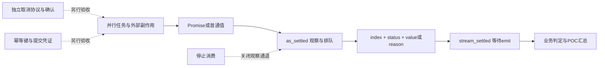

# Codex settlement：看见结果，不等于业务成功

**公开观察报告与15张验收卡｜2026-10-06**

这是完整固定`settled.js`的离线观察，不是手抄函数或产品认证。已执行**75/90个「版本×用例」组合**：基线15 PASS、2个有效KILL、2个INVALID、15个NOT_RUN，不能称全过。本次仅整理历史证据，未重跑。

逐卡配置、断言、六组状态及来源见 [observations.json](observations.json)，为去敏摘要，非原始日志或执行包。

## 一、先回答 SA 真正需要的问题

**一个分支失败，汇总还能继续吗？** 可以：C04观察到 `rejected + reason`，C06快失败无需等待慢分支。但汇总返回不等于业务成功，须另存业务判定、分支身份与原因。

**停止消费会取消其他任务吗？** C10的副作用计数仍为1。`return()`关闭观察通道，不是取消协议或回滚。

**每条观察一次，能承诺外部副作用exactly-once吗？** 不能。没有验证持久化去重或服务端幂等；C11回调串行也不证明生产者限流或队列有界。

**故意制造的失败为何不都算KILL？** 只有目标业务断言和完整、干净运行合同同时成立才计数。异常、非目标失败或缺失执行不能冒充有效检出。

## 二、结果账本：粒度必须分开

| 组 | PASS / FAIL / ERROR | 组结论 | 能支持的判断 |
|---|---|---|---|
| baseline | 15 / 0 / 0 | BASELINE_PASS | 固定环境下15条断言成立 |
| dropMapKeys | 14 / 1 / 0 | KILL | C03能检出Map键变成数字位置 |
| allRejectedAreFulfilled | 13 / 2 / 0 | KILL | C04/C06能检出拒绝被错标成功 |
| duplicateObservation | 5 / 10 / 0 | INVALID_INFRA | 非目标FAIL使固定合同不成立，不计KILL |
| emitNotAwaited | 13 / 1 / 1 | INVALID_INFRA | C11业务FAIL，但C13未处理拒绝ERROR使整组无效 |
| throwOnFirstRejection | 未执行15项 | NOT_RUN | 没有控制组运行结论 |

总计为 **60 PASS、14 FAIL、1 ERROR、15 NOT_RUN**，而不是产品通过率。两个 INVALID 是**组数**；剩余15是**未执行组合数**。

`duplicateObservation` 是同一回调双settle，不是双observer。C08的记录失败不证明then调用两次。该组有非目标FAIL，按固定合同为INVALID_INFRA，**不是Docker故障证据**。

`emitNotAwaited`：C11放行前出现enter0、enter1；C13报UnhandledRejection。故13 PASS、1 FAIL、1 ERROR只能归INVALID，不能计第三个KILL。其后控制组15项仍为NOT_RUN，不能按计划角色冒称已观察INVALID_CONTROL。

## 三、复用边界与共同前置 P0

- 固定源提交：`28a264fbc766a59f2b550b8318f88e4a4b8dffe1`；路径：`codex-rs/code-mode-runtime/src/runtime/settled.js`。
- Node **v22.22.2** 加载完整文件到受控 `node:vm` 上下文，显式共享宿主 Promise、Map、Object、Array、Error、TypeError。这里 VM 指 JavaScript 上下文；**vm不是安全沙箱**，也未覆盖不同 realm 的构造器语义。
- 每组合独立进程/容器；OS层离线、只读、无凭据、非特权和资源限额承担隔离。
- Deferred是手动完成的Promise，Barrier是闸门；用握手与事件序列而非耗时确认先后。
- **不是Codex CLI、stdio、gRPC或QuickJS完整运行**，没有真实业务副作用。
- 本文是验收规格，不提供缺文件命令或机器launcher、runtime binaries、原始内部日志。自行实现须重新验证，不能继承原结果。

## 四、15张验收卡

每卡均继承P0及上述固定提交。**Observed是历史运行；Negative中的新增对照若标NOT_RUN，就没有执行证据。** 使用“应失败”描述设计，不伪造运行结果。

### 身份、状态与输入契约

**C01｜空输入**
配置/前置：`as_settled([])`，消费到结束。Expected：零记录且结束。Observed：baseline PASS。Negative：伪造一条空结果应FAIL；此额外对照NOT_RUN。用途：空批次不伪造“成功任务”。

**C02｜数组身份**
配置/前置：输入已完成Promise `'a'` 与普通值 `7`。Expected：恰好两条fulfilled，index为0/1，value为a/7。Observed：baseline PASS；重复组FAIL。Negative：重复记录已被检出，但组结论INVALID。用途：POC汇总保留分支身份，不靠显示顺序配对。

**C03｜Map键保留**
配置/前置：同realm的Map，`k1→Promise(v1), k2→v2`。Expected：index为k1/k2。Observed：baseline PASS；dropMapKeys输出0/1，目标FAIL、组KILL。Negative：数字位置替代业务键，已有效检出。用途：按客户/区域/方案ID归档结果。

**C04｜拒绝是一条记录**
配置/前置：单个Promise拒绝 `Error('boom')`。Expected：index0、rejected、reason.message=boom，消费不因此抛出。Observed：baseline PASS；错标组目标FAIL并KILL。Negative：改成fulfilled已检出；直接throw变异NOT_RUN。用途：区分分支失败与汇总器故障。

**C09｜输入迭代器错误**
配置/前置：`Symbol.iterator` 同步抛 `iterable boom`。Expected：调用as_settled时同步捕获该错，不产生拒绝记录。Observed：baseline PASS。Negative：吞错应FAIL，额外对照NOT_RUN。用途：配置/输入错误不能伪装成工具返回值。

**C12｜emit类型校验**
配置/前置：`stream_settled([], null)`。Expected：即使空输入也报TypeError。Observed：baseline PASS。Negative：删除校验应FAIL，额外对照NOT_RUN。用途：空批次也检查接收端契约。

**C14｜普通值混合Promise**
配置/前置：输入 `'x'` 和已完成Promise `'y'`。Expected：index0/1分别fulfilled(x/y)。Observed：baseline PASS；重复组FAIL。Negative：重复输出违反精确列表；仅接受Promise的额外实现对照NOT_RUN。用途：允许缓存值与异步结果混合汇总。

### 快慢分支与消费背压

**C05｜快成功先到**
配置/前置：`[slow.promise, Promise('fast')]`，slow未释放；读首条后释放它。Expected：先index1 fast，再index0 slow。Observed：baseline PASS；重复组FAIL。Negative：改成按输入顺序等待应破坏首条条件，该额外对照NOT_RUN；超时不得算KILL。用途：避免慢分支阻塞已完成结果展示。

**C06｜快失败也先到**
配置/前置：slow未释放，第二项立即拒绝 `'fail'`；读首条再释放slow。Expected：先index1 rejected，再index0 fulfilled。Observed：baseline PASS；错标组目标FAIL并KILL。Negative：拒绝被标fulfilled已检出；直接throw控制NOT_RUN。用途：尽早报告局部失败而非等待全批。

**C07｜消费者忙时保留结果**
配置/前置：三个deferred；先挂起next，再依次完成A/B/C，读取三条。Expected：三条index排序为[0,1,2]。Observed：baseline PASS；重复组FAIL。Negative：重复输出使前三条身份不全，已观察。边界：本卡未断言最终无额外记录，不证明任意负载无丢失或队列有界。

**C11｜await消费者回调**
配置/前置：输入a/b；首个emit进入后等待gate；用entered握手和一个setImmediate回合观察，再释放。Expected：放行前仅enter0，结束为enter0→leave0→enter1→leave1。Observed：baseline PASS；去await时放行前已有enter0、enter1，C11 FAIL。Negative：已观察重叠，但C13 ERROR使该组INVALID，不计KILL。用途：证明回调背压，不承诺生产者限流。

**C13｜消费者异常归属**
配置/前置：async emit记录index，并在index0抛 `emit boom`。Expected：seen=[0]，调用方捕获emit boom。Observed：baseline PASS；去await组出现UnhandledRejection ERROR。Negative：丢失await链已观察为ERROR，不是业务FAIL。用途：把接收端失败与任务拒绝分别告警。

### 观察次数与副作用边界

**C08｜thenable只观察一次**
配置/前置：自定义thenable，then递增计数后resolve(ok)。Expected：一条index0 fulfilled(ok)，thenCalls=1。Observed：baseline PASS；重复组在记录断言FAIL。Negative：双settle已检出，但不是双then调用的证据。用途：观察层去重与输入执行次数必须分别计数。

**C10｜停止消费不等于取消**
配置/前置：slow上预注册effect++；先读first，再调用迭代器return，随后完成slow并推进微任务。Expected：effect=1。Observed：baseline PASS。Negative：把return当成effect=0与本卡实测相矛盾；没有运行真实取消API。用途：取消需求必须另有协议、确认和补偿。

**C15｜每输入一条观察**
配置/前置：`[1,2,Promise.reject('r')]`，消费到结束。Expected：总数3，index排序为[0,1,2]。Observed：baseline PASS；重复组FAIL。Negative：双settle破坏数量已观察，但整组INVALID；错标组在本卡PASS，因为本卡没有检查status。用途：用C04/C06补齐状态断言，不能把本地记录唯一性扩展成外部副作用幂等。

## 五、POC架构与签收建议

图中取消、幂等和业务判定是集成建议，不是已证实能力。POC分三表签收：观察表（键/status/reason）、业务表（成功条件/提交凭证）、取消表（请求/确认/残余工作/补偿）；第一表不能替代后两表。

本实验只支持固定单文件的局部语义及两种变异敏感性。补跑不得覆盖两个INVALID与15 NOT_RUN的历史。

## 六、来源、归属与完整性

源码归属 **OpenAI Codex，Copyright 2025 OpenAI**，仓库许可Apache-2.0。NOTICE另列Ratatui衍生代码MIT归属，不据此推断本文件属于该部分。另行分发代码须保留适用许可/NOTICE并标注修改；仓库许可不自动授权全部运行时二进制。

[固定源码](https://raw.githubusercontent.com/openai/codex/28a264fbc766a59f2b550b8318f88e4a4b8dffe1/codex-rs/code-mode-runtime/src/runtime/settled.js) SHA-256：`6b0d0b56aecf2101ca0d7f50b71d733430f703deb7bf3b71b54364c60cce4f65`。源码、LICENSE、NOTICE三个URL本次实际GET均200，最终URL未变；全部URL与hash见JSON的source.verified_gets。

先固定叶文件observations.json，其SHA-256为`18adcd24c14e518f1af7cefa51550bd9f558d90dca85e1912104d4f78bbe00b1`，再固定本文并于交付摘要列根hash，不自引用。**hash只检查字节一致性，不认证作者、签名或执行真实性。**
