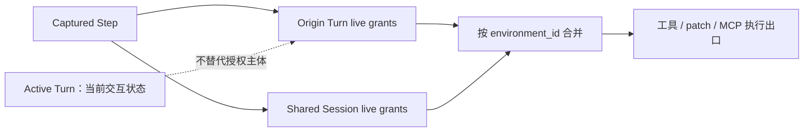
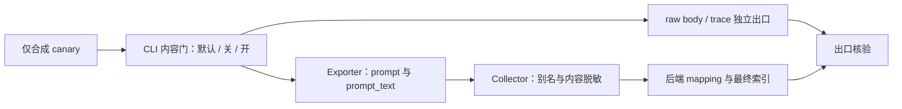

# Coding Agent：来源授权与遥测内容门验收卡

日期：2026-10-02｜适用：SA 技术问答、升级 PoC 与架构验收。
本文只讨论两个变化：Codex 跨轮授权来源、Claude Code 遥测字段副本。所有运行验收均为 **NOT_RUN**；源码与发行说明不是运行通过凭证。

## 1. Codex：绑定来源 turn，但授权状态不是冻结快照

**证据与版本边界。** [提交差异][C1] `1f52d407041d933e490ca3033729bce6319d07fa` 引入来源 turn 授权接线。捕获的 `TurnContext` 持有来源 turn 的 live grants 与实时共享的 session grants，按 `environment_id` 读取、合并当前授权；不能用当前 active turn 代替授权主体，也不能称为捕获时冻结整个权限快照。[固定源码][C2] 可定位该结构。
**stable 0.159.3 不含该新增实现。** [该版本源码][C3] 不含新增授权字段与方法；其对应提交为 `01fc69f4026735edfdf6789820549727a4867b11`。本文不把 main 机制归入该 stable，也未证明任何 alpha 二进制包含它。

关键细节：迟到权限响应通过 `entry.turn_context` 回写来源 turn；session scope 写共享存储。`write_stdin` 在拿到 interaction lock 后读取来源 turn 的 strict 状态，因此排队期间的启用可见。strict 在同一 turn 内以 `|=` 累积；review 共享 session grants，但新建 turn 局部状态。[C1]
这里的“live”不代表已证明撤权语义或两份存储的原子快照；无相关运行证据，不作保证。

### 通用记录契约

每次卡片执行独立填写 `scope`、`expected_decision`、`observed`，不得把期望复制成结果。
Codex 收据应含：版本/提交、origin_turn_id、active_turn_id、environment_id、grant_scope、审批归属、最终决策与文件/终端效果。
下列 ALLOW 表示在其余 sandbox、审批与环境条件均满足时可使用指定 grant；REQUIRE_APPROVAL 表示不能仅凭不属于该主体的 grant 放行，并非承诺某个固定 UI。
只用隔离沙箱、合成文件与测试终端；正控用于证明链路有效，负控用于区分错误实现。没有效果收据或测试被跳过，不记 PASS。

### C-01｜旧 cell 保留本轮授权，新轮不得继承
- 前置：A 在环境 E 获得仅 turn scope 的测试文件写权并挂起；无同等 session grant；B 启动且无该写权，基础策略要求审批。
- scope：`origin=A/B; active=B; environment=E; grant_scope=Turn(A)`。
- 动作：用 barrier 确认 B 工具已开始，再恢复 A；A、B 分别请求同类写入，不批准 B 的新增请求。
- expected_decision：A=ALLOW；B=REQUIRE_APPROVAL，拒批后无写入。
- 可观察断言：A 效果收据存在；B 无未批准效果；两次决策保留各自 origin 与审批归属。
- 正控：A 在切轮前同类写入成功；负控：B 无授权写入不能借 A 的 grant 成功。
- observed：NOT_RUN；未采集审批与文件收据。

### C-02｜session 授权必须对已捕获的旧 cell 实时可见
- 前置：A 已捕获 step 并挂起；A、B 均无目标权限；环境 E 与 E2 的测试资源均受限且彼此隔离。
- scope：`origin=A/B; active=B; environment=E/E2; grant_scope=Session(E)`。
- 动作：B 开始后批准 E 的 session 写权，再让 A、B 在 E 尝试写入，并对 E2 作同类请求。
- expected_decision：E 上 A、B=ALLOW；E2=REQUIRE_APPROVAL，不因 E 的 grant 自动放行。
- 可观察断言：grant 生效晚于 A 捕获 step，但 A 在 E 的效果仍成功；E2 没有越环境效果。
- 正控：B 使用新 session grant 成功；负控：未批准前 A 不能写，E2 也不应继承。
- observed：NOT_RUN；未采集时间顺序与环境隔离收据。

### C-03｜新轮开始后，旧 cell 的迟到批准仍归来源 turn
- 前置：A 的旧 cell 尚存且无目标写权；B 已成为 active turn；session 无等价授权。
- scope：`origin=A; active=B; environment=E; grant_scope=Turn(A)`。
- 动作：让 A 的旧 cell 此时请求权限；批准非空 turn grant，再分别由 A、B 请求目标写入。
- expected_decision：批准落到 A；A=ALLOW；B=REQUIRE_APPROVAL。
- 可观察断言：请求、响应、grant 存储归属与效果均关联 A；不因响应处理时 active=B 而赋权 B。
- 正控：同轮立即批准能被来源 A 使用；负控：B 不得借迟到批准执行。
- observed：NOT_RUN；未采集响应关联与效果收据。

### C-04｜排队 stdin 必须观察等待期间开启的 strict
- 前置：受控终端由 A 创建；占住 interaction lock；A 的 strict 初始关闭；允许使用内部状态测试夹具。
- scope：`origin=A; active=B; environment=E; grant_scope=Turn(A); strict=false→true`。
- 动作：排队含 NUL 的测试 stdin；等待期间在 A 启用 strict，再释放锁；另验证后续 false 不清除已启用状态。
- expected_decision：排队输入经 strict 检查返回 `StdinApproval Rejected`，理由含 NUL；strict 保持 true。
- 可观察断言：strict 读取发生在取得锁之后；记录拒绝与终端无该输入效果。上游同类测试有 sandbox 跳过条件。
- 正控：合规普通输入通过受控链路；负控：含 NUL 输入被拒，且不能仅切换 B 的 strict 代替 A 的状态。
- observed：NOT_RUN；夹具、sandbox 条件与终端效果未验证。

### C-05｜review 共享 session，不继承 turn 局部状态
- 前置：A 有 turn 写权 T、strict=true；session 在 E 有另一个权限 S；创建 review context。
- scope：`origin=review(A); environment=E; grant_scope=Session(S)/Turn(A,T)`。
- 动作：分别读取 review 的 S、T 与 strict 状态，并对受控资源请求访问。
- expected_decision：review 可读取共享 S；不能凭 A 的 T 放行；局部 strict 不直接继承 A。
- 可观察断言：review 的 session grant 引用共享，turn grant 存储新建；访问 T 仍需自身适用的批准。
- 正控：review 使用 S；负控：review 不得自动使用 T，也不得将未继承 strict 解读成绕过所有审批。
- observed：NOT_RUN；未采集 context 状态与审批收据。

### C-06｜空外部授权响应不能冒充内部 strict 设置
- 前置：来源 A 无目标授权且 strict=false；外部权限响应与内部测试辅助调用可分开观测。
- scope：`origin=A; environment=E; grant_scope=Turn; permissions=empty`。
- 动作：发送 permissions 为空而 strict 标志为 true 的外部响应；另用隔离对照发送非空、合法批准。
- expected_decision：空响应提前返回，不新增 grant、不靠该响应开启 strict；非空合法响应按来源记录。
- 可观察断言：分别检查权限存储与 strict 状态，不将内部 `record_granted_permissions` 的测试调用当外部协议保证。
- 正控：非空合法批准被记录；负控：空响应既不产生写权，也不产生预期外的 strict 状态变更。
- observed：NOT_RUN；未执行外部协议或内部状态测试。

## 2. Claude Code：prompt_text 副本要求同步脱敏规则

**发行事实。** [v2.1.287 release][L1] 与[固定 changelog][L2] 说明：OpenTelemetry `user_prompt` 事件新增 `prompt_text`，它是 `prompt` 的副本，用于会嵌套 dotted keys 的后端；凡删除或掩码 `prompt` 的地方，也应处理该副本。
**缺口是字段级脱敏契约，不是已证实的默认泄漏。** 已记录的[监控文档快照][L3] 仍描述 `prompt` 默认脱敏，未出现 `prompt_text`，专题文档尚未同步。新字段依据是 release，不是声称 monitoring 文档已经更新。
文档中的 `OTEL_LOG_USER_PROMPTS` 默认 disabled；发行说明未展示副本内部 gate 实现，不能据此断言默认上传明文，也不能保证所有 exporter 都正确执行同一内容门。
风险条件：客户主动开启内容日志，旧管道只删/掩码 `prompt`，升级后同内容副本可能留存。assistant response 开关回退与 raw API bodies 等独立出口也要单独验收，不能由删一个字段替代。

统一约束：只用非敏感标记 `SYNTHETIC_CANARY_PROMPT_A`；隔离采集端、索引与访问权限。记录 CLI 版本、有效配置、exporter、Collector 规则版本、后端 mapping 和采集窗口。
`expected_decision` 是部署验收策略，不是未验证的产品保证；`observed` 要分别填 exporter、Collector 后与最终后端证据。没有事件不等于成功脱敏，必须用非正文元数据证明链路可达。

### L-01｜默认内容门：不预设副本的默认行为
- 前置：2.1.287 隔离环境，遥测链路开启；用户正文开关未设置，记录配置优先级；不额外开启正文旁路。
- scope：`event=user_prompt; gate=default; fields=prompt,prompt_text; sinks=exporter/backend`。
- 动作：提交合成 canary，检查原始字段、别名及后端映射后的可检索内容。
- expected_decision：默认策略要求正文被抑制或脱敏，两个字段及其映射均不应保留可恢复 canary。
- 可观察断言：有相应事件或关联元数据收据，但无 canary 正文；字段缺失与掩码分别记录，不能混写。
- 正控：关联 ID 或 prompt_length 证明事件到达；负控：隔离检测样本含 canary 时检索必须命中。
- observed：NOT_RUN；未证明默认副本 gate 的运行行为。

### L-02｜显式关闭：检查有效配置，而不只看配置文件
- 前置：同一隔离链路，显式设置 `OTEL_LOG_USER_PROMPTS=0`；记录 assistant response、raw body 与 trace 的有效设置。
- scope：`gate=explicit_off; fields=prompt,prompt_text; sinks=exporter/backend`；独立旁路另由 L-04 验收。
- 动作：重启至配置生效后提交 canary，核对各处理阶段与最终索引。
- expected_decision：用户 prompt 事件正文不可恢复；显式关闭不被旧配置或副本字段绕过。
- 可观察断言：两字段与映射别名均无 canary；不把此结论外推成所有独立正文出口已关闭。
- 正控：非正文事件可达；负控：隔离的显式开启对照应能捕获合成正文，否则无法验证内容门差异。
- observed：NOT_RUN；配置优先级与 exporter 行为未验证。

### L-03｜受控开启：旧单字段规则与双字段规则对照
- 前置：允许在隔离测试端采集合成正文；显式开启用户 prompt 日志；准备仅处理 prompt 的旧规则和同时处理副本的新规则。
- scope：`gate=explicit_on; fields=prompt,prompt_text; mapping=flat/nested; sinks=collector/backend`。
- 动作：记录脱敏前事件，分别通过两套规则；在实际后端检查 flat/nested 映射、最终索引与可用归档。
- expected_decision：新规则使两份正文均不可恢复；旧规则若留下副本，应阻止该配置通过升级验收。
- 可观察断言：先确认实际事件是否含副本，再检查两规则差异；只看 Collector 入口 JSON 不足以判通过。
- 正控：隔离脱敏前样本可检出 canary；负控：双字段合成夹具经过旧单字段规则应留下副本，用于验证检测器。
- observed：NOT_RUN；未确认实际 exporter 字段形态、后端 mapping 或新规则有效性。

### L-04｜raw body / trace 旁路：主事件脱敏不是全出口保证
- 前置：主事件双字段规则就绪；独立列举 raw API bodies、详细 trace、assistant response 的目的端与开关；逐项隔离启用。
- scope：`gate=per_outlet; content=user/assistant/raw/trace; sinks=all_configured_destinations`。
- 动作：逐项切换出口并提交 canary，检查直出、归档与最终索引；未配置的出口明确记录不适用及依据。
- expected_decision：生产验收要求正文出口关闭或受等效脱敏控制；任何未获准的可恢复 canary 都阻断验收。
- 可观察断言：主事件无 canary 时仍独立核对各出口；保留必要 prompt_length 与关联 ID，不保留测试正文。
- 正控：受控开启的出口能检测到合成正文或对应注入夹具；负控：关闭/脱敏后的同一路径无正文残留。
- observed：NOT_RUN；出口清单、保留策略与端到端脱敏均未验证。

## 策略对比与 SA 落点

| 策略 | Codex 授权后果 | Claude 遥测后果 | 取舍 |
|---|---|---|---|
| 依赖当前表象 | 用 active turn 决定旧 cell 权限，可能错配主体 | 只删旧字段 prompt，可能遗漏副本 | 不宜作为验收基线 |
| 固定快照/固定字段集 | 冻结捕获时授权，遗漏后续合法 session/来源更新 | 同时处理已知双字段，但未来别名仍需维护 | 易复现，但覆盖有限 |
| 来源绑定 live grant / 语义内容多出口验收 | 区分 origin 与 session，并核验环境和迟到响应 | 内容门、别名、mapping 与旁路分别核验 | 推荐验收方向；实施与运行结果仍需证据 |

**SA 问：后台任务会借用下一轮更高权限吗？** 答：该 Codex 提交把授权读取绑定来源 turn，并保留共享 session 授权；session 扩权对旧任务可见是作用域语义，不等于误借 B 的 turn grant。先确认交付版本，再用 C-01～C-03 给出审批与效果收据；不能承诺 stable 0.159.3 已具备此实现。
**SA 问：升级 Claude 后会默认泄漏 prompt 吗？** 答：没有这样的证据。发行说明新增同内容副本，已开启内容采集且只处理旧字段的部署应复验。以 L-01～L-04 区分默认、显式关闭、受控开启与独立旁路，不拿配置截图替代最终索引证据。
架构交付物应分别是“授权主体—环境—作用域—效果”关联表与“内容门—字段别名—脱敏位置—目的端”清单。云观测后端接线属于部署设计，不是本文已验证集成。

## 从设计卡进入真实执行的前置门

- Codex先固定实际build及测试入口，按固定源码对应测试核验 `WriteStdinApproval`、`RequestPermissionsTool`、`CodeModeOnly` 及approval/sandbox组合，不将这些名称当成通用用户配置键。C-04须证明barrier已到达且queued仍Pending；条件不足记BLOCKED/SKIP，没捕获目标时序记INCONCLUSIVE，不能PASS。
- 遥测每个出口使用独立可确认的合成正文：user、assistant、raw body与trace不能假定共享同一canary。分别记录检测器夹具结果与真实CLI内容门结果；夹具PASS不能替代产品门PASS。采集开始前约定flush/索引水位及最长查询窗口；窗口未完成或无可靠到达正控即INCONCLUSIVE，不能凭查不到内容通过。测试后保留隔离数据清理收据。
- 监控文档快照采集于2026-10-02，原始正文SHA-256 `aa12cfdf0b859a3b7a1ec2f598fcade2886cbcc3fce179196207114da8c73e13`，后续正文可能变化；stable tag解析到commit `01fc69f4026735edfdf6789820549727a4867b11`。来源turn/review/strict定位为固定源码turn_context.rs 388–509行；这些定位降低复核成本，hash本身不证明可信或当前租户支持。

## 证据边界与公开来源

本文是待执行验收设计，不是生产安全认证。未安装或运行产品、未执行上游测试、未验证 Azure/OTel 端到端；无真实密钥或用户正文。源码中锁 poison 使用 expect 失败，不据此声称完整系统 fail-closed；宿主可用性、撤权与竞态覆盖仍待专门测试。
引用对应已记录资料快照；可变文档后续可能更新。源码提交、发行正文、包版本与运行收据是不同证据层，不能互相替代。

[C1]: https://github.com/openai/codex/commit/1f52d407041d933e490ca3033729bce6319d07fa.diff
[C2]: https://raw.githubusercontent.com/openai/codex/1f52d407041d933e490ca3033729bce6319d07fa/codex-rs/core/src/session/turn_context.rs
[C3]: https://raw.githubusercontent.com/openai/codex/rust-v0.159.3/codex-rs/core/src/session/turn_context.rs
[L1]: https://api.github.com/repos/anthropics/claude-code/releases/tags/v2.1.287
[L2]: https://raw.githubusercontent.com/anthropics/claude-code/52c76441cae91f6891e4712306bffb057ff6fec5/CHANGELOG.md
[L3]: https://code.claude.com/docs/en/monitoring-usage.md
