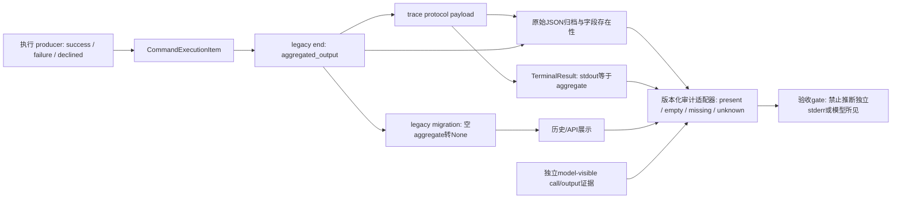
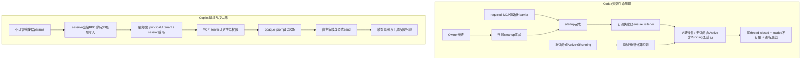

# 编程代理升级的协议验收模板：输出真实性、线程回收与会话绑定

> 协议验收模板｜研究日 2026-10-03｜静态源码审阅，不是产品认证。所有真实 CLI、SDK runtime、WebSocket host、MCP 进程实验均 **NOT_RUN**；下文输入/输出是设计例，不是运行日志。协议源码引用固定到上游 SHA。

## 一、适用范围与结论

本模板回答三个采购/升级验收问题：**日志还代表原来的信息吗？连接断开后资源真的释放了吗？用户参数能改变绑定会话吗？**

固定比较基线（不是 npm/CLI 发行版本承诺）：

| 轨道 | 新快照 | 直接 parent |
|---|---|---|
| Codex 输出 | `c5d242fa7907bff1b7a7e26e95febc548c0a6963` | `d61c7a824f951abfb2133ed8aebefaed651156d4` |
| Codex 生命周期 | `1ab8c6ef28a8261aaddb528dd3875124acd1c91e` | `50b4c5e58c1b89f3d1b74155cc1cc1716c2be208` |
| Copilot SDK TypeScript | `9b28c9467ab91a641cbef3fe8e4c706122e8ed8c` | `19e9a4b9c620d1032110cb6739961c4c1a651278` |

两条 Codex 轨道各对自身 parent；**不把两个 parent 当作同一个整体旧版本**。涉及文件已下载完整文件并核关键 producer、序列化、consumer、测试上下文，而不只是看 diff。Copilot 仅深入 Node/TypeScript 会话绑定及 MCP prompts；不声称对该提交其他语言、CI、OAuth 的全部变更完成审计。

### 已有源码依据的三个发现

1. **输出的字段可解析，不等于语义兼容。** `CommandExecutionItem` 与 `ExecCommandEndEvent` 移除独立 stdout/stderr/formatted_output，保留 aggregate。trace 的协议响应 consumer 把 aggregate 填入名为 `TerminalResult.stdout` 的字段，stderr 置空、formatted_output 置 None。因此该 stdout 不再保证“只来自 stdout”，stderr 空也不能证明没有错误流。底层 delta 仍有流标记，不是所有执行接口删除双流。[S1–S5]
2. **修的是回收 listener 缺口，不是承诺立即取消。** required MCP 启动跨过 owner connection cleanup 后，订阅失败不再直接跳过 listener；仍确保 listener，然后返回 ConnectionClosed。无订阅者、ThreadStatus 非 Active、AgentStatus 非 Running 及配置延迟是回收的必要条件，不是立即卸载的充分条件。即使 ThreadStatus 非 Active，底层 agent 仍 Running 时也会记录活动并重置非活动计时；重订阅、Active、Running、closing/generation 与运行实例身份保护须分别验收。[S6–S8、S21]
3. **绑定优先级覆盖所有该生成器的 session 出站 RPC 分支，不只新 prompts。** 有参数时绑定 ID 最后写入；无参数只发送绑定 ID。public/internal 与递归子组共用 emitGroup；global 出站及 server→client handler registration 是另一条路径。`rpc.send` 与高层 `session.send` 要分开：后者前后均显式选字段，未直接 spread 用户 options，此次回归测试针对生成 RPC，不能宣称高层 send 以前也有同样覆盖问题。服务端鉴权更是独立责任。[S9–S12]

## 二、推荐验收架构

### 图 1：保留原始事实，再做有损投影

图示仅限定所审 **agent tool 的 protocol trace 链**，不承诺每个 end 都生成该 trace。`ExecCommandSource::UserShell` 不生成相同的 tool-runtime trace 边界；dispatch-only 的 direct WriteStdin、code-mode 与 error 投影是另外的路径，不能套用图中 `formatted_output=None` 的结论。[S3–S4]



### 图 2：两个控制平面，不相互替代



Codex 图中的条件不保证立刻卸载：closing 锁、listener generation 与 `remove_thread_if_matches` 的运行实例身份保护仍须分层检查。图中不是将 Copilot server 画成已审计实现；它是**必须独立验收的控制点**。取得 prompt 不等于允许执行 prompt，更不等于允许其要求的工具动作。

## 三、事件 schema 与兼容矩阵

以下为源码推导的预期行为；Serde/真实 replay **NOT_RUN**。`missing` 指字段不存在，`empty` 指存在且为空字符串，`null` 是显式 JSON null，`unknown` 是适配器无法证明原始事实。不要把三者统一归一为成功或空输出。

| 输入 → consumer | 可解析/投影预期 | 信息损失与验收要求 |
|---|---|---|
| 旧完整 ExecCommandEnd → 新核心类型 | aggregate 存在时保留；被删字段不参与新类型 | 新类型无 deny_unknown_fields 标记；旧字段不成为新协议保证。必须独立保存 raw JSON，否则重序列化丢掉旧双流/formatted |
| 旧 end 只有 stdout/stderr/formatted、无 aggregate → 新核心/trace协议 consumer | `#[serde(default)]` 把缺 aggregate 变成 `""` | 旧文本不自动拼成 aggregate；新 trace 可变成 stdout=""、stderr=""。可解析但**有损**，标 `output_presence=missing`、`stream_provenance=unknown` |
| 新 end → 旧核心 ExecCommandEnd 或旧 trace 协议 consumer | 旧 stdout/stderr/formatted 是必填 String，预计缺字段报错 | 不能用“JSON 多余字段通常可忽略”推定双向兼容；WriteStdin fallback另测，不承诺可救回 |
| 旧 CommandExecutionItem → 新 item | aggregate 为 Option；缺失得到 None | 旧 stdout/stderr 是可选字段，但删除后仍不可还原；不要为“兼容”伪造 Some("") |
| 新 item → 旧 item | 被移除的旧字段为 default Option，预计能解析为 None | 结构宽容不代表旧 UI/报表语义正确；逐个 consumer 验证 |
| 新 end aggregate=`""` → migration → item | migration 用非空条件产生 Option，所以变 None | 显式空与原来缺字段在投影后合并；必须在反序列化之前留 presence bitmap |
| aggregate=`null` → 新核心/trace String | default 只处理缺字段，不把 null 变空；预计类型错误 | 单列 negative case；不要让宽松 JSON adapter掩盖错误 |
| 新 trace aggregate 有值 → TerminalResult | stdout=aggregate；stderr=""；formatted_output=None | `stdout` 在此是兼容槽位，不是物理流证明；不能根据 stderr 空判断成功 |
| completion 的 interaction_input | 当前 producer 与 legacy migration 写 None | 不等于 begin、dispatch invocation、其他存储全无 stdin；从合法关联源获取，否则 unknown |
| dispatch-only WriteStdin → terminal projection | direct/code-mode/error 各有独立投影，可保留 formatted | 不把协议路径的 formatted=None 推广到所有 trace。code-mode值也不自动等于模型所见 |
| status/exit_code 缺失或矛盾 | trace 的 exit_code必填；状态来自生命周期，不能仅看文字 | 宿主策略将缺少/矛盾结果隔离；declined与非零退出分别分类 |
| completed item缺exit_code → legacy end桥接 | `as_legacy_end_event` 对exit_code用unwrap_or_default，可能投影为0；aggregate缺失也投影为空 | 不把桥接补出的0当作原始进程成功证据。InProgress不生成end；其他状态仍保留，故status与presence必须一起检查 [S14] |
| Copilot parent → 新 MCP prompts 方法 | parent未提供同样生成入口 | 标 capability absent/unsupported，禁止用空列表冒充成功 |
| Copilot session RPC params含 foreign ID | 新出站覆盖为 bound ID，parent有参分支反序 | 成功只证明客户端 dispatch绑定，不证明server跨租户隔离 |
| `mcp.prompts.list_changed` → 宿主缓存 | 事件携带 serverName；通知后重读列表 | 缓存键至少含session与server；事件不是新列表，也不是执行许可；未知事件保留或显式忽略并可观测 |

**重点链条**：缺 aggregate → default 空 → migration None／trace空字符串。它把“未提供”与“确实没有输出”压扁；测试如果只断言能 deserialize，会把审计丢失误判为兼容成功。[S2–S5]

### 建议的审计 envelope（本模板自定义，不冒充厂商协议）

| 字段 | 最低要求 |
|---|---|
| `contract_version`, `source_build`, `source_layer` | 将 core end、turn item、trace、history/API 分层标识；未知 build 不推定新版 |
| `raw_ref`, `present_fields` | 指向访问受控原始证据，记录解析前字段存在性；不记录真实秘密 |
| `thread_id`, `call_id`, `process_id`, `request_id` | 各自语义独立；关联不到时不拼凑；PID要防复用 |
| `output.text`, `output.presence`, `output.provenance` | text可null；presence为missing/empty/present；provenance为aggregate/separate/unknown |
| `model_visible_ref`, `stdin_ref` | 缺证据用null及unknown原因，不能从aggregate倒推 |
| `status`, `exit_code`, `observations` | 业务状态与进程返回码分开；资源四层oracle分别存 |
| `verification` | `NOT_RUN` / `PASS` / `FAIL` / `INCONCLUSIVE` / `NOT_APPLICABLE`，状态不得跨层继承 |

原始JSON可以含敏感输出：访问控制、脱敏副本、保留期限和删除策略要随验收批准；“留 raw”不是无期限收集用户 stdin 的理由。

## 四、15 张实用 POC 卡

所有卡目前 **NOT_RUN**。共同前置：固定 build和consumer hash、无生产凭据、独立测试目录、fake MCP/mock model、有限超时与finally清场。每卡保存 input/raw/projection/assertions 四份材料。下述“通过”均指未来运行时判据，不是本轮结果。

| 卡 | 刺激与操作设计 | 独立 oracle / 通过要求 | 负控与证据 |
|---|---|---|---|
| P01 双流来源 | 在所审agent tool protocol路径用合成 OUT_CANARY、ERR_CANARY 做stdout-only/stderr-only/mixed | aggregate包含被捕获标记；适用的trace stdout标注aggregate，不能宣称stderr-only消失 | 保存delta、end及适用trace；UserShell不要求相同trace边界。反转写入顺序不推导跨流全序；stderr空不代表无stderr |
| P02 default丢失 | 旧合法end保留双流、删aggregate；另设aggregate=""/null | missing被标unknown且raw双流仍可查；null触发类型负控 | 空输出与缺输出在审计envelope必须不同；记录核心、trace和migration各投影 |
| P03 双向replay | 前后end/item分别交叉送前后consumer | 验证上表的可解析性与字段损失，不能只看反序列化返回值 | 新end→旧core预期缺字段失败；item的Option兼容单独断言 |
| P04 outcome分类 | completed/0、failed/非零、declined/-1、status与exit冲突 | 用status和exit联合分类；declined不冒充执行失败，冲突隔离 | 将输出文本改成“success”不能改变失败；真实side effect必须另外观察 |
| P05 长输出与输入溯源 | 超过截断阈值合成文本、一次write_stdin；保留begin/invocation | aggregate与model-visible各有引用；completion无stdin不生成假stdin | 缺模型项/缺调用项标unknown；不能仅凭formatted移除断言全部审计输入丢失 |
| P06 trace join与分支 | 所审agent tool protocol exec、dispatch direct WriteStdin、code-mode及error分别验；在适用路径制造begin/end PID不同 | 原始consumer对PID变更报错；模型项通过call关联；protocol与各dispatch投影分离 | UserShell不要求相同trace边界；适用路径丢response payload不得伪造成功结果；operation完成不推出terminal session关闭 |
| P07 startup断连竞态 | required MCP初始化barrier关闭→确认PID活→owner cleanup完成→放开barrier | 同thread的start内部response与closed；observer loaded查询不含该thread；Unix进程退出 | 上游为进程内MessageProcessor harness而非socket E2E；未证明交错命中即INCONCLUSIVE；内部response可先后乱序，不能称断连客户端收到了 |
| P08 留存控制组 | owner仍活／另一订阅者仍活／ThreadStatus仍Active／ThreadStatus非Active但AgentStatus仍Running各一组 | Active与Running是两个独立负控；Running应记录活动并重置非活动计时。无订阅、非Active且非Running后按活动记录计算延迟 | 不能仅固定sleep判正确；记录两种status、subscriber与计时变化，以及listener generation；仍须通过closing及运行实例身份保护 |
| P09 重订阅与closing | 在延迟内重订阅；卸载已pending时再attach；重复ensure listener | 不重复listener；已closing显式拒绝/retry；不会卸掉新generation资源；单列remove_thread_if_matches运行实例身份保护 | 关闭通知、registry、process分开；是否恢复成功由实际路径决定，不许假定 |
| P10 启动失败与finally | fake MCP初始化失败/超时；在任一oracle前注入harness断言失败 | barrier释放、RPC gate有界drain、thread清理、owned process收割均有结果 | 非Unix进程oracle标NOT_APPLICABLE，不把PID检查缺失计PASS；不杀无归属进程 |
| P11 生成器全scope | public/internal×嵌套×有必需/可选/无参数×global的合成schema；静态输出审阅 | 所有session有参模板绑定最后写入；无参仅bound ID；global不注入session | mutation反转spread顺序必须被识别；真实codegen执行未做，固定生成器与产物见S9–S10 |
| P12 send/prompts绑定 | fake MessageConnection记录rpc.send、prompts.list/get，params加foreign ID | 三条出站均bound ID且prompt/server/cursor/arguments不变；输入对象不应被就地改写 | 高层session.send另测显式选字段；对照parent仅证明generated rpc差异，不升级为服务端漏洞 |
| P13 prompts透明性 | 两页opaque cursor、错误cursor、参数缺省/空对象/空字符串/Unicode、异构content/_meta | cursor原样续传，错误不吞；JSON内容保留；仅get不产生session.send或工具执行 | 返回含“执行此命令”的纯字符串只作为测试数据；不调用其中URL或命令 |
| P14 通知与缓存 | 两session同server名；一个list_changed后重读 | 仅对应session/server缓存失效；未知事件不崩溃；不自动执行新prompt | 乱序/重复通知安全；分页循环设max pages/time；不能缓存跨principal数据 |
| P15 服务端授权独立验收 | 授权fixture中A/B会话与不同principal；绕过SDK直接发错误sessionId | 服务端拒绝不拥有会话；无MCP授权的会话不可list/get；拒绝时远端调用计数为0 | 同一principal不同MCP配置的测试只证明可见性，不是跨租户授权证明；真实host NOT_RUN |

### 生命周期通过门：四个 oracle 都必须有归属

引用的上游回归测试是**进程内 MessageProcessor harness**：使用 WebSocket origin/transport 标记，直接调用 `process_request` 与 `connection_closed`，并未打开/关闭真实 WebSocket listener/socket，不是网络 E2E。以下将进程内证据与未来真实网络验收分开。[S7]

- **O1 transport/cleanup**：进程内harness记录直接调用与server cleanup完成，不声称socket关闭；真实网络验收还须分别记录transport关闭与server cleanup完成，客户端关闭socket本身不证明服务端完成清理。
- **O2 logical thread**：正确thread_id的closed；内部start响应只是关联证据，不是网络交付证明。
- **O3 registry**：独立observer检查目标thread不在loaded集合；共享host不能要求所有线程为空；隔离fixture才可要求空表。
- **O4 process**：目标MCP进程已退出（Unix上游有此断言）；记录PID与启动身份，避免PID复用误判。

任一测试层的PASS要求命中交错且该层所有适用oracle通过；进程内PASS不能替代真实网络E2E，真实host仍为NOT_RUN。出现超时不自动断言产品泄漏：先区分barrier未命中、观测器丢消息、资源仍存在；业务副作用回滚不在该修复保证内。

## 五、无需执行即可评审的 synthetic input/output

以下 JSON 是最小 consumer payload或自定义审计记录，**不是完整厂商 wire event**；用于纸面验收和fixture设计，全部 `NOT_RUN`。

### 例 A：aggregate → 名为stdout的兼容槽

输入（trace协议响应consumer）：
```json
{"process_id":"pty-demo","aggregated_output":"OUT_CANARY\nERR_CANARY\n","exit_code":7}
```
源码推导的 TerminalResult 核心投影：
```json
{"exit_code":7,"stdout":"OUT_CANARY\nERR_CANARY\n","stderr":"","formatted_output":null,"original_token_count":null,"chunk_id":null}
```
建议的宿主审计输出：
```json
{"contract_version":"draft-1","output":{"text":"OUT_CANARY\nERR_CANARY\n","presence":"present","provenance":"aggregate"},"model_visible_ref":null,"verification":"NOT_RUN"}
```

### 例 B：legacy文本不是被自动救回

输入（旧trace兼容payload）：
```json
{"stdout":"OLD_OUT","stderr":"OLD_ERR","formatted_output":"MODEL_TEXT","exit_code":0}
```
新consumer源码推导：
```json
{"stdout":"","stderr":"","formatted_output":null,"exit_code":0}
```
验收适配器必须另外输出：
```json
{"output":{"text":null,"presence":"missing","provenance":"unknown"},"losses":["legacy_stream_fields_not_projected","model_visible_field_not_projected"],"raw_ref":"synthetic-B","verification":"NOT_RUN"}
```
**此处不把空投影解释为命令无输出。** 若同一输入显式加 `aggregated_output:null`，预期是String类型解析错误，而不是上述空投影。

### 例 C：session绑定而非授权证明

输入（宿主传给生成入口）：
```json
{"bound_session":"session-A","method":"session.mcp.prompts.get","params":{"sessionId":"session-B","serverName":"fixture","promptName":"review","arguments":{"topic":"中文","style":""}}}
```
新出站预期：
```json
{"method":"session.mcp.prompts.get","params":{"sessionId":"session-A","serverName":"fixture","promptName":"review","arguments":{"topic":"中文","style":""}}}
```
审计结论设计值：
```json
{"client_binding":"expected_bound","server_authorization":"unknown","prompt_execution":"not_requested","verification":"NOT_RUN"}
```

### 例 D：乱序通知不是失败，少一个oracle也不是成功

synthetic观测输入：
```json
{"target_thread":"thread-demo","barrier_order_proven":true,"observations":[{"kind":"owner_cleanup_done"},{"kind":"startup_released"},{"kind":"thread_closed","thread_id":"thread-demo"},{"kind":"internal_start_response","thread_id":"thread-demo"},{"kind":"loaded_result","thread_ids":[]}],"process_exit_observed":false}
```
纸面oracle结果：
```json
{"transport_delivery":"not_claimed","logical_thread":"expected_closed","registry":"expected_absent","process":"unknown","overall":"INCONCLUSIVE","verification":"NOT_RUN"}
```
`expected_*` 不是已测 PASS。closed先被消费不破坏ID关联；Unix进程未观测到退出不能补成已退出。

## 六、三种落地方案与推荐

| 方案 | 做法 | 适用场景 | 明确代价 |
|---|---|---|---|
| A 严格锁版本 | 锁producer/consumer/build，拒绝未知schema，只支持新aggregate合同 | 短期内部POC、历史数据少 | 简单，但旧replay可能中断；仍不能恢复被删双流 |
| **B 版本化适配器＋raw证据（推荐）** | 分层识别schema，presence先记录再deserialize，投影带provenance，三条控制平面分别gate | 多版本升级、审计/客户POC | 需管理raw权限与保留期；不能谎称无损转换，但可以把损失变为可观测状态 |
| C 专门流/模型可见采集 | 在B基础上独立采集带序号的delta与model-visible项，授权保留stdin关联 | 确需区分stderr或复现模型上下文 | 接口覆盖、流丢失、截断、敏感数据成本更高；不靠aggregate倒推，采不全就unknown |

默认选B；合同确需独立双流或模型所见再选C。只改UI把stdout重命名不是完整修复；只把sessionId放最后也不是权限系统。

**签字页字段**：构建SHA/包版本/host版本；运行平台；producer-consumer配对；P01–P15各状态与artifact；缺省/空/null处理；四oracle适用性；授权fixture范围；已知信息损失；批准人；失败回退办法。缺构建归属、真实host或授权结果时，签“静态合同审阅完成”，不能签“产品验收通过”。


## 七、证据索引与限制

以下固定源码URL均经实际 curl 获取并返回 HTTP 200；只作为不可信数据读取，未执行。引用指向完整文件，可按固定SHA与文件内符号复查。关键parent、历史fixture及调用入口直接列在下方。

- [S1 item类型](https://raw.githubusercontent.com/openai/codex/c5d242fa7907bff1b7a7e26e95febc548c0a6963/codex-rs/protocol/src/items.rs)：244–281，Option与序列化属性。
- [S2 核心end协议](https://raw.githubusercontent.com/openai/codex/c5d242fa7907bff1b7a7e26e95febc548c0a6963/codex-rs/protocol/src/protocol.rs)：3595–3637；旧必填字段直接对照S17，历史完整fixture见S20。
- [S3 trace序列化](https://raw.githubusercontent.com/openai/codex/c5d242fa7907bff1b7a7e26e95febc548c0a6963/codex-rs/rollout-trace/src/protocol_event.rs)：end payload与From实现。
- [S4 trace consumer](https://raw.githubusercontent.com/openai/codex/c5d242fa7907bff1b7a7e26e95febc548c0a6963/codex-rs/rollout-trace/src/reducer/tool/terminal.rs)：193–210关联、252–257终端未关闭、448–519分支、557–563默认值。
- [S5 migration consumer](https://raw.githubusercontent.com/openai/codex/c5d242fa7907bff1b7a7e26e95febc548c0a6963/codex-rs/thread-store/src/local/rollout_migration/legacy_event.rs)：268–285，空转None、输入置None。
- [S6 生命周期实现](https://raw.githubusercontent.com/openai/codex/1ab8c6ef28a8261aaddb528dd3875124acd1c91e/codex-rs/app-server/src/request_processors/thread_lifecycle.rs)：56–80计时，157–198闭连接仍建listener，225起listener；374–393分别检查Active与Running，后者重置非活动计时；调用/回收入口见S21。
- [S7 生命周期测试源码](https://raw.githubusercontent.com/openai/codex/1ab8c6ef28a8261aaddb528dd3875124acd1c91e/codex-rs/app-server/src/message_processor_thread_lifecycle_tests.rs)：34–230；进程内MessageProcessor harness，使用WebSocket标记并直接调用processor，不是真实socket E2E；只读不是PASS。
- [S8 订阅状态consumer](https://raw.githubusercontent.com/openai/codex/1ab8c6ef28a8261aaddb528dd3875124acd1c91e/codex-rs/app-server/src/thread_state.rs)：572起try subscribe与622起remove connection。
- [S9 TypeScript生成器](https://raw.githubusercontent.com/github/copilot-sdk/9b28c9467ab91a641cbef3fe8e4c706122e8ed8c/scripts/codegen/typescript.ts)：936–953 public/internal；989–1069递归session/global模板。
- [S10 完整生成RPC产物](https://raw.githubusercontent.com/github/copilot-sdk/9b28c9467ab91a641cbef3fe8e4c706122e8ed8c/nodejs/src/generated/rpc.ts)：全文件静态清点，而非仅prompts片段。
- [S11 高层session consumer](https://raw.githubusercontent.com/github/copilot-sdk/9b28c9467ab91a641cbef3fe8e4c706122e8ed8c/nodejs/src/session.ts)：651–661绑定入口；733–762手写send，与parent该路径相同。
- [S12 prompts单测](https://raw.githubusercontent.com/github/copilot-sdk/9b28c9467ab91a641cbef3fe8e4c706122e8ed8c/nodejs/test/mcp-prompts.test.ts)：16–43覆盖list/get/rpc.send foreign ID；分页、参数与错误后续断言。

- [S14 item转legacy桥接](https://raw.githubusercontent.com/openai/codex/c5d242fa7907bff1b7a7e26e95febc548c0a6963/codex-rs/protocol/src/legacy_events.rs)：202–229，输出与exit_code默认值；不可将补零当作真实退出成功。
- [S15 输出producer](https://raw.githubusercontent.com/openai/codex/c5d242fa7907bff1b7a7e26e95febc548c0a6963/codex-rs/core/src/tools/events.rs)：515–585，success/failure/declined分类与completion输入置None。
- [S16 trace结果模型](https://raw.githubusercontent.com/openai/codex/c5d242fa7907bff1b7a7e26e95febc548c0a6963/codex-rs/rollout-trace/src/model/runtime.rs)：269–285，源码明确runtime字节并非模型所见证明，需TerminalModelObservation关联。
- [S17 parent核心end协议](https://raw.githubusercontent.com/openai/codex/d61c7a824f951abfb2133ed8aebefaed651156d4/codex-rs/protocol/src/protocol.rs)：旧ExecCommandEnd的stdout/stderr/formatted_output为必填String；与S2对照。
- [S18 parent trace consumer](https://raw.githubusercontent.com/openai/codex/d61c7a824f951abfb2133ed8aebefaed651156d4/codex-rs/rollout-trace/src/reducer/tool/terminal.rs)：旧协议响应所需字段与独立dispatch分支；与S4对照。
- [S19 parent TypeScript生成器](https://raw.githubusercontent.com/github/copilot-sdk/19e9a4b9c620d1032110cb6739961c4c1a651278/scripts/codegen/typescript.ts)：session有参出站的旧spread顺序；与S9对照。
- [S20 历史迁移fixture](https://raw.githubusercontent.com/openai/codex/c5d242fa7907bff1b7a7e26e95febc548c0a6963/codex-rs/thread-store/src/local/rollout_migration_tests.rs)：191–211的旧完整end同时含stdout、stderr、aggregated_output、formatted_output、exit_code、duration、status。P02删aggregate是人工负控变体，不是未改历史fixture。
- [S21 线程调用与回收入口](https://raw.githubusercontent.com/openai/codex/1ab8c6ef28a8261aaddb528dd3875124acd1c91e/codex-rs/app-server/src/request_processors/thread_processor.rs)：1496起等待start_thread、1576–1593调用listener、1641发送内部响应、3588–3600移除connection及清理状态。

**静态范围审计**：完整生成rpc.ts中，parent有308个session出站dispatch，其中222个有参数采用旧覆盖顺序；新文件311个，其中225个有参数均采用绑定ID最后写入，无旧顺序命中。计数由本地原创文本扫描所得，包含public/internal，**不是311个公开API、不等于运行测试，更不等于AST形式证明**。无参、global与反向handler模板已分开审阅。若后续生成格式变化，应升级到AST/schema覆盖核验，不能沿用正则数量充当gate。

**验证限制**：压缩预计算schema未解压审计，公开wire/schema导出一致性仍待专项核验。未执行上游源码、测试或真实host；CLI、SDK runtime、真实WebSocket网络E2E、MCP进程及P01–P15全部保持NOT_RUN。本文是可复用验收设计，不是漏洞利用确认、发行包包含关系证明或生产安全认证。
