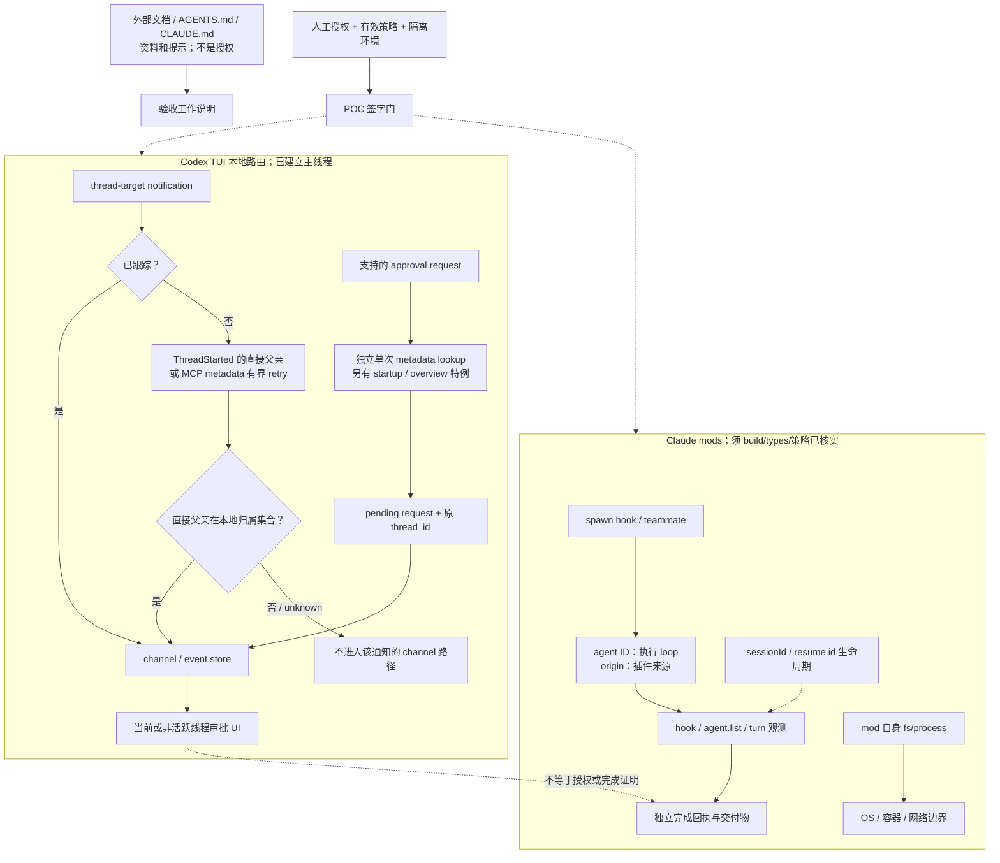

# 双 CLI ownership / agent-identity 验收模板

**证据截面：2026-10-05（Asia/Shanghai）。全部产品运行、CLI、插件、Rust 测试与 POC：`NOT_RUN`。**

这是一份可独立移植的验收设计，不是产品认证、已通过测试报告或部署授权。HTTP 200 与源码存在只证明资料可获取，不证明目标 build、租户策略或运行结果。机器可读卡片、来源 URL、获取时间及响应体 SHA-256 见同目录 `claims.json`；证据行号对应该哈希内容。

## 1. 版本与结论边界

| 对象 | 可使用的证据 | 不可外推 |
|---|---|---|
| Codex | 固定源码 `f365d5754bb643983079676c29e8f7562399019e` 的 TUI 路由实现与测试定义 | **此 ownership routing 修复不在 `0.160.0` stable 中**。固定 SHA 到 stable 的 compare 为 diverged；stable 路由仍有 MCP 通知例外。不能以安装该 stable 替代修复 build。[E01–E06] |
| Claude Code `2.1.289` | 固定 `2bfb629dfaff0c8318047a4beb93cf1dc5b58b18` CHANGELOG 中本机制唯一版本事实：`Added agent.spawn for teammates, one agent id across plugin hook events, and idle and waiting states in $.agent.list()`；精确版本 npm 元数据存在。[E07,E11] | `agent.spawn` 是事件名，不是声称该版本首次引入 `$.agent.spawn()` 方法；不是所有 ID 跨重启永久稳定。 |
| Claude mods | 获取时的 live reference/events/api/admin/create，以及固定仓库声明文件用于设计与解释。[E08–E10,E14,E16,E17] | **live 文档与仓库声明都不是已下载 `2.1.289` build 的能力保证**。即使页面写 as-of 版本也须目标 build/types 对齐。 |

## 2. Codex：从事件入口追到审批 UI

1. `handle_app_server_event` 分流 notification 与 request；Lagged 会做 UI/列表恢复，Disconnected 另走重连。不是每种事件都先经过同一个 ownership gate。[E01:64–124]
2. 通知入口先处理若干特殊事件及 overview/状态更新，再按 target 分类。线程 ID 无效会忽略；无 thread 的 app-scoped MCP 通知会忽略；global 通知有自己的处理。**不得称 foreign 事件在整个 app 中毫无可观察影响。**[E01:126–424,484–498; E15]
3. 本模板正常前提是主线程已经确定、非 startup buffering、无 background voice/temporary structured/dispatched-overview 特例。在 thread-target 路径中，若线程未属于当前 TUI，先检查归属，再 enqueue。[E01:454–477]
4. `owns_thread_for_routing` 是本地四集合判断：primary、已存在的 event channel、side thread、agent_navigation。它不是服务端认证。对**未跟踪**线程：`ThreadStarted` 从事件 source 取直接父亲；`McpServerStatusUpdated` 用 `ThreadRead(include_turns:false)` 取 metadata；其他通知不能靠此 helper 新取得归属。只有 `SubAgent(ThreadSpawn)` 的直接父亲已在四集合中才接受。[E02:51–81]
5. 不递归读取祖先：祖父属于当前 TUI而父亲尚未被跟踪，不足以通过；先合法跟踪父亲后，子线程可被接纳。这里的 foreign 指相对于此 TUI 的本地归属，不是未经认证的远程主体；同一个 app-server 上另一个根及其孩子也不自动属于本 TUI。[E02,E03]
6. MCP metadata 读取的整个 retry loop 包在 **1 秒总 timeout** 内。仅 Server error 文本以前缀 `thread not found:` 或 `thread not loaded:` 开头才重试；等待从 50ms 开始翻倍、单次封顶 1 秒。立即失败且不计开销的理论请求起点为 **0/50/150/350/750ms**，不是每个请求有 1 秒，也不是保证重试五次；I/O 与调度会减少次数。其他错误或总超时不接纳该通知。[E02:16–48；时间序列为源码推导而非测量]
7. 接纳后 `enqueue_thread_notification` 才 `ensure_thread_channel`；活跃线程同时缓存并投递，非活跃线程保留缓存。已存在 channel 又会成为后续路由的 ownership 依据，因此旧版“先见 MCP 就建 channel”的例外具有因果意义。[E12:1170–1365,E05:437–454]
8. **审批先到是不同分支**：对支持的、未跟踪的子线程 request，入口直接 `ThreadRead(include_turns:false)` 并检查直接父亲。此处未调用 MCP retry helper，也没有在该调用点包同样的 1 秒 timeout/backoff；不得把两条路径混为一谈。读取失败返回。若父亲不归属但在 overview 的 dispatched_requests 中，可能转存到该结构，故“所有 foreign request 都绝不保留”不成立。[E01:685–758]
9. 普通通过路径先去重/登记 pending request，再 enqueue；`enqueue_thread_request` 创建 channel、保留 request，活跃 channel 投递；非活跃且没有 active side parent 时转换为交互请求并压入当前 UI。审批转换保留原 `thread_id`，不是把授权对象改成当前屏幕线程。UI 出现≠执行成功，后续操作仍走请求解析/回复。[E01:693–797,E12:245–283,388–400,500–538,1440–1485]
10. 上游回归定义只覆盖 `OwnedApprovalFirst`、`OwnedAfterMcp`、`ForeignAfterMcp`：embedded server 建主根，foreign 用另一个根，构造并 resume 子 rollout，再人工送入失败 MCP 通知与审批；断言 channel/pending/active view，foreign popup 无审批文本。**不是双客户端共享生产 server 的运行测试，也未覆盖这里所有新设计卡。**[E03:1396–1508]

## 3. Claude：区分 loop、来源与恢复句柄

版本事实只到 teammate spawn hook、跨 hook 单一 agent ID、idle/waiting 的发布说明。更具体的解释使用独立的声明层：

- 仓库声明的 `AgentInfo.id` 对应该 loop 的 `tool.call.agentId` 与下一次 spawn 的 `parentAgentId`；`next.origin`/`spawnedBy` 描述引发调用的插件，不是 agent 身份。[E14:113–173,274–281]
- main loop 的 `agentId` 缺省是声明支持的情形；workflow/引擎内部 fork 可有 ID 却不在 agent.list 中。不能把所有缺字段当错误，亦不能把所有未列出的 ID 当伪造。采集保留 missing 状态、loop 类型与 scope，不补造产品 ID。[E14:156–173]
- live reference 说 teammate 的 `e.isTeammate=true`；但本次固定仓库声明文件全文没有 `isTeammate`，且 `AgentInfo.status` 只是 `string`，不是完整状态枚举。**这一资料差异要求 build-local types 与运行证据补齐；不由模板替厂商猜 schema。**[E08:120,E14:113–173,E17]
- 声明层 `agent.spawn` 的结果表示已启动，不是任务完成；hook 不调用 next 自行应答不能据此宣称真的启动了 agent。ID、UI 状态、turn 完成与交付物应分开核验。[E14:312–344]
- `session.end.sessionId` 是结束的会话，`resume.id` 是返回它的句柄；clear/切换到另一个恢复会话后，进程可以继续在另一会话 ID 下运行。没有运行过 prompt 或关闭持久化，句柄可能没有可恢复 transcript。不能把 resume.id 当 agentId，也不能推断跨重启 agent ID 保留或重建规则。[E14:8876–8914,9140–9150]
- live mod `session.start` 在初次加载及 mod reload 时触发，不因 `/clear`、`/resume`、`/branch` 再触发；`session.end` 包含这些切换，branch 报 reason=resume。这与 classic `SessionStart` 的 source 枚举不是同一事件，切勿混用。[E08:103–106,E14:9153–9155]

### Live 文档的异常与策略例外表（不是 2.1.289 build 保证）

| 前提/异常 | 文档所述边界 | 验收含义 |
|---|---|---|
| 普通 hook 在 next 前 throw、超时或返回错误 shape；无 catch | 跳过本 hook，让后继继续。[E09:305–312] | 不是默认 fail-closed；后续权限仍独立生效，不等于任意动作必然执行。 |
| next 已完成后 hook 失败 | 保留 next 的结果，不再运行第二次。[E09:310] | 需计数底层调用；事后 deny 不能抹去已发生副作用。 |
| 给 tool.call 安装 catch，及时返回 deny | 文档示例可使该失败路径阻断；普通 hook 自执行预算 10s，prompt.edit 50ms，catch 1s；next 与多数 mods API 等待不计入，clock.sleep 除外。[E08:240–248,E09:314–324] | 不能扩大为 catch 自己失败/超时也保证阻断；这些格子保留待测。 |
| builtin guard 已加载且未开覆盖选项 | 用户 mod 不能覆盖 deny；managed PreToolUse 的 block 最终有效。ask 与非 managed hook 的 block 可被 mod approval 覆盖。[E16:58–78,209–221] | 必须记录 guard 是否加载、来源层级和真实有效策略，而非只看配置文件。 |
| mods 自己调用 fs/process | Claude 工具的 deny 与 managed PreToolUse 不覆盖 mod 的直接 fs/process；mods 非沙箱，以用户权限运行。[E16:9,65–84] | 工具拦截不是 OS 隔离；禁止拿真实 secret 做对照。 |
| 网络政策 | 覆盖 $.http.fetch，不覆盖 mod 启动程序自身的网络访问。[E16:78] | 网络隔离由容器/OS/出口策略另行保证；本模板只用 mock。 |
| builtin guard 无法读取 managed settings / 核验 deny | 文档分别称拒绝用户 mod 加载 / 拒绝相关调用。[E16:216–221] | 这是指定 guard 的保证，不是每一个 mod hook 的默认行为。 |
| 设 allowManagedModsOnly | 用户 mods 不加载，但用户 settings hooks 等仍可工作；builtin mods 有自身开关。[E16:40–47,149–154] | mod 未加载导致没有 spawn event 属于不可达，不能计为拒绝成功。 |

## 4. 信任边界图



## 5. 验收卡

共同规则：以下 expected 是待检验断言或明确的观察目标，不是已观察结果。前提不可达时仍保持 `runtime_status=NOT_RUN`，另填 `reachability=BLOCKED` 和原因；不得以零事件冒充拒绝成功。所有数值日志都需原始时序与环境信息，UI 截图仅作辅助。

### C01 · 审批先于启动通知

- **Version**：Codex source f365d5754bb643983079676c29e8f7562399019e；修复不在 0.160.0 stable；实际 build 未运行
- **Reachable premise**：主线程 R 已建立；C 尚无 channel/navigation/side 记录；C 的 metadata 是 ThreadSpawn(parent=R) 且可读；支持的 CommandExecutionRequestApproval；无 startup、voice、overview dispatched、active side parent 特例。
- **Stimulus**：在 ThreadStarted/MCP 通知前，向完整 handle_app_server_event 注入 C 的支持型审批请求。
- **Expected**：走审批自己的单次 ThreadRead(include_turns=false)，而不是 MCP retry helper。；pending 登记原 request；创建 C 的 channel；非活跃 C 的审批出现在主界面，保留 C 的 thread_id；不因此执行底层命令。；下游回复是否正确返回原 request 作为新增待测目标，不能由上游 popup 断言代替。
- **Runtime**：`NOT_RUN`；`observed=null`；前提尚未运行核验。
- **Negative control**：将 metadata 改为 parent=F 且 F 不在任何归属/overview dispatched 集合；不登记普通 pending、不创建 C channel、不显示该审批。再让单次读取失败：不得误以为必有 1s retry。
- **Evidence IDs**：E01, E02, E03, E12, E15。上游定义覆盖审批先到的 pending/UI 断言；回复关联是新设计，未运行。

### C02 · MCP 前导事件不洗白 foreign 子线程

- **Version**：Codex source f365d5754bb643983079676c29e8f7562399019e；修复不在 0.160.0 stable；实际 build 未运行
- **Reachable premise**：R 已建立；owned 子 C 与 foreign 根 F/子 D 均未跟踪；server metadata 可读；无 overview dispatched 特例。
- **Stimulus**：owned：C 的 McpServerStatusUpdated(Failed) → C approval；foreign：F 的相同通知 → D 的相同通知 → D approval。
- **Expected**：owned 从 metadata 查直接父亲 R 后创建 C channel，审批进入 pending/UI。；foreign 根 F 非 SubAgent(ThreadSpawn) 不取得 channel；其子 D 的直接父亲不归属，也不取得 channel；普通 pending 与审批 popup 均无该请求。；核实失败 MCP 的 status 并不改变 ownership 条件。
- **Runtime**：`NOT_RUN`；`observed=null`；前提尚未运行核验。
- **Negative control**：使用 0.160.0 路由源码/后续批准的旧 build 作为版本负对照；其 MCP bypass 应暴露行为差异，但本模板不声称已重现。
- **Evidence IDs**：E01, E02, E03, E05, E12。固定源码和上游三场景之一；旧 build 运行尚未验证。

### C03 · metadata retry 与 unknown 的有界等待

- **Version**：Codex source f365d5754bb643983079676c29e8f7562399019e；修复不在 0.160.0 stable；实际 build 未运行
- **Reachable premise**：正常未跟踪 MCP 路径；使用可控 ThreadRead mock 与虚拟/可观测时钟；主线程已确定。
- **Stimulus**：分别注入 not found 前缀、not loaded 前缀后恢复为 parent=R；持续该错误至总 timeout；无关错误；慢读取。
- **Expected**：只对两种精确消息前缀重试；其他错误立即终止本次 helper。；总 timeout=1s，等待从50ms倍增、单等待封顶1s。零请求耗时模型的发起点为0/50/150/350/750ms，真实次数不固定。；超时/无父亲结果不得创建该通知的 channel；随后另一次有效事件可重新核验，不等于自动补回已丢弃通知。
- **Runtime**：`NOT_RUN`；`observed=null`；前提尚未运行核验。
- **Negative control**：错误文本不以规定前缀开头；普通非 MCP/ThreadStarted 通知；审批先到分支。三者不得套用 MCP retry 结论。
- **Evidence IDs**：E01, E02, E12。时间序列为代码推导；本卡新增故障注入设计，非上游已有测试覆盖声明。

### C04 · 直接父亲、祖先与已跟踪快路径

- **Version**：Codex source f365d5754bb643983079676c29e8f7562399019e；修复不在 0.160.0 stable；实际 build 未运行
- **Reachable premise**：R 为 primary；P 为 R 的孩子但尚未在四集合；C 的直接父亲=P；不人为预建 C channel。
- **Stimulus**：先注入 C 的 ThreadStarted 与 MCP，后合法跟踪 P，再注入 C；另分组让父亲仅在 side_threads 或 navigation；记录所有集合变化。
- **Expected**：只知道祖父 R 不足以接纳 C；helper 不递归查询祖先。；合法跟踪 P 后直接父亲检查可通过；四集合之一命中足够。；已跟踪 C 走快路径，不要求每个通知重验父亲；这是本地路由语义，不是撤权/认证协议。
- **Runtime**：`NOT_RUN`；`observed=null`；前提尚未运行核验。
- **Negative control**：不属于 ThreadSpawn 的 source、非法 thread ID、app-scoped MCP、父亲未知分别核验；不能把它们统称恶意 foreign。
- **Evidence IDs**：E01, E02, E12, E15。由完整分支推导的新卡；没有祖先关系的运行证明。

### C05 · 共享 server 双 TUI 与边界特例

- **Version**：Codex source f365d5754bb643983079676c29e8f7562399019e；修复不在 0.160.0 stable；实际 build 未运行
- **Reachable premise**：授权隔离共享 app-server 上两个独立 TUI，各自 primary R/F；本地四集合起点互斥；先证明事件确实被两个入口观察；正常路径禁用特殊分支。
- **Stimulus**：交错发送各自子线程 MCP→approval；分别采集两端 channel/pending/UI。另单独标识 startup buffering、overview dispatched、voice、unsupported request 分组。
- **Expected**：正常路径：每端仅路由本地拥有根的子线程审批；另一端零该子线程 channel、普通 pending 和 popup，且有入口到达证据。；特殊分组按 E01 的独立分支验收；overview dispatched 可转存 request，startup 可先缓冲，unsupported 可拒绝；不得沿用一刀切的全部丢弃断言。；上游 E03 是单 embedded server 的合成路由测试定义，不能替代本卡双 TUI 集成运行。
- **Runtime**：`NOT_RUN`；`observed=null`；前提尚未运行核验。
- **Negative control**：刻意让事件不送达某端，验收器必须判不可达而不是隔离成功；另将线程显式加入本地跟踪，验证快路径前提变化。
- **Evidence IDs**：E01, E02, E03, E12。新增集成测试设计；不是服务端多租户认证/授权验收。

### C06 · teammate spawn 可达性与拒绝

- **Version**：Claude Code 2.1.289 changelog；细节为独立 live 文档/仓库声明设计，须匹配目标 build-local types
- **Reachable premise**：精确包/build/types 哈希已记录；团队能力与 mod 受策略允许，实际加载已确认；原生 subagent/teammate 入口可达；不能用 mock hook 冒充原生触发。
- **Stimulus**：分别原生启动普通 subagent 与 teammate；记录 spawn hook 输入/结果；仅对合成 teammate 返回 deny；成功与拒绝各取运行 side-effect 计数。
- **Expected**：2.1.289 的待验版本目标是 teammate 也触发 agent.spawn；live 细节目标是 teammate 的 isTeammate=true。；未匹配 build types 或字段缺失时记录差异/不可达，不自行补字段；固定仓库 E14 没有 isTeammate，不能用它宣称 API 全覆盖。；deny 路径须 agent 实际未启动；只隐藏 UI 或 hook 自行应答不算已验证执行结果。
- **Runtime**：`NOT_RUN`；`observed=null`；前提尚未运行核验。
- **Negative control**：禁用/阻止 mod 加载后零 hook 必须标 BLOCKED，而不是 deny 成功；去掉 deny 的允许对照应能启动无害 fixture。
- **Evidence IDs**：E07, E08, E11, E14, E16, E17。版本事实与 live 行为目标分层；全部目标运行 NOT_RUN。

### C07 · agent loop ID 不等于 plugin origin

- **Version**：Claude Code 2.1.289 changelog；细节为独立 live 文档/仓库声明设计，须匹配目标 build-local types
- **Reachable premise**：本地 types 明确支持待观测字段；一个 session 内普通子 agent、in-process teammate 均可达；同时有 main loop 对照。
- **Stimulus**：关联 spawn 返回 ID、tool.call、turn.complete、list.id 与后续 spawn.parentAgentId；记录 next.origin/spawnedBy，保留字段缺省。
- **Expected**：版本验收目标：同一 agent 的跨 plugin hook ID 一致；具体字段映射按目标 types 核验。；声明层允许 main loop 没有 agentId；workflow/内部 fork 可有不在 list 的 ID，不应自动当伪造。；使用 harness 自己的 observation_run_id 标注采集批次，与产品 ID 分栏；不捏造产品 ID，不把插件来源当执行主体。
- **Runtime**：`NOT_RUN`；`observed=null`；前提尚未运行核验。
- **Negative control**：从 main loop 取缺省 agentId；两个同名 agent；同一插件触发两个不同 agent。关联器不得以名称或 origin 合并不同 loop。
- **Evidence IDs**：E07, E08, E14。声明层语义与关联器设计；无跨重启永久 ID 保证。

### C08 · idle/waiting 不能充当完成

- **Version**：Claude Code 2.1.289 changelog；细节为独立 live 文档/仓库声明设计，须匹配目标 build-local types
- **Reachable premise**：目标 build 的 list 能被读取；无害任务可控阻塞、可恢复且有独立 artifact/完成回执；保存原始状态字符串。
- **Stimulus**：制造待输入/待工作等场景，采集 list 与 hook 时间线；等待、空闲、完成阶段分别检查真实交付物。
- **Expected**：2.1.289 发布说明的验收目标是观察 idle 和 waiting；触发条件与转换规则未由本模板指定为产品事实。；未知状态原样保留；E14 status:string 不构成完整枚举。；spawn 返回、idle、waiting 均不能自动判任务完成；即使 turn 完成仍须 artifact 符合任务标准。
- **Runtime**：`NOT_RUN`；`observed=null`；前提尚未运行核验。
- **Negative control**：fixture 未产物却标 idle/waiting；UI 显示完成但底层回执失败。验收器必须拒绝交付完成判定。
- **Evidence IDs**：E07, E14。发布说明支持状态名；状态转换需现场测定，完成门是模板规范。

### C09 · session/resume 生命周期与 agent ID 未知边界

- **Version**：Claude Code 2.1.289 changelog；细节为独立 live 文档/仓库声明设计，须匹配目标 build-local types
- **Reachable premise**：目标 build/types 支持 session.end 与 resume 信息；使用无敏感数据会话；持久化开/关分组；mod start 与 classic SessionStart 分开记录。
- **Stimulus**：有 prompt 的会话记录 sessionId/resume.id 后 clear、resume/branch、mod reload；另设从未 prompt 与 persistence off 对照。不要执行强制终止命令。
- **Expected**：声明层：结束会话的 sessionId/resume.id 与后续当前会话分栏；resume 句柄是否可用依赖 transcript。；live mod session.start 不因 clear/resume/branch 重触发，reload 会；end 的 branch reason=resume。；agent ID 跨切换/重启是否保留、重建、丢失均为待观察，不推断；没有记录的映射为 UNKNOWN。
- **Runtime**：`NOT_RUN`；`observed=null`；前提尚未运行核验。
- **Negative control**：从未 prompt 或关闭持久化仍有句柄但无 transcript；关联器不能据句柄存在声称可恢复。不要把 classic SessionStart(source=resume) 当 mod session.start。
- **Evidence IDs**：E08, E14, E17。仓库声明/live 文档的生命周期目标，非精确二进制已证事实。

### C10 · 异常、策略例外与非沙箱边界

- **Version**：Claude Code 2.1.289 changelog；细节为独立 live 文档/仓库声明设计，须匹配目标 build-local types
- **Reachable premise**：本地 types/有效 managed 策略、guard 实际加载顺序已记录；仅 mock 工具与合成文件，OS 无外联；授权允许故障注入；底层调用有独立计数器。
- **Stimulus**：分别在 next 前 throw/超时/错 shape、next 已完成后失败、catch 及时 deny、catch 自身失败；分组比较工具 deny/managed PreToolUse、mod 直接 fs/process 和 mock http/process 出口。
- **Expected**：无 catch 的 next 前失败按 live 文档跳过 hook，继续后继；不推断一定执行，仍核验后续权限；next 已完成后失败不得重复底层调用。；及时 catch deny 的阻断单独验证；catch 自己失败/超时的精确结果保留观察目标，不能默认 fail-closed 或能回滚。；guard 的 deny 与 managed block 有加载/选项前提；工具权限不覆盖 mod 直接 fs/process；http 网络政策不等于子进程出口限制。；builtin guard 特定读取失败的 fail-closed 声明，不推广为所有 hook 的默认性质。
- **Runtime**：`NOT_RUN`；`observed=null`；前提尚未运行核验。
- **Negative control**：使用工具路径与直接 mod API 访问同一无害 sentinel，展示不同控制面；未加载 guard 的分组不得获得 guard 保证；任何真实外联立即停止。
- **Evidence IDs**：E08, E09, E10, E14, E16。live 文档异常与安全例外的条件式验收，不是2.1.289运行保证。


## 6. Q&A

**Q：Codex ownership 就是服务端多租户隔离吗？** 不是。它是 TUI 对本地跟踪状态和 server metadata 的路由判断；server 本身的认证、访问控制与恶意 metadata 防护不在此证明中。

**Q：foreign / unknown 是否等价？** 不等价。foreign 是已知直接父亲不归属；unknown 是 metadata 缺失、source 不匹配或读取失败。正常通知 channel 路径都不接纳，但 unknown 可能以后变为可验证；模板不能把它标记为永久 foreign。

**Q：五次重试、一次审批超时是否是固定 SLA？** 都不是。0/50/150/350/750ms 是理想 MCP 请求起点，含首次而不是五次重试；审批分支没有调用这一 retry helper。

**Q：一个 agent ID 能当授权 token 或全局永久主键吗？** 不能。它是关联线索；应结合 session scope、build、采集运行与明确的 loop 类型。跨 resume/restart 的 agent 映射没有证据就保持 UNKNOWN。

**Q：idle/waiting 或 spawn 返回是否代表任务完成？** 不代表。完成需要明确的完成事件、退出/错误信息及独立 artifact 验收，不能用看板颜色替代。

**Q：AGENTS.md / CLAUDE.md 可以给 harness 授权吗？** 不能。它们在本模板中只提供行为提示、项目约定和资料。执行权限来自明确批准的环境范围、有效运行时策略与 OS 权限，不来自文档中自称的身份。

## 7. [→harness] 可复制工作说明

```text
任务：实现 claims.json 中 C01–C10 的验收 harness，不将本说明当执行授权。
默认只产生实现与测试计划；在下述 POC 签字门完整之前不得启动任何 CLI、mod 或上游测试。
环境：临时隔离工作区；合成根 R、子线程 C、foreign 根 F；无客户仓库、凭据、真实 secret；网络默认禁止，外部端点全部 mock。
先决条件：记录目标 CLI 二进制 SHA-256、源码 SHA/包版本、对应本地 types SHA、有效 managed 策略和实际加载 mod；验证目标分支确实可达。
Codex：保留正常已建立主线程前提；按事件顺序注入，采集 lookup 开始/结束/错误前缀、直接父亲、channel 是否创建、pending key、原 thread_id、popup、下游响应。不要在 foreign 对照中预先人为插入 channel。
Claude：分开记录 agent loop、plugin origin、sessionId、resume.id、list 原始状态；main 缺省 ID 不补造；未知状态保留原值；mock 发出的 hook 不能充当 engine 原生 teammate 事件证据。
为每卡实现正向与 negative control，并单列不可达、超时、版本差异。对 hook 错误分别测 next 前、next 后、catch 自身错误，不以日志“deny”替代零副作用计数。
回执至少含 card_id、build/types hash、reachability、stimulus trace、expected、observed、negative_control、artifact hash、时间范围和执行人。
本轮提供的 observed 一律 null，runtime_status 一律 NOT_RUN；不要预填成功记录。
若以后获准执行，以新回执记录结果，不覆盖本模板原始 NOT_RUN 基线。
```

## 8. POC 签字门（全部留空）

| 签字角色 | 必填验收项 | 签字/日期 |
|---|---|---|
| 环境责任人 | 隔离边界、数据分类、无凭据、mock 出口、销毁/回滚方案 | ______ |
| 构建责任人 | Codex 修复 SHA 与对照 build；Claude 精确包及 build-local types 哈希；能力/策略实际可达 | ______ |
| 安全责任人 | mod 非沙箱风险；权限例外表；允许的 stimuli、负对照与停止条件 | ______ |
| 执行责任人 | 各卡原始回执、独立副作用计数、blocked 说明、完整负对照 | ______ |
| 验收责任人 | 逐卡核对 expected/observed/artifact；运行范围与未覆盖项 | ______ |

**停止条件**：目标 build 或类型不匹配、guard/策略不可确认、出现真实外联/敏感数据、跨根错误审批、重复副作用、日志关联缺失。停止后不继续扩大测试，保留最小脱敏证据。没有上述签字和真实运行回执，不填写验收通过结论。

## 9. 来源索引

来源均通过实际 `curl` GET 核验；哈希针对响应体原始字节。live URL 后续可能变化；固定仓库声明也不等于目标二进制绑定。公开包仅包含模板和事实/设计清单，不包含 CLI 或插件实现。

- **E01**：[https://raw.githubusercontent.com/openai/codex/f365d5754bb643983079676c29e8f7562399019e/codex-rs/tui/src/app/app_server_events.rs](https://raw.githubusercontent.com/openai/codex/f365d5754bb643983079676c29e8f7562399019e/codex-rs/tui/src/app/app_server_events.rs)
  - HTTP 200；SHA-256 `5638cf0073c54a2ba44712a013209fb2e895bd51ee1611f0a884484c612493e9`；定位 64-124, 126-424, 454-498, 685-797。
- **E02**：[https://raw.githubusercontent.com/openai/codex/f365d5754bb643983079676c29e8f7562399019e/codex-rs/tui/src/app/app_server_thread_ownership.rs](https://raw.githubusercontent.com/openai/codex/f365d5754bb643983079676c29e8f7562399019e/codex-rs/tui/src/app/app_server_thread_ownership.rs)
  - HTTP 200；SHA-256 `41bb3dbff6089425b3cfe3f8e1610c6e41c0b6414d10a76695513d97a3470f4d`；定位 16-81。
- **E03**：[https://raw.githubusercontent.com/openai/codex/f365d5754bb643983079676c29e8f7562399019e/codex-rs/tui/src/app/tests/startup.rs](https://raw.githubusercontent.com/openai/codex/f365d5754bb643983079676c29e8f7562399019e/codex-rs/tui/src/app/tests/startup.rs)
  - HTTP 200；SHA-256 `25ae20a9a9d2d47a336bb8b64ee3aa432d3442d3a185bf3477779be11d4e2f80`；定位 1396-1508。
- **E04**：[https://raw.githubusercontent.com/openai/codex/f365d5754bb643983079676c29e8f7562399019e/codex-rs/tui/src/app.rs](https://raw.githubusercontent.com/openai/codex/f365d5754bb643983079676c29e8f7562399019e/codex-rs/tui/src/app.rs)
  - HTTP 200；SHA-256 `9b98a1041fec7b50a244d009ee9113263f0290c67de20ba3f87cfb085c9e2c30`；定位 207-277。
- **E05**：[https://raw.githubusercontent.com/openai/codex/rust-v0.160.0/codex-rs/tui/src/app/app_server_events.rs](https://raw.githubusercontent.com/openai/codex/rust-v0.160.0/codex-rs/tui/src/app/app_server_events.rs)
  - HTTP 200；SHA-256 `16a089d4b34380f58484d6b89da70813a3abf3e069eb1254466e18e4d6c35297`；定位 437-454。
- **E06**：[https://api.github.com/repos/openai/codex/compare/f365d5754bb643983079676c29e8f7562399019e...rust-v0.160.0](https://api.github.com/repos/openai/codex/compare/f365d5754bb643983079676c29e8f7562399019e...rust-v0.160.0)
  - HTTP 200；SHA-256 `fd020aa99810470c22fee1b7a1fb4322ebf7c84a5428e653d6db69ed95f2ddf2`；定位 JSON status / merge_base_commit。
- **E07**：[https://raw.githubusercontent.com/anthropics/claude-code/2bfb629dfaff0c8318047a4beb93cf1dc5b58b18/CHANGELOG.md](https://raw.githubusercontent.com/anthropics/claude-code/2bfb629dfaff0c8318047a4beb93cf1dc5b58b18/CHANGELOG.md)
  - HTTP 200；SHA-256 `c3b0831a2102d8d4800a2eb00c2a0d3095378d57d690e0ed1e8e3c386299f5e7`；定位 3, 21。
- **E08**：[https://code.claude.com/docs/en/plugins/mods/reference.md](https://code.claude.com/docs/en/plugins/mods/reference.md)
  - HTTP 200；SHA-256 `da4f6d5fb2164519e2a9ca0dab3c4a6fa241acc18e184797cd238a6d90bfd295`；定位 9-12, 103-120, 240-248。
- **E09**：[https://code.claude.com/docs/en/plugins/mods/events.md](https://code.claude.com/docs/en/plugins/mods/events.md)
  - HTTP 200；SHA-256 `0f124eb60aec54d51fb61776b4657eac6a6c3d4841f768d85c127f3d2b272695`；定位 279-324。
- **E10**：[https://code.claude.com/docs/en/plugins/mods/api.md](https://code.claude.com/docs/en/plugins/mods/api.md)
  - HTTP 200；SHA-256 `46654ff407a87dcb886e19eef19070c751200f4b6d1c2a7fbfab9989d4620975`；定位 93, 99-140。
- **E11**：[https://registry.npmjs.org/@anthropic-ai/claude-code/2.1.289](https://registry.npmjs.org/@anthropic-ai/claude-code/2.1.289)
  - HTTP 200；SHA-256 `6614d5bb102279dbeb9966543f287a5996df474447bad9139aeb48de8889ef2b`；定位 JSON version。
- **E12**：[https://raw.githubusercontent.com/openai/codex/f365d5754bb643983079676c29e8f7562399019e/codex-rs/tui/src/app/thread_routing.rs](https://raw.githubusercontent.com/openai/codex/f365d5754bb643983079676c29e8f7562399019e/codex-rs/tui/src/app/thread_routing.rs)
  - HTTP 200；SHA-256 `e2ae412c411db10001d5920e2726d2257791a43765622aaab017877b48119950`；定位 75-78, 245-283, 388-400, 500-538, 1170-1365, 1440-1485。
- **E13**：[https://raw.githubusercontent.com/openai/codex/f365d5754bb643983079676c29e8f7562399019e/codex-rs/tui/src/app/thread_events.rs](https://raw.githubusercontent.com/openai/codex/f365d5754bb643983079676c29e8f7562399019e/codex-rs/tui/src/app/thread_events.rs)
  - HTTP 200；SHA-256 `273935acf000f4d5a30f4d79d94f8fa23fe4fb5a0fd9ea383c1b3abfba758b85`；定位 63-107。
- **E14**：[https://raw.githubusercontent.com/anthropics/claude-code/2bfb629dfaff0c8318047a4beb93cf1dc5b58b18/mods/types/claude-code.d.ts](https://raw.githubusercontent.com/anthropics/claude-code/2bfb629dfaff0c8318047a4beb93cf1dc5b58b18/mods/types/claude-code.d.ts)
  - HTTP 200；SHA-256 `8ae1244d19d4b393261605fe72d517b66be0d7e1c214c378cdec5107e8b0b46c`；定位 113-173, 274-344, 875-903, 8876-8914, 9140-9155。
- **E15**：[https://raw.githubusercontent.com/openai/codex/f365d5754bb643983079676c29e8f7562399019e/codex-rs/tui/src/app/app_server_event_targets.rs](https://raw.githubusercontent.com/openai/codex/f365d5754bb643983079676c29e8f7562399019e/codex-rs/tui/src/app/app_server_event_targets.rs)
  - HTTP 200；SHA-256 `c6b87662e02de7d24bde815db157edb4ad522592c551040f2cdf35b6e473439a`；定位 7-43。
- **E16**：[https://code.claude.com/docs/en/plugins/mods/admin.md](https://code.claude.com/docs/en/plugins/mods/admin.md)
  - HTTP 200；SHA-256 `60262941b144133783f8d7a0aa4670a3cf7437d036666f367c960b329c7eb106`；定位 9, 40-84, 149-154, 209-221。
- **E17**：[https://code.claude.com/docs/en/plugins/mods/create.md](https://code.claude.com/docs/en/plugins/mods/create.md)
  - HTTP 200；SHA-256 `ca6fbdb779bf8866fc7c9d88ac81562a4eb71cffac63daafcda2a7cc06951326`；定位 Get the types for your build。

## 配套文件与来源归属

- 机器可读验收卡与证据：[claims.json](claims.json)。
- `claims.json` SHA-256：`444ef9241011aff04dc8f3892cc6558c4d2437ff49a34384509e13dc923440ac`。
- E04、E13 是辅助背景来源，未作为验收卡独立判据，不计作运行证据。
- 本文是原创验收方法整理，短引文与链接用于来源归属；未附第三方完整实现。引用不代表厂商背书，第三方代码、文档与商标权利仍归原权利人，复用上游代码须另核对应许可证。
