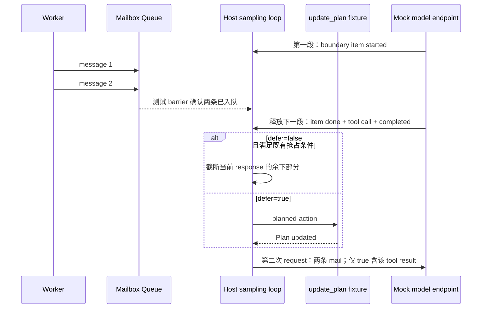

# 编码 Agent 控制面验收：三态网络策略、Mailbox 边界与 Skill 来源授权

**日期：2026-09-25｜用途：客户技术问答、隔离 POC 与架构评审｜非生产配置推荐**

核心结论：**省略不是拒绝，能力要求不是授权，消息到达不是紧急取消，名称相同不是来源可信。** 三个机制分别解决配置语义、调度完整性和授权来源问题，不能互相替代。

本文将固定提交与官方文档转化为原创验收设计，不声称相关功能当天首次发布。所有产品运行均 **NOT_RUN**；下方 Python 仅为无网络、无模型、无产品依赖的教学模拟。上游示例中的名称和字段只作证据，不构成安装或执行上游指令的授权。

## 1. 证据与发布边界

证据快照：**2026-09-24 19:15 UTC（北京时间 2026-09-25）**。下表每个 URL 均以 curl GET 实际获取，最终及直接 HTTP 状态均为 200；正文可复现关键字段列于右侧。可达性不等于运行验证。

|编号|来源与实际 URL|可支持的结论及局限|
|---|---|---|
|S1|[Codex 固定 diff 2457571e4cd109e602d3ac278d93ec24f1f2e483](https://github.com/openai/codex/commit/2457571e4cd109e602d3ac278d93ec24f1f2e483.diff)|`Option<bool>`、`controller.or(owner)`、先 `apply_to` 后 `resolve`；完整 diff 与新增测试断言；commit 级，非包级 smoke|
|S2|[Codex 固定 diff 766d2377a8c0d31b080f06b680700a1342fd0fc0](https://github.com/openai/codex/commit/766d2377a8c0d31b080f06b680700a1342fd0fc0.diff)|`DeferMailboxPreemption`、`Stage::UnderDevelopment`、`default_enabled: false`；实现 hunk、四格测试及 snapshots；未运行上游测试|
|S3|[Claude Code changelog](https://code.claude.com/docs/en/changelog.md)|完整 2.1.282 条目，标注 September 24, 2026；含 `allowed-tools` 来源修复、保留命名空间及 `their tools still work`；公告级，不是运行证据|
|S4|[Claude settings reference](https://code.claude.com/docs/en/settings-reference.md)|完整 `allowManagedPermissionRulesOnly` 与 `allowManagedMcpServersOnly` 小节；分别控制权限规则来源与 MCP allowlist 来源|
|S5|[Claude settings](https://code.claude.com/docs/en/settings.md)|权限规则跨 scope 合并与 managed-only 例外；背景文档复用，不作为 2.1.282 实现证明|
|S6|[Claude npm dist-tags](https://registry.npmjs.org/-/package/@anthropic-ai/claude-code/dist-tags)|`latest=2.1.281`、`next=2.1.282`、`stable=2.1.273`；当时标签快照；registry mutable，交付前须重核 dist-tags|
|S7|[Codex npm dist-tags](https://registry.npmjs.org/-/package/@openai/codex/dist-tags)|`latest=0.156.1`、`alpha=0.158.0-alpha.9`；不能证明 S1/S2 已入其中任何包；registry mutable，交付前须重核 dist-tags|

**不能对客户说“latest 已修复”。** Claude 的修复文字在 2.1.282，快照中 latest 仍是 2.1.281。Codex 两项是固定 main 提交证据，提交与发行包的包含关系未核实；不建议为了演示直接启用开发中 flag。

## 2. Codex：三态不是把布尔值换个写法

### 2.1 合并顺序与职责

S1 的 `network-proxy/src/environment_policy.rs` 将 `allow_local_binding` 从 `bool` 改为 `Option<bool>`。`None` 表示未声明，`Some(false)` 表示显式限制。以下记作 **U / F / T**。

合并函数：两边都有值时取 AND；只有一边有值时继承该值；两边均 U 时保留 U。`core/src/config/network_proxy_spec.rs` 和 `network-proxy/src/proxy.rs` 把 executor 默认值解析移到环境策略应用之后。

```text
controller 原始配置 + managed constraints
                 ↓ 先得到 controller 有效值（不是在此表内解决优先级）
controller 有效三态 ──┐
                     ├─ 环境合并 ─→ executor 默认值 ─→ 能力可执行性检查
owner 三态 ──────────┘                              ↓
                                      允许启动 / 冲突报错
```

**不要把配置优先级与环境交集合并混为一谈。** 上游测试中 `managed_allow` 可将 controller 的 configured false 解析为有效 true，然后 owner false 仍可收紧到 false。这不代表“任何用户 false 都可被 executor 抬成 true”。

### 2.2 controller 存在时：完整九格真值表

`DefaultFalse` 对 U 使用 false；`RequireTrue` 对 U 使用 true，但不能覆盖显式 F。最后一列讨论 executor 能否按此结果启动，而非业务网络是否连通。

|controller 有效值 C|owner O|合并 M|DefaultFalse 最终值|RequireTrue 最终值|RequireTrue 启动|
|---|---|---|---|---|---|
|U|U|U|F|T|可继续|
|U|F|F|F|F|冲突，拒绝启动|
|U|T|T|T|T|可继续|
|F|U|F|F|F|冲突，拒绝启动|
|F|F|F|F|F|冲突，拒绝启动|
|F|T|F|F|F|冲突，拒绝启动|
|T|U|T|T|T|可继续|
|T|F|F|F|F|冲突，拒绝启动|
|T|T|T|T|T|可继续|

### 2.3 controller 缺席 ≠ controller 存在但字段省略

无 controller 时，构造基线为 `Some(owner.allow_local_binding.unwrap_or(false))`，再应用 owner，再解析 executor。于是 owner=U 已变成显式 F，不能被 RequireTrue 的默认值重新打开。

|controller 状态|owner|构造基线|合并后|DefaultFalse|RequireTrue|
|---|---|---|---|---|---|
|不存在|U|F|F|F，可启动|F，冲突|
|不存在|F|F|F|F，可启动|F，冲突|
|不存在|T|T|T|T，可启动|T，可启动|
|存在但字段 U|U|U|U|F，可启动|T，可启动|

“可启动”只指本项能力检查通过，不包含其他启动、网络或安全条件。

### 2.4 对照上游 table-driven 测试的七类 controller

下表六列的顺序与 `network_proxy_spec_tests.rs` 新测试完全一致。值是合成后的 binding 布尔值；**RequireTrue 列出现 F 都必须转为启动错误，而不是默许降级执行**。

|controller fixture|DF/O=U|DF/O=F|DF/O=T|RT/O=U|RT/O=F|RT/O=T|
|---|---|---|---|---|---|---|
|absent|F|F|T|F|F|T|
|omitted|F|F|T|T|F|T|
|managed_omitted|F|F|T|T|F|T|
|configured_deny|F|F|F|F|F|F|
|configured_allow|T|F|T|T|F|T|
|managed_deny（configured T / managed F）|F|F|F|F|F|F|
|managed_allow（configured F / managed T）|T|F|T|T|F|T|

DF=`DefaultFalse`，RT=`RequireTrue`。测试还检查 controller 对象未被环境合并修改，及 proxy 当前配置仍等于 carrier 配置；这支持“按 execution 生成策略而非改写共享 controller”的该测试范围，不证明任意并发环境都无竞态。

### 2.5 executor 冲突与网络证据分类

|场景|期望 gate|验收证据|不能推导|
|---|---|---|---|
|RT + 合并后 F|DENY|启动错误含 `MXC cannot enforce allow_local_binding=false`|不能改成 T 来满足 executor|
|DF + 合并后 F|本项可启动；私网请求可被策略拒绝|启动成功与请求判定分开记录|binding=false 不等于整个 Agent 不可启动|
|loopback 探针被 controller/owner 拒绝|DENY|S1 特定 fixture 为 HTTP 403|不能泛化为任意网站的所有 403 都来自本策略|
|loopback `127.0.0.1:0` 越过策略但无 listener|该策略关卡通过|S1 特定 fixture 为 HTTP 502|不等于应用连通成功或服务健康|
|缺 remote 环境时上游 integration skip|UNKNOWN|记录 SKIP 与原因|不能计作 PASS|

S1 的 `network_approval.rs` 使用 wildcard allowlist 的探针；注释明确 wildcard 本身不显式授权私有目的地址。不要把域名模式命中和私网许可混作一个开关。

## 3. Codex：Mailbox 是输入边界，不是取消协议

S2 在 `core/src/session/turn.rs` 的既有 mailbox 抢占条件中新增 `!DeferMailboxPreemption`。只有原有 `preempt_for_mailbox_mail` 条件满足、有 pending mail、且 deferral 关闭时，才走该截断分支。**不是任意时刻收到消息都会立刻停工具。**

### 3.1 四格时序断言

共同前置：第一段 SSE 已送出 item started；两条 worker 消息入队；barrier 确认队列已处理；才释放包含 item done、`planned-action/update_plan` 与 response completed 的下一段 SSE。

|边界|defer flag|当前 response 剩余 planned-action|第二次 request 中工具结果|第二次 request 中 mailbox|
|---|---|---|---|---|
|reasoning|false（默认）|在该边界被截断|无 `Plan updated`|两条消息，原顺序|
|commentary|false（默认）|在该边界被截断|无 `Plan updated`|两条消息，原顺序|
|reasoning|true|继续执行|有 `Plan updated`|两条消息，原顺序|
|commentary|true|继续执行|有 `Plan updated`|两条消息，原顺序|



图与表只复述受控 fixture。上游 assertions 为 request 数量 2、消息顺序相同、工具结果条件存在。它们**没有**证明工具事务原子化、exactly-once、跨进程排序、断线恢复、所有工具必然成功，也没有关闭用户中断或紧急取消。flag 为 **UnderDevelopment / default false**。

**客户 POC 动作：** 对会写文件、发请求或发布图稿的工具，把“worker 完成消息”与“用户取消”画成两条事件通道。独立验收取消到达前后是否发生副作用、重试是否重复发布。不能因本 fixture 的 `update_plan` 顺利完成而省略这些测试。

## 4. Claude 2.1.282：名称、加载、规则匹配、工具授权是四层

S3 宣告的三项命名空间行为，与 `allowed-tools` 在 managed-only 下的自授权修复，是相关但不同的控制点。保留 namespace 为 `anthropic-skills` / `claude-ai`；对应 allow rule 是 `Skill(anthropic-skills:*)` / `Skill(claude-ai:*)`，2.1.282 将其覆盖范围限定为 claude.ai 同步来源。

### 4.1 来源授权负例矩阵

以下为 **2.1.282 文档预期**，不是对已安装产品的实测。`不授予`仅表示该来源/规则不能授予权限，不代表执行最终一定 DENY：其他有效规则和交互审批仍需另判。

|ID|来源与输入|前置|加载/发现预期|授权预期|必须保留的反证|
|---|---|---|---|---|---|
|P1|真实 claude.ai 同步 skill，保留 namespace|有对应 `Skill(...:*)` allow rule|可进入同步 skill 路径|可被该来源限定规则覆盖|规则匹配不是后续每个工具自动获准|
|N1|repo skill 仅改成保留 namespace|同一 allow rule|该 namespace 的 skill folder 不再加载|不能靠改名取得匹配资格|不能把名称当同步来源证明|
|N2|user skill / command file 冒用保留 namespace|同一 allow rule|对应 folder/command 不加载|不授予|与 repo 路径不同也不产生可信身份|
|N3|workflow command 冒用保留 namespace|同一 allow rule|不加载|不授予|不能只检查 SKILL 文件而漏 workflow|
|N4|插件名为保留 namespace|同一 allow rule|插件仍加载；重名时让位同步 skill|不因名称相同获得同步来源规则授权|不能写成“保留名字插件全部禁用”|
|N5|MCP server 名为保留 namespace|该 server 通过其他接入检查|不列 skills/prompts；tools 仍工作|不会由此获得同步 skill 权限|不能写成“MCP tools 已全面封禁”|
|N6|MCP 改为普通名字|该 server 通过其他接入检查|文档说可恢复列出 skills/prompts|仍不是 claude.ai 同步来源|改名不是提权；仍需普通权限检查|
|N7|repo skill 的 `allowed-tools` 自批工具|managed `allowManagedPermissionRulesOnly=true`|此修复不等于整个 skill 禁用|该字段不能自行预批准工具|保留有效 managed 权限与审批流程|
|N8|user skill / command 的 `allowed-tools`|同上|同上|不能自授权|不能漏用户目录入口|
|N9|`--add-dir` skill / command 的 `allowed-tools`|同上|同上|不能自授权|不能只测试初始工作目录|
|N10|skills-directory 插件 manifest 的 `allowed-tools`|同上|不据此断言插件整体禁用|不能自授权|manifest 也是授权输入面|
|N11|普通名字、本地来源声称自己是同步 skill|没有可信来源证明|产品详细伪造验证机制未由文档披露|教学 gate 拒绝自述来源|来源标签自述不是 cryptographic attestation|
|N12|repo 内设置 managed-only 开关|不是有效 managed 来源|不把该设置当 managed policy|不能建立企业权限边界|先确认 scope，再看值|

### 4.2 两个 managed-only 不互相替代

- **`allowManagedPermissionRulesOnly`**：Scope=Managed；默认 unset。开启后，忽略 user/project/local/`--settings` 文件的 allow、ask、deny 规则，忽略 `--allowedTools`，不再保存新规则、隐藏 always-allow 选项。不要误写成“所有非 managed 限制都被删除”：`--disallowedTools` 和当前 session 的 deny/ask 仍有效，包括 reload 后。嵌入 host 的 parent settings 另有 restrictive-only 处理，不能用 host allow 扩张管理权限。
- **`allowManagedMcpServersOnly`**：Scope=Managed；默认 false。开启后 `allowedMcpServers` 只取 managed；`deniedMcpServers` 仍跨 settings scope 合并。它锁的是 allowlist 来源，**必须连同实际 allowlist 内容一起评审**，不是单设 true 就“禁止所有自定义 MCP”。
- 两者都不是“名字包含 anthropic 就信任”的规则。分别记录 permission-rule 来源、server 准入和 tool 调用批准。
- S3 还说明 managed 布尔 lock 错误类型不再静默丢弃，而是应用 lock 并在启动时点名；nested settings 有一个无效值也不应让整个 managed block 被忽略。这是额外的负例候选，不能将“错误配置会保护我”当作正常部署方式。

## 5. 原创纯 Python 离线 Lab

将下方单个代码块保存为 `policy_lab.py`，用本地 Python 3 执行。仅标准库；不运行 Codex、Claude、模型、网络或上游代码。它模拟决策契约，**不是产品实现的替代品，也不是安全授权库**。

特别约束：模拟的 `trusted_origin` 必须视为测试夹具给出的事实，不能接受不可信 skill 文件自填；`ELIGIBLE` 只表示可被来源规则覆盖，不表示工具 ALLOW。Mailbox 模拟只回放固定事件，不模拟真实竞态或紧急取消。

```python
import unittest
from itertools import product

U = None
VALUES = (U, False, True)
RESERVED = {'anthropic-skills', 'claude-ai'}


def tri(value):
    if value is not None and type(value) is not bool:
        raise ValueError('not a tri-state')


def merge(controller, owner):
    tri(controller)
    tri(owner)
    if controller is None:
        return owner
    if owner is None:
        return controller
    return controller and owner


def binding(present, controller, owner, executor):
    if type(present) is not bool or executor not in ('DF', 'RT'):
        raise ValueError('invalid fixture')
    tri(controller)
    tri(owner)
    base = controller if present else (False if owner is None else owner)
    merged = merge(base, owner)
    final = (executor == 'RT') if merged is None else merged
    launch = 'DENY' if executor == 'RT' and not final else 'ALLOW'
    return final, launch


def replay(boundary, defer):
    if boundary not in ('reasoning', 'commentary') or type(defer) is not bool:
        raise ValueError('invalid schedule fixture')
    events = [f'{boundary}_item_started', 'mail_1', 'mail_2', 'barrier', 'item_done']
    results = ['Plan updated'] if defer else []
    events += results + ['next_input']
    return events, results, ['mail_1', 'mail_2']


def source_match(namespace, trusted_origin):
    return ('ELIGIBLE' if namespace in RESERVED and
            trusted_origin == 'claude_ai_sync' else 'DENY')


def self_grant(managed_only, origin):
    local = {'repo', 'user', 'add_dir', 'skills_manifest'}
    if managed_only and origin in local:
        return 'DENY'
    return 'NOT_DECIDED'


class Contracts(unittest.TestCase):
    def test_nine_cells(self):
        expected = [U, False, True, False, False, False, True, False, True]
        for (c, o), want in zip(product(VALUES, repeat=2), expected):
            with self.subTest(c=c, o=o):
                self.assertIs(merge(c, o), want)

    def test_controller_fixtures(self):
        fixtures = [
            ('absent', False, U, [0, 0, 1, 0, 0, 1]),
            ('omitted', True, U, [0, 0, 1, 1, 0, 1]),
            ('managed_omitted', True, U, [0, 0, 1, 1, 0, 1]),
            ('configured_deny', True, False, [0] * 6),
            ('configured_allow', True, True, [1, 0, 1, 1, 0, 1]),
            ('managed_deny', True, False, [0] * 6),
            ('managed_allow', True, True, [1, 0, 1, 1, 0, 1]),
        ]
        for name, present, effective, wants in fixtures:
            original = (present, effective)
            for (ex, owner), want in zip(product(('DF', 'RT'), VALUES), wants):
                with self.subTest(name=name, ex=ex, owner=owner):
                    final, gate = binding(present, effective, owner, ex)
                    self.assertIs(final, bool(want))
                    expected = 'DENY' if ex == 'RT' and not want else 'ALLOW'
                    self.assertEqual(gate, expected)
            self.assertEqual((present, effective), original)

    def test_four_schedules(self):
        for boundary, defer in product(('reasoning', 'commentary'), (False, True)):
            events, outputs, mail = replay(boundary, defer)
            self.assertEqual(events[0], f'{boundary}_item_started')
            self.assertEqual(mail, ['mail_1', 'mail_2'])
            self.assertEqual(outputs, ['Plan updated'] if defer else [])
            self.assertLess(events.index('mail_2'), events.index('item_done'))
            self.assertEqual(events[-1], 'next_input')
            if defer:
                self.assertLess(events.index('Plan updated'), events.index('next_input'))

    def test_provenance(self):
        for namespace in RESERVED:
            self.assertEqual(source_match(namespace, 'claude_ai_sync'), 'ELIGIBLE')
            for origin in ('repo', 'user', 'add_dir', 'plugin', 'mcp', 'unknown'):
                self.assertEqual(source_match(namespace, origin), 'DENY')
        self.assertEqual(source_match('ordinary', 'claude_ai_sync'), 'DENY')
        for origin in ('repo', 'user', 'add_dir', 'skills_manifest'):
            self.assertEqual(self_grant(True, origin), 'DENY')
            self.assertEqual(self_grant(False, origin), 'NOT_DECIDED')

    def test_schema_is_not_authorization(self):
        for bad in ('false', 0, 1, [], {}):
            with self.assertRaises(ValueError):
                merge(bad, U)
        for boundary, defer in [('bad', False), ('reasoning', 'false')]:
            with self.assertRaises(ValueError):
                replay(boundary, defer)
        for present, executor in [(1, 'DF'), (True, 'bad')]:
            with self.assertRaises(ValueError):
                binding(present, U, U, executor)
        self.assertEqual(binding(True, False, True, 'RT'), (False, 'DENY'))


if __name__ == '__main__':
    unittest.main(verbosity=2)
```

**断言覆盖**：九格三态合并；七类 controller × 六种 owner/executor 组合；两种 boundary 标签 × defer 开关的事件顺序回放（不模拟两类 SSE item schema）；两个保留 namespace 的正负来源；四种本地自授权入口；merge、binding、replay 的列明非法输入拒绝。配置优先级在 lab 中已折叠为 `effective`，所以该 lab **不测试 managed 配置解析器**。tuple 未改写检查也不等价于产品共享对象并发不变性测试。

**实测离线结果**：最终代码块含边界标签与非法输入断言，`unittest` 的 5 个测试方法全部通过；方法内部覆盖表中的组合。四项独立变异检查也已执行：将 AND 改成 OR、将缺 controller 的默认 false 改成 U、将 RT 冲突 DENY 改成 ALLOW、将来源判定改成只看 namespace，均在代码可编译的前提下触发 `AssertionError`。这验证测试能发现这些特定退化，不证明穷尽安全性；不是上游测试或产品 host smoke。

Lab 的严格类型拒绝是原创 schema 契约，不模拟 Claude 的错误类型 lock 恢复逻辑。Claude 该行为仅由 S3 公告支持，必须按手动卡另验。

## 6. 客户 POC 验收卡与 Host 状态

### 6.1 Schema、决策、用例结果与 Host 状态不要混写

建议结果记录（本文原创 schema，不是产品 API）：

```json
{
  "case_id": "RT-explicit-deny",
  "schema_status": "VALID",
  "gate_decision": "DENY",
  "case_status": "PASS",
  "host_status": "NOT_RUN",
  "evidence_kind": "offline_contract",
  "expected_reason": "executor cannot enforce false"
}
```

`PASS` 在这里表示离线负例正确拒绝，绝不是 host 已通过。UNKNOWN、SKIP、NOT_RUN 都不能转换成执行许可；类型合法也不代表来源可信。

|Host/运行层|本文状态|交付前需取得的独立证据|
|---|---|---|
|Codex 本地 CLI host|NOT_RUN|实际包版本、平台、有效 controller 值、owner 值、executor 类型及 launch 结果|
|Codex remote/MXC executor host|NOT_RUN|实际远端能力、冲突错误、受控 loopback 请求分类；缺环境须记 SKIP|
|Codex mailbox sampling host|NOT_RUN|受控 SSE 两段、队列 barrier、两次输入快照与工具结果；不要用真实模型替代确定性时序夹具|
|Claude Code CLI host|NOT_RUN|包版本/通道、managed 来源、同名 skill/plugin/MCP 的发现清单与权限决策|
|Claude 嵌入/IDE/SDK host|NOT_RUN|parent settings 的有效 restrictive-only 结果；不能从 CLI 推断同样已通过|
|原创 Python 离线契约模拟|独立于以上产品 host|以本文件最终代码块实际测试结果为准；不能提升产品 host 状态|

### 6.2 完整手动验收动作（仅供获准的隔离环境）

1. **限定范围**：空白测试项目、无生产凭据、无真实写入工具、明确 cleanup；固定包版本与平台，留存版本/通道及 policy 来源。版本不能满足时记 NOT_RUN，不用名称相近的新版本代替。
2. **网络语义**：按九格与 absent 三格创建独立 fixture；采集 merge 前/后值；RT+F 必须拒绝；确认原 controller 未变。仅使用受控目的端，把策略拒绝与端点无 listener 分开，禁止通过扩大域名/私网权限“让测试绿”。
3. **调度**：两段响应、两条 worker 消息、显式 queue barrier；逐一回放四格，记录第二次输入中的消息顺序和 `planned-action` 结果；消息丢失，或工具结果的有无与四格矩阵不符，则 FAIL（false 分支按预期截断，不应误判为工具丢失）。另设取消事件与有副作用工具替身，记录是否开始、完成、重试；这些附加用例不能由四格测试代签。
4. **来源**：P1 作正对照，N1–N10 逐入口建无害 fixture；日志同时记录 `origin + namespace + component_kind + effective_policy`。检查加载、Skill allow 匹配、MCP tools 列表和实际批准四种不同结果；特别确认 N4 插件仍加载、N5 tools 不被误封。N11 仅作为自建 gate 的不可信输入负例，不假称已知 Claude 内部证明格式。
5. **managed 边界**：分别测试两个 managed-only 开关及实际 allowlist；低信任文件不得建立 managed scope；验证 session deny/ask reload 后仍收紧。错误类型 lock 的测试须独立记录启动告警，不作为常规配置模板。
6. **出具报告与恢复**：每项写 expected/observed/reason、package、host、trace 引用，负例正确阻断写 `DENY + PASS`；无观测写 NOT_RUN，不写 PASS；清理所有 fixture 和临时规则，确认没有修改生产状态。

### 6.3 可直接使用的技术问答与图稿修改

- **问：“不填 allow_local_binding 是否就是不允许？”** 答：不能一概而论。controller 存在时 U 可继承 owner 或 executor 默认；controller 不存在时会先使用 owner 或 false 基线。请交付三态值与 controller 是否存在，而不只交付一个最终布尔值。
- **问：“RequireTrue 能否自动给私网放行？”** 答：不能覆盖显式限制；不支持执行该限制的 executor 应报冲突，不应改写权限。
- **问：“worker 完成后是否应该打断主 agent？”** 答：这是正常输入边界的调度选择，不是安全取消协议。POC 分别演示 mailbox 与 cancel；架构图把 cancel 单独接到执行协调层。
- **问：“我们设了 managed-only，是否所有 MCP 都被管住？”** 答：先确认设的是 permission-rule 开关还是 MCP allowlist 开关，再核实际 list、deny 与接入例外。不要用一个开关的截图替代另一条控制面的证据。
- **问：“前缀像官方 skill，是否可直接允许？”** 答：不能。图中把可信同步来源接到 provenance 判定，将 repo/user/plugin/MCP 作为不同输入，再分别连到加载、规则匹配、工具批准；每个框都留独立日志字段。

**交付门槛**：本文可用于解释机制和设计测试；没有产品 host 的有效运行证据，不得据此签署生产验收、宣称稳定包修复、推荐开发中 flag，或声称获得事务/取消/来源证明的完整安全保证。
