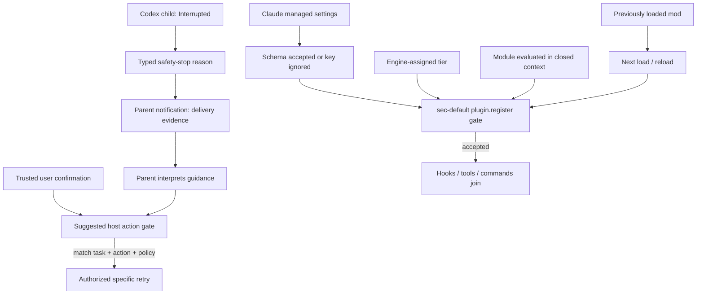

# Coding Agent：安全停止回报与模块准入验收卡

日期：2026-09-30。适用：Codex／Claude Code 升级前的隔离 POC 和 harness workshop。本文是固定源码与官方文档的静态设计，不是已运行的产品测试；全部卡片为 **NOT_RUN**。两仓都是旧来源，本次针对新的 main 分支机制，不把它们称为首次发现或稳定版已发布功能。

## 1. 先把四件事分开

| 维度 | 回答的问题 | 不能替代什么 |
|---|---|---|
| 运行状态 | 子任务是不是 Interrupted？ | 不能仅凭通知中的 Errored 文案认定实际状态变更 |
| 原因与交付 | 是否因 Guardian TooManyDenials、是否向父代理排队通知？ | 排队不证明父代理处理、用户已读或任务完成 |
| 继续执行授权 | 谁能批准哪个被阻任务继续？ | 模型可见的“先问用户”指导，不等于不可绕过的授权门 |
| 模块准入 | 当前 load/reload 是否允许注册 hooks/tools/commands？ | 不等于模块顶层零执行、不等于立即撤销已有模块 |

### 方案比较与建议

1. **仅用源码提供的通知／准入机制**：改动小，适合内部探索；依赖具体版本、配置、加载生命周期，不足以单独承担高风险工具治理。
2. **宿主执行门＋产品信号＋证据记录（推荐）**：产品负责提供停止原因或注册拒绝；宿主另行绑定 task、action、policy revision 与可信审批，阻断未授权重试。成本是需要实现/测试执行门与证据采集。此处为架构建议，不声称上游已提供这套完整合同。

技术问答可以直接答：**“通知告诉模型为什么停下，执行门决定能否继续；注册拒绝防止模块能力加入，不能据此声称从未评估过该模块代码。”**

## 2. Codex：子任务停止和父通知是不同状态

固定提交 `63475131ce5f6a479ffdf01163bd1d95873536a2`（main commit 静态模板）。`MultiAgentV2` 中，满足源码中的中断及 `TooManyDenials` 条件时，形成专门面向父代理的通知。测试比较 Strict 通知与 Default 静默，并断言子代理真实状态仍为 `Interrupted`。父通知内部可使用 Errored payload 格式化，但这不是 child watch 状态迁移。

`session_prefix.rs::format_guardian_interruption_message` 截断错误正文后附上“告知用户、在用户明确确认前不要 resume/retry”的指导。它是父代理可见文本，不是本提交已实现的不可绕过再授权检查。不同 feature/circuit-break 分支不能合成一个统一默认行为。

**版本界限**：本次读取 `rust-v0.159.0` 固定 release 源码未见该新 helper。没有下载运行发行二进制；不把 main 机制写成 0.159.0 客户已可用。

### A 组运行卡（均 NOT_RUN）

共同前置：一次性空仓库、固定源 SHA 和实际可执行 build；先确认测试入口与 feature flags。用合成 tool、错误与用户动作，不接模型密钥、客户代码或真实副作用。无 build 时仅完成设计评审，不能把源码测试已存在当 PASS。

| ID | 输入／触发 | 期望与具体观察 | 状态 |
|---|---|---|---|
| A01 | 在 MultiAgentV2 条件下触发 Strict 的 TooManyDenials 中断 | 记录实际 `AgentStatus::Interrupted`、独立 stop reason、父通知 payload；不能把通知 Errored 当状态迁移 | NOT_RUN |
| A02 | 同 A01，改为 Default 路径 | 按上游参数化测试预期不产生专门父通知；另记录实际子状态，不把静默当成功 | NOT_RUN |
| A03 | 普通人工 interrupt，不触发 TooManyDenials | 专门 Guardian 通知计数为0；普通中断事件按实际 host 记录 | NOT_RUN |
| A04 | 合成长错误文本触发 A01 | 错误受截断，而“用户明确确认前不重试”的尾部指导仍在；分别采原错误与最终通知长度，不外推字节上限 | NOT_RUN |
| A05 | 已排队通知，但父代理尚未消费 | `parent_notification=queued`、`parent_consumed=unknown`、`user_confirmed=false`；教学执行门应拒绝重试，不伪称上游已有此硬门 | NOT_RUN |
| A06 | 宿主建议门：收到任务A审批，试重跑B；随后以同审批重跑A但action已变 | 两种不匹配都拒绝；完整匹配且未失效的审批才允许指定动作。保留审批拒绝与业务测试 PASS 两栏；本卡是原创宿主合同 | NOT_RUN |

A01-A04需使用上游测试 seam 或等效受控 host 注入；不是让真实代理反复执行危险命令。A05-A06必须另外实现可信执行门后才能运行。

## 3. Claude Code：按可信 tier 在注册时拒绝 user mods

固定提交 `0d7f14dd352fa67affd4e172eb1b6f524dbd709e`（main commit 静态模板）。这是 `mods/sec-default` 的新准入机制，不是一般插件安装与所有扩展面的统一禁用开关。

以下是**隔离政策夹具**，不是要求修改真实组织设置：

```json
{
  "pluginConfigs": {
    "cc-plugin-sec-default@builtin": {
      "options": { "allowManagedModsOnly": true }
    }
  }
}
```

`hooks/register.ts` 对 `plugin.register` 的 `tier: user` 使用 policy-only settings。引擎固定的 tier 而非模块自报名称决定分类，冒用组织模块名称不会改变 user tier。

必须保留的边界：
- 已运行模块在设置变更时继续运行，直到下一次 load/reload；不是即时撤权。
- 注册被拒时没有 hook/tool/command 加入；但顶层代码此前已在 closed context 评估一次。README 称该阶段 `$` 调用不被服务，不意味着宿主所有副作用都经本卡证明为零。
- `absent` 或布尔 `false` 关闭此选项。类型有效的字符串／数字即使是 `"false"`／`0`，纯逻辑仍按开启处理，不能当作布尔解析器。
- schema 拒绝的 `null`／object（包括另一个 `pluginConfigs` entry 中的坏值）可导致整个 key 被忽略，选项变为 unset；这是 schema 丢弃，不等同于 policy 读取失败。
- policy read 被拒或本 hook 出错且尚未调用 next 时，catch 返回拒绝；`next.called` 为真时走 next 分支，不能写成任意下游错误都由本门拒绝。
- 自定义 managed `prependPlugins` 列表若漏掉 `sec-default@builtin`，不具备这个已就位的准入门；本选项不覆盖 settings hooks、status line、`/goal`。

**版本界限**：本次检查 v2.1.284 tag 的相关文件没有新门；npm next 出现 2.1.285 不证明包含该提交。未下载该包、未启动 CLI，发行包归属未核实。

### B 组运行卡（均 NOT_RUN）

共同前置：一次性 fixture workspace，固定 CLI build、登录/managed-policy 模式及 mod 测试入口。每个 mod 仅提供空 hook 与合成计数，不安装社区 bundle。原测试使用 `claude-code/testing`，不能直接声称普通 Node 即可运行完整 host 测试。

| ID | 输入／触发 | 期望与具体观察 | 状态 |
|---|---|---|---|
| B01 | policy=true，分别注册 user 模块和按引擎确定的 managed/builtin 模块；user 冒用组织名 | user 被拒且0能力加入；其他 tier 不被这条 user-only hook 拦截，不代表绕过所有其他政策；记录引擎 tier | NOT_RUN |
| B02 | 隔离 policy 依次为 unset、false、true、字符串false、数字0；再仅写project/user设置 | policy逻辑分别关闭/关闭/开启/开启/开启；非policy值不能改变此门。原始schema接收结果与有效settings另记 | NOT_RUN |
| B03 | schema-invalid null/object；分别放本entry与另一个pluginConfigs entry | 观察 settings warning、整个key是否忽略、选项effective unset；不能把此测试写为“所有错误一律拒绝” | NOT_RUN |
| B04 | 先load一个无副作用user mod，再收紧policy，不reload；随后reload | 收紧本身不宣称立即卸载；reload准入拒绝且无新注册。分别记录既有能力、评估次数、新注册次数 | NOT_RUN |
| B05 | fake settings.read抛错且next未调用；另注入next已调用后的下游失败 | 第一支拒绝并debug记录；第二支验证next.called分支，不自行规定其完整引擎恢复结果。合成错误不得含敏感内容 | NOT_RUN |
| B06 | 使用自定义prependPlugins：含sec-default vs漏掉；并单测settings hook/statusline/goal | 记录门是否实际就位；漏掉时不能宣称此选项仍生效；非覆盖面单列UNKNOWN/另审，不写通过 | NOT_RUN |

纯逻辑函数单测只能说明普通JSON输入下的选项解析；任意对象 getter/proxy、真实 managed-settings schema、引擎 tier 可信性与 closed-context 隔离必须分别验证。

## 4. 可拷贝的观察记录

下面是**未运行模板**，不是实际观测；任何 UNKNOWN/NOT_RUN 都不能被通过率计算当作 PASS。

```json
{
  "case_id": "A01",
  "evidence_kind": "template",
  "source_revision": "63475131ce5f6a479ffdf01163bd1d95873536a2",
  "executable_build": "UNVERIFIED",
  "expected_runtime_state": "Interrupted",
  "observed_runtime_state": null,
  "observed_stop_reason": null,
  "parent_notification": "unknown",
  "user_confirmed": false,
  "observed_authorization_decision": null,
  "case_status": "NOT_RUN"
}
```

## 5. 架构图模式：信息回流与执行决定分开画



图中 host action gate 是建议增加的组件；Claude链条与Codex链条是对照，不是已集成产品。评估代码、注册能力、业务调用是不同边界。

## 6. 固定证据与使用边界

以下URL已实际访问；源码测试只读，未执行。公开来源不为本文架构建议背书。

1. [Codex session_prefix.rs：format_guardian_interruption_message](https://raw.githubusercontent.com/openai/codex/63475131ce5f6a479ffdf01163bd1d95873536a2/codex-rs/core/src/session_prefix.rs)
2. [Codex guardian_subagent_notification_tests.rs：Strict/Default与Interrupted](https://raw.githubusercontent.com/openai/codex/63475131ce5f6a479ffdf01163bd1d95873536a2/codex-rs/core/tests/suite/guardian_subagent_notification_tests.rs)
3. [Codex 0.159.0固定release源码对照](https://raw.githubusercontent.com/openai/codex/687a119f0fcaace47e1f1abcc77cec6c813fd6da/codex-rs/core/src/session_prefix.rs)
4. [Claude sec-default README：load/reload、schema、执行边界、prepend](https://raw.githubusercontent.com/anthropics/claude-code/0d7f14dd352fa67affd4e172eb1b6f524dbd709e/mods/sec-default/README.md)
5. [Claude hooks/register.ts：user tier与catch分支](https://raw.githubusercontent.com/anthropics/claude-code/0d7f14dd352fa67affd4e172eb1b6f524dbd709e/mods/sec-default/hooks/register.ts)
6. [Claude v2.1.284 README对照](https://raw.githubusercontent.com/anthropics/claude-code/v2.1.284/mods/sec-default/README.md)

SA落地：技术问答复用第1-3节；POC升级门复用12卡及观察记录；架构说明复用第5节。未核实具体发行二进制、客户租户／区域／合规可用性；没有安装或生产使用建议。
