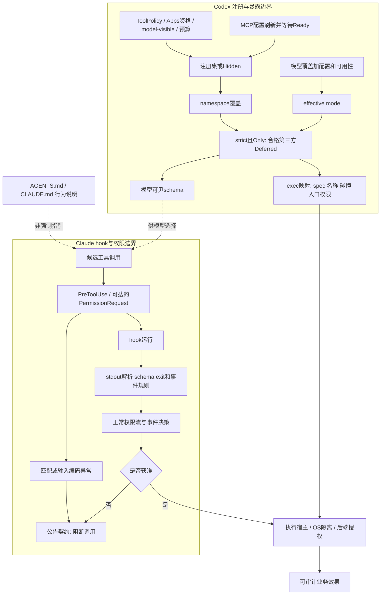

# 双CLI验收模板：工具暴露不等于授权，hook失败必须按阶段判定

日期：2026-10-04（北京时间日历日）。对象：Codex固定main机制与Claude Code 2.1.288。**本文是源码/官方契约驱动的验收设计，不是产品运行报告；所有case的observed均为NOT_RUN。未执行CLI、模型或上游测试，不以原创toy程序证明产品。**

## 1. SA可以直接讲的结论与版本边界

- **Codex：先决定工具能否进入注册集，再决定schema怎样暴露。** `code_mode_only_strict_3p_tools`只在effective CodeModeOnly成立时强制合格第三方工具Deferred；没有新授予工具权限。main提交58ae3ba的feature为UnderDevelopment、默认false，稳定0.160.0对应源码未含该项。不能宣称客户稳定版已经具备，也不能以alpha标题背书。[S1–S10]
- **Claude：入口故障与出口坏JSON是两回事。** 2.1.288公告原句：`Fixed PreToolUse and PermissionRequest hooks being skipped when matching them failed or the tool's input could not be serialized to JSON; the call is now blocked`。只覆盖指定前置阶段，不等于“所有hook错误fail-closed”。[S11,S12]
- Claude发布时间为2026-10-02 20:19:57 UTC，即北京时间10-03 04:19:57；属于相对2.1.287的版本增量，不称UTC 10-03后发布。[R1]
- Codex证据到实现+上游测试静态断言；Claude该diff改的是CHANGELOG/feed，并无运行时实现。D1是当前官方参考、不是2.1.288不可变实现快照。以下带D1的兼容性期望必须在目标产品host复验，不能将文档新增内容自动回溯为2.1.288已实现。

## 2. 真实调用链与不能省略的条件

### 2.1 Codex：注册 → 暴露 → 执行映射

1. `requested_tool_mode`首先取`model_info.tool_mode`；没有模型覆盖时才按配置features选CodeModeOnly、CodeMode或Direct。`effective_tool_mode`仅当**requested=CodeMode、code_mode_available=false且没有disable_in_process_fallback**时退回Direct。CodeModeOnly不走这条降级；这不保证执行host一定可用。[S3]
2. 生产入口`build_tool_router`用session ToolPolicy构造registry，先add_core，再`mcp_handler_cache.append_mcp_tools`，再应用MCP暴露策略，然后追加extension executors与dynamic runtimes，最后`finalize_tool_router`。测试专用`append_source_tools`不是生产入口，单独通过它不证明所有前置过滤。[S2]
3. MCP注册层先裁剪失效handler缓存，再区分普通MCP与Apps。普通MCP要求model-visible；Apps还要求apps_enabled、connector_id、AppToolPolicyEvaluator.enabled。构造spec失败直接跳过。agent-plugin有单项/合计spec预算，溢出项保留为Hidden但不入返回的合格注册集合；缓存只存不可变工具元数据，不是连接或授权快照。[S5]
4. registry外部注册检查ToolPolicy、保留名字与重复名字。`is_third_party_tool`默认false，McpHandler与DynamicToolHandler覆盖为true。故同名客户端工具不能把内置工具变成第三方；“external”标签也不自动等于这两个runtime类别。[S1,S4]
5. 对合格已注册MCP/app，strict忽略`omit_tools_from`；只在省略集合触及DEFERRED/CODE_MODE时记录特定冲突warning。finalize先执行direct-only namespace覆盖，**后**执行strict；非第三方或Hidden跳过，其余第三方置Deferred。这里没有把disabled/denied重新加入的操作。[S2]
6. exec映射首先要求有效CodeMode/Only、exposure可用于code mode；strict第三方仅豁免`excluded_tool_namespaces`。Function/Freeform、非空Namespace才有机会进入；还检查nested名称和归一化唯一性，冲突跳过。`exec`/`wait`自身注册也受ToolPolicy，严格模式不是执行权兜底。[S2,S4]
7. Deferred从eager签名列表分离，不代表工具完全消失；`supports_search_tool`还影响deferred guidance。不可泛化为“整个提示里绝无第三方元信息”。模型可见spec、exec内部目录、注册集和业务授权是四个不同观察面。[S2]

### 2.2 Claude：前置故障 → hook运行 → 输出解释 → 权限流

公告支持的是PreToolUse与PermissionRequest的**匹配过程出错**或**tool input无法编码成JSON**导致调用blocked。正常matcher不匹配是合法跳过，不是异常；模型通常提供JSON兼容参数，内部序列化故障需要真实host故障注入，不能发一段坏文本就声称触发。[S11,S12]

D1的stdout规则必须先判断是否尝试JSON解析：去空白后首尾为`{...}`才走对象解析；只有开头`{`但无结尾`}`当普通文本；数组/JSON字符串也可当普通文本。标准决策模型下，解析或schema失败在非2退出码通常non-blocking，之后仍走正常权限检查，不是自动授权。

**事件例外不能丢：PreToolUse的exit2不能被allow JSON覆盖；PermissionRequest的exit2本身不作拒绝，必须返回该事件的decision对象。** PermissionRequest需要调用确实进入权限决策；非交互模式也可能触发，无可显示提示且无决定时会拒绝；存在host并行审批时先决策者可能生效。上游文档描述的command启动失败、同步command/http/mcp_tool超时通常不阻断，不能当成2.1.288前置异常修复已覆盖。Agent SDK callback超时又有不同契约。[D1]

## 3. 信任边界图



图不是两个CLI共用一条内部管线；两栏是相同验收坐标系。真正副作用边界在执行宿主及服务端授权处，不能用提示文件或schema不可见替代。

## 4. Case卡使用约定

每卡独立列出产品、前置、刺激、expected、observed、负控与证据。`NOT_RUN`不是PASS，不以源码测试函数名、HTTP 200或示例JSON代替观测。工具/效果计数器属于受控产品测试host的观察器，不能只放在自写dispatcher里。

### C01｜严格门控正例

- **产品版本**：Codex 58ae3ba61186c39b849a6ebe60e60f4b11690373（main研究版本；非0.160.0 GA）
- **前置**：CodeModeOnly有效；strict=true；exec/wait获准；无名称冲突；合法dynamic工具。
- **输入/故障注入**：分别设置deferLoading=false/true，supports_search_tool=false/true。
- **Expected result**：工具均Deferred；无第三方直接schema；exec映射包含该工具；exec描述不含该工具eager签名。
- **Observed**：**NOT_RUN**。证据级别：`source_derived_acceptance`。
- **负控**：同输入strict=false：比较实际基线，不将基线结果预写成Deferred。
- **证据**：S1, S2, S6。

### C02｜模型覆盖优先于配置

- **产品版本**：Codex 58ae3ba61186c39b849a6ebe60e60f4b11690373（main研究版本；非0.160.0 GA）
- **前置**：配置CodeModeOnly；模型tool_mode分别Direct/CodeMode；CodeMode可用。
- **输入/故障注入**：只切strict开关，比较完整ToolPlanProbe。
- **Expected result**：两种有效mode下on==off；配置写了Only不代表严格生效。
- **Observed**：**NOT_RUN**。证据级别：`source_derived_acceptance`。
- **负控**：将判断故意替换成配置mode的变更应被此oracle识别（变更测试未执行）。
- **证据**：S2, S3, S6。

### C03｜effective mode降级条件

- **产品版本**：Codex 58ae3ba61186c39b849a6ebe60e60f4b11690373（main研究版本；非0.160.0 GA）
- **前置**：requested=CodeMode；code_mode_available=false；其他输入固定。
- **输入/故障注入**：切disable_in_process_fallback；再以requested=CodeModeOnly作对照。
- **Expected result**：fallback未禁时CodeMode降为Direct；禁用fallback时保留CodeMode；Only不会被这段函数自动降为Direct，不能由此推断host启动成功。
- **Observed**：**NOT_RUN**。证据级别：`source_derived_acceptance`。
- **负控**：禁止把“所有CodeMode不可用都降Direct”作为期望。
- **证据**：S3。

### C04｜第三方身份不看名字

- **产品版本**：Codex 58ae3ba61186c39b849a6ebe60e60f4b11690373（main研究版本；非0.160.0 GA）
- **前置**：内置update_plan已注册；外部同名dynamic；碰撞配置非致命；strict有效。
- **输入/故障注入**：同时加入无namespace且deferLoading=false的client_echo及同名update_plan。
- **Expected result**：client_echo Deferred；update_plan内置runtime仍非第三方、测试中Direct；外部重复注册被跳过。
- **Observed**：**NOT_RUN**。证据级别：`source_derived_acceptance`。
- **负控**：若启用error_on_tool_collisions，允许配置报错而非要求同一成功结果；名称前缀归类不能冒充runtime归类。
- **证据**：S1, S2, S4, S6。

### C05｜namespace override次序与exec排除

- **产品版本**：Codex 58ae3ba61186c39b849a6ebe60e60f4b11690373（main研究版本；非0.160.0 GA）
- **前置**：合格dynamic/MCP；strict有效；direct_only与excluded namespace均覆盖它。
- **输入/故障注入**：完成全部finalize路径，而非单测enforce helper。
- **Expected result**：direct-only先应用，strict随后恢复Deferred；excluded例外保留exec route；仍须满足spec形状、nested名称及归一化唯一性。
- **Observed**：**NOT_RUN**。证据级别：`source_derived_acceptance`。
- **负控**：strict=false保留原namespace行为；仅测helper不得宣称全链通过。
- **证据**：S2, S6, S8。

### C06｜omit-all不是禁用

- **产品版本**：Codex 58ae3ba61186c39b849a6ebe60e60f4b11690373（main研究版本；非0.160.0 GA）
- **前置**：MCP/app已通过注册资格；strict有效。
- **输入/故障注入**：分别omit deferred、code_mode以及direct/deferred/code_mode全部。
- **Expected result**：忽略暴露省略配置；合格工具仍Deferred并可经exec发现；冲突警告为tracing诊断。
- **Observed**：**NOT_RUN**。证据级别：`source_derived_acceptance`。
- **负控**：真正enabled=false或policy拒绝见C07/C08，不能与omit-all混用。
- **证据**：S2, S7, S8。

### C07｜disabled与app-only不可复活

- **产品版本**：Codex 58ae3ba61186c39b849a6ebe60e60f4b11690373（main研究版本；非0.160.0 GA）
- **前置**：按上游Calendar场景准备lookup、disabled、app_only；apps开启；disabled enabled=false；app_only UI visibility仅app。
- **输入/故障注入**：strict=true且app omit deferred；捕获ALL_TOOLS与实际dispatch结果。
- **Expected result**：目录仅lookup并得到它的结果；disabled/app_only不入可用集；非app MCP同样先做model-visible过滤。
- **Observed**：**NOT_RUN**。证据级别：`source_derived_acceptance`。
- **负控**：合格lookup必须成功，否则“全部工具都坏了”会假装通过拒绝测试。
- **证据**：S5, S7。

### C08｜policy-denied不等于Hidden

- **产品版本**：Codex 58ae3ba61186c39b849a6ebe60e60f4b11690373（main研究版本；非0.160.0 GA）
- **前置**：ToolPolicy仅允许exec/wait、allowed_mcp、allowed_dynamic与一个Hidden预算项。
- **输入/故障注入**：追加allowed及denied MCP/dynamic，走注册与finalize。
- **Expected result**：denied根本未注册；allowed为Deferred；exec映射不含denied；strict不新增授权。
- **Observed**：**NOT_RUN**。证据级别：`source_derived_acceptance`。
- **负控**：从allowlist移除allowed应使其消失；只看模型未显示不能证明拒绝生效。
- **证据**：S4, S6。

### C09｜预算Hidden保留

- **产品版本**：Codex 58ae3ba61186c39b849a6ebe60e60f4b11690373（main研究版本；非0.160.0 GA）
- **前置**：agent-plugin MCP spec超过单项或合计预算；普通可用工具作正控。
- **输入/故障注入**：经过append_mcp_tools，再namespace覆盖与strict。
- **Expected result**：超预算项可留registry但exposure=Hidden，不进入registered_mcp_tools合格集合与exec映射；不是omit配置产生的Hidden。
- **Observed**：**NOT_RUN**。证据级别：`source_derived_acceptance`。
- **负控**：移除Hidden保护的变更应被oracle拒绝；普通非agent-plugin不能套用此预算断言。
- **证据**：S5, S6。

### C10｜route不是只要Deferred就存在

- **产品版本**：Codex 58ae3ba61186c39b849a6ebe60e60f4b11690373（main研究版本；非0.160.0 GA）
- **前置**：strict有效；注册合法；能构造归一化名称冲突或不支持spec的受控上游测试接口。
- **输入/故障注入**：分别观察暴露、code_mode_tool_names与exec是否获准。
- **Expected result**：Function/Freeform或非空Namespace且nested名称合格、归一化未冲突才入映射；exec被ToolPolicy拒绝时不能宣称可执行。
- **Observed**：**NOT_RUN**。证据级别：`source_derived_acceptance`。
- **负控**：保留至少一个合法无冲突正例；将“全部Deferred=>全部可执行”作为待拒绝错误结论。
- **证据**：S2, S4。

### C11｜目录新增→替换→移除

- **产品版本**：Codex 58ae3ba61186c39b849a6ebe60e60f4b11690373（main研究版本；非0.160.0 GA）
- **前置**：上游scenario的mock响应与MCP服务；同一运行中执行环境；Responses Lite；strict；非真实模型。
- **输入/故障注入**：before无MCP→ready lookup→changed同名server新endpoint resolve/search→gone移除；每次refresh=Published，非空端点等待Ready。
- **Expected result**：四阶段枚举及枚举后dispatch结果精确为[]/[lookup]/[resolve,search]/[]；8个捕获请求additional_tools非空且完全相等。
- **Observed**：**NOT_RUN**。证据级别：`upstream_test_read_NOT_RUN`。
- **负控**：延迟刷新或保留旧lookup必须失败；不能只比description或归一化snapshot hash。
- **证据**：S8。

### C12｜显式调用旧工具的加强验收

- **产品版本**：Codex 58ae3ba61186c39b849a6ebe60e60f4b11690373（main研究版本；非0.160.0 GA）
- **前置**：C11已完成；客户受控host可提交旧工具名；独立后端计数器。
- **输入/故障注入**：changed/gone阶段显式尝试旧lookup名称；不只遍历当前目录。
- **Expected result**：客户门禁要求拒绝旧路由且旧后端effect_count=0；属于额外验收要求，S8未直接尝试旧名称，不能声称源码测试已证明。
- **Observed**：**NOT_RUN**。证据级别：`proposed_host_gate_NOT_RUN`。
- **负控**：ready阶段旧lookup成功且计数递增；否则负例不具判别力。
- **证据**：S2, S8。

### C13｜诊断不污染模型提示

- **产品版本**：Codex 58ae3ba61186c39b849a6ebe60e60f4b11690373（main研究版本；非0.160.0 GA）
- **前置**：strict有效；制造eager->Deferred与omit冲突；有诊断捕获。
- **输入/故障注入**：对比诊断日志、完整模型可见schema及exec描述。
- **Expected result**：诊断含对应warning；模型提示不含warning文案；上游单测直接覆盖exec.description，完整请求扫描为加强项。
- **Observed**：**NOT_RUN**。证据级别：`source_derived_acceptance`。
- **负控**：只omit direct不保证触发“省略deferred/code_mode”那条warning；不得要求所有省略都同一日志。
- **证据**：S2, S6, S7。

### C14｜稳定版不可冒充main

- **产品版本**：Codex 58ae3ba61186c39b849a6ebe60e60f4b11690373（main研究版本；非0.160.0 GA）
- **前置**：稳定0.160.0源码SHA=a956835d020762cb2b570053af06f643a11c0ecc。
- **输入/故障注入**：核对feature表与annotated tag对象，不安装CLI。
- **Expected result**：strict feature在固定main diff新增、UnderDevelopment且默认false；0.160.0对应feature表无此项。源码入包范围不等于已检查二进制字节。
- **Observed**：**NOT_RUN**。证据级别：`source_release_comparison`。
- **负控**：仅alpha标题、同日release或启用未知flag均不能作为此机制已交付证据。
- **证据**：S1, S9, S10, D2。

### A01｜PreToolUse匹配过程异常

- **产品版本**：目标 Claude Code 2.1.288；D1 为 live docs 兼容性参考，非 2.1.288 固定实现，须在目标 host 复验
- **前置**：确认PreToolUse事件已到达；官方/厂商支持的真实匹配器故障注入接口；正常权限正控允许。
- **输入/故障注入**：令匹配过程报错；不是普通matcher返回“不匹配”。
- **Expected result**：2.1.288公告期望调用blocked；独立工具effect_count=0。具体异常类型及注入入口未公开核实。
- **Observed**：**NOT_RUN**。证据级别：`release_contract_NOT_RUN`。
- **负控**：合法不匹配应正常跳过该hook、进入权限流，不能一律block。
- **证据**：S11, S12, D1。

### A02｜PreToolUse输入序列化异常

- **产品版本**：目标 Claude Code 2.1.288；D1 为 live docs 兼容性参考，非 2.1.288 固定实现，须在目标 host 复验
- **前置**：真实host序列化边界注入可用；正常tool input/权限路径已通过。
- **输入/故障注入**：在送hook前使tool input序列化JSON失败。
- **Expected result**：调用blocked且effect_count=0；这是输入编码失败，不是hook stdout坏JSON。
- **Observed**：**NOT_RUN**。证据级别：`release_contract_NOT_RUN`。
- **负控**：有效JSON输入+无阻断hook走正常权限流；不可把模型文本“NaN”当作内部不可序列化对象证据。
- **证据**：S11, S12。

### A03｜PermissionRequest匹配异常

- **产品版本**：目标 Claude Code 2.1.288；D1 为 live docs 兼容性参考，非 2.1.288 固定实现，须在目标 host 复验
- **前置**：工具确实进入PermissionRequest路径；无抢先决策host竞争；事件到达可观测。
- **输入/故障注入**：仅让该事件的匹配过程异常。
- **Expected result**：2.1.288公告期望调用blocked且effect_count=0；若事件根本未触发，应记录NOT_RUN/不可达，不能PASS。
- **Observed**：**NOT_RUN**。证据级别：`release_contract_NOT_RUN`。
- **负控**：匹配正常且合法decision.allow、无匹配deny规则时作允许正控。
- **证据**：S11, S12, D1。

### A04｜PermissionRequest输入编码异常

- **产品版本**：目标 Claude Code 2.1.288；D1 为 live docs 兼容性参考，非 2.1.288 固定实现，须在目标 host 复验
- **前置**：同A03，且有真实输入序列化故障注入接口。
- **输入/故障注入**：匹配正常，在传递hook输入JSON前注入序列化失败。
- **Expected result**：blocked、effect_count=0；与PermissionRequest hook自身退出2的语义不同。
- **Observed**：**NOT_RUN**。证据级别：`release_contract_NOT_RUN`。
- **负控**：正常输入+可控权限批准应执行一次；不用自写dispatcher替代产品。
- **证据**：S11, S12, D1。

### A05｜输出JSON解析错误非阻断

- **产品版本**：目标 Claude Code 2.1.288；D1 为 live docs 兼容性参考，非 2.1.288 固定实现，须在目标 host 复验
- **前置**：同步command PreToolUse；正常匹配与输入；无其他拒绝；正常权限设置允许。
- **输入/故障注入**：exit=0，stdout精确为{bad}（首尾大括号保证尝试JSON解析）。
- **Expected result**：标准决策模型：记录non-blocking parse error、继续正常权限流；正控权限允许时effect_count=1，而非将error等同allow。
- **Observed**：**NOT_RUN**。证据级别：`official_docs_contract_NOT_RUN`。
- **负控**：保持同stdout只将exit改2：PreToolUse应阻断；stdout只有{则按D1是普通文本，不是同一解析失败。
- **证据**：D1。

### A06｜输出schema错误非阻断

- **产品版本**：目标 Claude Code 2.1.288；D1 为 live docs 兼容性参考，非 2.1.288 固定实现，须在目标 host 复验
- **前置**：同A05。
- **输入/故障注入**：exit=0；stdout为{"hookSpecificOutput":{"hookEventName":"PreToolUse","permissionDecision":"INVALID"}}。
- **Expected result**：对象可解析但schema校验失败；non-blocking validation error；正常权限流继续。
- **Observed**：**NOT_RUN**。证据级别：`official_docs_contract_NOT_RUN`。
- **负控**：改成合法deny应阻断；改exit=2即使schema非法仍阻断（PreToolUse）。
- **证据**：D1。

### A07｜PreToolUse exit2优先级

- **产品版本**：目标 Claude Code 2.1.288；D1 为 live docs 兼容性参考，非 2.1.288 固定实现，须在目标 host 复验
- **前置**：同步command PreToolUse已执行。
- **输入/故障注入**：exit=2，stdout给合法permissionDecision=allow；另跑exit=2+非法schema。
- **Expected result**：两者均阻断；allow不能覆盖exit2；非法schema情形stderr作为阻断理由、校验错误记debug。
- **Observed**：**NOT_RUN**。证据级别：`official_docs_contract_NOT_RUN`。
- **负控**：exit=0+合法allow且无其他deny作正控；这不是2.1.288首次新增规则。
- **证据**：D1。

### A08｜PermissionRequest exit2例外

- **产品版本**：目标 Claude Code 2.1.288；D1 为 live docs 兼容性参考，非 2.1.288 固定实现，须在目标 host 复验
- **前置**：PermissionRequest可达；正常权限流程由受控host批准；避免竞争决策。
- **输入/故障注入**：hook exit=2但不返回decision对象。
- **Expected result**：D1明确exit2在该事件不作为拒绝，权限流不变且stderr丢弃；不能套用PreToolUse规则。
- **Observed**：**NOT_RUN**。证据级别：`official_docs_contract_NOT_RUN`。
- **负控**：返回合法hookSpecificOutput.decision.behavior=deny应拒绝；在无交互无人批准环境最终拒绝不证明exit2生效。
- **证据**：D1。

### A09｜hook未启动与超时不能冒充前置fail-closed

- **产品版本**：目标 Claude Code 2.1.288；D1 为 live docs 兼容性参考，非 2.1.288 固定实现，须在目标 host 复验
- **前置**：PreToolUse同步command；受控权限允许；禁用外部网络与真实业务效果。
- **输入/故障注入**：hook路径不可执行/不存在导致如127；或合法启动后受控timeout。
- **Expected result**：D1：大多数事件启动失败非阻断；PreToolUse command/http/mcp_tool超时不阻断而回正常权限流；不归入2.1.288匹配/输入编码修复。
- **Observed**：**NOT_RUN**。证据级别：`official_docs_contract_NOT_RUN`。
- **负控**：Agent SDK callback超时在D1有不同阻断语义；不能混用类型作产品反例。
- **证据**：D1。

### A10｜PermissionRequest事件与决策形状

- **产品版本**：目标 Claude Code 2.1.288；D1 为 live docs 兼容性参考，非 2.1.288 固定实现，须在目标 host 复验
- **前置**：确认实际需要权限；记录交互模式与是否有canUseTool/permission-prompt-tool；无真实模型。
- **输入/故障注入**：合法decision.behavior=deny；对照只返回PreToolUse的permissionDecision字段。
- **Expected result**：仅该事件支持的decision对象可作允许/拒绝契约；D1说明非交互也可触发，若无决策且无法显示提示则拒绝；并行host先决策的竞争需隔离。
- **Observed**：**NOT_RUN**。证据级别：`official_docs_contract_NOT_RUN`。
- **负控**：不得把“非交互一定不触发”写入测试前置；不得把别的事件字段当有效deny。
- **证据**：D1。

## 5. [→harness] 可复制作业说明

> 作业：复制本节与case卡到团队验收任务，不把它当作可执行产品命令。目标是建立**版本锁定 → 可达性证明 → 独立oracle → 副作用证据**，而非生成一个永远PASS的模拟器。
>
> 1. 锁定Codex源码SHA与目标host构建标识，Claude精确版本及平台；记录配置mode、模型覆盖mode、effective mode、strict flag、hook事件/类型、交互模式、策略摘要和模型调用预算。本轮模板要求模型预算为0。
> 2. 先做C01/C07允许正控及A05正常权限允许正控，证明执行/计数路径可用；再做拒绝、异常、Hidden与负控。固定相同其他输入，拒绝测试不能因host根本没启动而通过。
> 3. Codex优先复用S6/S7/S8的上游测试入口及官方mock响应，不重新实现语义。准备时只读；运行上游测试、构建/安装、启动host需另行批准。真实模型调用不是这些验收的必要前置。
> 4. Claude的A01–A04必须由真实产品内部注入或厂商支持的测试接口完成。若无法取得，保留NOT_RUN并把该产品回归验收列为未满足；不能用自写hook脚本抛异常来冒充“匹配器/输入编码失败”。可测试输出路径不代表能测试输入前置路径。
> 5. C11保存8个实际请求的完整additional_tools、四阶段目录与dispatch输出、refresh结果与Ready事件；另做C12显式旧名调用。原始数据先脱敏，发布只含必要字段与证据摘要，不发布凭证、会话路径或客户数据。
> 6. 每个结果使用下方记录格式；expected在执行前冻结，observed由可信host采集。FAIL必须包含oracle不符；启动失败/无法注入/跳过不能计作业务PASS。状态字段、程序退出码和业务ALLOW/DENY分开。
> 7. 技术门禁：每个必选case的正控和负控均有host证据才可将整体验收标PASS；关键case存在NOT_RUN时整体验收为INCOMPLETE，不是“附限制通过”。用受保护CI/发布审批实现门禁，而非依赖模型自报。

### 上游验收入口（名称用于定位，不是执行命令）

| 文件证据 | 确切测试函数 | 对应卡 |
|---|---|---|
| S6 | `strict_defers_third_party_tools_despite_caller_settings_and_logs_overrides` | C01、C04、C05、C13 |
| S6 | `strict_flag_does_nothing_outside_effective_code_mode_only` | C02 |
| S6 | `strict_finalization_cannot_resurrect_hidden_or_policy_denied_tools` | C08、C09 |
| S7 | `strict_ignores_app_omissions_but_preserves_app_access` | C06、C07 |
| S8 | `strict_3p_mcp_refresh_preserves_cache_while_exec_tracks_available_tools` | C11 |

C03/C10来自完整实现条件的补充验收，C12是增强host门禁；不能把它们记成已有同名上游回归已通过。Claude前置故障没有公开核实的同等运行时测试入口。

以下是**记录schema示例，不是观测输出**：

```json
{
  "case_id": "A02",
  "product": "Claude Code",
  "version": "2.1.288",
  "evidence_kind": "host_fault_injection",
  "event": "PreToolUse",
  "stage": "serialize_input",
  "expected": {"decision": "BLOCK", "effect_count": 0},
  "observed": null,
  "status": "NOT_RUN",
  "fault_injection_reached": null,
  "positive_control_passed": null,
  "negative_control_passed": null,
  "model_calls": 0,
  "evidence_digest": null
}
```

### 最小AGENTS.md / CLAUDE.md内容（同义双份即可）

```text
报告必须分开列Expected与Observed；未执行写NOT_RUN，不写PASS。
工具未暴露不代表未授权；hook错误必须说明输入/输出阶段、事件与类型。
只在任务已批准的工作副本内变更；不输出凭证或客户原始数据。
完成前提交case ID、产品版本、验证结果与残余限制供独立验收。
```

这些是**非安全强制的行为说明**，不是沙箱、ACL、可靠授权门禁或跨CLI文件自动加载承诺。仓库/CI权限、出口控制、工具服务端授权与受保护结果采集必须在模型之外配置。不要在两个文件里互相宣称对方已强制执行。

## 6. SA技术问答与POC签收

**Q：strict是不是MCP安全开关？** 不是。它调整合格第三方的schema暴露；disabled/policy-denied仍由前面的资格门禁处理。若客户想禁止工具，使用真实访问控制并测直接调用拒绝，不要仅配置omit_tools_from。[C06–C10]

**Q：为何配置Only但strict没效果？** 先看模型tool_mode覆盖与effective mode，再看feature，最后看runtime类别、Hidden和host可用性；仅贴config截图不足。[C01–C04]

**Q：目录变化但prompt前缀不变，是否已证明节省token？** 没有。S8比较捕获的additional_tools字段并枚举调用当前工具；未测真实缓存命中、计费token或吞吐，也不测试executor重启。[C11]

**Q：2.1.288能否承诺所有hook故障都阻断？** 不能。前置匹配/输入编码是公告新增阻断；输出坏JSON、启动失败、超时、PermissionRequest exit2均要按事件和类型解释。[A01–A10]

**Q：如果只有公开Claude二进制，无法注入序列化异常怎么办？** 如实标NOT_RUN，保留公告证据及厂商回归需求；仅输出错误测试通过不得宣称前置故障通过。不要发明内部入口。[A02,A04]

| POC验收项 | 必要证据 | 当前结论 |
|---|---|---|
| 版本与可用性 | Codex实际build/feature、Claude版本及D1快照 | 文档/源码已定位；host NOT_RUN |
| 暴露与准入分离 | C01、C05–C10正负控与注册/执行两面证据 | NOT_RUN |
| 动态目录与旧路由 | C11全部请求、refresh/Ready；C12旧名拒绝 | NOT_RUN |
| 前置错误阻断 | A01–A04真实host注入、入口到达、零副作用 | NOT_RUN |
| 输出错误及事件例外 | A05–A10输出字节、exit、事件、权限流 | NOT_RUN |
| 安全边界 | OS/后端授权独立验证，CI禁止NOT_RUN冒充PASS | 本文不给生产安全认证 |

## 7. 来源与复核声明

源码和diff全部使用完整固定SHA链接；官方在线docs与release发布时间API没有可用的同等SHA版本端点，明确列为**可变官方来源例外**，不伪装为不可变。每条公开引用的curl状态、最终URL、UTC复核时间及正文SHA-256在同目录`coding-agent-tool-exposure-and-hook-failure-gates-2026-10-04.links.json`，claims JSON把每条结论与case映射到source ID。HTTP成功只证明可达，不证明产品验收通过。

- **S1** [Codex exact diff](https://github.com/openai/codex/commit/58ae3ba61186c39b849a6ebe60e60f4b11690373.diff) — `fixed_sha`
- **S2** [spec_plan.rs：123–291、369–598、850–974](https://raw.githubusercontent.com/openai/codex/58ae3ba61186c39b849a6ebe60e60f4b11690373/codex-rs/core/src/tools/spec_plan.rs) — `fixed_sha`
- **S3** [tools/mod.rs：requested/effective_tool_mode 75–97](https://raw.githubusercontent.com/openai/codex/58ae3ba61186c39b849a6ebe60e60f4b11690373/codex-rs/core/src/tools/mod.rs) — `fixed_sha`
- **S4** [registry.rs：CoreToolRuntime；344–418注册门禁](https://raw.githubusercontent.com/openai/codex/58ae3ba61186c39b849a6ebe60e60f4b11690373/codex-rs/core/src/tools/registry.rs) — `fixed_sha`
- **S5** [mcp_tool_exposure.rs：64–198过滤与预算](https://raw.githubusercontent.com/openai/codex/58ae3ba61186c39b849a6ebe60e60f4b11690373/codex-rs/core/src/mcp_tool_exposure.rs) — `fixed_sha`
- **S6** [strict第三方单元测试](https://raw.githubusercontent.com/openai/codex/58ae3ba61186c39b849a6ebe60e60f4b11690373/codex-rs/core/src/tools/spec_plan_strict_third_party_tests.rs) — `fixed_sha`
- **S7** [app授权集成测试](https://raw.githubusercontent.com/openai/codex/58ae3ba61186c39b849a6ebe60e60f4b11690373/codex-rs/core/tests/suite/app_tool_exposure_strict_tests.rs) — `fixed_sha`
- **S8** [MCP目录刷新scenario](https://raw.githubusercontent.com/openai/codex/58ae3ba61186c39b849a6ebe60e60f4b11690373/codex-rs/core/tests/suite/scenarios_strict_3p_cache.rs) — `fixed_sha`
- **S9** [0.160.0对应源码feature表](https://raw.githubusercontent.com/openai/codex/a956835d020762cb2b570053af06f643a11c0ecc/codex-rs/features/src/lib.rs) — `fixed_sha`
- **S10** [0.160.0 annotated tag对象](https://api.github.com/repos/openai/codex/git/tags/79b1b666f2e8551f8abbbca34957227f67f3f553) — `fixed_sha`
- **S11** [Claude 2.1.288 exact changelog diff](https://github.com/anthropics/claude-code/commit/1c229fcd1e1e4e452e29a8f116b45fe4cfe2c528.diff) — `fixed_sha`
- **S12** [Claude 2.1.288固定changelog](https://raw.githubusercontent.com/anthropics/claude-code/1c229fcd1e1e4e452e29a8f116b45fe4cfe2c528/CHANGELOG.md) — `fixed_sha`
- **D1** [Claude官方Hooks参考：Exit code output / PermissionRequest](https://code.claude.com/docs/en/hooks.md) — `official_live_docs`
- **D2** [Codex官方changelog](https://developers.openai.com/codex/changelog) — `official_live_docs`
- **R1** [Claude官方release元数据（published_at）](https://api.github.com/repos/anthropics/claude-code/releases/tags/v2.1.288) — `official_release_metadata`

### 逐条链接复核结果（UTC）

| 来源 | HTTP | 正文复核时间 | 正文 SHA-256 | canonical redirect |
|---|---|---|---|---|
| S1 | 200 | 2026-10-03T19:13:48.681886+00:00 | `1c95899e4dec17772d17fdbeb4e66580a3a96970da7b7c0f7ebfd520053d7324` | 无 |
| S2 | 200 | 2026-10-03T19:13:48.682082+00:00 | `87825bf65fddf7ca856823c8fff631d27936232621fce1dd4e2ac5d0d1bd19d7` | 无 |
| S3 | 200 | 2026-10-03T19:13:48.682547+00:00 | `510635e3ae67e4c63e1feaf6d645f25dc2590f54391645dddeec0a84c1d17616` | 无 |
| S4 | 200 | 2026-10-03T19:13:48.684139+00:00 | `c51d069d46af8d0961c4a7555b477bbab303dc2c3a0afcdf1441ecdb570edc05` | 无 |
| S5 | 200 | 2026-10-03T19:13:48.687906+00:00 | `1011a3a223c88fa27f5084af64057c9c4ac29399c120e2a820e215f94a07c5b3` | 无 |
| S6 | 200 | 2026-10-03T19:13:48.814671+00:00 | `3da18d48cbf2c33cbedd855fefeaf8ed7d1bcdbdf1afd263d4be4e3283b89c42` | 无 |
| S7 | 200 | 2026-10-03T19:13:48.823301+00:00 | `b600dbba5e6910dfa25e087270a9281c4c6e35b1ca0bcb31b5279977fa3f6cec` | 无 |
| S8 | 200 | 2026-10-03T19:13:49.158556+00:00 | `17cacf51b773c8aa99d6ac346f60364c98d9590b7f94498c5fad27e13df12b86` | 无 |
| S9 | 200 | 2026-10-03T19:13:49.183706+00:00 | `124c76d1fbad7b05fd78a62b89a28282c7ecab1de7426ac18696987024ddeae0` | 无 |
| S10 | 200 | 2026-10-03T19:13:49.190230+00:00 | `8527d47f09dae2714fb8a3c2bb44adc06c4c2f975ee554f6ac9864b4795b24a3` | 无 |
| S11 | 200 | 2026-10-03T19:13:49.194856+00:00 | `d8b2089aae7ba3b7e087e94e83d77d898d3a0f2dd6c0a364b3fa50659d91e9aa` | 无 |
| S12 | 200 | 2026-10-03T19:13:49.197957+00:00 | `c2073a2eb811b9322317fe8496bfa38634984a3de1147cc8ef3439f91e0be9a1` | 无 |
| D1 | 200 | 2026-10-03T19:13:49.398229+00:00 | `755e30355fb80abada5a6a5ec10fe491cc1a57bf123232c80d1cc68312869ae5` | 无 |
| D2 | 200 | 2026-10-03T19:13:49.588879+00:00 | `8bf25642e6785842eb5564f99e4d92aaa5a1489c49ac263f84231ade176b0d36` | 308 → [https://learn.chatgpt.com/docs/changelog](https://learn.chatgpt.com/docs/changelog) → 200 |
| R1 | 200 | 2026-10-03T19:13:49.594519+00:00 | `21b7a7c8ee11a95e24b5bce8336b84f63e1394f2135cc6aeb936a381a206aa29` | 无 |

上表直接摘录既有 links JSON；摘要绑定已抓取正文，不能将 live docs 固定为某个产品版本的实现。

### 伴随文件完整性

| 公开 companion | 文件原始字节 SHA-256 |
|---|---|
| [claims JSON](coding-agent-tool-exposure-and-hook-failure-gates-2026-10-04.claims.json) | `010f1a8b87e6d779209127945529253b0814d6735f25d1cad3b218830f1c659c` |
| [links JSON](coding-agent-tool-exposure-and-hook-failure-gates-2026-10-04.links.json) | `904d81dd146ceb2c3b4bbe63a72424dff67456a85bbb2561ca369527ec1350e0` |
