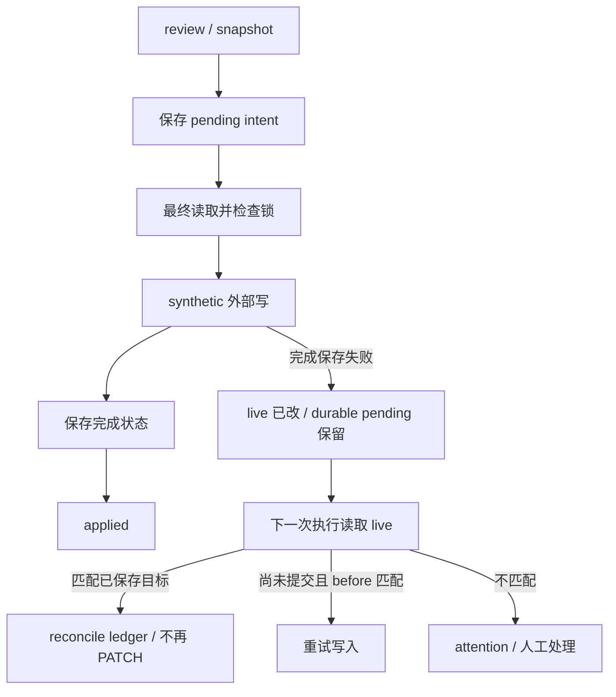
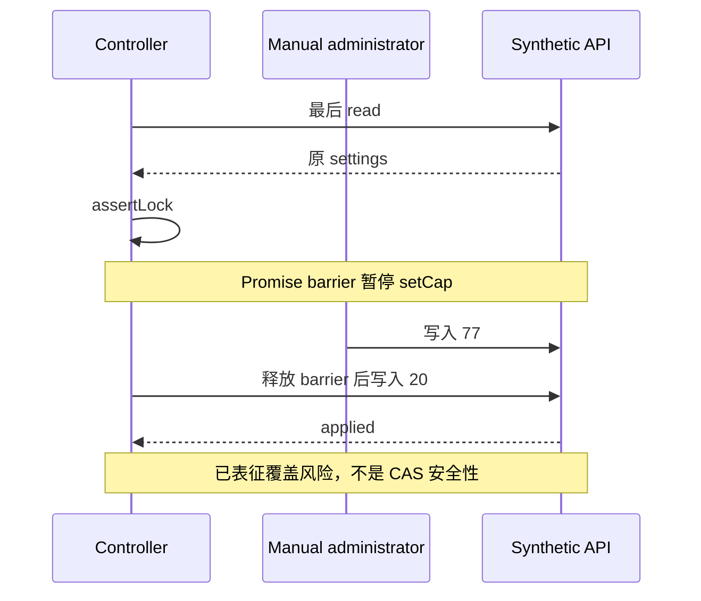

# Cookbook Budget Reconciliation Lab
## 固定源码的六案例、三变异公开实验 · 2026-10-05

**运行状态：2026-10-05旧版入口已完成预置、哈希核验输入下的离线复演；当前修订完整入口NOT_RUN。** 历史fresh restager、Node version、六案例baseline、三变异及各自无关控制均有独立执行证据；历史复演没有重新联网获取源码、下载Node、pull镜像或安装依赖。2026-10-06将第9节mutation完整性校验改为显式异常，并独立验证抽取的原样Python builder：在fresh合成目录中将固定commit、哈希匹配的controller源码仅作为字节数据，分别使用正常模式、PYTHONOPTIMIZE=1及python3 -O；每种模式均生成M1/M2/M3且输出SHA匹配，首个M1的非法ID、错误原hash、错误occurrences及错误输出hash四项负控均以指定ValueError拒绝，写前失败时全部副本与测试字节不变。三种模式共15次builder调用通过；不是15个业务test，也不是产品实验。未执行controller、restager、Node/Docker runner或六案例业务复演；写后回读故障注入、-OO及PYTHONOPTIMIZE=2的动态测试未运行。下文“本次复演”及PASS/KILL均指2026-10-05历史结果，不覆盖修订入口。真实API及调度触发仍NOT_RUN。本实验不是生产部署教程，也不是漏洞披露或新安全保证。

固定对象：OpenAI Cookbook 的 `examples/chatgpt/daily_usage_limits/`，完整 commit 为 `0eac1447d4e24d06e47c459ca5e98f248b9413cf`。七个源码模块由读者按固定 URL 获取；本包不附大份 raw、源码副本、上游测试、运行时、凭据或完整历史报告。无需克隆仓库、无需 npm。

### 1. 已有结果与本次范围

`prior-results.json` 是既有执行证据的精简摘录，保留报告及原始输出哈希，不冒充独立可验证的完整原始报告。本次没有重新运行这些测试。

- 既有上游范围：121 tests，121 PASS，0 FAIL；这是另一次执行，不等于本公开实验运行上游整个仓库。
- 既有原创扩展：Node v24.21.0，六个顶层 test 全 PASS；每个都有独立 fixture 负控，负控内嵌，不能另计成十二个 tests。
- 三个指定单点变异均在指定业务断言失败，各自无关 case 控制 PASS。主断言提前失败后的内嵌负控未执行，不能声称通过。
- 本次便携入口已用预置、哈希匹配源码和Node独立复演；在线GET/下载未在复演时重复。上游121 tests是另一执行范围，不合并成此次六案例总数；内嵌负控不另计tests。

原创 test 保持 **10526 字节**，SHA-256：
`61724a7dcb74021124a3ffba6f8d198cea190e0ab0eafa26749d06b182bfef5f`。

### 2. 可验证的 POC：预期、观测、负控和边界

表中 PASS 均指既有执行，而非本公开包复演。`attempts` 是 synthetic setCap/restore 调用数，`writes` 是合成提交记录，不是 HTTP 请求实测。时间由注入时钟控制，交错由 Promise barrier 控制，不靠 sleep。

|Case / test 行|实验与预期；既有观测|独立负控|边界|
|---|---|---|---|
|C1 / 61–80|外部写成功，完成 putState 提交前失败；留下 pending，重试 reconciled 且不新增 PATCH；PASS|before-write 失败必须真正写一次|单次保存失败模型，不是数据库半提交或进程崩溃证明|
|C2 / 82–104|已提交和未提交 pending 的 preview 不改变 live/ledger、不尝试 PATCH；PASS|apply=true 可 reconcile 并改变 ledger|preview 允许新增 receipt，不能称全局无副作用|
|C3 / 106–136|最后 controller read 后管理员写 77，controller 随后写 20 并 applied；PASS|同一编辑移到最后 read 前：FINAL_READ_CONFLICT，零 PATCH|覆盖风险的已表征限制；不是 CAS 保证，更不是新的生产漏洞发现|
|C4 / 138–158|restore 前 current amount 或继承 source 身份改变：MANUAL_ADMIN_CHANGE_CONFLICT，增量零 PATCH；PASS|不变更的独立 fixture 精确恢复 before.settings|自然路径先命中 last/current 比较，未独立覆盖 ORIGINAL_INHERITED_SOURCE_CHANGED|
|C5 / 160–177|最后 read barrier 中超过 review 窗口 1ms：INITIAL_PREVIEW_EXPIRED_RECAPTURE、零 PATCH、pending 保留；PASS|精确十五分钟边界的 controller+synthetic 允许写|仅首次 newIntent 最终复核；生产 adapter 的 notAfter 截止边界不同|
|C6 / 179–199|observed_headroom 已消费 slot 后 usage 改变：duplicate_slot、cap/ledger 不变、零增量 PATCH；PASS|下一 slot 同样 usage 可产生新 cap 和一次写|单一 MemoryStore；不证明分布式幂等或人工写 fencing|

#### 三个变异的业务判据

`mutation-patches.json` 只含可审阅的单点替换及前后哈希，不附变异源码。它是实验故障注入，不是修复补丁。

|变异|改动|指定错误与既有差异|无关控制|
|---|---|---|---|
|M1|禁用 completed 分支|C1，行65，`C1_BUSINESS_RECONCILE`；status 实际 attention，期望 reconciled|C6 PASS|
|M2|禁用 completed pending 的 preview 早退|C2，行90，`C2_BUSINESS_PREVIEW_LEDGER_IMMUTABLE`；ledger 新增 last/lastSlot，清空 pending|C6 PASS|
|M3|禁用 duplicate_slot 早退|C6，行186，`C6_BUSINESS_DUPLICATE_ZERO_PATCH`；调用数实际2，期望1|C1 PASS|

M1 的 `PENDING_WRITE_CONFLICT` 是静态控制流推导，不是原始输出直接打印的 code。有效 kill 必须匹配指定 case、message、源码行、唯一 `AssertionError [ERR_ASSERTION]`；语法/import、超时、OOM、barrier 未到达、取消、容器启动/清理失败一律 INVALID，不算 kill。`BusinessOracleFailure` 只是结果分类，不是测试中新增的错误类。三个手选变异不能代表全局缺陷发现率。

### 3. 状态图与竞态图



这里的 durable 仅指 fixture 保存的状态在一次调用失败后保留，不表示磁盘、数据库或跨进程持久性。PATCH 与完成状态保存不是同一事务。



真实 admin-api 中还有额外 read/expectedSettings 比较；C3 **未调用生产 adapter**。不能把发生在其额外 read 之前的相同编辑直接外推为会被生产写覆盖。非原子 read/write 本身也不能证明服务端条件写语义；本实验没有实测远端接口。

### 4. Q&A：架构选择与适用范围

**Q1：为何写前保存 intent？** 保存绝对目标，为“外部成功但完成保存失败”的窗口提供 reconciliation 依据；这不使两个系统成为原子事务。

**Q2：为何 reconcile 不再 PATCH？** 已提交 pending 与 live 匹配时，只完成 ledger；否则重复写可能产生额外影响。C1/NC1 区分已提交与真正未提交。

**Q3：preview 是否无副作用？** 不是。预算设置和 ledger 不变，但 receipt 可新增；调用方应分别约束业务状态、外部写和审计记录。

**Q4：MemoryStore 锁是否保护人工编辑？** 不能。它是进程内 Map/clone 模型；不参与该锁的管理员不受约束。CAS/版本条件写需要独立契约与测试。

**Q5：restore 为什么比较继承来源身份？** 金额相同不代表所有权或来源相同。C4 覆盖自然冲突路径，不虚构单独命中更深守卫。

**Q6：边界时刻为什么单独测试？** 最终 read 期间可跨越审核窗口。C5 的 inclusive 边界只属于 controller+synthetic；生产 adapter 对 notAfter 采用截止拒绝，不能共用保证。

**Q7：同 slot usage 变动为何不重新发放？** 避免 observed_headroom 在已消费 slot 内重复授予；跨 slot 行为由独立负控确认。它不替代共享存储的原子条件写。

**Q8：是否能直接上云/交付客户？** 不能。本包没有真实 API、客户凭据、AWS、调度器或持久化适配器验证；这些是另一范围的 POC 与权限决策。

**Q9：为何带上 admin-api 模块却不联网？** controller 的纯 settings 比较需要它；固定测试闭包不实例化 createAdminApi，执行容器仍必须断网，不能只依赖代码约定。

**Q10：为什么 mutation 比全绿更有用？** 指定业务断言能识别相应守卫失效，并有无关控制排除广泛破坏。但三次 kill 不是安全认证，更不是 race 已消失的证据。

### 5. 许可和来源

- `test/controller.extensions.test.mjs` 是原创扩展，未复制上游测试实现；恢复/冲突主题并不宣称概念全新。为保持既有字节与行号，不添加 license header；许可适用范围由 `LICENSE-NOTICE.md` 说明。
- 本实验原创材料按 `LICENSE.original` 提供 MIT 许可；不要把上游 MIT 当成原创 test 已经获得上游作者背书的证据。
- 上游七模块保留 OpenAI 的 MIT 归属；`LICENSE.upstream` 为固定 commit 的根 LICENSE 原文，已实际 GET 并匹配哈希。restager 将其复制为运行副本的 `source/LICENSE`。
- 原创许可、上游许可及获取验证互相独立；源码哈希只证明字节绑定，不证明发布者身份、生产适用性或安全性。

### 6. 获取与工具链准备：允许联网，禁止执行实验源码

工作目录为读者解压后的 bundle 根目录，父目录可写。运行范围固定为 **Linux x86_64 / Docker linux/amd64、Node v24.21.0**；需要 Bash、Python 3.9+ 标准库、curl、GNU coreutils 的 timeout/sha256sum/realpath、支持 xz 的 tar 和 Docker Engine。路径不得含逗号或换行。不在宿主执行 Node，不挂载宿主 home、Docker socket 或凭据；只读挂载实验目录及一个已核验的 Node 可执行文件。

1. 先从可信分发渠道核验 bundle 清单哈希，然后 `sha256sum --check SHA256SUMS`。
2. 阅读 `SOURCE-RETRIEVAL.md`，按八条固定 curl 下载至 `snapshot/`，校验 `snapshot-SHA256SUMS`。
3. 镜像由用户通过 `IMAGE` 指定，使用本地已核验的固定镜像 ID `sha256:a3ab0b966bc4e91546a033e22093cb840908979487a9fc0e6e38295747e49ac0`（`python:3.11-slim`，linux/amd64）作为复演基线。**该镜像自身不含 Node**；不改用移动 tag，不隐式 pull，也不要求多平台兼容。镜像ID本身不是复演证据，历史执行证据见摘要；修订入口仍NOT_RUN。
4. 用户从可信渠道另行取得官方 [Node v24.21.0 Linux x64 archive](https://nodejs.org/dist/v24.21.0/node-v24.21.0-linux-x64.tar.xz)，并自行提供 `NODE_ARCHIVE`（归档绝对路径）和 `NODE_BIN`（该归档内 `bin/node` 的本地绝对路径）。不得指向安装器、目录或其他版本；无需 npm，不下载执行安装器。官方 [SHASUMS256.txt](https://nodejs.org/dist/v24.21.0/SHASUMS256.txt) 对应归档 SHA-256 为 `fd8e59d5a511510f6a298afb548f18c7d2b1be404d8b4a27d94fbe49f56cb2d6`。归档 SHA 与解包后二进制 SHA 是不同对象；下列校验同时绑定两者，不把 URL 可达性当成归档字节验证或来源签名。

在同一 Bash 会话中，先由用户设置上述三个变量，再进行只读工具链检查（不执行 Node）：

```bash
set -euo pipefail
: "${IMAGE:?请设置上述固定本地镜像ID}"
: "${NODE_ARCHIVE:?请设置官方归档的绝对路径}"
: "${NODE_BIN:?请设置已解包bin/node的绝对路径}"
[[ "$IMAGE" == sha256:a3ab0b966bc4e91546a033e22093cb840908979487a9fc0e6e38295747e49ac0 ]] || exit 1
[[ "$NODE_ARCHIVE" == /* && "$NODE_BIN" == /* ]] || exit 1
[[ "$NODE_ARCHIVE" != *$'\n'* && "$NODE_ARCHIVE" != *,* ]] || exit 1
[[ "$NODE_BIN" != *$'\n'* && "$NODE_BIN" != *,* ]] || exit 1
NODE_ARCHIVE=$(realpath -e "$NODE_ARCHIVE")
NODE_BIN=$(realpath -e "$NODE_BIN")
[[ "$NODE_ARCHIVE" != *$'\n'* && "$NODE_ARCHIVE" != *,* ]] || exit 1
[[ "$NODE_BIN" != *$'\n'* && "$NODE_BIN" != *,* ]] || exit 1
[[ -f "$NODE_ARCHIVE" && -r "$NODE_ARCHIVE" && -f "$NODE_BIN" && -r "$NODE_BIN" && -x "$NODE_BIN" ]] || exit 1
printf '%s  %s\n' fd8e59d5a511510f6a298afb548f18c7d2b1be404d8b4a27d94fbe49f56cb2d6 "$NODE_ARCHIVE" | sha256sum --check -
NODE_SHA256=7fde7b8afa198da66257f42ee2001d874c7355631e6d1579a5fb5ef1f246df4c
[[ "$(tar -xOf "$NODE_ARCHIVE" node-v24.21.0-linux-x64/bin/node | sha256sum | cut -d ' ' -f 1)" == "$NODE_SHA256" ]] || exit 1
printf '%s  %s\n' "$NODE_SHA256" "$NODE_BIN" | sha256sum --check -
[[ "$(docker image inspect --format '{{.Os}}/{{.Architecture}}' "$IMAGE")" == linux/amd64 ]] || exit 1
printf '%s\n' "$IMAGE" > toolchain-image-id.txt
docker image inspect "$IMAGE" > toolchain-inspect.json
readonly IMAGE NODE_BIN NODE_SHA256
```

执行仅用上述本地 image ID 并 `--pull=never`；Node 始终从 `NODE_BIN` 只读挂载为 `/toolchain/node`。镜像、Node 文件及运行副本不得在核验与执行期间被并发替换；容器 UID 65532 必须能读取并执行该二进制。记录 RepoDigests、架构、镜像 ID、归档和二进制 SHA-256 及实际 Node version。其他镜像、Node 版本或架构不属于此复演基线。本步骤无需 package.json。

### 7. 离线 restage：只验证和复制

本次已在fresh目录复演此入口。以下 restager 仅验证和复制，不执行实验源码；执行前应阅读脚本并核验输入。目标目录必须尚不存在且在 bundle/snapshot 之外，父目录先创建：

```bash
mkdir ../budget-lab-runs
python3 restager.py snapshot ../budget-lab-runs/baseline
```

restager 不联网、不执行 JS、不启动进程、不安装、不应用 mutation；校验七模块、LICENSE 与原 test 的长度/SHA-256，七模块另校验 Git blob。所有字节先验证后创建 fresh 目录，输出布局为 `source/src/*.mjs`、`source/LICENSE`、`test/controller.extensions.test.mjs`，因此原测试相对 import 不变。输入内符号链接被拒绝；不接受已有输出，不删除或合并目录；额外 snapshot 文件不复制。面向无并发写入的受信任本地文件系统，不是恶意文件系统防护工具。I/O 中断可能留下不完整 fresh 目录，应另选新目录而非复用。

### 8. 便携 Docker 运行入口（历史离线复演PASS）

在完成第 6 节检查的同一个 Bash 会话中使用下面函数；运行根和 `NODE_BIN` 均只读挂载，stdout/stderr/exit/inspect 写到读者自己的 `results/`。version、baseline、所有 mutant primary/control 均通过同一函数、同一镜像和 `/toolchain/node`，没有宿主 Node 或镜像内 Node 回退。每个调用一个新容器，超时后强制清理；保存实际容器状态用于区分业务失败和基础设施失败。不要把函数退出 1 自动算 kill。

```bash
mkdir results
: "${IMAGE:?先完成第6节检查}" "${NODE_BIN:?先完成第6节检查}" "${NODE_SHA256:?先完成第6节检查}"
run_lab() (
  set -euo pipefail
  id="$1"; root="$2"; shift 2
  [[ "$IMAGE" == sha256:a3ab0b966bc4e91546a033e22093cb840908979487a9fc0e6e38295747e49ac0 ]] || exit 1
  [[ "$NODE_SHA256" == 7fde7b8afa198da66257f42ee2001d874c7355631e6d1579a5fb5ef1f246df4c ]] || exit 1
  [[ "$NODE_BIN" == /* && "$NODE_BIN" != *,* && "$NODE_BIN" != *$'\n'* && -f "$NODE_BIN" && -x "$NODE_BIN" ]] || exit 1
  printf '%s  %s\n' "$NODE_SHA256" "$NODE_BIN" | sha256sum --check - >"results/$id.node-sha256"
  root=$(realpath -e "$root")
  [[ -d "$root" && "$root" != *,* && "$root" != *$'\n'* ]] || exit 1
  name="budget-lab-${id}-$$"
  trap 'docker rm -f "$name" >"results/$id.cleanup" 2>&1 || true' EXIT
  docker create --name "$name" --platform=linux/amd64 --pull=never --network=none \
    --user=65532:65532 --read-only --cap-drop=ALL \
    --security-opt=no-new-privileges --memory=512m --memory-swap=512m \
    --cpus=1 --pids-limit=128 --no-healthcheck --log-driver=none \
    --tmpfs=/tmp:rw,nosuid,nodev,noexec,size=64m,mode=1777 \
    --mount "type=bind,source=$root,target=/lab,readonly" --workdir=/lab \
    --mount "type=bind,source=$NODE_BIN,target=/toolchain/node,readonly" \
    --entrypoint=/usr/bin/env "$IMAGE" -i PATH=/toolchain:/usr/bin:/bin \
    HOME=/tmp LANG=C /toolchain/node "$@" >"results/$id.create"
  docker inspect "$name" >"results/$id.before.json"
  set +e
  timeout --signal=TERM --kill-after=5s 90s docker start --attach "$name" \
    >"results/$id.stdout" 2>"results/$id.stderr"
  rc=$?
  set -e
  printf '%s\n' "$rc" >"results/$id.exit"
  docker inspect "$name" >"results/$id.after.json"
  exit "$rc"
)
run_lab version ../budget-lab-runs/baseline --version
```

先核对 version 调用 exit=0、输出精确为 `v24.21.0`，容器无 OOM/超时且已清理，再运行基线；任一不符立即停止。本文入口显式选择 TAP，既有报告默认为 Node24 spec；输出格式变化不改变 test 字节，也不允许把解析失败当业务失败。

```bash
run_lab baseline ../budget-lab-runs/baseline \
  --test --test-reporter=tap --test-concurrency=1 test/controller.extensions.test.mjs
```

基线须 exit=0、tests=6/pass=6/fail=0/cancelled=0/skipped=0/todo=0，六个 case 名称完整，容器无 OOM、无超时、确已清理。请检查 `before.json` 安全配置及 `after.json` State，清理日志成功且没有残余容器。基线任一条件不符，停止，不运行 mutation。

### 9. Mutation 副本与运行入口（历史三个指定业务KILL；修订入口NOT_RUN）

本次已分别复演baseline与三个变异副本。先分别 restage，绝不覆盖 baseline；仅在读者 fresh 变异副本应用公开 JSON 单点替换。下列 Python 只修改这些副本，与 restager 职责分离。

完整性检查使用显式条件与 `ValueError`，不依赖可被 `-O`、`-OO` 或 `PYTHONOPTIMIZE` 移除的 `assert`。任一异常须停止，不得继续第9节runner；抽取的原样builder已按文首限定范围通过正常、PYTHONOPTIMIZE=1及-O三种模式的合法输入与四项负控，完整修订入口和业务实验仍NOT_RUN。第五项写后回读检查仅验证正常路径及静态保留，未注入写入/回读故障。检查按副本顺序进行，不是跨副本原子事务：后续副本失败时，先前副本可能已写入；写后回读失败也不保证回滚。保留失败证据，另建fresh目录，不复用失败输出。

```bash
for m in M1 M2 M3; do
  python3 restager.py snapshot "../budget-lab-runs/$m"
done
python3 - <<'PY'
import hashlib, json
from pathlib import Path
patches = json.loads(Path('mutation-patches.json').read_text())['mutants']
for m in patches:
    if m['id'] not in ('M1', 'M2', 'M3'):
        raise ValueError('mutation integrity: unexpected mutant ID')
    p = Path('../budget-lab-runs') / m['id'] / 'source/src/controller.mjs'
    before = p.read_bytes()
    if hashlib.sha256(before).hexdigest() != m['original_sha256']:
        raise ValueError('mutation integrity: original SHA-256 mismatch')
    old = m['edit']['old_string'].encode()
    new = m['edit']['new_string'].encode()
    if m['edit']['occurrences'] != 1 or before.count(old) != 1:
        raise ValueError('mutation integrity: replacement must occur exactly once')
    after = before.replace(old, new, 1)
    if hashlib.sha256(after).hexdigest() != m['variant_sha256']:
        raise ValueError('mutation integrity: variant SHA-256 mismatch')
    p.write_bytes(after)
    if p.read_bytes() != after:
        raise ValueError('mutation integrity: written bytes mismatch')
PY
```

逐一保留退出状态，不使用 `|| true` 吞掉测试结果。以下在**基线门已通过**后才运行；每个 primary 预期非零，另行核对恰为指定业务断言而非仅依赖 exit。

```bash
set +e
run_lab M1-primary ../budget-lab-runs/M1 --test --test-reporter=tap --test-concurrency=1 '--test-name-pattern=^C1 ' test/controller.extensions.test.mjs
run_lab M1-control ../budget-lab-runs/M1 --test --test-reporter=tap --test-concurrency=1 '--test-name-pattern=^C6 ' test/controller.extensions.test.mjs
run_lab M2-primary ../budget-lab-runs/M2 --test --test-reporter=tap --test-concurrency=1 '--test-name-pattern=^C2 ' test/controller.extensions.test.mjs
run_lab M2-control ../budget-lab-runs/M2 --test --test-reporter=tap --test-concurrency=1 '--test-name-pattern=^C6 ' test/controller.extensions.test.mjs
run_lab M3-primary ../budget-lab-runs/M3 --test --test-reporter=tap --test-concurrency=1 '--test-name-pattern=^C6 ' test/controller.extensions.test.mjs
run_lab M3-control ../budget-lab-runs/M3 --test --test-reporter=tap --test-concurrency=1 '--test-name-pattern=^C1 ' test/controller.extensions.test.mjs
```

保留每个输出原文、exit、镜像信息、实际 Node version、安全 inspect 和清理证据；对 source/test 在执行前后分别计算 SHA-256，基线应匹配 lock，变异仅 controller 匹配 variant hash。pattern 过滤未选择的 cases 不是通过；Node 版本可能以省略或 skip 表示，必须检查目标 case 确实运行。完成后为新结果另立报告，不能覆盖 `prior-results.json` 或把它改称此次结果。

### 10. Gates：公开复演及生产边界

|门|验收条件|2026-10-05历史便携流程状态（非修订入口结果）|
|---|---|---|
|G-source|复用预置源码；七模块Git blob/哈希匹配；八URL GET见独立获取记录，复演未重新GET|HASH_MATCH；fresh GET NOT_RUN|
|G-bytes|原test字节相同；七模块import闭包与三patch唯一替换静态核验|PASS|
|G-restager|fresh成功、错hash/缺文件/符号链接/已有目标失败、失败不运行JS|PASS|
|G-toolchain|固定linux/amd64镜像、预置Node二进制哈希；只读NODE_BIN挂载；v24.21.0；执行不拉取|PASS；fresh下载NOT_RUN|
|G-baseline|预置哈希匹配输入+fresh restage+隔离入口，六case与内嵌负控全通过|6/6 PASS|
|G-mutation|三指定业务断言失败、三个无关控制通过、完整错误分类与清理|3 KILLED；3 controls PASS|
|G-production|真实 API 条件写契约、持久化故障、分布式锁、人工编辑、权限与运营策略另行验证|不在本实验范围，未授权|

运行结果见 [execution-summary.json](execution-summary.json)，SHA-256：`46e5805b99c0e4e0a5d5b0efef1bde9bfbf64d5c2127cdf8d9e7ac25f59f37c3`。本次记录来自实际离线入口；语法检查、静态阅读、哈希或链接核验不能代替执行结果。预置输入复演不等于在线下载、生产API或调度触发验证。
