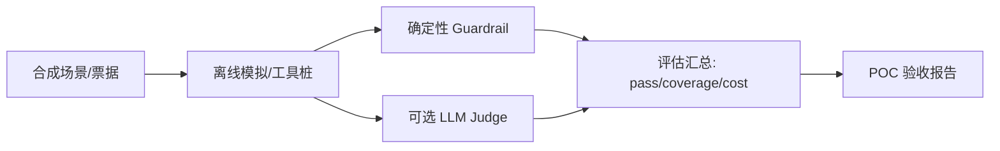
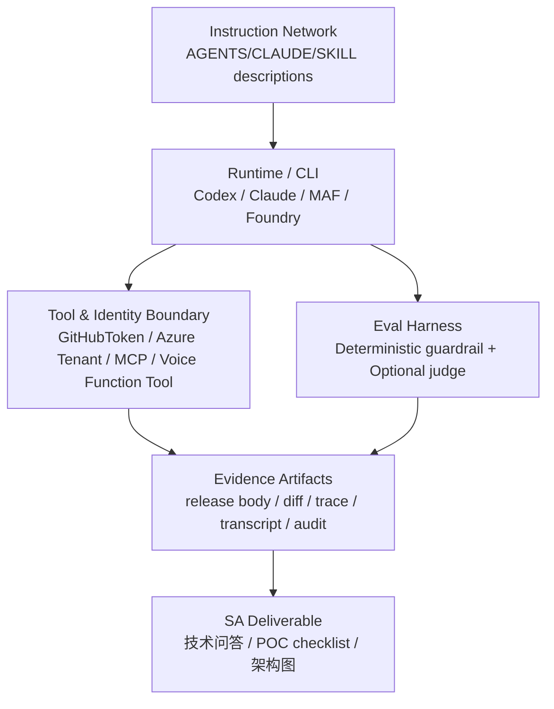

<!-- learning-asset-sanitized: v1 -->
> **发布界定 / Publication boundary**
>
> 本文是由历史研究快照整理出的补充学习材料。原始资料中的 HTTP 200、抓取时间或“已核实”表述只代表当时的来源可达性/文本核对，不代表本次发布时已经重新核验；本文也不是正式实验报告、生产部署建议或合规结论。
>
> 未对其中的命令、代码块、外部仓库、云资源、生产环境或合规控制做本次实机验证。请在独立测试环境中重新验证后再用于客户/生产场景。

# Cross-agent skill / eval / release gates（2026-09-20）

> 用途：给 SA 在技术问答、POC 部署、架构图评审中快速判断“今天这个 agent/CLI/skill 更新能不能用于客户材料”。本资产仅使用原研究快照中已验证可达的公开来源；所有运行类建议均要求 disposable fixture / 无真实 secret / 无客户代码。

## Evidence links（本资产可独立复核）

| 证据 | URL | 原研究快照中验证 | 强度 / caveat |
|---|---|---:|---|
| Claude Code 2.1.278 changelog | https://code.claude.com/docs/en/changelog#2-1-278 | 200 | docs/changelog 级；未 CLI smoke；server-side classifier 需用 `/status` 实测。 |
| Claude Code skills docs | https://code.claude.com/docs/en/skills | 200 | docs 级；HTML 页面可达，正文细节需用浏览器/站点源继续抽取。 |
| Codex 0.155.1 stable release | https://github.com/openai/codex/releases/tag/rust-v0.155.1 | 200 | release body 逐字核：TUI reasoning summaries 默认禁用修复；未 CLI smoke。 |
| Codex 0.156.0-alpha.8 | https://github.com/openai/codex/releases/tag/rust-v0.156.0-alpha.8 | 200 | prerelease/title-only sentinel；不写客户功能承诺。 |
| Codex Build Skills | https://learn.chatgpt.com/docs/build-skills.md | 200 | markdown 正文级：progressive disclosure、description、skill locations、budget。 |
| Codex AGENTS.md | https://learn.chatgpt.com/docs/agent-configuration/agents-md.md | 200 | markdown 正文级：AGENTS.override、instruction chain、32 KiB 默认上限。 |
| OpenAI Cookbook agent optimization commit | https://github.com/openai/openai-cookbook/commit/c033d1a05d357030d8c37f84967c9d5fc5014dc7 | 200 | commit/API 级；确认新增 `examples/agent_optimization/*`，未运行 notebook/script。 |
| OpenAI Cookbook skills API commit | https://github.com/openai/openai-cookbook/commit/263b2d5b7b63836c4ea30ee9709e65b7a50cbf6f | 200 | commit 级；适合后续 smoke，当前未运行。 |
| MAF GitHub Copilot SDK/session config commit | https://github.com/microsoft/agent-framework/commit/42c22c001761340f47b279e89a4e06aedb5549d9 | 200 | diff 级；命中 `GitHubToken` resume projection；未 NuGet/package smoke。 |
| MAF request-scoped Foundry factory commit | https://github.com/microsoft/agent-framework/commit/e21140c78898067be2899995c67f1ed24db6fe1c | 200 | commit 级；标 breaking；需避免与 09-19 MAF 1.19 release 重复表述。 |
| MAF per-run tools commit | https://github.com/microsoft/agent-framework/commit/0c9944cc9f577d51277ac7c55dbc388b60a577af | 200 | commit 级；未 package smoke。 |
| Azure MCP tenant-scoped ARG commit | https://github.com/microsoft/mcp/commit/09dce10e712e0c8bcb21fc7459b01c3584a0ab9b | 200 | diff 级；移除 all-tenants lookup，改 tenant token 执行 ARG；未安装/未连 Azure。 |
| Azure MCP npm wrapper install commit | https://github.com/microsoft/mcp/commit/a51a2262a272ef9ff9b6bf97bcf6a35ad4626977 | 200 | diff 级；安装目录不写 CWD package.json；未 npm smoke。 |
| Foundry voice-agents sample commit | https://github.com/microsoft-foundry/foundry-samples/commit/e0f4042a0080158d4fe351dfe7c3fb47a9b75a5e | 200 | diff 级；确认 `samples/python/voice-agents` 与 realtime/function samples；未部署。 |
| GitHub Copilot weekly 09-14 | https://github.blog/changelog/2026-09-18-github-copilot-weekly-releases-september-14/ | 200 | changelog 级；模型选择、code review、Sentry、VS Code agent features；未租户验证。 |
| Community radar: awesome-claude-code | https://github.com/hesreallyhim/awesome-claude-code | 200 | radar only；不安装、不引用排名/统计，需逐项审计。 |
| Community radar: awesome-agent-skills | https://github.com/VoltAgent/awesome-agent-skills | 200 | radar only；不安装、不引用“1000+”等未审 claim。 |

## 1. SA 速答：今天可以怎么对客户讲

- **Claude Code 2.1.278**：可以讲“Auto mode classifier 的执行面正在从本地/客户端配置走向服务端/网关侧可观测路径”，但只能说 docs/changelog 级；客户环境要看 `/status`、计费口径、Bedrock/Vertex/Foundry/gateway 具体路径。**不要**承诺默认行为在所有 provider 一致。
- **Codex 0.155.1**：可以讲“稳定线修复了本地 TUI reasoning summaries 默认值导致的第三方 provider 拒绝请求问题”；这是 release body 支持的 bugfix，可放入升级兼容性矩阵。0.156 alpha 仅作为 canary 观察。
- **Skills/AGENTS.md**：Codex 明确采用 progressive disclosure：先加载 skill name/description/path，命中后才读完整 `SKILL.md`；AGENTS.md 有 global→project path instruction chain 与 32 KiB 默认上限。适合反哺 harness workshop 的“指令网络与技能触发”练习。
- **OpenAI Cookbook agent optimization**：新增的 agent optimization 示例把 deterministic guardrail、optional judge、coverage/cost summary 分离；适合迁移成 SA POC 验收模板，而不是只做 demo 成功截图。
- **MAF + Copilot SDK**：per-session `GitHubToken` 在 resume config 中显式投影，是“多用户/多租户 Copilot agent 续跑不能丢身份边界”的好例子；目前是 commit/diff 级，未包级验证。
- **Foundry voice-agents**：Foundry samples 新增 Python voice agents，覆盖 voice agent lifecycle、realtime text/audio conversation、function tool、BYOM/MCP/toolbox 组合；适合做“语音 Agent POC 最小清单”，但需核区域、模型部署、音频设备、RAI note。
- **Azure MCP**：tenant-scoped Resource Graph 修复 + npm wrapper 不污染 caller package.json，是企业 MCP 生产化的两个小而重要的边界：租户授权边界和工作区依赖可复现性。

## 2. Release-source gate（先分类，再决定能不能写进客户材料）

| 类型 | 可写入客户材料的措辞 | 最小验证 | 原研究快照中例子 |
|---|---|---|---|
| Stable release + substantive body | “版本 X 修复/新增 Y（release 级；未实机）” | release URL 200 + body 命中关键句 | Codex `rust-v0.155.1` reasoning summaries bugfix |
| Alpha/prerelease/title-only | “版本信号 / canary radar，不作功能承诺” | release URL 200 + body 为空/仅标题 | Codex `0.156.0-alpha.8` |
| Docs/changelog update | “文档/公告级能力，需目标环境 smoke” | docs URL 200 + 关键段落/metadata | Claude Code 2.1.278 Auto mode server-side classifier |
| Commit/diff evidence | “源码变更级信号，需确认进包/部署” | commit/diff 200 + 关键代码/测试命中 | MAF `GitHubToken` resume projection、Azure MCP tenant ARG |
| Community radar | “资料池；不可直接推荐安装” | URL 200 + license/script/MCP/network/security 审计计划 | awesome-claude-code、awesome-agent-skills |

**客户材料红线**：如果只是 alpha/title-only、commit 未入包、community radar，不能写成“GA/可用/推荐安装”。写“观察到信号，下一步 package/API/fixture 验证”。

## 3. Skill / instruction network gate（通用检查方法，非通用加载规则）

发现顺序、目录层级、同名覆盖/合并和优先级均由 host/version 定义。验收报告必须记录 CLI 版本、配置来源和实际加载链；下文 Codex 路径及限制仅作该 host 的历史文档测试候选，不能套用到 Claude 或其他 host。

### 3.1 Skill quality gate

| Gate | 检查项 | 为什么对 SA 有用 |
|---|---|---|
| Routing description | `description` 说明“何时用/何时不用”，短而可路由 | 减少误触发；客户问“为什么 agent 没用这个 skill”时有排查点。 |
| Progressive disclosure | `SKILL.md` 短；长背景放 references/scripts；host 先看 name/description/path | 控制上下文成本；适合大型 partner POC 的工具箱。 |
| Source locations | 按 host/version 列出受支持目录、发现顺序与同名冲突规则；用 fixture 验证覆盖、合并或报错行为 | 避免团队 skill 与个人 skill shadowing，不预设跨 host 一致。 |
| Executable surface | scripts/hooks/MCP/statusline/commands 单独审计 | skill 仓库不是纯 markdown，存在供应链面。 |
| Eval before import | routing eval + behavior eval + clean-context A/B | 防止“看起来会用”的 skill 实际污染流程。 |

### 3.2 AGENTS.md / CLAUDE.md / override gate

- 构造 toy repo：`~/.codex/AGENTS.md`、repo root `AGENTS.md`、nested `AGENTS.override.md`、fallback name；让 Codex 输出当前 instruction chain。
- 验证 32 KiB 默认上限、空文件跳过、每目录最多一个文件、global override 恢复路径。
- 对 Claude 侧：原研究快照中仅确认 skills docs URL 与 09-19 AGENTS.md fallback 主题，具体 `CLAUDE.md`/`AGENTS.md` 三态需后续 fixture，不得对客户承诺跨工具完全一致。

## 4. Agent optimization / eval gate（来自 OpenAI Cookbook 新 commit 的可迁移骨架）

**推荐迁移到 SA POC 的最小结构**：

1. `scenarios.py`：定义 10-30 条 synthetic tickets / user journeys；不要用客户真实 PII。
2. `simulation.py`：确定性 guardrail，例如“是否调用 forbidden tool / 是否缺引用 / 是否越权”。
3. `live_api.py`：可选 live judge；默认关闭，显式 `RUN_LLM_JUDGE=true` 才跑。
4. `evaluation.py`：输出 deterministic_pass_rate、judge_coverage、judge_errors、known_judge_cost_usd。
5. `nightly_batch.jsonl`：夜间批处理输入；每条保留 variant、ticket_id、evidence link。

**架构图模式**：

**反哺 harness workshop [→harness]**：把“deterministic guardrail 必跑，LLM judge 可选且记录 cost/coverage”做成练习要求；禁止“只跑 judge 分数”作为验收。

## 5. Microsoft POC gates

### 5.1 MAF Copilot SDK session identity / resume gate

- **目标**：验证 Copilot agent resume 不丢 per-session GitHub identity。
- **Disposable fixture / mock only**：mock `SessionConfig` 含占位 `GitHubToken` / `GitHubTokenProvider`；不得使用真实 token，不得打印 token；模拟 resume 后只断言 provider、approval hooks、tool events 未跨用户泄漏。
- **客户问答话术**：这不是“把用户 token 写进日志”，而是 resume config 投影边界；真正客户环境还需 token redaction、audit、secret store、租户隔离。

### 5.2 Foundry voice-agents POC gate

- **目标**：验证 voice agent lifecycle + realtime text/audio + function tool 最小闭环。
- **前置**：测试 Foundry project、realtime model deployment（如 `gpt-realtime`，目标区域/SKU未核）、无客户 PII 的脚本。
- **验收 artifact**：创建/删除 voice agent 的版本记录、一次 text realtime transcript、一次 function tool call trace、RAI transparency note 链接、音频设备不可用时 headless fallback 记录。

### 5.3 Azure MCP tenant/RG + npm wrapper gate

- **tenant-scoped ARG**：测试 explicit tenant、single tenant、zero/multiple tenant 三路径；拒绝“先枚举所有 tenants 再筛”的实现。
- **npm wrapper**：在临时 Node fixture 中验证缺平台包时安装到 wrapper `.platform` 或 cache，而不是写 CWD `package.json`；`DEBUG=true` 仅用于 mock/disposable 环境，输出需脱敏，不得包含真实路径、tenant、subscription、secret。

## 6. Architecture pattern：四层证据与控制面

**使用规则**：每个客户可转发结论必须指向一类 evidence artifact；没有 artifact 的只能标为待验证候选，不能作为交付结论。

## 7. 待验证的 smoke-test 候选

- [→harness] Claude Code 2.1.278：fixture 验证 `/status` 是否显示 Auto mode server、`CLAUDE_CODE_AUTO_MODE_SERVER=0` fallback、gateway/provider 差异；无 secret。
- [→harness] Codex skill + AGENTS chain：构造多层 `.agents/skills`、同名 skill、32 KiB AGENTS 上限、`AGENTS.override.md` shadowing 的静态/CLI smoke。
- [→harness] OpenAI Cookbook agent optimization：把 `agent_optimization` 示例改成文本客服 toy POC，跑 deterministic guardrail；LLM judge 默认关闭。
- MAF Copilot SDK：确认 42c22c 是否进入 NuGet；用 mock session 验证 resume config 投影。
- Foundry voice-agents：确认 `azure-ai-projects` 版本、区域/模型部署、PyAudio headless fallback；只用合成文本/音频。
- Azure MCP npm wrapper：临时 Node fixture 验证不写 caller package.json；tenant-scoped ARG 用 mock 或测试订阅验证。
