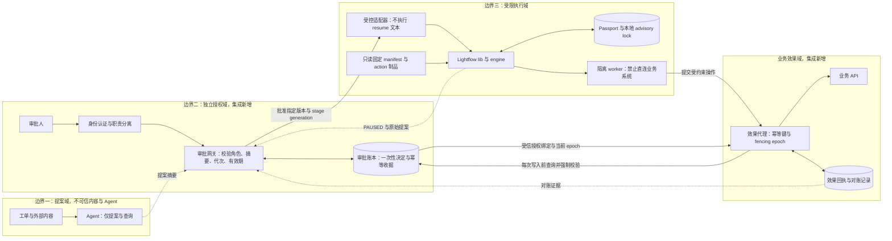
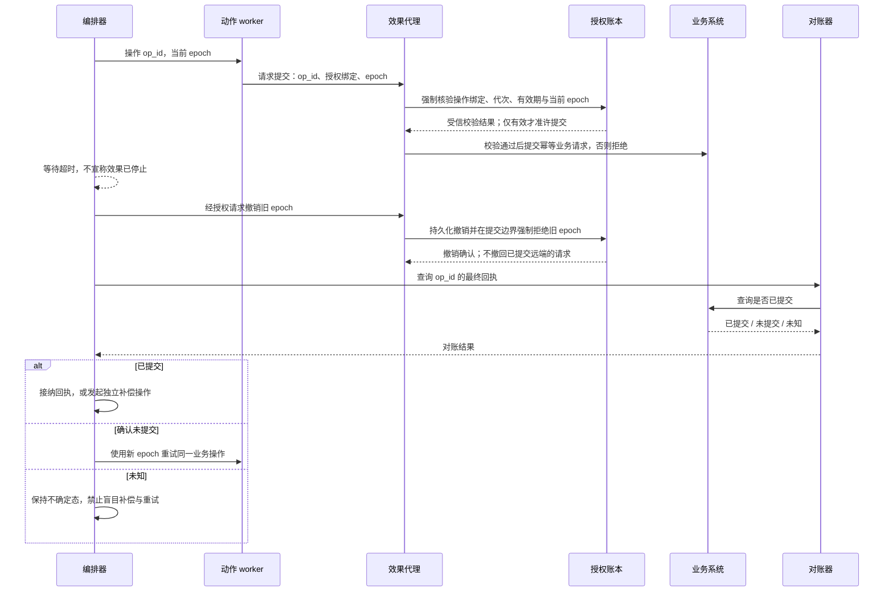

# Lightflow 人工关卡与超时副作用：客户 POC 验收模板

**定位：源码 read-not-run；所有实验卡均 NOT_RUN。** 本文依据 `google/lightflow@203ffb149563a6a7627426d8ea54f955dc497e48` 的公开源码，提供可迁移的架构模式与验收设计，不是运行报告、安全漏洞公告或生产认证。仓库采用 Apache-2.0；README 明确 **“This is not an officially supported Google product.”** Google 组织托管不等于 Google 支持产品。

## 1. 客户场景与一句话结论

场景：运维 Agent 提议变更租户配额，人工确认后执行；外部配置 API 偶发慢响应，失败时需要补偿与重试。

**需要分别证明三件事：流程停住了、获授权的人批准了同一份变更、超时后旧动作不会再破坏结果。三者不能用一个 PAUSED/COMPLETED 状态代替。**

Lightflow 提供本地 DAG、持久化人工关卡、载荷校验、重试与补偿接点；企业集成仍需提供独立身份授权、不可变审批绑定和外部副作用控制。本文不声称上述缺口在受信任的本地单用户使用模型下构成漏洞。

## 2. 源码闭环：提案怎样变成执行

下列 E/L/M/S/R 编号对应文末固定源码链接及行号。

| 边界 | 实际行为 | 能证明 / 不能证明 |
|---|---|---|
| 提案来源 | E850–882：resume 前缀优先取 manifest 的 `runner_target`，其次由入口推断；参数含 manifest 路径、log_id、stage，示例默认 APPROVE，schema 存在则给 JSON 占位符。E1903–1962：instructions 由 manifest 表达式结合 payload 求值，写入 PAUSED stamp 与 resume_command，并抛暂停异常。 | 是工作流生成的操作建议，不是经签名的审批凭证；不要让 Agent 或 shell 自动执行返回的命令文本。 |
| 持久化与返回 | L1568–1602 捕获暂停先保存再抛出；M253–299 从 Passport 返回旧 instructions/resume_command，却从当前 manifest 提取 json_schema。 | 客户可能同时看到“旧提案文本＋新 schema”；审批必须绑定 manifest/action/schema/payload 的不可变版本，而不只是一个 stage 名称。 |
| MCP 入口 | M568–635 检查工具名、参数对象及必填项后分发；M353–404 将调用方 `operator`、payload、resolution 传给 lib；默认 resolution=APPROVE。服务为 stdio JSON-RPC（M681–806）。 | 不应误画成自带 OAuth 的公网 API；部署者决定谁能访问进程与工具。所读调用链没有独立人类身份验证/角色授权步骤。 |
| CLI / Python 入口 | `__main__` 调用 runner；R187–286 分派参数，R135–137 调到同一个 `LightflowRunnerCLI`；Python 可直接调用 L802 resume。 | 单独隐藏 MCP 的 resume 不够：同权限 shell、Python、可写状态/manifest 也是控制面。 |
| 身份与锁 | L174–186：operator 缺省来自 `LIGHTFLOW_OPERATOR`，否则 getpass 用户，可拼接 agent 会话 ID。L832 获锁后重载 manifest/Passport 并执行后续循环。L201–234 是 advisory 文件锁，L219–228 获取有预算，失败可抛 RuntimeError，不保证并发请求均排队完成；L290–356 做目录范围、名称与 UID 检查；L384–411 临时文件＋原子 replace。 | 有真实的本地状态保护，不能说“没有锁/路径保护”；这些不是组织角色授权、跨主机分布式锁或外部 API exactly-once。operator 文本是归因信息，不是不可伪造的人类证明。同一 stdio 流同步处理请求（M681–766），顺序发两条不等于独立进程争锁。 |
| 恢复分支 | L841–860 只有指定 stage 的最新状态为 PAUSED 才进入审批分支；否则进入失败恢复。L1062–1071 遇任何 PAUSED 时要求显式指定关卡，不能用无 stage 的 resume 越过。 | 应区分“回答人工关卡”与“重试失败工作”，不是所有 resume 都代表同意。 |
| 批准 | L935–1025：payload 必须为对象，禁止顶层 outputs；APPROVE 中 approved 若显式提供必须为布尔 true；可按 schema 校验，部分 required 字段可继承初始 payload，但排除输出字段与审批元数据；最终强制写 operator/approved/resolution 并追加 COMPLETED。 | 有防矛盾载荷与输出伪造措施。默认不要求 payload 显式携带 approved=true；JSON 合法不代表有权批准。S1412–1421 有 jsonschema/stdlib 两条验证路径，POC 必须记录依赖组合。 |
| 拒绝与重开 | L884–933：REJECT 不要求满足 APPROVE 的 json_schema，强制 approved=false/resolution=REJECT，写 FAILED，执行配置的 rollback，再遍历 DAG。L1154–1162 仅在构造隐式初始 targets 时排除拒绝关卡；L1164–1172 的默认 cascade=true 将目标的传递下游 FAILED/SKIPPED 加入重开集合，不再次排除 REJECTED。L1174–1184 写 PENDING；显式指定 FAILED 的拒绝关卡也可重开。不重做 COMPLETED。 | 隐式恢复不会把被拒关卡选为初始目标，但可经其他失败目标的 cascade 重开；REJECT 不等于进程立即停止或绝不可重开。重新进入 PAUSED 不是自动批准，仍需新决定；集成对任何重开都必须分配新审批代次。 |
| 终态与审计 | S646–739：Passport 只有 payload/stamps，stamp 保存 stage/status/time/message/instructions/resume_command；状态枚举没有独立 REJECTED，L1245–1261 用 FAILED 的 message 前缀呈现 REJECTED/BLOCKED。 | stamp 是逻辑追加记录，落盘是整个 JSON 重写；不是签名审计链。不能只靠 message 字符串作为企业授权依据。 |

**拒绝关卡的可达重开路径（仅源码推导，NOT_RUN）：** 普通 Python stage A 首次失败；依赖 A 的 operator_action G 使用 `trigger_rule=ALL_DONE`，因此仍可暂停（E1543–1545）。显式 REJECT G 后，A 为 FAILED，G 为 FAILED/REJECTED，此时没有 PAUSED，不触发 L1062–1071 的暂停拦截。无 stage、默认 cascade=true 的 resume 将 A 选为初始目标，并将其 FAILED 下游 G 加入重开集合（E831–848 的下游搜索无关卡过滤）。若 A 重试成功，G 再次进入 PAUSED，仍需后续决定，不是自动批准、鉴权绕过或已复现漏洞。E1060–1076 禁止同一 stage 混用 operator_action 与 python_action/polling_policy/retry_policy，但不禁止这里的 ALL_DONE。无合格失败祖先时的隐式恢复及 cascade=false 对照见 P06。

### 三种“超时”不可混淆

1. **人工等待**：operator_action schema 只有 instructions/json_schema（S245–275）；人工暂停分支不实现审批 TTL/过期撤销。不要把 stage.timeout_seconds 当成人工授权有效期。
2. **Python 动作超时**：E1385–1428 在 daemon thread 执行，join 超时就抛 StageTimeoutError，不能强停线程。传给函数的是深拷贝 payload（E1329），因此旧结果不会自动合入当前 Passport；但外部写入仍可能发生。仅在宿主进程仍存活时旧线程可继续，短命 CLI 退出与长驻 MCP 服务必须分开测。
3. **轮询预算**：E1645–1703 区分 polling_policy 的总等待预算与单 tick 的 stage.timeout_seconds；tick 失败进入 FAILED/rollback，不应直接套用普通 Python stage 的重试结论。

普通 Python stage 在 E1842–1901 对 StageTimeoutError 按 retry_policy 退避重试；其他 EngineError 不走同一重试分支。最终失败调用 E1430–1475 rollback；rollback 使用同一 stage timeout，失败只追加错误说明，也可能留下继续运行的线程。L1596–1602 仍继续遍历 DAG，因此独立分支与 ALL_DONE 清理可以运行；E1477–1557 定义 ALL_SUCCESS/ALL_DONE。**补偿成功日志不等于旧动作已静止，更不等于业务效果已抵消。**

### dry-run 的真实执行边界

L1333–1460 的预览会调用 E1345–1383 `simulate_dry_run_action`。后者先解析并 import callable，再检查显式 dry_run 参数或 supports_dry_run 属性，符合时真实调用函数并传 dry_run=true。即使函数不支持 dry_run，import 的顶层代码仍可能已运行；异常返回 None 也不能撤销此前效果。E1305 使用 importlib.import_module，模块已缓存且源码未变时不保证再次执行顶层代码；比较变体须使用独立未导入模块名或新宿主进程，并分开统计顶层与函数体标记，不能因第二次无新增 import 标记就判定无风险。E1173–1315 有私有导入限制与可选 allowed_import_prefixes，不应抹掉这些保护，但它们不是无副作用沙箱。**客户演示不能把 dry-run 当成安全执行未知 action 的准入方式。**

### 业务成功与保存故障不是单一窗口

L1588–1604 在动作返回后保存 Passport；第一次保存的可捕获异常可能进入异常分支再次保存。因此“一次 save 抛错”不保证磁盘仍是旧状态，更不证明重复提交。P12 分开设计：模拟业务成功回执已确认、第一次终态持久化之前硬中断；以及可捕获保存异常（一次失败与持续失败对照）。需要记录每次保存尝试与最终磁盘内容。L384–411 的临时文件 replace 只提供 JSON 文件保存原子性，不与远程业务形成事务；恢复始终先按不变的业务 op_id 查回执。

## 3. 推荐架构：把三个边界画出来

下方架构图（flowchart）的实线为调用、数据或受信凭据流；边的存在本身不代表请求已获授权，授权由接收边界强制核验。该图虚线仅表示建议或证据，不表示授权。时序图中的虚线箭头则按时序惯例表示返回/通知，不沿用这一图例。效果代理在每次业务提交前必须通过账本的实线校验流核验有效授权、操作绑定、审批代次/有效期与当前 epoch；无效、已撤销或无法核验均拒绝，worker 自报 epoch 不足以授权。网关、审批账本、效果代理与隔离 worker 是集成设计，**不是宣称 Lightflow 已提供的组件**。

**不可遗漏的旁路封堵：** Agent 没有执行域 shell/Python、resume 原始工具、状态目录或 manifest 写权限；worker 不持有业务 API 直连能力。只加一个审批 UI 却保留这些旁路，不能验收为职责分离。终止 worker 也不能撤回已被远端接收的请求，必须继续查业务回执。

### 超时恢复时序模式

## 4. 三种方案比较

| 方案 | 适合 | 必须接受的限制 | 建议 |
|---|---|---|---|
| A：本地 Lightflow＋操作员手动恢复 | 单用户、无真实外部写入的 workshop；展示 DAG 与关卡体验 | operator 仅归因；同账户可触达多个入口；原生 timeout 不终止线程 | 可以做教学基线，不承诺企业审批隔离 |
| B：Lightflow＋独立审批网关＋隔离 worker＋效果代理 | 希望保留轻量 DAG，且有明确业务幂等与回执 API 的有限 POC | 需自建审批版本绑定、幂等收据、fencing 与不确定态对账；维护成本不可忽略 | **本 POC 推荐**，先选一个可撤销、可查询、低风险动作 |
| C：企业持久化编排/任务服务＋外置授权和效果控制 | 长时间等待、多实例恢复、严格 RTO/RPO、复杂补偿 | 平台持久化也不自动解决外部 exactly-once；迁移与平台验证成本较高 | 生产范围明显超出本地 runner 时优先评估，不用本篇推导任何厂商产品已满足要求 |

## 5. POC 合同与观测字段

**准入：** 隔离的无 secret 测试环境；业务系统使用可查询回执的模拟服务；无生产租户、无真实扣费/资源变更；固定源码、依赖与自有 action 制品摘要；先检查 action 顶层代码，不以 dry-run 代替检查。本文未安装、import 或执行上游，也未执行下面的扰动。

建议审批绑定元组：`tenant_id, run_id, stage, stage_generation, manifest_digest, action_digest, payload_digest, schema_digest, decision, approver_subject, policy_version, expires_at, nonce`。这是**新增集成协议**，不是 Lightflow 原生字段。所有 payload 摘要应由明确的规范化规则计算，禁止混用展示文本与实际执行载荷。

观测至少分开记录：调用层 status/exit_code；Passport 最新 stamp 及历史；审批网关决策与主体；worker attempt/epoch；业务 op_id/回执；rollback 独立 op_id；最终业务状态。审计中不保存 secret，不把完整 payload 自动送给 Agent。

## 6. 验收卡（共 12 张，全部 NOT_RUN）

**判据解释：**“源码预期”是阅读推断；“验收目标”是推荐集成必须满足的行为。二者不一致时，不得把原生基线的结果冒充集成通过。每卡执行后填写证据引用、实际结果、偏差与责任人；未执行不能计入通过率。

| 卡 | 前置 | 扰动 | 观测 | expected | 状态 |
|---|---|---|---|---|---|
| P01 关卡正确暂停 | prepare→gate→apply，合成 payload | start 后不提供任何决定；再做无 stage 的 resume | PAUSED stamp、MCP SUSPENDED、业务写计数 | 源码预期：关卡落盘，无 stage resume 报已暂停；apply 不执行（L832–860、1062–1071、1593–1595） | NOT_RUN |
| P02 身份与入口分离 | Agent/审批人/执行账号互相隔离；gate PAUSED | Agent 填 operator=approver-demo，经 MCP、CLI、Python 三入口尝试恢复；另测写 manifest/Passport | 各入口拒绝事件、真实主体、目录拒绝记录 | 原生 operator 文本不是鉴权。验收目标：无审批凭证所有旁路均拒绝，且无业务效果 | NOT_RUN |
| P03 矛盾载荷与 schema | gate 要求 change_id；分别锁定 jsonschema 与 stdlib 依赖组合 | APPROVE 携 approved=false/字符串 true；加入 outputs；删除必填字段 | 返回错误、Passport 前后内容、业务回执 | 矛盾 approved 与 outputs 被拒绝；必填字段是否允许继承按 L968–991 判断，不笼统期待所有缺字段都失败；不支持的 schema 不作为成功放行依据 | NOT_RUN |
| P04 暂停后的提案漂移 | 已生成 PAUSED 提案并记录全部摘要 | 仅替换 manifest schema/action 或载荷版本，复用旧决定 | 旧 instructions、当前 schema、网关摘要与执行制品摘要 | 原生恢复会重载当前 manifest，不能宣称自带绑定；验收目标：版本不一致拒绝并生成新审批请求 | NOT_RUN |
| P05 并发决定与重放 | 同一 run/generation、gate PAUSED；两个独立受控进程/服务实例共享同一状态目录与锁文件，不用单个 stdio 流的顺序请求冒充争锁 | 用屏障制造真实争锁；分别覆盖锁预算耗尽、预算内释放，并控制 APPROVE 先到与 REJECT 先到；随后在集成网关重放相同 nonce | 进程标识、锁获取起止/失败、调用错误、重载后最新状态、stamp 顺序、网关一次性收据、业务 op_id | L219–228：锁失败可抛 RuntimeError，不保证双方完成；获锁者才按重载后的状态处理。APPROVE 先到时后到请求不再回答同一 PAUSED；REJECT 先到时后到显式 stage 请求可能仅将 FAILED 关卡重开至 PAUSED，不是第二个审批决定（L832–860、1062–1186；M681–766）。集成一个代次只接受一个决定，重放返回原收据而无新效果；nonce/代次账本非原生锁能力 | NOT_RUN |
| P06 拒绝、清理与重新审批 | 两套隔离夹具：①被拒 G 无可选作初始目标的失败祖先；②普通 Python A 首次 FAILED，G 依赖 A 且为 ALL_DONE 的 operator_action，先 PAUSED 再显式 REJECT；G 带 rollback，下游分别为 ALL_SUCCESS/ALL_DONE；调用恢复前无其他 PAUSED | 每套从同一拒绝后快照分别做无 stage 的 cascade=false/true，再独立测显式 G 的 cascade=false/true；②令 A 重试成功 | A/G 最新状态与全部 stamp、初始 targets 与 cascade 加入项、FAILED/REJECTED 展示、rollback/cleanup、PENDING/PAUSED、新审批代次 | L1154–1184：①隐式两种 cascade 都不把 G 重开；②false 只重试 A、不重开 G，true 经 A 的下游扩展将 G 重开并再次 PAUSED。显式指定 FAILED 的 G 在两种 cascade 下均可重开；cascade 只改变 FAILED/SKIPPED 下游扩展，不重跑 COMPLETED。E1060–1076、1543–1545 支持②的 ALL_DONE 可达路径。拒绝可触发 rollback/ALL_DONE；任何重开都不是自动批准，集成必须换 generation，旧 APPROVE 不可复用 | NOT_RUN |
| P07 人工决定过期 | 外置审批账本设有效期 | 保持 PAUSED 至过期，提交旧决定 | 网关过期拒绝、Passport 不变、业务写计数 | 原生没有人工审批 TTL 保证；集成 fail-closed，并提供重新发起审批的路径 | NOT_RUN |
| P08 超时后迟到效果 | 长驻宿主；自有动作等控制屏障后写模拟业务；禁重试 | 让等待超时后才释放屏障，保留宿主存活 | 超时 stamp、旧 worker 完成、迟到业务回执 | 源码预期：旧线程可继续，旧返回值不自动入 Passport；集成阻断未提交旧 epoch 写入。短命 CLI 单独记录，不能混成同一结论 | NOT_RUN |
| P09 重试交叠与幂等 | 普通 Python stage 配 retry；首轮迟到、第二轮快速 | 首轮超时后允许两轮交叠提交 | attempt、同一业务 op_id、epoch、去重回执 | 源码预期：可能交叠；验收目标：业务效果只提交一次，所有尝试可对账，不以 Passport 单个 COMPLETED 代替效果计数 | NOT_RUN |
| P10 补偿竞态与 DAG 继续 | 最后一次 attempt 超时；配置 rollback 与 ALL_DONE；旧 worker 仍可写 | 先完成补偿，再释放旧写屏障；另让 rollback 自身超时 | failed_stamp 附注、旧写、补偿回执、ALL_DONE 状态 | 源码预期：补偿和清理不保证静止；集成先 fence/对账，再决定补偿；未知状态不得宣称回滚完成 | NOT_RUN |
| P11 dry-run 两种执行 | 支持、不支持及抛错三种自有变体各用独立未导入模块名或全新宿主进程，保证冷导入；预览前记录标记基线；顶层与函数体分别写无害本地标记 | 每变体分别预览；支持者故意忽略 dry_run，另一个支持 dry_run 的抛错变体在函数体标记后抛错；另测同进程同模块源码不变的热缓存对照 | 宿主/模块标识、是否预导入、源码摘要、顶层标记与函数体标记各自增量、预览输出、效果代理拒绝 | E1305、1345–1383：冷导入可运行顶层代码；支持者实际调用，不支持者不进入函数体；抛错不撤销已有标记。缓存未变时第二次不新增顶层标记不证明无 import 风险。验收目标：隔离与能力撤销阻止真实业务写入 | NOT_RUN |
| P12 业务成功与落盘故障窗口 | 模拟业务成功回执已确认且持久可查；固定同一业务 op_id；持久化屏障设在第一次终态持久化之前，不混淆中间保存 | 分开测试①在该屏障硬中断隔离宿主，不进入异常处理；②可捕获 save 异常，分别只失败一次与持续失败；恢复时先查回执再决定是否重试 | 业务成功确认与屏障顺序、硬中断/异常类型、所有 save 尝试编号（含异常路径第二次保存）、成功或失败、磁盘 Passport 内容/摘要、恢复前回执与不变 op_id | L1588–1604：①设计捕获业务已成功而终态未持久化窗口，仍须核对磁盘；②一次失败后异常路径可能再次保存成功，不能预设仍为旧 Passport。L384–411 原子 replace 不构成业务事务；并非所有保存故障都导致重复提交。集成先按 op_id 查回执，已完成不重提，未知保持不确定态 | NOT_RUN |

## 7. 客户常见问答

**“界面要求人工确认，Agent 就不能自批了？”** 不能据此断言。展示文案是协作规则；应现场要求 Agent 尝试三条恢复入口，证明独立身份域与权限隔离真实存在，而不是仅隐藏按钮。

**“operator 已记录姓名，还需要审批系统？”** 需要区分调用者自报文本与已验证主体。网关应从认证上下文生成 approver_subject，不接受 Agent 自报姓名作为授权依据，同时核对职责分离与操作摘要。

**“审批一小时前完成，现在用同一个 stage 恢复行吗？”** 只有当审批代次、制品和载荷摘要仍匹配且授权未过期。固定 stage 名或 log_id 不能识别修改后的同名变更。

**“超时显示 FAILED，能马上重试或回滚吗？”** 不应自动推断可以。先确认旧尝试能否继续写，以及远端是否已提交。对账未知时应保持不确定态，而不是用重试掩盖结果。

**“文件锁与原子保存够不够保障只执行一次？”** 对本地协作式状态读写有价值，但获取锁有预算、可能失败，不保证两个并发请求都完成；获锁后也必须区分回答关卡与重开失败关卡。锁没有把业务 API 和 Passport 放进同一事务，也管不到已在后台运行的动作线程。一次可捕获保存异常可能触发再次保存，不能预设磁盘仍旧或业务必定重提；要在业务边界证明幂等与回执一致性。

**“迁到 Azure/现有 Agent 平台就不用这些控制了吗？”** 不会自动消失。可以让企业身份服务承担认证、受控工具适配器承担恢复授权、任务执行服务承担隔离与恢复、业务系统承担幂等/回执。选型时用上述验收卡逐项证明，不把某个 SDK 的 interrupt/resume API 当作端到端授权保证。

**“今天能交付什么？”** 可以交付可复核的边界图、调用链、实验合同与风险分层；不能交付吞吐、成功率、安全认证或已复现漏洞结论。进入实跑后，再用独立审批日志与业务效果回执共同签署验收。

## 8. 固定源码索引

以下链接均固定到同一 SHA；引用是源码 read-not-run。测试文件仅作设计证据，未运行；尤其 `test_lib.py` L768–819 的 ALL_DONE 超时测试通过 mock 抛 StageTimeoutError，不能当作“真实旧线程已停止”的证明。

- **E** [engine.py](https://github.com/google/lightflow/blob/203ffb149563a6a7627426d8ea54f955dc497e48/lightflow/engine.py)：831–882、1060–1076、1173–1428、1430–1557、1645–1703、1842–1962。
- **L** [lib.py](https://github.com/google/lightflow/blob/203ffb149563a6a7627426d8ea54f955dc497e48/lightflow/lib.py)：174–411、624–673、802–1186、1245–1261、1333–1460、1568–1672。
- **M** [mcp_server.py](https://github.com/google/lightflow/blob/203ffb149563a6a7627426d8ea54f955dc497e48/lightflow/mcp_server.py)：253–404、568–635、681–806。
- **S** [schema.py](https://github.com/google/lightflow/blob/203ffb149563a6a7627426d8ea54f955dc497e48/lightflow/schema.py)：98–106、245–275、646–739、1289–1421。
- **R** [runner.py](https://github.com/google/lightflow/blob/203ffb149563a6a7627426d8ea54f955dc497e48/lightflow/runner.py)：110–147、187–309；[模块入口](https://github.com/google/lightflow/blob/203ffb149563a6a7627426d8ea54f955dc497e48/lightflow/__main__.py)。
- [test_lib.py](https://github.com/google/lightflow/blob/203ffb149563a6a7627426d8ea54f955dc497e48/tests/test_lib.py#L768-L819)、[test_hardening.py](https://github.com/google/lightflow/blob/203ffb149563a6a7627426d8ea54f955dc497e48/tests/test_hardening.py)、[test_mcp_server.py](https://github.com/google/lightflow/blob/203ffb149563a6a7627426d8ea54f955dc497e48/tests/test_mcp_server.py)。
- [README 支持声明](https://github.com/google/lightflow/blob/203ffb149563a6a7627426d8ea54f955dc497e48/README.md#L360)、[Apache-2.0 LICENSE](https://github.com/google/lightflow/blob/203ffb149563a6a7627426d8ea54f955dc497e48/LICENSE)。
