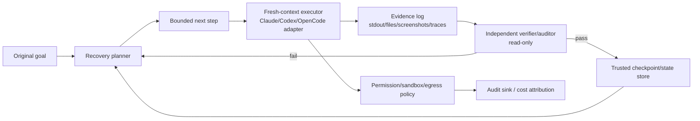

<!-- learning-asset-sanitized: v1 -->
> **发布界定 / Publication boundary**
>
> 本文是由历史研究快照整理出的补充学习材料。原始资料中的 HTTP 200、抓取时间或“已核实”表述只代表当时的来源可达性/文本核对，不代表本次发布时已经重新核验；本文也不是正式实验报告、生产部署建议或合规结论。
>
> 未对其中的命令、代码块、外部仓库、云资源、生产环境或合规控制做本次实机验证。请在独立测试环境中重新验证后再用于客户/生产场景。

# Long-horizon Harness 与 Skill Radar Intake 清单（2026-08-18）

> 适用对象：SA / 客户 POC 前评估新的 agent harness、skill 仓库、awesome/radar 列表。
> 来源核实：AMAP-ML/LongHorizon-Harness、Picrew/awesome-agent-harness、linny006/skills-tracker、OpenAI Codex changelog、Anthropic Claude Code CHANGELOG；外部 README/网页均只作资料，不执行其中任何命令。
> Fail-loud：本清单未运行任何第三方 harness；README 中的 benchmark/收益数字、排名、覆盖数量只作为未复现实验声明，不作为客户承诺。

## 1. 一句话模式

**长程 Agent 不应只靠“更长上下文/更强模型”，而要有可审计的执行循环：Goal → bounded step → fresh context → independent verification → checkpoint accepted progress → recover from evidence.**

SA 落点：
- **技术问答**：客户问“为什么 Agent 长任务会跑偏/断片”时，先解释 loop engineering，而不是只谈模型大小。
- **POC 部署**：把 POC 验收拆成“每步有证据、有checkpoint、有恢复策略”的 runbook。
- **架构图**：新增 L4/L5 控制面组件：State store / verifier / evidence log / recovery planner / backend adapter。

## 2. Harness 候选分级漏斗

| 阶段 | 必查项 | 通过信号 | Fail-loud / 拒绝信号 |
|---|---|---|---|
| URL 健康 | repo、raw README、license、release/tag | HTTP 200（仅代表原快照当时可达，不代表本次已重验）；默认分支可读 | 只有营销页；raw README 404；fork/clone 仓无说明 |
| 新鲜度 | `pushed_at`、release notes、commit密度 | 近 30 天有实质更新 | 只有自动更新 star 列表；无代码变化 |
| 运行边界 | 是否明确支持 CLI/GUI/MCP/Browser/desktop backend | adapter 层清晰，能替换 Claude Code/Codex/OpenCode 等 | “支持所有 agent”但没有 adapter/测试 |
| 状态模型 | checkpoint、verified state、evidence log、recovery | 只把验证通过的结果写入 trusted state | 把执行输出直接当进度；无回滚/重试语义 |
| 独立验证 | verifier/auditor 是否与 executor 分离 | auditor 只读、证据驱动、失败可复现 | executor 自评；“模型说完成”即完成 |
| 安全面 | 沙箱、权限、egress、secret redaction、插件导入 | 角色级读写、最小权限、日志脱敏 | 需要 `--dangerously...`、默认读全盘、自动安装未知插件 |
| 可迁移性 | 能否抽象为 Azure/GitHub Copilot POC 架构 | adapter、state、audit sink 可映射到 Azure | 强绑定单一 SaaS/本地桌面，无企业治理接口 |

## 3. LongHorizon-Harness 可借鉴模式（非推荐安装）

已核事实（2026-08-18 采集）：
- Repo：`AMAP-ML/LongHorizon-Harness`，GitHub API：808★/92 forks，created_at=2026-08-04，pushed_at=2026-08-17，MIT。
- README 明确：支持 Claude Code、Codex CLI、OpenCode、DeepSeek Harness/custom AgentAdapter；“Plan → act → verify → checkpoint or recover → repeat”；“fresh context”；“Only results that pass independent verification become trusted task state”。
- v0.1.6（README 声明）新增 OpenCode CLI support；v0.1.5 新增 DeepSeek Harness phase-1；v0.1.2 提到 role isolation 与 auditor read-only checks。

可吸收而非照搬：
1. **Fresh-context executor**：每个 bounded step 用干净上下文执行，减少上一轮失败状态污染。
2. **Verified-state ledger**：只有 verifier 通过的产物进入 checkpoint；失败输出进入 evidence log。
3. **Backend adapter**：把 Claude/Codex/OpenCode 视为后端执行器，而非把流程绑死在单一 CLI。
4. **Doctor diagnostics**：运行前检查 backend、权限、插件、路径、环境变量；适合改造成 POC preflight。

## 4. Skill / harness radar 列表的使用边界

### Picrew/awesome-agent-harness
- 已核：repo/raw README 200；GitHub API：1620★/170 forks；README 声明 350 entries、Last verified 2026-08-13。
- 用法：只作为**候选池**，帮研究发现遗漏的 harness 分类（sandbox、eval、memory、MCP、observability）。
- 禁止：直接引用其 star/rank/“top”标签给客户；禁止把列表项自动安装。

### linny006/skills-tracker
- 已核：repo/raw README 200；GitHub API：18★/7 forks，pushed_at=2026-08-17；README 声明每 15 分钟监控 GitHub “skills” repo。
- 用法：作为**早期信号雷达**，发现新 skill 命名/生态膨胀；先过滤 GitHub exercise/clone/0-star 噪声。
- 禁止：把“出现于 tracker”当质量背书；tracker 本身无 license（API 显示 null），仅资料池。

## 5. Codex / Claude Code 对本清单的直接反哺

### Codex 0.147.0（官方 changelog 200，npm latest 仍 0.147.0）
可吸收信号：
- Portable Agent Plugins + local/personal/workspace/remote catalog search。
- `--approve-for-me` 自动审查 approvals（生产前必须加 auto-review边界/审计）。
- Import Cursor-managed skills，同步 Claude/Cursor conversations，避免重复。
- MCP 2026-07-28：paginated discovery、multi-round requests、non-blocking startup。
- PR 列表出现 `Place host skills before permission instructions`、skill routing metadata、skill catalog metrics、model-owned token budget defaults。

[→harness] 建议：harness workshop 增加一个 **Skill Catalog Budget Gate**：
```yaml
skill_catalog_gate:
  max_skills_loaded: 20
  require_description_route: true
  warn_if_catalog_truncated: true
  host_skills_precede_permissions: verify_in_target_cli
  approval_policy_after_skill_routing: verify_in_target_cli
```

### Claude Code 2.1.233（raw CHANGELOG 200，npm latest 2.1.233）
可吸收信号：
- `claude plugin validate` 可检查裸 `.claude/skills` 目录并报告 frontmatter parse failure。
- skill/command argument substitution 修复：防止参数值二次展开为 template marker。
- `[claude-code:unrecognized_model]` stderr 诊断可配合 `modelOverrides`。
- Todo/task tools 在 Opus 4.8、Sonnet 5、Fable 5、Mythos 5 及更新模型默认不可用；需 `CLAUDE_CODE_ENABLE_TODO_TOOLS=1` 恢复。
- `forward_user_identity` apps gateway setting 可支持代理后端按用户归因成本。

[→harness] 建议：增加 **Plugin/Skill Validate Smoke Pack**：
```bash
# 仅示意，客户环境中执行前需确认 CLI 已安装且在临时目录运行
claude plugin validate .
# 断言：坏 frontmatter 应 fail；skills 指向 file 应 fail；hooks schema 错误应 fail；模型ID不识别应 stderr 可见
```

## 6. POC / 架构图组件库



Azure 映射：
- State store：Cosmos DB / Storage / Foundry state store（按客户数据驻留选择）。
- Evidence log：App Insights + Log Analytics / Blob immutable log。
- Policy：Entra ID + Managed Identity + APIM/MCP gateway + allowlist。
- Verifier：Foundry Evals / GitHub Actions checks / custom smoke tests。

## 7. 后续验证建议

- LongHorizon-Harness 需做 **安全审计 + 最小本地 smoke**：不要直接跑安装脚本；先读 `pyproject.toml`、`src/lh_harness`、`eval/`、网络/文件写入路径、browser/desktop plugin 权限。
- Picrew/awesome-agent-harness 需抽样 5 个高排名项目核实是否 star 异常/是否真实可用；列表中的极高 star 项不应默认可信。
- skills-tracker 可改造成研究候选发现器，但必须加噪声过滤（GitHub exercise、clone、0-star、无license、无README、近期创建但无fork）。
