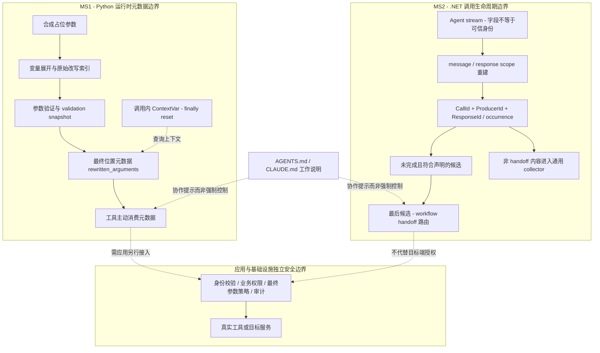

# MAF 参数改写溯源与 Handoff 生命周期：公开 NOT_RUN 验收模板

日期：2026-10-06（Asia/Shanghai）｜仓库：`microsoft/agent-framework`

**交付性质：静态验收设计，不是实验报告。16 张卡的 Observed 全部为 NOT_RUN；所有负控也未执行。上游测试仅 READ_NOT_RUN。** 本次仅阅读既有源码正文、核实引用链接及整理文档，未导入框架、安装依赖、运行上游测试、构建 runner 或连接模型。不能由 Expected 推导 PASS、工具安全、已发布包收录或 GA。

## 1. 固定版本与证据规则

| 版本代号 | 机制 | 固定源码提交（Git SHA，不是文件 SHA-256） |
|---|---|---|
| V1 | MS1：Python `rewritten_arguments`、validation snapshot、ContextVar | `3c2fe0a8a3657ca33132ed5726ce6658ff1fc04d` |
| V2 | MS2：.NET Handoff 的来源、响应与 occurrence 配对 | `bd5ab48cfdebb49b9223de0fc75c7141641927f3` |

每张卡的 V1/V2 均严格引用本表，不代表浮动 main、某个 wheel/NuGet 版本或两种语言已在同一应用集成。正式包收录、生产部署与跨版本兼容性均未验证。

证据分层：`READ_ONLY`＝固定源码静态阅读；`READ_NOT_RUN`＝读取上游测试与断言而未执行；`NOT_RUN`＝本模板尚无运行观测。自拟验收刺激、负控和策略属于设计，不冒充上游现成测试。证据 ID 指向来源，不是运行日志 ID。

### 四项公开来源

以下四个引用 URL 本轮均实际 HEAD，HTTP 200、curl exit 0；核实时间为 2026-10-05 19:48:28 UTC（北京时间次日）。HEAD 仅核实可达性，不证明代码行为。文件 SHA-256 是对已获取、用于静态阅读的正文重新计算，不由 HEAD 推出；见配套 [claims.json](claims.json)。

- **E1**：[V1 security.py](https://raw.githubusercontent.com/microsoft/agent-framework/3c2fe0a8a3657ca33132ed5726ce6658ff1fc04d/python/packages/core/agent_framework/security.py)。READ_ONLY。重点：L1878–1917 中间件与准备前后快照；L1971–1974 finally reset；L2379–2424 查询 API 与查询时快照兜底。
- **E2**：[V1 test_security.py](https://raw.githubusercontent.com/microsoft/agent-framework/3c2fe0a8a3657ca33132ed5726ce6658ff1fc04d/python/packages/core/tests/test_security.py)。READ_NOT_RUN。重点：L8205–8215 整数键 dict；L8260–8447 重排、过滤与不变验证器；L8451–8478 kwargs 重名；L8481–8524 最终键重映射 helper。
- **E3**：[V2 HandoffAgentExecutor.cs](https://raw.githubusercontent.com/microsoft/agent-framework/bd5ab48cfdebb49b9223de0fc75c7141641927f3/dotnet/src/Microsoft.Agents.AI.Workflows/Specialized/HandoffAgentExecutor.cs)。READ_ONLY。重点：L87 复合键；L97–142 stream scope；L149–209 occurrence 计数；L552–630 收集与最后候选；L634–669 候选条件。
- **E4**：[V2 HandoffAgentExecutorTests.cs](https://raw.githubusercontent.com/microsoft/agent-framework/bd5ab48cfdebb49b9223de0fc75c7141641927f3/dotnet/tests/Microsoft.Agents.AI.Workflows.UnitTests/HandoffAgentExecutorTests.cs)。READ_NOT_RUN。重点：L284 已完成事件；L417–464 缺 AgentId 与 foreign agent；L467–545 scope；L549–699 复合键、复用和完成先到。

## 2. 机制与边界图

**MS1 解决“工具最终收到哪些位置曾被变量展开改写”。** 顶层参数名映射到位置集合；list/tuple 用索引，非列表用 `{-1}`。准备前后类型敏感快照不同，或查询时发现参数已变，保守标记最终位置；键集变化时按最终顶层键重标。ContextVar 提供调用内的默认查询上下文，并在 finally 复位。**元数据发布不是自动授权。**

**MS2 解决“哪个尚未完成的 handoff 请求可以影响本轮路由”。** 用 `(CallId, ProducerId, ResponseId)` 和出现次数配对；必须是当前被调用 assistant、非空白 CallId、已声明 handoff 工具、未被配对完成的调用才成为候选。流结束后有多个候选时告警并选最后一个。**缺 AgentId 可回退当前被调用 agent，并不一律拒绝。**



两个子图是各自机制，不宣称存在 Python→.NET 的内置串联；虚线表示应由应用另行实现的接入，不是本次已验证控制。

## 3. MS1 验收卡（8 张）

共同前置 P1：未来仅用合成变量、内存记录工具；使用完整固定源码 core 包和真实 `LabelTrackingFunctionMiddleware.process`、`FunctionTool.invoke`。auto-prep 与 direct-middleware 路径分别记录。不得以 AST 摘取、同名重写实现或假包替代。该入口仍不是 `_auto_invoke_function`、完整 Agent loop、真实模型或业务工具端到端覆盖。以下刺激是供未来实现的设计，当前不执行。

### MS1-01｜精准索引与空映射的含义
- **版本**：V1。
- **前置**：P1；无改值验证器；工具记录实际参数和查询映射。
- **刺激**：四项列表中仅索引 1、3 为有效合成变量引用；另设全部原样值、无当前调用上下文两组。
- **Expected**：引用展开后 `files:{1,3}`；原样组及无上下文查询均可得 `{}`。两个空映射原因不同，均不能推出 TRUSTED、用户亲自指定或允许执行。
- **Observed**：NOT_RUN。
- **负控**：对同一引用输入伪造空映射，位置 oracle 应失败；禁止用“空映射→放行”替代业务权限校验。
- **证据 ID**：E1（L2379–2424）；精准索引刺激为基于接口的模板设计。

### MS1-02｜整体列表与非列表标记
- **版本**：V1。
- **前置**：P1；准备 scalar、两项 list、含整数键的 dict 合成变量。
- **刺激**：分别替换 scalar、整个列表、dict 内引用；记录最终实际类型。
- **Expected**：scalar/dict 使用 `{-1}`；整个两项列表使用 `{0,1}`。整数 dict key 不变成列表索引，`-1` 不是任意列表通配符。
- **Observed**：NOT_RUN。
- **负控**：将列表返回值替换成 `{-1}`，或把 dict 返回值当索引集合，类型/位置 oracle 应失败。
- **证据 ID**：E1；E2（L8205–8215 为 dict 断言，READ_NOT_RUN）。

### MS1-03｜auto-prep 重排、过滤与不变验证器
- **版本**：V1。
- **前置**：P1；显式启用 auto-prep fixture，保存准备前后快照及工具实参。
- **刺激**：引用值 `a` 与 `c,b` 逆序排序；引用值 `keep_me` 与 `drop_me,safe.txt` 过滤；第三组验证器返回原值。
- **Expected**：排序实参为 `c,b,a`、位置 `{0,1,2}`；过滤实参为 `keep_me,safe.txt`、位置 `{0,1}`；不变组保留精确 `{0}`，不是每次验证都全量重标。
- **Observed**：NOT_RUN。
- **负控**：保留旧索引 `{0}`，重排/过滤 oracle 应失败；不变组可识别无条件过度重标。
- **证据 ID**：E1（L1904–1917）；E2（L8260–8351，READ_NOT_RUN）。测试旧 docstring 写 `-1` 与 assert 不一致，以实现和断言为依据。

### MS1-04｜direct-middleware 查询时 snapshot 兜底
- **版本**：V1。
- **前置**：P1；不设置 auto-prep 标志；回调明确调用真实参数准备后再进入工具。
- **刺激**：重排、过滤与不变三组，在工具内调用无参 `rewritten_arguments()`。
- **Expected**：变动列表覆盖全部最终位置，不变列表仍精确；查询时 snapshot 对比发挥兜底作用。
- **Observed**：NOT_RUN。
- **负控**：概念性移除查询时快照比较；位置陈旧必须由 oracle 识别，而不是仅断言工具被调用。
- **证据 ID**：E1（L2409–2424）；E2（L8355–8447，READ_NOT_RUN）。这是 direct-middleware 集成层，不是 Agent E2E。

### MS1-05｜最终键重映射：仅 helper 层
- **版本**：V1。
- **前置**：手工构造最终参数 `files` 和旧 metadata 键 `fileNames`；另构造与当前参数不一致的 snapshot。
- **刺激**：分别设计 `_degrade_rewritten_arguments` helper 与公开查询 snapshot 分支的检查。
- **Expected**：两项最终列表的标记为 `files:{0,1}`，不能滞留在旧键下。
- **Observed**：NOT_RUN。
- **负控**：只保留 `fileNames:{0}`，按实际 callable 参数 `files` 查询时应被 oracle 判为漏标。
- **证据 ID**：E2（L8481–8524，READ_NOT_RUN）；E1（L2413–2423）。**helper 别名反例不是完整 Pydantic alias 端到端证明**；真实 alias pipeline 仍须独立验证。

### MS1-06｜arguments 与 kwargs 重名
- **版本**：V1。
- **前置**：P1；`arguments.files` 为两项原样值；`kwargs.files` 中放置变量引用。
- **刺激**：中间件展开后，工具仅按实际 arguments 调用，同时查询改写元数据。
- **Expected**：实参仍为原样列表；映射 `{}`，因为同名参数以 arguments 为准。不能拿 kwargs 中未被消费的改写来描述实际 callable 实参，也不能因此认证实参可信。
- **Observed**：NOT_RUN。
- **负控**：错误合并 kwargs 改写索引，造成对实际原样列表的虚假标记，oracle 应失败。
- **证据 ID**：E2（L8451–8478，READ_NOT_RUN）。发布后其它 middleware 再改 kwargs 的组合不在本卡保证内。

### MS1-07｜ContextVar 的异常复位与任务边界
- **版本**：V1。
- **前置**：P1；将同一 task 的顺序调用/嵌套调用与两个独立 task 的并发隔离分开。并发使用显式事件握手，不依赖 sleep。
- **刺激**：①在同一 task 内分别正常结束、捕获异常后立即查询；②外层映射为索引0，嵌套内层为索引1，内层正常或异常退出后仍在外层查询；③A/B 两 task 分别改写索引0/1并重叠读取。
- **Expected**：①同task退出恢复空上下文 `{}`；②内层退出恢复外层索引0，外层退出再恢复初始值；③各task只读自身映射。异常必须可观测，不能被记录为成功。父task查询为空只作补充，不能证明子task做过reset。
- **Observed**：NOT_RUN。
- **负控**：删去reset必须由同task退出或嵌套恢复断言检出；改用共享全局上下文由并发握手检出。两种负控使用各自oracle，不把父task为空算reset证据。该卡为原创设计，不冒充上游已运行测试。
- **证据 ID**：E1（L1884–1886、L1971–1974）；E2（L8219–8242 的 `asyncio.to_thread` 测试也仅 READ_NOT_RUN）。不外推任意线程、插件或跨进程安全。

### MS1-08｜元数据消费与无副作用对照
- **版本**：V1。
- **前置**：P1；两个除策略外相同的内存工具，均允许到达合成测试回调；计数器不是文件、邮件或实际外部副作用。
- **刺激**：同一改写输入，一组主动按最终位置执行“存在改写则不增加 effect”的自拟策略；另一组不消费该元数据。
- **Expected**：两组各进入工具一次；消费组 `effect=0`，不消费组 `effect=1`。差异来自应用策略，**不是 rewritten_arguments 自动拦截**。
- **Observed**：NOT_RUN。
- **负控**：在消费组漏掉读取或决策，effect 应改变并被业务 oracle 捕捉；若工具根本未进入，不能将 effect=0 记为策略有效。
- **证据 ID**：E1（L2379–2424 仅返回元数据）；成对 effect 检查为原创模板设计，无上游运行证据。

## 4. MS2 验收卡（8 张）

共同前置 P2：未来用固定 V2 的真实 executor、fake replay agent 与内存 workflow context；声明目标 B 的 handoff 工具 H。当前被调用 agent 为 A。显式记录输入 update、有效 role/producer/response、候选、`RequestedHandoffTargetAgentId`、`Transferred.`、告警及 external requests。`C(A,R,x)` 表示 assistant A 在响应 R 中发起 CallId=x 的 H 调用；`D(A,R,x)` 表示同键完成事件。非候选内容进入通用 collector 不等于全局拒绝；不得只用“没有排队状态消息”这一单一断言覆盖所有无路由情况。

### MS2-01｜候选准入不只检查工具名
- **版本**：V2。
- **前置**：P2；H 已声明，另一工具名 U 未声明为 handoff。
- **刺激**：基线 `C(A,R,x)` 未完成；分别替换为空白 CallId、非 assistant role、U。
- **Expected**：基线请求目标 B，并生成对应交接结果；三个变体都不作为 handoff 候选。collector 后续行为单独记录，不宣称原工具被全局禁用。
- **Observed**：NOT_RUN。
- **负控**：只按名称 H 判定，空 ID/非 assistant 变体将被误路由，oracle 应失败。
- **证据 ID**：E3（L634–669）；E4（L331–416，READ_NOT_RUN）。

### MS2-02｜同键完成取消候选
- **版本**：V2。
- **前置**：P2；只有一个未完成候选；分别测试命名 response 与匿名 scope。
- **刺激**：`C(A,R,x) → D(A,R,x)`；另测结果跨 message 且省略 ResponseId 的合法继承。
- **Expected**：同键 occurrence 完成后不路由、不追加新的 `Transferred.`；已知 response 可在后续结果消息省略字段时保留。不是“一跨 message 就丢弃 response”。
- **Observed**：NOT_RUN。
- **负控**：概念性忽略 completion，已完成同名工具事件将被误当委派请求。
- **证据 ID**：E3（L172–188、L114–136）；E4（L284、L591–625，READ_NOT_RUN）。

### MS2-03｜复合键隔离，而非只比 CallId
- **版本**：V2。
- **前置**：P2；每个变体重新构造 tracker。
- **刺激**：`C(A,R,x)` 后分别收到 `D(F,R,x)`、`D(A,S,x)`、`D(A,R,y)`，其中 F≠A、S≠R、y≠x。
- **Expected**：每组原请求仍可路由 B；其它 producer/response/call 的完成不能抵消该候选。null response 是精确 scope 值，不是匹配所有 response 的通配符。
- **Observed**：NOT_RUN。
- **负控**：仅按 CallId 消除候选将误取消前两组；同键完成的 MS2-02 是相反对照。
- **证据 ID**：E3（L87、L149–188）；E4（L358、L549–606，READ_NOT_RUN）。

### MS2-04｜完成先到：只消费对应 occurrence
- **版本**：V2。
- **前置**：P2；完成事件先进入流；scope 明确。
- **刺激**：`D(A,R,x) → C(A,R,x)`；另测先到 completion 来自 F 或 S。
- **Expected**：同键先到结果使随后对应 occurrence 不成为候选；异 producer/response 的先到结果不能取消 A/R 请求。
- **Observed**：NOT_RUN。
- **负控**：忽略 unmatched completion 会误路由同键组；把它记成全局 CallId 黑名单会误拒绝异键组。
- **证据 ID**：E3（L156–180）；E4（L669–699，READ_NOT_RUN）。

### MS2-05｜同 ID 再用不是永久封禁
- **版本**：V2。
- **前置**：P2；同一复合键出现多次，按顺序记录 occurrence。
- **刺激**：`C(A,R,x) → D(A,R,x) → C(A,R,x)`。
- **Expected**：第一次完成只抵消第一次请求；第二次未完成 occurrence 仍可路由 B，不能把 CallId 永久拉黑。
- **Observed**：NOT_RUN。
- **负控**：以完成 ID 集合替代计数配对，将误抑制第二次请求；此卡应识别该错误。
- **证据 ID**：E3（L145–209）；E4（L629–646，READ_NOT_RUN）。

### MS2-06｜流式继承限于兼容 scope
- **版本**：V2。
- **前置**：P2；首 chunk 给 assistant/producer 元数据，后续调用 chunk 缺 role 或 AgentId。
- **刺激**：同 message/response；显式跨 message；显式跨 response；连续全无 ID 的匿名 delta；同 scope 首块为 foreign producer 的变体。
- **Expected**：同兼容 scope 可继承 role/producer；已知边界转换清除旧 role/producer，缺 role 的新调用不能继承旧 assistant；匿名连续块为调用内 scope。同 scope 继承 foreign producer 仍不合格。response 的省略保留规则与 role/producer 不同。
- **Observed**：NOT_RUN。
- **负控**：全流共享旧 role/producer 会跨边界误路由；每个 chunk 无条件清空则会误拒合法 delta。
- **证据 ID**：E3（L97–142）；E4（L467–545、L650–666，READ_NOT_RUN）。

### MS2-07｜缺 AgentId 回退与显式 foreign 的区别
- **版本**：V2。
- **前置**：P2；有效 assistant role、非空 CallId、声明 H、未完成；不得从先前 foreign scope 继承 producer。
- **刺激**：AgentId=null；对照显式 AgentId=F；另测跨新 message 后 role=assistant 且 AgentId=null。
- **Expected**：无可继承 producer 时回退 invokedAgentId=A，仍可路由 B；显式 F 不进入候选。已知新消息边界可清掉旧 foreign producer 后回退 A。**缺来源字段不等于 fail-closed 拒绝，fallback 也不是身份认证。**
- **Observed**：NOT_RUN。
- **负控**：强制“缺 AgentId 一律拒绝”会违背此固定版本行为；忽略显式 foreign 字段则会误接收 foreign 请求。
- **证据 ID**：E3（L114–136，尤其 L134）；E4（L417–464、L507–523，READ_NOT_RUN）。

### MS2-08｜多个候选、输出时序与独立授权
- **版本**：V2。
- **前置**：P2；声明 H1→B、H2→C；开启 update 观测；两次不同 CallId 的请求均未完成。
- **刺激**：依次发出 H1、H2，并在最终选择前检查已输出 updates；附加一个不合格同名调用，记录 collector 去向。
- **Expected**：对多个剩余候选告警并选择最后一个 H2；交接结果保留所选候选的 CallId/ResponseId。部分 update 可在最终判定前输出；非候选进入通用 collector。这不是内容过滤或目标端授权。
- **Observed**：NOT_RUN。
- **负控**：概念性改成选第一个或静默选择，目标/告警 oracle 应失败；以“没有路由”推断“没有流出任何内容”的断言也应被输出记录反驳。
- **证据 ID**：E3（L567–625）。本卡为基于生产源码的设计，不声称上游同名测试已覆盖。

## 5. 客户中文 Q&A

**Q：schema 校验通过，文件名或收件人就来自用户本人吗？**
A：不是。宿主变量展开和验证器可改变值及位置。MS1 描述改写位置，不能证明原始意图、身份或权限；工具必须对最终参数实施自己的业务策略。

**Q：`rewritten_arguments()` 返回 `{}` 就能标为 trusted 吗？**
A：不能。无当前上下文、无改写 metadata、未改写以及 arguments/kwargs 重名优先级都可能产生空映射。缺少标记不是信任证明，也不是完整 taint analysis。

**Q：保守重标为何可能扩大检查范围？**
A：列表变动使旧位置失效，因此用最终位置全集；顶层键变化还需按最终键重标。额外业务检查可能增多，但不能将 `-1` 错当列表通配符，也不保证追踪任意深层 opaque 自定义对象。

**Q：是不是有 helper 的 alias 测试就可以宣布 alias E2E 成功？**
A：不是。E2 对应反例手工构造 metadata/快照，只说明 helper 预期。完整 Pydantic alias、模型入口、后续中间件和实际工具链必须另设端到端证据。

**Q：工具名叫 handoff，或 CallId 相同，是否足够触发/取消路由？**
A：不够。需候选准入条件、复合键和 occurrence 配对；完成事件不应重复触发交接，其它 producer/response 的同 ID 不能取消本次请求。

**Q：缺 AgentId 是拒绝还是允许？这是防伪来源认证吗？**
A：在本固定实现中，缺字段可能继承 producer 或回退被调用 agent，满足其它条件仍可路由。它是运行时归属规则，不验证字段真实性；跨租户权限、恶意 provider、远端 A2A 身份认证需独立控制。

**Q：可以作为升级或投产的通过证明吗？**
A：不可以。这里仅有源码阅读和 NOT_RUN 设计；无包级 smoke、完整 Agent E2E、checkpoint 恢复或服务端集成观测。框架 MS1 的 Experimental FIDES 路径及目标应用兼容性仍须单独核实。

## 6. 未来 POC 签字门（不是本次执行许可）

签字意味着审阅对应证据，不会把未执行模板变成通过证明。当前所有签字栏留空、结论保持 NOT_RUN。

| 门 | 必需证据与拒绝条件 | 责任方/签字/日期 | 当前结论 |
|---|---|---|---|
| G1 版本与字节 | 两个固定 SHA；完整源码、依赖锁、运行时与未来测试工件各自 hash；不得用可漂移版本替代 | 版本负责人：____ | NOT_RUN |
| G2 可重复技术环境 | 固定 Python/.NET runtime、ABI 与依赖；隔离临时环境，不安装到主环境；离线合成数据，无客户凭据/真实服务 | 环境负责人：____ | NOT_RUN |
| G3 执行隔离 | 无网络、非 root、只读根、最小挂载、无宿主凭据或容器 socket、去 capabilities、资源和硬超时；语言级审计不替代 OS 隔离 | 安全负责人：____ | NOT_RUN |
| G4 覆盖边界 | 真模块导入与真实调用路径；helper/direct-middleware/框架集成/E2E 分层；本模板不是可执行 runner，不得虚填结果 | 测试负责人：____ | NOT_RUN |
| G5 业务 oracle 与负控 | 全卡及各参数化变体都有实际参数/路由/事件记录；负控独立隔离，必须由目标业务断言发现错误；import/timeout/OOM/cleanup/缺案为 INVALID，不算负控有效 | 独立复核人：____ | NOT_RUN |
| G6 身份、策略与输出 | 空映射不授权；missing AgentId fallback 不认证；工具与目标端授权独立；审查 collector、流式先输出、日志脱敏与取消恢复 | 应用负责人：____ | NOT_RUN |
| G7 发布陈述 | 只有实际日志才能写 Observed；源码测试仍按实际执行状态标注；包级、模型级和生产证据未覆盖则明示；公开字节与 hash 复核 | 发布复核人：____ | NOT_RUN |

未来记录最小字段：`card_id`、子变体 ID、源码 SHA、工件 SHA-256、入口层级、输入与最终参数/事件、Expected、Observed、异常/基础设施状态、负控观察、日志证据 ID、复核人。敏感数据须在进入公开日志前处理。无运行证据时 `Observed=NOT_RUN`，不得用静态断言补齐结果。

### 必须保留的技术限制

- MS1 不等于完整污点追踪；深层别名、opaque custom 对象、任意自定义验证器、查询后再次改参、其它中间件更改 kwargs 的组合均不在本模板保证内。工具决策应绑定最终实参，避免查询与使用间再变更。
- ContextVar finally reset 不证明任意线程/插件共享状态安全；MS1-07 也仅是拟议验证范围。
- MS2 不校验 producer 字段真实性；null response 的继承/匹配是调用内规则，不代表全局消息认证。occurrence 不是持久化去重账本。
- 不作为 handoff 候选不等于全局禁止调用；通用 collector 可能继续处理。更新先于最终路由选择输出，故不是数据防泄漏或流内容过滤。
- 未验证实际模型/Azure、远端 A2A、真实副作用工具、正式 wheel/NuGet、生产部署、完整 checkpoint/取消恢复组合或跨租户隔离。

## 7. 可供 AGENTS.md / CLAUDE.md 引用的工作指令

下面只是可复制的团队工作说明，不创建或修改上述文件；它们不是运行时安全控制、权限机制、工具拦截器或测试执行许可。

```text
阅读《MAF 参数改写溯源与 Handoff 生命周期：公开 NOT_RUN 验收模板》及 claims.json。
以 V1/V2 的固定源码 SHA 为准；不要把 main、测试源码或 helper 结果冒充端到端运行证据。
默认仅做静态阅读与验收设计。没有真实执行日志，Observed 必须保持 NOT_RUN；上游测试记 READ_NOT_RUN。
MS1：记录最终参数、改写位置与入口层级；空映射不是 trusted；应用工具必须自行实施权限与参数策略。
MS2：记录 CallId/ProducerId/ResponseId、occurrence 和实际路由；缺 AgentId 可 fallback，不得写成一律拒绝或身份认证。
分别设计正例与负控，不运行真实副作用；基础设施异常不得算成业务防护有效。
保留 collector 与流式输出边界；未知包收录、alias E2E、模型和生产行为明确写未验证。
引用证据 ID 和源码位置，勿将引用到文档的工作说明视为已经部署的控制。
```

## 8. 配套文件与完整性

公开交付仅本文和 `claims.json`。后者保存机制声明、证据正文 SHA-256、实际 HEAD 结果、卡片索引及本文 SHA-256；不含运行日志，因为本次没有执行。`claims.json` 不声明自引用 hash，避免循环校验。文件完整性不等于行为已验证。
