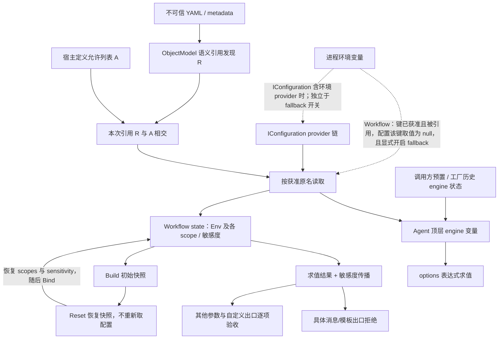

# MAF 声明式配置暴露门：离线 POC 验收设计模板

**日期：2026-09-28｜状态：验收设计模板；静态源码与测试分析；全部复演卡 NOT_RUN。**

适用对象：将不完全可信的 Agent / Workflow YAML 交给 .NET Microsoft Agent Framework（MAF）宿主加载的团队。目标不是证明“框架绝不会泄密”，而是验证**配置注入、表达式求值、状态生命周期、输出使用**四道边界是否符合宿主策略。所有示例只使用人工 canary，不使用真实密钥、生产账号或云服务。

## 1. 版本与证据等级

基准是 [MAF 提交 0bbb7245d408b6b7209eca58609ca53a52a66cec](https://github.com/microsoft/agent-framework/commit/0bbb7245d408b6b7209eca58609ca53a52a66cec)，提交标题为 `.NET: [BREAKING] fix: use allow list for configuration keys (#8200)`。本文不将主分支、标签、NuGet 版本视为等价对象。

| 等级 | 本文已有证据 | 能够说明 / 不能说明 |
|---|---|---|
| S：固定源码 | 附录固定 SHA 的 raw 源码 GET 成功 | 说明该快照的分支、调用次序与数据流；不是运行结果 |
| T：测试源码 | 实际断言、mock、调用顺序 | 说明维护者编码的期望；不等于本次测试通过 |
| D：文档 | 仅用于末尾 Copilot 生命周期对照 | 说明文档契约；不反推所有运行时实现 |
| R：本机复演 | **NOT_RUN** | 无测试通过、性能、并发隔离或生产安全认证结论 |
| P：发布包归属 | **未核实** | 不声称任何 NuGet 已包含该提交；落地前必须证明包与源码归属 |

实施时填写：`MAF SHA / 包名与版本 / 包归属证明 / ObjectModel 与 PowerFx 版本 / SDK / TFM / OS / IConfiguration providers 顺序 / engine 与 workflow 生命周期 / 测试过滤条件`。包无法映射到此快照时，结果不能沿用。

## 2. 可直接用于评审的问答

**问：YAML 写了 `Env.K`，就可以读取宿主所有配置吗？**

答：该快照的框架注入路径以语义模型提取引用集合 R，再与宿主允许集合 A 相交。Agent 使用 `allowedConfigurationVariables`，Workflow 使用 `AllowedEnvironmentVariables`；二者默认均不放行配置。允许列表是宿主提供，不是 YAML 自批权限。但是“本次注入集合受限”不等于“整个 engine 只有这些值”：调用方预置的 engine、复用工厂的旧变量、其他宿主扩展都要单独验收。

**问：关闭进程环境变量 fallback，是否保证不会接触进程环境？**

答：只能保证 Workflow 这里不主动调用 `Environment.GetEnvironmentVariable` 作为缺值回退。若宿主传入的 `IConfiguration` 自己包含环境变量 provider，获准键仍可从该配置链取值。不能把 fallback=false 画成整个进程环境的绝对隔离墙。

**问：旧构造函数还在，为什么升级后表达式失败？**

答：保留的是二进制入口，不是旧的全量配置暴露行为。旧构造函数转发空允许列表；Agent 测试明确预期引用 `Temperature` 时出现未识别名称异常。迁移应逐项登记必需键，而不是复制 `AsEnumerable()` 恢复全量注入。

**问：Sensitive 是否只是标记，还是会阻止发送？**

答：不只是标记：此快照在 `SendActivity` 文本、添加会话消息内容及 metadata、复制消息、InvokeAzureAgent 的 input messages、Question prompt 等具体出口设有拒绝分支；赋值、模板、部分表达式与恢复也传递敏感度。但这不是通用信息流安全证明。尤其 `InvokeAzureAgent.GetStructuredInputs()` 取 `.Value.ToObject()`，未在该方法检查敏感度；Bool Blank 分支返回 None、Array 的两个 GetValue 重载只返回值，同 scope 大小写碰撞也须单独验证（第 3.3–3.4 节）。消息通道的拒绝不能自动推广到结构化 arguments、路由字段、所有日志与自定义工具。此处只定位待验边界，不宣称已复现漏洞。

**问：同一 factory / workflow 可以跨安全域复用吗？**

答：不能凭允许列表推导该保证。Agent 工厂持有同一个 engine，初始化只更新本次相交键、不清理历史键；Workflow 每次 Build 创建 engine，但同一 Build 的 Env 是构建时快照。会话状态隔离的上游测试不能替代配置撤销、重载或任意并发安全验证。

## 3. 调用链、状态与容易混淆的语义

### 3.1 Agent：加载与求值不是同一个门

```text
CreateFromYamlAsync
  → factory.FromYaml
    → AgentBotElementYaml.FromYaml → 反序列化 Prompt
    → WrapPromptAgentWithBot(configuration, allowlist)
      → GetReferencedEnvironmentVariableNames → 语义模型引用集合
      → 对允许且引用、且配置非 null 的键添加 EnvironmentVariableDefinition
  → PromptAgentFactory.CreateAsync
    → InitializeConfigurationVariables
    → ChatClientPromptAgentFactory.TryCreateAsync
      → InitializeConfigurationVariables（再次调用）
      → GetChatOptionsAsync → Number/Int/Bool/String EvalAsync → ChatClientAgent
```

直接调用 `ChatClientPromptAgentFactory.TryCreateAsync(metadata)` 只走一次其初始化；`CreateAsync(metadata)` 在基类和具体工厂各走一次。直接调用一个自定义派生工厂的抽象 `TryCreateAsync`，则不能假定基类替它初始化，必须检查 override。YAML 路径还会在包装模型时读配置，所以不能将总读取次数一概写成“两次”。

Agent 允许集合由 `HashSet<string>(..., OrdinalIgnoreCase)` 在构造时复制；取值按**引用中的原名**调用配置 indexer。初始化使用 `Engine.UpdateVariable(variableName, configuration[variableName] ?? string.Empty)`，这里是 engine 顶层名，不是建立一个完整 `Env` record。变量引用分支的 evaluator 使用 `VariableReference.VariableName`；一般表达式分支则直接使用 `ExpressionText`。因此 YAML 中的简单 `=Env.Temperature`、裸 engine 名 `Temperature`、复合 `=Value(Env.Temperature)` 必须分别测试，不能凭简单引用成功就推断所有表达式语法等价。[S1–S4]

同一个 engine 在工厂生命周期内保留。没有清空旧键、重置、回滚失败创建的代码；先初始化后 options 求值，后续失败也可能留下已注入值。这是静态可见的状态边界，不是已证明的跨租户攻击。工厂自建 engine 的默认最大表达式长度为 10000；传入 engine 不经过其 `CreateConfig`，已有函数、符号和资源限制由调用方负责。公开 ChatClient 工厂构造函数也没有额外暴露最大长度参数，不能照抄基类参数作为其 API。[S1–S2]

### 3.2 Workflow：Build 时取值，Reset 不等于配置重载

```text
DeclarativeWorkflowBuilder.Build(reader, options)
  → ReadWorkflow
  → options.CreateRecalcEngine → RecalcEngineFactory.Create（新实例）
  → new WorkflowFormulaState
  → InitializeSystem → 语义模型 → InitializeEnvironment → InitializeDefaults
  → CaptureInitialState
  → root executor 与 action executors 共享 state
  → 执行时绑定 scope / 求值 / 敏感度传播 / 具体出口检查
ResetAsync → state.Reset → 恢复构建时初始 scopes → Bind
Checkpoint restore → 初始快照 + Local/Global/System 恢复（含 sensitivity sidecar）
```

`Env` 不在 `RestorableScopes` 中。配置键轮换后，同一已 Build 工作流的 Reset 不会重新读取配置；重新 Build 才是这里明确可见的取值时机。初始 scope 快照复制容器，不应进一步宣称它提供所有可变 FormulaValue 的深复制隔离。[S5–S8]

代码生成/Kit 的 `RootExecutor.InitializeEnvironmentAsync(context, names)` 是另一条入口：它将显式传入的名字与冻结的 Ordinal 允许集合相交，不调用 YAML 语义模型；其 `ResetAsync` 是空实现。不能拿解释器 Build 路径的快照行为覆盖这条路径。[S9]

### 3.3 真值表：名称、空值与敏感度必须分列

| 条件 | Agent 工厂 | Workflow 解释器 Build |
|---|---|---|
| 默认允许列表 | 空；不注入 | 空；不注入 |
| allowlist 匹配 | OrdinalIgnoreCase | Ordinal，区分大小写 |
| 已获准但未被引用 | 不为本定义新增该键；旧 engine 残留另算 | 不初始化该键 |
| Configuration=null | 初始化提前返回 | 允许键可按显式 fallback 取进程环境 |
| indexer 返回 null | engine 注入空字符串；模型包装阶段跳过该键 | fallback=false → String Blank；true → 尝试进程环境 |
| indexer 返回空字符串 | engine StringValue 空串；模型包装保留空值 | **不 fallback**；转 String Blank |
| indexer 返回非空 | 注入字符串 | 优先采用配置值并标 Sensitive |
| 只有空格 | 不是 null/空串；保留 | 不是 null/空串；保留 |
| 未放行 Workflow 键 | 不适用 | `state.Get` 对不存在键返回 Blank；不意味着执行该缺失字段的表达式必然成功 |

注意：允许列表比较器、配置 provider 的键比较器、Power Fx 名称解析、操作系统环境变量比较规则、敏感度字典比较器是不同层。Workflow 值字典区分大小写，敏感度字典使用 OrdinalIgnoreCase；这里的大小写折叠碰撞（casefold）特指该比较器，不泛指任意 Unicode 归一化。同 scope 先 Set("Secret", canary, Sensitive)，后 Set("secret", public, None)，静态可推出：两个值键可并存，而共享标签槽被后写覆盖。**这是直接 state API 的数据结构反例，不是 YAML / Power Fx 可达性、出口泄露或已复现漏洞的证明**。卡 03 分两层验证，Reset/checkpoint 也不能预设会修复标签。宿主可拒绝同 scope 名称规范化碰撞；本文不据此建议未经验证地修改上游。[S7、S13]

### 3.4 两种“引用分析”不能混为一谈

- **配置入口引用发现**：Agent 与 Workflow 都依赖 ObjectModel 的 `GetAllEnvironmentVariablesReferencedInTheBot()`，不是字符串包含 `Env.` 就授权。其对 quoted names、整段 Env、动态组合名称和不可达分支的完整覆盖，不能仅由调用者源码断言。
- **求值结果敏感度分析**：Workflow 在求值后通过 `Engine.Check` 的语法树遍历 dotted/first-name、As、二元/一元、call 与 variadic 节点。上游测试用**手动预置 state**验证 `Env.'API-KEY'`、整段 `Env`、`First(Local.SecretTable).Value` 为 Sensitive，而 `Concatenate("Env.SOME_SECRET", " literal")` 不是 Sensitive。它们证明敏感度路径的测试期望，**没有单独证明这些写法都能通过 Build 的配置引用发现**。[S10–S11]
- **重载与消费边界**：敏感度返回契约按 overload 不同：BoolExpression 的 BlankValue 分支返回 `false / None`，即使其表达式结果原有 Sensitive；两个公开 `GetValue(ArrayExpression<T>/ArrayExpressionOnly<T>)` 只返回 `ImmutableArray<T>`，取内部 Evaluate 的 `.Value` 而不返回标签。它们是否影响具体出口须逐个调用点验证，不等于已发生泄露。卡 10 补 Bool Blank 与 Array 返回类型/消费点负控；AST 未穷尽语法仍为未知，不能因 switch 未显式列出某节点就宣称绕过。[S10:41–43、97–118、269–289]

另一个证据陷阱：`AgentBotElementYamlTests.FromYaml_WithVariableReferences` 的 helper 自建 engine 并遍历 `configuration.AsEnumerable()`。该测试可验证解析/求值，不可用来证明生产工厂执行了 allowlist。真正的工厂负控见 `ChatClientAgentFactoryTests`。[T1–T2]

## 4. 架构图落点



画图时必须保留历史 engine 的旁路、provider 链、默认关闭的 fallback 边，以及“出口检查是具体位置”的限定。不要画成 Env 注入后自动获得全局 DLP 或租户隔离。

## 5. 离线 POC 基座与观测约定

### 5.1 执行条件

本文未执行 restore/build/test，全部复演卡为 NOT_RUN。该源码快照的 `dotnet/global.json` 声明 SDK `10.0.401`、`rollForward: minor`、`allowPrerelease: false`，并选择 Microsoft.Testing.Platform；执行前须在获准隔离环境验证 SDK 与离线依赖完整性。

后续复演需另行准备获准隔离环境：固定源码快照、匹配 SDK、已审核且完整的离线依赖缓存、禁止外网和凭据挂载、只允许临时输出。`--no-restore` 不是禁网沙箱；已有 dotnet 也不证明依赖齐全。Workflow 测试项目引用 Foundry 项目、Azure.Identity 并开启共享集成测试代码注入，应采用明确测试过滤和全 mock，而非运行整个项目。不要执行来源页面给出的安装或启动命令。

### 5.2 最小输入与探针

Agent 基线（使用 mock IChatClient，不调用模型）：

```yaml
kind: Prompt
name: config-gate-poc
instructions: Offline canary only.
model:
  id: offline-model
  options:
    temperature: =Env.Temperature
```

Workflow 基线（mock ResponseAgentProvider；只读 state 时不必 Run）：

```yaml
kind: Workflow
trigger:
  kind: OnConversationStart
  id: config_gate
  actions:
    - kind: SetVariable
      id: referenced_only
      disabled: true
      variable: Local.Probe
      value: =Env.POC_VALUE
```

复演须在该快照对应的测试工程隔离副本中实现，利用其 internal 可见性。Agent 可仿照 T1 的 `InspectingPromptAgentFactory` 暴露 `Engine.Check` / `Engine.EvalAsync`；该测试 override 只初始化并返回 null，所以调用 `TryCreateAsync`，不能调用会拒绝 null agent 的 `CreateAsync`。验收真实创建路径则用 `ChatClientPromptAgentFactory`。Workflow 可沿用 T3 的 `GetRootState` 测试辅助函数；它通过反射读取 private state 字段，仅限测试，不是公共生产 API。分别记录 `Keys(Env)`、`Get` 的 FormulaValue 类型和 `GetSensitivity`；不能只用 Blank 判断键是否从未注入。

每卡记录：`case_id、SHA、输入全文、允许列表、provider 顺序、调用序列、符号/键集合、值类型、敏感度、异常阶段与类型、mock 调用次数、engine 身份、状态 PASS/FAIL/NOT_RUN`。公开结果只记录人工 canary；运行前后恢复临时进程环境，相关用例串行运行。所有卡的“期望”是静态推导或待验证的宿主验收目标，不是已发生结果。

## 6. 十个待实现验收设计卡

各卡均为测试工单，不是完整可执行 fixture。未另说明时：使用第 5.2 节外壳、独立内存配置且不附加默认 providers，fallback=false，新建 engine/state，全 mock。Agent 数值 canary 使用字符串 `"0.9"` / `"0.8"`；Workflow 仅 Build 的引用动作保留 `disabled: true`，需要执行的卡 03/10 明确不禁用。修改 YAML 时只替换所列字段，执行前保存展开后的全文。没有实测结果时所有子例仍为 NOT_RUN。

### 卡 01｜默认拒绝与旧构造函数迁移
- **前置**：全新 engine / 工厂；配置仅 `Temperature="0.9"`；mock client。
- **输入**：上述 Agent YAML；分别使用旧构造函数、显式空 allowlist、`["Temperature"]`。
- **步骤**：每个分支新建工厂；经 YAML 创建路径创建 agent；另用 T1 相同 metadata 直接 `TryCreateAsync` 对照；记录是否进入 chat transport。
- **期望**：旧/空列表不能获得该值；基准测试期望 `InvalidOperationException` 含 `Temperature` 未识别。正控产生 `ChatOptions.Temperature=0.9`，无需模型调用。不以 YAML 解析成功充当创建成功。
- **证据 / 状态**：S1–S4、T1；**NOT_RUN**。

### 卡 02｜允许 ∩ 引用，而非允许列表全量装载
- **前置**：新建 Agent 探针工厂和 Workflow；配置 `Temperature="0.9"`、`TopP="0.8"`、`Unused="CANARY_UNUSED"`。
- **输入**：Agent 使用 T2 `PromptAgents.AgentWithVariableReferences` 的 options 模型形态，只保留 Temperature 与 TopP 两项变量引用（移除 connection 及其他环境引用），allowlist=`["Temperature","Unused"]`；保存实际 metadata 与序列化全文，不猜测未核对的 YAML 字段别名。Workflow 仅在两个 disabled SetVariable 动作中分别引用 Temperature、TopP，Unused 不出现在 YAML；allowlist 同为 `["Temperature","Unused"]`。两个动作分别用 id=`ref_temperature` / `ref_top_p`，variable=`Local.TemperatureProbe` / `Local.TopPProbe`，value=`=Env.Temperature` / `=Env.TopP`，不运行这两个动作。
- **步骤**：用探针初始化而非实际求值未授权 TopP；读取 Agent 的 Check("Temperature")、Check("TopP")、Check("Unused")；Workflow 获取 Env keys 与值；配置 provider 记录被读键。
- **期望**：只有 Temperature 本次被注入；TopP 未放行、Unused 未引用，均不应因配置存在而注入。Workflow 未初始化键 `Get` 可返回 Blank，keys 才能区分不存在与已注入 Blank。
- **证据 / 状态**：S1、S5、T1–T3；**NOT_RUN**。

### 卡 03｜大小写分层，不用一条“忽略大小写”概括
- **前置**：可记录 indexer 名称的内存配置；返回 `Temperature="0.9"`。
- **输入**：引用保持 `Env.Temperature`，仅将允许列表改为 `["temperature"]`；第二轮改回 `["Temperature"]`。
- **步骤**：分别在全新 Agent / Workflow 初始化；记录门是否通过、实际传给 indexer 的键名、keys 和值；随后单独改变 provider 为区分大小写实现，隔离 provider 差异。
- **期望**：第一轮 Agent allowlist 匹配通过，Workflow 不通过；第二轮两者通过入口门。不能由此声称引擎中所有表达式名字也忽略大小写；provider 测试结果单列。
- **03-S：直接 state 层碰撞**（独立于上述 allowlist 子例）：全新 state、默认 Local scope，先 `state.Set("Secret", FormulaValue.New("CANARY_CASE_SECRET"), sensitivity: SensitivityLevel.Sensitive)` 并 `CaptureInitialState()`，再 `state.Set("secret", FormulaValue.New("CANARY_CASE_PUBLIC"), sensitivity: SensitivityLevel.None)`。在 Bind **之前**记录 `Keys(Local)`、两个 Get 值和两个 GetSensitivity。源码层预测两个值均在而两个标签查询均为 None；宿主政策则要求碰撞被拒绝或敏感标签保持安全，预测不等于验收通过。
- **03-S 恢复分支**：先保存上述观测，再调用 Reset，捕获 Bind 是否异常；初始快照只含 Secret/Sensitive，预测恢复该值和标签、去掉小写键。另建独立 state，以两次写入后的状态 CaptureInitialState，再 Reset，检查快照是否仍带碰撞；不可把第一分支恢复安全外推到所有快照。checkpoint 用 T5 的严格 mock 明确提供 Local 两键的 PortableValue 与 sidecar：先用碰撞后双 None，再用 Secret=Sensitive / secret=None；分别在新 state RestoreAsync，记录 mock 返回键的遍历顺序、恢复后的 keys/值/标签及 Bind 异常。后一组可能受写入次序影响，不能承诺修复；恢复未完成也须记录可读的 state。直接 Set 不自动持久化，不把它冒充 checkpoint 写入。
- **03-Y：YAML 到出口的可达性层**：独立配置 POC_VALUE=`CANARY_CASE_SECRET`，allowlist=`["POC_VALUE"]`；下列完整 YAML 不设 disabled。记录解析→Build/引用发现→每次 SetVariable→Bind→求值→SendActivity 的实际最早失败阶段、名称冲突/异常，以及事件计数；与不含第二次 SetVariable 的敏感拒绝正控比较。只有确实到达出口才讨论出口结果，不能把 03-S 推导当成 03-Y 已执行。

```yaml
kind: Workflow
trigger:
  kind: OnConversationStart
  id: case_collision
  actions:
    - kind: SetVariable
      id: set_sensitive
      variable: Local.Secret
      value: =Env.POC_VALUE
    - kind: SetVariable
      id: set_public_case_variant
      variable: Local.secret
      value: CANARY_CASE_PUBLIC
    - kind: SendActivity
      id: observe_original_name
      activity: '={Local.Secret}'
```

- **判定 / 证据 / 状态**：03-S 记录静态预测与实际值；03-Y 的 Power Fx 名称解析和出口可达性未知。宿主增加同 scope 规范化碰撞拒绝后另跑负控；不宣称已复现漏洞。S1、S5、S7:68–83/224–242、S12–S13、T5；所有子例 **NOT_RUN**。

### 卡 04｜null、空串、空格不是一种缺值
- **前置**：允许并引用 POC_VALUE；进程变量为 `CANARY_PROCESS`；Workflow fallback=true。
- **输入**：Workflow 使用第 5.2 节 YAML，配置 indexer 分别返回 null、`""`、`" "`；另测 Configuration 整体为 null。Agent 探针 metadata 将基线 temperature 引用改为 `=Env.POC_VALUE`，allowlist=`["POC_VALUE"]`，只初始化/读 engine，不进行数值 options 求值。
- **步骤**：各分支新 Build；记录 Env keys、Get 值类型和敏感度；Agent 用探针工厂重复，避免数字转换干扰。模型包装的 EnvironmentVariables 与 engine 注入分别记录。
- **期望**：Workflow 仅 null 才尝试 fallback，空串为 String Blank、空格保留；Agent 配置对象存在但值 null 时注入空串，配置对象 null 时不注入；Agent 模型包装跳过 null 而不跳过空串。不要把包装结果当成 engine 结果。
- **证据 / 状态**：S1、S3、S5；**NOT_RUN**。

### 卡 05｜fallback 默认关闭、配置优先及 provider 链边界
- **前置**：人工进程变量 POC_VALUE=`CANARY_PROCESS`；允许并引用该键。
- **输入**：A 配置缺值、fallback=false；B 缺值、true；C 配置=`CANARY_CONFIG`、true；D 不允许该键、true；E 配置 provider 本身读取进程环境、fallback=false。
- **步骤**：每分支独立 Build，记录配置 indexer 访问、最终值及 keys；finally 恢复原进程变量，不并行执行。
- **期望**：A 为 Blank，B 为 PROCESS，C 为 CONFIG，D 不注入；E 可以经 IConfiguration 获取 PROCESS，这不是直接 fallback 被打开。所有获准初始化的 Workflow 值含 Sensitive 标记。
- **证据 / 状态**：S5、T3 的两个环境测试；**NOT_RUN**。

### 卡 06｜表达式引用发现与敏感度分析分别验收
- **前置**：新 Build / engine；Workflow 配置 POC_VALUE=`CANARY_REF`、API-KEY=`CANARY_QUOTED`，allowlist=`["POC_VALUE","API-KEY"]`。Agent 另设 Temperature=`"0.9"`，allowlist=`["Temperature"]`。手动 state 正控另设 Local.SecretTable 为单行表 `{Value: "CANARY_TABLE"}` 且 Sensitive，Env 的两键也各设 Sensitive；这是独立于 Build 的人工预置。
- **输入**：Workflow 依次使用 `=Env.POC_VALUE`、`=Env.'API-KEY'`、`=Concatenate("Env.POC_VALUE", " literal")`、`=Env`；Agent 对比简单 `=Env.Temperature` 与复合 `=Value(Env.Temperature)`。
- **步骤**：先只解析并获取语义模型引用集合，再初始化并记录注入 keys，最后单独求值；另按 S11 测试手动预置 state，验证 quoted / whole-scope / computed dotted 的敏感度。绝不能以手工预置正控代替入口正控。
- **期望**：文本中的 Env 字样不能成为读配置的理由；明确记录 quoted 和 whole-scope 的发现结果。S11 已编码上述手工 state 敏感度期望，但入口发现与 Agent 复合表达式是否成立仍待本卡确认。发现未知或额外读取按宿主策略阻断，不编造“全支持”结论。
- **证据 / 状态**：S3–S4、S10–S11；**NOT_RUN**。

### 卡 07｜工厂复用残留与调用方 engine 预置
- **前置**：配置 Temperature=`"0.9"`、TopP=`"0.8"`；允许 `["Temperature","TopP"]`；禁止跨安全域实际流量。
- **输入**：定义 A 只引用 Temperature，定义 B 只引用 TopP；另一个 engine 预置 `Injected="CANARY_PRELOADED"`，交给空允许列表工厂。
- **步骤**：同一探针工厂按 A→B 初始化，B 后检查 Temperature 是否仍可求值；用全新 B 工厂作负控；检查预置 engine 中 Injected 是否保留。再用独立 engine 预置数值 `NumericCanary=0.7`（不是字符串），交给空 allowlist 的实际 ChatClient 工厂，令 `model.options.temperature: =NumericCanary`，记录是否可读取，不能将探针 Eval 等同于 YAML 可达。
- **期望**：源码无删除逻辑，预测复用工厂保留 A 的旧变量；全新 B 工厂不带 A 值；空 allowlist 不清除预置符号。裸表达式可达性单列待验。若宿主要求每定义/每租户隔离，应拒绝共享 engine，不能将残留现象误报成 allowlist 新注入了未授权键。
- **证据 / 状态**：S1–S4；**NOT_RUN**。

### 卡 08｜双初始化、可变配置与失败后的状态
- **前置**：记录读取次数的 IConfiguration；metadata 先在无配置条件下解析，避免 YAML 包装读数混入；固定 provider 的 Temperature=`"0.9"`，可变 provider 按读取次序返回 `"0.1"`、`"0.2"`、`"0.3"`，之后保持 `"0.3"`；allowlist=`["Temperature"]`。两个 provider 分别测试，不组成一条链。
- **输入**：仅引用 Temperature 的有效定义；另加一个未放行 TopP 的 options 定义用于后续求值失败。
- **步骤**：在独立 ChatClient 工厂分别调用 TryCreateAsync(metadata)、CreateAsync(metadata)；记录每键读取次序；再执行失败定义并通过受控 engine 检查之前注入的 Temperature。最后补跑 YAML 入口，单独标识包装阶段读取。
- **期望**：具体工厂 Try 初始化一次；Create 的基类与 override 各初始化一次。可变 provider 不具有原子配置快照保证；创建失败不意味着先前更新自动回滚。上游单次创建正控不能覆盖此生命周期风险；宿主宜使用不可变配置快照并在失败后丢弃工厂。
- **证据 / 状态**：S1–S3、T1；**NOT_RUN**。

### 卡 09｜Workflow 快照、轮换、会话与 Kit 路径
- **前置**：配置 POC_VALUE=`CANARY_V1`，允许引用；两次独立 Build；mock provider 不出网。
- **输入**：使用第 5.2 节 Workflow，Build A 后将配置改为 `CANARY_V2`，仍使用 A；再 Build B。另使用 T3 的 state-echo 定义和 RecordingAgentProvider，两个显式会话的输入按序为 `EMBER-QUARTZ-7319`、`inspect-alice`、`inspect-mallory`、`ONYX-CEDAR-4826`、`inspect-alice-again`；独立隐式会话输入为 `EMBER-QUARTZ-7319`、`inspect-implicit`，不混用前一轮会话。Kit 子例配置 ALLOWED=`CANARY_KIT_ALLOWED`、HIDDEN=`CANARY_KIT_HIDDEN`，允许列表仅 `["ALLOWED"]`。
- **步骤**：记录 A 初始 Env，Reset 后再读；比较 B 的 Env 和 engine 身份；依 T3 顺序“会话一写→会话一读→会话二读/写→会话一再读”记录 Local.Marker。另依 S9/T4 实现测试 RootExecutor，先传 ALLOWED/HIDDEN 后检查 queue 次数与 Sensitive sidecar。
- **期望**：A Reset 恢复 V1 而不是轮换成 V2；B 为 V2 且 engine 不同。T3 编码了显式/隐式会话隔离预期，但未证明并发与配置动态撤销。Kit 只 queue 获准名字，Reset 无操作，不可冒充解释器的快照恢复。
- **证据 / 状态**：S6–S9、T3–T4；**NOT_RUN**。

### 卡 10｜Sensitive 的具体出口与未覆盖参数
- **前置**：全 mock；配置 POC_VALUE=`CANARY_SINK`，allowlist=`["POC_VALUE"]`，经 Build 初始化 Env.POC_VALUE/Sensitive；事件、消息、结构化参数分别捕获，不向模型发送。各子例独立运行，不因前一例拒绝而跳过后续负控。
- **10-A/B/C 模板输入**：T5 的 `TemplateLine.Parse("={Env.POC_VALUE}")` 是插值输入，`TemplateLine.Parse("Env.POC_VALUE")` 是普通字面文本；不能省略表达式标记而仍声称测了敏感发送。下列为完整的 **B** YAML 序列化输入（`activity` 是标量，不是裸 Power Fx value）；**A** 删除 SetVariable 动作并将 activity 改为 `'={Env.POC_VALUE}'`；**C** 同样删除 SetVariable，但 activity 改为 `'Env.POC_VALUE'`。YAML 的引号只是序列化边界，不属于传入模板的字符串。此形态参考 T3 的 scalar activity 与 T5 模板构造，仍须运行解析检查，不声称已执行。

```yaml
kind: Workflow
trigger:
  kind: OnConversationStart
  id: sensitive_sink
  actions:
    - kind: SetVariable
      id: copy_sensitive
      variable: Local.Copied
      value: =Env.POC_VALUE
    - kind: SendActivity
      id: send_probe
      activity: '={Local.Copied}'
```

- **10-D messages / arguments**：使用 T6 的 CreateModel/CapturingAgentProvider 测试 helper，不虚构 YAML 字段或生产 SDK 命令。D1 初始化 System 后，将 Local.SourceMessages 设为仅含 `ChatMessage(User,"CANARY_MSG")` 的 table、标 Sensitive，messages=`ValueExpression.Variable(PropertyPath.TopicVariable("SourceMessages"))`，无 arguments。D2 使用独立 state，Local.ArgumentCanary=`CANARY_ARG`、Sensitive，arguments 仅 `("input", ValueExpression.Variable(PropertyPath.TopicVariable("ArgumentCanary")))`，不附敏感 messages。两例 agentName=`offline-canary`，mock 返回 `CANARY_ACK`；Bind 后分别执行，记录 provider 收到的值与次数，不能由 D1 提前拒绝代替 D2。
- **10-E Bool Blank**：独立人工 state.Set("SensitiveBlank", FormulaValue.NewBlank(), sensitivity: Sensitive)，Bind 后以 `BoolExpression.Variable(PropertyPath.TopicVariable("SensitiveBlank"))` 调用 evaluator.GetValue；另设 SensitiveBool=`true`/Sensitive 作正控。记录 state 原标签、结果类型/值/标签。源码预测 Blank→`false/None`，Boolean→`true/Sensitive`。再由测试内本地布尔消费探针捕获结果；如要外推 Condition/路由，须另指定实际调用点及其检查，未覆盖则保持未知，不称 Blank 可泄露 canary 字符串。
- **10-F Array 返回/消费边界**：独立 state 设 Local.SensitiveArray=`FormulaValue.NewSingleColumnTable(FormulaValue.New("CANARY_ARRAY_A"), FormulaValue.New("CANARY_ARRAY_B"))`，标 Sensitive 并 Bind。分别以 `ArrayExpression<string>.Variable(PropertyPath.TopicVariable("SensitiveArray"))` 和 `ArrayExpressionOnly<string>.Variable(PropertyPath.TopicVariable("SensitiveArray"))` 调用公开 GetValue。与同值 None 标签的独立 state 比较。记录返回类型、元素及是否存在标签字段；源码预测两者都是只含值的 `ImmutableArray<string>`。将返回数组交给仅驻内存的测试消费探针，记录 canary 可见但接口不携标签；这是人为消费点，不冒充上游出口。每个拟部署消费者还须填 `调用位置→是否另查 state/sidecar→最终 sink→策略`，实际调用点未核验则消费影响保持 UNKNOWN/NOT_RUN，不能由数组类型直接认定漏洞。
- **步骤与期望**：A/B 先核对 evaluator value/sensitivity，再确认 SendActivity 应在输出前拒绝；C 应为 None 的字面文本。记录解析/Bind/求值/发送异常阶段与 MessageActivity/AgentResponse 事件数。B 的 checkpoint 以 T5 mock 明确提供 Local.Copied=`CANARY_SINK` 及 Sensitive sidecar，在新 state RestoreAsync 后重新求值和发送，不能用仅值恢复代替标签恢复。D1 有敏感消息拒绝分支；D2 arguments 方法未查标签，静态预测可交给 mock provider，仅作宿主政策边界，不宣称云端泄露。E/F 只证明各重载契约的待验预期；如果宿主政策要求标签在其消费链不丢失，应增加消费前检查并独立验收。卡 03 的大小写碰撞必须另记，不以本卡通常传播正控替代。
- **证据 / 状态**：S7、S10:41–43/97–118/269–289、S11 Bool/Array 测试、S12–S13、T3、T5–T6；10-A 至 10-F 及恢复子例全部 **NOT_RUN**。

## 7. 结果判定与交付清单

- **版本门**：只有提交级证据时，报告写“此源码快照”；包归属未核不得写“升级到某 NuGet 即解决”。
- **入口门**：全新状态下，不允许且/或不引用的键不因配置存在而注入；allowlist 不使用通配全量配置替代。
- **名称门**：同 scope 的规范化名称碰撞须被宿主拒绝或有证据证明标签保持安全；将 state 层结果、YAML/Power Fx 可达性及 checkpoint/Reset 分别记录。
- **生命周期门**：engine 的所有者、隔离范围、失败丢弃、配置轮换与重新 Build 策略明确；状态复用卡不得跳过。
- **输出门**：分别验收内容、metadata、arguments、路由字段、日志/异常；Sensitive 不等于加密，不等于完整 DLP，也不阻止所有控制流侧信道。
- **资源门**：记录实际 engine 的 MaximumExpressionLength / MaxCallDepth；Workflow options 路径默认长度 10000，底层 RecalcEngineFactory 直接调用的默认行为不可混写；传入 Agent engine 的配置必须另核。
- **交付物**：问答使用第 2 节；第 6 节和观测字段复制为待实现测试工单，须补齐完整 fixture、独立 mock 及经批准的 MTP 过滤方式后执行；架构评审使用第 4 节。所有 NOT_RUN 必须有独立状态，不允许空结果被解释为通过。

建议验收记录：

```json
{
  "case_id": "MAF-GATE-01",
  "source_sha": "0bbb7245d408b6b7209eca58609ca53a52a66cec",
  "package_mapping": "UNVERIFIED",
  "status": "NOT_RUN",
  "actual": null,
  "exception_stage": null,
  "outbound_calls": null,
  "engine_lifetime": "填写：每定义/每会话/共享",
  "evidence": [],
  "review_decision": "PENDING"
}
```

## 8. Copilot SDK reload 生命周期对照（仅两段）

**文档契约层。** [d106d29dc6c5112da2abdae59008571b6692f12b 的 skills 文档](https://raw.githubusercontent.com/github/copilot-sdk/d106d29dc6c5112da2abdae59008571b6692f12b/docs/features/skills.md) 第 370–384 行说明：首次加载会扫描配置目录，即使当时目录缺失或为空；之后增删改文件不会让下一轮自动刷新 catalog，需要会话 `skills.reload`，改变配置目录也会刷新。它与 MAF 的共同点是“外部来源变化”不等于“已加载内存状态变化”；差异是 Copilot 有明确 reload RPC，MAF 此处是工厂更新或 Build 快照，并没有由本文证据支持的同名热重载契约。此处不外推到 SDK 发布包或所有服务端实现。

**测试源码层。** [同 SHA 的 Node.js skills e2e 测试](https://raw.githubusercontent.com/github/copilot-sdk/d106d29dc6c5112da2abdae59008571b6692f12b/nodejs/test/e2e/skills.e2e.test.ts) 第 46–114 行依次：创建配置目录的 session→先发 READY→写入新 skill→ensureLoaded→list 断言仍不可见→reload 断言 errors 为空→list 断言 enabled→要求主 agent 与子 agent 加载，断言返回 canary 且两种 sessionId 都有成功 hook。它不是仅靠最终回答猜测加载成功；也未覆盖编辑/删除/并发原子更新。第 225 行 resume 用例明确 `it.skip`，不能拿它声称恢复生命周期已验证。本分析未运行 e2e，也不复制其 approveAll 权限设置作为生产建议。

## 附录：固定、可达的源码定位

以下 raw URL 均已读取成功；行号指源码自身行号。GitHub 仓库相对路径是公开源码位置，不是部署路径。

- **S1** [PromptAgentFactory.cs](https://raw.githubusercontent.com/microsoft/agent-framework/0bbb7245d408b6b7209eca58609ca53a52a66cec/dotnet/src/Microsoft.Agents.AI.Declarative/PromptAgentFactory.cs)：31–94 构造、配置、初始化；106–122 Create/Try。
- **S2** [ChatClientPromptAgentFactory.cs](https://raw.githubusercontent.com/microsoft/agent-framework/0bbb7245d408b6b7209eca58609ca53a52a66cec/dotnet/src/Microsoft.Agents.AI.Declarative/ChatClient/ChatClientPromptAgentFactory.cs)：28–80 构造转发与 Try 初始化。
- **S3** [AgentBotElementYaml.cs](https://raw.githubusercontent.com/microsoft/agent-framework/0bbb7245d408b6b7209eca58609ca53a52a66cec/dotnet/src/Microsoft.Agents.AI.Declarative/AgentBotElementYaml.cs)：30–44 解析；59–107 包装、引用提取与 null。
- **S4** [NumberExpressionExtensions.cs](https://raw.githubusercontent.com/microsoft/agent-framework/0bbb7245d408b6b7209eca58609ca53a52a66cec/dotnet/src/Microsoft.Agents.AI.Declarative/Extensions/NumberExpressionExtensions.cs)：40–55 表达式与变量引用两路；[PromptAgentExtensions.cs](https://raw.githubusercontent.com/microsoft/agent-framework/0bbb7245d408b6b7209eca58609ca53a52a66cec/dotnet/src/Microsoft.Agents.AI.Declarative/Extensions/PromptAgentExtensions.cs)：25–57 options 求值；[YamlAgentFactoryExtensions.cs](https://raw.githubusercontent.com/microsoft/agent-framework/0bbb7245d408b6b7209eca58609ca53a52a66cec/dotnet/src/Microsoft.Agents.AI.Declarative/Extensions/YamlAgentFactoryExtensions.cs)：22–31 YAML 入口。
- **S5** [WorkflowDiagnostics.cs](https://raw.githubusercontent.com/microsoft/agent-framework/0bbb7245d408b6b7209eca58609ca53a52a66cec/dotnet/src/Microsoft.Agents.AI.Workflows.Declarative/PowerFx/WorkflowDiagnostics.cs)：40–98 初始化顺序、allowlist、fallback、Blank 与敏感度。
- **S6** [DeclarativeWorkflowBuilder.cs](https://raw.githubusercontent.com/microsoft/agent-framework/0bbb7245d408b6b7209eca58609ca53a52a66cec/dotnet/src/Microsoft.Agents.AI.Workflows.Declarative/DeclarativeWorkflowBuilder.cs)：66–98 Build；[DeclarativeWorkflowOptions.cs](https://raw.githubusercontent.com/microsoft/agent-framework/0bbb7245d408b6b7209eca58609ca53a52a66cec/dotnet/src/Microsoft.Agents.AI.Workflows.Declarative/DeclarativeWorkflowOptions.cs)：37–64 公开选项。
- **S7** [WorkflowFormulaState.cs](https://raw.githubusercontent.com/microsoft/agent-framework/0bbb7245d408b6b7209eca58609ca53a52a66cec/dotnet/src/Microsoft.Agents.AI.Workflows.Declarative/PowerFx/WorkflowFormulaState.cs)：24–29 恢复 scope；58–112 Get/Set/Reset；115–198 恢复与绑定；224–242 字典。
- **S8** [DeclarativeWorkflowExecutor.cs](https://raw.githubusercontent.com/microsoft/agent-framework/0bbb7245d408b6b7209eca58609ca53a52a66cec/dotnet/src/Microsoft.Agents.AI.Workflows.Declarative/Interpreter/DeclarativeWorkflowExecutor.cs)：43–51 reset/restore；152–190 会话启动。
- **S9** [RootExecutor.cs](https://raw.githubusercontent.com/microsoft/agent-framework/0bbb7245d408b6b7209eca58609ca53a52a66cec/dotnet/src/Microsoft.Agents.AI.Workflows.Declarative/Kit/RootExecutor.cs)：42–60 构造/空 reset；105–116 显式环境变量初始化。
- **S10** [WorkflowExpressionEngine.cs](https://raw.githubusercontent.com/microsoft/agent-framework/0bbb7245d408b6b7209eca58609ca53a52a66cec/dotnet/src/Microsoft.Agents.AI.Workflows.Declarative/PowerFx/WorkflowExpressionEngine.cs)：48–94 模板；323–461 求值/语法树敏感度。
- **S11** [WorkflowExpressionEngineTests.cs](https://raw.githubusercontent.com/microsoft/agent-framework/0bbb7245d408b6b7209eca58609ca53a52a66cec/dotnet/tests/Microsoft.Agents.AI.Workflows.Declarative.UnitTests/PowerFx/WorkflowExpressionEngineTests.cs)：127–198 敏感引用与字面文本对照。
- **S12** [SendActivityExecutor.cs](https://raw.githubusercontent.com/microsoft/agent-framework/0bbb7245d408b6b7209eca58609ca53a52a66cec/dotnet/src/Microsoft.Agents.AI.Workflows.Declarative/ObjectModel/SendActivityExecutor.cs)：17–54 发送前拒绝；[InvokeAzureAgentExecutor.cs](https://raw.githubusercontent.com/microsoft/agent-framework/0bbb7245d408b6b7209eca58609ca53a52a66cec/dotnet/src/Microsoft.Agents.AI.Workflows.Declarative/ObjectModel/InvokeAzureAgentExecutor.cs)：67–74 调用 provider、135–167 arguments/messages 分流。
- **S13** [SetVariableExecutor.cs](https://raw.githubusercontent.com/microsoft/agent-framework/0bbb7245d408b6b7209eca58609ca53a52a66cec/dotnet/src/Microsoft.Agents.AI.Workflows.Declarative/ObjectModel/SetVariableExecutor.cs)：17–24 敏感度传递；[DeclarativeWorkflowContext.cs](https://raw.githubusercontent.com/microsoft/agent-framework/0bbb7245d408b6b7209eca58609ca53a52a66cec/dotnet/src/Microsoft.Agents.AI.Workflows.Declarative/Interpreter/DeclarativeWorkflowContext.cs)：151–240 state 与 sidecar 更新。
- **S14** 消息与模板出口：[AddConversationMessageExecutor.cs](https://raw.githubusercontent.com/microsoft/agent-framework/0bbb7245d408b6b7209eca58609ca53a52a66cec/dotnet/src/Microsoft.Agents.AI.Workflows.Declarative/ObjectModel/AddConversationMessageExecutor.cs) 42–73 内容/metadata；[CopyConversationMessagesExecutor.cs](https://raw.githubusercontent.com/microsoft/agent-framework/0bbb7245d408b6b7209eca58609ca53a52a66cec/dotnet/src/Microsoft.Agents.AI.Workflows.Declarative/ObjectModel/CopyConversationMessagesExecutor.cs) 43–55；[QuestionExecutor.cs](https://raw.githubusercontent.com/microsoft/agent-framework/0bbb7245d408b6b7209eca58609ca53a52a66cec/dotnet/src/Microsoft.Agents.AI.Workflows.Declarative/ObjectModel/QuestionExecutor.cs) 160–197 默认值传播与 prompt 拒绝；[Kit/IWorkflowContextExtensions.cs](https://raw.githubusercontent.com/microsoft/agent-framework/0bbb7245d408b6b7209eca58609ca53a52a66cec/dotnet/src/Microsoft.Agents.AI.Workflows.Declarative/Kit/IWorkflowContextExtensions.cs) 75–78、133–154 普通 API 拒绝与带敏感度 API 返回的差别。
- **S15** engine 资源配置：[DeclarativeWorkflowOptionsExtensions.cs](https://raw.githubusercontent.com/microsoft/agent-framework/0bbb7245d408b6b7209eca58609ca53a52a66cec/dotnet/src/Microsoft.Agents.AI.Workflows.Declarative/Extensions/DeclarativeWorkflowOptionsExtensions.cs) 10–13；[RecalcEngineFactoryTests.cs](https://raw.githubusercontent.com/microsoft/agent-framework/0bbb7245d408b6b7209eca58609ca53a52a66cec/dotnet/tests/Microsoft.Agents.AI.Workflows.Declarative.UnitTests/PowerFx/RecalcEngineFactoryTests.cs) 23–32 新实例、50–71 长度正负控。
- **T1** [ChatClientAgentFactoryTests.cs](https://raw.githubusercontent.com/microsoft/agent-framework/0bbb7245d408b6b7209eca58609ca53a52a66cec/dotnet/tests/Microsoft.Agents.AI.Declarative.UnitTests/ChatClient/ChatClientAgentFactoryTests.cs)：129–246 正负控；248–295 探针 override。
- **T2** [AgentBotElementYamlTests.cs](https://raw.githubusercontent.com/microsoft/agent-framework/0bbb7245d408b6b7209eca58609ca53a52a66cec/dotnet/tests/Microsoft.Agents.AI.Declarative.UnitTests/AgentBotElementYamlTests.cs)：225–259 用例；278–314 全量装载 helper。
- **T3** [DeclarativeWorkflowTest.cs](https://raw.githubusercontent.com/microsoft/agent-framework/0bbb7245d408b6b7209eca58609ca53a52a66cec/dotnet/tests/Microsoft.Agents.AI.Workflows.Declarative.UnitTests/DeclarativeWorkflowTest.cs)：86–128 会话测试；132–318 环境测试；571–576 state 探针；639–719 mock 基座。
- **T4** [RootExecutorTests.cs](https://raw.githubusercontent.com/microsoft/agent-framework/0bbb7245d408b6b7209eca58609ca53a52a66cec/dotnet/tests/Microsoft.Agents.AI.Workflows.Declarative.UnitTests/Kit/RootExecutorTests.cs)：18–59 queue 与 sidecar 断言。
- **T5** [SendActivityExecutorTest.cs](https://raw.githubusercontent.com/microsoft/agent-framework/0bbb7245d408b6b7209eca58609ca53a52a66cec/dotnet/tests/Microsoft.Agents.AI.Workflows.Declarative.UnitTests/ObjectModel/SendActivityExecutorTest.cs)：48–64 拒绝敏感消息；[WorkflowFormulaStateTests.cs](https://raw.githubusercontent.com/microsoft/agent-framework/0bbb7245d408b6b7209eca58609ca53a52a66cec/dotnet/tests/Microsoft.Agents.AI.Workflows.Declarative.UnitTests/PowerFx/WorkflowFormulaStateTests.cs)：90–105 恢复敏感度。
- **T6** [InvokeAzureAgentExecutorTest.cs](https://raw.githubusercontent.com/microsoft/agent-framework/0bbb7245d408b6b7209eca58609ca53a52a66cec/dotnet/tests/Microsoft.Agents.AI.Workflows.Declarative.UnitTests/ObjectModel/InvokeAzureAgentExecutorTest.cs)：144–167 拒绝 input messages；[IWorkflowContextExtensionsTests.cs](https://raw.githubusercontent.com/microsoft/agent-framework/0bbb7245d408b6b7209eca58609ca53a52a66cec/dotnet/tests/Microsoft.Agents.AI.Workflows.Declarative.UnitTests/Kit/IWorkflowContextExtensionsTests.cs)：20–84 不带/带敏感度 API 对照。
- **环境基准**：[dotnet/global.json](https://raw.githubusercontent.com/microsoft/agent-framework/0bbb7245d408b6b7209eca58609ca53a52a66cec/dotnet/global.json)；[Workflow 测试项目](https://raw.githubusercontent.com/microsoft/agent-framework/0bbb7245d408b6b7209eca58609ca53a52a66cec/dotnet/tests/Microsoft.Agents.AI.Workflows.Declarative.UnitTests/Microsoft.Agents.AI.Workflows.Declarative.UnitTests.csproj)。

**结论边界：这是待实现、待执行的验收设计与源码定位，不是已执行 lab、生产安全认证、漏洞利用报告或发布包支持承诺。**
