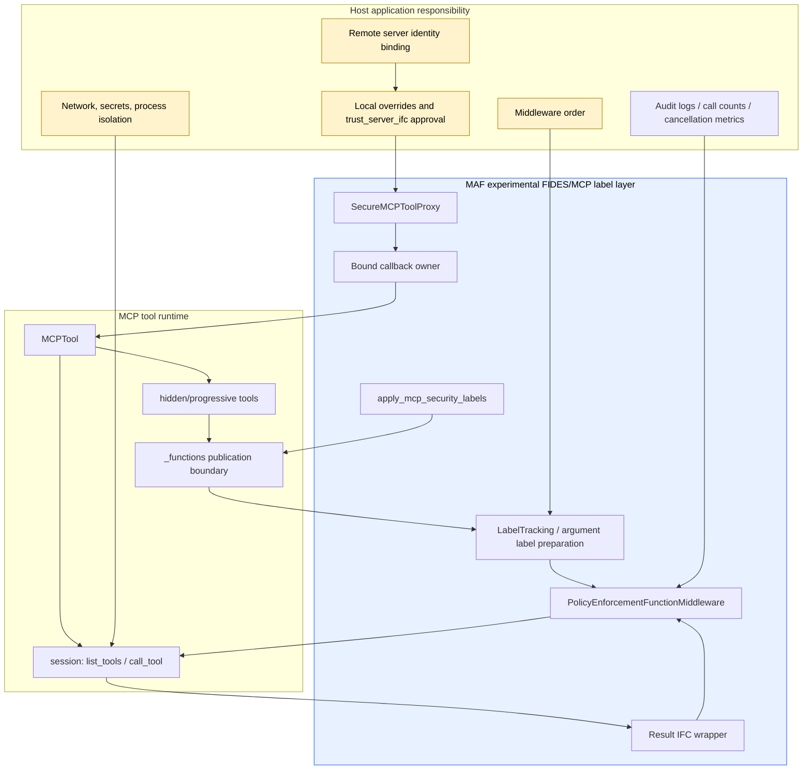

# 动态 MCP 安全标签验收模板（基于 MAF source-SDK baseline 实测）

> 日期：2026-10-03
> 面向：公开教材、方案验收、架构评审模板
> 范围：Microsoft Agent Framework（MAF）源码快照中的 MCP 动态安全标签机制。本文记录固定源码的**baseline 与五个单点 mutation 实测**，并给出可复用验收卡。
> 明确边界：这是 experimental 机制的公开验收模板，不是生产安全认证、合规证明、供应链背书或可直接复演的 benchmark 报告。

## 0. 核心结论

1. 本次实验基于 `microsoft/agent-framework` 固定源码提交 `84d135379442e793714cb257aa9b3f5d0cb037fc`，完整 Python 源码 2032 个文件，离线解析 33 个 wheel 作为实验锁定依赖组合。
2. 真实 v2 baseline 已确认：15 个离线 case 全部 PASS。runner 使用完整 SDK 正常 import，MCP connect/session 使用 fake；异常/取消用例另对 `_apply_labels` 做 mock 并注入 callback 故障。没有真实 MCP server、LLM/provider/API key 或网络服务。
3. baseline 的主要价值不是证明“安全已完成”，而是把动态 MCP 工具加载、隐藏工具、新工具、分页刷新、远端 `_meta.ifc`、middleware enforcement、取消与 in-flight snapshot 这些容易漏测的点变成可复用验收模板。
4. 最重要的已知风险：缺 `context_label` 时放行已实测；无效类型放行是静态源码结论，malformed dict 未实测，不能推广为全部非法标签都会放行。必须确保 LabelTracking/参数标签准备在 PolicyEnforcement 前正确排序，并把缺标签当作部署前阻断项处理。
5. 发布前 callback 不是事务回滚：新目录未发布并不等于旧对象标签改动会回滚。验收要分别观察“目录发布边界”和“旧对象是否被部分重标”。
6. 远端 ToolAnnotations 与远端 `_meta.ifc` 不能当成本地授权：默认只能收紧；只有本地显式 `trust_server_ifc=True` 才让完整合法远端 IFC 成为结果标签权威。该信任开关要绑定到服务器身份与连接授权，而不是复用名字映射。
7. hidden/progressive tools 与后续新增工具必须在进入公开视图前被标注；只扫描公开 `functions` 视图会漏。
8. cancellation ownership 与 in-flight snapshot 要独立验收：取消不能遗留错误 callback 绑定，调用开始时的策略快照不能被 await 期间的策略变更意外放宽。
9. 五个单点 mutation 各执行一个指定 case，全部触发预期业务断言 FAIL（无 ERROR）：删发布 callback、漏隐藏工具、取消清理遗漏、绕过 enforcement、远端 IFC 越权覆盖。mutation 的容器退出码均为 1，这是负控结果，不是 baseline 执行失败。
10. 可引用源码 SHA 与 runner hash，但未公开 runner、隔离合约和原始日志，第三方不能据本文独立复演原 run；请把本文当模板，而非“即拿即跑”的复现实验包。

## 1. 实测范围与限制

| 项 | 已确认 baseline |
|---|---|
| 源码快照 | `microsoft/agent-framework@84d135379442e793714cb257aa9b3f5d0cb037fc` |
| 源码规模 | Python 源码清单 2032 files；使用完整 `_mcp.py`、`security.py`、相关测试与包结构，不是 AST 切片或重写替身 |
| 依赖形态 | 33 wheel 离线下载并锁定；这是实验解析到的组合，不是上游官方 lockfile，不代表 upstream exact lock |
| SDK import | 在隔离离线环境中使用完整 SDK 正常 import；以源码 SHA 与模块 provenance 为准 |
| runner | v2 runner SHA256：`b07649eb01b4de8f8a0ef09addd595f0fd12de3631379fa988b9639d502f39e6`；runner 未公开，不能独立复演原 run |
| baseline 结果 | 15/15 PASS，exit code 0；unittest 测试体计时 0.228s，不含容器启动、依赖校验与解包 |
| fake 范围 | fake connect/session/call_tool；无真实 server、无真实传输、无 provider、无 API key、无上游测试导入 |
| 真机制范围 | 正常导入 SDK 的 `FunctionInvocationContext → PolicyEnforcementFunctionMiddleware.process → FunctionTool.invoke → MCPTool.call_tool → fake session.call_tool` 局部链路 |
| 未覆盖 | 真实 Agent/LabelTracking 完整编排、真实 MCP 传输生命周期、服务端隔离、并发/线程安全、生产运维、真实远端身份绑定 |
| mutation 结果 | 5 个单点变体各跑 1 个指定 case，均为业务断言 FAIL、exit 1，无 ERROR；没有运行其余可选 case 组合 |

## 2. 公开引用与 license/source 支持

以下固定官方来源已在研究日核验可达（HTTP 200），许可为 MIT。HTTP 状态只证明可达；机制结论来自指定文件阅读，实验结果来自本页所述独立合成测试。

| 用途 | URL | HEAD |
|---|---|---|
| 固定提交 | https://github.com/microsoft/agent-framework/commit/84d135379442e793714cb257aa9b3f5d0cb037fc | 200 |
| `security.py` | https://raw.githubusercontent.com/microsoft/agent-framework/84d135379442e793714cb257aa9b3f5d0cb037fc/python/packages/core/agent_framework/security.py | 200 |
| `_mcp.py` | https://raw.githubusercontent.com/microsoft/agent-framework/84d135379442e793714cb257aa9b3f5d0cb037fc/python/packages/core/agent_framework/_mcp.py | 200 |
| `test_security.py` | https://raw.githubusercontent.com/microsoft/agent-framework/84d135379442e793714cb257aa9b3f5d0cb037fc/python/packages/core/tests/test_security.py | 200 |
| `pyproject.toml` | https://raw.githubusercontent.com/microsoft/agent-framework/84d135379442e793714cb257aa9b3f5d0cb037fc/python/packages/core/pyproject.toml | 200 |
| License | https://raw.githubusercontent.com/microsoft/agent-framework/84d135379442e793714cb257aa9b3f5d0cb037fc/LICENSE | 200 / MIT |

## 3. 2–3 个落地方案与推荐

### 方案 A：轻量标注 smoke（不推荐单独上线）

- 做法：连接 MCP 后调用一次安全标签应用逻辑，检查公开工具存在 `source_integrity`、`max_allowed_confidentiality`、结果 `security_label`。
- 优点：成本低，适合 SDK 升级 smoke。
- 缺口：不能覆盖 list_changed、新增/隐藏工具、callback 绑定、context label 缺失、audit-only、取消与 in-flight snapshot。
- 适用：CI 预检，不得作为安全验收唯一依据。

### 方案 B：动态 MCP 标签验收矩阵（推荐 baseline 模板）

- 做法：按本文 12 张验收卡，把 MCP 动态发现、hidden tools、policy enforcement、远端 IFC、取消与发布边界全部纳入自动化测试。
- 优点：能发现“启动时标一次”遗漏；区分 fake session 调用计数与真实网络；能把 fail-open/顺序问题变成明确 gate。
- 缺口：仍不是完整 Agent 编排与真实传输证明。
- 适用：SDK 机制验收、架构评审、版本升级准入。

### 方案 C：端到端 Agent + 真实 MCP server 验收（推荐作为生产前补充）

- 做法：在方案 B 通过后，用真实 Agent、LabelTracking、真实 MCP server/transport、身份绑定和日志管线做 e2e。
- 优点：覆盖真实生命周期、实际 middleware 顺序、remote identity 与运维可观测性。
- 缺口：成本高，需处理密钥隔离、网络准入、测试数据脱敏。
- 适用：生产前最后一公里。

**推荐路线：B 作为通用公开 baseline 模板，C 作为生产前必需补充；A 只做 smoke。**

## 4. 12 张动态 MCP 安全标签验收卡

以下为从 15 个实测 case 提炼的通用模板，不是 12 个独立执行记录。目标客户环境均为 NOT_RUN；初次复用请分别记录 expected、observed、case_status 与 fake/真实调用计数。

| 卡 | 验收目标 | 必测正/负控 | 通过判据 |
|---|---|---|---|
| C1 初始标签与拒绝 | 首次加载工具被标注，PRIVATE 调用被阻断 | PUBLIC 允许、PRIVATE 拒绝 | 拒绝分支进入 middleware termination；fake remote call/await = 0；允许分支 call = 1 |
| C2 list_changed 重载 | 通知触发刷新，旧对象复用并重标，新工具先标注 | openWorld 降 integrity，新 late tool | 旧对象 identity 保留但标签更新；新工具拒绝 PRIVATE |
| C3 hidden/progressive tools | 隐藏工具在公开披露前也被标注 | 绑定前已隐藏、绑定后新隐藏 | 不能只扫公开 `functions`；load_tool 披露后仍受策略阻断 |
| C4 plain MCP 负控 | 未启用安全 proxy/label 时不伪造安全结果 | 原始 `_meta` 保留 | 无 `source_integrity`/wrapper/security_label，说明测试不是“全局硬编码通过” |
| C5 本地 override 作用域 | override 只对当前连接/远端名生效 | A 连接允许，B 连接默认拒绝 | 不得把 remote name mapping 跨 server 复用为授权 |
| C6 缺 context label | 验证 fail-open 控制点 | `context_label=None` | 当前机制会放行并调用 fake；生产 gate 必须补 fail-closed/顺序检查 |
| C7 middleware 顺序/模式 | 无 enforcement 或 audit-only 不阻断 | no enforcement、block_on_violation=False | 调用会到达 fake，不能宣称有本地阻断闭包 |
| C8 callback ownership | 第二个 proxy 不得抢占同一底层工具 | 共享底层工具 | 抛错且不偷 callback；无 fake call |
| C9 重入/refresh | 同 proxy 重入和 refresh 不重复包装 | connect→refresh→disconnect | wrapper identity 不重复变化；disconnect 解绑；注意不是引用计数保证 |
| C10 failure/cancel ownership | Exception/CancelledError 下资源归属正确 | fresh/live/bound 矩阵 | 只清理本次新建连接/绑定；已有连接不被错误关闭 |
| C11 callback publication | callback 失败不发布新目录，但旧对象可能已部分重标 | fail_late | `_functions` 目录不替换；旧对象部分重标不误称事务回滚 |
| C12 remote IFC + in-flight | 默认远端 IFC 只能收紧；快照在调用开始采样 | trust 开关、await 中策略变化、Task.cancel | 默认不被远端放宽；`trust_server_ifc=True` 才接受完整合法远端标签；取消传播且 callback 保持 |

> 注：卡数可按团队编号裁剪成 8–12 张，但不得删除 C3、C6、C7、C11、C12 这五类高风险检查。

## 5. 字段与观测表

### 5.1 工具/函数字段

| 字段 | 来源 | 语义 | 验收注意 |
|---|---|---|---|
| `_mcp_remote_name` | MCPTool 创建 FunctionTool 时写入 | 远端工具原名 | override key 按 remote name 生效，不等于 server 身份 |
| `source_integrity` | 本地标签策略 | 工具源完整性，如 `trusted/untrusted` | server openWorld 只能收紧，不能授予 trusted |
| `max_allowed_confidentiality` | 本地 sink cap | 允许进入该工具的最高保密级别 | `mark_write_tools_as_sinks=False` 会撤销 cap，是危险配置点 |
| `accepts_untrusted` | 本地策略 | 是否接受 untrusted context/args | 不应由远端 hint 放宽 |
| `_mcp_trust_server_ifc` | 本地配置 | 是否信任远端结果 `_meta.ifc` | 必须绑定服务器身份与授权审批 |
| `security_label` | 结果 Content | 输出内容标签 | 默认 local + remote combine；trust 开启时远端完整合法标签可权威 |
| `_meta.ifc` | 远端结果元数据 | 远端声称的 IFC 标签 | 默认消费并移除，不应让下游重复解释 |

### 5.2 调用上下文字段

| 字段 | 语义 | 风险 | Gate |
|---|---|---|---|
| `context.metadata["context_label"]` | 当前调用上下文标签 | 缺失/类型无效会 fail-open | 生产中必须 LabelTracking 先运行，或自定义 fail-closed wrapper |
| `context.metadata["argument_label"]` | 参数/隐藏变量解析标签 | 参数 taint 与上下文 taint 不同 | 验证 combine 后 effective label |
| `effective_invocation_label` | context + argument 合并结果 | 下游误读单一标签 | 审计日志记录 effective 与原始来源 |
| `block_on_violation` | policy 是否阻断 | audit-only 会放行 | 生产安全路径必须 true 或审批闭环明确 |
| `approval_on_violation` | 用户审批路径 | 审批绑定错误可带来重放风险 | 审批绑定需与 invocation scope 绑定 |

### 5.3 观测指标

| 指标 | 目的 | 期望 |
|---|---|---|
| fake/remote call count | 区分“阻断成功”与“只是断言失败” | 拒绝分支为 0，允许分支为 1 |
| reload task count | 验证 notification/list_changed 真触发 | 有 pending reload 且完成后标签刷新 |
| callback owner identity | 防止 proxy 抢占/解绑他人 callback | 只解绑自己拥有的 callback |
| `_functions` snapshot | 区分目录发布与对象重标 | callback 失败不发布新目录；旧对象可部分变化 |
| in-flight label snapshot | 防止 await 期间策略漂移 | 调用开始的本地策略决定该次输出 |
| cancellation propagation | 防止取消被吞 | `CancelledError` 传播；cleanup 有界 |
| network/process attempts | 验证离线边界 | baseline 期望无外联/子进程尝试 |

## 6. Mermaid 数据流图

```mermaid
flowchart LR
    A[MCP server / fake session] -->|tools/list + annotations| B[MCPTool.load_tools]
    B --> C{function_load_callback?}
    C -->|yes, before publication| D[apply_mcp_security_label_to_function]
    C -->|no| E[plain MCP negative control]
    D --> F[FunctionTool.additional_properties]
    F -->|source_integrity / max_allowed_confidentiality| G[LabelTracking + argument label]
    G --> H[PolicyEnforcementFunctionMiddleware]
    H -->|violation + block_on_violation| I[terminate before remote call]
    H -->|allowed / audit-only / missing context_label| J[FunctionTool.invoke]
    J --> K[MCPTool.call_tool]
    K -->|result _meta.ifc| L[IFC wrapper stamps Content.security_label]
    L --> M[Agent / downstream content]

    N[list_changed notification] --> B
    O[progressive hidden tool] --> B
    P[policy mutation during await] -. snapshot at call start .-> L
```

## 7. Mermaid 架构图模式

**读图要点：** MAF 机制只覆盖 SDK 内部标签与 middleware 闭包；Host application 仍拥有远端身份绑定、middleware 顺序、缺标签 fail-closed、密钥/网络隔离与生产审计责任。

## 8. 技术问答

**Q1：启动时给 MCP 工具标一次标签够吗？**
不够。baseline 覆盖了 list_changed、分页、新增工具、隐藏工具和 progressive disclosure。动态工具必须在发布前或披露前被 callback 标注。

**Q2：callback 失败是不是事务回滚？**
不是。已确认行为应分两层看：新目录可以不发布，但复用的旧 FunctionTool 对象可能已经被逐个重标。验收模板必须同时检查目录发布边界和旧对象部分变更。

**Q3：缺 `context_label` 会怎样？**
在该快照中，enforcement 记录 warning 后继续 `call_next()`，属于 fail-open。生产路径不能把它当安全阻断；必须保证 LabelTracking/参数标签准备先于 enforcement，或在缺标签时自定义 fail-closed。

**Q4：PolicyEnforcement 放在 middleware 链里就安全吗？**
只有当 LabelTracking、argument label、PolicyEnforcement 排序正确且 `block_on_violation=True` 时，才有本地阻断闭包。audit-only、未启用 enforcement、provider-hosted MCP 绕过本地调用链，都不能声称被本地阻断。

**Q5：远端 ToolAnnotations 能授予 trusted 或 public 输出吗？**
默认不能。远端 annotations 是 hint，只能收紧本地策略；openWorld 可降低 integrity，readOnlyHint 不能授予信任或撤销本地 PUBLIC cap。

**Q6：远端 `_meta.ifc` 什么时候可信？**
默认只能与本地标签 combine 后收紧。只有本地显式 `trust_server_ifc=True`，且远端标签完整合法时，远端结果 IFC 才能成为该结果的权威标签。这个开关必须与 server 身份、连接授权和审计绑定。

**Q7：hidden/new tools 与 remote IFC 有什么本地信任边界？**
hidden/new tools 仍是远端动态输入，不能因为未进入公开视图就跳过标注；remote IFC 是远端声明，不能替代本地身份认证。公开工具名、远端工具名和 server identity 是三件事。

**Q8：取消归谁负责？**
SDK proxy 需要只清理本次拥有的 callback/连接，不能关闭既有连接或解绑他人 callback。宿主仍要用真实传输和 Agent 生命周期测试取消、超时与资源回收。

**Q9：in-flight snapshot 为什么重要？**
如果一次工具调用已经开始，await 期间策略变化不应 retroactively 放宽该次结果。baseline 观察到结果标签采用调用开始时的本地策略快照。

**Q10：这能作为生产安全认证吗？**
不能。本文是 experimental 机制验收模板与 baseline 事实，尚未覆盖真实 Agent 编排、真实 MCP server、真实网络、密钥隔离和运维审计。五个 mutation 的敏感性校准不能替代这些验证。

## 9. 三日常落点

### D1：CI / SDK 升级日常

- 固定源码/包版本与 license URL。
- 跑方案 A smoke + 方案 B baseline 子集。
- Gate：缺 `context_label`、audit-only、hidden tools 未标注、拒绝分支 fake call 非 0 均阻断。

### D2：架构评审日常

- 用 Mermaid 架构图标出：MCP server identity、local override 归属、middleware 顺序、trust_server_ifc 审批点。
- 明确哪些工具允许 PRIVATE 输入、哪些只允许 PUBLIC。
- 把 callback publication 非事务回滚写入风险登记。

### D3：生产前演练日常

- 在真实 Agent + LabelTracking + 真实 MCP server 上重跑 e2e。
- 用审计日志记录 effective label、policy decision、remote call count、cancellation、timeout、in-flight snapshot。
- 对 remote IFC 信任开关做服务器身份绑定与回滚预案；默认关闭。

## 10. 对外表述模板

可公开说：

> 我们基于固定 MAF 源码提交完成了完整 SDK import 的离线 baseline 验收，15 个动态 MCP 安全标签 case 全部通过。测试覆盖动态工具刷新、隐藏工具、远端 IFC 默认收紧、middleware 阻断、取消归属与 in-flight snapshot。该结果是 experimental 机制的 baseline 模板，不是生产安全认证；真实 Agent 编排与真实 MCP server 仍需另行验证；五个单点 mutation 已触发预期断言，不是生产安全认证。

不要说：

- “MAF MCP 安全已被证明生产安全”。
- “远端 annotations/IFC 可以默认信任”。
- “callback 失败会事务回滚所有对象”。
- “只要启动时标一次就覆盖动态工具”。
- “本文可直接复演原始 runner 结果”。

## 11. 待后续独立完成（本文不填结果）

- 扩展 mutation 在更多 case/完整 Agent 编排下的覆盖；当前每个变体只执行一张指定 case。
- 真实 Agent + LabelTracking 完整编排验收。
- 真实 MCP transport/server 的取消、重连、分页与 list_changed 行为。
- server identity 与 local override/trust_server_ifc 的绑定策略。
- 生产日志脱敏、密钥隔离、网络隔离与供应链审计。
