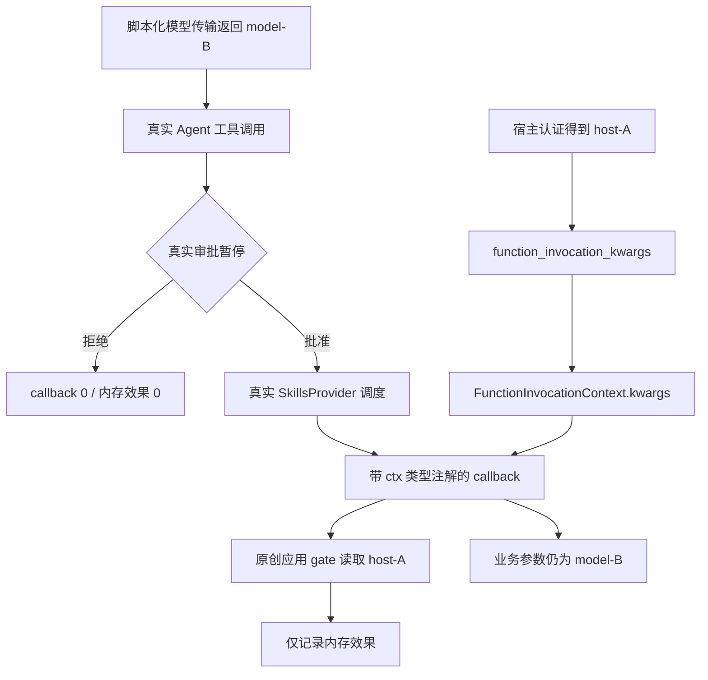
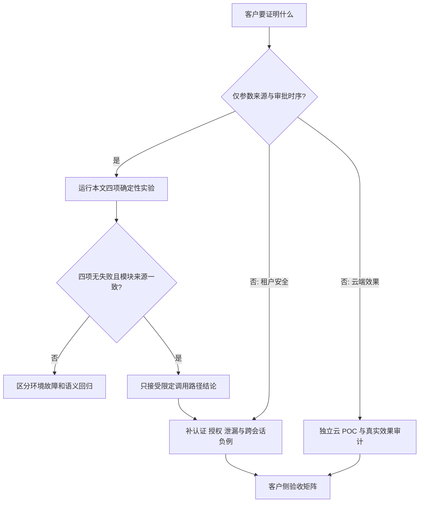

# MAF：用真实固定源码复现审批与技能 context 分离

日期：2026-10-01 · 交付：本文 + [maf-dependencies.json](maf-dependencies.json)。本文包含可完整提取的原创 Python runner；不分发上游源码、wheel 或历史执行包。

依赖清单 SHA256：`3933124a67e69220e59d7f28f35edf65112d54969a9e0e368403cb34f7bd214f`。此摘要用于核对配套文件完整性，不是签名或执行授权。

**结论先行：模型业务参数 `tenant_id=model-B` 可以与宿主 `ctx.kwargs['tenant_id']=host-A` 并存；真实工具审批未批准时 callback 不进入，批准后收到原 session 的 invocation context。这里的 context injection 是运行时依赖注入，不是一次恶意 prompt injection 攻击测试。** 宿主认证、应用授权与操作系统隔离是三条不同边界，缺一不可。

## 1. 三条边界与可交付结论

1. **来源边界**：类型注解 `FunctionInvocationContext` 选择宿主上下文注入；模型提供业务参数。值来自宿主不代表宿主已经完成认证。
2. **执行边界**：`Agent.run → SkillsProvider → run_skill_script` 经过真实审批暂停/恢复；不是直接调用 private dispatch 来冒充审批测试。
3. **系统边界**：callback 是进程内 Python，不是沙箱。禁网、只读根文件系统、非 root、无凭证与有限资源由容器承担；`-I -S` 只减少 Python 环境污染。



这里仅 fake **模型传输**：返回两轮预定 function call / done；`Agent`、工具调用层、审批对象、session、SkillsProvider、context 绑定均来自固定 MAF 源码。审批响应由用例程序生成，不是人机审批 UI。`host-A` 只是测试常量，不是真实租户身份。

## 2. 固定来源、版本与依赖

- [固定提交](https://github.com/microsoft/agent-framework/commit/853c4564476a388f5c219ecb5ce42566fabbb75d)：`853c4564476a388f5c219ecb5ce42566fabbb75d`。
- [技能实现](https://github.com/microsoft/agent-framework/blob/853c4564476a388f5c219ecb5ce42566fabbb75d/python/packages/core/agent_framework/_skills.py)：类型检测约 426–490；parser 后保留名检查/新字典注入约 618–649；文件 runner 约 795–869；provider 分派约 2939–2949。
- [核心依赖声明](https://github.com/microsoft/agent-framework/blob/853c4564476a388f5c219ecb5ce42566fabbb75d/python/packages/core/pyproject.toml)：源码版本字段 `1.19.0`；这**不是已验证的官方 wheel，也不推断发行或 GA 状态**。
- [上游测试](https://github.com/microsoft/agent-framework/blob/853c4564476a388f5c219ecb5ce42566fabbb75d/python/packages/core/tests/core/test_skills.py)：可用于对照设计；本实验用标准库 unittest，不收集或执行上游 pytest/conftest。
- 源 tar 的 SHA256：`dd7ea78c6f93e5c4d9bf3faaeff08adfa5d3dcebb824925f3a8cf7b6d01f3aae`。它是所观察到归档字节的完整性 pin，不是上游签名认证；GitHub 重新打包造成 hash 变化时停止，不自动接受新 hash。

JSON 列出源归档 URL/hash/commit、**45 个 wheel 的精确版本、文件名、URL、SHA256、Requires-Python、Requires-Dist 与许可字段**，无本机路径或内部状态。目标为 Linux x86_64 / CPython 3.11.15；含原生扩展，不适用于直接替换成 macOS、ARM、musl 或其他 Python 版本。该集合是本实验已准备的闭包，不宣称最小依赖集。Azure/OpenAI 包在闭包中不代表调用过云端服务。

源码以原样 core 包加最小 `dist-info/METADATA` 装入临时目录，支持 `importlib.metadata` 查询；不运行 flit、pip、安装 hook、.pth 或 shell entry point。这是 **source-staged SDK**，不能用同版本官方 wheel 替换后仍声称实验相同。wheel 中非 purelib/platlib 的 `.data` 内容不参与本实验，因此 runner 不是通用 wheel 安装器。上游 MIT 与每项依赖许可证需在准备和再分发时分别核查；JSON 许可字段并非法律审查结果。

## 3. 公开四 case：测什么，不测什么

| 用例 | pending 后 | 审批恢复后 | 额外断言 |
|---|---|---|---|
| nonstream deny | callback/effect/context 均 0，恰好一个待批请求 | callback/effect/context 仍 0 | call_id 保持，审批 envelope 不进模型输入 |
| nonstream approve | 同上 | callback 恰好 1 次，内存效果 1 次 | host/model 分离、session 对象身份、原 invocation arguments |
| stream deny | 同上 | 同拒绝路径 | 增量与 final 的 content 类型、function result 对齐 |
| stream approve | 同上 | 同批准路径 | 同上；host kwargs 不平铺到 callback 的 `**kwargs` |

模型最多收到两轮调用；多一轮立即失败。用例的“效果”只是一条内存列表记录，不是外部写入、付款或网络动作。流测试比较类型和 function result，不声称覆盖全部 token 时序、取消、背压或所有消息字段。拒绝路径检查未执行与未出现成功标记，不绑定某个本地化错误文本。

**观察范围：**已执行的真实源码 SDK 研究集为 9 项；扩展组合 baseline 为 13 项（9 项 + 本文 4 项），记录为 PASS、无 skip。9 项不随本文发布，因此不能说读者仅凭这两个文件可重跑全部 9/13 项。本公开 runner 的独立四项提取运行结果见下方验收说明。另执行过 6 个 mutation 候选；本文不报告确定 kill 或 kill-rate，异常退出不能当作语义杀死。上游 pytest、真实云模型、Azure 身份服务、产品 CLI：**NOT_RUN**；下述 shell 是实验 launcher，不是 MAF 产品 CLI。

## 4. 隔离复现：准备与执行分离

### 4.1 必须先准备的材料

在专用无秘密工作目录保存本文及 `maf-dependencies.json`。联网准备机按 JSON 的**精确 URL**下载源 tar 与 45 个 wheel 到 `assets/`，保持 filename 不变；不要使用 `pip install agent-framework`、浮动解析、自动升级或缺包联网补齐。下载工具应只允许 HTTPS 的 `codeload.github.com` / `files.pythonhosted.org`，核对重定向、大小和 SHA256；本交付不包含下载器。runner 会在任何 SDK 导入前再核对全部 asset hash。

由环境维护者单独准备/审核 Docker Engine、宿主 Linux 内核及本地镜像：镜像需有 `/usr/local/bin/python3.11`（3.11.15）、glibc x86_64、`/usr/bin/timeout`；观察环境 glibc 为 2.41。JSON 给出实际参考镜像 digest；它的可获取性与供应链来源需另核验，本文不保证远端始终保留。若镜像不可用，先完成兼容镜像的独立准备、记录其 digest 与解释器信息，再执行；那是不同环境复验，不是字节级相同环境。**执行命令不 pull、不 build、不安装依赖。**镜像不得内置凭证、敏感应用层或隐式启动服务。

执行前应由使用方按自己的安全流程审核 runner、源代码、依赖及镜像；文件 hash、布尔开关或 runner 自检不是执行安全认证。下列检查也不能从容器内证明外部 Docker 隔离配置正确。Docker 管理权等价于高权限，优先使用专用 VM/受限 daemon。

### 4.2 提取唯一完整 Python 代码块

这一步只以宿主标准库提取文本，不 import SDK、不执行提取出的代码。使用 Python 3 的环境执行：

```sh
python3 -I -S - <<'PY'
from pathlib import Path
p = Path('maf-skill-context-injection-lab-2026-10-01.md')
lines = p.read_text(encoding='utf-8').splitlines(keepends=True)
a = next(i for i, line in enumerate(lines) if line.strip() == '<!-- BEGIN MAF_LAB_PY -->')
b = next(i for i, line in enumerate(lines) if line.strip() == '<!-- END MAF_LAB_PY -->')
assert lines[a + 1].strip() == '```python' and lines[b - 1].strip() == '```'
block = ''.join(lines[a + 2:b - 1])
with Path('maf_lab.py').open('x', encoding='utf-8') as f:
    f.write(block)
PY
```

### 4.3 唯一执行入口：无网络容器

当前目录必须是上述专用目录，仅包含公开材料、提取出的 runner 和 `assets/`；不挂载 HOME、Docker socket 或凭证。宿主需 bash、Docker CLI、Python 3（只读 JSON）。脚本明确指定 image digest，失败即停；标准输出保存 JSON，标准错误保存 unittest 输出，非零退出保留原故障。

```sh
set -euo pipefail
LAB=$(pwd -P)
IMAGE=$(python3 -I -S -c 'import json; print(json.load(open("maf-dependencies.json"))["reference_image"])')
docker image inspect "$IMAGE" >/dev/null
# 拒绝隐式下载；本地镜像必须已经准备好。
docker run --rm --pull=never --init \
  --network=none --read-only --cap-drop=ALL \
  --security-opt=no-new-privileges:true --user=65534:65534 \
  --pids-limit=64 --memory=1g --cpus=1 \
  --ulimit=nofile=128:128 --ulimit=core=0:0 \
  --tmpfs=/tmp:rw,noexec,nosuid,nodev,size=64m,mode=1777 \
  --tmpfs=/work:rw,exec,nosuid,nodev,size=512m,mode=1777 \
  --mount="type=bind,src=$LAB/maf_lab.py,dst=/lab/maf_lab.py,readonly" \
  --mount="type=bind,src=$LAB/maf-dependencies.json,dst=/lab/maf-dependencies.json,readonly" \
  --mount="type=bind,src=$LAB/assets,dst=/assets,readonly" \
  --workdir=/work --entrypoint=/usr/bin/timeout \
  "$IMAGE" -k 5s 120s /usr/local/bin/python3.11 -I -S /lab/maf_lab.py \
  >result.json 2>test.log
```

`/work` 是每次新建的 tmpfs，为加载 wheel 中 `.so` 必须允许 executable mappings；因此它有意**不是 noexec**。这仍是受限容器内的代码执行，不是无执行权限的静态扫描。根文件系统与输入是只读；无任何可写宿主 bind，结果通过 stdout/stderr 由 shell 保存。宿主重定向会覆盖已有 `result.json`/`test.log`，每次请使用新的专用目录。

**公开复验实测：**从本文代码块提取 runner，并逐条执行本文 shell 命令，在上述参考镜像的只读根文件系统、禁网、非 root 容器中 **4/4 PASS；failures=0、errors=0、skips=0**。加载记录包含 128 个源码/依赖模块；只核验已加载模块，不声称覆盖所有文件或系统调用。这是对本文公开四 case 的实跑，区别于前述未随文交付的研究集。

验收：退出码 0；`test.log` 显示 `Ran 4 tests` / `OK`；JSON 为 `status=PASS, tests_run=4, failures=0, errors=0, skips=0`。`loaded_modules` 记录实际导入的源码/依赖模块相对路径和内容 SHA256；是加载观测，不等于文件访问审计。预期内存效果已由断言验证，未输出 tenant/user 秘密。可将 result 与 manifest 一起保存作本地证据，不必公开整份模块日志。

## 5. 完整原创 runner（无省略，可提取）

<!-- BEGIN MAF_LAB_PY -->
```python
"""Original offline source-SDK stager; run only with the documented container launcher."""
import hashlib
import json
import os
from pathlib import Path, PurePosixPath
import platform
import stat
import sys
import tarfile
import tomllib
import zipfile


def require(ok, message):
    if not ok:
        raise RuntimeError(message)


def sha(path):
    with path.open('rb') as f:
        return hashlib.file_digest(f, 'sha256').hexdigest()


def safe(name):
    p = PurePosixPath(name)
    require(not p.is_absolute() and '..' not in p.parts and '\\' not in name, 'unsafe archive path')
    return p


def put(root, name, data):
    p = root.joinpath(*safe(name).parts)
    require(not p.exists(), 'duplicate extracted file: ' + name)
    p.parent.mkdir(parents=True, exist_ok=True)
    p.write_bytes(data)


def prepare():
    require(sys.flags.isolated and sys.flags.no_site and not sys.flags.optimize, 'use python -I -S without -O')
    require(sys.version_info[:3] == (3, 11, 15) and platform.machine() == 'x86_64', 'wrong interpreter/platform')
    require(Path('/work').is_dir() and not Path('/work/runtime').exists(), 'need fresh container tmpfs')
    require(os.getuid() != 0, 'nonroot required')
    os.environ.clear()
    os.environ.update(HOME='/tmp', TMPDIR='/tmp', OTEL_SDK_DISABLED='true',
        AGENT_FRAMEWORK_USER_AGENT_DISABLED='true', AGENT_FRAMEWORK_FEATURE_MASK_DISABLED='true')
    sys.dont_write_bytecode = True
    manifest = json.loads(Path('/lab/maf-dependencies.json').read_text())
    require(sha(Path(__file__)) == manifest['runner_sha256'], 'runner digest mismatch')
    assets = Path('/assets')
    items = [manifest['source']] + manifest['wheels']
    require(len(manifest['wheels']) == 45, 'expected exact wheel set')
    for item in items:
        require(PurePosixPath(item['filename']).name == item['filename'], 'invalid asset name')
        require(sha(assets / item['filename']) == item['sha256'], 'asset digest mismatch: ' + item['filename'])
    runtime = Path('/work/runtime')
    runtime.mkdir()
    # Only copy core Python package + project metadata; never build or run archive hooks.
    prefix = 'agent-framework-' + manifest['source']['commit'] + '/python/packages/core/'
    project = None
    with tarfile.open(assets / manifest['source']['filename'], 'r:gz') as t:
        for member in t:
            safe(member.name)
            if not member.name.startswith(prefix):
                continue
            relative = member.name[len(prefix):]
            if not (relative.startswith('agent_framework/') or relative == 'pyproject.toml'):
                continue
            if member.isdir():
                continue
            require(member.isfile() and member.size < 20_000_000, 'unexpected source member')
            data = t.extractfile(member).read()
            if relative == 'pyproject.toml':
                project = tomllib.loads(data.decode())['project']
            else:
                put(runtime, relative, data)
    require(project and project['version'] == manifest['source']['project_version'], 'source version mismatch')
    for wheel in manifest['wheels']:
        with zipfile.ZipFile(assets / wheel['filename']) as z:
            for entry in z.infolist():
                p = safe(entry.filename)
                mode = entry.external_attr >> 16
                require(not stat.S_ISLNK(mode) and not entry.flag_bits & 1, 'unsafe wheel entry')
                require(not stat.S_IFMT(mode) or stat.S_ISREG(mode) or stat.S_ISDIR(mode), 'special wheel entry')
                if entry.is_dir():
                    continue
                require(p.suffix != '.pth' and entry.file_size < 100_000_000, 'unsupported wheel member')
                parts = p.parts
                if parts[0].endswith('.data'):
                    # CLI entry points, headers and external data are not used by this lab.
                    if len(parts) < 3 or parts[1] not in ('purelib', 'platlib'):
                        continue
                    p = PurePosixPath(*parts[2:])
                put(runtime, str(p), z.read(entry))
    # Minimal local metadata supports importlib.metadata; NOT an official wheel/install.
    metadata = ('Metadata-Version: 2.3\nName: agent-framework-core\nVersion: ' + project['version'] +
        '\nRequires-Python: ' + project['requires-python'] + '\n' +
        ''.join('Requires-Dist: ' + r + '\n' for r in project['dependencies']) +
        '\nSource staging for this experiment; not an upstream distribution.\n')
    put(runtime, 'agent_framework_core-' + project['version'] + '.dist-info/METADATA', metadata.encode())
    require(not any('site-packages' in p or 'dist-packages' in p for p in sys.path), 'ambient packages forbidden')
    sys.path.insert(0, str(runtime))
    return manifest, runtime


MANIFEST, RUNTIME = prepare()

import unittest
from agent_framework import (Agent, BaseChatClient, ChatMiddlewareLayer, ChatResponse,
    ChatResponseUpdate, Content, FunctionInvocationContext, FunctionInvocationLayer,
    InlineSkill, Message, ResponseStream, SkillFrontmatter, SkillsProvider)
from agent_framework.observability import ChatTelemetryLayer


class FixtureChatClient(FunctionInvocationLayer, ChatMiddlewareLayer, ChatTelemetryLayer, BaseChatClient):
    def __init__(self, arguments):
        super().__init__(middleware=[])
        self.arguments = arguments
        self.model_calls = []

    def _inner_get_response(self, *, messages, stream, options, **kwargs):
        self.model_calls.append([Message.from_dict(m.to_dict()) for m in messages])
        n = len(self.model_calls)
        if n > 2:
            raise AssertionError('FIXTURE_EXHAUSTED: unexpected model turn')
        content = (Content.from_function_call(call_id='integration-call', name='run_skill_script',
                   arguments=self.arguments) if n == 1 else Content.from_text('done'))
        if stream:
            async def updates():
                yield ChatResponseUpdate(role='assistant', contents=[content])
            return ResponseStream(updates(), finalizer=lambda xs: ChatResponse.from_updates(xs))
        async def response():
            return ChatResponse(messages=[Message(role='assistant', contents=[content])])
        return response()


class ApprovalIntegration(unittest.IsolatedAsyncioTestCase):
    async def scenario(self, streaming, approve):
        entered, effects, contexts = [], [], []
        skill = InlineSkill(frontmatter=SkillFrontmatter(name='integration-lab', description='in-process fixture'),
                            instructions='Local inert fixture only')
        def callback(tenant_id: str, value: int, *, ctx: FunctionInvocationContext, **kwargs):
            entered.append((tenant_id, value))
            contexts.append(ctx)
            # Application gate, NOT a claim that MAF supplies tenant authorization.
            if ctx.kwargs.get('tenant_id') != 'host-A':
                raise PermissionError('application tenant gate')
            self.assertEqual(kwargs, {}, 'HOST_KWARGS_NOT_FLATTENED')
            effects.append('in-memory-only')
            return 'script completed'
        skill.script(name='probe')(callback)
        args = {'skill_name': 'integration-lab', 'script_name': 'probe',
                'args': {'tenant_id': 'model-B', 'value': 7}}
        client = FixtureChatClient(args)
        provider = SkillsProvider(skill)  # Default real approval required; never disable it.
        agent = Agent(client=client, context_providers=[provider])
        session = agent.create_session()
        async def run(message):
            if not streaming:
                return await agent.run(message, session=session,
                                       function_invocation_kwargs={'tenant_id': 'host-A'})
            response_stream = agent.run(message, session=session, stream=True,
                                       function_invocation_kwargs={'tenant_id': 'host-A'})
            observed = [c async for u in response_stream for c in u.contents]
            result = await response_stream.get_final_response()
            final = [c for m in result.messages for c in m.contents]
            self.assertEqual([c.type for c in observed], [c.type for c in final], 'STREAM_FINAL_TYPES')
            self.assertEqual([(c.call_id, str(c.result)) for c in observed if c.type == 'function_result'],
                             [(c.call_id, str(c.result)) for c in final if c.type == 'function_result'],
                             'STREAM_FINAL_RESULTS')
            return result
        pending = await run('Run the inert fixture')
        self.assertEqual(entered, [], 'PENDING_CALLBACK_ZERO')
        self.assertEqual(effects, [], 'PENDING_EFFECT_ZERO')
        self.assertEqual(contexts, [])
        self.assertEqual(len(pending.user_input_requests), 1, 'EXACTLY_ONE_PENDING')
        request = pending.user_input_requests[0]
        self.assertEqual(request.function_call.call_id, 'integration-call')
        self.assertEqual(request.function_call.name, 'run_skill_script')
        self.assertEqual(len(client.model_calls), 1, 'PAUSE_BEFORE_NEXT_MODEL_TURN')
        resumed = await run(request.to_function_approval_response(approve))
        results = [c for m in resumed.messages for c in m.contents if c.type == 'function_result']
        self.assertEqual(len(results), 1, 'EXACTLY_ONE_RESULT')
        self.assertEqual(results[0].call_id, 'integration-call', 'CALL_ID_PRESERVED')
        self.assertEqual(len(client.model_calls), 2)
        if approve:
            self.assertEqual(entered, [('model-B', 7)], 'APPROVE_CALLBACK_ONCE')
            self.assertEqual(effects, ['in-memory-only'])
            self.assertEqual(len(contexts), 1)
            ctx = contexts[0]
            self.assertIs(ctx.session, session, 'SESSION_IDENTITY')
            self.assertEqual(ctx.arguments, args, 'INVOCATION_ARGUMENTS_PRESERVED')
            self.assertEqual(ctx.function.name, 'run_skill_script')
            self.assertEqual(ctx.kwargs, {'tenant_id': 'host-A', 'session': session}, 'HOST_MODEL_SEPARATION')
            self.assertIsNone(results[0].exception)
            self.assertIn('script completed', str(results[0].result))
        else:
            self.assertEqual(entered, [], 'DENY_CALLBACK_ZERO')
            self.assertEqual(effects, [], 'DENY_EFFECT_ZERO')
            self.assertEqual(contexts, [])
            self.assertNotIn('script completed', str(results[0].result))
        model_contents = [c for m in client.model_calls[-1] for c in m.contents]
        self.assertEqual([c.call_id for c in model_contents if c.type == 'function_call'], ['integration-call'])
        self.assertEqual([c.call_id for c in model_contents if c.type == 'function_result'], ['integration-call'])
        self.assertFalse(any(c.type.startswith('function_approval_') for c in model_contents),
                         'APPROVAL_ENVELOPE_NOT_MODEL_INPUT')

    async def test_nonstream_deny(self):
        await self.scenario(False, False)

    async def test_nonstream_approve(self):
        await self.scenario(False, True)

    async def test_stream_deny(self):
        await self.scenario(True, False)

    async def test_stream_approve(self):
        await self.scenario(True, True)


def suite():
    return unittest.defaultTestLoader.loadTestsFromTestCase(ApprovalIntegration)

if __name__ == '__main__':
    result = unittest.TextTestRunner(verbosity=2).run(suite())
    imported = []
    for name, module in sorted(sys.modules.items()):
        file = getattr(module, '__file__', None)
        if file and Path(file).is_file() and Path(file).resolve().is_relative_to(RUNTIME):
            imported.append({'module': name, 'file': str(Path(file).resolve().relative_to(RUNTIME)),
                             'sha256': sha(Path(file))})
    require(any(m['module'] == 'agent_framework._skills' for m in imported), 'real skills not loaded')
    report = {'status': 'PASS' if result.wasSuccessful() and result.testsRun == 4 else 'FAIL',
              'tests_run': result.testsRun, 'failures': len(result.failures),
              'errors': len(result.errors), 'skips': len(result.skipped),
              'source_commit': MANIFEST['source']['commit'], 'python': platform.python_version(),
              'transport': 'scripted fixture, no cloud', 'loaded_modules': imported}
    print(json.dumps(report, ensure_ascii=False, sort_keys=True))
    raise SystemExit(0 if report['status'] == 'PASS' and not result.skipped else 1)
```
<!-- END MAF_LAB_PY -->

## 6. 失败与未覆盖：不能把 PASS 变成安全认证

| 现象/缺口 | 应采取的判读 |
|---|---|
| 缺 asset、hash 不符、错误 Python、非全新 runtime | 在 SDK 导入前失败；不是 SDK 功能测试 FAIL，更不是 mutation kill |
| 原生库 ABI/动态链接失败、内存不足或 timeout | 环境/执行故障；保留退出码与 stderr，不联网自动修复 |
| callback 提前进入、host/model 混合、session 换对象 | 四 case 的语义回归，应是断言失败；不得降级成 skip |
| 上游源码变化或同版本 wheel 不同 | 建立新的源码/依赖清单并重新实验；不能沿用这里的结论 |
| 恶意 args 伪造 ctx、parser 注入、旧接口冲突、File runner、并发共享 args | 不在公开四 case 内；另有 SDK 研究观察，不假装本 runner 已覆盖 |
| 多个工具、审批重放/跨 session、并发审批、取消/重试、流背压 | 未覆盖；正式客户 POC 需要专门添加 |
| 模型实际是否选择工具、云服务认证/网络、生产隔离与审计 | NOT_RUN；脚本化传输不能回答 |

源码额外提醒：parser 在保留名拒绝前执行，所以 callback=0 不意味着 parser 没副作用；新建参数 dict 不是深复制；无注解旧接口仍有兼容转发行为。显式 `ctx` 注入不阻止受信 callback 将宿主值写入结果或日志。公开四 case 不验证 schema 隐藏，也不宣称 prompt injection 防御成功。

## 7. 客户问答与 POC 决策图

**Q：这能证明多租户隔离吗？** 不能。它证明指定调用路径上的值分离与审批时序；宿主认证、租户级资源授权、日志脱敏和进程隔离需另验。示例 gate 是原创应用策略，不是 MAF 提供的 tenant authorization。

**Q：模型传输是 fake，为什么仍叫真实源码实验？** fake 的只是模型返回；真实源码创建审批请求、恢复工具执行并注入 context。它适合确定性验证框架边界，不代表云端端到端可靠性。

**Q：只有 pending/deny 不执行就安全了吗？** 不够。这里仅观察 callback 与内存效果；任意 parser、middleware、工具注册钩子都可能有自己的副作用，外部效果需要独立计量与授权。

**Q：源码版本与官方 wheel 都写 1.19.0，能互换吗？** 不能。源码 commit、元数据生成方式、依赖和镜像都是实验身份的一部分。必须分别验证官方 wheel，不能拿本实验替它背书。

**Q：部署前还要补哪些最少 POC？** 至少加入错误租户/过期身份、跨 session 审批重放、多工具并发与取消、真实存储拒绝写入、日志/模型输出泄漏，以及客户所用云模型/CLI 路径；逐项给出可观察效果与失败判据。



**发布边界：**仅发布本文与依赖清单；上游源码/二进制由读者按明确来源独立准备，不附历史原包或执行管理材料。依赖清单保证可核对，不保证第三方来源永远可用，也不构成安全或许可证认证。
