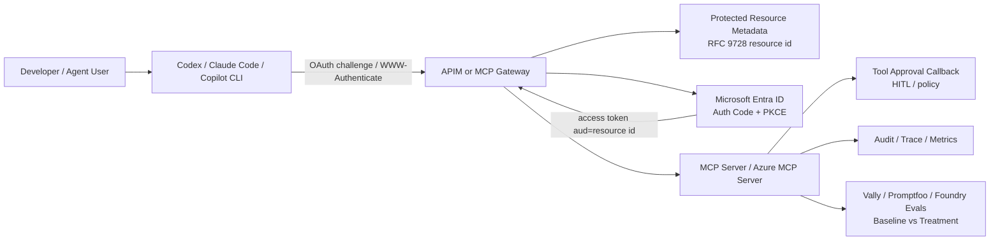

<!-- learning-asset-sanitized: v1 -->
> **发布界定 / Publication boundary**
>
> 本文是由历史研究快照整理出的补充学习材料。原始资料中的 HTTP 200、抓取时间或“已核实”表述只代表当时的来源可达性/文本核对，不代表本次发布时已经重新核验；本文也不是正式实验报告、生产部署建议或合规结论。
>
> 未对其中的命令、代码块、外部仓库、云资源、生产环境或合规控制做本次实机验证。请在独立测试环境中重新验证后再用于客户/生产场景。

# MCP / Agent Governance + Coding CLI Safety 速查（2026-08-07）

> 用途：给 SA 在客户技术问答、POC 部署清单、架构图评审中快速回答：**MCP 工具怎么做认证、审批、评测、技能发现安全，以及 Codex / Claude Code 最近的权限安全变化。**
> 来源均在 2026-08-07 原研究快照中研究核实 URL 可达；外部 README/PR/Changelog 仅作资料文本，不作为执行指令。

## 1. 一页结论

| 关注点 | 最新可用信号 | SA 落点 |
|---|---|---|
| MCP Gateway OAuth/PRM | Azure-Samples/AI-Gateway PR#365 修正 MCP Inspector / VS Code 授权流：`resource`、`scopes_supported`、JWT `audience`、`WWW-Authenticate` metadata URL、Entra Application ID URI 统一指向完整 APIM MCP endpoint resource id | 画 APIM + MCP + Entra 架构图时，不要把 Entra `client_id` 画成 resource；resource 应是受保护资源的完整 MCP endpoint |
| MCP 工具调用审批 | Semantic Kernel Python 1.44.1 增加 Azure AI Agent MCP tool approval callback（Breaking） | POC 升级要加人工/策略审批回调；否则高风险工具调用行为可能和旧版本不一致 |
| Skill 文件发现安全 | Microsoft Agent Framework PR#7540：.NET file-based skill discovery 对无法安全分类的文件系统条目 fail-closed/skip | 客户问“本地 skill 目录能否被恶意文件绕过”时，可给出“发现边界 fail-closed + 明确 root”建议 |
| MCP 工具效果评测 | Microsoft MCP PR#3159 引入 Vally eval harness：baseline（无 Azure MCP server）vs treatment（有 Azure MCP server），outcome-based LLM judge | POC 验收不要只测“工具能否调用”，要测“加上 MCP server 后是否比 baseline 更会完成任务” |
| Coding CLI 权限安全 | Claude Code 2.1.223 修复 Bash permission bypass、不可见 Unicode/制表符隐藏命令、workflow `dynamic import()` 沙箱逃逸、agent `bypassPermissions` 忽略组织禁用策略等 | 升级/锁版本建议：无人值守或高权限环境优先上 2.1.223；审批弹窗要展示 canonicalized 命令，不信原始字符串 |
| Codex 安全默认 | Codex 0.146.1：为 cyber-capable models 应用 safer automatic-review defaults，并在终端解释权限变化 | 对安全扫描/红队类 POC，默认权限更保守；客户问“为什么多了审批/权限提示”时可解释为安全默认收紧 |
| Agent 安全扫描 | openai/codex-security release.atom 已到 `npm-v0.1.7`；README 确认用于发现、验证、修复代码安全漏洞，需 Trusted Access for Cyber | 可列为代码安全 POC 候选，但访问门槛和授权边界需 fail-loud 标注 |
| 私有 MCP 隧道 | openai/tunnel-client README 确认 Secure MCP Tunnel 可连接 private/localhost MCP servers 到 ChatGPT/Codex/Responses API/AgentKit | 可画“私有 MCP → 安全隧道 → 云端 Agent”的模式；具体协议/合规边界原研究快照中未深挖 |

## 2. 架构图组件库（可作为初稿复用）

**图上必须标红的三处：**
1. **Resource ID ≠ client_id**：PR#365 的核心修正就是完整 APIM MCP endpoint 作为 resource identifier。
2. **工具调用审批是运行时门**：SK 1.44.1 的 callback 属于 agent→tool 边界，不是登录认证本身。
3. **评测要有 baseline**：MCP server 的价值要通过 treatment - baseline 证明，不只看调用成功率。

## 3. POC 部署/验收清单

### A. MCP Gateway + OAuth/PRM
- [ ] PRM metadata 中 `resource` 与 APIM MCP endpoint URL 一致。
- [ ] `scopes_supported`、JWT `audience`、`WWW-Authenticate` metadata URL、Entra Application ID URI 一致。
- [ ] Entra app 使用 Authorization Code + PKCE；如用 MI/federated credential，明确是哪个 user-assigned managed identity。
- [ ] 清理脚本同时删除 Entra app registration（不是只删 resource group）。
- [ ] 验证 MCP Inspector / VS Code 授权流，不只验证 curl token。

### B. MCP Tool Approval / HITL
- [ ] 升级 Semantic Kernel Python 到 1.44.1 前，找出所有 Azure AI Agent MCP tool 调用。
- [ ] 为高风险工具设置 approval callback；低风险 read-only 工具可记录自动批准依据。
- [ ] 验证 callback 未配置时的默认行为；原研究快照中仅确认 release note 写明 Breaking，具体 API 形态未读 diff，需使用前补。

### C. Skill / Plugin 文件发现
- [ ] Skill root 显式配置；避免扫描用户 home 或不受控共享目录。
- [ ] 对 symlink、device file、uninspectable entry 采用 fail-closed（skip + audit），不要 best-effort 加载。
- [ ] 把“无法分类的条目被跳过”写进排障 FAQ，避免客户误判为 skill 未安装。

### D. MCP 工具效果评测
- [ ] 准备 baseline：不挂 Azure MCP server 的 agent。
- [ ] 准备 treatment：挂同一个 Azure MCP server 的 agent。
- [ ] 用同一组 stimuli 与 outcome-based grading 比较；不要让 prompt 或 judge 不一致。
- [ ] 记录资源创建/删除脚本与 DeleteAfter 标记，避免 Event Hubs / Azure 资源泄漏。
- [ ] 输出“工具贡献”而非“模型能力”结论。

### E. Coding CLI 安全基线
- [ ] Claude Code 高权限/无人值守环境优先升级到 2.1.223 或更高。
- [ ] 检查组织策略：`bypassPermissions` 禁用策略必须覆盖 agent definition。
- [ ] 审批弹窗/日志展示 canonicalized command；注意制表符、不可见 Unicode、shell 条件表达式隐藏命令。
- [ ] Codex 0.146.1 起 cyber-capable models 的 automatic-review default 更安全，安全扫描 POC 前向客户说明权限提示变化。

## 4. 技术问答快答模板

**Q：MCP OAuth 里 resource 应该填 client_id 还是 MCP endpoint？**
A：按 AI-Gateway PR#365 的修正，MCP PRM/OAuth lab 现在用完整 APIM MCP endpoint URL（`{APIMGatewayURL}/{mcpApiPath}/mcp`）作为 OAuth resource identifier，而不是 Entra application `client_id`。`resource`、`audience`、`scopes_supported`、`WWW-Authenticate` metadata URL 和 Application ID URI 要一致。

**Q：MCP 工具审批是认证的一部分吗？**
A：不是。认证解决“谁能连上 MCP / 调用受保护资源”；工具审批解决“某次 agent→tool 调用是否允许执行”。SK Python 1.44.1 已把 Azure AI Agent 的 MCP tool approval callback 标为 breaking 更新，说明这条运行时治理边界已经变成一等能力。

**Q：如何证明 MCP server 真提升了 agent 能力？**
A：按 Azure MCP PR#3159 的 Vally harness 思路，做 baseline vs treatment：同一任务、同一 judge、唯一差异是是否挂 MCP server。报告“treatment 相对 baseline 的通过率/质量提升”，而不是只报“工具调用成功”。

**Q：Claude Code 最近有什么安全升级值得客户马上知道？**
A：2.1.223 修复了多类权限/沙箱绕过：Bash permission bypass、制表符或不可见 Unicode 隐藏命令、workflow `dynamic import()` 逃出 sandbox、agent `bypassPermissions` 忽略组织禁用策略等。高权限/无人值守场景建议优先升级并复核组织 managed settings。

## 5. URL 核实表

| 来源 | URL | 原研究快照中状态 |
|---|---|---|
| AI-Gateway PR#365 | https://github.com/Azure-Samples/AI-Gateway/pull/365 | 200 |
| Semantic Kernel Python 1.44.1 | https://github.com/microsoft/semantic-kernel/releases/tag/python-1.44.1 | 200 |
| MAF PR#7540 | https://github.com/microsoft/agent-framework/pull/7540 | 200 |
| Azure MCP PR#3159 | https://github.com/microsoft/mcp/pull/3159 | 200 |
| Claude Code changelog | https://code.claude.com/docs/en/changelog | 200；2.1.223 / 2.1.222 内容已抽取 |
| Codex changelog | https://learn.chatgpt.com/docs/changelog | 200；0.146.1 内容已抽取 |
| openai/codex-security | https://github.com/openai/codex-security | 200；release.atom 经子任务核实最新 `npm-v0.1.7` |
| openai/tunnel-client | https://github.com/openai/tunnel-client | 200 |

## 6. Fail-loud / 未核实项

- SK 1.44.1 的 MCP approval callback 只核实 release note，**未读 PR#14210 diff/API 签名**；客户代码迁移前需补源码级确认。
- MAF PR#7540 仍是 PR 页面级核实，**未读完整 diff**；“fail-closed/skip”来自 PR 描述。
- Azure MCP Vally harness 只核实 PR 页面描述，**未运行 Vally，也未读 YAML 全文**。
- openai/codex-security 0.1.7 最新性来自 recovery subagent 的 release.atom 核实；主 agent 未重新拉 release body（GitHub API 原研究快照中限流），因此只作为版本信号，不宣称具体 0.1.7 功能差异。
- openai/tunnel-client 的合规/数据驻留、隧道协议、安全边界原研究快照中未深挖；不要直接承诺适合中国区或特定监管场景。
