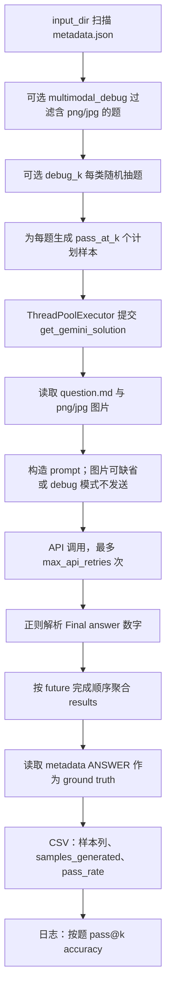

# 多模态评测输入完整性与覆盖分母 Gate：POC 验收模板

日期：2026-10-02
对象：Google DeepMind `google-deepmind/eval_hub`，固定提交 `d5637d5cfb420a040ad550b2125c6aa23f71f9e4`
范围：只读源码与文档审查；不运行上游评测脚本、不调用模型服务、不复算官方分数。本文不是漏洞报告，也不主张任何既有报告分数被抬高。

## 1. 固定来源清单（可公开复核）

以下 URL 均以固定提交 SHA 读取，避免移动 HEAD 造成证据漂移。可用命令形态：

```bash
curl -L -f 'https://raw.githubusercontent.com/google-deepmind/eval_hub/d5637d5cfb420a040ad550b2125c6aa23f71f9e4/eval_hub/live_math/evaluate.py'
```

| 来源 | 固定 URL | curl 状态 | SHA-256 |
|---|---|---:|---|
| 仓库 README | https://raw.githubusercontent.com/google-deepmind/eval_hub/d5637d5cfb420a040ad550b2125c6aa23f71f9e4/README.md | 200 | `dbec715b4748e7c1c5adcb488bd1e769761a1e722ecc553830a9f0d13e955a52` |
| LICENSE | https://raw.githubusercontent.com/google-deepmind/eval_hub/d5637d5cfb420a040ad550b2125c6aa23f71f9e4/LICENSE | 200 | `43070e2d4e532684de521b885f385d0841030efa2b1a20bafb76133a5e1379c1` |
| LiveMath README | https://raw.githubusercontent.com/google-deepmind/eval_hub/d5637d5cfb420a040ad550b2125c6aa23f71f9e4/eval_hub/live_math/README.md | 200 | `b82bbfe432e10fda03c8783017aaf71df95acb006a9612e0d8e9235fe1e7b511` |
| LiveMath evaluate.py | https://raw.githubusercontent.com/google-deepmind/eval_hub/d5637d5cfb420a040ad550b2125c6aa23f71f9e4/eval_hub/live_math/evaluate.py | 200 | `d40a7105f601d413f1e5c89cfbf5792abd9c435bfa6e40f3a834a0c5995cf694` |
| LiveMath system_prompt.md | https://raw.githubusercontent.com/google-deepmind/eval_hub/d5637d5cfb420a040ad550b2125c6aa23f71f9e4/eval_hub/live_math/system_prompt.md | 200 | `8b2253115467f253a374fa0bb4d4bb630f5f38c67d3bc13d9c46f40829e98e29` |

许可提示：仓库为 Apache-2.0；再分发或派生模板时需保留许可证、版权/归属通知，并对修改文件作显著说明。本文只引用短片段和行为事实，不复制大段实现。

文档背景边界：LiveMath README 将题目分为 Regular、Difficult、Multimodal，并说明 Multimodal Problems 需要融合图像与符号推理（README 31-37）；同时 Known Issues 称当前 release 估计可有至多 10% noisy samples，噪声包括 typos、image errors、missing solution components、ambiguous formulations 或 conceptual errors（README 85-88）。这支持把“输入完整性”和“ground truth 有效性”做成显式 Gate，但不能据此推断任一具体标签错误或任一分数偏高。

## 2. evaluate.py 调用链审查：输入、重试、解析、CSV 与分母

### 2.1 调用链概览



### 2.2 关键事实与边界

| 主题 | 上游实际行为（固定源码） | POC 验收建议 |
|---|---|---|
| 输入目录发现 | `os.walk(input_path)` 中凡包含 `metadata.json` 的目录均加入题目集合，排序后进入后续流程（evaluate.py 315-320）。 | 显式维护题目 manifest，列出题目 ID、题型、题干哈希、预期图片清单、ground truth 状态；不要只以目录发现作为覆盖依据。 |
| 多模态筛选 | `multimodal_debug` 只按 `*.png` 或 `*.jpg` 是否存在筛题；随后该模式说明为 “without images”，源码也在该模式下不发送图片（88-93、328-343、181-183）。 | 将“题目声明为多模态”“发现图片文件”“图片成功解码”“图片实际进入请求”拆成四个字段。调试模式输出不得作为完整多模态成绩。 |
| 图片读取 | 只收集 `*.png`、`*.jpg`；图片打开或加载异常仅 warning，继续构造请求；若没有成功图片，prompt 仍可只含文本（157-183）。 | 输入完整性 Gate 应在模型调用前失败：缺图、坏图、扩展名不在 manifest、解码失败、数量不符均标 `INVALID_INPUT`，不得进入可计分分母。 |
| 重试 | 每个计划样本在 `get_gemini_solution` 内最多 `_MAX_API_RETRIES` 次；API 错误和解析失败可重试，尝试间 sleep（188-258）。 | 台账必须记录 `planned_sample_id` 与每次 `attempt_id`；费用/调用预算按 attempt 计，不按最终 CSV 样本列计。 |
| 响应解析 | 正则查找 `Final\s*answer:\s*(-?[\d\.]+)\s*$`，启用 `re.MULTILINE`；匹配并能 `float()` 即返回 `status='SUCCESS'`（217-228）。系统提示要求最后两行分别为 `Final answer:` 与数字（system_prompt.md 5-9），正则中的 `\s*` 也可匹配换行，因此同一行和两行格式均可接受；数值字符类也会匹配 `1.2.3`，随后 `float()` 失败并进入重试。`MULTILINE` 的行尾锚点不保证匹配位于整个响应末尾。 | 将 `RESPONSE_PARSE_SUCCESS` 与 `CORRECT` 分离；解析规则应与提示格式一致，且保留原始响应和解析错误类型。 |
| SUCCESS 含义 | `SUCCESS` 仅代表数字可解析，不代表答案正确；正确性另在 CSV 汇总时用 `abs(parsed_answer - ground_truth) < 1e-6` 判断（439-443）。 | 报表禁止把 `SUCCESS` 命名为“通过”；建议字段：`returned`、`parse_status`、`parsed_answer`、`correct`。 |
| future 异常 | `future.result()` 若 cancelled 或抛异常，只记录日志，不向该题追加失败结果（395-407）。 | 即使 worker/future 异常，也生成逐计划样本失败记录，保持 planned/attempted/returned/parsed/correct 分母可追溯。 |
| ground truth | 读取 `metadata.json` 的 `ANSWER` 并转 float；无效/缺失则跳过整题，不生成 CSV 行，也不进入最终 pass@k 分母（414-426、467-469、505-530）。 | ground truth Gate 先于评测运行；无效标签进入 `INVALID_GROUND_TRUTH` 清单，报告题库排除数，而不是静默消失。 |
| CSV sample 编号 | 每题结果按 future 完成顺序 append；输出列 `sample_idx=i+1` 由完成顺序重新枚举（395-399、436-459）。 | 输出列名不能作为稳定样本身份；必须保存稳定 `planned_sample_id`、`attempt_id`、提交时间和完成时间。 |
| CSV pass_rate | `samples_generated` 只统计 `status='SUCCESS'` 且 parsed 非空的样本；`pass_rate=correct_count/successful_samples`，没有成功解析则 0（434-464）。 | 同时报告：计划样本数、尝试次数、返回数、可解析数、正确数；任何按“可解析样本”条件化的比率需明确命名。 |
| 最终 pass@k | 最终日志按题计：某题 `correct_count>0` 即该题正确；分母为有效 ground truth 且未被跳过的题数（467-530）。 | 把逐样本条件化 pass_rate 与按题 pass@k 分开展示，禁止用同一“准确率”标签混用。 |

## 3. 反例设计（不运行上游，仅作为 POC 验收用例）

这些反例用于检验评测契约是否能区分 retry、response parse、CSV sample、status、ground truth、pass@k 与 future 异常；不用于证明上游线上分数异常。

1. **坏图仍有文本请求**：题目 manifest 要求 1 张图，但图片内容损坏。上游源码会 warning 后继续，POC Gate 应标 `INVALID_INPUT` 且不请求模型。
2. **解析契约宽松性**：同一行 `Final answer: 20` 与实际换行的 `Final answer:\n20` 均是可接受正控；`Final answer: twenty` 或 `Final answer: 20 units` 不匹配。`Final answer: 1.2.3` 是匹配但数值转换失败的独立负控。示例中的 `\n` 表示实际换行，而非两个字面字符。
3. **可解析但错误**：响应 `Final answer: 19`，ground truth 为 20。结果应是 `parse_status=SUCCESS` 与 `correct=false` 并存。
4. **future 异常不应消失**：计划 3 个样本，其中 2 个 worker 抛异常、1 个返回正确。POC 报告应显示 planned=3、failed_future=2、parsed=1、correct=1；不能只留下一个“sample 1 正确”。
5. **ground truth 无效**：metadata 缺 `ANSWER` 或无法转 float。POC 应在预检阶段列为 `INVALID_GROUND_TRUTH`，并报告排除原因。
6. **完成顺序乱序**：`planned_sample_id=sample-003` 先完成。POC CSV/JSONL 仍保留原计划 ID，不用完成顺序覆盖身份。

一个最小算术示意：若 2 道题、每题计划 k=3；题 A 只有 1 个可解析且正确、2 个 future 异常，题 B 的3个计划样本均未成功解析，且其 ground truth 无效而被排除。则“可解析样本条件化正确率”可为 1/1，“按有效题 pass@3”可为 1/1，但“原始计划的解析覆盖率 parsed_successes/all_planned_samples（含排除题的原始计划）”只有 1/6；这不是 API 请求覆盖或返回率。三者回答的问题不同，不能互相替代。

## 4. 公开 POC 数据契约模板

### 4.1 题目 manifest（草案）

```yaml
benchmark_id: public-mm-poc-2026-10-02
benchmark_version: v0.1-draft
evaluator_contract_version: input-coverage-gates-v0.1
problems:
  - problem_id: MM-001
    category: multimodal_geometry
    question_file_sha256: "<sha256>"
    ground_truth:
      value: 20
      type: numeric_float
      status: VALID
    images:
      - image_id: img-001
        file_name: diagram.png
        sha256: "<sha256>"
        media_type: image/png
        required: true
        decode_expected: true
```

### 4.2 样本/尝试台账（草案）

```yaml
planned_sample_id: MM-001::k01
problem_id: MM-001
attempts:
  - attempt_id: MM-001::k01::a01
    request_status: NOT_RUN
    input_gate_status: NOT_RUN
    response_status: NOT_RUN
    parse_status: NOT_RUN
    correct: null
    model: "<model-name>"
    prompt_bundle_sha256: "<sha256>"
    image_manifest_sha256: "<sha256>"
```

最小字段要求：

| 字段 | 目的 |
|---|---|
| `problem_id` | 稳定题目身份，不依赖目录名或输出行号。 |
| `planned_sample_id` | pass@k 计划样本身份，提交前生成。 |
| `attempt_id` | 重试身份；一次计划样本可有多个 attempt。 |
| `image_manifest_sha256` | 证明图片集合、顺序与哈希已冻结。 |
| `input_gate_status` | `PASS` / `INVALID_INPUT` / `INVALID_GROUND_TRUTH` / `NOT_RUN`。 |
| `request_status` | `NOT_RUN` / `SUBMITTED` / `API_ERROR` / `FUTURE_EXCEPTION` / `RETURNED`。 |
| `parse_status` | `NOT_RUN` / `SUCCESS` / `NO_FINAL_ANSWER` / `NON_NUMERIC` / `FORMAT_MISMATCH`。 |
| `correct` | 只在 ground truth 有效且解析成功时为 true/false；其他为 null。 |

## 5. 可复演验收卡（全部 NOT_RUN）

| 卡号 | 前置 | 输入 | 动作 | 观察项 | 正对照 | 负对照 | Expected | Observed | Status |
|---|---|---|---|---|---|---|---|---|---|
| C01 坏图 Gate | manifest 要求 1 张 PNG | `diagram.png` 文件存在但不可解码 | 执行输入预检，不调用模型 | `input_gate_status`、错误原因、图片哈希 | 同尺寸可解码 PNG 通过 | 坏 PNG | 标 `INVALID_INPUT`，planned 样本保留但 request `NOT_RUN` | 未执行 | NOT_RUN |
| C02 缺图 Gate | manifest 要求 `img-001` | 问题目录无图片 | 执行输入预检 | 缺失图片 ID | 补齐图片后通过 | 删除图片 | 标 `INVALID_INPUT`，不得转文本题计分 | 未执行 | NOT_RUN |
| C03 扩展名覆盖 | manifest 声明 JPEG | 文件为 `.jpeg` 或大小写扩展 | 执行 manifest 匹配 | 是否按 manifest 而非 glob 隐式发现 | `.jpg` 且哈希匹配 | `.jpeg` 未登记 | 未登记文件不得默默参与；登记 .jpeg 由POC manifest读取器按 media_type 处理，非上游glob已支持 | 未执行 | NOT_RUN |
| C04 调试模式不计完整多模态 | 题目有有效图片 | 配置 `multimodal_debug=true` 类似场景 | 生成报告 | 是否有 `images_sent=false` | 正常模式图片进入请求 | debug 模式不发图 | debug 结果仅用于诊断，不计完整多模态分数 | 未执行 | NOT_RUN |
| C05 格式与数值分离 | ground truth=20 | 同行、两行、单词、单位后缀、多小数点五类响应 | 对固定正则与 float 两步分别观测 | matched、parse_status、retry | 同行及实际换行两行均解析20 | twenty / 20 units 不匹配；1.2.3 匹配后转换失败 | 前两类解析成功；后三类分别记录无匹配/数值失败；标签为POC设计，不声称上游使用同名状态 | 未执行 | NOT_RUN |
| C06 可解析但错误 | ground truth=20 | 响应 `Final answer: 19` | 汇总单样本 | `parse_status` 与 `correct` | `Final answer: 20` | `Final answer: 19` | `parse_status=SUCCESS` 且 `correct=false` | 未执行 | NOT_RUN |
| C07 future 异常覆盖 | 1 题 k=3 | 两个 future 抛异常，一个正确返回 | 汇总报告 | planned/attempted/returned/parsed/correct | 3 个均返回 | 2 个异常 | 保留 3 个 planned_sample_id；异常列为失败，不消失 | 未执行 | NOT_RUN |
| C08 ground truth 无效 | metadata 缺 `ANSWER` | 任意响应 | 运行预检 | `INVALID_GROUND_TRUTH` 清单 | 有效 float | 缺失/非数值 | 题目从计分分母排除，并公开排除计数 | 未执行 | NOT_RUN |
| C09 完成顺序乱序 | 1 题 k=3 | sample-003 先完成 | 汇总 CSV/JSONL | stable ID 是否保留 | 按计划顺序完成 | 乱序完成 | 输出仍能追踪 `MM-001::k03`，不以列号替代身份 | 未执行 | NOT_RUN |
| C10 pass@k 与 sample pass_rate 分离 | 两题GT有效，各k=3 | A：1正2未解析；B：0正3可解析 | 汇总指标 | 按题、合并样本、解析覆盖三分母 | 全部返回 | 部分未解析 | 按题1/2；合并样本1/4；解析覆盖4/6；上游每题pass_rate为1/1与0/3，不能推算attempt数 | 未执行 | NOT_RUN |

## 6. 三个常见问答

**Q1：`status=SUCCESS` 是否等于模型答对？**
不是。固定源码中 `SUCCESS` 是响应中解析出数字后的状态；答案正确性在后续汇总阶段用 parsed answer 与 ground truth 的数值容差比较。POC 报告应保留 `parse_status` 与 `correct` 两列。

**Q2：CSV 的 `samples_generated` 是否等于实际请求数或计划样本数？**
不是。固定源码中它统计的是解析成功的样本数。计划样本数来自 `problem_count * pass_at_k`，实际 API 尝试数还会受 retry 影响。POC 应同时报告 planned、attempted、returned、parsed、correct。

**Q3：图片读取失败后继续请求是否一定导致分数偏高？**
不能这样推断。源码事实只是：图片打开失败被 warning 后流程可继续，模型可能收到文本-only prompt。它说明输入完整性与计分覆盖应被独立 gate；是否影响某次成绩需具体数据和运行记录证明。

## 7. 方案比较与推荐

| 方案 | 描述 | 优点 | 风险/不足 | 推荐度 |
|---|---|---|---|---|
| A. 沿用单一 CSV 与条件化 pass_rate | 保留正常返回的 SUCCESS/FAILURE 样本列与按题 pass@k 日志；samples_generated/pass_rate 只按解析成功样本统计，future 异常记录及坏GT题可能缺失 | 实现最少、接近上游示例 | 容易混淆 planned、attempted、parsed、correct；future 异常和坏输入证据弱 | 不推荐用于验收 |
| B. 在现有评测外加预检 Gate 与 JSONL 台账 | 不改大段模型调用逻辑；前置检查 manifest/ground truth，后置补齐计划样本与 attempt 记录 | 成本低；能公开解释输入完整性和分母 | 仍需维护适配层，需确保原始响应脱敏与存储合规 | 推荐作为 POC |
| C. 重写完整评测 harness | 自定义调度、重试、解析、报告、审计 | 最清晰、可扩展到多模型多模态 | 工程量大，容易与上游行为不可比；不适合快速公开模板 | 中长期可选 |

**推荐**：先采用方案 B。即：冻结题目与图片 manifest；在模型调用前执行输入/ground truth Gate；为每个 planned sample 和 attempt 写 JSONL；报告时分开展示 `planned_samples`、`attempts`、`returned_responses`、`parsed_successes`、`correct_samples`、`valid_problems`、`pass@k`。上游实际行为作为对照栏记录，不把它包装成已发现漏洞或已复现分数问题。

## 8. 验收通过口径（草案）

公开 POC 若满足以下条件，可视为模板验收通过：

1. 每个多模态题都有图片 manifest，且图片缺失/坏图/数量不符会在请求前失败。
2. 每个计划样本都有稳定 `planned_sample_id`；每次重试都有稳定 `attempt_id`。
3. future 异常、API 错误、解析失败、ground truth 无效均有结构化记录，不因 CSV 行缺失而消失。
4. 报告分开展示解析成功率、样本正确率、按题 pass@k、输入覆盖率和 ground truth 排除数。
5. 所有验收卡默认 `NOT_RUN`，执行后只能写入 `PASS` / `FAIL` / `BLOCKED`，并附最小可复核证据。
6. 不包含真实密钥、客户数据、私有图片或不可公开的模型响应；必要时对原始响应做可审计脱敏。
