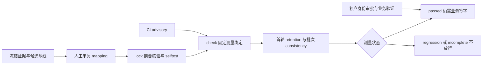

# NVIDIA 冻结证据语义回归：验收设计

2026-10-06｜**NOT_RUN**｜仅评估叙事；不证明任务正确性、覆盖算术、环境保真或完整技能执行。私有 Ratchet 未供应、未跑，无模型调用或分数；命令及八卡仅作设计。

## 源码归属与边界

上游：**NVIDIA-NeMo/labs-eval-author**，commit `d277f6e3e0e8d85088915d26174f4aecdc71ddd4`。八卡与签字门为衍生设计，非 NVIDIA 认证或实测。

源码链接（均固定到该 commit）：
- [S1 semantic_regression.py](https://github.com/NVIDIA-NeMo/labs-eval-author/blob/d277f6e3e0e8d85088915d26174f4aecdc71ddd4/tools/semantic_regression.py)：L51–58、91–109、178–268、320–443、465–568。
- [S2 semantic_ratchet.py](https://github.com/NVIDIA-NeMo/labs-eval-author/blob/d277f6e3e0e8d85088915d26174f4aecdc71ddd4/tools/semantic_ratchet.py)：L24–61。
- [S3 CI](https://github.com/NVIDIA-NeMo/labs-eval-author/blob/d277f6e3e0e8d85088915d26174f4aecdc71ddd4/.github/workflows/semantic-regression.yml)：L26–53、58–91。
- [S4 范围说明](https://github.com/NVIDIA-NeMo/labs-eval-author/blob/d277f6e3e0e8d85088915d26174f4aecdc71ddd4/docs/semantic-regression.md)：L6–17、52–89、93–120。
- [S5 测试源码](https://github.com/NVIDIA-NeMo/labs-eval-author/blob/d277f6e3e0e8d85088915d26174f4aecdc71ddd4/tests/test_semantic_regression.py)：L31–74、84–185、216–227；仅阅读，未执行。

精确实现：lock 验 mapping 摘要、receipt 列出的文件和 runtime 摘要，调用外部 selftest 后才创建新输出目录；它不验证审阅者身份。check 验 binding、baseline 摘要、审阅摘要格式及 N，再生成候选；retention 固定取首个 run，consistency 使用批次。binding 涵盖 query、N、技能文件名、extractor/judge、endpoint、runtime 和测量脚本摘要，**不含 author 模型或技能内容**（被测变量）。runtime 摘要仅覆盖 `.py/.md`（排除缓存），不是整个依赖环境的证明。[S1]

## 八个验收设计卡

### 1｜缺基线不得变通过 [S1 L485–506；S5 L31–42]
- precondition：合法 suite，case 不含 baseline，模型计数器初始为零。
- stimulus：设计执行 check。
- expected：incomplete / baseline_missing，metrics=null，模型调用零；check 汇总退出 2。
- negative：把 plan 退出 0 或缺基线解释为 measured pass，应被签字门拒绝。
- observed：**NOT_RUN**。

### 2｜锁定拒绝漂移与覆盖 [S1 L421–443]
- precondition：有效 packet、已审 mapping 摘要、匹配 runtime，目标目录不存在。
- stimulus：分别改变 mapping、receipt 已登记文件、runtime 的 .py/.md；另测目标目录已存在。
- expected：前三者摘要核验拒绝；已存在目录在 selftest 后 mkdir 拒绝，不覆盖旧基线。
- negative：完整未改 packet 与成功 selftest 才可写新锁；正确 hash 本身不证明有人审阅。
- observed：**NOT_RUN**。

### 3｜比较绑定与被测变量分离 [S1 L91–109、337–353]
- precondition：有效 lock，N 与 suite 一致。
- stimulus：分别改变 query、N、extractor/judge、endpoint、runtime、测量脚本或 baseline 字节。
- expected：对应 binding/digest 核验拒绝，候选模型尚未调用；外层归为 incomplete。
- negative：仅改变 author 或技能内容，不应被误称 binding 必然拒绝；仍须语义比较。
- observed：**NOT_RUN**。

### 4｜证据必须逐字可定位 [S1 L178–209；S5 L84–120]
- precondition：报告含 `Excel coverage is **unmeasured**.`，固定 run_id。
- stimulus：extractor 返回错误 ID，或删 Markdown、拼接片段作为 evidence。
- expected：最多一次纠正；仍无效则 incomplete。供应商异常不自动重试。
- negative：逐字连续引文可通过结构校验，但 claim.text 是否正确仍需语义审阅。
- observed：**NOT_RUN**。

### 5｜claim 不得丢失或重复 [S1 L216–268、320–334]
- precondition：权威 claim ID 集合、run_ids 和基线 core 已知。
- stimulus：聚类漏项/重复/伪造 ID；retention 映射重复成员、漏成员、错误 run 或未知 core。
- expected：非法聚类最多纠正一次，失败报 clustering_invalid_output；非法 retention 映射拒绝，不能删 claim 修成通过。
- negative：每项恰好出现一次的合法分区仅说明结构完整，不说明聚类语义正确。
- observed：**NOT_RUN**。

### 6｜否定词、首轮与空报告 [S1 L27–30、353–375；S4 L81–89]
- precondition：人工认定“未测覆盖”“未证明 CAD 保真”为核心；预先设能检出其丢失的有效阈值。
- stimulus：首轮把“未证明”改成“已证明”，其余轮保留原义；另注入空报告。
- expected：固定首轮；应检出结论丢失，空 run 不得移出分母。真实检出能力待 Ratchet/裁判验证。
- negative：等义改写且保留否定、范围与未测限定作为对照；若损坏样本仍通过，拒绝该测量配置。
- observed：**NOT_RUN**。

### 7｜弱阈值不能无条件通过 [S2 L44–61]
- precondition：有效且非空的 core，外部 cli.check 契约及输入均可用。
- stimulus：设置 th1≤0、jac1−th2≤0 或 th1<1/核心数，模拟 gate 返回 0。
- expected：适配器标 incomplete；gate 返回 1 时优先标 regression，而非伪装通过。
- negative：阈值有效且 gate 返回 0 才具备 passed 条件；不外推产品正确性。
- observed：**NOT_RUN**。

### 8｜CI 绿色与测量结论分离 [S3 L26–91；S1 L563–568]
- precondition：区分 plan、live 和汇总报告；环境审批规则需另行核实。
- stimulus：PR、未启用 live、供应失败、测量回归、任务中断分别验收。
- expected：fork PR 的 plan 被跳过；live 仅显式启用的 main push 或请求 live 的 main 手动运行。供应失败可留 plan-only fallback；无报告也不算通过。
- negative：live 的 continue-on-error=true，故 workflow 绿色不能签作 measured pass；CI 只 check，不 calibrate/lock。
- observed：**NOT_RUN**。

## 两个问答

**问：hash 相同，是否说明审阅者可信、基线正确？**
答：否。摘要绑定字节，不认证人，也不判断内容真伪；需独立记录审阅人、证据范围、审批与版本。上游源码的 Apache-2.0 标记不自动覆盖外部 Ratchet 的许可。

**问：retention 高且 CI 绿色，POC 能否签通过？**
答：不能。retention 是核心结论保留，不是正确性；稳定复述错误也可能一致。CI 是 advisory；还需真实测量、负控检出、业务正确性和环境保真等独立证据。

## POC 签字门（当前：未签）

- 证据负责人：确认冻结材料、否定词/未测边界、mapping 与 baseline 的对应关系；姓名、日期、审批记录待填。
- 测量负责人：固定 N、模型版本、runtime/测量脚本/基线摘要及阈值；八卡含负控均有实际证据，incomplete、缺产物或仅 plan 一律不签测量通过。
- 安全负责人：私有可执行 bundle 来源、许可、审阅和摘要，模型外发目的地、数据分类、凭据及费用上限获批；进程隔离不等于沙箱。
- 业务负责人：独立验任务正确性、覆盖计算及环境保真，接受剩余风险。四方齐签才讨论通过；禁止 CI 重锁掩盖回归。



命令示意（**未执行**；变量为未来获批输入）：
```bash
python tools/semantic_regression.py --mode lock --packet "$PACKET" --reviewed-mapping-sha256 "$REVIEWED_SHA256" --runtime "$RATCHET" --output "$NEW_LOCK"
python tools/semantic_regression.py --mode check --suite "$SUITE" --runtime "$RATCHET" --output "$NEW_CHECK"
```

逐文件 SHA-256、raw URL 与行段见 `claims.json`（源码索引，非运行报告）。
