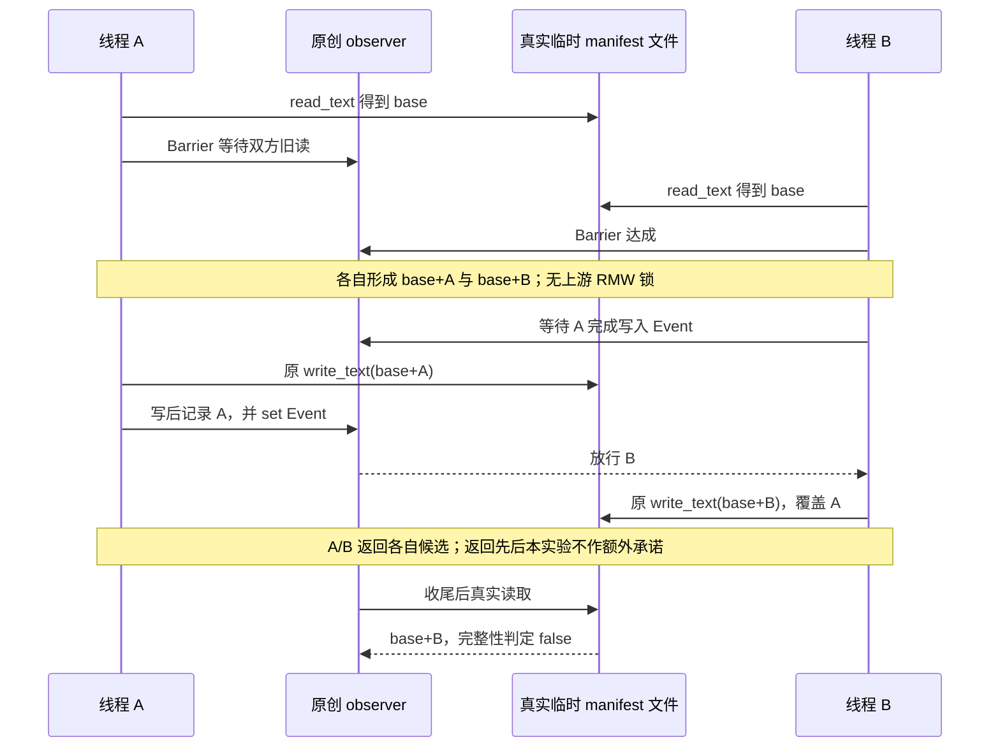

# UserSim：真实文件 write 边界与并发 append——补充 Lab

日期：2026-10-04。对象：`NVIDIA-NeMo/UserSim`，固定 commit `2945592c6d5b473c8b7158f432b16490a2d04aa0`。

**既有实际执行记录：6 case 全部 PASS。PASS 只表示预设边界被观察到，绝不表示安全通过、数据不会丢失、写入原子性或事务成立。** 其中 race 的 PASS 恰恰要求丢失 A，partial 的 PASS 恰恰要求实际目标文件变成不可解析的 JSON。本文保留原 runner 字节与实际 stdout。**技术边界：下述公开包装命令 runtime 未新复演；静态 shell/AST 检查不等于执行验证。**

## 1. 新增证据与未覆盖范围

这是**同 SHA 旧雷达的进一步实测**，不是新版本、首次发现仓库或新发布功能。此前 manifest 意图/结果提交 lab 已区分真实单模块与原创内存 store；本补充不重写前次结论，而把观察推进到真实 `Path.write_text` 文件字节、故障窗口及受控 RMW 交错。

- 正常 import **完整单文件 `eval_manifest.py`**，不抽取 AST 函数、不改上游源码；不是导入完整 SDK/package initializer、安装 wheel 或执行上游测试套件。
- 真实发生的是容器临时文件的读写、截断覆盖及再读取。异常由 observer 人工抛出；不是磁盘满、实际 EIO、断电、真实 SIGINT 或操作系统自然故障复现。
- notebook、CLI、模型推理、真实 evaluation/parquet store、目录删除与 manifest/store 联合事务均 **NOT_RUN / NOT_PERFORMED**。没有真实业务数据。
- 父进程逐 case spawn 子进程是本 fixture 的合法设计，不是意外逃逸或违规子进程。并发 case 在**一个子进程内的两条线程**之间注入交错；父进程 spawn、进程内 monkeypatch 或线程同步都**不代表多进程写锁验证**。
- 本文没有源码 mutant 实验；negative control 是实际控制路径及实际结果上的反向断言，不能包装成 mutation coverage。

## 2. 固定来源、许可与单文件交付

本页是唯一公开运行资产：附录内嵌完整原创 runner 与实际 stdout，不依赖 companion 文件、私有目录或旧 lab。上游源码与许可不随本文复制进仓库；操作者仅在联网准备阶段用固定 URL 的 curl 下载到自己新建的临时 lab，并强制校验正文 SHA-256。URL 可达性不是运行正确性证明；hash 是完整性标识，不是签名或来源认证。

| 对象 | 固定 URL | SHA-256 |
|---|---|---|
| 上游完整模块（10443 bytes） | [eval_manifest.py](https://raw.githubusercontent.com/NVIDIA-NeMo/UserSim/2945592c6d5b473c8b7158f432b16490a2d04aa0/src/usersim/reporting/eval_manifest.py) | `8788999297e5048e197cefa939248683e5beb7b57dcbe3b9f28329dd430acfa3` |
| 上游根许可（11411 bytes） | [LICENSE](https://raw.githubusercontent.com/NVIDIA-NeMo/UserSim/2945592c6d5b473c8b7158f432b16490a2d04aa0/LICENSE) | `ee4829788960ba974f402c4d9f5b86e702e51037ef5407ec5ffdb93d3b391f33` |

上游根 LICENSE 是 Apache-2.0；下载后保留完整许可与 NVIDIA 版权声明。**原创 runner/observer 不是 NVIDIA 上游文件，上游许可不自动证明原创 runner 的许可归属**；本文不将其虚称为 NVIDIA 官方或统一 Apache-2.0 软件包。

- 附录 B runner：16468 bytes，SHA-256 `1307a501771568ec5e23d8e18126134578ed22dbf7df0e8e263fd043d78e400e`。
- 附录 A 实际 stdout：2877 bytes，SHA-256 `a39fef9236cd06100a2736d5fd363f1613822336e1374a3e572c4a73b7449199`。

**必须提取为 `runner.py`。** 原程序 `parent()` 硬编码 self-spawn 同目录 `runner.py`；下文保持完整字节不变，仅提取到本次专有 lab 的该文件名。不要改写 runner 或从网页复制时改变缩进/换行；hash 不匹配即停止。

## 3. 源码行为与 observer 行为不能混为一谈

源码定位基于上述固定模块：

1. `read_eval_sample_manifest`（196–211 行）：存在时 `read_text` → `json.loads`；JSON 解析异常转为 `ValueError`。
2. `record_eval_sample_pass`（249–257 行）：`fresh=True` 跳过读取；非 fresh 下，已有非空 `run_id` 不一致时先拒绝。
3. 同函数（258–275 行）：构建/追加内存 pass → `mkdir` → `Path.write_text(json.dumps(..., indent=2))` → 返回 manifest。在这段实现中未使用原子替换、fsync、跨调用锁或跨 store 事务。

原创 runner 的 observer 在**子进程内部全局替换** `Path.read_text/write_text/mkdir`，仅对精确绝对目标路径触发，mkdir 只匹配其父目录；其他路径调用原方法。`finally` 恢复方法，包括 `KeyboardInterrupt` / BaseException 路径。它不是 OS 安全边界，精确路径匹配也不是路径授权机制。

- 读回调在真实 read 后触发；race 用 Barrier 确认双方读到旧字节，用 Event 强制 A 完成真实 write 后 B 才写。Lock 保护 observer 自身记录，不给上游写入提供锁。
- before 模式在原 `write_text` 打开目标前抛出 `InjectedIO`；该次调用没有发生真正 write，但输入准备、读旧值和候选构造是真实上游流程。
- partial 模式调用原 `write_text`，实际写入候选 JSON 的严格无效前缀，然后人工抛出 `InjectedIO` 或 `InjectedInterrupt`。不是在内核 write 中制造自然短写。
- event 顺序来自 runner 的同步、断言和 stdout 字段；stdout **不是完整时间戳事件日志**。下表顺序是这些证据支持的因果顺序，不是伪造 trace。

## 4. 六 case：事件顺序、真实 evidence 与控制

固定输入由 `record()` 生成：run=`run-fixture`；base 用 full，后续 pass 用 per_locale；seed=17、n_selected=1、n_total=3、wrote_at_epoch=100。marker 用于识别 pass，非真实用户轨迹。除明确 fresh 的 case 外默认 append。

### C1 `race_append` — 丢失更新被真实观察

**顺序：**串行控制 base→A→B 完整；另建 base 文件；A/B 均真实读旧 base → 同步放行 → 各自构造 base+A / base+B → A 真实写完 → B 真实写完 → 再读最终文件。

**实际 evidence：**`reads_equal_initial=true`，`write_order=["A","B"]`，`returned_ids={"A":["base","A"],"B":["base","B"]}`，`errors={}`，`final_ids=["base","B"]`，`serial_complete=true`，`raced_complete=false`。

**控制：**正向串行控制保留 base+A+B；negative control 是实际 raced 文件被完整性 oracle 拒绝。不是把返回值当最终提交证明。双方旧读、顺序或线程收尾证据不足为 INCONCLUSIVE；其他业务断言失败为 FAIL，不能当 PASS。



### C2 `before_write` — 打开前失败与一次重试

**顺序：**base 落盘 → 候选 base+A 到达 write 边界 → 打开前人工异常 → 原字节保留且读回只有 base → 移除注入后正常重试。

**实际 evidence：**`exception="InjectedIO"`，`old_bytes_preserved=true`，`retry_exactly_once=true`，`fault_off_append=true`，`exact_path_miss_append=true`。

**控制：**关闭注入可真实追加；observer 指向另一路径时注入次数为零、实际文件仍追加成功，作为注入作用域 negative control。重试“恰好一次”只指这个失败发生在打开前且从未写入的 fixture，不是跨故障 exactly-once 协议。

### C3 `partial_oserror` — 真实前缀覆盖后抛错

**顺序：**base → 构造 base+A → 原 write_text 实际截断并写无效 JSON 前缀 → 人工 `InjectedIO` → 读回字节必须等于写入前缀且不同于旧文件 → reader 拒绝 → 默认 append 重试在读阶段拒绝、不再写。

**实际 evidence：**`reader_rejects=true`、`append_retry_rejects_without_write=true`、`prior_history_unreadable=true`；`partial_sha256=28d3ed11277a78f63205836b0ab48916bda4c24d105e5e9cbfa84e182b7a5b7c`。

**控制：**fault-off/path-miss 均成功；损坏文件本身是 reader/append 的负样本，重试 write 计数为零且损坏字节被保留。不等于自动恢复，旧历史也不是仍可正常读取。

### C4 `partial_interrupt` — BaseException 路径

**顺序：**与 C3 相同，真实前缀覆盖后改为人工 `InjectedInterrupt(KeyboardInterrupt)`；离开 observer 后继续检查损坏字节及 reader/append 拒绝。

**实际 evidence：**`exception="InjectedInterrupt"`；上述三项布尔 evidence 仍全 true，前缀 SHA-256 与 C3 相同；fault-off/path-miss 均 true。

**控制：**同 C3；fault-off/path-miss 在注入前运行。BaseException 之后实际继续验证 reader 拒绝及 append 零写，结合 observer 的 finally 恢复实现界定清理；没有另做异常后的 fault-off 成功控制。没有真实 OS 信号注入；不推断 SIGKILL、突然断电或未运行 finally 的效果。

### C5 `cross_run_bytes` — 拒绝发生在 mkdir/write 之前

**顺序：**创建 base → 写成带空白的非规范但合法 JSON → 以不同非空 run_id 默认追加 → `ValueError` → 观察 mkdir/write 均零且原字节不变 → 同 run 追加 → 显式 fresh 跨 run 替换。

**实际 evidence：**`cross_run_rejected_before_mkdir_and_write=true`、`byte_preservation=true`、`same_run_append_control=true`、`fresh_cross_run_replacement_control=true`。

**控制：**不同 run 的输入是 guard 负样本；同 run 真正到达 mkdir/write；fresh 跨 run 最终只剩 replacement，是“guard 无条件生效”说法的反例。非规范字节用于排除“解析后重新序列化但内容相同”冒充字节保留。guard 不是身份鉴权。

### C6 `fresh_windows` — 重置前后窗口不同

**顺序：**分别建旧 base；fresh 不读旧文件，仅形成 new-run 候选；before 在打开前失败，旧 audit 字节仍在；partial 真写前缀再失败，旧 audit 被覆盖且新 JSON 无效；各窗口关闭注入后 fresh 重试只留下 new-run。另用独立损坏文件测试默认 append。

**实际 evidence：**`before="old audit bytes still present; no replacement committed"`；`partial="old audit overwritten; replacement invalid JSON"`；`fault_off_fresh_succeeds=true`；`default_append_rejects_corrupt=true`；`parquet_operations="NOT_PERFORMED; no claim of evaluation-store transaction"`。

**控制：**fault-off fresh 是正向替换控制；默认 append 拒绝损坏文件且不修改它是负向模式控制。此 case 没有额外 exact-path-miss 子控制，不把 C2–C4 的控制虚加给它。fresh 成功重置不能证明数据 store 同步清空或事务提交。

## 5. 隔离 Docker 复演：先暂存，后执行

前置：Linux、Bash、Python 3 标准库、curl、GNU coreutils（timeout、sha256sum、mktemp）、Docker CLI/本机 daemon。原记录固定镜像为 `python@sha256:a3ab0b966bc4e91546a033e22093cb840908979487a9fc0e6e38295747e49ac0`，须预置；可在独立联网阶段获取该 digest，不以其他 tag 替代，运行使用 `--pull=never`。下列命令明确使用本机 Unix socket；rootless 用户须显式调整 DOCKER_HOST，不依赖私有 context、认证或 shell 配置。

将本 MD 放在自己可写、daemon 可访问的目录，cd 到该目录，再在独立 Bash shell 内整块执行。联网准备只下载两个固定文件；容器阶段断网、无依赖安装，不挂真实输出。新建目录不带入 pyc（`-B` 本身不能阻止加载既有 pyc）。提取代码保持原字节且命名为 `runner.py`，满足 self-spawn。

主机专有根目录 0700；仅 lab/source 为 0755、源码文件 0644，容器 UID 65534 可读。不要为解决 rootless/userns 权限错误而 chmod HOME 或共享目录；改用 daemon 可访问的自有暂存位置。非 root 容器不等于 rootless daemon。

runner 每 case 子进程限时 20 秒，线程等待有限；公开包装另加主机外部 180 秒 timeout 与专属 CID 清理。EXIT/INT/TERM 只清理本次容器，**不自动删除主机证据**。daemon 失联或 shell 被 SIGKILL 时自动清理不能保证，应依据保留的 CID 手动处理；不运行全局 prune。runner 原有 TemporaryDirectory 清理和容器 tmpfs 消失不变，保留的是 stdout/stderr、退出码、来源和 hash，不声称保留每个临时 manifest。

```bash
set -euo pipefail
DOC="$PWD/usersim-file-fault-and-concurrent-append-lab-2026-10-04.md"
IMAGE='python@sha256:a3ab0b966bc4e91546a033e22093cb840908979487a9fc0e6e38295747e49ac0'
RUNROOT="$(mktemp -d "$PWD/usersim-file-fault-replay.XXXXXXXX")"
printf '保留证据目录：%s\n' "$RUNROOT"
mkdir -m 700 "$RUNROOT/docker-config" "$RUNROOT/home"
CIDFILE="$RUNROOT/container.cid"
# env -i 不继承 PYTHONPATH、代理、Docker context 或用户配置。
hostenv() { env -i PATH=/usr/local/bin:/usr/bin:/bin HOME="$RUNROOT/home" LC_ALL=C "$@"; }
docker_local() {
  hostenv timeout --signal=TERM --kill-after=5s 15s env \
    DOCKER_HOST=unix:///var/run/docker.sock DOCKER_CONFIG="$RUNROOT/docker-config" docker "$@"
}
cleanup_container() {
  local cid=''
  if [ -f "$CIDFILE" ] && [ ! -L "$CIDFILE" ]; then
    IFS= read -r cid < "$CIDFILE" || true
    if [[ "$cid" =~ ^[0-9a-f]{64}$ ]]; then
      docker_local rm -f "$cid" >>"$RUNROOT/cleanup.log" 2>&1 || {
        printf '容器清理未确认；仅按本目录 CID 手动重试。\n' >&2
        return 1
      }
    fi
  fi
}
trap 'cleanup_container' EXIT
trap 'exit 130' INT
trap 'exit 143' TERM
hostenv python3 -I -B - "$DOC" "$RUNROOT" <<'PY'
import hashlib, re, sys
from pathlib import Path
root = Path(sys.argv[2])
lab = root / 'lab'
(lab / 'source').mkdir(parents=True)
data = Path(sys.argv[1]).read_bytes()
for tag, lang, dest, expected in (
    ('RUNNER', 'python', lab / 'runner.py', '1307a501771568ec5e23d8e18126134578ed22dbf7df0e8e263fd043d78e400e'),
    ('STDOUT', 'json', root / 'reference-stdout.json', 'a39fef9236cd06100a2736d5fd363f1613822336e1374a3e572c4a73b7449199'),
):
    mark = ('USERSIM_FAULT_' + tag).encode()
    begin = b'<!-- ' + mark + b'_BEGIN -->'
    end = b'<!-- ' + mark + b'_END -->'
    assert data.count(begin) == data.count(end) == 1, 'nonunique markers'
    pattern = rb'^' + re.escape(begin) + b'\n```' + lang.encode() + rb'\n(.*?)^```\n' + re.escape(end) + rb'$'
    blocks = re.findall(pattern, data, re.M | re.S)
    assert len(blocks) == 1, 'missing exact fence'
    body = blocks[0]
    assert hashlib.sha256(body).hexdigest() == expected, 'embedded bytes mismatch'
    dest.write_bytes(body)
    dest.chmod(0o644)
root.chmod(0o700)
lab.chmod(0o755)
(lab / 'source').chmod(0o755)
PY
BASE='https://raw.githubusercontent.com/NVIDIA-NeMo/UserSim/2945592c6d5b473c8b7158f432b16490a2d04aa0'
hostenv curl -q --fail --silent --show-error --location --proto '=https' --proto-redir '=https' \
  --connect-timeout 10 --max-time 60 -D "$RUNROOT/source.headers" \
  "$BASE/src/usersim/reporting/eval_manifest.py" -o "$RUNROOT/lab/source/eval_manifest.py"
hostenv curl -q --fail --silent --show-error --location --proto '=https' --proto-redir '=https' \
  --connect-timeout 10 --max-time 60 -D "$RUNROOT/license.headers" \
  "$BASE/LICENSE" -o "$RUNROOT/lab/source/LICENSE"
chmod 644 "$RUNROOT/lab/source/eval_manifest.py" "$RUNROOT/lab/source/LICENSE"
# 固定预期值；不能用刚下载文件的新 hash 替代预期值。
(
  cd "$RUNROOT"
  hostenv sha256sum --check --strict <<'HASHES'
1307a501771568ec5e23d8e18126134578ed22dbf7df0e8e263fd043d78e400e  lab/runner.py
8788999297e5048e197cefa939248683e5beb7b57dcbe3b9f28329dd430acfa3  lab/source/eval_manifest.py
ee4829788960ba974f402c4d9f5b86e702e51037ef5407ec5ffdb93d3b391f33  lab/source/LICENSE
a39fef9236cd06100a2736d5fd363f1613822336e1374a3e572c4a73b7449199  reference-stdout.json
HASHES
) >"$RUNROOT/hash-check.txt"
docker_local image inspect "$IMAGE" >"$RUNROOT/image-inspect.json"
# create 与 start 分开：启动前 CID 已落盘，避免 timeout 后不知道要清理哪个容器。
docker_local create --cidfile "$CIDFILE" --pull=never --network none --read-only \
  --user 65534:65534 --cpus 1 --memory 256m --pids-limit 128 \
  --cap-drop ALL --security-opt no-new-privileges \
  --tmpfs /tmp:rw,noexec,nosuid,nodev,size=64m \
  --mount "type=bind,src=$RUNROOT/lab,dst=/lab,readonly" \
  --workdir /lab --entrypoint /usr/bin/env "$IMAGE" \
  -i PATH=/usr/local/bin:/usr/bin:/bin HOME=/tmp TMPDIR=/tmp LC_ALL=C \
  python -I -B /lab/runner.py >"$RUNROOT/create.stdout" 2>"$RUNROOT/create.stderr"
IFS= read -r CID < "$CIDFILE" || true
[[ "$CID" =~ ^[0-9a-f]{64}$ ]]
set +e
hostenv timeout --signal=TERM --kill-after=10s 180s env \
  DOCKER_HOST=unix:///var/run/docker.sock DOCKER_CONFIG="$RUNROOT/docker-config" \
  docker start --attach "$CID" >"$RUNROOT/replay.json" 2>"$RUNROOT/replay.stderr"
RC=$?
set -e
printf '%s\n' "$RC" >"$RUNROOT/exit-code.txt"
# timeout 杀客户端不等于杀容器；先记录状态，再按专属 CID 清理。
docker_local inspect "$CID" >"$RUNROOT/container-inspect.json" 2>"$RUNROOT/inspect.stderr" || true
cleanup_container
trap - EXIT
hostenv python3 -I -B - "$RUNROOT" "$RC" <<'PY'
import json, sys
from pathlib import Path
root = Path(sys.argv[1])
raw, err = (root / 'replay.json').read_text(), (root / 'replay.stderr').read_text()
print(raw)
if err:
    print(err, file=sys.stderr)
assert int(sys.argv[2]) == 0 and not err, 'failure/timeout/stderr; do not claim PASS'
x = json.loads(raw)
expected = ['race_append', 'before_write', 'partial_oserror', 'partial_interrupt', 'cross_run_bytes', 'fresh_windows']
assert x['status'] == 'PASS'
assert [c['case'] for c in x['results']] == expected
assert all(c['status'] == 'PASS' for c in x['results'])
assert x['fault_injection_only'] is True and x['security_certification'] is False
PY
printf '证据未删除：%s\n' "$RUNROOT"
# 手动可选清理：先核对 RUNROOT 是本次 mktemp 创建、归自己所有的目录，
# 确认容器已停止且证据已另行保存，再自行执行下面这一行；默认不执行。
# rm -rf -- "$RUNROOT"
```

INCONCLUSIVE、timeout、异常 stderr、缺失/重复/乱序 case 或容器失败均不能解释为六项 PASS。机器负载可能使三秒同步窗口达不成，不能靠忽略失败获得结论。**包装 runtime 未新复演**；已有证据仅绑定原 runner/source 字节及附录实际输出。

## 6. 工程使用建议（不是已验证修复）

业务验收需分别证明“候选已构造”“write 被调用”“文件可读”“全部并发更新保留”“结果 store 与 manifest 对齐”；任何单点都不替代其他点。临时文件 + 原子替换可能改善部分覆盖窗口，但**单独原子替换不会自动解决 stale RMW 丢失更新**；锁/CAS、幂等恢复、fsync 和 manifest/store 协调需要额外设计与实际运行验证。本 lab 没有替这些方案背书。

## 附录 A：完整实际 stdout

以下为既有执行 stdout 的原字节 JSON；无时间戳 trace 字段，不凭空补造事件日志。

<!-- USERSIM_FAULT_STDOUT_BEGIN -->
```json
{
  "status": "PASS",
  "results": [
    {
      "case": "race_append",
      "status": "PASS",
      "meaning": "expected boundary observed, NOT safety approval",
      "evidence": {
        "reads_equal_initial": true,
        "write_order": [
          "A",
          "B"
        ],
        "returned_ids": {
          "A": [
            "base",
            "A"
          ],
          "B": [
            "base",
            "B"
          ]
        },
        "errors": {},
        "final_ids": [
          "base",
          "B"
        ],
        "serial_complete": true,
        "raced_complete": false
      }
    },
    {
      "case": "before_write",
      "status": "PASS",
      "meaning": "expected boundary observed, NOT safety approval",
      "evidence": {
        "fault_off_append": true,
        "exact_path_miss_append": true,
        "exception": "InjectedIO",
        "old_bytes_preserved": true,
        "retry_exactly_once": true
      }
    },
    {
      "case": "partial_oserror",
      "status": "PASS",
      "meaning": "expected boundary observed, NOT safety approval",
      "evidence": {
        "fault_off_append": true,
        "exact_path_miss_append": true,
        "exception": "InjectedIO",
        "partial_sha256": "28d3ed11277a78f63205836b0ab48916bda4c24d105e5e9cbfa84e182b7a5b7c",
        "reader_rejects": true,
        "append_retry_rejects_without_write": true,
        "prior_history_unreadable": true
      }
    },
    {
      "case": "partial_interrupt",
      "status": "PASS",
      "meaning": "expected boundary observed, NOT safety approval",
      "evidence": {
        "fault_off_append": true,
        "exact_path_miss_append": true,
        "exception": "InjectedInterrupt",
        "partial_sha256": "28d3ed11277a78f63205836b0ab48916bda4c24d105e5e9cbfa84e182b7a5b7c",
        "reader_rejects": true,
        "append_retry_rejects_without_write": true,
        "prior_history_unreadable": true
      }
    },
    {
      "case": "cross_run_bytes",
      "status": "PASS",
      "meaning": "expected boundary observed, NOT safety approval",
      "evidence": {
        "cross_run_rejected_before_mkdir_and_write": true,
        "byte_preservation": true,
        "same_run_append_control": true,
        "fresh_cross_run_replacement_control": true
      }
    },
    {
      "case": "fresh_windows",
      "status": "PASS",
      "meaning": "expected boundary observed, NOT safety approval",
      "evidence": {
        "before": "old audit bytes still present; no replacement committed",
        "partial": "old audit overwritten; replacement invalid JSON",
        "fault_off_fresh_succeeds": true,
        "default_append_rejects_corrupt": true,
        "parquet_operations": "NOT_PERFORMED; no claim of evaluation-store transaction"
      }
    }
  ],
  "fault_injection_only": true,
  "security_certification": false
}
```
<!-- USERSIM_FAULT_STDOUT_END -->

## 附录 B：完整原字节 runner

唯一命名 fence 中的内容即原 runner；提取后的文件名必须是 `runner.py`。代码不含上游源码副本。

<!-- USERSIM_FAULT_RUNNER_BEGIN -->
```python
#!/usr/bin/env python3
"""Original fault-injection lab. NOT a natural-failure/security-vulnerability test.
Execute only after independent admission, inside the documented sandbox.
No upstream source rewrite, AST extraction, third-party imports, or real data.
"""
import argparse
import contextlib
import hashlib
import importlib
import json
import os
from pathlib import Path
import signal
import subprocess
import sys
import tempfile
import threading
import traceback

ROOT = Path(__file__).resolve().parent
SOURCE_HASH = '8788999297e5048e197cefa939248683e5beb7b57dcbe3b9f28329dd430acfa3'
CASE_IDS = ('race_append', 'before_write', 'partial_oserror',
            'partial_interrupt', 'cross_run_bytes', 'fresh_windows')
WAIT = 3
M = None


class Inconclusive(Exception):
    pass


class InjectedIO(OSError):
    pass


class InjectedInterrupt(KeyboardInterrupt):
    pass


def check(ok, message):
    if not ok:
        raise AssertionError(message)


def expect(exc_type, action, fragment=None):
    try:
        action()
    except exc_type as exc:
        if fragment is not None:
            check(fragment in str(exc), 'wrong exception message: ' + str(exc))
        return type(exc).__name__
    raise AssertionError('expected ' + exc_type.__name__)


def load_source():
    global M
    source = ROOT / 'source' / 'eval_manifest.py'
    check(hashlib.sha256(source.read_bytes()).hexdigest() == SOURCE_HASH, 'source hash')
    sys.path.insert(0, str(source.parent))
    # Normal import of the COMPLETE standalone module, not package __init__.
    M = importlib.import_module('eval_manifest')
    check(Path(M.__file__).resolve() == source, 'unexpected imported source')


def record(p, marker, run='run-fixture', fresh=False):
    return M.record_eval_sample_pass(
        p, run_id=run, mode='full' if marker == 'base' else 'per_locale',
        n=None, random_seed=17, eval_locales=None if marker == 'base' else ['en_US'],
        n_selected=1, n_total=3, trajectory_ids=[marker],
        wrote_at_epoch=100, fresh=fresh)


def ids(manifest):
    return [t for item in manifest.passes for t in item.trajectory_ids]


def disk_ids(p):
    return ids(M.read_eval_sample_manifest(p))


def complete(manifest):
    return ids(manifest) == ['base', 'A', 'B']


def fixture(root, name):
    p = root / name / 'eval_sample_manifest.json'
    record(p, 'base')
    return p


@contextlib.contextmanager
def observer(target, on_read=None, on_write=None, on_mkdir=None):
    """Process-local global patch, exact absolute target (parent only for mkdir).
    All other paths delegate unaltered. Restored even for BaseException.
    """
    target = target.absolute()
    old_read, old_write, old_mkdir = Path.read_text, Path.write_text, Path.mkdir
    def read(p, *a, **kw):
        text = old_read(p, *a, **kw)
        if p.absolute() == target and on_read:
            on_read(text)
        return text
    def write(p, text, *a, **kw):
        if p.absolute() == target and on_write:
            return on_write(p, text, a, kw, old_write)
        return old_write(p, text, *a, **kw)
    def mkdir(p, *a, **kw):
        if p.absolute() == target.parent and on_mkdir:
            on_mkdir()
        return old_mkdir(p, *a, **kw)
    Path.read_text, Path.write_text, Path.mkdir = read, write, mkdir
    try:
        yield
    finally:
        Path.read_text, Path.write_text, Path.mkdir = old_read, old_write, old_mkdir


def fault(mode, evidence):
    def inject(p, text, args, kwargs, real_write):
        evidence['calls'] = evidence.get('calls', 0) + 1
        evidence['candidate_ids'] = [t for x in json.loads(text)['passes'] for t in x['trajectory_ids']]
        if mode == 'before':
            raise InjectedIO('injected before opening target')
        # Real Path.write_text opens/truncates/writes a strict JSON prefix.
        # This models a partial overwrite; it does NOT cause actual disk failure.
        prefix = text[:max(1, len(text) // 2)]
        try:
            json.loads(prefix)
        except json.JSONDecodeError:
            pass
        else:
            raise AssertionError('injection prefix unexpectedly valid')
        real_write(p, prefix, *args, **kwargs)
        evidence['prefix'] = prefix
        if mode == 'interrupt':
            raise InjectedInterrupt('injected interruption after partial overwrite')
        raise InjectedIO('injected error after partial overwrite')
    return inject


def unaffected_controls(root, mode):
    """Real no-fault and exact-path-miss controls; no fabricated expected result."""
    plain = fixture(root, 'control-plain')
    record(plain, 'A')
    check(disk_ids(plain) == ['base', 'A'], 'fault-off append')
    miss = fixture(root, 'control-miss')
    ev = {}
    with observer(root / 'never-target.json', on_write=fault(mode, ev)):
        record(miss, 'A')
    check(ev.get('calls', 0) == 0, 'path-miss injection triggered')
    check(disk_ids(miss) == ['base', 'A'], 'path-miss append')
    return {'fault_off_append': True, 'exact_path_miss_append': True}


def race_append(root):
    # Positive business control: both real serial appends survive.
    serial = fixture(root, 'serial')
    record(serial, 'A'); record(serial, 'B')
    check(complete(M.read_eval_sample_manifest(serial)), 'serial control lost audit history')
    p = fixture(root, 'race')
    initial = p.read_text(encoding='utf-8')
    both_read = threading.Barrier(2, timeout=WAIT)
    a_written = threading.Event()
    lock = threading.Lock()
    reads, candidates, finished, errors, order = {}, {}, {}, {}, []
    def read(text):
        name = threading.current_thread().name
        if name not in ('A', 'B'):
            return
        with lock:
            reads[name] = text
        try:
            both_read.wait()
        except threading.BrokenBarrierError as exc:
            raise Inconclusive('could not witness two old-state reads') from exc
    def write(path, text, args, kwargs, real_write):
        name = threading.current_thread().name
        if name not in ('A', 'B'):
            return real_write(path, text, *args, **kwargs)
        with lock:
            candidates[name] = json.loads(text)
        if name == 'B' and not a_written.wait(WAIT):
            raise Inconclusive('A did not finish its real write')
        result = real_write(path, text, *args, **kwargs)
        with lock:
            order.append(name)
        if name == 'A':
            a_written.set()
        return result
    def worker(name):
        try:
            value = record(p, name)
            with lock:
                finished[name] = ids(value)
        except BaseException as exc:
            with lock:
                errors[name] = type(exc).__name__ + ': ' + str(exc)
    threads = [threading.Thread(target=worker, args=(n,), name=n, daemon=True) for n in ('A', 'B')]
    with observer(p, on_read=read, on_write=write):
        try:
            for t in threads:
                t.start()
            for t in threads:
                t.join(WAIT * 2)
        finally:
            both_read.abort()
            a_written.set()
            for t in threads:
                if t.ident is not None:
                    t.join(WAIT)
    witness = {'reads_equal_initial': reads == {'A': initial, 'B': initial},
               'write_order': order, 'returned_ids': finished, 'errors': errors}
    if any(t.is_alive() for t in threads) or errors or not witness['reads_equal_initial'] or order != ['A', 'B']:
        raise Inconclusive(json.dumps(witness))
    expected = {'A': ['base', 'A'], 'B': ['base', 'B']}
    check(finished == expected, 'unexpected return histories')
    for name in ('A', 'B'):
        candidate_ids = [t for x in candidates[name]['passes'] for t in x['trajectory_ids']]
        check(candidate_ids == expected[name], 'candidate does not witness stale RMW')
    final = M.read_eval_sample_manifest(p)
    check(ids(final) == ['base', 'B'], 'unexpected final real file')
    # Negative business control is the actual raced file, NOT altered source/data.
    check(not complete(final), 'audit completeness oracle did not reject lost pass A')
    return dict(witness, final_ids=ids(final), serial_complete=True, raced_complete=False)


def before_write(root):
    controls = unaffected_controls(root, 'before')
    p = fixture(root, 'fault')
    before = p.read_bytes()
    ev = {}
    with observer(p, on_write=fault('before', ev)):
        kind = expect(InjectedIO, lambda: record(p, 'A'))
    check(ev.get('calls') == 1 and ev['candidate_ids'] == ['base', 'A'], 'did not reach write boundary')
    check(p.read_bytes() == before, 'before-open failure changed historical bytes')
    check(disk_ids(p) == ['base'], 'failed append recorded as committed')
    record(p, 'A')
    check(disk_ids(p) == ['base', 'A'], 'retry did not append exactly once')
    return dict(controls, exception=kind, old_bytes_preserved=True, retry_exactly_once=True)


def partial_case(root, mode):
    controls = unaffected_controls(root, mode)
    p = fixture(root, 'fault')
    before = p.read_bytes()
    ev = {}
    typ = InjectedInterrupt if mode == 'interrupt' else InjectedIO
    with observer(p, on_write=fault(mode, ev)):
        kind = expect(typ, lambda: record(p, 'A'))
    after = p.read_bytes()
    check(ev.get('calls') == 1 and ev['candidate_ids'] == ['base', 'A'], 'write boundary not witnessed')
    check(after == ev['prefix'].encode('utf-8') and after != before, 'partial overwrite not real')
    expect(ValueError, lambda: M.read_eval_sample_manifest(p), 'not valid JSON')
    writes = []
    def count(path, text, args, kwargs, real_write):
        writes.append(text)
        return real_write(path, text, *args, **kwargs)
    with observer(p, on_write=count):
        expect(ValueError, lambda: record(p, 'retry'), 'not valid JSON')
    check(not writes and p.read_bytes() == after, 'normal retry changed corrupt evidence')
    return dict(controls, exception=kind, partial_sha256=hashlib.sha256(after).hexdigest(),
                reader_rejects=True, append_retry_rejects_without_write=True,
                prior_history_unreadable=True)


def partial_oserror(root):
    return partial_case(root, 'partial')


def partial_interrupt(root):
    return partial_case(root, 'interrupt')


def cross_run_bytes(root):
    p = fixture(root, 'guard')
    # Valid noncanonical byte layout distinguishes preservation from reserialization.
    raw = json.loads(p.read_text(encoding='utf-8'))
    p.write_bytes((' \n' + json.dumps(raw, separators=(',', ':')) + '\n\t').encode())
    before = p.read_bytes()
    ev = {'writes': 0, 'mkdir': 0}
    def write(path, text, args, kwargs, real_write):
        ev['writes'] += 1
        return real_write(path, text, *args, **kwargs)
    def mkdir():
        ev['mkdir'] += 1
    with observer(p, on_write=write, on_mkdir=mkdir):
        expect(ValueError, lambda: record(p, 'foreign', run='other-run'), 'Refusing to merge across runs')
    check(ev == {'writes': 0, 'mkdir': 0}, 'guard ran after side effects')
    check(p.read_bytes() == before and disk_ids(p) == ['base'], 'cross-run bytes changed')
    # Negative guard control: matching run DOES reach disk and append.
    with observer(p, on_write=write, on_mkdir=mkdir):
        record(p, 'A')
    check(ev == {'writes': 1, 'mkdir': 1} and disk_ids(p) == ['base', 'A'], 'same-run control')
    # Explicit fresh is an intentional bypass, not a cross-run merge rejection.
    with observer(p, on_write=write, on_mkdir=mkdir):
        record(p, 'replacement', run='other-run', fresh=True)
    final = M.read_eval_sample_manifest(p)
    check(final.run_id == 'other-run' and ids(final) == ['replacement'], 'fresh control')
    check(ev == {'writes': 2, 'mkdir': 2}, 'fresh did not reach write')
    return {'cross_run_rejected_before_mkdir_and_write': True, 'byte_preservation': True,
            'same_run_append_control': True, 'fresh_cross_run_replacement_control': True}


def fresh_windows(root):
    observations = {}
    for mode in ('before', 'partial'):
        p = fixture(root, mode)
        before = p.read_bytes()
        ev, reads = {}, []
        with observer(p, on_read=reads.append, on_write=fault(mode, ev)):
            expect(InjectedIO, lambda: record(p, 'new-run', run='replacement-run', fresh=True))
        check(not reads and ev.get('calls') == 1, 'fresh must skip read and reach write')
        check(ev['candidate_ids'] == ['new-run'], 'fresh retained old candidate history')
        if mode == 'before':
            check(p.read_bytes() == before and disk_ids(p) == ['base'], 'fresh pre-open changed history')
            observations[mode] = 'old audit bytes still present; no replacement committed'
        else:
            check(p.read_bytes() == ev['prefix'].encode(), 'fresh partial bytes wrong')
            expect(ValueError, lambda: M.read_eval_sample_manifest(p), 'not valid JSON')
            observations[mode] = 'old audit overwritten; replacement invalid JSON'
        # Fault-off explicit fresh succeeds even with cross-run or corrupt old state.
        record(p, 'new-run', run='replacement-run', fresh=True)
        check(disk_ids(p) == ['new-run'], 'fresh retry did not replace history')
        check(M.read_eval_sample_manifest(p).run_id == 'replacement-run', 'replacement run id')
    # Negative mode control: default append cannot silently reset a corrupt file.
    corrupt = root / 'corrupt.json'
    corrupt.write_bytes(b'{"run_id":')
    old = corrupt.read_bytes()
    expect(ValueError, lambda: record(corrupt, 'new-run'), 'not valid JSON')
    check(corrupt.read_bytes() == old, 'append modified corrupt bytes')
    return dict(observations, fault_off_fresh_succeeds=True, default_append_rejects_corrupt=True,
                parquet_operations='NOT_PERFORMED; no claim of evaluation-store transaction')


def child(case):
    try:
        load_source()
        with tempfile.TemporaryDirectory(prefix='usersim-fault-', dir='/tmp') as d:
            evidence = globals()[case](Path(d))
        result = {'case': case, 'status': 'PASS', 'meaning': 'expected boundary observed, NOT safety approval',
                  'evidence': evidence}
    except Inconclusive as exc:
        result = {'case': case, 'status': 'INCONCLUSIVE', 'reason': str(exc)}
    except BaseException as exc:
        result = {'case': case, 'status': 'FAIL', 'error': type(exc).__name__ + ': ' + str(exc),
                  'traceback': traceback.format_exc()}
    print(json.dumps(result, ensure_ascii=False), flush=True)
    return 0 if result['status'] == 'PASS' else 1


def parent():
    results = []
    for case in CASE_IDS:
        proc = subprocess.Popen([sys.executable, '-I', '-B', str(ROOT / 'runner.py'), '--child', case],
                                stdout=subprocess.PIPE, stderr=subprocess.PIPE, text=True,
                                start_new_session=True)
        try:
            out, err = proc.communicate(timeout=20)
            try:
                result = json.loads(out)
                check(result.get('case') == case, 'wrong child case')
                check(result.get('status') in ('PASS', 'FAIL', 'INCONCLUSIVE'), 'invalid child status')
                check((proc.returncode == 0) == (result['status'] == 'PASS'), 'exit/status mismatch')
                check(not err, 'unexpected stderr: ' + err[:1000])
            except Exception as exc:
                result = {'case': case, 'status': 'FAIL', 'protocol_error': str(exc),
                          'returncode': proc.returncode, 'stdout': out[:4000], 'stderr': err[:4000]}
        except subprocess.TimeoutExpired:
            os.killpg(proc.pid, signal.SIGKILL)
            proc.communicate(timeout=3)
            result = {'case': case, 'status': 'INCONCLUSIVE', 'reason': '20s hard case timeout'}
        finally:
            if proc.poll() is None:
                os.killpg(proc.pid, signal.SIGKILL)
                proc.wait(timeout=3)
        results.append(result)
    ok = all(x['status'] == 'PASS' for x in results)
    print(json.dumps({'status': 'PASS' if ok else 'NOT_ALL_PASS', 'results': results,
                      'fault_injection_only': True, 'security_certification': False}, ensure_ascii=False, indent=2))
    return 0 if ok else 1


if __name__ == '__main__':
    parser = argparse.ArgumentParser()
    parser.add_argument('--child', choices=CASE_IDS)
    args = parser.parse_args()
    raise SystemExit(child(args.child) if args.child else parent())
```
<!-- USERSIM_FAULT_RUNNER_END -->
